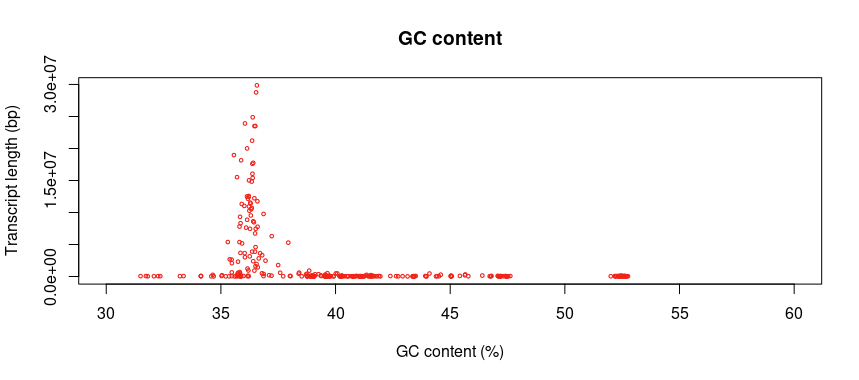

# TotalChangeLog

# **20250905**

```bash
1.download data from OIST
/raid5/COMMON/EQUA_PACBIO_OIST_cladeA_2025$ less m84168_250825_102014_s2_fastq.zip

2.make a new folder in rick

/raid5/rick/DATA/EQUA_PACBIO_OIST_cladeA_2025$

3.run nohup4

rick@aurelia:/raid5/rick/DATA/EQUA_PACBIO_OIST_cladeA_2025$ nohup /opt/hi

hifiasm-0.25.0/ hisat2-2.2.1/

rick@aurelia:/raid5/rick/DATA/EQUA_PACBIO_OIST_cladeA_2025$ nohup /opt/hifiasm-0.25.0/hifiasm -o EQUA_A_r01 -t64 m841 68_250825_102014_s2.fastq &

[1] 2374139

rick@aurelia:/raid5/rick/DATA/EQUA_PACBIO_OIST_cladeA_2025$ nohup: ignoring input and appending output to 'nohup.out’
```

# **20290908**

```bash
1. Finished hifiasm-0.25.0/ hisat2-2.2.1/, and mix hap1 + hap2 = p-cfg file

2. use /raid5/scripts/fasinfo_get.pl -i 500000 EQUA_A_r01.bp.hap1.p_ctg.fasta to show calculation

Input FASTA File: EQUA_A_r01.bp.hap1.p_ctg.fasta

3. Use Conda(Python)

4. Run BUSCO
root@aurelia:/raid5/kostya/RESULTS/EQUA_cladeA_2025# ls -lha
total 1.9G
drwxrwxr-x  6 kostya kostya 4.0K Sep  5 19:43 .
drwxrwxr-x 21 kostya kostya 4.0K Sep  5 18:52 ..
drwxrwxr-x  4 kostya kostya  190 Sep  5 19:25 BUSCO_OUT_hap1
drwxrwxr-x  4 kostya kostya  190 Sep  5 19:34 BUSCO_OUT_hap2
drwxrwxr-x  4 kostya kostya  192 Sep  5 19:43 BUSCO_OUT_p_ctg

5. Prepare to produce table → rename → convert to FASTA
```

# **20250909**

```bash
Run RepeatModeler for hap1
kaisar@aurelia:/raid5/kaisar/EQUA_cladeA$ conda activate repeatmodeler
(repeatmodeler) kaisar@aurelia:/raid5/kaisar/EQUA_cladeA$ BuildDatabase -name equa_hap1 equa_hap1_processed.fasta
```

# **20250910**

```bash
##1.Check repetitive code

kaisar@aurelia:/raid5/kaisar/EQUA_cladeA$ grep -c '>' equa_hap1-families.fa equa_pctg-families.fa

equa_hap1-families.fa:5118

equa_pctg-families.fa:5179

##2.copy equa_hap2_processed.fasta to /raid5/kaisar/EQUA_cladeA

cp /raid5/rick/DATA/EQUA_PACBIO_OIST_cladeA_rename/equa_hap2_processed.fasta .

##3.Build database and run RepeatModeler for hap2

(repeatmodeler) kaisar@aurelia:/raid5/kaisar/EQUA_cladeA$ BuildDatabase -name equa_hap2 equa_hap2_processed.fasta

Building database equa_hap2:

Reading equa_hap2_processed.fasta...

Number of sequences (bp) added to database: 229 ( 615548026 bp )

(repeatmodeler) kaisar@aurelia:/raid5/kaisar/EQUA_cladeA$ nohup RepeatModeler -database equa_hap2 -threads 48 &

[1] 1022879

(repeatmodeler) kaisar@aurelia:/raid5/kaisar/EQUA_cladeA$ nohup: ignoring input and appending output to 'nohup.out'

1. Start RepeatMasker for “equa-pctg-processed.fasta”

(repeatmodeler) kaisar@aurelia:/raid5/kaisar/EQUA_cladeA$ nohup RepeatMasker -pa 16 -xsmall -dir /raid5/kaisar/EQUA_cladeA/RM_pctg_r01 -gff -lib equa_hap1-families.fa equa_pctg_processed.fasta > RM_pctg_r01.log 2>&1 &

- rw-rw-r-- 1 kaisar kaisar 4.1M Sep 9 22:16 equa_hap1-families.fa <= all repeats
- rw-rw-r-- 1 kaisar kaisar 119M Sep 9 22:16 equa_hap1-families.stk <= repeats in STK format
- rw-rw-r-- 1 kaisar kaisar 7.0K Sep 9 22:16 equa_hap1-rmod.log <= short version of log file (long log file is "nohup_hap1.out").

started RepatModeler run with 'equa_pctg_processed.fasta' (renamed "primary" back to "pctg"):

#

(repeatmodeler) kaisar@aurelia:/raid5/kaisar/EQUA_cladeA$ BuildDatabase -name equa_pctg equa_pctg_processed.fasta

Building database equa_pctg:

Reading equa_pctg_processed.fasta...

Number of sequences (bp) added to database: 331 ( 726511325 bp )

#

(repeatmodeler) kaisar@aurelia:/raid5/kaisar/EQUA_cladeA$ nohup RepeatModeler -database equa_pctg -threads 48 &

[1] 3731303

(repeatmodeler) kaisar@aurelia:/raid5/kaisar/EQUA_cladeA$ nohup: ignoring input and appending output to 'nohup.out'

# it is running now on 48 cores

By using repeats in "equa_hap1-families.fa" and "equa_hap1_processed.fasta" genome I started RepeatMasker:

## run RepeatMasker on hap1 with equa_hap1-families.fa

(repeatmodeler) kaisar@aurelia:ls -lha $ nohup RepeatMasker -pa 16 -xsmall -dir /raid5/kaisar/EQUA_cladeA/RM_hap1_r01 -gff -lib equa_hap1-families.fa equa_hap1_processed.fasta > RM_hap1_r01.log 2>&1 &

As a result we should get soft-masked genome assembly for haplotype1 (where all repetitive sequences are shown in lowercase letters).

kaisar@aurelia:/raid5/kaisar/EQUA_cladeA$ less equa_pctg-families.fa

kaisar@aurelia:/raid5/kaisar/EQUA_cladeA$ grep -c '>' equa_hap1-families.fa equa_pctg-families.fa

equa_hap1-families.fa:5118

equa_pctg-families.fa:5179

kaisar@aurelia:/raid5/kaisar/EQUA_cladeA$ conda activate repeatmodeler

(repeatmodeler) kaisar@aurelia:/raid5/kaisar/EQUA_cladeA$ cp /raid5/rick/DATA/EQUA_PACBIO_OIST_cladeA_rename/equa_hap2_processed.fasta .

(repeatmodeler) kaisar@aurelia:/raid5/kaisar/EQUA_cladeA$ BuildDatabase -name equa_hap2 equa_hap2_processed.fasta

Building database equa_hap2:

Reading equa_hap2_processed.fasta...

Number of sequences (bp) added to database: 229 ( 615548026 bp )

(repeatmodeler) kaisar@aurelia:/raid5/kaisar/EQUA_cladeA$ nohup RepeatModeler -database equa_hap2 -threads 48 &

[1] 1022879

(repeatmodeler) kaisar@aurelia:/raid5/kaisar/EQUA_cladeA$ nohup: ignoring input and appending output to 'nohup.out'

(repeatmodeler) kaisar@aurelia:/raid5/kaisar/EQUA_cladeA$ nohup RepeatMasker -pa 16 -xsmall -dir /raid5/kaisar/EQUA_cladeA/RM_pctg_r01 -gff -lib equa_hap1-families.fa equa_pctg_processed.fasta > RM_pctg_r01.log 2>&1 &

(repeatmodeler) kaisar@aurelia:/raid5/kaisar/EQUA_cladeA$

rick@aurelia:~$ cd /raid5

rick@aurelia:/raid5/rick/DATA/EQUA_PACBIO_OIST_cladeA_rename$ cd /opt

- rwxrwxr-x 1 root root 593 Nov 6 2014 machTest.sh
- rw-rw-r-- 1 root root 412 Nov 6 2014 makefile

drwxrwxr-x 7 root root 114 Oct 30 2014 utils

drwxrwxr-x 2 root root 116 Nov 6 2014 webBlat

rick@aurelia:/opt/blat-3.6$ cd bin

rick@aurelia:/opt/blat-3.6/bin$ ls

blat

rick@aurelia:/opt/blat-3.6/bin$

EQUA_PACBIO_OIST_cladeA_2025 EQUA_PACBIO_OIST_cladeA_rename

rick@aurelia:/raid5/rick/DATA/EQUA_PACBIO_OIST_cladeA_rename$ 

- rw-rw-r-- 1 rick rick 666M Sep 8 15:02 EQUA_A_r01.bp.hap1.p_ctg.fasta
- rw-rw-r-- 1 rick rick 666M Sep 8 15:17 EQUA_A_r01.bp.hap1.p_ctg.fasta.TAB
- rw-rw-r-- 1 rick rick 666M Sep 8 15:18 EQUA_A_r01.bp.hap1.p_ctg.fasta.TAB.sorted
- rw-rw-r-- 1 rick rick 588M Sep 8 15:02 EQUA_A_r01.bp.hap2.p_ctg.fasta
- rw-rw-r-- 1 rick rick 588M Sep 8 15:23 EQUA_A_r01.bp.hap2.p_ctg.fasta.TAB
- rw-rw-r-- 1 rick rick 588M Sep 8 15:23 EQUA_A_r01.bp.hap2.p_ctg.fasta.TAB.sorted
- rw-rw-r-- 1 rick rick 693M Sep 8 15:02 EQUA_A_r01.bp.p_ctg.fasta
- rw-rw-r-- 1 rick rick 693M Sep 8 15:24 EQUA_A_r01.bp.p_ctg.fasta.TAB
- rw-rw-r-- 1 rick rick 693M Sep 8 15:24 EQUA_A_r01.bp.p_ctg.fasta.TAB.sorted
- rw-rw-r-- 1 rick rick 672M Sep 8 15:19 equa_hap1_processed.fasta
- rw-rw-r-- 1 rick rick 6.8K Sep 8 15:31 equa_hap1_processed.fasta.STAT
- rw-rw-r-- 1 rick rick 593M Sep 8 15:24 equa_hap2_processed.fasta
- rw-rw-r-- 1 rick rick 6.4K Sep 8 15:37 equa_hap2_processed.fasta.STAT
- rw-rw-r-- 1 rick rick 700M Sep 8 15:25 equa_primary_processed.fasta
- rw-rw-r-- 1 rick rick 6.8K Sep 8 15:37 equa_primary_processed.fasta.STAT

rick@aurelia:/raid5/rick/DATA/EQUA_PACBIO_OIST_cladeA_rename$

rick@aurelia:/raid5/rick/DATA/EQUA_PACBIO_OIST_cladeA_rename$ /raid5/rick/DATA/EQUA_PACBIO_OIST_cladeA_renameequa_hap2_processed.fasta^C

rick@aurelia:/raid5/rick/DATA/EQUA_PACBIO_OIST_cladeA_rename$ cd /opt

rick@aurelia:/opt$ cd blat-3.6

rick@aurelia:/opt/blat-3.6$ ls -lha

total 60K

drwxrwxr-x 12 root root 4.0K Mar 17 20:03 .

drwxr-xr-x 25 root root 4.0K Jul 10 20:39 ..

drwxr-xr-x 2 root root 26 Mar 17 20:05 bin

drwxrwxr-x 3 root root 4.0K Mar 17 20:03 blat

drwxrwxr-x 2 root root 4.0K Mar 17 20:05 gfClient

drwxrwxr-x 3 root root 4.0K Nov 6 2014 gfServer

drwxrwxr-x 5 root root 69 Nov 6 2014 hg

drwxrwxr-x 2 root root 8.0K Mar 17 20:02 inc

drwxrwxr-x 3 root root 4.0K Mar 17 20:05 jkOwnLib

drwxrwxr-x 10 root root 12K Mar 17 20:05 lib

rwxrwxr-x 1 root root 593 Nov 6 2014 machTest.sh

rw-rw-r-- 1 root root 412 Nov 6 2014 makefile

drwxrwxr-x 7 root root 114 Oct 30 2014 utils

drwxrwxr-x 2 root root 116 Nov 6 2014 webBlat

rick@aurelia:/opt/blat-3.6$ cd bin

rick@aurelia:/opt/blat-3.6/bin$ ls

blat

rick@aurelia:/opt/blat-3.6/bin$
```

genome2tableNCBI_wSize.sh

# 20250911

```bash
# do BLAT for clade A
# map clade A transcriptome against clade A   

#find clade A ref transcriptome 
/raid5/kaisar/CladeA_ref_transcriptome

#select transcripts >= 500bp

# split transcriptome into multiple parts(12 parts)

(repeatmodeler) kaisar@aurelia:/raid5/kaisar/CladeA_ref_transcriptome$ /opt/Augustus-3.5.0/scripts/splitMfasta.pl Equa_CladeA_250715.fasta.mod01.clean.me500bp --minsize=12000000 --outputpath=/raid5/kaisar/CladeA_ref_transcriptome/BLAT_IN

#run jobs on 24 cores -> *.psl file

# filter by length match (> 80%)

#convert into *.gff for Augustus hints

(repeatmodeler) kaisar@aurelia:/raid5/kaisar/CladeA_ref_transcriptome$ awk -F"\t" '{printf"%s%s%s\n%s\n",$1," length=",$2,$3}' Equa_CladeA_250715.fasta.mod01.clean.TAB.me500bp | head -n5 -
977  >tr53_c0_g1_i1 length=619
978  CTAATGCTAACAAGTAAAGCTACAGTGATTGGGCTTCCTGTGTCACGTACCAGTACCCAGTACTCCTCTGCAAGACCCAGCTCCCATCATGCTGTTCGGACCTACGAAAGGCCTCTTCGCCATTTTTCTCCGGCTGGAGTTAAAACATCTCAGCCAAAATGGTTATGCCAGTGAATAAACCAAAGATTCTCAAAAAGAGAAGAAAGCGGTTTATCAGACATCAGTCTGACCGCTACAAGCGTGTTGGGGAAAGCTGGCGCAAACCCAAAGGTATTGACAACAGGGTACGACGTAGGTTCAAGGGCCAATATTTGATGCCAAGCATTGGTTATGGCAGCAACCGCAAAACTAGACACTTAATGCCTGATGGCTTTAAAAAGTTTGTTGTTCAAAACGTCAAGGAACTTGAGGTGATGATGATGTTGAACAGAAGCTATGCTGCTGAAATTGCCCACAACGTCTCCAGCAGAAAACGAAAAGAGATTGTTGAGAGGGCACAGCAACTGTCAATCAAGGTCACTAATAGTAGTGCTCGGCTACGTAGTGAAGAAAATGAGTAAACTGTTGTCTTTCTGTAAAATAAACAATTATCAATCAAAAAAAAAAAAAAAAAAAAAAA
979  >tr18_c0_g1_i1 length=2884
980  CTTTAAATTAAAATTTATTTTGAATAATTAATTTCGAGTAGGAATCTTTCAATGTGGAATTATTTTACACGTACGAAAAAGCTTTAAAAATATCAAATGTTCCAGTGCGTTTAAACATAACTTTTGACGGGTGGGTTCCGAAGTTCGTTCCCAACTTCATTGGCGAATTTCGAACTTCTCACAAAAATTCGATAGAATTGAGGTTAGATTTTGAGTTATAGCAATGGAAGATACTGCCGAGAAGCTTAAAGGCATGGTTGTTAACTTTATAAAACAATATATGCGGGTATCATGGATAATGTCCTTGATCCTAGCGAATTACCAAGGGAGATACAGAATTTTTGAAGAAGGGGTTCAAAACCTACTTAAAACAGGGGATGAGCTAAAAGGGGGAATCGCGACCCCCCCGAACATCCCCTGGATCCACCCTTGATTACTGAGATTGGGAAGTAAGGTCGAAGTTCACCAAGAAGTCGGTTTGAGGAACGAACTTCGGAACGAACTTCGGAACCCACTCGTCAAAAATTATACGCACTGTAAATGAATAAGGAGTGCTGCGACCTGGGTGCTGCATCATTACAAGCTCTGTTCACCTTCTGGAACACATCCATTTTATCGTCTGCAGGAAACAACTGCTTGTCTAAAAGAAATTATAATTCGATATTTTCTTTTCGCAGTTCACGGTTAATCTACCATTGTGAAGAAAGATGGCGAGTACACTTCTACTCAGTTTTGTAGTGATTGTGGCATTGGTTGAATTGAAGCTTGGAGGCTCTGTCGAATTTAATTACGACACATCAGATGCCAAATATGGGCCTAAAGGCTGGGCTAAAACATACAAAGATTATTGTGGCGGTTCAAAACAATCACCCATCGACATCGAAACTTCGAAAACTGAATTTAATTCTAGTTTAGGGGATTTCAAGCTTGAGAATTTCGATTCTGTTCCAAGTGGAGCAAAAATCGAGGCCAGTAACGATGGACATGGCTACAAGGTAACTGTCCAGCCTAAAACATTCAGAGTGAGTGGAGGAGGACTAACTGGTGAATACAGTACTGCGCAGTTTCATTTCCACTGGGGAAGTGTGGATACCAAGGGATCCGAGCATACAGTAGACACGAAAATGTACCCAGCCGAGTTGCATTTTGTCAACTACAATTTGAAGTACTCAAACCTTAGCGAAGCTGTGAGCAAACCCGATGGACTTGCAGTTTTAGGGGTCATATATGAGGTTGGCTCGACTGAAAATGAAGCTCTTACATCGTTTTTGCAATACGCAACTAATGTGTCCAAACCGTCTAAATTAAAGGACGTAACTATGCCTAGTAAACTTGATTCTCTCCTTCCATCAAACATCACTGCATACTACCGATACATGGGTGGTTTGACAACACCAACGTGCAACGAGGTCGTCACCTGGACCGTCTTCAAGCAGCGCGTTACCATCACCGCAAGTCAGTTGAACATGCTCCGAGGTCTCAAACAAGCAGACAATACTACCGCTTTGACGGACACGTTTCGCCCTGTTCAATCTCTGAATTCTCGTGATGTTAAGAGAAGTTATGGAGCCCTTCCACCAACCACAGGTCCAACCACAGGTCCAACCAGTGGAGCTTATCACGTGTCAAACACCATGGCAACCGTTGTGTCCGTTGTCATGGCAATTTCAGTTGTTTTTTTGTGAACCATTCTTGGCATTATTGCGTCAGTAATTTCTTTTTTTGTTCTAGTGTTTATTTCTTATAATTAGTATCTAGATAGTAGTAATCCACTATAAGTGTGAATCGATAGAGCAGATTTCGTATGACTGTGAAAAAAGTACGTCCTGAACGTGCCGTGCCGTGACCGTGCCGTGAACACCACATTTTGATTGGGTTTCGCAAATGTTTCTTCCGTGAGCAAATGTCAACACGGCCGTGCCGTGGCGTGCCGTACCGTGACGTGCCGTGCCGTGATACACCGATGTGTGAAAGCAATGTGATTGGATGAGAATTGACGCGCGCGCCTTGCGATTGGCTTGCAAAAGAAGCCGTTTGAGCGTTCGATGACGTGACACGTTGACTTGAAATGTTTTGCCTTGCATGATTGGAGGAATCCGTGCCGTGACCGTGTCGCGTGCCGTGTTTTTTCACAGTCATACGAAATCTGCTCTATGGCAAATTCTTAGTCGTAACACATTTGAACGTAACCGTATCTACGAGTTGTGATTGTAATTGGGAGAATCGCACAAAAAAACAATGAAAAGCTATTTCATTGTTACGGTACGTCGTACCGTGTAGCTGTTTTTTAATTTTTTCTTACATATTCGACATTCTATAATCAACGCTTTTAATATTTTAATTTTATTCATAATAGGCCTTCTCCGAATGCGCTTGAGTGACCACAAGACAATGGTTCCAAGACGAGGCGTAGCTTGATGTTTTCATACATTTACTGTATTTCTCAAGTCCTGCCTCGTCTTGTCTTGGATCCATTTTATCGTGGTCACTCAAGCGAATATCAATTCGGGAAGGTCCCATTATTGCTTAGGATTTAAATTTAAGAGTCATTAGGCCCCACCAAGTAAAAATTTAGTAAATGATGCAATTTGTTGATATAGAAATTAATGATGGTTTGACCGTTAGATTATTGAAATGCCAATAAAATGCGAACAAAATGTGCACAAAAGATAATGTAGATTATTCTTTGACAAGTTGTGTTATATGCCTAATATGGTTGATTGAAAATTATAAATGCATAACTTGCAATACATAAATCATACAAATAGTAGTTTCAATCAACTTTATGGTTCACGGTCGTCATTGTTTTCCGAATTTGTCTTGAATCGTGAACATAGCTCGAACTTGATCAAACATTTCAAAATAACTTGTCAACAAAAGCAAA
981  >tr18_c0_g1_i11 length=2502
982  (repeatmodeler) kaisar@aurelia:/raid5/kaisar/CladeA_ref_transcriptome$ head -n2 Equa_CladeA_250715.fasta.mod01.clean.TAB.me500bp
983  >tr53_c0_g1_i1  619     CTAATGCTAACAAGTAAAGCTACAGTGATTGGGCTTCCTGTGTCACGTACCAGTACCCAGTACTCCTCTGCAAGACCCAGCTCCCATCATGCTGTTCGGACCTACGAAAGGCCTCTTCGCCATTTTTCTCCGGCTGGAGTTAAAACATCTCAGCCAAAATGGTTATGCCAGTGAATAAACCAAAGATTCTCAAAAAGAGAAGAAAGCGGTTTATCAGACATCAGTCTGACCGCTACAAGCGTGTTGGGGAAAGCTGGCGCAAACCCAAAGGTATTGACAACAGGGTACGACGTAGGTTCAAGGGCCAATATTTGATGCCAAGCATTGGTTATGGCAGCAACCGCAAAACTAGACACTTAATGCCTGATGGCTTTAAAAAGTTTGTTGTTCAAAACGTCAAGGAACTTGAGGTGATGATGATGTTGAACAGAAGCTATGCTGCTGAAATTGCCCACAACGTCTCCAGCAGAAAACGAAAAGAGATTGTTGAGAGGGCACAGCAACTGTCAATCAAGGTCACTAATAGTAGTGCTCGGCTACGTAGTGAAGAAAATGAGTAAACTGTTGTCTTTCTGTAAAATAAACAATTATCAATCAAAAAAAAAAAAAAAAAAAAAAA
984  >tr18_c0_g1_i1  2884    CTTTAAATTAAAATTTATTTTGAATAATTAATTTCGAGTAGGAATCTTTCAATGTGGAATTATTTTACACGTACGAAAAAGCTTTAAAAATATCAAATGTTCCAGTGCGTTTAAACATAACTTTTGACGGGTGGGTTCCGAAGTTCGTTCCCAACTTCATTGGCGAATTTCGAACTTCTCACAAAAATTCGATAGAATTGAGGTTAGATTTTGAGTTATAGCAATGGAAGATACTGCCGAGAAGCTTAAAGGCATGGTTGTTAACTTTATAAAACAATATATGCGGGTATCATGGATAATGTCCTTGATCCTAGCGAATTACCAAGGGAGATACAGAATTTTTGAAGAAGGGGTTCAAAACCTACTTAAAACAGGGGATGAGCTAAAAGGGGGAATCGCGACCCCCCCGAACATCCCCTGGATCCACCCTTGATTACTGAGATTGGGAAGTAAGGTCGAAGTTCACCAAGAAGTCGGTTTGAGGAACGAACTTCGGAACGAACTTCGGAACCCACTCGTCAAAAATTATACGCACTGTAAATGAATAAGGAGTGCTGCGACCTGGGTGCTGCATCATTACAAGCTCTGTTCACCTTCTGGAACACATCCATTTTATCGTCTGCAGGAAACAACTGCTTGTCTAAAAGAAATTATAATTCGATATTTTCTTTTCGCAGTTCACGGTTAATCTACCATTGTGAAGAAAGATGGCGAGTACACTTCTACTCAGTTTTGTAGTGATTGTGGCATTGGTTGAATTGAAGCTTGGAGGCTCTGTCGAATTTAATTACGACACATCAGATGCCAAATATGGGCCTAAAGGCTGGGCTAAAACATACAAAGATTATTGTGGCGGTTCAAAACAATCACCCATCGACATCGAAACTTCGAAAACTGAATTTAATTCTAGTTTAGGGGATTTCAAGCTTGAGAATTTCGATTCTGTTCCAAGTGGAGCAAAAATCGAGGCCAGTAACGATGGACATGGCTACAAGGTAACTGTCCAGCCTAAAACATTCAGAGTGAGTGGAGGAGGACTAACTGGTGAATACAGTACTGCGCAGTTTCATTTCCACTGGGGAAGTGTGGATACCAAGGGATCCGAGCATACAGTAGACACGAAAATGTACCCAGCCGAGTTGCATTTTGTCAACTACAATTTGAAGTACTCAAACCTTAGCGAAGCTGTGAGCAAACCCGATGGACTTGCAGTTTTAGGGGTCATATATGAGGTTGGCTCGACTGAAAATGAAGCTCTTACATCGTTTTTGCAATACGCAACTAATGTGTCCAAACCGTCTAAATTAAAGGACGTAACTATGCCTAGTAAACTTGATTCTCTCCTTCCATCAAACATCACTGCATACTACCGATACATGGGTGGTTTGACAACACCAACGTGCAACGAGGTCGTCACCTGGACCGTCTTCAAGCAGCGCGTTACCATCACCGCAAGTCAGTTGAACATGCTCCGAGGTCTCAAACAAGCAGACAATACTACCGCTTTGACGGACACGTTTCGCCCTGTTCAATCTCTGAATTCTCGTGATGTTAAGAGAAGTTATGGAGCCCTTCCACCAACCACAGGTCCAACCACAGGTCCAACCAGTGGAGCTTATCACGTGTCAAACACCATGGCAACCGTTGTGTCCGTTGTCATGGCAATTTCAGTTGTTTTTTTGTGAACCATTCTTGGCATTATTGCGTCAGTAATTTCTTTTTTTGTTCTAGTGTTTATTTCTTATAATTAGTATCTAGATAGTAGTAATCCACTATAAGTGTGAATCGATAGAGCAGATTTCGTATGACTGTGAAAAAAGTACGTCCTGAACGTGCCGTGCCGTGACCGTGCCGTGAACACCACATTTTGATTGGGTTTCGCAAATGTTTCTTCCGTGAGCAAATGTCAACACGGCCGTGCCGTGGCGTGCCGTACCGTGACGTGCCGTGCCGTGATACACCGATGTGTGAAAGCAATGTGATTGGATGAGAATTGACGCGCGCGCCTTGCGATTGGCTTGCAAAAGAAGCCGTTTGAGCGTTCGATGACGTGACACGTTGACTTGAAATGTTTTGCCTTGCATGATTGGAGGAATCCGTGCCGTGACCGTGTCGCGTGCCGTGTTTTTTCACAGTCATACGAAATCTGCTCTATGGCAAATTCTTAGTCGTAACACATTTGAACGTAACCGTATCTACGAGTTGTGATTGTAATTGGGAGAATCGCACAAAAAAACAATGAAAAGCTATTTCATTGTTACGGTACGTCGTACCGTGTAGCTGTTTTTTAATTTTTTCTTACATATTCGACATTCTATAATCAACGCTTTTAATATTTTAATTTTATTCATAATAGGCCTTCTCCGAATGCGCTTGAGTGACCACAAGACAATGGTTCCAAGACGAGGCGTAGCTTGATGTTTTCATACATTTACTGTATTTCTCAAGTCCTGCCTCGTCTTGTCTTGGATCCATTTTATCGTGGTCACTCAAGCGAATATCAATTCGGGAAGGTCCCATTATTGCTTAGGATTTAAATTTAAGAGTCATTAGGCCCCACCAAGTAAAAATTTAGTAAATGATGCAATTTGTTGATATAGAAATTAATGATGGTTTGACCGTTAGATTATTGAAATGCCAATAAAATGCGAACAAAATGTGCACAAAAGATAATGTAGATTATTCTTTGACAAGTTGTGTTATATGCCTAATATGGTTGATTGAAAATTATAAATGCATAACTTGCAATACATAAATCATACAAATAGTAGTTTCAATCAACTTTATGGTTCACGGTCGTCATTGTTTTCCGAATTTGTCTTGAATCGTGAACATAGCTCGAACTTGATCAAACATTTCAAAATAACTTGTCAACAAAAGCAAA
985  (repeatmodeler) kaisar@aurelia:/raid5/kaisar/CladeA_ref_transcriptome$ awk -F"\t" '{printf"%s%s%s\n%s\n",$1," length=",$2,$3}' Equa_CladeA_250715.fasta.mod01.clean.TAB.me500bp | fold -w 100 - | head -n20 -
986  >tr53_c0_g1_i1 length=619
987  CTAATGCTAACAAGTAAAGCTACAGTGATTGGGCTTCCTGTGTCACGTACCAGTACCCAGTACTCCTCTGCAAGACCCAGCTCCCATCATGCTGTTCGGA
988  CCTACGAAAGGCCTCTTCGCCATTTTTCTCCGGCTGGAGTTAAAACATCTCAGCCAAAATGGTTATGCCAGTGAATAAACCAAAGATTCTCAAAAAGAGA
989  AGAAAGCGGTTTATCAGACATCAGTCTGACCGCTACAAGCGTGTTGGGGAAAGCTGGCGCAAACCCAAAGGTATTGACAACAGGGTACGACGTAGGTTCA
990  AGGGCCAATATTTGATGCCAAGCATTGGTTATGGCAGCAACCGCAAAACTAGACACTTAATGCCTGATGGCTTTAAAAAGTTTGTTGTTCAAAACGTCAA
991  GGAACTTGAGGTGATGATGATGTTGAACAGAAGCTATGCTGCTGAAATTGCCCACAACGTCTCCAGCAGAAAACGAAAAGAGATTGTTGAGAGGGCACAG
992  CAACTGTCAATCAAGGTCACTAATAGTAGTGCTCGGCTACGTAGTGAAGAAAATGAGTAAACTGTTGTCTTTCTGTAAAATAAACAATTATCAATCAAAA
993  AAAAAAAAAAAAAAAAAAA
994  >tr18_c0_g1_i1 length=2884
995  CTTTAAATTAAAATTTATTTTGAATAATTAATTTCGAGTAGGAATCTTTCAATGTGGAATTATTTTACACGTACGAAAAAGCTTTAAAAATATCAAATGT
996  TCCAGTGCGTTTAAACATAACTTTTGACGGGTGGGTTCCGAAGTTCGTTCCCAACTTCATTGGCGAATTTCGAACTTCTCACAAAAATTCGATAGAATTG
997  AGGTTAGATTTTGAGTTATAGCAATGGAAGATACTGCCGAGAAGCTTAAAGGCATGGTTGTTAACTTTATAAAACAATATATGCGGGTATCATGGATAAT
998  GTCCTTGATCCTAGCGAATTACCAAGGGAGATACAGAATTTTTGAAGAAGGGGTTCAAAACCTACTTAAAACAGGGGATGAGCTAAAAGGGGGAATCGCG
999  ACCCCCCCGAACATCCCCTGGATCCACCCTTGATTACTGAGATTGGGAAGTAAGGTCGAAGTTCACCAAGAAGTCGGTTTGAGGAACGAACTTCGGAACG
1000  AACTTCGGAACCCACTCGTCAAAAATTATACGCACTGTAAATGAATAAGGAGTGCTGCGACCTGGGTGCTGCATCATTACAAGCTCTGTTCACCTTCTGG
1001  AACACATCCATTTTATCGTCTGCAGGAAACAACTGCTTGTCTAAAAGAAATTATAATTCGATATTTTCTTTTCGCAGTTCACGGTTAATCTACCATTGTG
1002  AAGAAAGATGGCGAGTACACTTCTACTCAGTTTTGTAGTGATTGTGGCATTGGTTGAATTGAAGCTTGGAGGCTCTGTCGAATTTAATTACGACACATCA
1003  GATGCCAAATATGGGCCTAAAGGCTGGGCTAAAACATACAAAGATTATTGTGGCGGTTCAAAACAATCACCCATCGACATCGAAACTTCGAAAACTGAAT
1004  TTAATTCTAGTTTAGGGGATTTCAAGCTTGAGAATTTCGATTCTGTTCCAAGTGGAGCAAAAATCGAGGCCAGTAACGATGGACATGGCTACAAGGTAAC
1005  TGTCCAGCCTAAAACATTCAGAGTGAGTGGAGGAGGACTAACTGGTGAATACAGTACTGCGCAGTTTCATTTCCACTGGGGAAGTGTGGATACCAAGGGA
1006  (repeatmodeler) kaisar@aurelia:/raid5/kaisar/CladeA_ref_transcriptome$ awk -F"\t" '{printf"%s%s%s\n%s\n",$1," length=",$2,$3}' Equa_CladeA_250715.fasta.mod01.clean.TAB.me500bp | fold -w 100 - > Equa_CladeA_250715.fasta.mod01.clean.me500bp

1046  (repeatmodeler) kaisar@aurelia:/raid5/kaisar/CladeA_ref_transcriptome$ grep -c '>' Equa_CladeA_250715.fasta.mod01.clean.me500bp
1047  124499
1048  (repeatmodeler) kaisar@aurelia:/raid5/kaisar/CladeA_ref_transcriptome$ wc -l Equa_CladeA_250715.fasta.mod01.clean.TAB.me500bp
1049  124499 Equa_CladeA_250715.fasta.mod01.clean.TAB.me500bp
1050  (repeatmodeler) kaisar@aurelia:/raid5/kaisar/CladeA_ref_transcriptome$ /raid5/scripts/fasinfo_get.pl Equa_CladeA_250715.fasta.mod01.clean.me500bp > Equa_CladeA_250715.fasta.mod01.clean.me500bp.STAT
1051  (repeatmodeler) kaisar@aurelia:/raid5/kaisar/CladeA_ref_transcriptome$ less Equa_CladeA_250715.fasta.mod01.clean.me500bp.STAT
1052  (repeatmodeler) kaisar@aurelia:/raid5/kaisar/CladeA_ref_transcriptome$ mkdir BLAT_IN BLAT_OUT
1053  (repeatmodeler) kaisar@aurelia:/raid5/kaisar/CladeA_ref_transcriptome$ /opt/Augustus-3.5.0/scripts/splitMfasta.pl Equa_CladeA_250715.fasta.mod01.clean.me500bp --minsize=12000000 --outputpath=/raid5/kaisar/CladeA_ref_transcriptome/BLAT_IN

1056  (repeatmodeler) kaisar@aurelia:/raid5/kaisar/CladeA_ref_transcriptome$ cd BLAT_IN/
1057  (repeatmodeler) kaisar@aurelia:/raid5/kaisar/CladeA_ref_transcriptome/BLAT_IN$ ls -lha
1058  total 141M
1059  drwxrwxr-x  2 kaisar kaisar 4.0K Sep 10 14:55 .
1060  drwxrwxr-x 14 kaisar kaisar 4.0K Sep 10 14:52 ..
1061  -rw-rw-r--  1 kaisar kaisar  12M Sep 10 14:55 Equa_CladeA_250715.fasta.mod01.clean.me500bp.split.1.fa
1062  -rw-rw-r--  1 kaisar kaisar  12M Sep 10 14:55 Equa_CladeA_250715.fasta.mod01.clean.me500bp.split.10.fa
1063  -rw-rw-r--  1 kaisar kaisar  12M Sep 10 14:55 Equa_CladeA_250715.fasta.mod01.clean.me500bp.split.11.fa
1064  -rw-rw-r--  1 kaisar kaisar 9.7M Sep 10 14:55 Equa_CladeA_250715.fasta.mod01.clean.me500bp.split.12.fa
1065  -rw-rw-r--  1 kaisar kaisar  12M Sep 10 14:55 Equa_CladeA_250715.fasta.mod01.clean.me500bp.split.2.fa
1066  -rw-rw-r--  1 kaisar kaisar  12M Sep 10 14:55 Equa_CladeA_250715.fasta.mod01.clean.me500bp.split.3.fa
1067  -rw-rw-r--  1 kaisar kaisar  12M Sep 10 14:55 Equa_CladeA_250715.fasta.mod01.clean.me500bp.split.4.fa
1068  -rw-rw-r--  1 kaisar kaisar  12M Sep 10 14:55 Equa_CladeA_250715.fasta.mod01.clean.me500bp.split.5.fa
1069  -rw-rw-r--  1 kaisar kaisar  12M Sep 10 14:55 Equa_CladeA_250715.fasta.mod01.clean.me500bp.split.6.fa
1070  -rw-rw-r--  1 kaisar kaisar  12M Sep 10 14:55 Equa_CladeA_250715.fasta.mod01.clean.me500bp.split.7.fa
1071  -rw-rw-r--  1 kaisar kaisar  12M Sep 10 14:55 Equa_CladeA_250715.fasta.mod01.clean.me500bp.split.8.fa
1072  -rw-rw-r--  1 kaisar kaisar  12M Sep 10 14:55 Equa_CladeA_250715.fasta.mod01.clean.me500bp.split.9.fa
1073  (repeatmodeler) kaisar@aurelia:/raid5/kaisar/CladeA_ref_transcriptome/BLAT_IN$ grep -c '>' *.fa
1074  Equa_CladeA_250715.fasta.mod01.clean.me500bp.split.1.fa:8342
1075  Equa_CladeA_250715.fasta.mod01.clean.me500bp.split.10.fa:12072
1076  Equa_CladeA_250715.fasta.mod01.clean.me500bp.split.11.fa:12653
1077  Equa_CladeA_250715.fasta.mod01.clean.me500bp.split.12.fa:12652
1078  Equa_CladeA_250715.fasta.mod01.clean.me500bp.split.2.fa:8306
1079  Equa_CladeA_250715.fasta.mod01.clean.me500bp.split.3.fa:8717
1080  Equa_CladeA_250715.fasta.mod01.clean.me500bp.split.4.fa:9278
1081  Equa_CladeA_250715.fasta.mod01.clean.me500bp.split.5.fa:9487
1082  Equa_CladeA_250715.fasta.mod01.clean.me500bp.split.6.fa:9994
1083  Equa_CladeA_250715.fasta.mod01.clean.me500bp.split.7.fa:10577
1084  Equa_CladeA_250715.fasta.mod01.clean.me500bp.split.8.fa:10925
1085  Equa_CladeA_250715.fasta.mod01.clean.me500bp.split.9.fa:11496
1086  (repeatmodeler) kaisar@aurelia:/raid5/kaisar/CladeA_ref_transcriptome/BLAT_IN$
1087  total 60K
1088  drwxrwxr-x 16 kaisar kaisar 4.0K Sep  9 16:37 .
1089  drwxrwxrwx 13 root   root    210 Sep  5 10:12 ..
1090  drwxrwxr-x 10 kaisar kaisar 4.0K Jul 11 17:21 AUGUSTUS
1091  drwxrwxr-x  4 kaisar kaisar 4.0K Jul 15 19:01 BLAT
1092  drwxrwxr-x 12 kaisar kaisar 4.0K Jul 29 14:42 CladeA_ref_transcriptome
1093  drwxrwxr-x  7 kaisar kaisar 4.0K Sep 10 12:46 EQUA_cladeA
1094  drwxrwxr-x  2 kaisar kaisar 4.0K Jul  4 17:45 Equa_clean_transcriptome
1095  drwxrwxr-x  9 kaisar kaisar 4.0K Jul 24 14:53 Equa_genepred
1096  drwxrwxr-x  3 kaisar kaisar   69 Jul 28 11:31 RAW_DATA
1097  drwxrwxr-x 10 kaisar kaisar 4.0K Jul 31 18:42 RNA_seq_AR_25072025
1098  drwxrwxr-x  4 kaisar kaisar 4.0K Jun 30 15:14 SGIG_23062025
1099  drwxrwxr-x  2 kaisar kaisar 4.0K Jun 18 16:08 SGIG_simple_last_dotplot
1100  drwxrwxr-x  5 kaisar kaisar   97 Jul 10 18:35 environments
1101  drwxrwxr-x  8 kaisar kaisar 8.0K Jul  9 15:06 equa_20samples
1102  drwxrwxr-x  4 kaisar kaisar 4.0K Jul 24 14:52 result
1103  drwxrwxr-x  2 kaisar kaisar  125 Jul  9 19:32 scripts
1104  (repeatmodeler) kaisar@aurelia:/raid5/kaisar$ cd CladeA_ref_transcriptome
1105  (repeatmodeler) kaisar@aurelia:/raid5/kaisar/CladeA_ref_transcriptome$ ls -lha
1141  (repeatmodeler) kaisar@aurelia:/raid5/kaisar/CladeA_ref_transcriptome$ less Equa_CladeA_250715.fasta.mod01.clean
1142  (repeatmodeler) kaisar@aurelia:/raid5/kaisar/CladeA_ref_transcriptome$ grep -c '>' Equa_CladeA_250715.fasta.m*

1192  less trA_vs_equa_pctg.1.psl.f06
1193  less /raid5/scripts/filterPSL.pl
1194  less trA_vs_equa_pctg_f05_all.psl
1195  less trA_vs_equa_pctg.1.psl.f06
1196  less filterPSL_parallel_woBEST.sh
1197  for i in {1..12}; do cat trA_vs_equa_pctg.${i}.psl >> trA_vs_equa_pctg_all.psl; done
1198  ls -lha
1199  less /raid5/scripts/filterPSL.pl
1200  cat trA_vs_equa_pctg_all.psl | /raid5/scripts/filterPSL.pl --minID=95 --minCover=80 --uniq > trA_vs_equa_pctg_all_f05uniq.psl
1201  ls -lha
1202  wc -l trA_vs_equa_pctg_all.psl trA_vs_equa_pctg_all_f05uniq.psl trA_vs_equa_pctg_f05_all.psl
1203  ls -lha /raid5/scripts
1204  ls
1205  cat trA_vs_equa_pctg_f05_all.psl | sort -k14,14 -k10,10 -k16,16n > trA_vs_equa_pctg_f05_all.psl.GFFsorted
1206  less trA_vs_equa_pctg_f05_all.psl.GFFsorted
1207  cat trA_vs_equa_pctg_f05_all.psl.GFFsorted | /raid5/scripts/blat2gff.pl -match EST_match > trA_vs_equa_pctg_f05_all.psl-for-jbrowse.gff
1208  less trA_vs_equa_pctg_f05_all.psl-for-jbrowse.gff

```

# 20250912

```bash
#RepeatMasker for hap2, send output  to RM_hap2_r01

(repeatmodeler) kaisar@aurelia:/raid5/kaisar/EQUA_cladeA$ nohup RepeatMasker -pa 16 -xsmall -dir /raid5/kaisar/EQUA_cladeA/RM_hap2_r01 \
-gff -lib equa_hap2-families.fa equa_hap2_processed.fasta \ RM_hap2_r01.log 2>&1 &

#split AR08 into multiple parts 

awk -F"\t" '{printf"%s%s%s\n%s\n",$1," length=",$2,$3}' AR08_no_symbiodinum.fasta.TAB.me500bp > AR08_no_symbiodinum.fasta.mod01.clean.TAB.me500bp | fold -w 100 - | head -n20 -

head -n2 AR08_no_symbiodinum.fasta.mod01.clean.TAB.me500bp

#BLAT for AR07_AR08
mkdir BLAT_IN BLAT_OUT

/opt/Augustus-3.5.0/scripts/splitMfasta.pl AR08_no_symbiodinum.fasta.mod01.clean.TAB.me500bp.fold100 --minsize=12000000 --outputpath=/raid5/kaisar/RNA_seq_AR_25072025/BLAT_IN
cd BLAT_IN

(repeatmodeler) kaisar@aurelia:/raid5/kaisar/RNA_seq_AR_25072025$ /opt/blat-3.6/bin/blat \
  /raid5/kaisar/EQUA_cladeA/RM_pctg_r01/equa_pctg_processed.fasta.masked \
  AR08_no_symbiodinum.fasta.mod01.clean.TAB.me500bp.fold100 \
  -makeOoc=11.ooc -ooc=11.ooc \
  -t=dna -q=rna \
  -noHead -minIdentity=95 -extendThroughN -fine \
  AR08_vs_genome.psl
Loading /raid5/kaisar/EQUA_cladeA/RM_pctg_r01/equa_pctg_processed.fasta.masked
Counting /raid5/kaisar/EQUA_cladeA/RM_pctg_r01/equa_pctg_processed.fasta.masked
Writing 11.ooc
Wrote 2453 overused 11-mers to 11.ooc
Done making 11.ooc

#do blat_parallel.sh for *.psl files 

nano blat_parallel.sh

for i in {1..10}
do
    nohup /opt/blat-3.6/bin/blat \
    -noHead -minIdentity=95 -extendThroughN -dots=100 \
    -fine -ooc=11.ooc -t=dna -q=rna \
    /raid5/kaisar/EQUA_cladeA/RM_pctg_r01/equa_pctg_processed.fasta.masked \
    BLAT_IN/AR08_fasta_split.${i}.fa \
    BLAT_OUT/AR08_vs_genome.${i}.psl \
    > BLAT_OUT/AR08_blat.${i}.log 2>&1 &
done

```

# 20250913

```bash
kaisar@aurelia:/raid5/kaisar/RNA_seq_AR_25072025/BLAT_OUT$ 

# combine results into one *.psl file
for i in {1..10}; do cat AR08_vs_genome.${i}.psl >> AR08_vs_genome.all.psl; done

# filter by length match( >= 80%)
cat AR08_vs_genome.f05.all.psl | /raid5/scripts/filterPSL.pl --minID=95 --minCover=80 --uniq > AR08_vs_genome.f05.all_uniq.psl

processed line 8300001
        filtered:
----------------:
percent identity: 1468486LESS 
coverage        : 6750433
uniq            : 69160
command line: --minID=95 --minCover=80 --uniq

#compare the filted one and original one 
wc -l AR08_vs_genome.f05.all.psl AR08_vs_genome.f05.all_uniq.psl

  8334078 AR08_vs_genome.f05.all.psl
    45999 AR08_vs_genome.f05.all_uniq.psl
  8380077 total

#GFF format sorted

cat AR08_vs_genome.f05.all.psl | sort -k14,14 -k10,10 -k16,16n > AR08_vs_genome.f05.all.psl.GFFsorted                   

#Convert into *.gff format for Augustus hints
cat AR08_vs_genome.f05.all.psl.GFFsorted | /raid5/scripts/blat2gff.pl -match EST_match > AR08_vs_genome.f05.all.psl-for-jbrowse.gff

less AR08_vs_genome.f05.all.psl-for-jbrowse.gff
```

# 20250915

```bash
# split GMOD_EQUA_cladeA into 37 parts

rick@aurelia:cd$ mkdir aug_r01 split_genome_pctg

/opt/Augustus-3.5.0/scripts/splitMfasta.pl Equa_CladeA_250715.fasta.mod01.clean.me500bp --minsize=12000000 --outputpath=/raid5/kaisar/CladeA_ref_transcriptome/BLAT_IN

#sorted

cat sgig_EB_mRNA_vs_genomeV2-all_f05.psl | sort -n -k 16,16 | sort -s -k 14,14 > trA_vs_equa_pctg_all_f05uniq.psl.sorted

awk -F"\t" '{print $3}' sgig_EB_mRNA_vs_genomeV2.gff | sort - | uniq -c - trA_vs_equa_pctg_all_f05uniq.gfftrA_vs_equa_pctg_all_f05uniq.gff

#Found File from OIST corrupted, do Augustus again.

nohup ./run_Augustus_r01_150925.sh > run_Augustus_r01_150925.log 2>&1

# run_Augustus_r01_150925.sh
#!/bin/bash

export PATH="/opt/Augustus-3.5.0/bin:$PATH"
 export AUGUSTUS_CONFIG_PATH="/opt/Augustus-3.5.0/config"

 AUG_DIR="/opt/Augustus-3.5.0"
 GENOME_DIR="/raid5/rick/RESULTS/GMOD_EQUA_cladeA/split_genome_pctg"
 DATA_DIR="/raid5/rick/RESULTS/GMOD_EQUA_cladeA"
 OUT_DIR="/raid5/rick/RESULTS/GMOD_EQUA_cladeA/aug_r01"

for NUM in {1..37}
do

 augustus --species=SGIG_BUSCO_v1 --UTR=off --gff3=on --softmasking=1 --exonnames=on --start=on --stop=on \
  --codingseq=on --protein=on --alternatives-from-evidence=true --allow_hinted_splicesites=atac --uniqueGeneId=true --strand=both \
  --extrinsicCfgFile=${AUGUSTUS_CONFIG_PATH}/extrinsic/extrinsic.aurelia_ans_strain.M.RM.E.W.run05.cfg \
  --hintsfile=${DATA_DIR}/trA_vs_equa_pctg_all_f05uniq.gff \
  ${GENOME_DIR}/equa_pctg_processed.fasta.masked.split.${NUM}.fa > ${OUT_DIR}/equa_pctg_aug01.${NUM}.gff &

done;

```

# 20250916

```bash
# check augustus result
grep '# command line:' *.gff

grep '# command line:' *.gff | wc -l

g_num=0; c=0; for i in {1..37}; do c=$(grep '# start gene' equa_pctg_aug01.${i}.gff | wc -l ); g_num=$(($g_num+$c)); echo "gene models in part ${i} - $c "; done; 

# combine result

for i in {1..37}; do cat equa_pctg_aug01.${i}.gff >> equa_pctg_aug01-all.gff; done
rick@aurelia:/raid5/rick/RESULTS/GMOD_EQUA_cladeA/aug_r01$ awk -f /raid5/scripts/recount_final.awk equa_pctg_aug01-all.gff > equa_pctg_aug01-all.rename-recount.gff
rick@aurelia:/raid5/rick/RESULTS/GMOD_EQUA_cladeA/aug_r01$ less equa_pctg_aug01-all.rename-recount.gff
rick@aurelia:/raid5/rick/RESULTS/GMOD_EQUA_cladeA/aug_r01$ tail -n50 equa_pctg_aug01-all.rename-recount.gff

chmod a+x equa_pctg_aug01-all.rename-recount.gff

# get codingseq and aa data
/opt/Augustus-3.5.0/scripts/getAnnoFasta.pl equa_pctg_aug01-all.rename-recount.gff

# replace with uppercase
perl -ne 'if($_!~/^>/){$_=~tr/a-z/A-Z/;print}else{print}' equa_pctg_aug01-all.rename-recount.codingseq > equa_pctg_aug01-all.rename-recount.CDS.mod01

# activate conda
conda activate

(base) kaisar@aurelia:/raid5/kaisar/EQUA_cladeA$ mkdir AUGUSTUS_OUT
(base) kaisar@aurelia:/raid5/kaisar/EQUA_cladeA$ cd AUGUSTUS_OUT
(base) kaisar@aurelia:/raid5/kaisar/EQUA_cladeA/AUGUSTUS_OUT$ 
cp /raid5/rick/RESULTS/GMOD_EQUA_cladeA/aug_r01/*rename-recount.* .

# compress file
gzip equa_pctg_aug01-all.rename-recount.gff &
[1] 2804425

# busco equa_pctg_aug01-all.rename-recount.CDS.mod01
(base) kaisar@aurelia:/raid5/kaisar/EQUA_cladeA/AUGUSTUS_OUT$ busco \
  -i equa_pctg_aug01-all.rename-recount.CDS.mod01 \
  -o run_equa_pctg_aug01_CDS \
  -l metazoa_odb10 \
  --mode transcriptome \
  --cpu 16

    ---------------------------------------------------
    |Results from dataset metazoa_odb10                |
    ---------------------------------------------------
    |C:92.2%[S:77.6%,D:14.7%],F:3.9%,M:3.9%,n:954      |
    |880    Complete BUSCOs (C)                        |
    |740    Complete and single-copy BUSCOs (S)        |
    |140    Complete and duplicated BUSCOs (D)         |
    |37    Fragmented BUSCOs (F)                       |
    |37    Missing BUSCOs (M)                          |
    |954    Total BUSCO groups searched                |
    ---------------------------------------------------

# busco equa_pctg_aug01-all.rename-recount.aa

busco   -i equa_pctg_aug01-all.rename-recount.aa   -o run_equa_pctg_aug01_aa   -l metazoa_odb10   --mode protein   --cpu 16

    ---------------------------------------------------
    |Results from dataset metazoa_odb10                |
    ---------------------------------------------------
    |C:92.5%[S:77.7%,D:14.8%],F:3.9%,M:3.7%,n:954      |
    |882    Complete BUSCOs (C)                        |
    |741    Complete and single-copy BUSCOs (S)        |
    |141    Complete and duplicated BUSCOs (D)         |
    |37    Fragmented BUSCOs (F)                       |
    |35    Missing BUSCOs (M)                          |
    |954    Total BUSCO groups searched                |
    ---------------------------------------------------

# rename the file
rename 's/BUSCO_EQUA_A_r01_pctg_rm_130925_r04_3299639228/EQUA_cladeA_BUSCO_v1/g' *

# modify parameters.cfg file reference inside

sed -i 's/BUSCO_EQUA_A_r01_pctg_rm_130925_r04_3299639228/EQUA_cladeA_BUSCO_v1/g' EQUA_cladeA_BUSCO_v1_parameters.cfg

# run run_Augustus_r01_150925.sh

./run_Augustus_r01_150925.sh > run_Augustus_r01_150925.log 2>&1

export PATH="/opt/Augustus-3.5.0/bin:$PATH"
 export AUGUSTUS_CONFIG_PATH="/opt/Augustus-3.5.0/config"

 AUG_DIR="/opt/Augustus-3.5.0"
 GENOME_DIR="/raid5/rick/RESULTS/GMOD_EQUA_cladeA/split_genome_pctg"
 DATA_DIR="/raid5/rick/RESULTS/GMOD_EQUA_cladeA"
 OUT_DIR="/raid5/rick/RESULTS/GMOD_EQUA_cladeA/aug_r02"

for NUM in {1..37}
do

 augustus --species=EQUA_cladeA_BUSCO_v1 --UTR=off --gff3=on --softmasking=1 --exonnames=on --start=on --stop=on \
  --codingseq=on --protein=on --alternatives-from-evidence=true --allow_hinted_splicesites=atac --uniqueGeneId=true --strand=both \
  --extrinsicCfgFile=${AUGUSTUS_CONFIG_PATH}/extrinsic/extrinsic.aurelia_ans_strain.M.RM.E.W.run05.cfg \
  --hintsfile=${DATA_DIR}/trA_vs_equa_pctg_all_f05uniq.gff \
  ${GENOME_DIR}/equa_pctg_processed.fasta.masked.split.${NUM}.fa > ${OUT_DIR}/equa_pctg_aug02.${NUM}.gff &

done;

```

# **20250917**

```bash
# check augustus result
rick@aurelia:/raid5/rick/RESULTS/GMOD_EQUA_cladeA/aug_r02$ 

grep '# command line:' *.gff | wc -l

grep '# command line:' *.gff | wc -l

 for i in {1..37}; do cat equa_pctg_aug02.${i}.gff >> equa_pctg_aug02-all.gff; done
less /raid5/scripts/recount_final.awk
 awk -f /raid5/scripts/recount_final.awk equa_pctg_aug02-all.gff > equa_pctg_aug02-all.rename-recount.gff

less equa_pctg_aug02-all.rename-recount.gff

chmod a+x equa_pctg_aug02-all.rename-recount.gff

# get codingseq and aa data
/opt/Augustus-3.5.0/scripts/getAnnoFasta.pl equa_pctg_aug02-all.rename-recount.gff

# check result
grep -c "^>" equa_pctg_aug02-all.rename-recount.aa
36564
 grep -c "^>" equa_pctg_aug02-all.rename-recount.codingseq
36564

# Transfer CDS seq to uppercase
perl -ne 'if($_!~/^>/){$_=~tr/a-z/A-Z/;print}else{print}' equa_pctg_aug02-all.rename-recount.codingseq > equa_pctg_aug02-all.rename-recount.CDS.mod01

# compress GFF File 
gzip equa_pctg_aug02-all.rename-recount.gff &

# activate conda
conda activate

(base) kaisar@aurelia:/raid5/kaisar/EQUA_cladeA/AUGUSTUS_OUT$ 
cp /raid5/rick/RESULTS/GMOD_EQUA_cladeA/aug_r02/*rename-recount.* .

# busco 
(base) kaisar@aurelia:/raid5/kaisar/EQUA_cladeA/AUGUSTUS_OUT$ busco \
  -i equa_pctg_aug02-all.rename-recount.CDS.mod01 \
  -o run_equa_pctg_aug02_CDS \
  -l metazoa_odb10 \
  --mode transcriptome \
  --cpu 16
   ---------------------------------------------------
    |Results from dataset metazoa_odb10                |
    ---------------------------------------------------
    |C:94.1%[S:79.4%,D:14.8%],F:3.4%,M:2.5%,n:954      |
    |898    Complete BUSCOs (C)                        |
    |757    Complete and single-copy BUSCOs (S)        |
    |141    Complete and duplicated BUSCOs (D)         |
    |32    Fragmented BUSCOs (F)                       |
    |24    Missing BUSCOs (M)                          |
    |954    Total BUSCO groups searched                |
    ---------------------------------------------------

nohup busco \
  -i equa_pctg_aug02-all.rename-recount.aa \
  -o run_equa_pctg_aug02_aa \
  -l metazoa_odb10 \
  --mode protein \
  --cpu 16 > busco_protein.log 2>&1 &

   ---------------------------------------------------
    |Results from dataset metazoa_odb10                |
    ---------------------------------------------------
    |C:94.3%[S:79.5%,D:14.9%],F:3.2%,M:2.4%,n:954      |
    |900    Complete BUSCOs (C)                        |
    |758    Complete and single-copy BUSCOs (S)        |
    |142    Complete and duplicated BUSCOs (D)         |
    |31    Fragmented BUSCOs (F)                       |
    |23    Missing BUSCOs (M)                          |
    |954    Total BUSCO groups searched                |
    ---------------------------------------------------

```

# 20250918

```bash

# Change file  to SGIG v2

rick@aurelia:/opt/Augustus-3.5.0/config/species$ mv SGIG_BUSCO_v01 SGIG_BUSCO_v2

# rename and unzip the file
rick@aurelia:/opt/Augustus-3.5.0/config/species$ mkdir SGIG_BUSCO_v2_backup
rick@aurelia:/opt/Augustus-3.5.0/config/species$ cd SGIG_BUSCO_v2_backup
rick@aurelia:/opt/Augustus-3.5.0/config/species/SGIG_BUSCO_v2_backup$

# create new Augustus script

rick@aurelia:/raid5/rick/RESULTS/GMOD_EQUA_cladeA$ mkdir aug_r03

cp run_Augustus_r02_150925.sh run_Augustus_r03_150925.sh

nano run_Augustus_r03_150925.sh

#!/bin/bash

export PATH="/opt/Augustus-3.5.0/bin:$PATH"
 export AUGUSTUS_CONFIG_PATH="/opt/Augustus-3.5.0/config"

 AUG_DIR="/opt/Augustus-3.5.0"
 GENOME_DIR="/raid5/rick/RESULTS/GMOD_EQUA_cladeA/split_genome_pctg"
 DATA_DIR="/raid5/rick/RESULTS/GMOD_EQUA_cladeA"
 OUT_DIR="/raid5/rick/RESULTS/GMOD_EQUA_cladeA/aug_r03"

for NUM in {1..37}
do

 augustus --species=SGIG_BUSCO_v2_backup --UTR=on --gff3=on --softmasking=1 --exonnames=on --start=on --stop=on \
  --codingseq=on --protein=on --alternatives-from-evidence=true --allow_hinted_splicesites=atac --uniqueGeneId=true --strand=both \
  --extrinsicCfgFile=${AUGUSTUS_CONFIG_PATH}/extrinsic/extrinsic.aurelia_ans_strain.M.RM.E.W.run05.cfg \
  --hintsfile=${DATA_DIR}/trA_vs_equa_pctg_all_f05uniq.gff \
  ${GENOME_DIR}/equa_pctg_processed.fasta.masked.split.${NUM}.fa > ${OUT_DIR}/equa_pctg_aug03.${NUM}.gff &

done;

# change *.cfg name because of Augustus error

rick@aurelia:/opt/Augustus-3.5.0/config/species/SGIG_BUSCO_v2_backup$ 
for f in SGIG_BUSCO_v2_*; do
    newname="${f/SGIG_BUSCO_v2_/SGIG_BUSCO_v2_backup_}"
    mv "$f" "$newname"
done

rick@aurelia:/opt/Augustus-3.5.0/config/species/SGIG_BUSCO_v2_backup$ 
sed -i 's/SGIG_BUSCO_v01/SGIG_BUSCO_v2_backup/g' SGIG_BUSCO_v2_backup_parameters.cfg

grep -n "SGIG_BUSCO_v2_backup" SGIG_BUSCO_v2_backup_parameters.cfg

# run run_Augustus_r03_150925.sh
nohup bash run_Augustus_r03_150925.sh > run_Augustus_r03_150925.log 2>&1 &
```

# 20250919

```bash
# check augustus result
grep '# command line:' *.gff

grep '# command line:' *.gff | wc -l

g_num=0; c=0; for i in {1..37}; do c=$(grep '# start gene' equa_pctg_aug03.${i}.gff | wc -l ); g_num=$(($g_num+$c)); echo "gene models in part ${i} - $c "; done; 
gene models in part 1 - 912
gene models in part 2 - 820
gene models in part 3 - 702
gene models in part 4 - 621
gene models in part 5 - 635
gene models in part 6 - 339
gene models in part 7 - 830
gene models in part 8 - 348
gene models in part 9 - 283
gene models in part 10 - 445
gene models in part 11 - 289
gene models in part 12 - 537
gene models in part 13 - 484
gene models in part 14 - 438
gene models in part 15 - 483
gene models in part 16 - 606
gene models in part 17 - 525
gene models in part 18 - 555
gene models in part 19 - 770
gene models in part 20 - 556
gene models in part 21 - 640
gene models in part 22 - 707
gene models in part 23 - 736
gene models in part 24 - 593
gene models in part 25 - 408
gene models in part 26 - 300
gene models in part 27 - 367
gene models in part 28 - 407
gene models in part 29 - 388
gene models in part 30 - 434
gene models in part 31 - 272
gene models in part 32 - 528
gene models in part 33 - 550
gene models in part 34 - 285
gene models in part 35 - 456
gene models in part 36 - 68
gene models in part 37 - 19

# combine results

for i in {1..37}; do cat equa_pctg_aug03.${i}.gff >> equa_pctg_aug03-all.gff; done

rick@aurelia:/raid5/rick/RESULTS/GMOD_EQUA_cladeA/aug_r03$ 
awk -f /raid5/scripts/recount_final.awk equa_pctg_aug03-all.gff > equa_pctg_aug03-all.rename-recount.gf

tail -n50 equa_pctg_aug03-all.rename-recount.gff

chmod a+x equa_pctg_aug03-all.rename-recount.gff

/opt/Augustus-3.5.0/scripts/getAnnoFasta.pl equa_pctg_aug03-all.rename-recount.gff

# Transfer CDS seq to uppercase
rick@aurelia:/raid5/rick/RESULTS/GMOD_EQUA_cladeA/aug_r03$ perl -ne 'if($_!~/^>/){$_=~tr/a-z/A-Z/;print}else{print}' equa_pctg_aug03-all.rename-recount.codingseq equa_pctg_aug03-all.rename-recount.CDS.mod01

# activate conda
conda activate

(base) kaisar@aurelia:/raid5/kaisar/EQUA_cladeA/AUGUSTUS_OUT$ 
cp /raid5/rick/RESULTS/GMOD_EQUA_cladeA/aug_r03/*rename-recount.* .

# compress file
gzip equa_pctg_aug03-all.rename-recount.gff &

# busco equa_pctg_aug01-all.rename-recount.CDS.mod01
(base) kaisar@aurelia:/raid5/kaisar/EQUA_cladeA/AUGUSTUS_OUT$ busco \
  -i equa_pctg_aug03-all.rename-recount.CDS.mod01 \
  -o run_equa_pctg_aug03_CDS \
  -l metazoa_odb10 \
  --mode transcriptome \
  --cpu 16
  
  
    ---------------------------------------------------
    |Results from dataset metazoa_odb10                |
    ---------------------------------------------------
    |C:89.3%[S:68.2%,D:21.1%],F:2.6%,M:8.1%,n:954      |
    |852    Complete BUSCOs (C)                        |
    |651    Complete and single-copy BUSCOs (S)        |
    |201    Complete and duplicated BUSCOs (D)         |
    |25    Fragmented BUSCOs (F)                       |
    |77    Missing BUSCOs (M)                          |
    |954    Total BUSCO groups searched                |
    ---------------------------------------------------
    
    busco \
  -i equa_pctg_aug03-all.rename-recount.aa \
  -o run_equa_pctg_aug03_aa \
  -l metazoa_odb10 \
  --mode protein \
  --cpu 16

        ---------------------------------------------------
    |Results from dataset metazoa_odb10                |
    ---------------------------------------------------
    |C:89.4%[S:68.0%,D:21.4%],F:2.3%,M:8.3%,n:954      |
    |853    Complete BUSCOs (C)                        |
    |649    Complete and single-copy BUSCOs (S)        |
    |204    Complete and duplicated BUSCOs (D)         |
    |22    Fragmented BUSCOs (F)                       |
    |79    Missing BUSCOs (M)                          |
    |954    Total BUSCO groups searched                |
    ---------------------------------------------------

rick@aurelia:/raid5/rick/RESULTS/GMOD_EQUA_cladeA$ mkdir aug_r04

# change file name
rick@aurelia:/opt/Augustus-3.5.0/config/species/EQUA_cladeA_BUSCO_v2$ 
rename 's/^EQUA_cladeA_BUSCO_v02/EQUA_cladeA_BUSCO_v2/' EQUA_cladeA_BUSCO_v02*

# modify parameters.cfg file reference inside

sed -i 's/EQUA_cladeA_BUSCO_v02/EQUA_cladeA_BUSCO_v2/g' EQUA_cladeA_BUSCO_v2_parameters.cfg

# run run_Augustus_r04_150925.sh

nohup ./run_Augustus_r04_150925.sh > run_Augustus_r04_150925.log 2>&1

cp -i equa_pctg_processed.fasta.masked /raid5/rick/DATA/EQUA_PACBIO_OIST_cladeA_2025/
cp -i equa_hap1_processed.fasta.masked /raid5/rick/DATA/EQUA_PACBIO_OIST_cladeA_2025/
cp -i equa_hap2_processed.fasta.masked /raid5/rick/DATA/EQUA_PACBIO_OIST_cladeA_2025/

```

# 20250922

```bash

# check augustus result
grep '# command line:' *.gff

grep '# command line:' *.gff | wc -l

g_num=0; c=0; for i in {1..37}; do c=$(grep '# start gene' equa_pctg_aug04.${i}.gff | wc -l ); g_num=$(($g_num+$c)); echo "gene models in part ${i} - $c "; done; 

# combine results

for i in {1..37}; do cat equa_pctg_aug04.${i}.gff >> equa_pctg_aug04-all.gff; done

rick@aurelia:/raid5/rick/RESULTS/GMOD_EQUA_cladeA/aug_r04$ 
awk -f /raid5/scripts/recount_final.awk equa_pctg_aug04-all.gff > equa_pctg_aug04-all.rename-recount.gff

tail -n50 equa_pctg_aug04-all.rename-recount.gff

chmod a+x equa_pctg_aug04-all.rename-recount.gff

/opt/Augustus-3.5.0/scripts/getAnnoFasta.pl equa_pctg_aug04-all.rename-recount.gff

# Transfer CDS seq to uppercase
rick@aurelia:/raid5/rick/RESULTS/GMOD_EQUA_cladeA/aug_r04$ 
perl -ne 'if($_!~/^>/){$_=~tr/a-z/A-Z/;print}else{print}' equa_pctg_aug04-all.rename-recount.codingseq > equa_pctg_aug04-all.rename-recount.CDS.mod01

# activate conda
conda activate

(base) kaisar@aurelia:/raid5/kaisar/EQUA_cladeA/AUGUSTUS_OUT$ 
cp /raid5/rick/RESULTS/GMOD_EQUA_cladeA/aug_r04/*rename-recount.* .

# compress file
gzip equa_pctg_aug04-all.rename-recount.gff &

# busco equa_pctg_aug04-all.rename-recount.CDS.mod01
(base) kaisar@aurelia:/raid5/kaisar/EQUA_cladeA/AUGUSTUS_OUT$ busco \
  -i equa_pctg_aug04-all.rename-recount.CDS.mod01 \
  -o run_equa_pctg_aug04_CDS \
  -l metazoa_odb10 \
  --mode transcriptome \
  --cpu 16

    ---------------------------------------------------
    |Results from dataset metazoa_odb10                |
    ---------------------------------------------------
    |C:90.7%[S:69.6%,D:21.1%],F:2.9%,M:6.4%,n:954      |
    |865    Complete BUSCOs (C)                        |
    |664    Complete and single-copy BUSCOs (S)        |
    |201    Complete and duplicated BUSCOs (D)         |
    |28    Fragmented BUSCOs (F)                       |
    |61    Missing BUSCOs (M)                          |
    |954    Total BUSCO groups searched                |
    ---------------------------------------------------

  busco \
  -i equa_pctg_aug04-all.rename-recount.aa \
  -o run_equa_pctg_aug04_aa \
  -l metazoa_odb10 \
  --mode protein \
  --cpu 16
  
  
    ---------------------------------------------------
    |Results from dataset metazoa_odb10                |
    ---------------------------------------------------
    |C:90.9%[S:69.8%,D:21.1%],F:2.5%,M:6.6%,n:954      |
    |867    Complete BUSCOs (C)                        |
    |666    Complete and single-copy BUSCOs (S)        |
    |201    Complete and duplicated BUSCOs (D)         |
    |24    Fragmented BUSCOs (F)                       |
    |63    Missing BUSCOs (M)                          |
    |954    Total BUSCO groups searched                |
    ---------------------------------------------------

```

# 20251001

```bash
kaisar@aurelia:/raid5/kaisar/RNA_seq_AR_25072025/BLAT_OUT$
awk -F"\t" '$1/$11 >= 0.8 {print}' AR08_vs_genome.f05.all.psl > AR08_vs_genome.f05.all.cov80.psl

/opt/Augustus-3.5.0/scripts/blat2hints.pl \
  --in=AR08_vs_genome.f05.all.cov80.psl \
  --priority=10 \
  --ssOn \
  --trunkSS \
  --minintronlen=30 \
  --out=AR08_vs_genome.hints.gff \
  > blat2hints_AR08.log 2>&1

awk -F"\t" '{print $3}' AR08_vs_genome.hints.gff | sort | uniq -c
 578112 ass
 578112 dss
 237817 ep
 215849 exon
 213984 intron
 

```

# 20251002

```bash
rick@aurelia:/raid5/rick/RESULTS/GMOD_EQUA_cladeA$ mkdir aug_r05

# Change gff file and run Augustus r05

nano run_Augustus_r05_150925.sh
 
 #!/bin/bash

export PATH="/opt/Augustus-3.5.0/bin:$PATH"
 export AUGUSTUS_CONFIG_PATH="/opt/Augustus-3.5.0/config"

 AUG_DIR="/opt/Augustus-3.5.0"
 GENOME_DIR="/raid5/rick/RESULTS/GMOD_EQUA_cladeA/split_genome_pctg"
 DATA_DIR="/raid5/rick/RESULTS/GMOD_EQUA_cladeA"
 OUT_DIR="/raid5/rick/RESULTS/GMOD_EQUA_cladeA/aug_r05"

for NUM in {1..37}
do

 augustus --species=EQUA_cladeA_BUSCO_v2 --UTR=on --gff3=on --softmasking=1 --exonnames=on --start=on --stop=on \
  --codingseq=on --protein=on --alternatives-from-evidence=true --allow_hinted_splicesites=atac --uniqueGeneId=true --strand=both \
  --extrinsicCfgFile=${AUGUSTUS_CONFIG_PATH}/extrinsic/extrinsic.aurelia_ans_strain.M.RM.E.W.run05.cfg \
  --hintsfile=${DATA_DIR}/AR08_vs_genome.hints.gff \
  ${GENOME_DIR}/equa_pctg_processed.fasta.masked.split.${NUM}.fa > ${OUT_DIR}/equa_pctg_aug05.${NUM}.gff &

done;

nohup ./run_Augustus_r05_150925.sh > run_Augustus_r05_150925.log 2>&1

# combine AR08 & trA gff file and run Augustus r06

rick@aurelia:/raid5/rick/RESULTS/GMOD_EQUA_cladeA$ mkdir aug_r06
cat AR08_vs_genome.hints.gff trA_vs_equa_pctg_all_f05uniq.gff > AR08_trA_combined_hints.gff

cp run_Augustus_r05_150925.sh run_Augustus_r06_150925.sh
nano run_Augustus_r06_150925.sh

#!/bin/bash

export PATH="/opt/Augustus-3.5.0/bin:$PATH"
 export AUGUSTUS_CONFIG_PATH="/opt/Augustus-3.5.0/config"

 AUG_DIR="/opt/Augustus-3.5.0"
 GENOME_DIR="/raid5/rick/RESULTS/GMOD_EQUA_cladeA/split_genome_pctg"
 DATA_DIR="/raid5/rick/RESULTS/GMOD_EQUA_cladeA"
 OUT_DIR="/raid5/rick/RESULTS/GMOD_EQUA_cladeA/aug_r06"

for NUM in {1..37}
do

 augustus --species=EQUA_cladeA_BUSCO_v2 --UTR=on --gff3=on --softmasking=1 --exonnames=on --start=on --stop=on \
  --codingseq=on --protein=on --alternatives-from-evidence=true --allow_hinted_splicesites=atac --uniqueGeneId=true --strand=both \
  --extrinsicCfgFile=${AUGUSTUS_CONFIG_PATH}/extrinsic/extrinsic.aurelia_ans_strain.M.RM.E.W.run05.cfg \
  --hintsfile=${DATA_DIR}/AR08_vs_genome.hints.gff \
  ${GENOME_DIR}/equa_pctg_processed.fasta.masked.split.${NUM}.fa > ${OUT_DIR}/equa_pctg_aug06.${NUM}.gff &

done;

nohup ./run_Augustus_r06_150925.sh > run_Augustus_r06_150925.log 2>&1

# check augustus result aug5
grep '# command line:' *.gff

grep '# command line:' *.gff | wc -l

g_num=0; c=0; for i in {1..37}; do c=$(grep '# start gene' equa_pctg_aug04.${i}.gff | wc -l ); g_num=$(($g_num+$c)); echo "gene models in part ${i} - $c "; done; 

# combine results

for i in {1..37}; do cat equa_pctg_aug05.${i}.gff >> equa_pctg_aug05-all.gff; done

rick@aurelia:/raid5/rick/RESULTS/GMOD_EQUA_cladeA/aug_r05$ 
awk -f /raid5/scripts/recount_final.awk equa_pctg_aug05-all.gff > equa_pctg_aug05-all.rename-recount.gff

chmod a+x equa_pctg_aug05-all.rename-recount.gff

/opt/Augustus-3.5.0/scripts/getAnnoFasta.pl equa_pctg_aug05-all.rename-recount.gff

# Transfer CDS seq to uppercase
rick@aurelia:/raid5/rick/RESULTS/GMOD_EQUA_cladeA/aug_r05$ 
perl -ne 'if($_!~/^>/){$_=~tr/a-z/A-Z/;print}else{print}' equa_pctg_aug05-all.rename-recount.codingseq > equa_pctg_aug05-all.rename-recount.CDS.mod01

# activate conda
conda activate

(base) kaisar@aurelia:/raid5/kaisar/EQUA_cladeA/AUGUSTUS_OUT$ 
cp /raid5/rick/RESULTS/GMOD_EQUA_cladeA/aug_r05/*rename-recount.* .

# compress file
gzip equa_pctg_aug05-all.rename-recount.gff &

# busco equa_pctg_aug04-all.rename-recount.CDS.mod01
(base) kaisar@aurelia:/raid5/kaisar/EQUA_cladeA/AUGUSTUS_OUT$ busco \
  -i equa_pctg_aug05-all.rename-recount.CDS.mod01 \
  -o run_equa_pctg_aug05_CDS \
  -l metazoa_odb10 \
  --mode transcriptome \
  --cpu 16

    ---------------------------------------------------
    |Results from dataset metazoa_odb10                |
    ---------------------------------------------------
    |C:91.5%[S:70.1%,D:21.4%],F:2.8%,M:5.7%,n:954      |
    |873    Complete BUSCOs (C)                        |
    |669    Complete and single-copy BUSCOs (S)        |
    |204    Complete and duplicated BUSCOs (D)         |
    |27    Fragmented BUSCOs (F)                       |
    |54    Missing BUSCOs (M)                          |
    |954    Total BUSCO groups searched                |
    ---------------------------------------------------

# check augustus result
grep '# command line:' *.gff

grep '# command line:' *.gff | wc -l
 

# combine results

for i in {1..37}; do cat equa_pctg_aug06.${i}.gff >> equa_pctg_aug06-all.gff; done

rick@aurelia:/raid5/rick/RESULTS/GMOD_EQUA_cladeA/aug_r06$ 
awk -f /raid5/scripts/recount_final.awk equa_pctg_aug06-all.gff > equa_pctg_aug06-all.rename-recount.gff

chmod a+x equa_pctg_aug06-all.rename-recount.gff

/opt/Augustus-3.5.0/scripts/getAnnoFasta.pl equa_pctg_aug06-all.rename-recount.gff

# Transfer CDS seq to uppercase
rick@aurelia:/raid5/rick/RESULTS/GMOD_EQUA_cladeA/aug_r06$ 
perl -ne 'if($_!~/^>/){$_=~tr/a-z/A-Z/;print}else{print}' equa_pctg_aug06-all.rename-recount.codingseq > equa_pctg_aug06-all.rename-recount.CDS.mod01

# activate conda
conda activate

(base) kaisar@aurelia:/raid5/kaisar/EQUA_cladeA/AUGUSTUS_OUT$ 
cp /raid5/rick/RESULTS/GMOD_EQUA_cladeA/aug_r06/*rename-recount.* .

# compress file
gzip equa_pctg_aug06-all.rename-recount.gff &

# busco equa_pctg_aug04-all.rename-recount.CDS.mod01
(base) kaisar@aurelia:/raid5/kaisar/EQUA_cladeA/AUGUSTUS_OUT$ busco \
  -i equa_pctg_aug06-all.rename-recount.CDS.mod01 \
  -o run_equa_pctg_aug06_CDS \
  -l metazoa_odb10 \
  --mode transcriptome \
  --cpu 16
  
 ---------------------------------------------------
    |Results from dataset metazoa_odb10                |
    ---------------------------------------------------
    |C:94.2%[S:71.1%,D:23.2%],F:2.0%,M:3.8%,n:954      |
    |899    Complete BUSCOs (C)                        |
    |678    Complete and single-copy BUSCOs (S)        |
    |221    Complete and duplicated BUSCOs (D)         |
    |19    Fragmented BUSCOs (F)                       |
    |36    Missing BUSCOs (M)                          |
    |954    Total BUSCO groups searched                |
    ---------------------------------------------------

```

# 20251003

```bash
root@aurelia:/raid5/rick/RESULTS/GMOD_EQUA_cladeA# 
mkdir /var/www/html/jbrowse2/EQUA_cladeA_pctg
mkdir /var/www/html/jbrowse2/test_data/EQUA_cladeA_pctg
cp equa_pctg_processed.fasta.masked* /var/www/html/jbrowse2/test_data/EQUA_cladeA_pctg
cd /raid5/kaisar/RNA_seq_AR_25072025/BLAT_OUT
root@aurelia:/raid5/kaisar/RNA_seq_AR_25072025/BLAT_OUT

cp AR08_vs_genome.f05.all.psl-for-jbrowse.gff /var/www/html/jbrowse2/test_data/EQUA_cladeA_pctg
root@aurelia:/raid5/kaisar/RNA_seq_AR_25072025/BLAT_OUT

root@aurelia:/raid5/rick/RESULTS/GMOD_EQUA_cladeA/aug_r06
cp equa_pctg_aug06-all.rename-recount.gff /var/www/html/jbrowse2/test_data/EQUA_cladeA_pctg

root@aurelia:/raid5/kaisar/EQUA_cladeA/RM_pctg_r01 
cp equa_pctg_processed.fasta.out.gff /var/www/html/jbrowse2/test_data/EQUA_cladeA_pctg
cd /raid5/rick/RESULTS/GMOD_EQUA_cladeA/

root@aurelia:/raid5/rick/RESULTS/GMOD_EQUA_cladeA 
cat trA_vs_equa_pctg_all_f05uniq.psl | sort -k14,14 -k10,10 -k16,16n > trA_vs_equa_pctg_all_f05uniq.psl.GFFsorted
less trA_vs_equa_pctg_all_f05uniq.psl.GFFsorted
cat trA_vs_equa_pctg_all_f05uniq.psl.GFFsorted | /raid5/scripts/blat2gff.pl -match EST_match > trA_vs_equa_pctg_genome.psl-for-jbowse.gff
cp trA_vs_equa_pctg_genome.psl-for-jbowse.gff /var/www/html/jbrowse2/test_data/EQUA_cladeA_pctg
cd /var/www/html/jbrowse2/test_data/EQUA_cladeA_pctg

root@aurelia:/var/www/html/jbrowse2/test_data/EQUA_cladeA_pctg# ls -lha
total 3.6G
drwxr-xr-x  2 root root 4.0K Oct  3 14:08 .
drwxr-xr-x 26 root root 4.0K Oct  3 13:55 ..
-rw-r--r--  1 root root 2.5G Oct  3 13:57 AR08_vs_genome.f05.all.psl-for-jbrowse.gff
-rwxr-xr-x  1 root root 185M Oct  3 13:58 equa_pctg_aug06-all.rename-recount.gff
-rwxr-xr-x  1 root root 707M Oct  3 13:56 equa_pctg_processed.fasta.masked
-rw-r--r--  1 root root 6.0K Oct  3 13:56 equa_pctg_processed.fasta.masked.chrom.size
-rw-r--r--  1 root root  12K Oct  3 13:56 equa_pctg_processed.fasta.masked.fai
-rw-r--r--  1 root root 241M Oct  3 14:00 equa_pctg_processed.fasta.out.gff
-rw-r--r--  1 root root  48M Oct  3 14:08 trA_vs_equa_pctg_genome.psl-for-jbowse.gff

root@aurelia:/var/www/html/jbrowse2/test_data/EQUA_cladeA_pctg
mv trA_vs_equa_pctg_genome.psl-for-jbowse.gff trA_vs_equa_pctg_genome.psl-for-jbrowse.gff

rename 's/d.fasta.masked/d.masked.fasta/' equa_pctg_processed.*

ls -lha
total 3.6G
drwxr-xr-x  2 root root 4.0K Oct  3 14:11 .
drwxr-xr-x 26 root root 4.0K Oct  3 13:55 ..
-rw-r--r--  1 root root 2.5G Oct  3 13:57 AR08_vs_genome.f05.all.psl-for-jbrowse.gff
-rwxr-xr-x  1 root root 185M Oct  3 13:58 equa_pctg_aug06-all.rename-recount.gff
-rw-r--r--  1 root root 241M Oct  3 14:00 equa_pctg_processed.fasta.out.gff
-rwxr-xr-x  1 root root 707M Oct  3 13:56 equa_pctg_processed.masked.fasta
-rw-r--r--  1 root root 6.0K Oct  3 13:56 equa_pctg_processed.masked.fasta.chrom.size
-rw-r--r--  1 root root  12K Oct  3 13:56 equa_pctg_processed.masked.fasta.fai
-rw-r--r--  1 root root  48M Oct  3 14:08 trA_vs_equa_pctg_genome.psl-for-jbrowse.gff

jbrowse add-assembly equa_pctg_processed.masked.fasta --load copy --out /var/www/html/jbrowse2/EQUA_cladeA_pctg/ --name equa_pctg_v1  --displayName "Entacmaea quadricolor v1.0"
Added assembly "equa_pctg_v1" to /var/www/html/jbrowse2/EQUA_cladeA_pctg/config.json
root@aurelia:/var/www/html/jbrowse2/test_data/EQUA_cladeA_pctg# grep -v '#' equa_pctg_aug06-all.rename-recount.gff > equa_pctg_aug06_woComments.gff
root@aurelia:/var/www/html/jbrowse2/test_data/EQUA_cladeA_pctg# jbrowse sort-gff equa_pctg_aug06_woComments.gff | bgzip > equa_pctg_aug06_woComments.gff.gz
root@aurelia:/var/www/html/jbrowse2/test_data/EQUA_cladeA_pctg# tabix equa_pctg_aug06_woComments.gff.gz
root@aurelia:/var/www/html/jbrowse2/test_data/EQUA_cladeA_pctg# jbrowse add-track equa_pctg_aug06_woComments.gff.gz --load copy --name equa_pctg_aug06 --out /var/www/html/jbrowse2/EQUA_cladeA_pctg  --assemblyNames equa_pctg_processed.masked --description "Augustus run06"
Added track with name "equa_pctg_aug06" and trackId "equa_pctg_aug06_woComments.gff" to /var/www/html/jbrowse2/EQUA_cladeA_pctg/config.json

root@aurelia:/var/www/html/jbrowse2/test_data/EQUA_cladeA_pctg# jbrowse sort-gff trA_vs_equa_pctg_genome.psl-for-jbrowse.gff | bgzip > trA_vs_equa_pctg_genome.psl-for-jbrowse.gff.gz
jbrowse sort-gff AR08_vs_genome.f05.all.psl-for-jbrowse.gff | bgzip > AR08_vs_genome.f05.all.psl-for-jbrowse.gff.gz

tabix trA_vs_equa_pctg_genome.psl-for-jbrowse.gff.gz
jbrowse add-track trA_vs_equa_pctg_genome.psl-for-jbrowse.gff --load copy --name trA_vs_equa_pctg_map --out /var/www/html/jbrowse2/EQUA_cladeA_pctg --description "clade A transcriptome map"
Added track with name "trA_vs_equa_pctg_map" and trackId "trA_vs_equa_pctg_genome.psl-for-jbrowse" to /var/www/html/jbrowse2/EQUA_cladeA_pctg/config.json
root@aurelia:/var/www/html/jbrowse2/test_data/EQUA_cladeA_pctg# cd /var/www/html/jbrowse2/EQUA_cladeA_pctg

nano config.json
ls -lha
total 762M
drwxr-xr-x  2 root root 4.0K Oct  3 14:32 .
drwxr-xr-x 11 root root 4.0K Oct  3 13:54 ..
-rw-r--r--  1 root root 1.8K Oct  3 14:32 config.json
-rw-r--r--  1 root root 7.6M Oct  3 14:17 equa_pctg_aug06_woComments.gff.gz
-rw-r--r--  1 root root  88K Oct  3 14:17 equa_pctg_aug06_woComments.gff.gz.tbi
-rwxr-xr-x  1 root root 707M Oct  3 14:13 equa_pctg_processed.masked.fasta
-rw-r--r--  1 root root  12K Oct  3 14:13 equa_pctg_processed.masked.fasta.fai
-rw-r--r--  1 root root  48M Oct  3 14:30 trA_vs_equa_pctg_genome.psl-for-jbrowse.gff

root@aurelia:/var/www/html/jbrowse2
 cd test_data

root@aurelia:/var/www/html/jbrowse2/test_data/EQUA_cladeA_pctg
sed 's/ID.*"Motif:/ID=/g' equa_pctg_processed.fasta.out.gff | sed 's/_family/_R/g' - | sed 's/"/ span: /g' - > equa_pctg_processed.fasta.out.gff.mod01
 
jbrowse sort-gff equa_pctg_processed.fasta.out.gff.mod01 | bgzip > equa_pctg_processed.fasta.out.gff.mod01.gz
tabix equa_pctg_processed.fasta.out.gff.mod01.gz
jbrowse add-track equa_pctg_processed.fasta.out.gff.mod01.gz --load copy --name repeats_map --out /var/www/html/jbrowse2/EQUA_cladeA_pctg --description "map of repeats"

rename 's/out.gff.mod01.gz/out.gff.gz/' equa_pctg_processed.fasta.out.gff.mod01.*

root@aurelia:/var/www/html/jbrowse2/test_data/EQUA_cladeA_pctg
jbrowse add-track equa_pctg_processed.fasta.out.gff.gz --load copy --name repeats_map --out /var/www/html/jbrowse2/EQUA_cladeA_pctg --description "map of repeats"
Added track with name "repeats_map" and trackId "equa_pctg_processed.fasta.out.gff" to /var/www/html/jbrowse2/EQUA_cladeA_pctg/config.json

root@aurelia:/var/www/html/jbrowse2/test_data/EQUA_cladeA_pctg# 
less equa_pctg_processed.fasta.out.gff.gz
less equa_pctg_processed.fasta.out.gff.mod01
grep scaffold1 equa_pctg_processed.fasta.out.gff.mod01 |

root@aurelia:/raid5/rick/RESULTS/GMOD_EQUA_cladeA/aug_r02# cp equa_pctg_aug02-all.rename-recount.gff.gz /var/www/html/jbrowse2/test_data/EQUA_cladeA_pctg

root@aurelia:/raid5/rick/RESULTS/GMOD_EQUA_cladeA/aug_r04# cp equa_pctg_aug04-all.rename-recount.gff /var/www/html/jbrowse2/test_data/EQUA_cladeA_pctg
root@aurelia:/raid5/rick/RESULTS/GMOD_EQUA_cladeA/aug_r04# cd /var/www/html/jbrowse2/test_data/EQUA_cladeA_pctg
root@aurelia:/var/www/html/jbrowse2/test_data/EQUA_cladeA_pctg# 
gunzip equa_pctg_aug02-all.rename-recount.gff.gz

grep -v '#' equa_pctg_aug02-all.rename-recount.gff > equa_pctg_aug02_woComments.gff

jbrowse sort-gff equa_pctg_aug02_woComments.gff |  bgzip > equa_pctg_aug02_woComments.gff.gz

tabix equa_pctg_aug02_woComments.gff.gz
jbrowse add-track equa_pctg_aug02_woComments.gff.gz --load copy --name equa_pctg_aug02 --out /var/www/html/jbrowse2/EQUA_cladeA_pctg --description "Augustus run02"
Added track with name "equa_pctg_aug02" and trackId "equa_pctg_aug02_woComments.gff" to /var/www/html/jbrowse2/EQUA_cladeA_pctg/config.json

```

# 20251007

```bash
# 轉換 PSL 為 GFF3 格式
kaisar@aurelia:/raid5/kaisar/RNA_seq_AR_25072025/BLAT_OUT$ 
cat AR08_vs_genome.f05.all.cov80.psl.GFFsorted | /raid5/scripts/blat2gff.pl -match EST_match > AR08_cov80.psl-for-jbrowse.gff

head -20 AR08_cov80.psl-for-jbrowse.gff
# 預期輸出範例：
# scaffold1  blat  EST_match  1000  5000  95.2  +  .  ID=transcript_001;Target=...

# 若有 # 開頭的行，執行過濾
grep -v '^#' AR08_cov80.psl-for-jbrowse.gff > AR08_cov80_woComments.gff

#排序並壓縮
jbrowse sort-gff AR08_cov80_woComments.gff | bgzip > AR08_cov80_woComments.gff.gz

#建立 tabix 索引
tabix AR08_cov80_woComments.gff.gz

cat AR08_vs_genome.f05.all.psl | \
  /raid5/scripts/filterPSL.pl \
  --minID=95 \
  --minCover=80 \
  --uniq \
  --maxintronlen=50000 \
  > AR08_vs_genome.int50000.uniq.psl
processed line 8300001
        filtered:
----------------:
percent identity: 1785531
coverage        : 6442354
uniq            : 61850
command line: --minID=95 --minCover=80 --uniq --maxintronlen=50000

#排序 PSL 檔案
sort -k14,14 -k10,10 -k16,16n AR08_vs_genome.int50000.uniq.psl \
  > AR08_vs_genome.int50000.uniq.psl.GFFsorted
  
# 轉換為 GFF3 格式
cat AR08_vs_genome.int50000.uniq.psl.GFFsorted | \
  /raid5/scripts/blat2gff.pl -match EST_match \
  > AR08_int50000_uniq.psl-for-jbrowse.gff
  
# 移動到 JBrowse 目錄
 cp AR08_int50000_uniq.psl-for-jbrowse.gff \
  /var/www/html/jbrowse2/test_data/EQUA_cladeA_pctg/
# 移除註解行
grep -v '^#' AR08_int50000_uniq.psl-for-jbrowse.gff \
  > AR08_int50000_uniq_woComments.gff
  
# 排序並壓縮
  jbrowse sort-gff AR08_int50000_uniq_woComments.gff | \
  bgzip > AR08_int50000_uniq_woComments.gff.gz
  
# 加入 JBrowse 軌道
  --load copy \
  --name AR08_int50kb \
  --out /var/www/html/jbrowse2/EQUA_cladeA_pctg \
  --assemblyNames equa_pctg_v1 \
  --description "AR08 (≥95% ID, ≥80% cov, unique, intron ≤50kb)"
  
root@aurelia:/raid5/rick/RESULTS/GMOD_EQUA_cladeA
cp /raid5/kaisar/CladeA_ref_transcriptome/BLAT_OUT/trA_vs_equa_pctg_all.psl.gz .

gunzip -c trA_vs_equa_pctg_all.psl.gz > trA_vs_equa_pctg_all.psl

cat trA_vs_equa_pctg_all.psl | \
  /raid5/scripts/filterPSL.pl \
  --minID=95 \
  --minCover=80 \
  --uniq \
  --maxintronlen=50000 \
  > trA_vs_equa_pctg_int50k.psl
  
cat trA_vs_equa_pctg_int50k.psl.GFFsorted | \
  /raid5/scripts/blat2gff.pl -match EST_match \
  > trA_int50k.psl-for-jbrowse.gff
  

cp trA_int50k.psl-for-jbrowse.gff   /var/www/html/jbrowse2/test_data/EQUA_cladeA_pctg/
cd /var/www/html/jbrowse2/test_data/EQUA_cladeA_pctg
root@aurelia:/var/www/html/jbrowse2/test_data/EQUA_cladeA_pctg# grep -v '^#' trA_int50k.psl-for-jbrowse.gff \    > trA_int50k_woComments.gff

jbrowse sort-gff trA_int50k_woComments.gff | \   bgzip > trA_int50k_woComments.gff.gz

tabix trA_int50k_woComments.gff.gz

jbrowse add-track trA_int50k_woComments.gff.gz \
  --load copy \
  --name trA_vs_equa_pctg_int50k \
  --out /var/www/html/jbrowse2/EQUA_cladeA_pctg \
  --assemblyNames equa_pctg_v1 \
  --description "Clade A transcriptome (≥95% ID, ≥80% cov, unique, intron ≤50kb)"
```

# 20251010-12(kostya)

```bash
run_Augustus_run04_111025.sh 
PATH: /raid5/kaisar/result/masked_genomes/EQUA_hap1_masked_split/augustus_out_chunks_run4
#1. 基因預測（Augustus）

nohup /opt/Augustus-3.5.0/bin/augustus \
  --species=EQUA_cladeA_BUSCO_v2 \          # 使用已訓練的物種模型
  --hintsfile=all_hints_run3_...gff \       # 轉錄本證據提示檔
  --UTR=on \                                # 啟用 UTR 預測
  --gff3=on \                               # 輸出 GFF3 格式
  --softmasking=on \                        # 保留軟遮罩資訊
  --exonnames=on \                          # 為外顯子命名
  --start=on --stop=on \                    # 預測起始/終止密碼子
  --codingseq=on --protein=on \             # 輸出編碼序列和蛋白質序列
  --alternatives-from-evidence=true \       # 基於證據預測選擇性剪接
  --allow_hinted_splicesites=atac \         # 允許 ATAC 剪接位點
  --uniqueGeneId=true \                     # 確保基因 ID 唯一
  --strand=both \                           # 預測兩條鏈
  --extrinsicCfgFile=extrinsic.cfg \        # 外顯子證據配置檔
  "$f" > output.gff3 2> output.log
  
 # 2. GFF 檔案合併
for i in {1..29}; do 
  cat EQUA_hap1_masked.split.${i}.gff3 >> EQUA_hap1_masked_all_r04.gff3
done

#3. mRNA 序列提取
/opt/Augustus-3.5.0/scripts/getAnnoFasta.pl EQUA_hap1_masked_all_r04.gff3

#4. 序列大寫轉換
perl -ne 'if($_!~/^>/){$_=~tr/a-z/A-Z/;print}else{print}' \
  EQUA_hap1_masked_r04_mRNA.fasta > \
  EQUA_hap1_masked_r04_mRNA_uppercase.fasta

#5. Scaffold 名稱標準化與序列重新格式化
# 原基因組修改名稱
cat EQUA_hap1_masked.fa | sed 's/EQUA_S/scaffold/g' - | \
  fold -w 100 - > EQUA_hap1_masked_131025.fa
  
  # fold -w 100：每行 100 字元（標準 FASTA 格式）

# GFF 檔案同步修改
sed 's/EQUA_S/scaffold/g' EQUA_hap1_masked_all_r04.gff3 > \
  EQUA_hap1_masked_all_r04.mod01.gff3
  
  #6. 基因計數驗證
# 統計各分割檔案基因數
for i in {1..29}; do 
  c=$(grep '# start gene' EQUA_hap1_masked.split.${i}.gff3 | wc -l)
  echo "gene models in part ${i} - $c"
done

# 使用 AWK 腳本重新計算
awk -f /raid5/scripts/recount_final.awk \
  EQUA_hap1_masked_all_r04.mod01.gff3 > \
  EQUA_hap1_masked_all_r04.mod01.rename-recount.gff
  
 #7. mRNA 序列重新抽取（使用標準化基因組）
bashcat EQUA_hap1_masked_all_r04.mod01.gff3 | \
  /raid5/COMMON/AUGUSTUS/gffGetmRNA_kostya.pl \
  --genome /raid5/kaisar/result/masked_genomes/EQUA_hap1_masked_131025.fa \
  --mrna=EQUA_hap1_masked_r04_mod01_mRNA.fasta

# 再次大寫轉換
perl -ne 'if($_!~/^>/){$_=~tr/a-z/A-Z/;print}else{print}' \
  EQUA_hap1_masked_r04_mod01_mRNA.fasta > \
  EQUA_hap1_masked_r04_mod01_mRNA_uppercase.fasta
  
  #品質評估（BUSCO）
# 轉錄本層級評估
busco -i EQUA_hap1_masked_r04_mRNA_uppercase.fasta \
  -o busco_EQUA_hap1_transcripts_r04 \
  -l metazoa_odb10 \              # 使用動物數據庫
  --mode transcriptome \          # 轉錄本模式
  --cpu 24

# 蛋白質層級評估
busco -i EQUA_hap1_masked_all_r04.mod01.rename-recount.aa \
  -o busco_EQUA_hap1_proteins_run4 \
  -l metazoa_odb10 \
  --mode protein \                # 蛋白質模式
  --cpu 24
  
BUSCO_TR: - C:95.9%[S:68.7%,D:27.3%],F:1.0%,M:3.0%,n:954 <= EQUA_hap1_masked_r04_mod01_mRNA_uppercase.fasta
BUSCO_PR: - C:94.8%[S:69.8%,D:24.9%],F:1.7%,M:3.6%,n:954 <= EQUA_hap1_masked_all_r04.mod01.rename-recount.aa
```

# 20251013

```bash
copy file to rick folder

rick@aurelia:/raid5/rick/RESULTS/RNA_seq_AR_25072025/orthofinder_input_2$ ls -lha
total 249M
drwxrwxr-x 2 rick rick 4.0K Oct 13 15:07 .
drwxrwxr-x 3 rick rick   41 Oct 13 15:06 ..
-rw-rw-r-- 1 rick rick  15M Oct 13 15:07 AR01_EQUA_Taiwan.fasta
-rw-rw-r-- 1 rick rick  12M Oct 13 15:07 AR02_EQUA_Taiwan.fasta
-rw-rw-r-- 1 rick rick  14M Oct 13 15:07 AR03_EQUA_Taiwan.fasta
-rw-rw-r-- 1 rick rick  15M Oct 13 15:07 AR04_EQUA_Taiwan.fasta
-rw-rw-r-- 1 rick rick  16M Oct 13 15:07 AR05_EQUA_Taiwan.fasta
-rw-rw-r-- 1 rick rick  15M Oct 13 15:07 AR06_EQUA_Taiwan.fasta
-rw-rw-r-- 1 rick rick  16M Oct 13 15:07 AR08_EQUA_Taiwan.fasta
-rw-rw-r-- 1 rick rick  24M Oct 13 15:07 EQUA_A_REF_OKI.fasta
-rw-rw-r-- 1 rick rick  19M Oct 13 15:07 EQUA_D_REF_OKI.fasta
-rw-rw-r-- 1 rick rick  11M Oct 13 15:07 Equa_sppg.fasta
-rw-rw-r-- 1 rick rick  11M Oct 13 15:07 Haur_sppg.fasta
-rw-rw-r-- 1 rick rick  11M Oct 13 15:07 Hcri_sppg.fasta
-rw-rw-r-- 1 rick rick  11M Oct 13 15:07 Hmag_sppg.fasta
-rw-rw-r-- 1 rick rick  11M Oct 13 15:07 Sgig_sppg.fasta
-rw-rw-r-- 1 rick rick  11M Oct 13 15:07 Shad_sppg.fasta
-rw-rw-r-- 1 rick rick 9.9M Oct 13 15:07 Smer_sppg.fasta
-rw-rw-r-- 1 rick rick 9.4M Oct 13 15:07 ak3.fa
-rw-rw-r-- 1 rick rick  15M Oct 13 15:07 at1.fa
-rw-rw-r-- 1 rick rick  12M Oct 13 15:07 nv3.fa

EQUA_hap1_masked_all_r04.mod01.rename-recount.aa > Clade D r04
equa_pctg_aug06-all.rename-recount.aa > Clade A r06
sgig_aug04-all.rename-recount.aa > SGIG 

```

# 20251014

```bash
/raid5/rick/RESULTS/RNA_seq_AR_25072025/orthofinder_input_3

for file in *_EQUA_Taiwan.fasta; do
  mv "$file" "${file/_EQUA_Taiwan/_EQUA_T}"
done

-rw-rw-r-- 1 rick rick  15M Oct 13 15:07 AR01_EQUA_T.fasta
-rw-rw-r-- 1 rick rick  12M Oct 13 15:07 AR02_EQUA_T.fasta
-rw-rw-r-- 1 rick rick  14M Oct 13 15:07 AR03_EQUA_T.fasta
-rw-rw-r-- 1 rick rick  15M Oct 13 15:07 AR04_EQUA_T.fasta
-rw-rw-r-- 1 rick rick  16M Oct 13 15:07 AR05_EQUA_T.fasta
-rw-rw-r-- 1 rick rick  15M Oct 13 15:07 AR06_EQUA_T.fasta
-rw-rw-r-- 1 rick rick  16M Oct 13 15:07 AR08_EQUA_T.fasta
-rw-rw-r-- 1 rick rick  24M Oct 13 15:07 EQUA_A_REF_OKI.fasta
-rw-rw-r-- 1 rick rick  20M Oct 13 16:28 EQUA_hap1_masked_all_r04.mod01.rename-recount.aa
-rw-rw-r-- 1 rick rick  11M Oct 13 15:07 Equa_sppg.fasta
-rw-rw-r-- 1 rick rick  11M Oct 13 15:07 Haur_sppg.fasta
-rw-rw-r-- 1 rick rick  11M Oct 13 15:07 Hcri_sppg.fasta
-rw-rw-r-- 1 rick rick  11M Oct 13 15:07 Hmag_sppg.fasta
-rw-rw-r-- 1 rick rick  11M Oct 13 15:07 Sgig_sppg.fasta
-rw-rw-r-- 1 rick rick  11M Oct 13 15:07 Shad_sppg.fasta
-rw-rw-r-- 1 rick rick 9.9M Oct 13 15:07 Smer_sppg.fasta
-rw-rw-r-- 1 rick rick 9.4M Oct 13 15:07 ak3.fa
-rw-rw-r-- 1 rick rick  15M Oct 13 15:07 at1.fa
-rw-rw-r-- 1 rick rick  22M Oct 13 16:24 equa_pctg_aug06-all.rename-recount.aa
-rw-rw-r-- 1 rick rick  12M Oct 13 15:07 nv3.fa
-rwxr-xr-x 1 rick rick  22M Oct 13 16:05 sgig_aug04-all.rename-recount.aa

#!/bin/bash

# EQUA_hap1_masked_all_r04.mod01.rename-recount.aa → EqD.fa
awk 'BEGIN { RS = ">"; gene_num=0;}{if (match($1,/\.t1$/)) { gene_num=gene_num+1; seq=$0; printf "%s%s", ">",seq }}' EQUA_hap1_masked_all_r04.mod01.rename-recount.aa > EQUA_hap1_masked_all_r04.mod01.rename-recount_t1.fasta

cat EQUA_hap1_masked_all_r04.mod01.rename-recount_t1.fasta | sed 's/>scaffold/>EqD_s/' | sed 's/\.g/_g/g' | sed 's/\.t1/_t1_EqDhap1r04/' > EqD.fa

echo "✓ EQUA_hap1_masked_all_r04.mod01.rename-recount.aa → EqD.fa"

# equa_pctg_aug06-all.rename-recount.aa → EqA.fa
awk 'BEGIN { RS = ">"; gene_num=0;}{if (match($1,/\.t1$/)) { gene_num=gene_num+1; seq=$0; printf "%s%s", ">",seq }}' equa_pctg_aug06-all.rename-recount.aa > equa_pctg_aug06-all.rename-recount_t1.fasta

cat equa_pctg_aug06-all.rename-recount_t1.fasta | sed 's/>scaffold/>EqA_s/' | sed 's/\.g/_g/g' | sed 's/\.t1/_t1_EqApctgr06/' > EqA.fa

echo "✓ equa_pctg_aug06-all.rename-recount.aa → EqA.fa"

# sgig_aug04-all.rename-recount.aa → Sgi.fa
awk 'BEGIN { RS = ">"; gene_num=0;}{if (match($1,/\.t1$/)) { gene_num=gene_num+1; seq=$0; printf "%s%s", ">",seq }}' sgig_aug04-all.rename-recount.aa > sgig_aug04-all.rename-recount_t1.fasta

cat sgig_aug04-all.rename-recount_t1.fasta | sed 's/>scaffold/>Sgi_s/' | sed 's/\.g/_g/g' | sed 's/\.t1/_t1_Sgiaug04/' > Sgi.fa

echo "✓ sgig_aug04-all.rename-recount.aa → Sgi.fa"

# 驗證
echo ""
ls -lh EqD.fa EqA.fa Sgi.fa
echo ""
grep '^>' EqD.fa | head -3
grep '^>' EqA.fa | head -3
grep '^>' Sgi.fa | head -3

bash orthofinder_t1_refinement.sh

✓ EQUA_hap1_masked_all_r04.mod01.rename-recount.aa → EqD.fa
✓ equa_pctg_aug06-all.rename-recount.aa → EqA.fa
✓ sgig_aug04-all.rename-recount.aa → Sgi.fa

-rw-rw-r-- 1 rick rick 16M Oct 14 10:15 EqA.fa
-rw-rw-r-- 1 rick rick 14M Oct 14 10:15 EqD.fa
-rw-rw-r-- 1 rick rick 16M Oct 14 10:15 Sgi.fa

>EqD_s1_g1_t1_EqDhap1r04
>EqD_s1_g2_t1_EqDhap1r04
>EqD_s1_g3_t1_EqDhap1r04
>EqA_s1_g1_t1_EqApctgr06
>EqA_s1_g2_t1_EqApctgr06
>EqA_s1_g3_t1_EqApctgr06
>Sgi_s1_g1_t1_Sgiaug04
>Sgi_s1_g2_t1_Sgiaug04
>Sgi_s1_g3_t1_Sgiaug04

cp -r /raid5/rick/RESULTS/RNA_seq_AR_25072025/orthofinder_input_3 /raid5/kaisar/RNA_seq_AR_25072025/orthofinder_input_3/

conda activate

nohup orthofinder   
-f /raid5/kaisar/RNA_seq_AR_25072025/orthofinder_input_3   
-t 64   
-a 64   
-S diamond   
> /raid5/kaisar/RNA_seq_AR_25072025/orthofinder_input_3/orthofinder_log_20251014 2>&1 &

/raid5/rick/DATA/EQUA_PACBIO_OIST_cladeA_rename/
perl get_gc_content.pl equa_hap1_processed.fasta equa_hap1_processed.GC
perl get_gc_content.pl equa_hap2_processed.fasta equa_hap2_processed.GC
perl get_gc_content.pl equa_primary_processed.fasta equa_primary_processed.GC

R 中運行

/raid5/rick/DATA/EQUA_PACBIO_OIST_cladeA_rename

-rw-rw-r-- 1 rick rick 666M Sep  8 15:02 EQUA_A_r01.bp.hap1.p_ctg.fasta
-rw-rw-r-- 1 rick rick 666M Sep  8 15:17 EQUA_A_r01.bp.hap1.p_ctg.fasta.TAB
-rw-rw-r-- 1 rick rick 666M Sep  8 15:18 EQUA_A_r01.bp.hap1.p_ctg.fasta.TAB.sorted
-rw-rw-r-- 1 rick rick 588M Sep  8 15:02 EQUA_A_r01.bp.hap2.p_ctg.fasta
-rw-rw-r-- 1 rick rick 588M Sep  8 15:23 EQUA_A_r01.bp.hap2.p_ctg.fasta.TAB
-rw-rw-r-- 1 rick rick 588M Sep  8 15:23 EQUA_A_r01.bp.hap2.p_ctg.fasta.TAB.sorted
-rw-rw-r-- 1 rick rick 693M Sep  8 15:02 EQUA_A_r01.bp.p_ctg.fasta
-rw-rw-r-- 1 rick rick 693M Sep  8 15:24 EQUA_A_r01.bp.p_ctg.fasta.TAB
-rw-rw-r-- 1 rick rick 693M Sep  8 15:24 EQUA_A_r01.bp.p_ctg.fasta.TAB.sorted
-rw-r--r-- 1 rick rick 5.1K Oct 14 14:02 GC_content_equa_hap1_processed_hist.pdf
-rw-r--r-- 1 rick rick 5.1K Oct 14 14:02 GC_content_equa_hap2_processed_hist.pdf
-rw-r--r-- 1 rick rick 5.1K Oct 14 14:02 GC_content_equa_primary_processed_hist.pdf
-rw-r--r-- 1 rick rick  27K Oct 14 14:02 GC_vs_length_equa_hap1_processed_full.pdf
-rw-r--r-- 1 rick rick  20K Oct 14 14:02 GC_vs_length_equa_hap1_processed_zoom.pdf
-rw-r--r-- 1 rick rick  17K Oct 14 14:02 GC_vs_length_equa_hap2_processed_full.pdf
-rw-r--r-- 1 rick rick 8.7K Oct 14 14:02 GC_vs_length_equa_hap2_processed_zoom.pdf
-rw-r--r-- 1 rick rick  22K Oct 14 14:02 GC_vs_length_equa_primary_processed_full.pdf
-rw-r--r-- 1 rick rick  18K Oct 14 14:02 GC_vs_length_equa_primary_processed_zoom.pdf
-rw-rw-r-- 1 rick rick  26K Oct 14 13:40 equa_hap1_processed.GC
-rw-rw-r-- 1 rick rick 672M Sep  8 15:19 equa_hap1_processed.fasta
-rw-rw-r-- 1 rick rick 6.8K Sep  8 15:31 equa_hap1_processed.fasta.STAT
-rw-rw-r-- 1 rick rick  14K Oct 14 13:41 equa_hap2_processed.GC
-rw-rw-r-- 1 rick rick 593M Sep  8 15:24 equa_hap2_processed.fasta
-rw-rw-r-- 1 rick rick 6.4K Sep  8 15:37 equa_hap2_processed.fasta.STAT
-rw-rw-r-- 1 rick rick  20K Oct 14 13:43 equa_primary_processed.GC
-rw-rw-r-- 1 rick rick 700M Sep  8 15:25 equa_primary_processed.fasta
-rw-rw-r-- 1 rick rick 6.8K Sep  8 15:37 equa_primary_processed.fasta.STAT
-rwxr-xr-x 1 rick rick 4.5K Oct 14 13:33 get_gc_content.pl

```

```bash

#show the plot in R

gc<-read.table("/raid5/rick/DATA/EQUA_PACBIO_OIST_cladeA_rename/equa_primary_processed.GC",sep="\t",header=T);

> hist(gc$GCContent,breaks=100,col="grey",xlim=c(25,60),xlab="GC content (%)", main="GC content equa_primary_processed");
> head(gc);
         ID GCContent Total_Count G_Count C_Count A_Count T_Count
1 scaffold1  36.57166    29859224 5479589 5440426 9477186 9462023
2 scaffold2  36.53660    28760620 5260885 5247268 9143924 9108543
3 scaffold3  36.38762    24870656 4531200 4518640 7920870 7899946
4 scaffold4  36.04981    23906559 4321865 4296405 7619731 7668558
5 scaffold5  36.50255    23505207 4293744 4286257 7460770 7464436
6 scaffold6  36.46392    23499642 4290214 4278676 7491236 7439516
> plot(gc$GCContent,gc$Total_Count,col="red",pch=1,cex=.5,xlab="GC content (%)",ylab="Transcript length (bp)", xlim=c(30,60),main="GC content");

```



# 20251015

```bash
# Primary
> gc_primary <- read.table("/raid5/rick/DATA/EQUA_PACBIO_OIST_cladeA_rename/equa_primary_processed.GC", sep="\t", header=TRUE)
> 
> # Hap1
> gc_hap1 <- read.table("/raid5/rick/DATA/EQUA_PACBIO_OIST_cladeA_rename/equa_hap1_processed.GC", sep="\t", header=TRUE)
> 
> # Hap2
> gc_hap2 <- read.table("/raid5/rick/DATA/EQUA_PACBIO_OIST_cladeA_rename/equa_hap2_processed.GC", sep="\t", header=TRUE)
> hist(gc_primary$GCContent, breaks=100, col="grey",
+      xlim=c(25,60), xlab="GC content (%)",
+      main="GC content - equa_primary_processed")
> 

> plot(gc_primary$GCContent,gc$Total_Count,col="red",pch=1,cex=.5,xlab="GC content (%)",ylab="Transcript length (bp)", xlim=c(30,55),main="GC content");
> plot(gc_hap1$GCContent, gc_hap1$Total_Count,
+      col="red", pch=1, cex=0.5,
+      xlab="GC content (%)", ylab="Transcript length (bp)",
+      xlim=c(30,55), main="GC content - equa_hap1_processed")
> plot(gc_hap2$GCContent, gc_hap2$Total_Count,
+      col="red", pch=1, cex=0.5,
+      xlab="GC content (%)", ylab="Transcript length (bp)",
+      xlim=c(30,55), main="GC content - equa_hap2_processed")

## 篩選GC高於50的數據

rick@aurelia:/raid5/rick/DATA/EQUA_PACBIO_OIST_cladeA_rename$ 

awk '$2 > 50 {print $0}' equa_hap2_processed.GC > hap2_gc50_scaffolds.GC
awk '$2 > 50 {print $0}' equa_hap1_processed.GC > hap1_gc50_scaffolds.GC
awk '$2 > 50 {print $0}' equa_primary_processed.GC > primary_gc50_scaffolds.GC

#移除aa檔案，重新執行orthofinder
/raid5/kaisar/RNA_seq_AR_25072025/orthofinder_input_4/
nohup orthofinder -f /raid5/kaisar/RNA_seq_AR_25072025/orthofinder_input_4 -t 64 -a 64 -S diamond > orthofinder_20251015.log 2>&1 &

awk '$2 > 40 && $2 < 50 {print $0}' equa_primary_processed.GC > primary_gc40wo50_scaffolds.GC
awk '$2 > 40 && $2 < 50 {print $0}' equa_hap1_processed.GC > hap1_gc40wo50_scaffolds.GC
awk '$2 > 40 && $2 < 50 {print $0}' equa_hap2_processed.GC > hap2_gc40wo50_scaffolds.GC
f
```

# 20251017

```bash
/raid5/rick/DATA/EQUA_PACBIO_OIST_cladeA_rename/
awk '$2 > 45 && $2 < 50 {print $0}' equa_primary_processed.GC > primary_gc45wo50_scaffolds.GC
awk '$2 > 45 && $2 < 50 {print $0}' equa_hap1_processed.GC > hap1_gc45wo50_scaffolds.GC
awk '$2 > 45 && $2 < 50 {print $0}' equa_hap2_processed.GC > hap2_gc45wo50_scaffolds.GC

/raid5/rick/RESULTS/GMOD_EQUA_cladeA/aug_r06/

cut -f1 hap1_gc45wo50_scaffolds.GC > hap1_gc45-50.list
cut -f1 hap1_gc50_scaffolds.GC > hap1_gc50.list
cut -f1 hap2_gc45wo50_scaffolds.GC > hap2_gc45-50.list
cut -f1 hap2_gc50_scaffolds.GC > hap2_gc50.list
cut -f1 primary_gc45wo50_scaffolds.GC > primary_gc45-50.list
cut -f1 primary_gc50_scaffolds.GC > primary_gc50.list

# 從 GFF 檔案提取有基因的 scaffolds
awk '$3 == "gene" {print $1}' equa_pctg_aug06-all.rename-recount.gff | sort -u > scaffolds_with_genes.list

# 交叉比對
echo "=== Gene Prediction Coverage Report ===" > gc_coverage_report.txt
echo "" >> gc_coverage_report.txt

for assembly in primary hap1 hap2;do
    echo "### ${assembly} assembly ###" >> gc_coverage_report.txt
    
    # GC 45-50%
    total=$(wc -l < ${assembly}_gc45-50.list)
    with_genes=$(comm -12 <(sort ${assembly}_gc45-50.list) scaffolds_with_genes.list | wc -l)
    pct=$(awk "BEGIN {printf \"%.2f\", ($with_genes/$total)*100}")
    echo "GC 45-50%: $with_genes / $total scaffolds have genes ($pct%)" >> gc_coverage_report.txt
    comm -12 <(sort ${assembly}_gc45-50.list) scaffolds_with_genes.list > ${assembly}_gc45-50_WITH_genes.list
    comm -23 <(sort ${assembly}_gc45-50.list) scaffolds_with_genes.list > ${assembly}_gc45-50_NO_genes.list
    
    # GC > 50%
    total=$(wc -l < ${assembly}_gc50.list)
    with_genes=$(comm -12 <(sort ${assembly}_gc50.list) scaffolds_with_genes.list | wc -l)
    pct=$(awk "BEGIN {printf \"%.2f\", ($with_genes/$total)*100}")
    echo "GC >50%:   $with_genes / $total scaffolds have genes ($pct%)" >> gc_coverage_report.txt
    comm -12 <(sort ${assembly}_gc50.list) scaffolds_with_genes.list > ${assembly}_gc50_WITH_genes.list
    comm -23 <(sort ${assembly}_gc50.list) scaffolds_with_genes.list > ${assembly}_gc50_NO_genes.list
    
    echo "" >> gc_coverage_report.txt
done

cat gc_coverage_report.txt

### Check scaffold not involve in gene prediction 
### primary assembly ###
GC 45-50%: 19 / 32 scaffolds have genes (59.38%)
GC >50%:   0 / 34 scaffolds have genes (0.00%)

### hap1 assembly ###
GC 45-50%: 6 / 34 scaffolds have genes (17.65%)
GC >50%:   7 / 32 scaffolds have genes (21.88%)

### hap2 assembly ###
GC 45-50%: 2 / 9 scaffolds have genes (22.22%)
GC >50%:   0 / 2 scaffolds have genes (0.00%)

-rw-rw-r-- 1 rick rick   398 Oct 17 15:14 gc_coverage_report.txt
-rw-rw-r-- 1 rick rick   408 Oct 17 15:13 hap1_gc45-50.list
-rw-rw-r-- 1 rick rick   336 Oct 17 15:14 hap1_gc45-50_NO_genes.list
-rw-rw-r-- 1 rick rick    72 Oct 17 15:14 hap1_gc45-50_WITH_genes.list
-rw-rw-r-- 1 rick rick   384 Oct 17 15:13 hap1_gc50.list
-rw-rw-r-- 1 rick rick   300 Oct 17 15:14 hap1_gc50_NO_genes.list
-rw-rw-r-- 1 rick rick    84 Oct 17 15:14 hap1_gc50_WITH_genes.list
-rw-rw-r-- 1 rick rick   108 Oct 17 15:13 hap2_gc45-50.list
-rw-rw-r-- 1 rick rick    84 Oct 17 15:14 hap2_gc45-50_NO_genes.list
-rw-rw-r-- 1 rick rick    24 Oct 17 15:14 hap2_gc45-50_WITH_genes.list
-rw-rw-r-- 1 rick rick    24 Oct 17 15:13 hap2_gc50.list
-rw-rw-r-- 1 rick rick    24 Oct 17 15:14 hap2_gc50_NO_genes.list
-rw-rw-r-- 1 rick rick     0 Oct 17 15:14 hap2_gc50_WITH_genes.list
-rw-rw-r-- 1 rick rick   383 Oct 17 15:13 primary_gc45-50.list
-rw-rw-r-- 1 rick rick   155 Oct 17 15:14 primary_gc45-50_NO_genes.list
-rw-rw-r-- 1 rick rick   228 Oct 17 15:14 primary_gc45-50_WITH_genes.list
-rw-rw-r-- 1 rick rick   408 Oct 17 15:13 primary_gc50.list
-rw-rw-r-- 1 rick rick   408 Oct 17 15:14 primary_gc50_NO_genes.list
-rw-rw-r-- 1 rick rick     0 Oct 17 15:14 primary_gc50_WITH_genes.list
-rw-rw-r-- 1 rick rick  1.9K Oct 17 15:14 scaffolds_with_genes.list

```

# 20251020

```bash
rick@aurelia:/raid5/rick/RESULTS/GMOD_EQUA_cladeA/aug_r06$ 
awk 'BEGIN {
    while ((getline < "primary_gc50_NO_genes.list") > 0) {
        gsub(/\r/, "", $1)
        if ($1 != "") exclude[$1] = 1
    }
}
{
    # 若註解行中提到要排除的 scaffold，就整行略過
    if ($0 ~ /^#/) {
        for (s in exclude)
            if ($0 ~ s)
                next
    }
    # 若是 feature 行且屬於要排除的 scaffold，也略過
    if ($1 in exclude)
        next
    print
}' equa_pctg_aug06-all.rename-recount.gff \
> equa_pctg_aug06-all.rename-recount.excludeGC50.gff

grep -Ff primary_gc50_NO_genes.list equa_pctg_aug06-all.rename-recount.excludeGC50.gff | wc -l
0

wc -l equa_pctg_aug06-all.rename-recount.gff
wc -l equa_pctg_aug06-all.rename-recount.excludeGC50.gff
2469982 equa_pctg_aug06-all.rename-recount.gff
2469948 equa_pctg_aug06-all.rename-recount.excludeGC50.gff

```

# 20251021

```bash
/raid5/rick/DATA/EQUA_PACBIO_OIST_cladeA_rename/

bash scaffold_filter.sh

awk '
BEGIN {
    # 讀取排除列表
    while((getline < "primary_gc50_NO_genes.list") > 0) {
        exclude[$1] = 1
    }
    keep = 1
    kept = 0
    removed = 0
}
/^>/ {
    # 提取scaffold ID (第一個空格前的部分，移除>)
    match($0, /^>([^ ]+)/, arr)
    seq_id = arr[1]
    gsub(/^>/, "", seq_id)
    
    if (seq_id in exclude) {
        keep = 0
        removed++
        print "移除: " seq_id > "/dev/stderr"
    } else {
        keep = 1
        kept++
    }
}
keep == 1 { print }
END {
    print "\n保留序列: " kept > "/dev/stderr"
    print "移除序列: " removed > "/dev/stderr"
}
' equa_primary_processed.fasta > equa_primary_processed.GCwo50.fasta

移除: scaffold108
移除: scaffold133
移除: scaffold140
移除: scaffold143
移除: scaffold146
移除: scaffold149
移除: scaffold168
移除: scaffold169
移除: scaffold171
移除: scaffold174
移除: scaffold175
移除: scaffold178
移除: scaffold179
移除: scaffold185
移除: scaffold192
移除: scaffold193
移除: scaffold198
移除: scaffold200
移除: scaffold202
移除: scaffold203
移除: scaffold205
移除: scaffold210
移除: scaffold215
移除: scaffold232
移除: scaffold237
移除: scaffold238
移除: scaffold240
移除: scaffold246
移除: scaffold247
移除: scaffold253
移除: scaffold265
移除: scaffold281
移除: scaffold296
移除: scaffold313

保留序列: 297
移除序列: 34

```

# 20251022

```bash
/raid5/rick/DATA/EQUA_PACBIO_OIST_cladeA_rename$ 
perl get_gc_content.pl equa_primary_processed.GCwo50.fasta equa_primary_processed.GCwo50.GC

fasta file = equa_primary_processed.GCwo50.fasta
output file = equa_primary_processed.GCwo50.GC

ID	% GCContent	Total Count	G Count	C Count	A Count	T Count
scaffold1	36.571663751208	29859224	5479589	5440426	9477186	9462023
scaffold2	36.5366010885718	28760620	5260885	5247268	9143924	9108543
scaffold3	36.3876208170786	24870656	4531200	4518640	7920870	7899946
scaffold4	36.0498137770475	23906559	4321865	4296405	7619731	7668558
．．．

```

# 20251029

```bash

kaisar@aurelia:/raid5/kaisar/RNA_seq_AR_25072025/orthofinder_input_4/OrthoFinder/Results_Oct15/Orthologues/Orthologues_EqA
###OrthoFinder Matrix Analysis 
##EqA_v_EqD
##Sgi_v_EqA
##Sgi_v_EqD
#Filter One-to-One Pairs, remove lines with comma(,), only keep 1v1 target
cd /raid5/kaisar/RNA_seq_AR_25072025/orthofinder_input_4/OrthoFinder/Results_Oct15/Orthologues/

#  EqA_v_EqD
head -n 5 EqA__v__EqD.tsv
Orthogroup      EqA     EqD
OG0000000       EqA_s14_g124_t1_EqApctgr06      EqD_s18_g198_t1_EqDhap1r04
OG0000000       EqA_s28_g177_t1_EqApctgr06      EqD_s22_g147_t1_EqDhap1r04
OG0000000       EqA_s18_g64_t1_EqApctgr06       EqD_s92_g18_t1_EqDhap1r04
OG0000000       EqA_s10_g47_t1_EqApctgr06       EqD_s53_g86_t1_EqDhap1r04

# step1: （exclude many vs many）
grep -v ',' EqA__v__EqD.tsv > EqA__v__EqD_pairs.tab

# step2: skip（no | mark）
cp EqA__v__EqD_pairs.tab EqA__v__EqD_pairs.tab2

# step3: scaffold and gene number
INPUT_FILE="EqA__v__EqD_pairs"
awk -F"\t" 'NR>1 {printf "%s\t%s\n", $2,$3}' ${INPUT_FILE}.tab2 | \
awk -F"\t" '{
  split($1,arrA,"_");
  split($2,arrB,"_");
  sub("s","",arrA[2]); 
  sub("g","",arrA[3]);
  sub("s","",arrB[2]); 
  sub("g","",arrB[3]);
  printf "%s\t%s\t%s\t%s\t%s\t%s\t%s\t%s\n", arrA[1],arrA[2],arrA[3],$1,arrB[1],arrB[2],arrB[3],$2
}' - | sort -k2,2n -k3,3n - > ${INPUT_FILE}.sql

head -n 5 EqA__v__EqD_pairs.sql
EqA     1       2       EqA_s1_g2_t1_EqApctgr06 EqD     2       1       EqD_s2_g1_t1_EqDhap1r04
EqA     1       3       EqA_s1_g3_t1_EqApctgr06 EqD     2       4       EqD_s2_g4_t1_EqDhap1r04
EqA     1       4       EqA_s1_g4_t1_EqApctgr06 EqD     2       5       EqD_s2_g5_t1_EqDhap1r04
EqA     1       5       EqA_s1_g5_t1_EqApctgr06 EqD     2       6       EqD_s2_g6_t1_EqDhap1r04
EqA     1       7       EqA_s1_g7_t1_EqApctgr06 EqD     2       10      EqD_s2_g10_t1_EqDhap1r04

# step4: calculate scaffold shared ortholog
awk -F"\t" '{printf "%s\t%s\n", $2,$6}' ${INPUT_FILE}.sql | \
sort -k1,1n -k2,2n - | \
uniq -c - | \
sort -k1,1nr - | \
awk '{printf "%s\t%s\t%s\n", $1,$2,$3}' - | \
sort -n -k2,2 -n -k3,3 - > ${INPUT_FILE}.shared_per_scaffold.sorted

544	1	2
1	1	3
1	1	4
1	1	5
1	1	10

# Sgi_v_EqA

cd /raid5/kaisar/RNA_seq_AR_25072025/orthofinder_input_4/OrthoFinder/Results_Oct15/Orthologues/Orthologues_Sgi/

grep -v ',' Sgi__v__EqA.tsv > Sgi__v__EqA_pairs.tab
cp Sgi__v__EqA_pairs.tab Sgi__v__EqA_pairs.tab2

INPUT_FILE="Sgi__v__EqA_pairs"
awk -F"\t" 'NR>1 {printf "%s\t%s\n", $2,$3}' ${INPUT_FILE}.tab2 | \
awk -F"\t" '{
  split($1,arrA,"_");
  split($2,arrB,"_");
  sub("s","",arrA[2]); 
  sub("g","",arrA[3]);
  sub("s","",arrB[2]); 
  sub("g","",arrB[3]);
  printf "%s\t%s\t%s\t%s\t%s\t%s\t%s\t%s\n", arrA[1],arrA[2],arrA[3],$1,arrB[1],arrB[2],arrB[3],$2
}' - | sort -k2,2n -k3,3n - > ${INPUT_FILE}.sql

awk -F"\t" '{printf "%s\t%s\n", $2,$6}' ${INPUT_FILE}.sql | \
sort -k1,1n -k2,2n - | \
uniq -c - | \
sort -k1,1nr - | \
awk '{printf "%s\t%s\t%s\n", $1,$2,$3}' - | \
sort -n -k2,2 -n -k3,3 - > ${INPUT_FILE}.shared_per_scaffold.sorted

# Sgi_v_EqD

grep -v ',' Sgi__v__EqD.tsv > Sgi__v__EqD_pairs.tab
cp Sgi__v__EqD_pairs.tab Sgi__v__EqD_pairs.tab2

INPUT_FILE="Sgi__v__EqD_pairs"
awk -F"\t" 'NR>1 {printf "%s\t%s\n", $2,$3}' ${INPUT_FILE}.tab2 | \
awk -F"\t" '{
  split($1,arrA,"_");
  split($2,arrB,"_");
  sub("s","",arrA[2]); 
  sub("g","",arrA[3]);
  sub("s","",arrB[2]); 
  sub("g","",arrB[3]);
  printf "%s\t%s\t%s\t%s\t%s\t%s\t%s\t%s\n", arrA[1],arrA[2],arrA[3],$1,arrB[1],arrB[2],arrB[3],$2
}' - | sort -k2,2n -k3,3n - > ${INPUT_FILE}.sql

awk -F"\t" '{printf "%s\t%s\n", $2,$6}' ${INPUT_FILE}.sql | \
sort -k1,1n -k2,2n - | \
uniq -c - | \
sort -k1,1nr - | \
awk '{printf "%s\t%s\t%s\n", $1,$2,$3}' - | \
sort -n -k2,2 -n -k3,3 - > ${INPUT_FILE}.shared_per_scaffold.sorted

echo "Output: ${INPUT_FILE}.shared_per_scaffold.sorted"

cd /raid5/kaisar/RNA_seq_AR_25072025/orthofinder_input_4/

# 生成 EqA_gnum.tab
grep '>' EqA.fa | \
awk -F'_' '{print $2}' | \
sed 's/s//' | \
sort -n | \
uniq -c | \
awk '{print $2"\t"$1}' > EqA_gnum.tab

# 生成 EqD_gnum.tab
grep '>' EqD.fa | \
awk -F'_' '{print $2}' | \
sed 's/s//' | \
sort -n | \
uniq -c | \
awk '{print $2"\t"$1}' > EqD_gnum.tab

# 生成 Sgi_gnum.tab
grep '>' Sgi.fa | \
awk -F'_' '{print $2}' | \
sed 's/s//' | \
sort -n | \
uniq -c | \
awk '{print $2"\t"$1}' > Sgi_gnum.tab

# 驗證格式
echo "=== EqA_gnum.tab ==="
head -n 10 EqA_gnum.tab

echo "=== EqD_gnum.tab ==="
head -n 10 EqD_gnum.tab

echo "=== Sgi_gnum.tab ==="
head -n 10 Sgi_gnum.tab

=== EqA_gnum.tab ===
1       1081
2       1060
3       890
4       820
5       855
6       597
7       951
8       516
9       453
10      583
=== EqD_gnum.tab ===
1       1037
2       760
3       442
4       603
5       549
6       542
7       651
8       293
9       526
10      534
=== Sgi_gnum.tab ===
1       1856
2       1460
3       1108
4       1235
5       1157
6       1274
7       883
8       703
9       822
10      850

mv *_gnum.tab OrthoFinder/Results_Oct15/Orthologues/

/raid5/kaisar/RNA_seq_AR_25072025/orthofinder_input_4/OrthoFinder/Results_Oct15/Orthologues/Orthologues_EqA$ 
./grid_EqA_EqD.pl | grep 'scaffold' - | perl -pe 's/\t\n/\n/' > grid_EqA_EqD.matrix.final

cd /raid5/kaisar/RNA_seq_AR_25072025/orthofinder_input_4/OrthoFinder/Results_Oct15/Orthologues/Orthologues_Sgi/

chmod a+x grid_Sgi_EqA.pl
chmod a+x grid_Sgi_EqD.pl

kaisar@aurelia:/raid5/kaisar/RNA_seq_AR_25072025/orthofinder_input_4/OrthoFinder/Results_Oct15/Orthologues/Orthologues_EqA$ 
./grid_EqA_EqD.pl |  grep 'scaffold' | perl -pe 's/\t$//' > grid_EqA_EqD.matrix.final
head -1 grid_EqA_EqD.matrix.final | awk '{print NF}'  # 欄位數
wc -l grid_EqA_EqD.matrix.final  # 列數
110
66
./grid_Sgi_EqA.pl |  grep 'scaffold' | perl -pe 's/\t$//' > grid_Sgi_EqA.matrix.final

head -1 grid_Sgi_EqA.matrix.final | awk '{print NF}'  # 欄位數
wc -l grid_Sgi_EqA.matrix.final  # 列數
55
23 

./grid_Sgi_EqD.pl |  grep 'scaffold' | perl -pe 's/\t$//' > grid_Sgi_EqD.matrix.final

head -1 grid_Sgi_EqD.matrix.final | awk '{print NF}'  # 欄位數
wc -l grid_Sgi_EqD.matrix.final  # 列數
94
23

###驗證格式正確性
###執行以下診斷指令
cd /raid5/kaisar/RNA_seq_AR_25072025/orthofinder_input_4/OrthoFinder/Results_Oct15/Orthologues/Orthologues_EqA

# 1. 檢查header的欄位數
head -1 grid_EqA_EqD.matrix.final | awk '{print NF}'
# 輸出：110

# 2. 檢查第2列（scaffold_1）的欄位數
head -2 grid_EqA_EqD.matrix.final | tail -1 | awk '{print NF}'
# 應輸出：110（與header一致）

# 3. 檢查所有列的欄位數是否一致
awk '{print NF}' grid_EqA_EqD.matrix.final | sort | uniq -c
# 應輸出：
#   66 110
# 表示66列都有110個欄位

# 4. 提取第17-20欄的值（包含疑似"00"的區域）
head -2 grid_EqA_EqD.matrix.final | tail -1 | awk '{print $17, $18, $19, $20}'
# 應輸出類似：0 0 1 0 （四個獨立的數值）

# 5. 檢查是否真的有數值黏連（連續數字無tab）
head -5 grid_EqA_EqD.matrix.final | perl -ne 'print if /\d\d(?!\t)/'
# 如果有輸出，才表示真的黏連

```

```r
###R語言繪製dotplot

# 設定工作目錄
setwd("/raid5/kaisar/RNA_seq_AR_25072025/orthofinder_input_4/OrthoFinder/Results_Oct15/Orthologues/Orthologues_EqA")

# 讀取clustering結果
eqA_eqD_clust_final <- read.table("eqA_eqD_clust_final_result.txt", 
                                   sep="\t", 
                                   header=T, 
                                   row.names=1,
                                   check.names=FALSE)

# 讀取基因數量檔案
eqA_gnum <- read.table("/raid5/kaisar/RNA_seq_AR_25072025/orthofinder_input_4/OrthoFinder/Results_Oct15/Orthologues/EqA_gnum.tab", 
                       sep="\t", 
                       header=F,
                       col.names=c("s_num", "g_num"))

eqD_gnum <- read.table("/raid5/kaisar/RNA_seq_AR_25072025/orthofinder_input_4/OrthoFinder/Results_Oct15/Orthologues/EqD_gnum.tab", 
                       sep="\t", 
                       header=F,
                       col.names=c("s_num", "g_num"))

# 提取clustering後的scaffold順序
eqA_sc <- gsub("scaffold_", "", rownames(eqA_eqD_clust_final))
eqD_sc <- gsub("^_", "", colnames(eqA_eqD_clust_final))

eqA_sc_col <- as.matrix(eqA_sc)
eqD_sc_col <- as.matrix(eqD_sc)

# ========== 讀取.sql檔案 ==========
eqA_eqD_orthologs <- read.table("EqA__v__EqD_pairs.sql", 
                                sep="\t", 
                                header=F)

# 檢查欄位
head(eqA_eqD_orthologs)

# 欄位對應 (根據你的格式)：
# V1: EqA (物種名)
# V2: EqA scaffold
# V3: EqA gene position
# V4: EqA gene ID
# V5: EqD (物種名)
# V6: EqD scaffold
# V7: EqD gene position
# V8: EqD gene ID

# 確保scaffold編號為字元型（用於匹配）
eqA_eqD_orthologs$V2 <- as.character(eqA_eqD_orthologs$V2)
eqA_eqD_orthologs$V6 <- as.character(eqA_eqD_orthologs$V6)

# ========== 繪製dotplot ==========
pdf("eqA_eqD_dotplot.pdf", width=16, height=12)

plot(c(0, 8000), c(6000, 0), 
     type="n",
     xlim=c(0, 8000), 
     ylim=c(0, 6000),
     xlab="EqD scaffolds (clustered order)", 
     ylab="EqA scaffolds (clustered order)",
     main="EqA - EqD macro-synteny dotplot", 
     axes=T)

# 繪圖參數
i <- 0
j <- 0
curr_X <- 0
curr_Y <- 6000
y_scale <- 5.5
x_scale <- 4.2

for (eqA_sc in eqA_sc_col) {
  for (eqD_sc in eqD_sc_col) {
    if (i < length(eqD_sc_col)) {
      # 計算當前格子尺寸
      dX_coord <- as.numeric(eqD_gnum[eqD_gnum$s_num == eqD_sc, "g_num"])
      dY_coord <- as.numeric(eqA_gnum[eqA_gnum$s_num == eqA_sc, "g_num"])
      
      # 處理缺失值
      if (length(dX_coord) == 0) dX_coord <- 0
      if (length(dY_coord) == 0) dY_coord <- 0
      
      dX_coord <- dX_coord / x_scale
      dY_coord <- dY_coord / y_scale
      
      # 繪製頂部標尺
      if (j == 0 && dX_coord > 0) {
        rect(curr_X, curr_Y + 50, 
             curr_X + dX_coord, curr_Y + 150, 
             col=NULL)
      }
      
      # 繪製ortholog點
      subset_data <- eqA_eqD_orthologs[
        (eqA_eqD_orthologs$V2 == eqA_sc) & 
        (eqA_eqD_orthologs$V6 == eqD_sc), 
      ]
      
      if (nrow(subset_data) > 0) {
        points(curr_X + subset_data$V7 / x_scale, 
               curr_Y - subset_data$V3 / y_scale,
               col="blue", 
               cex=0.6, 
               pch=19)
      }
      
      curr_X <- curr_X + dX_coord
      i <- i + 1
    }
  }
  
  if (j < length(eqA_sc_col)) {
    curr_X <- 0
    i <- 0
    # 繪製左側標尺
    if (dY_coord > 0) {
      rect(curr_X - 100, curr_Y, 
           curr_X - 50, curr_Y - dY_coord, 
           col=NULL)
    }
    curr_Y <- curr_Y - dY_coord
    j <- j + 1
  }
}

dev.off()

cat("Dotplot completed!\n")
cat("Output: eqA_eqD_dotplot.pdf\n")
```

```r
###R語言繪製dotplot 第一版

# 設定工作目錄
setwd("/raid5/kaisar/RNA_seq_AR_25072025/orthofinder_input_4/OrthoFinder/Results_Oct15/Orthologues/Orthologues_EqA")

# 讀取clustering結果
eqA_eqD_clust_final <- read.table("eqA_eqD_clust_final_result.txt", 
                                   sep="\t", 
                                   header=T, 
                                   row.names=1,
                                   check.names=FALSE)

# 讀取基因數量檔案
eqA_gnum <- read.table("/raid5/kaisar/RNA_seq_AR_25072025/orthofinder_input_4/OrthoFinder/Results_Oct15/Orthologues/EqA_gnum.tab", 
                       sep="\t", 
                       header=F,
                       col.names=c("s_num", "g_num"))

eqD_gnum <- read.table("/raid5/kaisar/RNA_seq_AR_25072025/orthofinder_input_4/OrthoFinder/Results_Oct15/Orthologues/EqD_gnum.tab", 
                       sep="\t", 
                       header=F,
                       col.names=c("s_num", "g_num"))

# 提取clustering後的scaffold順序
eqA_sc <- gsub("scaffold_", "", rownames(eqA_eqD_clust_final))
eqD_sc <- gsub("^_", "", colnames(eqA_eqD_clust_final))

eqA_sc_col <- as.matrix(eqA_sc)
eqD_sc_col <- as.matrix(eqD_sc)

# ========== 讀取.sql檔案 ==========
eqA_eqD_orthologs <- read.table("EqA__v__EqD_pairs.sql", 
                                sep="\t", 
                                header=F)

# 檢查欄位
head(eqA_eqD_orthologs)

# 欄位對應 (根據你的格式)：
# V1: EqA (物種名)
# V2: EqA scaffold
# V3: EqA gene position
# V4: EqA gene ID
# V5: EqD (物種名)
# V6: EqD scaffold
# V7: EqD gene position
# V8: EqD gene ID

# 確保scaffold編號為字元型（用於匹配）
eqA_eqD_orthologs$V2 <- as.character(eqA_eqD_orthologs$V2)
eqA_eqD_orthologs$V6 <- as.character(eqA_eqD_orthologs$V6)

# ========== 繪製dotplot ==========
pdf("eqA_eqD_dotplot.pdf", width=16, height=12)

# 設定邊界留白（用於標籤）
par(mar=c(6, 6, 4, 2))

plot(c(0, 8000), c(6000, 0), 
     type="n",
     xlim=c(0, 8000), 
     ylim=c(0, 6000),
     xlab="EqD scaffolds (clustered order)", 
     ylab="EqA scaffolds (clustered order)",
     main="EqA - EqD macro-synteny dotplot", 
     axes=T)

# 繪圖參數
i <- 0
j <- 0
curr_X <- 0
curr_Y <- 6000
y_scale <- 3.9
x_scale <- 2.4

for (eqA_sc in eqA_sc_col) {
  for (eqD_sc in eqD_sc_col) {
    if (i < length(eqD_sc_col)) {
      # 計算當前格子尺寸
      dX_coord <- as.numeric(eqD_gnum[eqD_gnum$s_num == eqD_sc, "g_num"])
      dY_coord <- as.numeric(eqA_gnum[eqA_gnum$s_num == eqA_sc, "g_num"])
      
      # 處理缺失值
      if (length(dX_coord) == 0) dX_coord <- 0
      if (length(dY_coord) == 0) dY_coord <- 0
      
      dX_coord <- dX_coord / x_scale
      dY_coord <- dY_coord / y_scale
      
      # 繪製頂部標尺
      if (j == 0 && dX_coord > 0) {
        rect(curr_X, curr_Y + 50, 
             curr_X + dX_coord, curr_Y + 150, 
             col=NULL)
      }
      
      # 繪製ortholog點
      subset_data <- eqA_eqD_orthologs[
        (eqA_eqD_orthologs$V2 == eqA_sc) & 
        (eqA_eqD_orthologs$V6 == eqD_sc), 
      ]
      
      if (nrow(subset_data) > 0) {
        points(curr_X + subset_data$V7 / x_scale, 
               curr_Y - subset_data$V3 / y_scale,
               col="blue", 
               cex=0.6, 
               pch=19)
      }
      
      curr_X <- curr_X + dX_coord
      i <- i + 1
    }
  }
  
  if (j < length(eqA_sc_col)) {
    curr_X <- 0
    i <- 0
    # 繪製左側標尺
    if (dY_coord > 0) {
      rect(curr_X - 100, curr_Y, 
           curr_X - 50, curr_Y - dY_coord, 
           col=NULL)
    }
    curr_Y <- curr_Y - dY_coord
    j <- j + 1
  }
}

# 繪製外框
rect(0, 0, total_X, total_Y, 
     col=NA, 
     border="black", 
     lwd=2)
     
dev.off()

cat("Dotplot completed!\n")
cat("Output: eqA_eqD_dotplot.pdf\n")
```

```r
##改良版本

# Oxford Grid Dotplot - 最終版（移除底部標籤，增加頂部間距）
setwd("/raid5/kaisar/RNA_seq_AR_25072025/orthofinder_input_4/OrthoFinder/Results_Oct15/Orthologues/Orthologues_EqA")

# 讀取clustering結果
eqA_eqD_clust_final <- read.table("eqA_eqD_clust_final_result.txt", 
                                  sep="\t", 
                                  header=T, 
                                  row.names=1, 
                                  check.names=FALSE)

# 讀取基因數量檔案
eqA_gnum <- read.table("/raid5/kaisar/RNA_seq_AR_25072025/orthofinder_input_4/OrthoFinder/Results_Oct15/Orthologues/EqA_gnum.tab", 
                       sep="\t", 
                       header=F, 
                       col.names=c("s_num", "g_num"))

eqD_gnum <- read.table("/raid5/kaisar/RNA_seq_AR_25072025/orthofinder_input_4/OrthoFinder/Results_Oct15/Orthologues/EqD_gnum.tab", 
                       sep="\t", 
                       header=F, 
                       col.names=c("s_num", "g_num"))

# 提取clustering後的scaffold順序
eqA_sc <- gsub("scaffold_", "", rownames(eqA_eqD_clust_final))
eqD_sc <- gsub("^_", "", colnames(eqA_eqD_clust_final))

eqA_sc_col <- as.matrix(eqA_sc)
eqD_sc_col <- as.matrix(eqD_sc)

# 讀取ortholog pairs
eqA_eqD_orthologs <- read.table("EqA__v__EqD_pairs.sql", 
                                sep="\t", 
                                header=F)

# 確保scaffold編號為字元型
eqA_eqD_orthologs$V2 <- as.character(eqA_eqD_orthologs$V2)
eqA_eqD_orthologs$V6 <- as.character(eqA_eqD_orthologs$V6)

# ========== 繪製dotplot ==========
pdf("eqA_eqD_dotplot.pdf", width=20, height=16)

# *** 調整邊界留白：增加頂部空間，減少底部空間 ***
par(mar=c(2, 2, 2, 2))

# 繪圖參數
y_scale <- 3.9
x_scale <- 2.4

# 計算總畫布尺寸
total_X <- 0
for (eqD_sc in eqD_sc_col) {
    gnum <- eqD_gnum[eqD_gnum$s_num == eqD_sc, "g_num"]
    if (length(gnum) > 0) {
        total_X <- total_X + as.numeric(gnum) / x_scale
    }
}

total_Y <- 0
for (eqA_sc in eqA_sc_col) {
    gnum <- eqA_gnum[eqA_gnum$s_num == eqA_sc, "g_num"]
    if (length(gnum) > 0) {
        total_Y <- total_Y + as.numeric(gnum) / y_scale
    }
}

# Y軸反轉，使scaffold_1在上方
plot(c(-300, total_X + 300), c(total_Y + 300, -300), 
     type="n",
     xlim=c(-300, total_X + 300), 
     ylim=c(total_Y + 300, -300),
     xlab="", 
     ylab="",
     main="EqA - EqD macro-synteny dotplot", 
     axes=F,
     cex.main=1.5)

# 添加軸標題
mtext("EqD scaffolds (clustered order)", side=1, line=0.5, cex=1.3)
mtext("EqA scaffolds (clustered order)", side=2, line=0.5, cex=1.3)

# 繪製座標軸
axis(1, pos=total_Y, cex.axis=0.9)
axis(2, pos=0, las=1, cex.axis=0.9)

# 儲存scaffold位置資訊
eqD_positions <- list()
eqA_positions <- list()

# 繪圖主迴圈
i <- 0
j <- 0
curr_X <- 0
curr_Y <- 0

for (eqA_sc in eqA_sc_col) {
    curr_X <- 0
    i <- 0
    
    # 計算當前EqA scaffold的高度
    dY_coord <- as.numeric(eqA_gnum[eqA_gnum$s_num == eqA_sc, "g_num"])
    if (length(dY_coord) == 0) dY_coord <- 0
    dY_coord <- dY_coord / y_scale
    
    # 記錄EqA scaffold位置
    eqA_positions[[eqA_sc]] <- list(
        start = curr_Y,
        end = curr_Y + dY_coord,
        center = curr_Y + dY_coord/2
    )
    
    for (eqD_sc in eqD_sc_col) {
        if (i < length(eqD_sc_col)) {
            # 計算當前EqD scaffold的寬度
            dX_coord <- as.numeric(eqD_gnum[eqD_gnum$s_num == eqD_sc, "g_num"])
            if (length(dX_coord) == 0) dX_coord <- 0
            dX_coord <- dX_coord / x_scale
            
            # 記錄EqD scaffold位置（只在第一行記錄）
            if (j == 0) {
                eqD_positions[[eqD_sc]] <- list(
                    start = curr_X,
                    end = curr_X + dX_coord,
                    center = curr_X + dX_coord/2
                )
            }
            
            # 繪製grid方格邊框
            if (dX_coord > 0 && dY_coord > 0) {
                rect(curr_X, curr_Y, 
                     curr_X + dX_coord, curr_Y + dY_coord, 
                     col=NA,
                     border="grey85",
                     lwd=0.5)
            }
            
            # 繪製ortholog點
            subset_data <- eqA_eqD_orthologs[
                (eqA_eqD_orthologs$V2 == eqA_sc) & 
                    (eqA_eqD_orthologs$V6 == eqD_sc), 
            ]
            
            if (nrow(subset_data) > 0) {
                points(curr_X + subset_data$V7 / x_scale, 
                       curr_Y + subset_data$V3 / y_scale,
                       col="blue", 
                       cex=0.5, 
                       pch=19)
            }
            
            curr_X <- curr_X + dX_coord
            i <- i + 1
        }
    }
    
    curr_Y <- curr_Y + dY_coord
    j <- j + 1
}

# *** 只在頂部添加X軸scaffold標籤 ***
for (sc in names(eqD_positions)) {
    pos <- eqD_positions[[sc]]
    text(pos$center, -400,  # 增加負向偏移量
         labels=paste0("scaffold_", sc),
         srt=90,  # 旋轉90度
         adj=1,   # 右對齊（旋轉後底部對齊）
         cex=0.65,
         col="darkred",
         xpd=TRUE)
}

# *** 添加Y軸scaffold標籤（左側）***
for (sc in names(eqA_positions)) {
    pos <- eqA_positions[[sc]]
    text(-250, pos$center, 
         labels=paste0("scaffold_", sc),
         adj=1,
         cex=0.65,
         col="darkblue",
         xpd=TRUE)
}

# 繪製主外框
rect(0, 0, total_X, total_Y, 
     col=NA, 
     border="black", 
     lwd=2.5)

# 添加圖例
legend("bottomright", 
       legend=c("Ortholog pair", "Scaffold boundary"),
       pch=c(19, NA),
       lty=c(NA, 1),
       col=c("blue", "grey85"),
       cex=1.0,
       pt.cex=1.2,
       bty="n")

dev.off()

cat("Dotplot completed!\n")
cat(sprintf("Canvas size: %.0f x %.0f\n", total_X, total_Y))
cat(sprintf("Total scaffolds: EqA=%d, EqD=%d\n", 
            length(eqA_sc_col), length(eqD_sc_col)))
cat("Output: eqA_eqD_dotplot.pdf\n")
```

```r
#!/usr/bin/env Rscript

# Sgi vs EqA Oxford Grid分析
library(pheatmap)
library(RColorBrewer)

# 設定工作目錄
setwd("/raid5/kaisar/RNA_seq_AR_25072025/orthofinder_input_4/OrthoFinder/Results_Oct15/Orthologues/Orthologues_Sgi")

# ========== 讀取矩陣 ==========
sgi_eqA_grid1 <- read.table("grid_Sgi_EqA.matrix.final", 
                             sep="\t", 
                             header=T, 
                             row.names=1,
                             check.names=FALSE)

# 清理欄名
colnames(sgi_eqA_grid1) <- gsub("^_", "", colnames(sgi_eqA_grid1))

cat(sprintf("Matrix dimensions: %d rows x %d columns\n", 
            nrow(sgi_eqA_grid1), ncol(sgi_eqA_grid1)))

# 定義色板
my_palette9d_wgor <- colorRampPalette(
  c("white", "gold", "orange", "red")
)(100)

# ========== 繪製Heatmap ==========
pdf("sgi_eqA_grid_heatmap.pdf", width=16, height=12)
sgi_eqA_clust <- pheatmap(sgi_eqA_grid1, 
                          cluster_cols=T, 
                          cluster_rows=T,
                          col=my_palette9d_wgor,
                          scale="none",
                          show_colnames=T, 
                          show_rownames=T,
                          border_color=NA,
                          main="Sgi vs EqA macro-synteny GRID",
                          display_numbers=F,
                          cellwidth=12, 
                          cellheight=14,
                          fontsize_row=8, 
                          fontsize_col=8,
                          xlab='EqA scaffolds', 
                          ylab='Sgi scaffolds')
dev.off()

cat("Heatmap saved: sgi_eqA_grid_heatmap.pdf\n")

# ========== 儲存Clustering結果 ==========
sgi_eqA_clust_final <- sgi_eqA_grid1[
  sgi_eqA_clust$tree_row[["order"]],
  sgi_eqA_clust$tree_col[["order"]]
]

write.table(sgi_eqA_clust_final,
            file="sgi_eqA_clust_final_result.txt", 
            row.names=T, 
            col.names=NA,
            sep="\t",
            quote=F)

cat("Clustered matrix saved: sgi_eqA_clust_final_result.txt\n")
cat("=== Analysis completed! ===\n")

#!/usr/bin/env Rscript

# Sgi vs EqA Oxford Grid Dotplot
setwd("/raid5/kaisar/RNA_seq_AR_25072025/orthofinder_input_4/OrthoFinder/Results_Oct15/Orthologues/Orthologues_EqA")

# ========== 讀取資料 ==========
sgi_eqA_clust_final <- read.table("sgi_eqA_clust_final_result.txt", 
                                   sep="\t", 
                                   header=T, 
                                   row.names=1, 
                                   check.names=FALSE)

sgi_gnum <- read.table("/raid5/kaisar/RNA_seq_AR_25072025/orthofinder_input_4/OrthoFinder/Results_Oct15/Orthologues/Sgi_gnum.tab", 
                       sep="\t", 
                       header=F, 
                       col.names=c("s_num", "g_num"))

eqA_gnum <- read.table("/raid5/kaisar/RNA_seq_AR_25072025/orthofinder_input_4/OrthoFinder/Results_Oct15/Orthologues/EqA_gnum.tab", 
                       sep="\t", 
                       header=F, 
                       col.names=c("s_num", "g_num"))

sgi_sc <- gsub("scaffold_", "", rownames(sgi_eqA_clust_final))
eqA_sc <- gsub("^_", "", colnames(sgi_eqA_clust_final))

sgi_sc_col <- as.matrix(sgi_sc)
eqA_sc_col <- as.matrix(eqA_sc)

# 讀取ortholog pairs
sgi_eqA_orthologs <- read.table("Sgi__v__EqA_pairs.sql", 
                                sep="\t", 
                                header=F)

sgi_eqA_orthologs$V2 <- as.character(sgi_eqA_orthologs$V2)
sgi_eqA_orthologs$V6 <- as.character(sgi_eqA_orthologs$V6)

pdf("sgi_eqA_dotplot.pdf", width=18, height=14)

par(mar=c(2, 2, 2, 2))

# 繪圖參數（根據基因組大小調整）
y_scale <- 3.9
x_scale <- 2.4

# 計算總尺寸
total_X <- 0
for (eqA_sc in eqA_sc_col) {
    gnum <- eqA_gnum[eqA_gnum$s_num == eqA_sc, "g_num"]
    if (length(gnum) > 0) {
        total_X <- total_X + as.numeric(gnum) / x_scale
    }
}

total_Y <- 0
for (sgi_sc in sgi_sc_col) {
    gnum <- sgi_gnum[sgi_gnum$s_num == sgi_sc, "g_num"]
    if (length(gnum) > 0) {
        total_Y <- total_Y + as.numeric(gnum) / y_scale
    }
}

# 繪製畫布（Y軸反轉）
plot(c(-300, total_X + 300), c(total_Y + 300, -300), 
     type="n",
     xlim=c(-300, total_X + 300), 
     ylim=c(total_Y + 300, -300),
     xlab="", 
     ylab="",
     main="Sgi - EqA macro-synteny dotplot", 
     axes=F,
     cex.main=1.5)

mtext("EqA scaffolds (clustered order)", side=1, line=0.5, cex=1.3)
mtext("Sgi scaffolds (clustered order)", side=2, line=0.5, cex=1.3)

axis(1, pos=total_Y, cex.axis=0.9)
axis(2, pos=0, las=1, cex.axis=0.9)

# 儲存位置資訊
eqA_positions <- list()
sgi_positions <- list()

# 繪圖迴圈
i <- 0
j <- 0
curr_X <- 0
curr_Y <- 0

for (sgi_sc in sgi_sc_col) {
    curr_X <- 0
    i <- 0
    
    dY_coord <- as.numeric(sgi_gnum[sgi_gnum$s_num == sgi_sc, "g_num"])
    if (length(dY_coord) == 0) dY_coord <- 0
    dY_coord <- dY_coord / y_scale
    
    sgi_positions[[sgi_sc]] <- list(
        start = curr_Y,
        end = curr_Y + dY_coord,
        center = curr_Y + dY_coord/2
    )
    
    for (eqA_sc in eqA_sc_col) {
        if (i < length(eqA_sc_col)) {
            dX_coord <- as.numeric(eqA_gnum[eqA_gnum$s_num == eqA_sc, "g_num"])
            if (length(dX_coord) == 0) dX_coord <- 0
            dX_coord <- dX_coord / x_scale
            
            if (j == 0) {
                eqA_positions[[eqA_sc]] <- list(
                    start = curr_X,
                    end = curr_X + dX_coord,
                    center = curr_X + dX_coord/2
                )
            }
            
            # 繪製grid
            if (dX_coord > 0 && dY_coord > 0) {
                rect(curr_X, curr_Y, 
                     curr_X + dX_coord, curr_Y + dY_coord, 
                     col=NA,
                     border="grey85",
                     lwd=0.5)
            }
            
            # 繪製ortholog點
            subset_data <- sgi_eqA_orthologs[
                (sgi_eqA_orthologs$V2 == sgi_sc) & 
                    (sgi_eqA_orthologs$V6 == eqA_sc), 
            ]
            
            if (nrow(subset_data) > 0) {
                points(curr_X + subset_data$V7 / x_scale, 
                       curr_Y + subset_data$V3 / y_scale,
                       col="blue", 
                       cex=0.5, 
                       pch=19)
            }
            
            curr_X <- curr_X + dX_coord
            i <- i + 1
        }
    }
    
    curr_Y <- curr_Y + dY_coord
    j <- j + 1
}

# 添加標籤（頂部）
for (sc in names(eqA_positions)) {
    pos <- eqA_positions[[sc]]
    text(pos$center, -400, 
         labels=paste0("scaffold_", sc),
         srt=90, adj=1, cex=0.65, col="darkred", xpd=TRUE)
}

# 添加標籤（左側）
for (sc in names(sgi_positions)) {
    pos <- sgi_positions[[sc]]
    text(-250, pos$center, 
         labels=paste0("scaffold_", sc),
         adj=1, cex=0.65, col="darkblue", xpd=TRUE)
}

# 外框
rect(0, 0, total_X, total_Y, 
     col=NA, border="black", lwd=2.5)

# 圖例
legend("bottomright", 
       legend=c("Ortholog pair", "Scaffold boundary"),
       pch=c(19, NA),
       lty=c(NA, 1),
       col=c("blue", "grey85"),
       cex=1.0,
       pt.cex=1.2,
       bty="n")

dev.off()

cat(sprintf("Dotplot saved: sgi_eqA_dotplot.pdf (%.0f x %.0f)\n", total_X, total_Y))
```

```r
library(pheatmap)
library(RColorBrewer)

# 設定工作目錄
setwd("/raid5/kaisar/RNA_seq_AR_25072025/orthofinder_input_4/OrthoFinder/Results_Oct15/Orthologues/Orthologues_Sgi")

sgi_eqD_grid1 <- read.table("grid_Sgi_EqD.matrix.final", 
                            sep="\t", 
                            header=T, 
                            row.names=1,
                            check.names=FALSE)
                            
colnames(sgi_eqD_grid1) <- gsub("^_", "", colnames(sgi_eqD_grid1))

cat(sprintf("Matrix dimensions: %d rows x %d columns\n", 
nrow(sgi_eqD_grid1), ncol(sgi_eqD_grid1)))

# ========== 繪製Heatmap ==========
pdf("sgi_eqD_grid_heatmap.pdf", width=16, height=12)
sgi_eqD_clust <- pheatmap(sgi_eqD_grid1, 
                          cluster_cols=T, 
                          cluster_rows=T,
                          col=my_palette9d_wgor,
                          scale="none",
                          show_colnames=T, 
                          show_rownames=T,
                          border_color=NA,
                          main="Sgi vs EqD macro-synteny GRID",
                          display_numbers=F,
                          cellwidth=12, 
                          cellheight=14,
                          fontsize_row=8, 
                          fontsize_col=8,
                          xlab='EqD scaffolds', 
                          ylab='Sgi scaffolds')
dev.off()

cat("Heatmap saved: sgi_eqD_grid_heatmap.pdf\n")

# ========== 儲存Clustering結果 ==========
sgi_eqD_clust_final <- sgi_eqD_grid1[
  sgi_eqD_clust$tree_row[["order"]],
  sgi_eqD_clust$tree_col[["order"]]
]

write.table(sgi_eqD_clust_final,
            file="sgi_eqD_clust_final_result.txt", 
            row.names=T, 
            col.names=NA,
            sep="\t",
            quote=F)

cat("Clustered matrix saved: sgi_eqD_clust_final_result.txt\n")
cat("=== Analysis completed! ===\n")

#!/usr/bin/env Rscript

# Sgi vs eqD Oxford Grid Dotplot
setwd("/raid5/kaisar/RNA_seq_AR_25072025/orthofinder_input_4/OrthoFinder/Results_Oct15/Orthologues/Orthologues_Sgi")

# ========== 讀取資料 ==========
sgi_eqD_clust_final <- read.table("sgi_eqD_clust_final_result.txt", 
                                   sep="\t", 
                                   header=T, 
                                   row.names=1, 
                                   check.names=FALSE)

sgi_gnum <- read.table("/raid5/kaisar/RNA_seq_AR_25072025/orthofinder_input_4/OrthoFinder/Results_Oct15/Orthologues/Sgi_gnum.tab", 
                       sep="\t", 
                       header=F, 
                       col.names=c("s_num", "g_num"))

eqD_gnum <- read.table("/raid5/kaisar/RNA_seq_AR_25072025/orthofinder_input_4/OrthoFinder/Results_Oct15/Orthologues/EqD_gnum.tab", 
                       sep="\t", 
                       header=F, 
                       col.names=c("s_num", "g_num"))

sgi_sc <- gsub("scaffold_", "", rownames(sgi_eqD_clust_final))
eqD_sc <- gsub("^_", "", colnames(sgi_eqD_clust_final))

sgi_sc_col <- as.matrix(sgi_sc)
eqD_sc_col <- as.matrix(eqD_sc)

# 讀取ortholog pairs
sgi_eqD_orthologs <- read.table("Sgi__v__EqD_pairs.sql", 
                                sep="\t", 
                                header=F)

sgi_eqD_orthologs$V2 <- as.character(sgi_eqD_orthologs$V2)
sgi_eqD_orthologs$V6 <- as.character(sgi_eqD_orthologs$V6)

pdf("sgi_eqD_dotplot.pdf", width=18, height=14)

par(mar=c(2, 2, 2, 2))

# 繪圖參數（根據基因組大小調整）
y_scale <- 3.9
x_scale <- 2.4

# 計算總尺寸
total_X <- 0
for (eqD_sc in eqD_sc_col) {
    gnum <- eqD_gnum[eqD_gnum$s_num == eqD_sc, "g_num"]
    if (length(gnum) > 0) {
        total_X <- total_X + as.numeric(gnum) / x_scale
    }
}

total_Y <- 0
for (sgi_sc in sgi_sc_col) {
    gnum <- sgi_gnum[sgi_gnum$s_num == sgi_sc, "g_num"]
    if (length(gnum) > 0) {
        total_Y <- total_Y + as.numeric(gnum) / y_scale
    }
}

# 繪製畫布（Y軸反轉）
plot(c(-300, total_X + 300), c(total_Y + 300, -300), 
     type="n",
     xlim=c(-300, total_X + 300), 
     ylim=c(total_Y + 300, -300),
     xlab="", 
     ylab="",
     main="Sgi - eqD macro-synteny dotplot", 
     axes=F,
     cex.main=1.5)

mtext("eqD scaffolds (clustered order)", side=1, line=0.5, cex=1.3)
mtext("Sgi scaffolds (clustered order)", side=2, line=0.5, cex=1.3)

axis(1, pos=total_Y, cex.axis=0.9)
axis(2, pos=0, las=1, cex.axis=0.9)

# 儲存位置資訊
eqD_positions <- list()
sgi_positions <- list()

# 繪圖迴圈
i <- 0
j <- 0
curr_X <- 0
curr_Y <- 0

for (sgi_sc in sgi_sc_col) {
    curr_X <- 0
    i <- 0
    
    dY_coord <- as.numeric(sgi_gnum[sgi_gnum$s_num == sgi_sc, "g_num"])
    if (length(dY_coord) == 0) dY_coord <- 0
    dY_coord <- dY_coord / y_scale
    
    sgi_positions[[sgi_sc]] <- list(
        start = curr_Y,
        end = curr_Y + dY_coord,
        center = curr_Y + dY_coord/2
    )
    
    for (eqD_sc in eqD_sc_col) {
        if (i < length(eqD_sc_col)) {
            dX_coord <- as.numeric(eqD_gnum[eqD_gnum$s_num == eqD_sc, "g_num"])
            if (length(dX_coord) == 0) dX_coord <- 0
            dX_coord <- dX_coord / x_scale
            
            if (j == 0) {
                eqD_positions[[eqD_sc]] <- list(
                    start = curr_X,
                    end = curr_X + dX_coord,
                    center = curr_X + dX_coord/2
                )
            }
            
            # 繪製grid
            if (dX_coord > 0 && dY_coord > 0) {
                rect(curr_X, curr_Y, 
                     curr_X + dX_coord, curr_Y + dY_coord, 
                     col=NA,
                     border="grey85",
                     lwd=0.5)
            }
            
            # 繪製ortholog點
            subset_data <- sgi_eqD_orthologs[
                (sgi_eqD_orthologs$V2 == sgi_sc) & 
                    (sgi_eqD_orthologs$V6 == eqD_sc), 
            ]
            
            if (nrow(subset_data) > 0) {
                points(curr_X + subset_data$V7 / x_scale, 
                       curr_Y + subset_data$V3 / y_scale,
                       col="blue", 
                       cex=0.5, 
                       pch=19)
            }
            
            curr_X <- curr_X + dX_coord
            i <- i + 1
        }
    }
    
    curr_Y <- curr_Y + dY_coord
    j <- j + 1
}

# 添加標籤（頂部）
for (sc in names(eqD_positions)) {
    pos <- eqD_positions[[sc]]
    text(pos$center, -400, 
         labels=paste0("scaffold_", sc),
         srt=90, adj=1, cex=0.65, col="darkred", xpd=TRUE)
}

# 添加標籤（左側）
for (sc in names(sgi_positions)) {
    pos <- sgi_positions[[sc]]
    text(-250, pos$center, 
         labels=paste0("scaffold_", sc),
         adj=1, cex=0.65, col="darkblue", xpd=TRUE)
}

# 外框
rect(0, 0, total_X, total_Y, 
     col=NA, border="black", lwd=2.5)

# 圖例
legend("bottomright", 
       legend=c("Ortholog pair", "Scaffold boundary"),
       pch=c(19, NA),
       lty=c(NA, 1),
       col=c("blue", "grey85"),
       cex=1.0,
       pt.cex=1.2,
       bty="n")

dev.off()

cat(sprintf("Dotplot saved: sgi_eqD_dotplot.pdf (%.0f x %.0f)\n", total_X, total_Y))

```

# 20251104

```r
library(pheatmap)
library(RColorBrewer)

# 設定工作目錄
setwd("/raid5/kaisar/RNA_seq_AR_25072025/orthofinder_input_4/OrthoFinder/Results_Oct15/Orthologues/Orthologues_Sgi")

# ========== 定義目標scaffold ==========
target_sgi <- c("1", "6", "2")  # Sgi目標scaffold
target_eqD <- c("2", "9", "7", "1")   # EqD目標scaffold

# ========== 讀取並篩選原始矩陣 ==========
sgi_eqD_grid_full <- read.table("grid_Sgi_EqD.matrix.final", 
                                 sep="\t", 
                                 header=T, 
                                 row.names=1,
                                 check.names=FALSE)

colnames(sgi_eqD_grid_full) <- gsub("^_", "", colnames(sgi_eqD_grid_full))

# ========== 診斷：檢查實際名稱格式 ==========
cat("=== Original Matrix Info ===\n")
cat("Row names (first 10):\n")
print(head(rownames(sgi_eqD_grid_full), 10))
cat("\nColumn names (first 10):\n")
print(head(colnames(sgi_eqD_grid_full), 10))
cat("\nTotal dimensions:", nrow(sgi_eqD_grid_full), "x", ncol(sgi_eqD_grid_full), "\n\n")

# ========== 名稱格式處理 ==========
# 根據診斷結果：
# - Sgi行名稱格式：scaffold_1, scaffold_2, ...
# - EqD列名稱格式：1, 2, 3, ... (純數字)

target_sgi_names <- paste0("scaffold_", target_sgi)
target_eqD_names <- target_eqD  # EqD使用純數字

# 驗證所有目標scaffold是否存在
missing_sgi <- target_sgi_names[!target_sgi_names %in% rownames(sgi_eqD_grid_full)]
missing_eqD <- target_eqD_names[!target_eqD_names %in% colnames(sgi_eqD_grid_full)]

if (length(missing_sgi) > 0) {
    stop("ERROR: Missing Sgi scaffolds in data: ", paste(missing_sgi, collapse=", "))
}
if (length(missing_eqD) > 0) {
    stop("ERROR: Missing EqD scaffolds in data: ", paste(missing_eqD, collapse=", "))
}

cat("✓ Target Sgi scaffolds:", paste(target_sgi_names, collapse=", "), "\n")
cat("✓ Target EqD scaffolds:", paste(target_eqD_names, collapse=", "), "\n")

# 子集篩選（保持指定順序）
sgi_eqD_grid_filtered <- sgi_eqD_grid_full[target_sgi_names, target_eqD_names]

cat(sprintf("\n✓ Filtered matrix: %d rows x %d columns\n", 
            nrow(sgi_eqD_grid_filtered), ncol(sgi_eqD_grid_filtered)))

# ========== 繪製Heatmap（無聚類，保持指定順序）==========
# 定義色板（若my_palette9d_wgor未定義，使用預設）
if (!exists("my_palette9d_wgor")) {
    my_palette9d_wgor <- colorRampPalette(rev(brewer.pal(9, "YlOrRd")))(100)
}

pdf("sgi_eqD_filtered_heatmap.pdf", width=12, height=10)
pheatmap(sgi_eqD_grid_filtered, 
         cluster_cols=FALSE,  # 不進行聚類，保持指定順序
         cluster_rows=FALSE,
         col=my_palette9d_wgor,
         scale="none",
         show_colnames=TRUE, 
         show_rownames=TRUE,
         border_color=NA,
         main="Sgi vs EqD macro-synteny (Selected scaffolds)",
         display_numbers=TRUE,  # 顯示數值
         number_color="black",
         cellwidth=30, 
         cellheight=30,
         fontsize_row=10, 
         fontsize_col=10,
         xlab='EqD scaffolds', 
         ylab='Sgi scaffolds')
dev.off()

cat("Filtered heatmap saved: sgi_eqD_filtered_heatmap.pdf\n")

# ========== 輸出篩選矩陣 ==========
write.table(sgi_eqD_grid_filtered,
            file="sgi_eqD_filtered_matrix.txt", 
            row.names=TRUE, 
            col.names=NA,
            sep="\t",
            quote=FALSE)

cat("Filtered matrix saved: sgi_eqD_filtered_matrix.txt\n")

# ========== Dotplot部分 ==========

# 讀取基因數量資訊
sgi_gnum <- read.table("/raid5/kaisar/RNA_seq_AR_25072025/orthofinder_input_4/OrthoFinder/Results_Oct15/Orthologues/Sgi_gnum.tab", 
                       sep="\t", 
                       header=FALSE, 
                       col.names=c("s_num", "g_num"))

eqD_gnum <- read.table("/raid5/kaisar/RNA_seq_AR_25072025/orthofinder_input_4/OrthoFinder/Results_Oct15/Orthologues/EqD_gnum.tab", 
                       sep="\t", 
                       header=FALSE, 
                       col.names=c("s_num", "g_num"))

# 讀取ortholog pairs
sgi_eqD_orthologs <- read.table("Sgi__v__EqD_pairs.sql", 
                                 sep="\t", 
                                 header=FALSE)

sgi_eqD_orthologs$V2 <- as.character(sgi_eqD_orthologs$V2)
sgi_eqD_orthologs$V6 <- as.character(sgi_eqD_orthologs$V6)

# 篩選ortholog pairs（僅保留目標scaffold的配對）
sgi_eqD_orthologs_filtered <- sgi_eqD_orthologs[
    (sgi_eqD_orthologs$V2 %in% target_sgi) & 
    (sgi_eqD_orthologs$V6 %in% target_eqD), 
]

cat(sprintf("Filtered ortholog pairs: %d (from %d total)\n", 
            nrow(sgi_eqD_orthologs_filtered), nrow(sgi_eqD_orthologs)))

# ========== 繪製Dotplot ==========
pdf("sgi_eqD_filtered_dotplot.pdf", width=14, height=12)

par(mar=c(4, 4, 3, 2))

y_scale <- 3.9
x_scale <- 2.4

# 計算總尺寸（僅針對目標scaffold）
total_X <- 0
for (eqD_sc in target_eqD) {
    gnum <- eqD_gnum[eqD_gnum$s_num == eqD_sc, "g_num"]
    if (length(gnum) > 0) {
        total_X <- total_X + as.numeric(gnum) / x_scale
    }
}

total_Y <- 0
for (sgi_sc in target_sgi) {
    gnum <- sgi_gnum[sgi_gnum$s_num == sgi_sc, "g_num"]
    if (length(gnum) > 0) {
        total_Y <- total_Y + as.numeric(gnum) / y_scale
    }
}

# 設定邊距（標籤空間）
label_margin_x <- total_X * 0.15  # X軸標籤空間（15%）
label_margin_y <- total_Y * 0.15  # Y軸標籤空間（15%）

# 繪製畫布（Y軸反轉，從上到下）
plot(c(0, total_X), c(total_Y, 0), 
     type="n",
     xlim=c(-label_margin_x, total_X + label_margin_x * 0.3), 
     ylim=c(total_Y + label_margin_y * 0.3, -label_margin_y),
     xlab="", 
     ylab="",
     main="Sgi - eqD macro-synteny (Selected scaffolds)", 
     axes=FALSE,
     cex.main=1.5)

mtext("eqD scaffolds", side=1, line=1, cex=1.3)
mtext("Sgi scaffolds", side=2, line=1, cex=1.3)

# 繪製座標軸（貼齊數據邊界）
axis(1, pos=total_Y, cex.axis=0.9, lwd=0, lwd.ticks=1)
axis(2, pos=0, las=1, cex.axis=0.9, lwd=0, lwd.ticks=1)

# 儲存位置資訊
eqD_positions <- list()
sgi_positions <- list()

# 繪圖迴圈
curr_X <- 0
curr_Y <- 0

for (j in seq_along(target_sgi)) {
    sgi_sc <- target_sgi[j]
    curr_X <- 0
    
    dY_coord <- as.numeric(sgi_gnum[sgi_gnum$s_num == sgi_sc, "g_num"])
    if (length(dY_coord) == 0) dY_coord <- 0
    dY_coord <- dY_coord / y_scale
    
    sgi_positions[[sgi_sc]] <- list(
        start = curr_Y,
        end = curr_Y + dY_coord,
        center = curr_Y + dY_coord/2
    )
    
    for (i in seq_along(target_eqD)) {
        eqD_sc <- target_eqD[i]
        
        dX_coord <- as.numeric(eqD_gnum[eqD_gnum$s_num == eqD_sc, "g_num"])
        if (length(dX_coord) == 0) dX_coord <- 0
        dX_coord <- dX_coord / x_scale
        
        if (j == 1) {
            eqD_positions[[eqD_sc]] <- list(
                start = curr_X,
                end = curr_X + dX_coord,
                center = curr_X + dX_coord/2
            )
        }
        
        # 繪製grid
        if (dX_coord > 0 && dY_coord > 0) {
            rect(curr_X, curr_Y, 
                 curr_X + dX_coord, curr_Y + dY_coord, 
                 col=NA,
                 border="grey70",
                 lwd=1.2)
        }
        
        # 繪製ortholog點
        subset_data <- sgi_eqD_orthologs_filtered[
            (sgi_eqD_orthologs_filtered$V2 == sgi_sc) & 
            (sgi_eqD_orthologs_filtered$V6 == eqD_sc), 
        ]
        
        if (nrow(subset_data) > 0) {
            points(curr_X + subset_data$V7 / x_scale, 
                   curr_Y + subset_data$V3 / y_scale,
                   col="blue", 
                   cex=0.45, 
                   pch=19)
        }
        
        curr_X <- curr_X + dX_coord
    }
    
    curr_Y <- curr_Y + dY_coord
}

# 添加標籤（頂部 - 在負Y區域）
for (sc in names(eqD_positions)) {
    pos <- eqD_positions[[sc]]
    text(pos$center, -label_margin_y * 0.7, 
         labels=paste0("scaffold_", sc),
         srt=90, adj=1, cex=0.85, col="darkred", font=2, xpd=TRUE)
}

# 添加標籤（左側 - 在負X區域）
for (sc in names(sgi_positions)) {
    pos <- sgi_positions[[sc]]
    text(-label_margin_x * 0.5, pos$center, 
         labels=paste0("scaffold_", sc),
         adj=1, cex=0.85, col="darkblue", font=2, xpd=TRUE)
}

# 外框
rect(0, 0, total_X, total_Y, 
     col=NA, border="black", lwd=3)

# 圖例
legend("bottomright", 
       legend=c("Ortholog pair", "Scaffold boundary"),
       pch=c(19, NA),
       lty=c(NA, 1),
       col=c("blue", "grey70"),
       cex=1.2,
       pt.cex=1.5,
       lwd=c(NA, 1.2),
       bty="n")

dev.off()

cat(sprintf("Filtered dotplot saved: sgi_eqD_filtered_dotplot.pdf (%.0f x %.0f)\n", 
            total_X, total_Y))
cat("=== Filtered analysis completed! ===\n")

```

Sgi__v__EqD_pairs.sql

reverse


# 20251106

```r
###GFP proteins for BLASTP 

cd /raid5/kaisar/RNA_seq_AR_25072025/search

# copy GFP seq
cp /raid5/COMMON/GFPs_query_RIO ./GFPs_coral_reference.fasta

#add seq to GFPs_coral_reference.fasta
>Equa_tr1_c0_g1_i4(1-229) (??? Stychodyctyla-type protein ???)
MDPTMKESMPIKMYMNGSVNNHTFKCEADGEGNMNEGTHTMRIKVTEGGPLPFAFDILALCFSYGHKMFLKNPENIPDFFKQSLKDGYSWKRETTYEDGGVLKVEQNHILKDGCIVTYSKVTGTNFPPKGPVMQKKTLGWEPSCEIVIPRDGGILMYVNMALKVEGGGHLMCYFKASYKSNNPNINLPKLHFLENRLEMQKELDGGKYVEQIERNEARYSSLESGPFKK

>Equa_tr1_c0_g1_i19(1-228)
MDPLVNGNLKIKMSMNGSVNKHKFKCEAEGEGNIHSGTHIMKITVTEGSPLPFAFDILSRTFCYGHKMFLDNSGNIPDFFKQSLKDGYSWERETTYEDGGVLKSKQKHTLKGDCITTYSEVTGTFPPNGPVMKKKTLGWEPSCEIVIPRDGGILMYVNMALKVEGGGHLMCYFKASYKSNNPNINLPKLHFLENRLEMQKELDGGKYVEQIERNEARYSSLESGPFKK

# check
head -20 GFPs_coral_reference.fasta
grep -c ">" GFPs_coral_reference.fasta 

# generate EqA/EqD/Sgi protein db
cat ../orthofinder_input_4/EqA.fa \
    ../orthofinder_input_4/EqD.fa \
    ../orthofinder_input_4/Sgi.fa > EqA_EqD_Sgi_proteins.fasta

makeblastdb -in EqA_EqD_Sgi_proteins.fasta \
  -dbtype prot \
  -parse_seqids \
  -out EqA_EqD_Sgi_prot_DB

# BLASTP
blastp -query GFPs_coral_reference.fasta \
  -db EqA_EqD_Sgi_prot_DB \
  -num_descriptions 5 \
  -num_alignments 5 \
  -line_length 100 \
  -out EqA_EqD_Sgi_vs_coral_GFPs.blastp_1e-20 \
  -evalue 1e-20 \
  -outfmt 0 \
  -num_threads 16
  
# 轉換成最佳hit表格
./parser_best_hit_06_wo_description EqA_EqD_Sgi_vs_coral_GFPs.blastp_1e-20 \
  > EqA_EqD_Sgi_vs_coral_GFPs.blastp_1e-20.bhtab

# 或轉換成多個hits表格（顯示前10個hits）
./parser_several_hits_06_wo_description EqA_EqD_Sgi_vs_coral_GFPs.blastp_1e-20 \
  > EqA_EqD_Sgi_vs_coral_GFPs.blastp_1e-20.multihits
  
#check 
EqA_EqD_Sgi_vs_coral_GFPs.blastp_1e-20.bhtab
```


# 20251107

```r
cd /raid5/kaisar/RNA_seq_AR_25072025/search

# check
head -20 GFPs_coral_reference.fasta
grep -c ">" GFPs_coral_reference.fasta 

# generate EqA/EqD/Sgi protein db
cat ../orthofinder_input_4/EqD.fa \
    ../orthofinder_input_4/Sgi.fa > EqD_Sgi_proteins.fasta
    
cat ../orthofinder_input_4/EqA.fa \
    ../orthofinder_input_4/Sgi.fa > EqA_Sgi_proteins.fasta
    
conda activate

makeblastdb -in EqD_Sgi_proteins.fasta \
  -dbtype prot \
  -parse_seqids \
  -out EqD_Sgi_prot_DB
  
  makeblastdb -in EqA_Sgi_proteins.fasta \c
  -dbtype prot \
  -parse_seqids \
  -out EqA_Sgi_prot_DB

# BLASTP
blastp -query GFPs_coral_reference.fasta \
  -db EqD_Sgi_prot_DB \
  -num_descriptions 5 \
  -num_alignments 5 \
  -line_length 100 \
  -out EqD_Sgi_vs_coral_GFPs.blastp_1e-20 \
  -evalue 1e-20 \
  -outfmt 0 \
  -num_threads 16
  
  blastp -query GFPs_coral_reference.fasta \
  -db EqA_Sgi_prot_DB \
  -num_descriptions 5 \
  -num_alignments 5 \
  -line_length 100 \
  -out EqA_Sgi_vs_coral_GFPs.blastp_1e-20 \
  -evalue 1e-20 \
  -outfmt 0 \
  -num_threads 16
  
  # 轉換成最佳hit表格
./parser_best_hit_06_wo_description EqD_Sgi_vs_coral_GFPs.blastp_1e-20 \
  > EqD_Sgi_vs_coral_GFPs.blastp_1e-20.bhtab

# 或轉換成多個hits表格（顯示前10個hits）
./parser_several_hits_06_wo_description EqD_Sgi_vs_coral_GFPs.blastp_1e-20 \
  > EqD_Sgi_vs_coral_GFPs.blastp_1e-20.multihits
  

./parser_best_hit_06_wo_description EqA_Sgi_vs_coral_GFPs.blastp_1e-20 \
  > EqA_Sgi_vs_coral_GFPs.blastp_1e-20.bhtab

./parser_several_hits_06_wo_description EqA_Sgi_vs_coral_GFPs.blastp_1e-20 \
  > EqA_Sgi_vs_coral_GFPs.blastp_1e-20.multihits
  
#check 
EqD_Sgi_vs_coral_GFPs.blastp_1e-20.bhtab
EqA_Sgi_vs_coral_GFPs.blastp_1e-20.bhtab
```

# 20251110

```bash
### use BLASTP to generate interested FP seq
#use generated seq do blastp in linux
cd /raid5/kaisar/RNA_seq_AR_25072025/search/

Sgi_EqA_EqD_FP.fasta

conda activate

makeblastdb -in EqD.fa \
  -dbtype prot \
  -parse_seqids \
  -out EqD_prot_DB
  
makeblastdb -in EqA.fa \
  -dbtype prot \
  -parse_seqids \
  -out EqA_prot_DB

makeblastdb -in Sgi.fa \
  -dbtype prot \
  -parse_seqids \
  -out Sgi_prot_DB

# BLASTP
blastp -query Sgi_EqA_EqD_FP.fasta \
  -db EqD_prot_DB \
  -num_descriptions 5 \
  -num_alignments 5 \
  -line_length 100 \
  -out EqD_vs_coral_GFPs.blastp_1e-20 \
  -evalue 1e-20 \
  -outfmt 0 \
  -num_threads 16
  
  blastp -query Sgi_EqA_EqD_FP.fasta \
  -db Sgi_prot_DB \
  -num_descriptions 5 \
  -num_alignments 5 \
  -line_length 100 \
  -out Sgi_vs_coral_GFPs.blastp_1e-20 \
  -evalue 1e-20 \
  -outfmt 0 \
  -num_threads 16
  
  blastp -query Sgi_EqA_EqD_FP.fasta \
  -db EqA_prot_DB \
  -num_descriptions 5 \
  -num_alignments 5 \
  -line_length 100 \
  -out EqA_vs_coral_GFPs.blastp_1e-20 \
  -evalue 1e-20 \
  -outfmt 0 \
  -num_threads 16
  
  # 轉換成最佳hit表格
./parser_best_hit_06_wo_description Sgi_vs_coral_GFPs.blastp_1e-20 \
  > Sgi_vs_coral_GFPs.blastp_1e-20.bhtab

./parser_best_hit_06_wo_description EqD_vs_coral_GFPs.blastp_1e-20 \
  > EqD_vs_coral_GFPs.blastp_1e-20.bhtab
  
 ./parser_best_hit_06_wo_description EqA_vs_coral_GFPs.blastp_1e-20 \
  > EqA_vs_coral_GFPs.blastp_1e-20.bhtab
  
  
# 或轉換成多個hits表格（顯示前10個hits）
./parser_several_hits_06_wo_description Sgi_vs_coral_GFPs.blastp_1e-20 \
  > Sgi_vs_coral_GFPs.blastp_1e-20.multihits
  

./parser_several_hits_06_wo_description EqA_vs_coral_GFPs.blastp_1e-20 \
  > EqA_vs_coral_GFPs.blastp_1e-20.multihits

./parser_several_hits_06_wo_description EqD_vs_coral_GFPs.blastp_1e-20 \
  > EqD_vs_coral_GFPs.blastp_1e-20.multihits
  
  
#check 

###Find interested FP = OG0000244
/raid5/kaisar/RNA_seq_AR_25072025/orthofinder_input_4/OrthoFinder/Results_Oct15/Orthogroup_Sequences/

 grep EqA OG0000244.fa

>EqA_s2_g261_t1_EqApctgr06
>EqA_s9_g132_t1_EqApctgr06
>EqA_s9_g133_t1_EqApctgr06
>EqA_s9_g134_t1_EqApctgr06
>EqA_s33_g248_t1_EqApctgr06
>EqA_s33_g289_t1_EqApctgr06

grep EqD OG0000244.fa

>EqD_s14_g180_t1_EqDhap1r04
>EqD_s14_g243_t1_EqDhap1r04
>EqD_s14_g251_t1_EqDhap1r04
>EqD_s14_g252_t1_EqDhap1r04
>EqD_s14_g274_t1_EqDhap1r04
>EqD_s14_g277_t1_EqDhap1r04
>EqD_s24_g88_t1_EqDhap1r04
>EqD_s66_g39_t1_EqDhap1r04
grep Sgi OG0000244.fa

>Sgi_s2_g721_t1_Sgiaug04
>Sgi_s2_g734_t1_Sgiaug04
>Sgi_s2_g735_t1_Sgiaug04
>Sgi_s2_g772_t1_Sgiaug04
>Sgi_s4_g244_t1_Sgiaug04
>Sgi_s4_g248_t1_Sgiaug04
>Sgi_s4_g251_t1_Sgiaug04
>Sgi_s4_g252_t1_Sgiaug04
>Sgi_s4_g353_t1_Sgiaug04
>Sgig_tr2174_c0_g1_i1
>Sgig_tr3179_c0_g1_i6
>Sgig_tr4618_c0_g1_i5
>Sgig_tr9624_c0_g1_i2
>Sgig_tr18194_c0_g1_i1
>Sgig_tr18995_c0_g1_i1
>Sgig_tr19509_c0_g1_i2
>Sgig_tr32868_c0_g1_i2
>Sgig_tr32868_c0_g2_i2
>Sgig_tr98520_c0_g1_i1

#Check it with Figtree

```

# 20251113

```bash
mafft --auto  OG0000244.fa > OG0000244_auto.fa

/opt/trimal-1.5.0/source/trimal -in OG0000244_auto.fa -out OG0000244_auto_trimmed.fa -automated1

trimal -in OG0000244_auto.fa -out OG0000244_auto_trimmed_cons50.fa -gt 0.3 -cons 50

```

# 20251117

```bash
cd /raid5/kaisar/RNA_seq_AR_25072025/orthofinder_input_4/OrthoFinder/Results_Oct15/Orthogroup_Sequences/

conda activate

mafft --auto  OG0000244_EqA.fa > OG0000244_EqA_auto.fa
mafft --auto  OG0000244_EqD.fa > OG0000244_EqD_auto.fa

mafft --auto  OG0000244_Sgi.fa > OG0000244_Sgi_auto.fa
mafft --auto  OG0000244_Sgig.fa > OG0000244_Sgig_auto.fa

trimal -in OG0000244_EqA_auto.fa -out OG0000244_EqA_auto_trimmed.fa -automated1
trimal -in OG0000244_EqD_auto.fa -out OG0000244_EqD_auto_trimmed.fa -automated1
trimal -in OG0000244_Sgi_auto.fa -out OG0000244_Sgi_auto_trimmed.fa -automated1
trimal -in OG0000244_Sgig_auto.fa -out OG0000244_Sgig_auto_trimmed.fa -automated1

EqA
cyan fluorescent protein FP486 [Entacmaea quadricolor]

```

Sgi


Sgig


# 20251118

```bash
kaisar@aurelia:/raid5/kaisar/RNA_seq_AR_25072025/search$
##G-INS-i（推薦用於螢光蛋白）
mafft --globalpair --maxiterate 1000 --thread 64 OG0000244_EqA_EqD_Sgi_Sgig_interestedFP.fa > OG0000244_EqA_EqD_Sgi_Sgig_interestedFP_mafft.fa

mafft --auto  OG0000244_EqA_EqD_Sgi_Sgig_interestedFP.fa > OG0000244_EqA_EqD_Sgi_Sgig_interestedFP_automafft.fa

trimal -in OG0000244_EqA_EqD_Sgi_Sgig_interestedFP_mafft.fa \
       -out OG0000244_EqA_EqD_Sgi_Sgig_interestedFP_mafft_trimalauto.fa \
       -gappyout #auto detect algorithm

iqtree -s OG0000244_EqA_EqD_Sgi_Sgig_interestedFP_mafft_trimalauto.fa \
       -m MFP \ # (ModelFinder Plus)
       -bb 1000 \ #(Ultrafast Bootstrap)
       -alrt 1000 \ # (SH-aLRT test)
       -nt 64 # (threads)

```

# 20251201

```bash

kaisar@aurelia:/raid5/kaisar/Project_20250801_S1_EB027A_Konstantin_Khalturin$ 
nohup sh -c '
    find . -maxdepth 2 -name "*.gz" -exec gunzip -v {} \; 2>&1 | tee gunzip.log
    echo "Remaining .gz files: $(find . -name "*.gz" | wc -l)"
    
    
hifiasm -o EQUA_A_r01 -t64 m841 68_250825_102014_s2.fastq &

```

# 20251202

```bash
## run hifiasm for EQUA　Clade A combined with HI-C data

kaisar@aurelia:/raid5/kaisar/Project_20250801_S1_EB027A_Konstantin_Khalturin/LGH25-DC05$
nohup /opt/hifiasm-0.25.0/hifiasm 
-o EQUA_CladeA_LGH25_DC05   
--h1 /raid5/kaisar/Project_20250801_S1_EB027A_Konstantin_Khalturin/LGH25-DC05/LGH25_DC05_merged_R1.fastq   
--h2 /raid5/kaisar/Project_20250801_S1_EB027A_Konstantin_Khalturin/LGH25-DC05/LGH25_DC05_merged_R2.fastq  
 -t 64  
 /raid5/rick/DATA/EQUA_PACBIO_OIST_cladeA_2025/m84168_250825_102014_s2.fastq   2>&1 &
 
/raid5/kaisar/Project_20250801_S1_EB027A_Konstantin_Khalturin/LGH25-DC05 ls
EQUA_CladeA_LGH25_DC05.ec.bin                    EQUA_CladeA_LGH25_DC05.hic.r_utg.gfa
EQUA_CladeA_LGH25_DC05.hic.hap1.p_ctg.gfa        EQUA_CladeA_LGH25_DC05.hic.r_utg.lowQ.bed
EQUA_CladeA_LGH25_DC05.hic.hap1.p_ctg.lowQ.bed   EQUA_CladeA_LGH25_DC05.hic.r_utg.noseq.gfa
EQUA_CladeA_LGH25_DC05.hic.hap1.p_ctg.noseq.gfa  EQUA_CladeA_LGH25_DC05.hic.tlb.bin
EQUA_CladeA_LGH25_DC05.hic.hap2.p_ctg.gfa        EQUA_CladeA_LGH25_DC05.ovlp.reverse.bin
EQUA_CladeA_LGH25_DC05.hic.hap2.p_ctg.lowQ.bed   EQUA_CladeA_LGH25_DC05.ovlp.source.bin
EQUA_CladeA_LGH25_DC05.hic.hap2.p_ctg.noseq.gfa  LGH25-DC05_S2_L001_R1_001.fastq
EQUA_CladeA_LGH25_DC05.hic.lk.bin                LGH25-DC05_S2_L001_R2_001.fastq
EQUA_CladeA_LGH25_DC05.hic.p_ctg.gfa             LGH25-DC05_S2_L002_R1_001.fastq
EQUA_CladeA_LGH25_DC05.hic.p_ctg.lowQ.bed        LGH25-DC05_S2_L002_R2_001.fastq
EQUA_CladeA_LGH25_DC05.hic.p_ctg.noseq.gfa       LGH25_DC05_merged_R1.fastq
EQUA_CladeA_LGH25_DC05.hic.p_utg.gfa             LGH25_DC05_merged_R2.fastq
EQUA_CladeA_LGH25_DC05.hic.p_utg.lowQ.bed        hifiasm.log
EQUA_CladeA_LGH25_DC05.hic.p_utg.noseq.gfa       nohup.out

### 03/03/25 ### re-assembly of cladeA with HiC data
PATH:
[M::main] CMD: /opt/hifiasm-0.25.0/hifiasm -o EQUA_CladeA_LGH25_DC05 --h1 /raid5/kaisar/Project_20250801_S1_EB027A_Konstantin_Khalturin/LGH25-DC05/LGH25_DC05_merged_R1.fastq --h2 /raid5/kaisar/Project_20250801_S1_EB027A_Konstantin_Khalturin/LGH25-DC05/LGH25_DC05_merged_R2.fastq -t 64 /raid5/rick/DATA/EQUA_PACBIO_OIST_cladeA_2025/m84168_250825_102014_s2.fastq
#
root@aurelia:/raid5/kaisar/Project_20250801_S1_EB027A_Konstantin_Khalturin/LGH25-DC05# awk '/^S/{print ">"$2;print $3}' EQUA_CladeA_LGH25_DC05.hic.hap1.p_ctg.gfa > EQUA_CladeA_LGH25_DC05.hic.hap1.p_ctg.fasta
root@aurelia:/raid5/kaisar/Project_20250801_S1_EB027A_Konstantin_Khalturin/LGH25-DC05# awk '/^S/{print ">"$2;print $3}' EQUA_CladeA_LGH25_DC05.hic.hap2.p_ctg.gfa > EQUA_CladeA_LGH25_DC05.hic.hap2.p_ctg.fasta
root@aurelia:/raid5/kaisar/Project_20250801_S1_EB027A_Konstantin_Khalturin/LGH25-DC05# awk '/^S/{print ">"$2;print $3}' EQUA_CladeA_LGH25_DC05.hic.p_ctg.gfa > EQUA_CladeA_LGH25_DC05.hic.p_ctg.fasta
#
root@aurelia:/raid5/kaisar/Project_20250801_S1_EB027A_Konstantin_Khalturin/LGH25-DC05# /raid5/scripts/fasinfo_get.pl -i 100000 EQUA_CladeA_LGH25_DC05.hic.hap1.p_ctg.fasta > EQUA_CladeA_LGH25_DC05.hic.hap1.p_ctg.fasta.STAT
root@aurelia:/raid5/kaisar/Project_20250801_S1_EB027A_Konstantin_Khalturin/LGH25-DC05# /raid5/scripts/fasinfo_get.pl -i 100000 EQUA_CladeA_LGH25_DC05.hic.hap2.p_ctg.fasta > EQUA_CladeA_LGH25_DC05.hic.hap2.p_ctg.fasta.STAT
root@aurelia:/raid5/kaisar/Project_20250801_S1_EB027A_Konstantin_Khalturin/LGH25-DC05# /raid5/scripts/fasinfo_get.pl -i 100000 EQUA_CladeA_LGH25_DC05.hic.p_ctg.fasta > EQUA_CladeA_LGH25_DC05.hic.p_ctg.fasta.STAT
#
###################################################################
Input FASTA File:       EQUA_CladeA_LGH25_DC05.hic.hap1.p_ctg.fasta

0:99999         216
100000:199999   23
200000:299999   17
..
..
Total length of sequence:       657113772 bp
Total number of sequences:      382
Maximum length of sequense:     26896112
Minimum length of sequence:     10756
N25 stats:                      25% of total sequence length is contained in the 11 sequences >= 12315802 bp
N50 stats:                      50% of total sequence length is contained in the 26 sequences >= 8861606 bp
N75 stats:                      75% of total sequence length is contained in the 51 sequences >= 4976121 bp
AT %:                           63.63 %
GC %:                           36.37 %
Total X count:                  0 bp
Gap rate:                       0 %

###################################################################
Input FASTA File:       EQUA_CladeA_LGH25_DC05.hic.hap2.p_ctg.fasta

0:99999         108
100000:199999   29
200000:299999   14
..
..
Total length of sequence:       661996927 bp
Total number of sequences:      276
Maximum length of sequense:     29724006
Minimum length of sequence:     8573
N25 stats:                      25% of total sequence length is contained in the 9 sequences >= 12059390 bp
N50 stats:                      50% of total sequence length is contained in the 25 sequences >= 8623184 bp
N75 stats:                      75% of total sequence length is contained in the 48 sequences >= 5564702 bp
AT %:                           63.63 %
GC %:                           36.37 %
Total X count:                  0 bp
Gap rate:                       0 %

###################################################################
Input FASTA File:       EQUA_CladeA_LGH25_DC05.hic.p_ctg.fasta

0:99999         198
100000:199999   21
200000:299999   8
..
..
Total length of sequence:       734703852 bp
Total number of sequences:      320
Maximum length of sequense:     29860511
Minimum length of sequence:     10134
N25 stats:                      25% of total sequence length is contained in the 8 sequences >= 20008787 bp
N50 stats:                      50% of total sequence length is contained in the 19 sequences >= 12498292 bp
N75 stats:                      75% of total sequence length is contained in the 36 sequences >= 8623184 bp
AT %:                           63.59 %
GC %:                           36.41 %
Total X count:                  0 bp
Gap rate:                       0 %

###

# bwa, pin-hic and samtools are installed on our server
# bwa && pin_hic PATHS:
/opt/bwa
/opt/pin_hic/bin
/usr/local/bin/samtools (samtools is in PATH)

# make bwa index for hap1:
root@aurelia:/raid5/rick/RESULTS/EQUA_CladeA_20250801_S1_EB027A_r02# /opt/bwa/bwa index EQUA_CladeA_LGH25_DC05.hic.hap1.p_ctg.fasta &
root@aurelia:/raid5/rick/RESULTS/EQUA_CladeA_20250801_S1_EB027A_r02# /opt/bwa/bwa index EQUA_CladeA_LGH25_DC05.hic.p_ctg.fasta &
# EQUA cladeA HiC data location:
/raid5/kaisar/Project_20250801_S1_EB027A_Konstantin_Khalturin/LGH25-DC05
-rw-rw-rw- 1 kaisar kaisar 29G Nov 17 04:07 LGH25-DC05_S2_L001_R1_001.fastq
-rw-rw-rw- 1 kaisar kaisar 29G Nov 17 04:08 LGH25-DC05_S2_L001_R2_001.fastq
-rw-rw-rw- 1 kaisar kaisar 30G Nov 17 04:18 LGH25-DC05_S2_L002_R1_001.fastq
-rw-rw-rw- 1 kaisar kaisar 30G Nov 17 04:19 LGH25-DC05_S2_L002_R2_001.fastq
-rw-rw-r-- 1 kaisar kaisar 59G Dec  2 12:17 LGH25_DC05_merged_R1.fastq
-rw-rw-r-- 1 kaisar kaisar 59G Dec  2 12:19 LGH25_DC05_merged_R2.fastq
#
bwa mem -SP -B10 -t12 $asm $prefix_1.fq.gz $prefix_2.fq.gz | samtools view -b - > $prefix.bam
# map HiC reads against hap1 assembly:
root@aurelia:/raid5/rick/RESULTS/EQUA_CladeA_20250801_S1_EB027A_r02# /opt/bwa/bwa mem -SP -B10 -t48 EQUA_CladeA_LGH25_DC05.hic.hap1.p_ctg.fasta /raid5/kaisar/Project_20250801_S1_EB027A_Konstantin_Khalturin/LGH25-DC05/LGH25_DC05_merged_R1.fastq /raid5/kaisar/Project_20250801_S1_EB027A_Konstantin_Khalturin/LGH25-DC05/LGH25_DC05_merged_R2.fastq| samtools view -b - > EQUA_CladeA_r02_hap1_vs_LGH25_DC05.bam &
#

###Same way for hap2 & p_ctg
  
 nohup bash -c '
/opt/bwa/bwa index EQUA_CladeA_LGH25_DC05.hic.p_ctg.fasta && \
/opt/bwa/bwa mem -SP -B10 -t36 \
  EQUA_CladeA_LGH25_DC05.hic.p_ctg.fasta \
  /raid5/kaisar/Project_20250801_S1_EB027A_Konstantin_Khalturin/LGH25-DC05/LGH25_DC05_merged_R1.fastq \
  /raid5/kaisar/Project_20250801_S1_EB027A_Konstantin_Khalturin/LGH25-DC05/LGH25_DC05_merged_R2.fastq \
  2> bwa_mem_p_ctg.log \
  | samtools view -@ 8 -b -o EQUA_CladeA_r02_p_ctg_vs_LGH25_DC05.bam -
' > p_ctg_mapping.log 2>&1 &
```

# 20251204

```bash
/raid5/rick/RESULTS/EQUA_CladeA_20250801_S1_EB027A_r02/

#!/bin/bash
set -euo pipefail  # 遇錯即停

cd /raid5/rick/RESULTS/EQUA_CladeA_20250801_S1_EB027A_r02

echo "[$(date)] ========== Starting HiC Scaffolding =========="
echo ""

# 步驟 1：建立索引
echo "[$(date)] Step 1: Creating FASTA indices..."
samtools faidx EQUA_CladeA_LGH25_DC05.hic.hap2.p_ctg.fasta
samtools faidx EQUA_CladeA_LGH25_DC05.hic.p_ctg.fasta
echo "  ✓ Indices created"
echo ""

# 步驟 2：執行 hap2（等待完成）
echo "[$(date)] Step 2: Running pin_hic for hap2..."
echo "  This will take 1-3 hours..."
mkdir -p hap2_pinhic_r01_N3
/opt/pin_hic/bin/pin_hic_it \
  -i 3 \
  -x EQUA_CladeA_LGH25_DC05.hic.hap2.p_ctg.fasta.fai \
  -r EQUA_CladeA_LGH25_DC05.hic.hap2.p_ctg.fasta \
  -O ./hap2_pinhic_r01_N3 \
  EQUA_CladeA_r02_hap2_vs_LGH25_DC05.bam \
  > hap2_pinhic_r01.log 2>&1

# 檢查 hap2 是否成功
if [ $? -eq 0 ]; then
  echo "[$(date)]   ✓ hap2 scaffolding completed successfully!"
else
  echo "[$(date)]   ✗ hap2 scaffolding FAILED!"
  exit 1
fi
echo ""

# 步驟 3：執行 p_ctg（等待完成）
echo "[$(date)] Step 3: Running pin_hic for p_ctg..."
echo "  This will take 1-3 hours..."
mkdir -p pctg_pinhic_r01_N3
/opt/pin_hic/bin/pin_hic_it \
  -i 3 \
  -x EQUA_CladeA_LGH25_DC05.hic.p_ctg.fasta.fai \
  -r EQUA_CladeA_LGH25_DC05.hic.p_ctg.fasta \
  -O ./pctg_pinhic_r01_N3 \
  EQUA_CladeA_r02_pctg_vs_LGH25_DC05.bam \
  > pctg_pinhic_r01.log 2>&1

# 檢查 p_ctg 是否成功
if [ $? -eq 0 ]; then
  echo "[$(date)]   ✓ p_ctg scaffolding completed successfully!"
else
  echo "[$(date)]   ✗ p_ctg scaffolding FAILED!"
  exit 1
fi
echo ""

# 完成總結
echo "[$(date)] ========== All Scaffolding Completed! =========="
echo ""
echo "Results:"
echo "  hap2:  ./hap2_pinhic_r01_N3/"
echo "  p_ctg: ./pctg_pinhic_r01_N3/"
echo ""
echo "Check final assemblies:"
echo "  ls -lh hap2_pinhic_r01_N3/round_3.fasta"
echo "  ls -lh pctg_pinhic_r01_N3/round_3.fasta"
EOF
```

# 20251205

```bash
EQUA_cladeA_hap1 assembly (scaffolded, before splitting of miss-assemblies)

Input FASTA File:       scaffolds_final.fa (hap1_pinhic_r01_N3)

0:99999         216
100000:199999   23
200000:299999   17
..
..
Total length of sequence:       657129372 bp
Total number of sequences:      304
Maximum length of sequense:     142138269 '<= too large? '
Minimum length of sequence:     10756
N25 stats:                      25% of total sequence length is contained in the 2 sequences >= 43507234 bp
N50 stats:                      50% of total sequence length is contained in the 6 sequences >= 31827234 bp
N75 stats:                      75% of total sequence length is contained in the 13 sequences >= 21646888 bp
AT %:                           63.63 %
GC %:                           36.37 %
Total X count:                  15600 bp
Gap rate:                       0.00237396175923788 %
# map p-ctg (on 16 threads bwa / 16 threads samtools):
root@aurelia:/raid5/rick/RESULTS/EQUA_CladeA_20250801_S1_EB027A_r02# /opt/bwa/bwa mem -SP -B10 -t18 EQUA_CladeA_LGH25_DC05.hic.p_ctg.fasta /raid5/kaisar/Project_20250801_S1_EB027A_Konstantin_Khalturin/LGH25-DC05/LGH25_DC05_merged_R1.fastq /raid5/kaisar/Project_20250801_S1_EB027A_Konstantin_Khalturin/LGH25-DC05/LGH25_DC05_merged_R2.fastq| samtools view -@18 -b - > EQUA_CladeA_r02_pctg_vs_LGH25_DC05.bam &
# sort & rename scaffolded hap1 assembly:
drwxrwxrwx 3 rick rick 4.0K Dec  3 16:59 ..
-rw-r--r-- 1 rick rick 3.5M Dec  3 16:44 HIC.cov.wig
-rw-r--r-- 1 rick rick 4.8M Dec  3 16:05 links.01.mat
-rw-r--r-- 1 rick rick 1.6M Dec  3 16:18 links.02.mat
-rw-r--r-- 1 rick rick 1.2M Dec  3 16:31 links.03.mat
-rwxr-xr-x 1 rick rick 627M Dec  3 16:44 scaffolds_final.fa
-rw-r--r-- 1 rick rick  31K Dec  3 16:51 scaffolds_final.fa.STAT
-rw-r--r-- 1 rick rick  29K Dec  3 16:05 scaffs.01.sat
-rw-r--r-- 1 rick rick  43K Dec  3 16:18 scaffs.02.sat
-rw-r--r-- 1 rick rick  56K Dec  3 16:31 scaffs.03.sat
-rw-r--r-- 1 rick rick  58K Dec  3 16:44 scaffs.bk.sat
root@aurelia:/raid5/rick/RESULTS/EQUA_CladeA_20250801_S1_EB027A_r02/hap1_pinhic_r01_N3# /home/kostya/scripts/genome2tableNCBI_wSize.sh scaffolds_final.fa EQUA_cladeA_r02_031225.fasta.TAB
root@aurelia:/raid5/rick/RESULTS/EQUA_CladeA_20250801_S1_EB027A_r02/hap1_pinhic_r01_N3# less EQUA_cladeA_r02_031225.fasta.TAB
root@aurelia:/raid5/rick/RESULTS/EQUA_CladeA_20250801_S1_EB027A_r02/hap1_pinhic_r01_N3# wc -l EQUA_cladeA_r02_031225.fasta.TAB
304 EQUA_cladeA_r02_031225.fasta.TAB
root@aurelia:/raid5/rick/RESULTS/EQUA_CladeA_20250801_S1_EB027A_r02/hap1_pinhic_r01_N3# sort -nr -k2,2 EQUA_cladeA_r02_031225.fasta.TAB > EQUA_cladeA_r02_031225.fasta.TAB.sorted
root@aurelia:/raid5/rick/RESULTS/EQUA_CladeA_20250801_S1_EB027A_r02/hap1_pinhic_r01_N3# less EQUA_cladeA_r02_031225.fasta.TAB.sorted
root@aurelia:/raid5/rick/RESULTS/EQUA_CladeA_20250801_S1_EB027A_r02/hap1_pinhic_r01_N3# awk -F"\t" '{old_name=$1;gsub(">","",old_name);}{printf "%s%s%s%s%s%s\t%s\n", ">scaffold",NR," len=",$2," OldName=",old_name,$3}' EQUA_cladeA_r02_031225.fasta.TAB.sorted | sed 's/\t/\n/g' - | fold -w 100 - > EQUA_cladeA_r02_031225_sr.fasta
root@aurelia:/raid5/rick/RESULTS/EQUA_CladeA_20250801_S1_EB027A_r02/hap1_pinhic_r01_N3# less EQUA_cladeA_r02_031225_sr.fasta
root@aurelia:/raid5/rick/RESULTS/EQUA_CladeA_20250801_S1_EB027A_r02/hap1_pinhic_r01_N3# grep '>' EQUA_cladeA_r02_031225_sr.fasta | head
>scaffold1 len=142138269 OldName=u000000632 142138269
>scaffold2 len=43507234 OldName=u000000633 43507234
>scaffold3 len=43232954 OldName=u000000638 43232954
>scaffold4 len=38205820 OldName=u000000648 38205820
>scaffold5 len=36745874 OldName=u000000652 36745874
>scaffold6 len=31827234 OldName=u000000650 31827234
>scaffold7 len=27262477 OldName=c000000640 27262477
>scaffold8 len=26313373 OldName=u000000643 26313373
>scaffold9 len=24607209 OldName=u000000641 24607209
>scaffold10 len=22603116 OldName=u000000631 22603116
..
..
>scaffold295 len=20501 OldName=u000000924 20501
>scaffold296 len=19849 OldName=u000000904 19849
>scaffold297 len=19271 OldName=u000000841 19271
>scaffold298 len=18477 OldName=u000000893 18477
>scaffold299 len=17419 OldName=u000000832 17419
>scaffold300 len=16520 OldName=u000000710 16520
>scaffold301 len=15364 OldName=u000000933 15364
>scaffold302 len=14707 OldName=u000000802 14707
>scaffold303 len=13645 OldName=u000000864 13645
>scaffold304 len=10756 OldName=u000000870 10756
# putative chromosomal borders within scaffold1:
      1 >scaffold1 len=142138269 OldName=u000000632 142138269
      2 AAATCGATCGAAATCATGGGCTATAGTCCATGGTTTTGGGTCCAAAATCACCAAAATTGGATCAAATCGATTTTTTTCTCTTTAATTTAAAAGGTGTGAA
      3 AAGGGCCAAAATCGATCGAAATCATGGGGTATAGTCCATGGTTTTGGGTCGAAAATCACCAAAATTGGATCAAATCGATTTTTTTCTCTTTAATTAAAAA
      4 GGTGTGAAAAGGGCCAAAATCGATCGAAATCGTGGGCTATAGTCCATGGTTTTGGGTCGAAAATCACCAAAATTGGATCAAATCGATTTTTTTCTCTTCA
# scaffold1
 172676 CCAATTCACCAAAAATGTGCTTTTTTCTTGACTTTTTGGGCTGTTTTTTCAGTTGCGCTGGCTATTTGTGCTTAACTCGCCCAAAATCGGTCTTTTTTCT
 172677 GGTTTTTGCCGTTTAGCGGCCTTTTTGGCGATTTGGCGTCGAATAAGCCACGGTTGTGTGATTTTCGTGCAATTCGGCTCACAACTTTGCTATAACTGAC
 172678 CAANNNNNNNNNNNNNNNNNNNNNNNNNNNNNNNNNNNNNNNNNNNNNNNNNNNNNNNNNNNNNNNNNNNNNNNNNNNNNNNNNNNNNNNNNNNNNNNNN <= CENTRO
 172679 NNNNNNNNNNNNNNNNNNNNNNNNNNNNNNNNNNNNNNNNNNNNNNNNNNNNNNNNNNNNNNNNNNNNNNNNNNNNNNNNNNNNNNNNNNNNNNNNNNNN
 172680 NNNAATTCGGCTCACAACTTTGCTATAAACTGACCAAAAGTGGCGATTTCTTTCCTTTTTGCCGACTTTTTCCAAAATTGTCGCCAATTCACCAAAAATG
 172681 TGCTTTTTTTCTTGACTTTTTGGGCTGTTTTTTCAGTTGCGCTGGCATTTGTGCTTAACTCGCCCAAAATCGGTCTTTTTTCTGGTTTTGGCGTTTAGCG
# scaffold1 (chr1 - chr2 border?)
 322221 TGGTTAGGGTTTGGGTTAGGGTTTAGGGTTAGGGTTAGGGTTAGGGTTAGGGTTAGGGTTAGGGTTTAGGGTTAGGGTTAGGGTTAGGGTTAGGGTTAGG
 322222 GTTTGGTTAGGGTTAGGGTTAGGGTTAGGGTTAGGGTTTAGGGTTAGGGTTAGGGTTAGGGTTTAGGGTTTGGTTTTAGGGTTAGGGTTAGGGTTAGGGT
 322223 TAGGGTTTAGGGTTAGGGTTAGGTTTTGGTTTAGGGTTAGGGTTTGGGTTTTGGGTTAGGGTTTGGTTAGGGTTAGGGTTAGGGTTTAGGGTTAGGGTTT
 322224 AGGGTTAGGGTTAGGGTTAGGGTTTAGGGTTAGGTTAGGGTTTGGTTAGGGTTTGGGTTAGGGTTAGGGTTTGGGTTAGGGTTTGGGTTAGGGTTTGGGT
 322225 TGGGTTAGGGTTTGGGTTGGGTTGGGTTAGGNNNNNNNNNNNNNNNNNNNNNNNNNNNNNNNNNNNNNNNNNNNNNNNNNNNNNNNNNNNNNNNNNNNNN <= border
 322226 NNNNNNNNNNNNNNNNNNNNNNNNNNNNNNNNNNNNNNNNNNNNNNNNNNNNNNNNNNNNNNNNNNNNNNNNNNNNNNNNNNNNNNNNNNNNNNNNNNNN
 322227 NNNNNNNNNNNNNNNNNNNNNNNNNNNNNNNTCTAACCCTAAACCCTAACCCTAACCCTAACCCTAACCCTAACCCTAACCCTAACCCAAACCCCTAACC
 322228 CTAACCCAAACCCTAACCCTAACCCTAACCCAAACCCTAACCCTAACCCAAACCCTAACCCAAACCCAAACCCAAACCCAAACCCTAAACCCTAACCCAA
 322229 CCCTAACCCTAACCCTAACCCTAAACCCTAACCCTAACCCTAACCCAAAACCCTAACCCAAACCCAAACCCTAACCCTAACCTAACCCTAAACCCTAAAC
 322230 CCTAACCCTAACCCTAACCCTAACCAACCCTACCCTAACCCTAACCCAACCCTAACCCTAACCCTAACCCAAACCCTAACCCTAACCCTAAACCCTAACC
 322231 CTAACCCTAACCCTAACCCTAACCAAACCCTAACCCTAACCCTAACCCTAACCCTAACCCTAACCCTAAACCCTAACCCTAACCCTAAACCCTAACCCTA
# scaffold1 (chr2 - chr3 border?)
 654699 GGTTTTAGGGTTAGGGTTAGGGTTAGGGTTTAGGGTTAGGGTTAGGGTTAGGGTTTGGTTAGGGTTTGGTTTGGTTAGGGTTTGGGTTAGGGTTTAGGGT
 654700 TTCGGGTTGGGTTAGGGTTAGGGTTTAGGGTTAGGGTTAGGGTTTAGGGTTTTGGGTTTAGGGTTAGGGTTTGGGTTAGGGTTTAGGGTTTGGGTTAGGG
 654701 TTTGGGGTTGGGTTAGGGTTTGGGTTAGGGTTTAGGGTTAGGGTTAGGGTTAGGGTTAGGGTTAGGGTTAGNNNNNNNNNNNNNNNNNNNNNNNNNNNNN <= border
 654702 NNNNNNNNNNNNNNNNNNNNNNNNNNNNNNNNNNNNNNNNNNNNNNNNNNNNNNNNNNNNNNNNNNNNNNNNNNNNNNNNNNNNNNNNNNNNNNNNNNNN
 654703 NNNNNNNNNNNNNNNNNNNNNNNNNNNNNNNNNNNNNNNNNNNNNNNNNNNNNNNNNNNNNNNNNNNNNNNAATGGATTTTGCCGTTTAGCGGCCTTTTG
 654704 GCGATTTGGCGTCGAATAAGCGACGATTGTGTGATTTTCGTGCAATTCGGTCAACAACTTTGCTATAACTGACCAAAAGGTGGGGATTTCTTTGCTTTTT
 654705 GCCGACTTTTCCAAAATGATCCCAAATTCACCAGAAACGTGCTTTTGCCGACTTTTTGGGCTGTTTGCGAGTTGCGGTGGCTATTTGTGCTTACCTCGCC
 654706 AAATCGGTCTTTTTTCTGGATTTTGCCGTTTAGCGGCCTTTTTGGCGATTTGGCGTCGAATAAGCGACGATTGTGTGATTTTCGTGCAATTCGGTCAACA
# scaffold1 (chr3 - chr4 border?)
1026041 TTGGGTTAGGGTTAGGGTTAGGGTTAGGGTTTGGGTTTAGGGTTAGGGTTAGGGTTTAGGGTTAGGGTTAGGGTTTGGGTTTGGTTAGGGTTAGGGTTAG
1026042 GGTTAGGGTTAGGGTTTAGGGTTAGGGTTAGGGTTAGGGTTAGGGTTAGGGTTAGGGTTAGGGTTAGGTTTTGGTTTCCTTAGGGTTAGGGTTAGGGTTT
1026043 AGGGTTAGGGTTAGGGTTAGGGTTAGGGTTAGGGTTAGGTTAGGGTTAGGGTTTGGTTAGGGTTAGGGTTAGGGTTAGGGTTTAGGGTTAGGGTTAGGGT
1026044 TAGNNNNNNNNNNNNNNNNNNNNNNNNNNNNNNNNNNNNNNNNNNNNNNNNNNNNNNNNNNNNNNNNNNNNNNNNNNNNNNNNNNNNNNNNNNNNNNNNN <= border
1026045 NNNNNNNNNNNNNNNNNNNNNNNNNNNNNNNNNNNNNNNNNNNNNNNNNNNNNNNNNNNNNNNNNNNNNNNNNNNNNNNNNNNNNNNNNNNNNNNNNNNN
1026046 NNNCCATAACCAACCCTAACACCCAACCCTAAACCCTAACCCACCCTAACCCTAACCCAAACCCTAACCCTAAACCCTACCCTAACCCTAACCCAAACCA
1026047 AAACCCAACCCTAACCTAACCCAAACCCTAACCCTAACCAAACCCTAACCCTAACCTAACCCTAACCCTAACCCTAACCTAACCCAAACCCCTAACCTAA
1026048 CCCTAACCCTAACCCAACCCCTAACCCTAACCCAAACCCTAACCCTAAACCCTAACCCAAAACCCTAACCCCTACCCCTAACCCTAACCCTAACCCTAAC
# scaffold1 - scaffold2 border
1421382 TTCATTTTTGCCCCATTGGTCAGAAATTTGACCTAAATCACCAAAAAGCGGCTTTTTTCTCGACTTTTCGTCCATTTCTTTCACTTCCGGTGGCTAGTTT
1421383 TTCTTAACTCGCTCCAAATCTGCCTTTTTACCCGCTTTTCTGATTTGGTGATGTTTTAGGCGATTTGGCGCCGAATAAGCGACGATTGTGCGATTTTCGG
1421384 CTAATTCGGTCAATAACTTCGCTCTAACTCACCAAAACTCCCAATTTCTTTCATTTTTGCCCCATTGGT
1421385 >scaffold2 len=43507234 OldName=u000000633 43507234
1421386 TATTTGCAGGCGTAAATATGTTTTTTAACCCGACTCAGGCTCGTTTTAGCCCCAGCAATGCCAGGATTAAAATGAGCACTGAGAAGGGCCAAAAACATAT
1421387 TTAAGCCCAACAATATCAACTCTATTATTATTATTATTATTATAATAACTTTATAGGGCATTTACAGAAGAAATAAGAGACAAAATATCTCAAAGATTAC
1421388 CAACGTCGCGATACTGTTTATTCTTCAACTCAATCGCGAGTTTACAAAATTGAAGTTTTCTCTCAGAATATCACTGTTCTTCAAACACATACAAGGGGAA
# EQUA cladeA hap1 reference assembly after scaffolding step (before splitting) - (304 scaffolds):
-rwxr-xr-x 1 rick rick 633M Dec  3 19:15 EQUA_cladeA_r02_031225_sr.fasta <= size sorted & renamed hap1 cladeA assembly after pin-hic scaffolding
-rw-r--r-- 1 rick rick 3.5M Dec  3 16:44 HIC.cov.wig
-rw-r--r-- 1 rick rick 4.8M Dec  3 16:05 links.01.mat
-rw-r--r-- 1 rick rick 1.6M Dec  3 16:18 links.02.mat
-rw-r--r-- 1 rick rick 1.2M Dec  3 16:31 links.03.mat
-rw-r--r-- 1 rick rick  31K Dec  3 16:51 scaffolds_final.fa.STAT
-rwxr-xr-x 1 rick rick 161M Dec  3 16:44 scaffolds_final.fa.gz
-rw-r--r-- 1 rick rick  29K Dec  3 16:05 scaffs.01.sat
-rw-r--r-- 1 rick rick  43K Dec  3 16:18 scaffs.02.sat
-rw-r--r-- 1 rick rick  56K Dec  3 16:31 scaffs.03.sat
-rw-r--r-- 1 rick rick  58K Dec  3 16:44 scaffs.bk.sat
#
```

# 20251209

```bash
/raid5/kaisar/EQUA_cladeA_r02_assemblies_telomeres/

mkdir -p split_hap1 split_hap2

/raid5/kaisar/EQUA_cladeA_r02_assemblies_telomeres/split_hap1/

#split all scaffold
awk -F" " '/^>/ {s_name=$1; gsub(">","",s_name);} {print > "split_hap1/"s_name;}'     EQUA_cladeA_r02_hap1_031225_sr.fa
awk -F" " '/^>/ {s_name=$1; gsub(">","",s_name);} {print > "split_hap2/"s_name;}'     EQUA_cladeA_r02_hap2_031225_sr.fa

#Find correspond place with Hi-C map telomere zone(NNN...), and seperate
awk 'NR <= 322225 {print $0}' scaffold1 > scaffold1A
awk 'NR >= 322227 && NR <= 654701 {print $0}' scaffold1 > scaffold1B
awk 'NR >= 654703 && NR <= 1026044 {print $0}' scaffold1 > scaffold1C
awk 'NR >= 1026046 {print $0}' scaffold1 > scaffold1D
#Remove only the first line of NNN sequence in this file
sed -i '1s/[Nn]//g' scaffold1A
#Remove only the final line of NNN sequence in this file
sed -i '$s/[Nn]//g' scaffold1A

 sed -i '$s/[Nn]//g' scaffold1B
 sed -i '1s/[Nn]//g' scaffold1B

sed -i '1s/[Nn]//g' scaffold1C
sed -i '$s/[Nn]//g' scaffold1C
sed -i '$s/[Nn]//g' scaffold1D
sed -i '1s/[Nn]//g' scaffold1D

#Find correspond place with Hi-C map telomere zone(NNN...), and seperate
awk 'NR <= 220618 {print $0}' scaffold3 > scaffold3A
awk 'NR >= 220620 && NR <= 432331 {print $0}' scaffold3 > scaffold3B

sed -i '1s/[Nn]//g' scaffold3Ascaffo
sed -i '$s/[Nn]//g' scaffold3A
sed -i '1s/[Nn]//g' scaffold3B
sed -i '$s/[Nn]//g' scaffold3B

/raid5/kaisar/EQUA_cladeA_r02_assemblies_telomeres/
mkdir merged_hap1

/raid5/kaisar/EQUA_cladeA_r02_assemblies_telomeres/merged_hap1/

#merge all splited scaffold
cat s* > EQUA_cladeA_r02_merged.fasta

#check
grep '>' EQUA_cladeA_r02_merged.fasta | wc -l

#rename and add hap1
#just keep the first column after '>'
awk '/^>/ {print $1; next} {print}' EQUA_cladeA_r02_hap1_merged.fasta > EQUA_cladeA_r02_hap1_merged_fixed.fasta

#generate analysis table 
/raid5/scripts/genome2tableNCBI_wSize.sh EQUA_cladeA_r02_hap1_merged_fixed.fasta EQUA_cladeA_r02_hap1_merged.fasta.TAB

#sorted the TAB by length
sort -nr -k2,2 EQUA_cladeA_r02_hap1_merged.fasta.TAB > EQUA_cladeA_r02_hap1_merged.fasta.TAB.sorted
#rename to scaffold1, scaffold2...
awk -F"\t" '{old_name=$1;gsub(">","",old_name);}{printf "%s%s%s%s%s%s\t%s\n", ">scaffold",NR," len=",$2," OldName=",old_name,$3}' EQUA_cladeA_r02_hap1_merged.fasta.TAB.sorted | sed 's/\t/\n/g' - | fold -w 100 - > EQUA_cladeA_r02_hap1_final.fasta

# generate detail about the analysis
/raid5/scripts/fasinfo_get.pl -i 500000 EQUA_cladeA_r02_hap1_final.fasta > EQUA_cladeA_r02_hap1_final.fasta.STAT

###################################################################
Input FASTA File:	EQUA_cladeA_r02_hap1_final.fasta

0:499999 	267
500000:999999 	5
1000000:1499999 	3
...
43000000:43499999 	0
43500000:43999999 	1

Total length of sequence:	657128572 bp
Total number of sequences:	308
Maximum length of sequense:	43507234
Minimum length of sequence:	10756
N25 stats:			25% of total sequence length is contained in the 5 sequences >= 36745874 bp
N50 stats:			50% of total sequence length is contained in the 10 sequences >= 26313373 bp
N75 stats:			75% of total sequence length is contained in the 17 sequences >= 21639806 bp

AT %:				63.63 %
GC %:				36.37 %

A %:				31.80 %
T %:				31.83 %
G %:				18.20 %
C %:				18.17 %

Total AT count:			418125443 bp
Total GC count:			238988329 bp

Total A count:			208984099 bp
Total T count:			209141344 bp
Total G count:			119565584 bp
Total C count:			119422745 bp
Total X count:			14800 bp
Gap rate:			0.00225222287245182 %

cp EQUA_cladeA_r02_hap1_final.fasta /raid5/kaisar/EQUA_cladeA

/raid5/kaisar/EQUA_cladeA/

#Run repeatmasker for CladeA hap1
nohup RepeatMasker -pa 48 -xsmall -dir /raid5/kaisar/EQUA_cladeA/RM_hap1_r02 -gff -lib equa_hap1-families.fa EQUA_cladeA_r02_hap1_final.fasta > RM_hap1_r02.log 2>&1 &

##########################################################
conda info --envs

# conda environments:
#
base                   /home/kaisar/miniconda3
repeatmodeler          /home/kaisar/miniconda3/envs/repeatmodeler
diamond_env            /raid5/kaisar/environments/diamond_env
singularity            /raid5/kaisar/environments/singularity

conda activate repeatmodeler

PATH: /raid5/kostya/RESULTS/EQUA_cladeD_r01_hap1_final
#
-rwxr-xr-x  1 kostya kostya 608M Dec  8 19:20 EQUA_cladeD_hap1_masked_131025_woHiC_ph_sr_mod03.fa
#
(base) kostya@aurelia:/raid5/kostya/RESULTS/EQUA_cladeD_r01_hap1_final$ ~/scripts/fasinfo_get.pl -i 500000 EQUA_cladeD_hap1_masked_131025_woHiC_ph_sr_mod03.fa > EQUA_cladeD_hap1_masked_131025_woHiC_ph_sr_mod03.fa.STAT
#
###################################################################
Input FASTA File:       EQUA_cladeD_hap1_masked_131025_woHiC_ph_sr_mod03.fa

0:499999         206
500000:999999   12
1000000:1499999         8
..
..

Total length of sequence:       630557675 bp
Total number of sequences:      260
Maximum length of sequense:     56989189
Minimum length of sequence:     26862
N25 stats:                      25% of total sequence length is contained in the 4 sequences >= 37835273 bp
N50 stats:                      50% of total sequence length is contained in the 9 sequences >= 25801777 bp
N75 stats:                      75% of total sequence length is contained in the 17 sequences >= 17106976 bp
AT %:                           63.63 %
GC %:                           36.36 %
Total X count:                  15200 bp
Gap rate:                       0.00241056458475428 %

root@aurelia:/raid5/kostya/RESULTS/EQUA_cladeD_r01_hap1_final# less EQUA_cladeD_hap1_masked_131025_woHiC_ph_sr_mod03.fa
root@aurelia:/raid5/kostya/RESULTS/EQUA_cladeD_r01_hap1_final# grep '>' EQUA_cladeD_hap1_masked_131025_woHiC_ph_sr_mod03.fa |head -n30
>scaffold1 len=56989189 OldName=scaffold2
>scaffold2 len=42043879 OldName=scaffold4
>scaffold3 len=40812689 OldName=scaffold1B *
>scaffold4 len=37835273 OldName=scaffold1 = 1A
>scaffold5 len=30110235 OldName=scaffold5
>scaffold6 len=27943939 OldName=scaffold6
>scaffold7 len=27721676 OldName=scaffold7
>scaffold8 len=27490243 OldName=scaffold8
>scaffold9 len=25801777 OldName=scaffold9
>scaffold10 len=24111571 OldName=scaffold10
>scaffold11 len=22896572 OldName=scaffold11
>scaffold12 len=22691852 OldName=scaffold3 = 3A
>scaffold13 len=21687654 OldName=scaffold12
>scaffold14 len=21465810 OldName=scaffold13
>scaffold15 len=20134178 OldName=scaffold3B *
>scaffold16 len=18607265 OldName=scaffold14
>scaffold17 len=17106976 OldName=scaffold15
>scaffold18 len=16495183 OldName=scaffold16
>scaffold19 len=16036514 OldName=scaffold17
>scaffold20 len=13466504 OldName=scaffold18
>scaffold21 len=8365750 OldName=scaffold19
>scaffold22 len=7033945 OldName=scaffold20
>scaffold23 len=5734784 OldName=scaffold21
>scaffold24 len=5253605 OldName=scaffold22
>scaffold25 len=4978500 OldName=scaffold23
>scaffold26 len=4540607 OldName=scaffold24
>scaffold27 len=3939490 OldName=scaffold25
>scaffold28 len=3819753 OldName=scaffold26
>scaffold29 len=3000674 OldName=scaffold27
>scaffold30 len=2810232 OldName=scaffold28
#
-rwxr-xr-x  1 kostya kostya 608M Dec  8 18:02 EQUA_cladeD_hap1_masked_131025_woHiC_ph_sr.fa
-rw-r--r--  1 kostya kostya 4.1K Dec  8 18:05 EQUA_cladeD_hap1_masked_131025_woHiC_ph_sr.fa.STAT
-rwxr-xr-x  1 kostya kostya 608M Dec  8 19:20 EQUA_cladeD_hap1_masked_131025_woHiC_ph_sr_mod03.fa <= EQUA_cladeD_r01_hap1 (woHiC) - scaffolded && splitted wrong joins
-rw-r--r--  1 kostya kostya 608M Dec  8 19:16 EQUA_cladeD_hap1_masked_131025_woHiC_ph_sr_mod1.fa
-rw-r--r--  1 kostya kostya 608M Dec  8 19:16 EQUA_cladeD_hap1_masked_131025_woHiC_ph_sr_mod2.fa
-rw-r--r--  1 kostya kostya  37M Dec  8 19:07 S1A.fa
-rw-r--r--  1 kostya kostya  37M Dec  8 19:08 S1A.fa.mod01
-rw-r--r--  1 kostya kostya  95M Dec  8 19:14 S1B_S2.fa
-rw-r--r--  1 kostya kostya  22M Dec  8 19:08 S3A.fa
-rw-r--r--  1 kostya kostya  22M Dec  8 19:09 S3A.fa.mod01
-rw-r--r--  1 kostya kostya  20M Dec  8 19:15 S3B.fa
-rw-r--r--  1 kostya kostya 436M Dec  8 19:07 S4_end.fa
#

#Run RepeatMasker for CladeD 
cp EQUA_cladeD_hap1_masked_131025_woHiC_ph_sr_mod03.fa /raid5/kaisar/EQUA_cladeA
1_final$ 
cd /raid5/kaisar/EQUA_cladeA

nohup RepeatMasker -pa 48 -xsmall -dir /raid5/kaisar/EQUA_cladeA/RM_hap1_r03 -gff -lib equa_hap1-families.fa EQUA_cladeD_hap1_masked_131025_woHiC_ph_sr_mod03.fa > RM_CladeD_hap1_r03.log 2>&1 &

```

```bash
###Clade A hap2
#split all scaffold
awk -F" " '/^>/ {s_name=$1; gsub(">","",s_name);} {print > "split_hap2/"s_name;}'     EQUA_cladeA_r02_hap2_031225_sr.fa

#Check NNN seq in scaffold 1
less scaffold1 478611
478613
743595
743597

#Find correspond place with Hi-C map telomere zone(NNN...), and seperate
awk 'NR <= 478611 {print $0}' scaffold1 > scaffold1A
awk 'NR >= 478613 && NR <= 743595 {print $0}' scaffold1 > scaffold1B
awk 'NR >= 743597  {print $0}' scaffold1 > scaffold1C
#Remove only the first line of NNN sequence in this file
sed -i '1s/[Nn]//g' scaffold1A
#Remove only the final line of NNN sequence in this file
sed -i '$s/[Nn]//g' scaffold1A

sed -i '$s/[Nn]//g' scaffold1B
sed -i '1s/[Nn]//g' scaffold1B

sed -i '1s/[Nn]//g' scaffold1C
sed -i '$s/[Nn]//g' scaffold1C

#Find correspond place with Hi-C map telomere zone(NNN...), and seperate
awk 'NR <= 322506 {print $0}' scaffold3 > scaffold3A
awk 'NR >= 322508 {print $0}' scaffold3 > scaffold3B

sed -i '1s/[Nn]//g' scaffold3A
sed -i '$s/[Nn]//g' scaffold3A
sed -i '1s/[Nn]//g' scaffold3B
sed -i '$s/[Nn]//g' scaffold3B

/raid5/kaisar/EQUA_cladeA_r02_assemblies_telomeres/
mkdir merged_hap2

/raid5/kaisar/EQUA_cladeA_r02_assemblies_telomeres/merged_hap2/

#merge all splited scaffold
cat /raid5/kaisar/EQUA_cladeA_r02_assemblies_telomeres/split_hap2/s* > EQUA_cladeA_hap2_r02_merged.fasta

#check
grep '>'  EQUA_cladeA_hap2_r02_merged.fasta | wc -l

#rename and add hap1
#just keep the first column after '>'
awk '/^>/ {print $1; next} {print}' EQUA_cladeA_hap2_r02_merged.fasta > EQUA_cladeA_hap2_r02_merged_fixed.fasta

#generate analysis table 
/raid5/scripts/genome2tableNCBI_wSize.sh EQUA_cladeA_hap2_r02_merged_fixed.fasta EQUA_cladeA_hap2_r02_merged_fixed.fasta.TAB

#sorted the TAB by length
sort -nr -k2,2 EQUA_cladeA_hap2_r02_merged_fixed.fasta.TAB > EQUA_cladeA_hap2_r02_merged_fixed.fasta.TAB.sorted
#rename to scaffold1, scaffold2...
awk -F"\t" '{old_name=$1;gsub(">","",old_name);}{printf "%s%s%s%s%s%s\t%s\n", ">scaffold",NR," len=",$2," OldName=",old_name,$3}' EQUA_cladeA_hap2_r02_merged_fixed.fasta.TAB.sorted | sed 's/\t/\n/g' - | fold -w 100 - > EQUA_cladeA_r02_hap2_final.fasta

# generate detail about the analysis
/raid5/scripts/fasinfo_get.pl -i 500000 EQUA_cladeA_r02_hap2_final.fasta > EQUA_cladeA_r02_hap2_final.fasta.STAT

###################################################################
Input FASTA File:	EQUA_cladeA_r02_hap2_031225_sr.fa

0:499999 	166
500000:999999 	10
1000000:1499999 	3
1500000:1999999 	3
...

95500000:95999999 	0
96000000:96499999 	1

Total length of sequence:	662011127 bp
Total number of sequences:	205
Maximum length of sequense:	96437285
Minimum length of sequence:	8573
N25 stats:			25% of total sequence length is contained in the 2 sequences >= 73282366 bp
N50 stats:			50% of total sequence length is contained in the 6 sequences >= 29949251 bp
N75 stats:			75% of total sequence length is contained in the 13 sequences >= 21534714 bp

AT %:				63.63 %
GC %:				36.37 %

A %:				31.80 %
T %:				31.83 %
G %:				18.16 %
C %:				18.21 %

Total AT count:			421215244 bp
Total GC count:			240781683 bp

Total A count:			210492745 bp
Total T count:			210722499 bp
Total G count:			120211684 bp
Total C count:			120569999 bp
Total X count:			14200 bp
Gap rate:			0.00214497905259529 %

###################################################################
Input FASTA File:	EQUA_cladeA_r02_hap2_final.fasta

0:499999 	166
500000:999999 	10
1000000:1499999 	3
1500000:1999999 	3
...
73000000:73499999 	1

Total length of sequence:	662010527 bp
Total number of sequences:	208
Maximum length of sequense:	73282366
Minimum length of sequence:	8573
N25 stats:			25% of total sequence length is contained in the 4 sequences >= 39836802 bp
N50 stats:			50% of total sequence length is contained in the 9 sequences >= 27316732 bp
N75 stats:			75% of total sequence length is contained in the 16 sequences >= 21534714 bp

AT %:				63.63 %
GC %:				36.37 %

A %:				31.80 %
T %:				31.83 %
G %:				18.16 %
C %:				18.21 %

Total AT count:			421215244 bp
Total GC count:			240781683 bp

Total A count:			210492745 bp
Total T count:			210722499 bp
Total G count:			120211684 bp
Total C count:			120569999 bp
Total X count:			13600 bp
Gap rate:			0.00205434799679553 %
#Run repeatmasker for CladeA hap2
nohup RepeatMasker -pa 48 -xsmall -dir /raid5/kaisar/EQUA_cladeA/RM_hap2_r02_fixed -gff -lib equa_hap1-families.fa EQUA_cladeA_r02_hap2_final.fasta > RM_hap2_r02_fixed.log 2>&1 &

#

```

# 20251210

```bash
LAST=/opt/last-1639/bin
THREADS=48
WORKDIR=/raid5/kaisar/LAST/

# 定義檔案路徑
CLADA_HAP1=/raid5/kaisar/EQUA_cladeA/RM_hap1_r02/EQUA_cladeA_r02_hap1_final.fasta.masked
CLADA_HAP2=/raid5/kaisar/EQUA_cladeA/RM_hap2_r02_fixed/EQUA_cladeA_r02_hap2_final.fasta.masked
CLADD_HAP1=/raid5/kaisar/EQUA_cladeA/RM_hap1_r03/EQUA_cladeD_hap1_masked_131025_woHiC_ph_sr_mod03.fa.masked
SGIG=/raid5/kaisar/result/masked_genomes/SGIG_new_combined_scaffolds_masked.fa
SGIG_FINAL=/raid5/kostya/RESULTS/SGIG_2025/merged_final/SGIG_220625.fasta

cd $WORKDIR

# ==========================================
# 步驟 1: 建立資料庫
# ==========================================

echo "Building database: CladeA_hap1"
/opt/last-1639/bin/lastdb CladeA_hap1 -P48 -uNEAR -cR11 /raid5/kaisar/EQUA_cladeA/RM_hap1_r02/EQUA_cladeA_r02_hap1_final.fasta.masked &

echo "Building database: CladeA_hap2"
/opt/last-1639/bin/lastdb CladeA_hap2 -P48 -uNEAR -cR11 /raid5/kaisar/EQUA_cladeA/RM_hap2_r02_fixed/EQUA_cladeA_r02_hap2_final.fasta.masked &

echo "Building database: CladeD_hap1"
/opt/last-1639/bin/lastdb CladeD_hap1 -P48 -uNEAR -cR11 /raid5/kaisar/EQUA_cladeA/RM_hap1_r03/EQUA_cladeD_hap1_masked_131025_woHiC_ph_sr_mod03.fa.masked &

wait
echo "All databases built"

# ==========================================
#  1: CladeA_hap1 vs CladeA_hap2
# ==========================================

echo "Training: CladeA_hap1 vs CladeA_hap2"
/opt/last-1639/bin/last-train -P48 -Q0 -v CladeA_hap1 /raid5/kaisar/EQUA_cladeA/RM_hap2_r02_fixed/EQUA_cladeA_r02_hap2_final.fasta.masked > CladeA_hap1_vs_CladeA_hap2.par

echo "Aligning: CladeA_hap1 vs CladeA_hap2"
/opt/last-1639/bin/lastal -P48 -v -D1e9 --split-f=MAF+ -p CladeA_hap1_vs_CladeA_hap2.par CladeA_hap1 /raid5/kaisar/EQUA_cladeA/RM_hap2_r02_fixed/EQUA_cladeA_r02_hap2_final.fasta.masked | \
/opt/last-1639/bin/last-split -r | \
/opt/last-1639/bin/maf-linked - > map_CladeA_hap1_vs_CladeA_hap2_split_01.maf

# ==========================================
#  2: CladeA_hap1 vs CladeD_hap1
# ==========================================

echo "Training: CladeD_hap1 vs CladeA_hap1"
/opt/last-1639/bin/last-train -P48 -Q0 -v CladeA_hap1 /raid5/kaisar/EQUA_cladeA/RM_hap1_r03/EQUA_cladeD_hap1_masked_131025_woHiC_ph_sr_mod03.fa.masked > CladeA_hap1_vs_CladeD_hap1.par &

echo "Aligning: CladeD_hap1 vs CladeA_hap1"
/opt/last-1639/bin/lastal -P48 -v -D1e9 --split-f=MAF+ -p CladeA_hap1_vs_CladeD_hap1.par CladeA_hap1 /raid5/kaisar/EQUA_cladeA/RM_hap1_r03/EQUA_cladeD_hap1_masked_131025_woHiC_ph_sr_mod03.fa.masked | \
/opt/last-1639/bin/last-split -r | \
/opt/last-1639/bin/maf-linked - > map_CladeA_hap1_vs_CladeD_hap1_split_01.maf &

# ==========================================
#  3: CladeA_hap2 vs CladeD_hap1
# ==========================================

echo "Training: CladeA_hap2 vs CladeD_hap1"
/opt/last-1639/bin/last-train -P48 -Q0 -v CladeA_hap2 /raid5/kaisar/EQUA_cladeA/RM_hap1_r03/EQUA_cladeD_hap1_masked_131025_woHiC_ph_sr_mod03.fa.masked > CladeA_hap2_vs_CladeD_hap1.par &

echo "Aligning: CladeA_hap2 vs CladeD_hap1"
/opt/last-1639/bin/lastal -P48 -v -D1e9 --split-f=MAF+ -p CladeA_hap2_vs_CladeD_hap1.par CladeA_hap2 /raid5/kaisar/EQUA_cladeA/RM_hap1_r03/EQUA_cladeD_hap1_masked_131025_woHiC_ph_sr_mod03.fa.masked | \
/opt/last-1639/bin/last-split -r | \
/opt/last-1639/bin/maf-linked - > map_CladeA_hap2_vs_CladeD_hap1_split_01.maf

# ==========================================
# step 2: generate dotplot (exit conda)
# ==========================================

conda deactivate

echo "Plotting: CladeA_hap1 vs CladeA_hap2"
/usr/bin/python /opt/last-1639/bin/last-dotplot -v -s50 -x 5000 -y 5000 --sort1=2 --sort2=3 --strands1=1 --rot1=v --rot2=h --labels1=1 --labels2=1 --border-pixels=3 map_CladeA_hap1_vs_CladeA_hap2_split_01.maf

echo "Plotting: CladeA_hap1 vs CladeD_hap1"
/usr/bin/python /opt/last-1639/bin/last-dotplot -v -s50 -x 5000 -y 5000 --sort1=2 --sort2=3 --strands1=1 --rot1=v --rot2=h --labels1=1 --labels2=1 --border-pixels=3 map_CladeA_hap1_vs_CladeD_hap1_split_01.maf

echo "Plotting: CladeA_hap2 vs CladeD_hap1"
/usr/bin/python /opt/last-1639/bin/last-dotplot -v -s50 -x 5000 -y 5000 --sort1=2 --sort2=3 --strands1=1 --rot1=v --rot2=h --labels1=1 --labels2=1 --border-pixels=3 map_CladeA_hap2_vs_CladeD_hap1_split_01.maf

===

echo "Building database: SGIG"
/opt/last-1639/bin/lastdb SGIG -P48 -uNEAR -cR11 /raid5/kaisar/result/masked_genomes/SGIG_new_combined_scaffolds_masked.fa &

# ==========================================
#   CladeA_hap1 vs SGIG
# ==========================================

/opt/last-1639/bin/last-train -P48 -Q0 -v CladeA_hap1 /raid5/kaisar/result/masked_genomes/SGIG_new_combined_scaffolds_masked.fa > CladeA_hap1_vs_SGIG.par

echo "Aligning: CladeA_hap1 vs SGIG"
/opt/last-1639/bin/lastal -P48 -v -D1e9 --split-f=MAF+ -p CladeA_hap1_vs_SGIG.par CladeA_hap1 /raid5/kaisar/result/masked_genomes/SGIG_new_combined_scaffolds_masked.fa | \
/opt/last-1639/bin/last-split -r | \
/opt/last-1639/bin/maf-linked - > map_CladeA_hap1_vs_SGIG.maf

echo "Plotting: CladeA_hap1 vs SGIG"
/usr/bin/python /opt/last-1639/bin/last-dotplot -v -s50 -x 5000 -y 5000 --sort1=2 --sort2=3 --strands1=1 --rot1=v --rot2=h --labels1=1 --labels2=1 --border-pixels=3 map_CladeA_hap1_vs_SGIG.maf
```

# 20251211

```bash
WORKDIR=/raid5/kaisar/LAST/
SGIG_FINAL=/raid5/kostya/RESULTS/SGIG_2025/merged_final/SGIG_220625_final.fasta

# ==========================================
#  1: build database
# ==========================================

echo "Building database: SGIG_FINAL"
/opt/last-1639/bin/lastdb SGIG_FINAL -P48 -uNEAR -cR11 /raid5/kostya/RESULTS/SGIG_2025/merged_final/SGIG_220625_final.fasta

# ==========================================
#  1: CladeA_hap1 vs SGIG_FINAL
# ==========================================

echo "Training: CladeA_hap1 vs SGIG_FINAL"
/opt/last-1639/bin/last-train -P48 -Q0 -v CladeA_hap1 /raid5/kostya/RESULTS/SGIG_2025/merged_final/SGIG_220625_final.fasta > CladeA_hap1_vs_SGIG_FINAL.par

echo "Aligning: CladeA_hap1 vs SGIG_FINAL"
/opt/last-1639/bin/lastal -P48 -v -D1e9 --split-f=MAF+ -p CladeA_hap1_vs_SGIG_FINAL.par CladeA_hap1 /raid5/kostya/RESULTS/SGIG_2025/merged_final/SGIG_220625_final.fasta | \
/opt/last-1639/bin/last-split -r | \
/opt/last-1639/bin/maf-linked - > map_CladeA_hap1_vs_SGIG_FINAL_split_01.maf

# ==========================================
#  2: CladeD_hap1 vs SGIG_FINAL
# ==========================================

echo "Training: CladeD_hap1 vs SGIG_FINAL"
/opt/last-1639/bin/last-train -P48 -Q0 -v CladeD_hap1 /raid5/kostya/RESULTS/SGIG_2025/merged_final/SGIG_220625_final.fasta > CladeD_hap1_vs_SGIG_FINAL.par

echo "Aligning: CladeD_hap1 vs SGIG_FINAL"
/opt/last-1639/bin/lastal -P48 -v -D1e9 --split-f=MAF+ -p CladeD_hap1_vs_SGIG_FINAL.par CladeD_hap1 /raid5/kostya/RESULTS/SGIG_2025/merged_final/SGIG_220625_final.fasta | \
/opt/last-1639/bin/last-split -r | \
/opt/last-1639/bin/maf-linked - > map_CladeD_hap1_vs_SGIG_FINAL_split_01.maf &

# ==========================================
#  3: CladeA_hap2 vs SGIG_FINAL
# ==========================================

echo "Training: CladeA_hap2 vs SGIG_FINAL"
/opt/last-1639/bin/last-train -P48 -Q0 -v CladeA_hap2 /raid5/kostya/RESULTS/SGIG_2025/merged_final/SGIG_220625_final.fasta > CladeA_hap2_vs_SGIG_FINAL.par

echo "Aligning: CladeA_hap2 vs SGIG_FINAL"
/opt/last-1639/bin/lastal -P48 -v -D1e9 --split-f=MAF+ -p CladeA_hap2_vs_SGIG_FINAL.par CladeA_hap2 /raid5/kostya/RESULTS/SGIG_2025/merged_final/SGIG_220625_final.fasta | \
/opt/last-1639/bin/last-split -r | \
/opt/last-1639/bin/maf-linked - > map_CladeA_hap2_vs_SGIG_FINAL_split_01.maf

# ==========================================
# step 2: generate dotplot (exit conda)
# ==========================================

conda deactivate

echo "Plotting: CladeA_hap1 vs SGIG_FINAL"
/usr/bin/python /opt/last-1639/bin/last-dotplot -v -s50 -x 5000 -y 5000 --sort1=2 --sort2=3 --strands1=1 --rot1=v --rot2=h --labels1=1 --labels2=1 --border-pixels=3 map_CladeA_hap1_vs_SGIG_FINAL_split_01.maf

last-dotplot: font: /usr/share/fonts/truetype/croscore/Arimo-Regular.ttf
last-dotplot: reading alignments...
last-dotplot: cutting...
last-dotplot: reading secondary alignments...
last-dotplot: cutting...
last-dotplot: sorting...
last-dotplot: scaffold1 0       43507234        -
last-dotplot: scaffold2 0       39533866        -
last-dotplot: scaffold3 0       38205820        -
last-dotplot: scaffold4 0       37134032        -
last-dotplot: scaffold5 0       36745874        +
last-dotplot: scaffold6 0       33247440        -
last-dotplot: scaffold7 0       32222331        +
last-dotplot: scaffold8 0       31827234        +
last-dotplot: scaffold9 0       27262477        +
last-dotplot: scaffold10        0       26313373        +
last-dotplot: scaffold11        0       24607209        +
last-dotplot: scaffold12        0       22603116        +
last-dotplot: scaffold13        0       22061681        +
last-dotplot: scaffold14        0       21882259        +
last-dotplot: scaffold15        0       21798613        -
last-dotplot: scaffold16        0       21646888        +
last-dotplot: scaffold17        0       21639806        +
last-dotplot: scaffold18        0       21171073        +
last-dotplot: scaffold19        0       19283711        +
last-dotplot: scaffold20        0       19029947        -
last-dotplot: scaffold21        0       13759118        +
last-dotplot: scaffold22        0       9796247 +
last-dotplot: scaffold23        0       8861606 +
last-dotplot: scaffold24        0       7254184 -
last-dotplot: scaffold25        0       5572358 -
last-dotplot: scaffold26        0       4278752 -
last-dotplot: scaffold27        0       3635721 +
last-dotplot: scaffold29        0       2375930 +
last-dotplot: scaffold30        0       1973923 +
last-dotplot: scaffold31        0       1879760 +
last-dotplot: scaffold32        0       1589663 +
last-dotplot: scaffold33        0       1538588 +
last-dotplot: scaffold34        0       1392704 +
last-dotplot: scaffold37        0       984173  +
last-dotplot: scaffold38        0       786685  +
last-dotplot: scaffold39        0       719636  -
last-dotplot: scaffold47        0       403946  +
last-dotplot: scaffold59        0       245750  +
last-dotplot: scaffold71        0       196309  +
last-dotplot: scaffold110       0       81806   +
last-dotplot: scaffold199       0       47174   +
last-dotplot: scaffold213       0       44678   +
last-dotplot: scaffold295       0       24137   +
last-dotplot:
last-dotplot: scaffold98        0       68135
last-dotplot: scaffold36        0       373476
last-dotplot: scaffold3 0       35629904
last-dotplot: scaffold21        0       6090422
last-dotplot: scaffold2 0       36462732
last-dotplot: scaffold35        0       376697
last-dotplot: scaffold12        0       18016785
last-dotplot: scaffold51        0       161181
last-dotplot: scaffold1 0       46886272
last-dotplot: scaffold8 0       20643557
last-dotplot: scaffold6 0       28876543
last-dotplot: scaffold20        0       8402791
last-dotplot: scaffold4 0       35624785
last-dotplot: scaffold119       0       38853
last-dotplot: scaffold7 0       23320304
last-dotplot: scaffold16        0       14379434
last-dotplot: scaffold42        0       249702
last-dotplot: scaffold17        0       14255999
last-dotplot: scaffold9 0       19203630
last-dotplot: scaffold15        0       14385198
last-dotplot: scaffold25        0       2011652
last-dotplot: scaffold19        0       11365556
last-dotplot: scaffold5 0       32201678
last-dotplot: scaffold11        0       18392824
last-dotplot: scaffold14        0       17094977
last-dotplot: scaffold10        0       18929187
last-dotplot: scaffold22        0       5383765
last-dotplot: scaffold38        0       289263
last-dotplot: scaffold29        0       504930
last-dotplot: scaffold13        0       17927850
last-dotplot: scaffold24        0       4571580
last-dotplot: scaffold18        0       12412819
last-dotplot:
last-dotplot: reading annotations...
last-dotplot: choosing bp per pixel...
last-dotplot: choosing bp per pixel...
last-dotplot: bp per pixel = 141141
last-dotplot: width:  5000
last-dotplot: height: 3798
last-dotplot: processing alignments...
last-dotplot: drawing...

echo "Plotting: CladeD_hap1 vs SGIG_FINAL"
/usr/bin/python /opt/last-1639/bin/last-dotplot -v -s50 -x 5000 -y 5000 --sort1=2 --sort2=3 --strands1=1 --rot1=v --rot2=h --labels1=1 --labels2=1 --border-pixels=3 map_CladeD_hap1_vs_SGIG_FINAL_split_01.maf

last-dotplot: font: /usr/share/fonts/truetype/croscore/Arimo-Regular.ttf
last-dotplot: reading alignments...
last-dotplot: cutting...
last-dotplot: reading secondary alignments...
last-dotplot: cutting...
last-dotplot: sorting...
last-dotplot: scaffold1 0       56989189        +
last-dotplot: scaffold2 0       42043879        -
last-dotplot: scaffold3 0       40812689        -
last-dotplot: scaffold4 0       37835273        -
last-dotplot: scaffold5 0       30110235        -
last-dotplot: scaffold6 0       27943939        -
last-dotplot: scaffold7 0       27721676        -
last-dotplot: scaffold8 0       27490243        +
last-dotplot: scaffold9 0       25801777        +
last-dotplot: scaffold10        0       24111571        +
last-dotplot: scaffold11        0       22896572        +
last-dotplot: scaffold12        0       22691852        +
last-dotplot: scaffold13        0       21687654        +
last-dotplot: scaffold14        0       21465810        -
last-dotplot: scaffold15        0       20134178        -
last-dotplot: scaffold16        0       18607265        -
last-dotplot: scaffold17        0       17106976        -
last-dotplot: scaffold18        0       16495183        +
last-dotplot: scaffold19        0       16036514        +
last-dotplot: scaffold20        0       13466504        -
last-dotplot: scaffold21        0       8365750 -
last-dotplot: scaffold22        0       7033945 +
last-dotplot: scaffold23        0       5734784 +
last-dotplot: scaffold24        0       5253605 +
last-dotplot: scaffold25        0       4978500 -
last-dotplot: scaffold26        0       4540607 +
last-dotplot: scaffold27        0       3939490 +
last-dotplot: scaffold28        0       3819753 +
last-dotplot: scaffold29        0       3000674 -
last-dotplot: scaffold30        0       2810232 +
last-dotplot: scaffold31        0       2509888 -
last-dotplot: scaffold32        0       2102624 +
last-dotplot: scaffold33        0       1803249 -
last-dotplot: scaffold34        0       1727552 -
last-dotplot: scaffold35        0       1471629 +
last-dotplot: scaffold36        0       1439280 -
last-dotplot: scaffold37        0       1415953 -
last-dotplot: scaffold38        0       1295708 -
last-dotplot: scaffold39        0       1150715 -
last-dotplot: scaffold40        0       1105441 +
last-dotplot: scaffold42        0       1010114 +
last-dotplot: scaffold43        0       991814  -
last-dotplot: scaffold44        0       919500  -
last-dotplot: scaffold45        0       860708  +
last-dotplot: scaffold50        0       698839  +
last-dotplot: scaffold52        0       617718  +
last-dotplot: scaffold54        0       534016  -
last-dotplot: scaffold58        0       431048  -
last-dotplot: scaffold59        0       424100  +
last-dotplot: scaffold60        0       406952  +
last-dotplot: scaffold65        0       349601  -
last-dotplot: scaffold81        0       199576  +
last-dotplot: scaffold105       0       114637  +
last-dotplot: scaffold107       0       114232  +
last-dotplot: scaffold118       0       97563   +
last-dotplot: scaffold124       0       91577   -
last-dotplot: scaffold153       0       74300   +
last-dotplot: scaffold228       0       48064   -
last-dotplot: scaffold234       0       46312   -
last-dotplot:
last-dotplot: scaffold6 0       28876543
last-dotplot: scaffold4 0       35624785
last-dotplot: scaffold12        0       18016785
last-dotplot: scaffold1 0       46886272
last-dotplot: scaffold2 0       36462732
last-dotplot: scaffold8 0       20643557
last-dotplot: scaffold7 0       23320304
last-dotplot: scaffold98        0       68135
last-dotplot: scaffold3 0       35629904
last-dotplot: scaffold16        0       14379434
last-dotplot: scaffold18        0       12412819
last-dotplot: scaffold11        0       18392824
last-dotplot: scaffold17        0       14255999
last-dotplot: scaffold20        0       8402791
last-dotplot: scaffold9 0       19203630
last-dotplot: scaffold72        0       102006
last-dotplot: scaffold10        0       18929187
last-dotplot: scaffold22        0       5383765
last-dotplot: scaffold29        0       504930
last-dotplot: scaffold5 0       32201678
last-dotplot: scaffold61        0       125505
last-dotplot: scaffold13        0       17927850
last-dotplot: scaffold14        0       17094977
last-dotplot: scaffold19        0       11365556
last-dotplot: scaffold119       0       38853
last-dotplot: scaffold15        0       14385198
last-dotplot: scaffold25        0       2011652
last-dotplot:
last-dotplot: reading annotations...
last-dotplot: choosing bp per pixel...
last-dotplot: choosing bp per pixel...
last-dotplot: bp per pixel = 137452
last-dotplot: width:  5000
last-dotplot: height: 3801
last-dotplot: processing alignments...
last-dotplot: drawing...

echo "Plotting: CladeA_hap2 vs SGIG_FINAL"
/usr/bin/python /opt/last-1639/bin/last-dotplot -v -s50 -x 5000 -y 5000 --sort1=2 --sort2=3 --strands1=1 --rot1=v --rot2=h --labels1=1 --labels2=1 --border-pixels=3 map_CladeA_hap2_vs_SGIG_FINAL_split_01.maf

last-dotplot: font: /usr/share/fonts/truetype/croscore/Arimo-Regular.ttf
last-dotplot: reading alignments...
last-dotplot: cutting...
last-dotplot: reading secondary alignments...
last-dotplot: cutting...
last-dotplot: sorting...
last-dotplot: scaffold1 0       73282366        -
last-dotplot: scaffold2 0       47860964        -
last-dotplot: scaffold3 0       43233559        +
last-dotplot: scaffold4 0       39836802        -
last-dotplot: scaffold5 0       32250403        +
last-dotplot: scaffold6 0       29949251        -
last-dotplot: scaffold7 0       28738658        +
last-dotplot: scaffold8 0       27886809        +
last-dotplot: scaffold9 0       27316732        -
last-dotplot: scaffold10        0       26923857        +
last-dotplot: scaffold11        0       26498146        +
last-dotplot: scaffold12        0       25067078        -
last-dotplot: scaffold13        0       23045599        +
last-dotplot: scaffold14        0       22428606        -
last-dotplot: scaffold15        0       22077775        +
last-dotplot: scaffold16        0       21534714        -
last-dotplot: scaffold17        0       21352179        -
last-dotplot: scaffold18        0       21175860        +
last-dotplot: scaffold19        0       20775800        +
last-dotplot: scaffold20        0       17860630        -
last-dotplot: scaffold21        0       9253253 -
last-dotplot: scaffold22        0       5120030 +
last-dotplot: scaffold23        0       3573201 +
last-dotplot: scaffold26        0       3058980 -
last-dotplot: scaffold27        0       1950234 -
last-dotplot: scaffold28        0       1814480 +
last-dotplot: scaffold29        0       1533795 -
last-dotplot: scaffold30        0       1471915 +
last-dotplot: scaffold32        0       1202572 +
last-dotplot: scaffold34        0       771918  +
last-dotplot: scaffold36        0       667205  -
last-dotplot: scaffold38        0       631344  -
last-dotplot: scaffold43        0       492034  +
last-dotplot: scaffold45        0       443137  +
last-dotplot: scaffold52        0       355678  +
last-dotplot: scaffold57        0       307652  +
last-dotplot: scaffold75        0       195827  -
last-dotplot: scaffold81        0       156475  +
last-dotplot: scaffold87        0       141169  +
last-dotplot: scaffold99        0       102957  +
last-dotplot: scaffold101       0       99882   +
last-dotplot: scaffold113       0       80408   +
last-dotplot: scaffold147       0       57741   +
last-dotplot:
last-dotplot: scaffold2 0       36462732
last-dotplot: scaffold1 0       46886272
last-dotplot: scaffold51        0       161181
last-dotplot: scaffold8 0       20643557
last-dotplot: scaffold35        0       376697
last-dotplot: scaffold12        0       18016785
last-dotplot: scaffold6 0       28876543
last-dotplot: scaffold19        0       11365556
last-dotplot: scaffold72        0       102006
last-dotplot: scaffold119       0       38853
last-dotplot: scaffold4 0       35624785
last-dotplot: scaffold61        0       125505
last-dotplot: scaffold11        0       18392824
last-dotplot: scaffold16        0       14379434
last-dotplot: scaffold20        0       8402791
last-dotplot: scaffold7 0       23320304
last-dotplot: scaffold98        0       68135
last-dotplot: scaffold3 0       35629904
last-dotplot: scaffold17        0       14255999
last-dotplot: scaffold9 0       19203630
last-dotplot: scaffold18        0       12412819
last-dotplot: scaffold42        0       249702
last-dotplot: scaffold38        0       289263
last-dotplot: scaffold5 0       32201678
last-dotplot: scaffold13        0       17927850
last-dotplot: scaffold15        0       14385198
last-dotplot: scaffold25        0       2011652
last-dotplot: scaffold14        0       17094977
last-dotplot: scaffold29        0       504930
last-dotplot: scaffold22        0       5383765
last-dotplot: scaffold10        0       18929187
last-dotplot:
last-dotplot: reading annotations...
last-dotplot: choosing bp per pixel...
last-dotplot: choosing bp per pixel...
last-dotplot: bp per pixel = 141768
last-dotplot: width:  5000
last-dotplot: height: 3726
last-dotplot: processing alignments...
last-dotplot: drawing...

```

# 20251212

```bash
# 定義檔案路徑
CLADA_HAP1=/raid5/kaisar/EQUA_cladeA/RM_hap1_r02/EQUA_cladeA_r02_hap1_final.fasta.masked
CLADA_HAP2=/raid5/kaisar/EQUA_cladeA/RM_hap2_r02_fixed/EQUA_cladeA_r02_hap2_final.fasta.masked
CLADD_HAP1=/raid5/kaisar/EQUA_cladeA/RM_hap1_r03/EQUA_cladeD_hap1_masked_131025_woHiC_ph_sr_mod03.fa.masked
SGIG=/raid5/kaisar/result/masked_genomes/SGIG_new_combined_scaffolds_masked.fa
SGIG_FINAL=/raid5/kostya/RESULTS/SGIG_2025/merged_final/SGIG_220625.fasta

#split hap 
/raid5/kaisar/EQUA_cladeA/RM_hap1_r02/

awk '/^>scaffold4 |^>scaffold21 |^>scaffold30 / {flag=1} 
     /^>/ && !/^>scaffold4 |^>scaffold21 |^>scaffold30 / {flag=0} 
     flag' $CLADA_HAP1 > group1_scaffolds.fa

# 提取組2
awk '/^>scaffold14 |^>scaffold24 / {flag=1} 
     /^>/ && !/^>scaffold14 |^>scaffold24 / {flag=0} 
     flag' $CLADA_HAP1 > group2_scaffolds.fa

# 提取組3
awk '/^>scaffold16 |^>scaffold27 |^>scaffold32 / {flag=1} 
     /^>/ && !/^>scaffold16 |^>scaffold27 |^>scaffold32 / {flag=0} 
     flag' $CLADA_HAP1 > group3_scaffolds.fa

#merge scaffolds, only keep the first annotation
awk '
BEGIN {seq=""; first_len=0; first_old=""}
/^>scaffold4 / {
    # 提取第一個scaffold的len和OldName
    match($0, /len=([0-9]+)/, len_arr)
    match($0, /OldName=([^ ]+)/, old_arr)
    first_len = len_arr[1]
    first_old = old_arr[1]
    next
}
/^>/ {next}  # 跳過其他header
{seq = seq $0}  # 累積所有序列
END {
    total_len = length(seq)
    print ">scaffold_m_4_21_30 len=" total_len " OldName=" first_old "_merged"
    # 每80字元換行
    for(i=1; i<=length(seq); i+=80) {
        print substr(seq, i, 80)
    }
}
' group1_scaffolds.fa > group1_merged.fa

#  scaffold14 + scaffold24
awk '
BEGIN {seq=""; first_len=0; first_old=""}
/^>scaffold14 / {
    match($0, /len=([0-9]+)/, len_arr)
    match($0, /OldName=([^ ]+)/, old_arr)
    first_len = len_arr[1]
    first_old = old_arr[1]
    next
}
/^>/ {next}
{seq = seq $0}
END {
    total_len = length(seq)
    print ">scaffold_m_14_24 len=" total_len " OldName=" first_old "_merged"
    for(i=1; i<=length(seq); i+=80) {
        print substr(seq, i, 80)
    }
}
' group2_scaffolds.fa > group2_merged.fa

# 合併組3: scaffold16 + scaffold27 + scaffold32
awk '
BEGIN {seq=""; first_len=0; first_old=""}
/^>scaffold16 / {
    match($0, /len=([0-9]+)/, len_arr)
    match($0, /OldName=([^ ]+)/, old_arr)
    first_len = len_arr[1]
    first_old = old_arr[1]
    next
}
/^>/ {next}
{seq = seq $0}
END {
    total_len = length(seq)
    print ">scaffold_m_16_27_32 len=" total_len " OldName=" first_old "_merged"
    for(i=1; i<=length(seq); i+=80) {
        print substr(seq, i, 80)
    }
}
' group3_scaffolds.fa > group3_merged.fa

# split scaffold without merged（移除已合併的6個）
awk '
/^>scaffold4 |^>scaffold21 |^>scaffold30 |^>scaffold14 |^>scaffold24 |^>scaffold16 |^>scaffold27 |^>scaffold32 / {flag=0}
/^>/ && !/^>scaffold4 |^>scaffold21 |^>scaffold30 |^>scaffold14 |^>scaffold24 |^>scaffold16 |^>scaffold27 |^>scaffold32 / {flag=1}
flag
' $CLADA_HAP1 > other_scaffolds.fa

# combine all scaffold
cat group1_merged.fa group2_merged.fa group3_merged.fa other_scaffolds.fa \
  > EQUA_cladeA_r02_hap1_final_merged.fasta
  
  
 mv EQUA_cladeA_r02_hap1_final_merged.fasta EQUA_cladeA_r02_hap1_final_fixed_V1.fasta

CLADA_HAP1_fixed_V1="/raid5/kaisar/EQUA_cladeA/RM_hap1_r02/splited_hap1_r02/EQUA_cladeA_r02_hap1_final_fixed_V1.fasta"
SGIG_FINAL=/raid5/kostya/RESULTS/SGIG_2025/merged_final/SGIG_220625.fasta

# ==========================================
# 步驟 1: 建立資料庫
# ==========================================

echo "Building database: CLADA_HAP1_fixed_V1"
/opt/last-1639/bin/lastdb CLADA_HAP1_fixed_V1 -P48 -uNEAR -cR11 /raid5/kaisar/EQUA_cladeA/RM_hap1_r02/splited_hap1_r02/EQUA_cladeA_r02_hap1_final_fixed_V1.fasta

# ==========================================
#  1: CladeA_hap1 vs SGIG_FINAL
# ==========================================

echo "Training: CLADA_HAP1_fixed_V1 vs SGIG_FINAL"
/opt/last-1639/bin/last-train -P48 -Q0 -v CLADA_HAP1_fixed_V1 /raid5/kostya/RESULTS/SGIG_2025/merged_final/SGIG_220625.fasta > CLADA_HAP1_fixed_V1_vs_SGIG_FINAL.par

echo "Aligning: CLADA_HAP1_fixed_V1 vs SGIG_FINAL"
/opt/last-1639/bin/lastal -P48 -v -D1e9 --split-f=MAF+ -p CLADA_HAP1_fixed_V1_vs_SGIG_FINAL.par CLADA_HAP1_fixed_V1 /raid5/kostya/RESULTS/SGIG_2025/merged_final/SGIG_220625.fasta | \
/opt/last-1639/bin/last-split -r | \
/opt/last-1639/bin/maf-linked - > map_CLADA_HAP1_fixed_V1_vs_SGIG_FINAL_split_01.maf

# ==========================================
# step 2: generate dotplot (exit conda)
# ==========================================

conda deactivate

echo "Plotting: CLADA_HAP1_fixed_V1 vs SGIG_FINAL"
/usr/bin/python /opt/last-1639/bin/last-dotplot -v -s50 -x 5000 -y 5000 --sort1=2 --sort2=3 --strands1=1 --rot1=v --rot2=h --labels1=1 --labels2=1 --border-pixels=3 map_CLADA_HAP1_fixed_V1_vs_SGIG_FINAL_split_01.maf

last-dotplot: font: /usr/share/fonts/truetype/croscore/Arimo-Regular.ttf
last-dotplot: reading alignments...
last-dotplot: cutting...
last-dotplot: reading secondary alignments...
last-dotplot: cutting...
last-dotplot: sorting...
last-dotplot: scaffold_m_4_21_30        0       52867073        -
last-dotplot: scaffold1 0       43507234        -
last-dotplot: scaffold2 0       39533866        -
last-dotplot: scaffold3 0       38205820        -
last-dotplot: scaffold5 0       36745874        +
last-dotplot: scaffold6 0       33247440        -
last-dotplot: scaffold7 0       32222331        +
last-dotplot: scaffold8 0       31827234        +
last-dotplot: scaffold_m_14_24  0       29136443        +
last-dotplot: scaffold9 0       27262477        +
last-dotplot: scaffold_m_16_27_32       0       26872272        +
last-dotplot: scaffold10        0       26313373        +
last-dotplot: scaffold11        0       24607209        +
last-dotplot: scaffold12        0       22603116        +
last-dotplot: scaffold13        0       22061681        +
last-dotplot: scaffold15        0       21798613        -
last-dotplot: scaffold17        0       21639806        +
last-dotplot: scaffold18        0       21171073        +
last-dotplot: scaffold19        0       19283711        +
last-dotplot: scaffold20        0       19029947        -
last-dotplot: scaffold22        0       9796247 +
last-dotplot: scaffold23        0       8861606 +
last-dotplot: scaffold25        0       5572358 -
last-dotplot: scaffold26        0       4278752 -
last-dotplot: scaffold29        0       2375930 +
last-dotplot: scaffold31        0       1879760 +
last-dotplot: scaffold33        0       1538588 +
last-dotplot: scaffold34        0       1392704 +
last-dotplot: scaffold37        0       984173  +
last-dotplot: scaffold38        0       786685  +
last-dotplot: scaffold39        0       719636  -
last-dotplot: scaffold47        0       403946  +
last-dotplot: scaffold59        0       245750  +
last-dotplot: scaffold71        0       196309  +
last-dotplot: scaffold110       0       81806   +
last-dotplot: scaffold213       0       44678   +
last-dotplot: scaffold295       0       24137   +
last-dotplot:
last-dotplot: SGIG_S2   0       46886272
last-dotplot: SGIG_S70  0       161181
last-dotplot: SGIG_S118 0       68135
last-dotplot: SGIG_M3   0       35629904
last-dotplot: SGIG_S27  0       6090422
last-dotplot: SGIG_S1   0       36462732
last-dotplot: SGIG_S54  0       376697
last-dotplot: SGIG_S8   0       18016785
last-dotplot: SGIG_M9   0       20643557
last-dotplot: SGIG_M5   0       28876543
last-dotplot: SGIG_M4   0       35624785
last-dotplot: SGIG_S24  0       8402791
last-dotplot: SGIG_S20  0       11365556
last-dotplot: SGIG_S5   0       23320304
last-dotplot: SGIG_S6   0       18392824
last-dotplot: SGIG_S12  0       14379434
last-dotplot: SGIG_S61  0       249702
last-dotplot: SGIG_M11  0       14255999
last-dotplot: SGIG_M6   0       19203630
last-dotplot: SGIG_S11  0       14385198
last-dotplot: SGIG_S37  0       2011652
last-dotplot: SGIG_S3   0       32201678
last-dotplot: SGIG_M7   0       17094977
last-dotplot: SGIG_M10  0       18929187
last-dotplot: SGIG_S29  0       5383765
last-dotplot: SGIG_S57  0       289263
last-dotplot: SGIG_S48  0       504930
last-dotplot: SGIG_M8   0       17927850
last-dotplot: SGIG_S31  0       4571580
last-dotplot: SGIG_S16  0       12412819
last-dotplot:
last-dotplot: reading annotations...
last-dotplot: choosing bp per pixel...
last-dotplot: choosing bp per pixel...
last-dotplot: bp per pixel = 140789
last-dotplot: width:  5000
last-dotplot: height: 4045
last-dotplot: processing alignments...
last-dotplot: drawing...

```

```bash
#seperate hap2 new file
/raid5/kaisar/EQUA_cladeA_r02_assemblies_telomeres/split_hap2$ 
cp s* /raid5/kaisar/EQUA_cladeA_r02_assemblies_telomeres/split_hap2_v2/

/raid5/kaisar/EQUA_cladeA_r02_assemblies_telomeres/split_hap2_v2/

#Find correspond place with Hi-C map telomere zone(NNN...), and seperate

awk 'NR <= 397180 {print $0}' scaffold2 > scaffold2A
awk 'NR >= 397182 {print $0}' scaffold2 > scaffold2B

#Remove only the first line of NNN sequence in this file
sed -i '1s/[Nn]//g' scaffold2A
#Remove only the final line of NNN sequence in this file
sed -i '$s/[Nn]//g' scaffold2A

sed -i '$s/[Nn]//g' scaffold2B
sed -i '1s/[Nn]//g' scaffold2B

rm scaffold2
#Insert name of scaffold2B
sed -i '1i >scaffold2B' scaffold2B

/raid5/kaisar/EQUA_cladeA_r02_assemblies_telomeres/
mkdir merged_hap2_v2

/raid5/kaisar/EQUA_cladeA_r02_assemblies_telomeres/merged_hap2_v2/

#merge all splited scaffold
cat s* > EQUA_cladeA_r02_hap2_merged_v2.fasta

#check
grep '>' EQUA_cladeA_r02_hap2_merged_v2.fasta | wc -l

#rename and add hap1
#just keep the first column after '>'
awk '/^>/ {print $1; next} {print}'  EQUA_cladeA_r02_hap2_merged_v2.fasta >  EQUA_cladeA_r02_hap2_merged_fixed_v2.fasta

cp EQUA_cladeA_r02_hap2_merged_fixed_v2.fasta /raid5/kaisar/EQUA_cladeA_r02_assemblies_telomeres/merged_hap2_v2/

cd /raid5/kaisar/EQUA_cladeA_r02_assemblies_telomeres/merged_hap2_v2/
#generate analysis table 
/raid5/scripts/genome2tableNCBI_wSize.sh EQUA_cladeA_r02_hap2_merged_fixed_v2.fasta EQUA_cladeA_r02_hap2_merged_fixed_v2.fasta.TAB

#sorted the TAB by length
sort -nr -k2,2 EQUA_cladeA_r02_hap2_merged_fixed_v2.fasta.TAB > EQUA_cladeA_r02_hap2_merged_fixed_v2.fasta.TAB.sorted
#rename to scaffold1, scaffold2...
awk -F"\t" '{old_name=$1;gsub(">","",old_name);}{printf "%s%s%s%s%s%s\t%s\n", ">scaffold",NR," len=",$2," OldName=",old_name,$3}' EQUA_cladeA_r02_hap2_merged_fixed_v2.fasta.TAB.sorted | sed 's/\t/\n/g' - | fold -w 100 - > EQUA_cladeA_r02_hap2_final_v2.fasta

# generate detail about the analysis
/raid5/scripts/fasinfo_get.pl -i 500000 EQUA_cladeA_r02_hap2_final_v2.fasta >  EQUA_cladeA_r02_hap2_final_v2.fasta.STAT

###################################################################
Input FASTA File:	EQUA_cladeA_r02_hap2_final_v2.fasta

0:499999 	166
500000:999999 	10
1000000:1499999 	3
1500000:1999999 	3
...
47500000:47999999 	1

Total length of sequence:	662010327 bp
Total number of sequences:	209
Maximum length of sequense:	47860964
Minimum length of sequence:	8573
N25 stats:			25% of total sequence length is contained in the 4 sequences >= 39717826 bp
N50 stats:			50% of total sequence length is contained in the 10 sequences >= 27316732 bp
N75 stats:			75% of total sequence length is contained in the 17 sequences >= 21534714 bp

AT %:				63.63 %
GC %:				36.37 %

A %:				31.80 %
T %:				31.83 %
G %:				18.16 %
C %:				18.21 %

Total AT count:			421215244 bp
Total GC count:			240781683 bp

Total A count:			210492745 bp
Total T count:			210722499 bp
Total G count:			120211684 bp
Total C count:			120569999 bp
Total X count:			13400 bp
Gap rate:			0.00202413760835486 %

cp EQUA_cladeA_r02_hap2_final_v2.fasta /raid5/kaisar/EQUA_cladeA

/raid5/kaisar/EQUA_cladeA/

conda activate repeatmodeler

#Run repeatmasker for CladeA hap1
nohup RepeatMasker -pa 48 -xsmall -dir /raid5/kaisar/EQUA_cladeA/RM_hap2_r02_v2 -gff -lib equa_hap1-families.fa EQUA_cladeA_r02_hap2_final_v2.fasta > RM_hap2_r02_v2.log 2>&1 &

CLADA_HAP2=/raid5/kaisar/EQUA_cladeA/RM_hap2_r02_fixed/EQUA_cladeA_r02_hap2_final.fasta.masked

# ==========================================
#   CladeA_hap1_fixed_V1 vs CladeA_hap2
# ==========================================

echo "Training: CladeA_hap1_fixed_V1 vs CladeA_hap2"
/opt/last-1639/bin/last-train -P48 -Q0 -v CLADA_HAP1_fixed_V1 /raid5/kaisar/EQUA_cladeA/RM_hap2_r02_fixed/EQUA_cladeA_r02_hap2_final.fasta.masked > CLADA_HAP1_fixed_V1_vs_CladeA_hap2.par

echo "Aligning: CLADA_HAP1_fixed_V1 vs CladeA_hap2"
/opt/last-1639/bin/lastal -P48 -v -D1e9 --split-f=MAF+ -p CladeA_hap1_vs_CladeA_hap2.par CLADA_HAP1_fixed_V1 /raid5/kaisar/EQUA_cladeA/RM_hap2_r02_fixed/EQUA_cladeA_r02_hap2_final.fasta.masked | \
/opt/last-1639/bin/last-split -r | \
/opt/last-1639/bin/maf-linked - > map_CLADA_HAP1_fixed_V1_vs_CladeA_hap2.maf

# ==========================================
# step 2: generate dotplot (exit conda)
# ==========================================

conda deactivate

echo "Plotting: CLADA_HAP1_fixed_V1 vs CladeA_hap2"
/usr/bin/python /opt/last-1639/bin/last-dotplot -v -s50 -x 5000 -y 5000 --sort1=2 --sort2=3 --strands1=1 --rot1=v --rot2=h --labels1=1 --labels2=1 --border-pixels=3 map_CLADA_HAP1_fixed_V1_vs_CladeA_hap2.maf

```

# 20251215

```bash
CLADA_HAP1=/raid5/kaisar/EQUA_cladeA/RM_hap1_r02/EQUA_cladeA_r02_hap1_final.fasta.masked

CLADA_HAP2=/raid5/kaisar/EQUA_cladeA/RM_hap2_r02_fixed/EQUA_cladeA_r02_hap2_final.fasta.masked
CLADD_HAP1=/raid5/kaisar/EQUA_cladeA/RM_hap1_r03/EQUA_cladeD_hap1_masked_131025_woHiC_ph_sr_mod03.fa.masked
#The cladeA hap1 fixed after compared SGIG
CLADA_HAP1_fixed_V1="/raid5/kaisar/EQUA_cladeA/RM_hap1_r02/splited_hap1_r02/EQUA_cladeA_r02_hap1_final_fixed_V1.fasta"
#The cladeA hap2 do RepearMasker to seperate scaffold 2
CLADA_HAP2_V2="/raid5/kaisar/EQUA_cladeA/RM_hap2_r02_v2/EQUA_cladeA_r02_hap2_final_v2.fasta.masked"
SGIG=/raid5/kaisar/result/masked_genomes/SGIG_new_combined_scaffolds_masked.fa
SGIG_FINAL="/raid5/kostya/RESULTS/SGIG_2025/merged_final/SGIG_220625_final.fasta"

/raid5/kaisar/LAST/

echo "Building database: CLADA_HAP2_V2"
/opt/last-1639/bin/lastdb CLADA_HAP2_V2 -P48 -uNEAR -cR11 /raid5/kaisar/EQUA_cladeA/RM_hap2_r02_v2/EQUA_cladeA_r02_hap2_final_v2.fasta.masked

# ==========================================
#   CladeA_hap1_fixed_V1 vs CLADA_HAP2_V2
# ==========================================

echo "Training: CladeA_hap1_fixed_V1 vs CLADA_HAP2_V2"
/opt/last-1639/bin/last-train -P48 -Q0 -v CLADA_HAP1_fixed_V1 /raid5/kaisar/EQUA_cladeA/RM_hap2_r02_v2/EQUA_cladeA_r02_hap2_final_v2.fasta.masked > CLADA_HAP1_fixed_V1_vs_CLADA_HAP2_V2.par

echo "Aligning: CLADA_HAP1_fixed_V1 vs CLADA_HAP2_V2"
/opt/last-1639/bin/lastal -P48 -v -D1e9 --split-f=MAF+ -p CLADA_HAP1_fixed_V1_vs_CLADA_HAP2_V2.par CLADA_HAP1_fixed_V1 /raid5/kaisar/EQUA_cladeA/RM_hap2_r02_v2/EQUA_cladeA_r02_hap2_final_v2.fasta.masked | \
/opt/last-1639/bin/last-split -r | \
/opt/last-1639/bin/maf-linked - > map_CLADA_HAP1_fixed_V1_vs_CLADA_HAP2_V2.maf

# ==========================================
# step 2: generate dotplot (exit conda)
# ==========================================

conda deactivate

echo "Plotting: CLADA_HAP1_fixed_V1 vs CLADA_HAP2_V2"
/usr/bin/python /opt/last-1639/bin/last-dotplot -v -s50 -x 5000 -y 5000 --sort1=2 --sort2=3 --strands1=1 --rot1=v --rot2=h --labels1=1 --labels2=1 --border-pixels=3 map_CLADA_HAP1_fixed_V1_vs_CLADA_HAP2_V2.maf

/opt/last-1639/bin/lastal -P48 -D1e9 --split-f=MAF+ CLADA_HAP1_fixed_V1 /raid5/kaisar/EQUA_cladeA/RM_hap2_r02_v2/EQUA_cladeA_r02_hap2_final_v2.fasta.masked | /opt/last-1639/bin/last-split -r | /opt/last-1639/bin/maf-linked - > map_Corrected_HAP1Fixed_vs_HAP2.maf
```

```bash
/usr/bin/python /opt/last-1639/bin/last-dotplot -v -s50 -x 5000 -y 5000 --sort1=2 --sort2=3 --strands1=1 --rot1=v --rot2=h --labels1=1 --labels2=1 --border-pixels=3 map_CLADA_HAP1_fixed_V1_vs_CLADA_HAP2_V2.maf map_CLADA_HAP1_fixed_V1_vs_CLADA_HAP2_V2.png
last-dotplot: font: /usr/share/fonts/truetype/croscore/Arimo-Regular.ttf
last-dotplot: reading alignments...
last-dotplot: cutting...
last-dotplot: reading secondary alignments...
last-dotplot: cutting...
last-dotplot: sorting...
last-dotplot: scaffold_m_4_21_30        0       52867073        +
last-dotplot: scaffold1 0       43507234        -
last-dotplot: scaffold2 0       39533866        +
last-dotplot: scaffold3 0       38205820        +
last-dotplot: scaffold5 0       36745874        +
last-dotplot: scaffold6 0       33247440        -
last-dotplot: scaffold7 0       32222331        -
last-dotplot: scaffold8 0       31827234        -
last-dotplot: scaffold_m_14_24  0       29136443        -
last-dotplot: scaffold9 0       27262477        +
last-dotplot: scaffold_m_16_27_32       0       26872272        +
last-dotplot: scaffold10        0       26313373        -
last-dotplot: scaffold11        0       24607209        -
last-dotplot: scaffold12        0       22603116        +
last-dotplot: scaffold13        0       22061681        +
last-dotplot: scaffold15        0       21798613        +
last-dotplot: scaffold17        0       21639806        +
last-dotplot: scaffold18        0       21171073        +
last-dotplot: scaffold19        0       19283711        -
last-dotplot: scaffold20        0       19029947        +
last-dotplot: scaffold22        0       9796247 -
last-dotplot: scaffold23        0       8861606 -
last-dotplot: scaffold25        0       5572358 +
last-dotplot: scaffold26        0       4278752 -
last-dotplot: scaffold28        0       2922468 -
last-dotplot: scaffold29        0       2375930 +
last-dotplot: scaffold31        0       1879760 +
last-dotplot: scaffold33        0       1538588 +
last-dotplot: scaffold34        0       1392704 +
last-dotplot: scaffold35        0       1170300 -
last-dotplot: scaffold36        0       1139532 +
last-dotplot: scaffold37        0       984173  +
last-dotplot: scaffold38        0       786685  -
last-dotplot: scaffold39        0       719636  +
last-dotplot: scaffold40        0       684792  +
last-dotplot: scaffold41        0       536763  +
last-dotplot: scaffold42        0       498691  +
last-dotplot: scaffold43        0       482785  +
last-dotplot: scaffold44        0       459077  -
last-dotplot: scaffold45        0       440625  +
last-dotplot: scaffold46        0       410304  +
last-dotplot: scaffold47        0       403946  +
last-dotplot: scaffold48        0       367622  +
last-dotplot: scaffold49        0       361507  -
last-dotplot: scaffold50        0       357368  +
last-dotplot: scaffold51        0       336415  +
last-dotplot: scaffold52        0       318534  -
last-dotplot: scaffold53        0       265161  +
last-dotplot: scaffold54        0       261177  +
last-dotplot: scaffold56        0       253717  +
last-dotplot: scaffold57        0       250774  +
last-dotplot: scaffold59        0       245750  -
last-dotplot: scaffold60        0       241181  +
last-dotplot: scaffold61        0       240400  +
last-dotplot: scaffold64        0       223446  +
last-dotplot: scaffold66        0       212543  -
...
```

```bash
#CladeA hap2 GC Content
perl /raid5/kaisar/EQUA_cladeA/get_gc_content.pl "/raid5/kaisar/EQUA_cladeA/RM_hap2_r02_v2/EQUA_cladeA_r02_hap2_final_v2.fasta.masked" "/raid5/kaisar/EQUA_cladeA/RM_hap2_r02_v2/EQUA_cladeA_r02_hap2_final_v2.fasta.masked.GC"

#CladeD GC Content
perl /raid5/kaisar/EQUA_cladeA/get_gc_content.pl "/raid5/kaisar/EQUA_cladeA/RM_hap1_r03/EQUA_cladeD_hap1_masked_131025_woHiC_ph_sr_mod03.fa.masked" "/raid5/kaisar/EQUA_cladeA/RM_hap1_r03/EQUA_cladeD_hap1_masked_131025_woHiC_ph_sr_mod03.fa.masked.GC"

#CladeA hap1 GC Content
perl /raid5/kaisar/EQUA_cladeA/get_gc_content.pl "/raid5/kaisar/EQUA_cladeA/RM_hap1_r02/EQUA_cladeA_r02_hap1_final_fixed_V1.fasta" "/raid5/kaisar/EQUA_cladeA/RM_hap1_r02/EQUA_cladeA_r02_hap1_final_fixed_V1.fasta.GC"

#show the plot in R

gc<-read.table("/raid5/kaisar/EQUA_cladeA/RM_hap2_r02_v2/EQUA_cladeA_r02_hap2_final_v2.fasta.masked.GC",sep="\t",header=T);

##change workstation
setwd("/raid5/kaisar/EQUA_cladeA/RM_hap2_r02_v2")

##rename the column
> names(gc)[2] <- "GCContent"

> hist(gc$GCContent,breaks=100,col="grey",xlim=c(25,60),xlab="GC content (%)", main="GC content EQUA_cladeA_r02_hap2_final_v2.fasta.masked.GC");
 head(gc);
         ID X..GCContent Total.Count G.Count C.Count  A.Count  T.Count
1 scaffold1     36.47983    47860964 8741262 8718335 15214846 15186121
2 scaffold2     36.10905    43233559 7820582 7790647 13823199 13798331
3 scaffold3     36.29151    39836802 7199391 7257986 12732161 12645464
4 scaffold4     36.43757    39717826 7217363 7254849 12543016 12702398
5 scaffold5     36.38495    33564340 6113480 6098889 10709055 10642516
6 scaffold6     36.34917    32250403 5860200 5862553 10278765 10247885
> plot(gc$GCContent,gc$Total_Count,col="red",pch=1,cex=.5,xlab="GC content (%)",ylab="Transcript length (bp)", xlim=c(30,60),main="GC content");

##change workstation
setwd("/raid5/kaisar/EQUA_cladeA/RM_hap1_r02/")

> # CladeA Hap1
> gc_clade_A_hap1 <- read.table("/raid5/kaisar/EQUA_cladeA/RM_hap1_r02/EQUA_cladeA_r02_hap1_final_fixed_V1.fasta.GC", sep="\t", header=TRUE)
> 
> # CladeA Hap2
> gc_Clade_A_hap2 <- read.table("/raid5/kaisar/EQUA_cladeA/RM_hap2_r02_v2/EQUA_cladeA_r02_hap2_final_v2.fasta.masked.GC", sep="\t", header=TRUE)

# CladeD Hap1
> gc_Clade_D <- read.table("/raid5/kaisar/EQUA_cladeA/RM_hap1_r03/EQUA_cladeD_hap1_masked_131025_woHiC_ph_sr_mod03.fa.masked.GC", sep="\t", header=TRUE)

##rename the column
> names(gc_clade_A_hap1)[2] <- "GCContent"

> hist(gc_clade_A_hap1$GCContent, breaks=100, col="grey",
 xlim=c(25,60), xlab="GC content (%)",
main="GC content - EQUA_cladeA_r02_hap1_final_fixed_V1.fasta.GC")

setwd("/raid5/kaisar/EQUA_cladeA/RM_hap1_r03/")

#rename the column
> names(gc_Clade_D)[2] <- "GCContent"

> hist(gc_Clade_D$GCContent, breaks=100, col="grey",
 xlim=c(25,60), xlab="GC content (%)",
main="GC content - EQUA_cladeD_hap1.GC")

> plot(gc_primary$GCContent,gc$Total_Count,col="red",pch=1,cex=.5,xlab="GC content (%)",ylab="Transcript length (bp)", xlim=c(30,55),main="GC content");
> plot(gc_hap1$GCContent, gc_hap1$Total_Count,
+      col="red", pch=1, cex=0.5,
+      xlab="GC content (%)", ylab="Transcript length (bp)",
+      xlim=c(30,55), main="GC content - equa_hap1_processed")
> plot(gc_hap2$GCContent, gc_hap2$Total_Count,
+      col="red", pch=1, cex=0.5,
+      xlab="GC content (%)", ylab="Transcript length (bp)",
+      xlim=c(30,55), main="GC content - equa_hap2_processed")

## 篩選GC高於50的數據

rick@aurelia:/raid5/rick/DATA/EQUA_PACBIO_OIST_cladeA_rename$ 

awk '$2 > 50 {print $0}' equa_hap2_processed.GC > hap2_gc50_scaffolds.GC
awk '$2 > 50 {print $0}' equa_hap1_processed.GC > hap1_gc50_scaffolds.GC
awk '$2 > 50 {print $0}' equa_primary_processed.GC > primary_gc50_scaffolds.GC

#移除aa檔案，重新執行orthofinder
/raid5/kaisar/RNA_seq_AR_25072025/orthofinder_input_4/
nohup orthofinder -f /raid5/kaisar/RNA_seq_AR_25072025/orthofinder_input_4 -t 64 -a 64 -S diamond > orthofinder_20251015.log 2>&1 &

awk '$2 > 40 && $2 < 50 {print $0}' equa_primary_processed.GC > primary_gc40wo50_scaffolds.GC
awk '$2 > 40 && $2 < 50 {print $0}' equa_hap1_processed.GC > hap1_gc40wo50_scaffolds.GC
awk '$2 > 40 && $2 < 50 {print $0}' equa_hap2_processed.GC > hap2_gc40wo50_scaffolds.GC
f
```

# 20251216

```bash
CLADA_HAP1=/raid5/kaisar/EQUA_cladeA/RM_hap1_r02/EQUA_cladeA_r02_hap1_final.fasta.masked

# 定義檔案路徑
#split hap
cd /raid5/kaisar/EQUA_cladeA/RM_hap1_r02/

# 提取組1：只有 scaffold21 和 scaffold4
awk '/^>scaffold21 |^>scaffold4 / {flag=1} /^>/ && !/^>scaffold21 |^>scaffold4 / {flag=0} flag' /raid5/kaisar/EQUA_cladeA/RM_hap1_r02/EQUA_cladeA_r02_hap1_final.fasta.masked > group1_scaffolds_V2.fa

# 提取組2
awk '/^>scaffold14 |^>scaffold24 / {flag=1} /^>/ && !/^>scaffold14 |^>scaffold24 / {flag=0} flag' /raid5/kaisar/EQUA_cladeA/RM_hap1_r02/EQUA_cladeA_r02_hap1_final.fasta.masked > group2_scaffolds_V2.fa

# 提取組3
awk '/^>scaffold16 |^>scaffold27 |^>scaffold32 / {flag=1} /^>/ && !/^>scaffold16 |^>scaffold27 |^>scaffold32 / {flag=0} flag' /raid5/kaisar/EQUA_cladeA/RM_hap1_r02/EQUA_cladeA_r02_hap1_final.fasta.masked > group3_scaffolds_V2.fa

# 合併組1: scaffold21 + scaffold4 (21在前)
awk '
BEGIN {seq=""; first_len=0; first_old=""}
/^>scaffold21 / {
    # 提取第一個scaffold的len和OldName
    match($0, /len=([0-9]+)/, len_arr)
    match($0, /OldName=([^ ]+)/, old_arr)
    first_len = len_arr[1]
    first_old = old_arr[1]
    next
}
/^>/ {next}  # 跳過其他header
{seq = seq $0}  # 累積所有序列
END {
    total_len = length(seq)
    print ">scaffold_m_21_4 len=" total_len " OldName=" first_old "_merged"
    # 每80字元換行
    for(i=1; i<=length(seq); i+=80) {
        print substr(seq, i, 80)
    }
}
' group1_scaffolds_V2.fa > group1_merged_V2.fa

# 合併組2: scaffold14 + scaffold24
awk '
BEGIN {seq=""; first_len=0; first_old=""}
/^>scaffold14 / {
    match($0, /len=([0-9]+)/, len_arr)
    match($0, /OldName=([^ ]+)/, old_arr)
    first_len = len_arr[1]
    first_old = old_arr[1]
    next
}
/^>/ {next}
{seq = seq $0}
END {
    total_len = length(seq)
    print ">scaffold_m_14_24 len=" total_len " OldName=" first_old "_merged"
    for(i=1; i<=length(seq); i+=80) {
        print substr(seq, i, 80)
    }
}
' group2_scaffolds_V2.fa > group2_merged_V2.fa

# 合併組3: scaffold16 + scaffold27 + scaffold32
awk '
BEGIN {seq=""; first_len=0; first_old=""}
/^>scaffold16 / {
    match($0, /len=([0-9]+)/, len_arr)
    match($0, /OldName=([^ ]+)/, old_arr)
    first_len = len_arr[1]
    first_old = old_arr[1]
    next
}
/^>/ {next}
{seq = seq $0}
END {
    total_len = length(seq)
    print ">scaffold_m_16_27_32 len=" total_len " OldName=" first_old "_merged"
    for(i=1; i<=length(seq); i+=80) {
        print substr(seq, i, 80)
    }
}
' group3_scaffolds_V2.fa > group3_merged_V2.fa

# 提取其他scaffold（移除已合併的7個：4, 21, 14, 24, 16, 27, 32）
# scaffold30 保持獨立，不在排除列表中
awk '
/^>scaffold4 |^>scaffold21 |^>scaffold14 |^>scaffold24 |^>scaffold16 |^>scaffold27 |^>scaffold32 / {flag=0}
/^>/ && !/^>scaffold4 |^>scaffold21 |^>scaffold14 |^>scaffold24 |^>scaffold16 |^>scaffold27 |^>scaffold32 / {flag=1}
flag
' /raid5/kaisar/EQUA_cladeA/RM_hap1_r02/EQUA_cladeA_r02_hap1_final.fasta.masked > other_scaffolds_V2.fa

# 合併所有scaffold
cat group1_merged_V2.fa group2_merged_V2.fa group3_merged_V2.fa other_scaffolds_V2.fa \
    > EQUA_cladeA_r02_hap1_final_fixed_V2.fasta

cp EQUA_cladeA_r02_hap1_final_fixed_V2.fasta /raid5/kaisar/EQUA_cladeA/RM_hap1_r02/
```

```bash
CLADA_HAP1_fixed_V2=/raid5/kaisar/EQUA_cladeA/RM_hap1_r02/EQUA_cladeA_r02_hap1_final_fixed_V2.fasta

SGIG_FINAL=/raid5/kostya/RESULTS/SGIG_2025/merged_final/SGIG_220625_final.fasta

/raid5/kaisar/LAST/

# ==========================================
# 步驟 1: 建立資料庫
# ==========================================

echo "Building database: CLADA_HAP1_fixed_V2"
/opt/last-1639/bin/lastdb CLADA_HAP1_fixed_V2 -P48 -uNEAR -cR11 /raid5/kaisar/EQUA_cladeA/RM_hap1_r02/EQUA_cladeA_r02_hap1_final_fixed_V2.fasta

# ==========================================
#  1: CladeA_hap1 vs SGIG_FINAL
# ==========================================

echo "Training: CLADA_HAP1_fixed_V2 vs SGIG_FINAL"
/opt/last-1639/bin/last-train -P48 -Q0 -v CLADA_HAP1_fixed_V2 /raid5/kostya/RESULTS/SGIG_2025/merged_final/SGIG_220625_final.fasta > CLADA_HAP1_fixed_V2_vs_SGIG_FINAL.par

echo "Aligning: CLADA_HAP1_fixed_V2 vs SGIG_FINAL"
/opt/last-1639/bin/lastal -P48 -v -D1e9 --split-f=MAF+ -p CLADA_HAP1_fixed_V2_vs_SGIG_FINAL.par CLADA_HAP1_fixed_V2 /raid5/kostya/RESULTS/SGIG_2025/merged_final/SGIG_220625_final.fasta | \
/opt/last-1639/bin/last-split -r | \
/opt/last-1639/bin/maf-linked - > map_CLADA_HAP1_fixed_V2_vs_SGIG_FINAL_split_01.maf

# ==========================================
# step 2: generate dotplot (exit conda)
# ==========================================

conda deactivate

echo "Plotting: CLADA_HAP1_fixed_V2 vs SGIG_FINAL"
/usr/bin/python /opt/last-1639/bin/last-dotplot -v -s50 -x 5000 -y 5000 --sort1=2 --sort2=3 --strands1=1 --rot1=v --rot2=h --labels1=1 --labels2=1 --border-pixels=3 map_CLADA_HAP1_fixed_V2_vs_SGIG_FINAL_split_01.maf

Plotting: CLADA_HAP1_fixed_V2 vs SGIG_FINAL
last-dotplot: font: /usr/share/fonts/truetype/croscore/Arimo-Regular.ttf
last-dotplot: reading alignments...
last-dotplot: cutting...
last-dotplot: reading secondary alignments...
last-dotplot: cutting...
last-dotplot: sorting...
last-dotplot: scaffold_m_21_4   0       50893150        -
last-dotplot: scaffold1 0       43507234        -
last-dotplot: scaffold2 0       39533866        -
last-dotplot: scaffold3 0       38205820        -
last-dotplot: scaffold5 0       36745874        +
last-dotplot: scaffold6 0       33247440        -
last-dotplot: scaffold7 0       32222331        +
last-dotplot: scaffold8 0       31827234        +
last-dotplot: scaffold_m_14_24  0       29136443        +
last-dotplot: scaffold9 0       27262477        +
last-dotplot: scaffold_m_16_27_32       0       26872272        +
last-dotplot: scaffold10        0       26313373        +
last-dotplot: scaffold11        0       24607209        +
last-dotplot: scaffold12        0       22603116        +
last-dotplot: scaffold13        0       22061681        +
last-dotplot: scaffold15        0       21798613        -
last-dotplot: scaffold17        0       21639806        +
last-dotplot: scaffold18        0       21171073        +
last-dotplot: scaffold19        0       19283711        +
last-dotplot: scaffold20        0       19029947        -
last-dotplot: scaffold22        0       9796247 +
last-dotplot: scaffold23        0       8861606 +
last-dotplot: scaffold25        0       5572358 -
last-dotplot: scaffold26        0       4278752 -
last-dotplot: scaffold29        0       2375930 +
last-dotplot: scaffold30        0       1973923 +
last-dotplot: scaffold31        0       1879760 +
last-dotplot: scaffold33        0       1538588 +
last-dotplot: scaffold34        0       1392704 +
last-dotplot: scaffold37        0       984173  +
last-dotplot: scaffold38        0       786685  +
last-dotplot: scaffold39        0       719636  -
last-dotplot: scaffold47        0       403946  +
last-dotplot: scaffold59        0       245750  +
last-dotplot: scaffold71        0       196309  +
last-dotplot: scaffold110       0       81806   +
last-dotplot: scaffold199       0       47174   +
last-dotplot: scaffold213       0       44678   +
last-dotplot: scaffold295       0       24137   +
last-dotplot:
last-dotplot: scaffold1 0       46886272
last-dotplot: scaffold51        0       161181
last-dotplot: scaffold98        0       68135
last-dotplot: scaffold36        0       373476
last-dotplot: scaffold3 0       35629904
last-dotplot: scaffold21        0       6090422
last-dotplot: scaffold2 0       36462732
last-dotplot: scaffold35        0       376697
last-dotplot: scaffold12        0       18016785
last-dotplot: scaffold8 0       20643557
last-dotplot: scaffold6 0       28876543
last-dotplot: scaffold20        0       8402791
last-dotplot: scaffold4 0       35624785
last-dotplot: scaffold119       0       38853
last-dotplot: scaffold19        0       11365556
last-dotplot: scaffold7 0       23320304
last-dotplot: scaffold11        0       18392824
last-dotplot: scaffold16        0       14379434
last-dotplot: scaffold42        0       249702
last-dotplot: scaffold17        0       14255999
last-dotplot: scaffold9 0       19203630
last-dotplot: scaffold15        0       14385198
last-dotplot: scaffold25        0       2011652
last-dotplot: scaffold5 0       32201678
last-dotplot: scaffold14        0       17094977
last-dotplot: scaffold10        0       18929187
last-dotplot: scaffold22        0       5383765
last-dotplot: scaffold38        0       289263
last-dotplot: scaffold29        0       504930
last-dotplot: scaffold13        0       17927850
last-dotplot: scaffold24        0       4571580
last-dotplot: scaffold18        0       12412819
last-dotplot:
last-dotplot: reading annotations...
last-dotplot: choosing bp per pixel...
last-dotplot: choosing bp per pixel...
last-dotplot: bp per pixel = 140661
last-dotplot: width:  5000
last-dotplot: height: 4057
last-dotplot: processing alignments...
last-dotplot: drawing...

```

```bash
CLADA_HAP1_fixed_V2=/raid5/kaisar/EQUA_cladeA/RM_hap1_r02/EQUA_cladeA_r02_hap1_final_fixed_V2.fasta
CLADA_HAP2=/raid5/kaisar/EQUA_cladeA/RM_hap2_r02_fixed/EQUA_cladeA_r02_hap2_final.fasta.masked
SGIG_FINAL=/raid5/kostya/RESULTS/SGIG_2025/merged_final/SGIG_220625_final.fasta

/raid5/kaisar/LAST/

# ==========================================
# 步驟 1: 建立資料庫
# ==========================================

# ==========================================
#  1: CLADA_HAP1_fixed_V2 vs CLADA_HAP2
# ==========================================

echo "Training: CLADA_HAP1_fixed_V2 vs CLADA_HAP2"
/opt/last-1639/bin/last-train -P48 -Q0 -v CLADA_HAP1_fixed_V2 /raid5/kaisar/EQUA_cladeA/RM_hap2_r02_fixed/EQUA_cladeA_r02_hap2_final.fasta.masked > CLADA_HAP1_fixed_V2_vs_CLADA_HAP2.par

echo "Aligning: CLADA_HAP1_fixed_V2 vs CLADA_HAP2"
/opt/last-1639/bin/lastal -P48 -v -D1e9 --split-f=MAF+ -p CLADA_HAP1_fixed_V2_vs_CLADA_HAP2.par CLADA_HAP1_fixed_V2 /raid5/kaisar/EQUA_cladeA/RM_hap2_r02_fixed/EQUA_cladeA_r02_hap2_final.fasta.masked | \
/opt/last-1639/bin/last-split -r | \
/opt/last-1639/bin/maf-linked - > map_CLADA_HAP1_fixed_V2_vs_CLADA_HAP2_split_01.maf

# ==========================================
# step 2: generate dotplot (exit conda)
# ==========================================

conda deactivate

echo "Plotting: CLADA_HAP1_fixed_V2 vs SGIG_FINAL"
/usr/bin/python /opt/last-1639/bin/last-dotplot -v -s50 -x 5000 -y 5000 --sort1=2 --sort2=3 --strands1=1 --rot1=v --rot2=h --labels1=1 --labels2=1 --border-pixels=3 map_CLADA_HAP1_fixed_V2_vs_CLADA_HAP2_split_01.maf

```

```bash

CLADA_HAP1=/raid5/kaisar/EQUA_cladeA/RM_hap1_r02/EQUA_cladeA_r02_hap1_final.fasta.masked

# 定義檔案路徑
#split hap
cd /raid5/kaisar/EQUA_cladeA/RM_hap1_r02/

# 提取組1：只有 scaffold21 和 scaffold4

awk '/^>scaffold21(\s|$)/ {flag=1} /^>/ && !/^>scaffold21(\s|$)/ {flag=0} flag' \
/raid5/kaisar/EQUA_cladeA/RM_hap1_r02/EQUA_cladeA_r02_hap1_final.fasta.masked \
> scaffold21.fa

awk '/^>scaffold4(\s|$)/ {flag=1} /^>/ && !/^>scaffold4(\s|$)/ {flag=0} flag' \
/raid5/kaisar/EQUA_cladeA/RM_hap1_r02/EQUA_cladeA_r02_hap1_final.fasta.masked \
> scaffold4.fa

/raid5/scripts/printFasta.pl scaffold21.fa 100 rc > scaffold21.fa.rc

cat scaffold21.fa.rc scaffold4.fa > group1_scaffolds_V3.fa

awk '/^>scaffold7(\s|$)/ {flag=1} /^>/ && !/^>scaffold7(\s|$)/ {flag=0} flag' \
/raid5/kaisar/EQUA_cladeA/RM_hap1_r02/EQUA_cladeA_r02_hap1_final.fasta.masked \
> scaffold7.fa

# 提取組2
awk '/^>scaffold14 |^>scaffold24 / {flag=1} /^>/ && !/^>scaffold14 |^>scaffold24 / {flag=0} flag' /raid5/kaisar/EQUA_cladeA/RM_hap1_r02/EQUA_cladeA_r02_hap1_final.fasta.masked > group2_scaffolds_V3.fa

# 提取組3
awk '/^>scaffold16 |^>scaffold27 |^>scaffold32 / {flag=1} /^>/ && !/^>scaffold16 |^>scaffold27 |^>scaffold32 / {flag=0} flag' /raid5/kaisar/EQUA_cladeA/RM_hap1_r02/EQUA_cladeA_r02_hap1_final.fasta.masked > group3_scaffolds_V3.fa

# 合併組1: scaffold21 + scaffold4 (21在前)
awk '
BEGIN {seq=""; first_len=0; first_old=""}
/^>scaffold21 / {
    # 提取第一個scaffold的len和OldName
    match($0, /len=([0-9]+)/, len_arr)
    match($0, /OldName=([^ ]+)/, old_arr)
    first_len = len_arr[1]
    first_old = old_arr[1]
    next
}
/^>/ {next}  # 跳過其他header
{seq = seq $0}  # 累積所有序列
END {
    total_len = length(seq)
    print ">scaffold_m_21rc_4 len=" total_len " OldName=" first_old "_merged"
    # 每80字元換行
    for(i=1; i<=length(seq); i+=80) {
        print substr(seq, i, 80)
    }
}
' group1_scaffolds_V3.fa > group1_merged_V3.fa

# 合併組2: scaffold14 + scaffold24
awk '
BEGIN {seq=""; first_len=0; first_old=""}
/^>scaffold14 / {
    match($0, /len=([0-9]+)/, len_arr)
    match($0, /OldName=([^ ]+)/, old_arr)
    first_len = len_arr[1]
    first_old = old_arr[1]
    next
}
/^>/ {next}
{seq = seq $0}
END {
    total_len = length(seq)
    print ">scaffold_m_14_24 len=" total_len " OldName=" first_old "_merged"
    for(i=1; i<=length(seq); i+=80) {
        print substr(seq, i, 80)
    }
}
' group2_scaffolds_V3.fa > group2_merged_V3.fa

# 合併組3: scaffold16 + scaffold27 + scaffold32
awk '
BEGIN {seq=""; first_len=0; first_old=""}
/^>scaffold16 / {
    match($0, /len=([0-9]+)/, len_arr)
    match($0, /OldName=([^ ]+)/, old_arr)
    first_len = len_arr[1]
    first_old = old_arr[1]
    next
}
/^>/ {next}
{seq = seq $0}
END {
    total_len = length(seq)
    print ">scaffold_m_16_27_32 len=" total_len " OldName=" first_old "_merged"
    for(i=1; i<=length(seq); i+=80) {
        print substr(seq, i, 80)
    }
}
' group3_scaffolds_V3.fa > group3_merged_V3.fa

# 提取其他scaffold（移除已合併的7個：4, 21, 14, 24, 16, 27, 32）
# scaffold30 保持獨立，不在排除列表中
awk '
/^>scaffold4 |^>scaffold21 |^>scaffold14 |^>scaffold24 |^>scaffold16 |^>scaffold27 |^>scaffold32 / {flag=0}
/^>/ && !/^>scaffold4 |^>scaffold21 |^>scaffold14 |^>scaffold24 |^>scaffold16 |^>scaffold27 |^>scaffold32 / {flag=1}
flag
' /raid5/kaisar/EQUA_cladeA/RM_hap1_r02/EQUA_cladeA_r02_hap1_final.fasta.masked > other_scaffolds_V3.fa

# 合併所有scaffold
cat group1_merged_V3.fa group2_merged_V3.fa group3_merged_V3.fa other_scaffolds_V3.fa \
    > EQUA_cladeA_r02_hap1_final_fixed_V3.fasta

cp EQUA_cladeA_r02_hap1_final_fixed_V2.fasta /raid5/kaisar/EQUA_cladeA/RM_hap1_r02/
```

```bash
CLADA_HAP1_fixed_V3=/raid5/kaisar/EQUA_cladeA/RM_hap1_r02/splited_hap1_r02/EQUA_cladeA_r02_hap1_final_fixed_V3.fasta
CLADA_HAP2=/raid5/kaisar/EQUA_cladeA/RM_hap2_r02_fixed/EQUA_cladeA_r02_hap2_final.fasta.masked
CLADA_HAP2_V2=/raid5/kaisar/EQUA_cladeA/RM_hap2_r02_v2/EQUA_cladeA_r02_hap2_final_v2.fasta.masked
CLADD_HAP1=/raid5/kaisar/EQUA_cladeA/RM_hap1_r03/EQUA_cladeD_hap1_masked_131025_woHiC_ph_sr_mod03.fa.masked
SGIG_FINAL=/raid5/kostya/RESULTS/SGIG_2025/merged_final/SGIG_220625_final.fasta

# ==========================================
# 步驟 1: 建立資料庫
# ==========================================

/raid5/kaisar/LAST/

echo "Building database: CLADA_HAP1_fixed_V3"
/opt/last-1639/bin/lastdb CLADA_HAP1_fixed_V3 -P48 -uNEAR -cR11 /raid5/kaisar/EQUA_cladeA/RM_hap1_r02/EQUA_cladeA_r02_hap1_final_fixed_V3.fasta

# ==========================================
#  1: CLADA_HAP1_fixed_V3 vs CLADA_HAP2
# ==========================================

echo "Training: CLADA_HAP1_fixed_V3 vs CLADA_HAP2"
/opt/last-1639/bin/last-train -P48 -Q0 -v CLADA_HAP1_fixed_V3 /raid5/kaisar/EQUA_cladeA/RM_hap2_r02_fixed/EQUA_cladeA_r02_hap2_final.fasta.masked > CLADA_HAP1_fixed_V3_vs_CLADA_HAP2.par

echo "Aligning: CLADA_HAP1_fixed_V3 vs CLADA_HAP2"
/opt/last-1639/bin/lastal -P48 -v -D1e9 --split-f=MAF+ -p CLADA_HAP1_fixed_V3_vs_CLADA_HAP2.par CLADA_HAP1_fixed_V3 /raid5/kaisar/EQUA_cladeA/RM_hap2_r02_fixed/EQUA_cladeA_r02_hap2_final.fasta.masked | \
/opt/last-1639/bin/last-split -r | \
/opt/last-1639/bin/maf-linked - > map_CLADA_HAP1_fixed_V3_vs_CLADA_HAP2_split_01.maf

# ==========================================
# step 2: generate dotplot (exit conda)
# ==========================================

conda deactivate

echo "Plotting: CLADA_HAP1_fixed_V3 vs CLADA_HAP2_V2"
/usr/bin/python /opt/last-1639/bin/last-dotplot -v -s50 -x 5000 -y 5000 --sort1=2 --sort2=3 --strands1=1 --rot1=v --rot2=h --labels1=1 --labels2=1 --border-pixels=3 map_CLADA_HAP1_fixed_V3_vs_CLADA_HAP2_split_01.maf

echo "Training: CLADA_HAP1_fixed_V3 vs CLADA_HAP2_V2"
/opt/last-1639/bin/last-train -P48 -Q0 -v CLADA_HAP1_fixed_V3 /raid5/kaisar/EQUA_cladeA/RM_hap2_r02_v2/EQUA_cladeA_r02_hap2_final_v2.fasta.masked > CLADA_HAP1_fixed_V3_vs_CLADA_HAP2_V2.par

echo "Aligning: CLADA_HAP1_fixed_V3 vs CLADA_HAP2_V2"
/opt/last-1639/bin/lastal -P48 -v -D1e9 --split-f=MAF+ -p CLADA_HAP1_fixed_V3_vs_CLADA_HAP2_V2.par CLADA_HAP1_fixed_V3 /raid5/kaisar/EQUA_cladeA/RM_hap2_r02_v2/EQUA_cladeA_r02_hap2_final_v2.fasta.masked | \
/opt/last-1639/bin/last-split -r | \
/opt/last-1639/bin/maf-linked - > map_CLADA_HAP1_fixed_V3_vs_CLADA_HAP2_V2_split_01.maf

# ==========================================
# step 2: generate dotplot (exit conda)
# ==========================================

conda deactivate

echo "Plotting: CLADA_HAP1_fixed_V3 vs CLADA_HAP2_V2"
/usr/bin/python /opt/last-1639/bin/last-dotplot -v -s50 -x 5000 -y 5000 --sort1=2 --sort2=3 --strands1=1 --rot1=v --rot2=h --labels1=1 --labels2=1 --border-pixels=3 map_CLADA_HAP1_fixed_V3_vs_CLADA_HAP2_V2_split_01.maf

last-dotplot: font: /usr/share/fonts/truetype/croscore/Arimo-Regular.ttf
last-dotplot: reading alignments...
last-dotplot: cutting...
last-dotplot: too many sequences - discarding the smallest ones
last-dotplot: reading secondary alignments...
last-dotplot: cutting...
last-dotplot: sorting...
last-dotplot: scaffold_m_21rc_4 0       50893150        +
last-dotplot: scaffold1 0       43507234        -
last-dotplot: scaffold2 0       39533866        +
last-dotplot: scaffold3 0       38205820        +
last-dotplot: scaffold5 0       36745874        +
last-dotplot: scaffold6 0       33247440        -
last-dotplot: scaffold7 0       32222331        -
last-dotplot: scaffold8 0       31827234        -
last-dotplot: scaffold_m_14_24  0       29136443        -
last-dotplot: scaffold9 0       27262477        +
last-dotplot: scaffold_m_16_27_32       0       26872272        +
last-dotplot: scaffold10        0       26313373        -
last-dotplot: scaffold11        0       24607209        -
last-dotplot: scaffold12        0       22603116        +
last-dotplot: scaffold13        0       22061681        +
last-dotplot: scaffold15        0       21798613        +
last-dotplot: scaffold17        0       21639806        +
last-dotplot: scaffold18        0       21171073        +
last-dotplot: scaffold19        0       19283711        -
last-dotplot: scaffold20        0       19029947        +
last-dotplot: scaffold22        0       9796247 -
last-dotplot: scaffold23        0       8861606 -
last-dotplot: scaffold25        0       5572358 +
last-dotplot: scaffold26        0       4278752 -
last-dotplot: scaffold28        0       2922468 -
last-dotplot: scaffold29        0       2375930 +
last-dotplot: scaffold30        0       1973923 -
last-dotplot: scaffold31        0       1879760 +
last-dotplot: scaffold33        0       1538588 +
last-dotplot: scaffold34        0       1392704 +
last-dotplot: scaffold35        0       1170300 -
last-dotplot: scaffold36        0       1139532 +
last-dotplot: scaffold37        0       984173  +
last-dotplot: scaffold38        0       786685  -
last-dotplot: scaffold39        0       719636  +
last-dotplot: scaffold40        0       684792  +
last-dotplot: scaffold41        0       536763  +
last-dotplot: scaffold42        0       498691  +
last-dotplot: scaffold43        0       482785  +
last-dotplot: scaffold44        0       459077  -
last-dotplot: scaffold45        0       440625  +
last-dotplot: scaffold46        0       410304  +
last-dotplot: scaffold47        0       403946  +
last-dotplot: scaffold48        0       367622  +
last-dotplot: scaffold49        0       361507  -
last-dotplot: scaffold50        0       357368  +
last-dotplot: scaffold51        0       336415  +
last-dotplot: scaffold52        0       318534  -
last-dotplot: scaffold53        0       265161  +
last-dotplot: scaffold54        0       261177  +
last-dotplot: scaffold56        0       253717  +
last-dotplot: scaffold57        0       250774  +
last-dotplot: scaffold59        0       245750  -
last-dotplot: scaffold60        0       241181  +
last-dotplot: scaffold61        0       240400  +
last-dotplot: scaffold64        0       223446  +
last-dotplot: scaffold66        0       212543  -
last-dotplot: scaffold68        0       208047  +
last-dotplot: scaffold69        0       207263  +
last-dotplot: scaffold71        0       196309  -
last-dotplot: scaffold72        0       187113  +
last-dotplot: scaffold83        0       142511  +
last-dotplot: scaffold89        0       115619  -
last-dotplot: scaffold90        0       103431  +
last-dotplot: scaffold94        0       97155   -
last-dotplot: scaffold96        0       96846   +
last-dotplot: scaffold100       0       91710   -
last-dotplot: scaffold102       0       89999   -
last-dotplot: scaffold110       0       81806   +
last-dotplot: scaffold111       0       80638   +
last-dotplot: scaffold115       0       78808   +
last-dotplot: scaffold116       0       78392   -
last-dotplot: scaffold124       0       70892   +
last-dotplot: scaffold127       0       69415   -
last-dotplot: scaffold135       0       66922   -
last-dotplot: scaffold140       0       61322   -
last-dotplot: scaffold144       0       59819   -
last-dotplot: scaffold148       0       58509   +
last-dotplot: scaffold154       0       56675   -
last-dotplot: scaffold166       0       54120   -
last-dotplot: scaffold170       0       52995   -
last-dotplot: scaffold173       0       52554   -
last-dotplot: scaffold174       0       51926   +
last-dotplot: scaffold179       0       50939   +
last-dotplot: scaffold190       0       48458   +
last-dotplot: scaffold199       0       47174   -
last-dotplot: scaffold200       0       46872   -
last-dotplot: scaffold213       0       44678   -
last-dotplot: scaffold214       0       44144   +
last-dotplot: scaffold216       0       44021   -
last-dotplot: scaffold217       0       43983   +
last-dotplot: scaffold220       0       43459   -
last-dotplot: scaffold245       0       38647   +
last-dotplot: scaffold246       0       38500   +
last-dotplot: scaffold262       0       34507   +
last-dotplot: scaffold267       0       33330   -
last-dotplot: scaffold270       0       32286   -
last-dotplot: scaffold273       0       31596   -
last-dotplot: scaffold274       0       31495   -
last-dotplot: scaffold282       0       28743   -
last-dotplot:
last-dotplot: scaffold27        0       3058980
last-dotplot: scaffold1 0       47860964
last-dotplot: scaffold88        0       141169
last-dotplot: scaffold65        0       246302
last-dotplot: scaffold12        0       26498146
last-dotplot: scaffold22        0       9253253
last-dotplot: scaffold147       0       57916
last-dotplot: scaffold16        0       22077775
last-dotplot: scaffold31        0       1471915
last-dotplot: scaffold34        0       843076
last-dotplot: scaffold102       0       99882
last-dotplot: scaffold4 0       39717826
last-dotplot: scaffold3 0       39836802
last-dotplot: scaffold46        0       443137
last-dotplot: scaffold30        0       1533795
last-dotplot: scaffold44        0       492034
last-dotplot: scaffold2 0       43233559
last-dotplot: scaffold148       0       57741
last-dotplot: scaffold35        0       771918
last-dotplot: scaffold82        0       156475
last-dotplot: scaffold6 0       32250403
last-dotplot: scaffold33        0       1202572
last-dotplot: scaffold8 0       28738658
last-dotplot: scaffold79        0       169606
last-dotplot: scaffold25        0       3558724
last-dotplot: scaffold132       0       65211
last-dotplot: scaffold64        0       256553
last-dotplot: scaffold110       0       84688
last-dotplot: scaffold26        0       3211220
last-dotplot: scaffold5 0       33564340
last-dotplot: scaffold7 0       29949251
last-dotplot: scaffold163       0       51296
last-dotplot: scaffold41        0       581419
last-dotplot: scaffold125       0       71432
last-dotplot: scaffold186       0       42053
last-dotplot: scaffold11        0       26923857
last-dotplot: scaffold37        0       667205
last-dotplot: scaffold9 0       27886809
last-dotplot: scaffold164       0       51291
last-dotplot: scaffold135       0       62261
last-dotplot: scaffold166       0       49781
last-dotplot: scaffold10        0       27316732
last-dotplot: scaffold13        0       25067078
last-dotplot: scaffold72        0       200086
last-dotplot: scaffold203       0       29345
last-dotplot: scaffold190       0       39569
last-dotplot: scaffold14        0       23045599
last-dotplot: scaffold40        0       620857
last-dotplot: scaffold114       0       80408
last-dotplot: scaffold174       0       47230
last-dotplot: scaffold19        0       21175860
last-dotplot: scaffold39        0       631344
last-dotplot: scaffold17        0       21534714
last-dotplot: scaffold20        0       20775800
last-dotplot: scaffold24        0       3573201
last-dotplot: scaffold21        0       17860630
last-dotplot: scaffold18        0       21352179
last-dotplot: scaffold98        0       105505
last-dotplot: scaffold83        0       154173
last-dotplot: scaffold15        0       22428606
last-dotplot: scaffold165       0       50805
last-dotplot: scaffold55        0       321964
last-dotplot: scaffold32        0       1228155
last-dotplot: scaffold29        0       1814480
last-dotplot: scaffold23        0       5120030
last-dotplot: scaffold28        0       1950234
last-dotplot: scaffold58        0       307652
last-dotplot: scaffold81        0       157036
last-dotplot: scaffold60        0       293448
last-dotplot: scaffold49        0       406499
last-dotplot: scaffold50        0       372178
last-dotplot: scaffold52        0       356458
last-dotplot: scaffold53        0       355678
last-dotplot: scaffold36        0       668702
last-dotplot: scaffold42        0       560349
last-dotplot: scaffold133       0       65106
last-dotplot: scaffold69        0       215884
last-dotplot: scaffold38        0       638322
last-dotplot: scaffold74        0       196896
last-dotplot: scaffold43        0       525616
last-dotplot: scaffold103       0       99767
last-dotplot: scaffold48        0       409915
last-dotplot: scaffold67        0       221121
last-dotplot: scaffold76        0       195827
last-dotplot: scaffold71        0       200468
last-dotplot: scaffold90        0       138052
last-dotplot: scaffold93        0       122253
last-dotplot: scaffold68        0       218730
last-dotplot: scaffold56        0       313573
last-dotplot: scaffold117       0       78809
last-dotplot: scaffold59        0       294189
last-dotplot: scaffold149       0       57505
last-dotplot: scaffold104       0       99485
last-dotplot: scaffold207       0       17962
last-dotplot: scaffold91        0       133485

# ==========================================
#  1: CLADA_HAP1_fixed_V3 vs CLADD_HAP1
# ==========================================

echo "Training: CLADA_HAP1_fixed_V3 vs CLADD_HAP1"
/opt/last-1639/bin/last-train -P48 -Q0 -v CLADA_HAP1_fixed_V3 /raid5/kaisar/EQUA_cladeA/RM_hap1_r03/EQUA_cladeD_hap1_masked_131025_woHiC_ph_sr_mod03.fa.masked > CLADA_HAP1_fixed_V3_vs_CLADD_HAP1.par

echo "Aligning: CLADA_HAP1_fixed_V3 vs CLADD_HAP1"
/opt/last-1639/bin/lastal -P48 -v -D1e9 --split-f=MAF+ -p CLADA_HAP1_fixed_V3_vs_CLADA_HAP2_V2.par CLADA_HAP1_fixed_V3 /raid5/kaisar/EQUA_cladeA/RM_hap1_r03/EQUA_cladeD_hap1_masked_131025_woHiC_ph_sr_mod03.fa.masked | \
/opt/last-1639/bin/last-split -r | \
/opt/last-1639/bin/maf-linked - > map_CLADA_HAP1_fixed_V3_vs_CLADD_HAP1_split_01.maf

# ==========================================
# step 2: generate dotplot (exit conda)
# ==========================================

conda deactivate

echo "Plotting: CLADA_HAP1_fixed_V3 vs CLADD_HAP1"
/usr/bin/python /opt/last-1639/bin/last-dotplot -v -s50 -x 5000 -y 5000 --sort1=2 --sort2=3 --strands1=1 --rot1=v --rot2=h --labels1=1 --labels2=1 --border-pixels=3 map_CLADA_HAP1_fixed_V3_vs_CLADD_HAP1_split_01.maf
```

# 20251217

```bash
###execute tidk to check chromosome position

#Step 1: explore telomeric repeat(6-12 bp range)
tidk explore -l6 -m5 -x12 -v EQUA_cladeA_r02_hap2_final_v2.fasta.masked

canonical_repeat_unit   count_repeat_runs_gt_100
AAAAAT  4300  #The highest frequency
AAAAAG  490

#Step 2: short seq search
nohup tidk search \
  --string AACCCT \
  --output cladeA_hap2_telom \
  --dir /raid5/kaisar/EQUA_cladeA/RM_hap2_r02_v2 \
  EQUA_cladeA_r02_hap2_final_v2.fasta.masked \
  > cladeA_hap2_telom_AACCCT.log 2>&1
  
  
  tidk plot \
  --tsv cladeA_hap2_telom_telomeric_repeat_windows.tsv \
  -o cladeA_hap2_telom_plot
```

```bash
# 定義檔案路徑
#split hap
cd /raid5/kaisar/EQUA_cladeA/RM_hap2_r02_v2/splited_CladeA_hap2_v2/

cd /raid5/kaisar/EQUA_cladeA/RM_hap1_r02/

nohup tidk search \
  --string AACCCT \
  --output cladeA_hap1_V3_telom \
  --dir /raid5/kaisar/EQUA_cladeA/RM_hap1_r02/ \
  EQUA_cladeA_r02_hap1_final_fixed_V3.fasta \
  > cladeA_hap1_V3_telom_AACCCT.log 2>&1 &
  
  
  tidk plot \
  --tsv cladeA_hap1_V3_telom_telomeric_repeat_windows.tsv \
  -o cladeA_hap1_V3_telom_plot

/raid5/kaisar/EQUA_cladeA/RM_hap2_r02_v2/splited_CladeA_hap2_v2/

 bash scaffold_extractor.sh scaffold_groups.conf
 
 #scaffold_groups.conf
 # 格式: 組名|scaffold列表(逗號分隔)|操作(rc:scaffold名)|合併後名稱
group1|scaffold12,scaffold22,scaffold16|rc:scaffold16|scaffold_m_12_22_16rc
group2|scaffold8||scaffold8
group3|scaffold25|rc:scaffold25|scaffold25rc

#Check NNN seq in scaffold 1
less -NR scaffold8.fa
#Find correspond place with Hi-C map telomere zone(NNN...), and seperate
awk 'NR <= 389747 {print $0}' scaffold8.fa > scaffold8A.fa
awk 'NR >= 389752 {print $0}' scaffold8.fa > scaffold8B.fa

/raid5/scripts/printFasta.pl scaffold8B.fa 100 rc > scaffold8B.fa.rc

cat group1_merged.fa group2_merged.fa other_scaffolds.fa \
    > EQUA_cladeA_r02_hap2_final_v3.fasta
    
```

```bash
CLADA_HAP1_fixed_V3=/raid5/kaisar/EQUA_cladeA/RM_hap1_r02/splited_hap1_r02/EQUA_cladeA_r02_hap1_final_fixed_V3.fasta
CLADA_HAP2_V3=/raid5/kaisar/EQUA_cladeA/RM_hap2_r02_v2/EQUA_cladeA_r02_hap2_final_v3.fasta
    
# ==========================================
# 步驟 1: 建立資料庫
# ==========================================

/raid5/kaisar/LAST/

echo "Building database: CLADA_HAP2_V3"
/opt/last-1639/bin/lastdb CLADA_HAP2_V3 -P48 -uNEAR -cR11 /raid5/kaisar/EQUA_cladeA/RM_hap2_r02_v2/EQUA_cladeA_r02_hap2_final_v3.fasta

# ==========================================
#  1: CLADA_HAP1_fixed_V3 vs CLADA_HAP2_V3
# ==========================================

echo "Training: CLADA_HAP1_fixed_V3 vs CLADA_HAP2_V3"
/opt/last-1639/bin/last-train -P48 -Q0 -v CLADA_HAP1_fixed_V3 /raid5/kaisar/EQUA_cladeA/RM_hap2_r02_v2/EQUA_cladeA_r02_hap2_final_v3.fasta > CLADA_HAP1_fixed_V3_vs_CLADA_HAP2_V3.par

echo "Aligning: CLADA_HAP1_fixed_V3 vs CLADA_HAP2_V3"
/opt/last-1639/bin/lastal -P48 -v -D1e9 --split-f=MAF+ -p CLADA_HAP1_fixed_V3_vs_CLADA_HAP2_V3.par CLADA_HAP1_fixed_V3 /raid5/kaisar/EQUA_cladeA/RM_hap2_r02_v2/EQUA_cladeA_r02_hap2_final_v3.fasta | \
/opt/last-1639/bin/last-split -r | \
/opt/last-1639/bin/maf-linked - > map_CLADA_HAP1_fixed_V3_vs_CLADA_HAP2_V3_split_01.maf

# ==========================================
# step 2: generate dotplot (exit conda)
# ==========================================

conda deactivate

echo "Plotting: CLADA_HAP1_fixed_V3 vs CLADA_HAP2_V3"
/usr/bin/python /opt/last-1639/bin/last-dotplot -v -s50 -x 5000 -y 5000 --sort1=2 --sort2=3 --strands1=1 --rot1=v --rot2=h --labels1=1 --labels2=1 --border-pixels=3 map_CLADA_HAP1_fixed_V3_vs_CLADA_HAP2_V3_split_01.maf

###CladeA hap1 V4

awk '/^>scaffold5(\s|$)/ {flag=1} /^>/ && !/^>scaffold5(\s|$)/ {flag=0} flag' \
/raid5/kaisar/EQUA_cladeA/RM_hap1_r02/EQUA_cladeA_r02_hap1_final_fixed_V3.fasta \
> scaffold5.fa

734919
9/28.5
232079

less -NR scaffold5.fa
#Find correspond place with Hi-C map telomere zone(NNN...), and seperate
awk 'NR <= 228438 {print $0}' scaffold5.fa > scaffold5A.fa
awk 'NR >= 228442 {print $0}' scaffold5.fa > scaffold5B.fa

#Remove only the first line of NNN sequence in this file
sed -i '1s/[Nn]//g' scaffold5A.fa
#Remove only the final line of NNN sequence in this file
sed -i '$s/[Nn]//g' scaffold5A.fa

sed -i '$s/[Nn]//g' scaffold5B.fa
sed -i '1s/[Nn]//g' scaffold5B.fa

rm scaffold5.fa
#Replace name of scaffold5A
sed -i '1s >scaffold5A' scaffold5A.fa

#Insert name of scaffold2B
sed -i '1i >scaffold5B' scaffold5B.fa

/raid5/scripts/printFasta.pl scaffold5A.fa 100 rc > scaffold5A.fa.rc

cat scaffold5A.fa.rc scaffold5B.fa > group1_scaffolds_V4.fa

# 提取其他scaffold（移除scaffold5）
awk '
/^>scaffold5(\s|$)/ {flag=0; next}
/^>/ {flag=1}
flag
' /raid5/kaisar/EQUA_cladeA/RM_hap1_r02/EQUA_cladeA_r02_hap1_final_fixed_V3.fasta > other_scaffolds_no_scaffold5.fa

# 合併所有scaffold
cat group1_scaffolds_V4.fa other_scaffolds_no_scaffold5.fa \
    > EQUA_cladeA_r02_hap1_final_fixed_V4.fasta

cp EQUA_cladeA_r02_hap1_final_fixed_V4.fasta /raid5/kaisar/EQUA_cladeA/RM_hap1_r02/
```

```bash
###CladeA hap2 V4

# group1提取scaffold27 與 scaffold1

awk '
/^>scaffold27(\s|$)/ {flag=1}
/^>scaffold1(\s|$)/  {flag=1}
/^>/ && !/^>scaffold27(\s|$)/ && !/^>scaffold1(\s|$)/ {flag=0}
flag
' /raid5/kaisar/EQUA_cladeA/RM_hap2_r02_v2/EQUA_cladeA_r02_hap2_final_v3.fasta \
> group1_scaffolds_raw.fa

#Step 2：依指定順序合併（s27 → s1）
awk '
BEGIN {
  seq27=""; seq1=""
  old27=""; old1=""
}

/^>scaffold27(\s|$)/ {
  match($0, /OldName=([^ ]+)/, a)
  old27 = a[1]
  mode=27
  next
}

/^>scaffold1(\s|$)/ {
  match($0, /OldName=([^ ]+)/, a)
  old1 = a[1]
  mode=1
  next
}

/^>/ {mode=0; next}

mode==27 {seq27 = seq27 $0}
mode==1  {seq1  = seq1  $0}

END {
  seq = seq27 seq1
  total_len = length(seq)
  print ">group1_s27_s1 len=" total_len " OldName=" old27 "+" old1
  for(i=1; i<=length(seq); i+=80)
    print substr(seq, i, 80)
}
' group1_scaffolds_raw.fa > group1_merged_s27_s1.fa

awk '/^>scaffold2(\s|$)/ {flag=1} /^>/ && !/^>scaffold2(\s|$)/ {flag=0} flag' \
/raid5/kaisar/EQUA_cladeA/RM_hap2_r02_v2/EQUA_cladeA_r02_hap2_final_v3.fasta \
> scaffold2.fa

864673 
166,866

168432 aaaaatatgaattgacgcNNNNNNNNNNNNNNNNNNNNNNNNNNNNNNNN
 168433 NNNNNNNNNNNNNNNNNNNNNNNNNNNNNNNNNNNNNNNNNNNNNNNNNN
 168434 NNNNNNNNNNNNNNNNNNNNNNNNNNNNNNNNNNNNNNNNNNNNNNNNNN
 168435 NNNNNNNNNNNNNNNNNNNNNNNNNNNNNNNNNNNNNNNNNNNNNNNNNN
 168436 NNNNNNNNNNNNNNNNNNctaaccctaaccctaaccctaaccctaaccct
 168437 aaccctaacccaaaccctaaccctaaccctaaaccctaaccctaaaccct

523491 CAACAACAACTCCAACTCCAACAACAACTCAAACTCCAACAACAACTCCA
 523492 ACAANNNNNNNNNNNNNNNNNNNNNNNNNNNNNNNNNNNNNNNNNNNNNN
 523493 NNNNNNNNNNNNNNNNNNNNNNNNNNNNNNNNNNNNNNNNNNNNNNNNNN
 523494 NNNNNNNNNNNNNNNNNNNNNNNNNNNNNNNNNNNNNNNNNNNNNNNNNN
 523495 NNNNNNNNNNNNNNNNNNNNNNNNNNNNNNNNNNNNNNNNNNNNNNNNNN
 523496 NNNNCCAACTCCacaacaactccacaacaaccaactccaacacactcaca
 523497 acaactccaactccaacaacaactccaacaaactccaaacaacaacaaca

less -NR group2_scaffolds_V4.fa
#Find correspond place with Hi-C map telomere zone(NNN...), and seperate
awk 'NR <= 168432 {print $0}' scaffold2.fa > scaffold2A.fa
awk 'NR >= 168436 {print $0}' scaffold2.fa > scaffold2B.fa

#Remove only the first line of NNN sequence in this file
sed -i '1s/[Nn]//g' scaffold2A.fa
#Remove only the final line of NNN sequence in this file
sed -i '$s/[Nn]//g' scaffold2A.fa

sed -i '$s/[Nn]//g' scaffold2B.fa
sed -i '1s/[Nn]//g' scaffold2B.fa

rm scaffold2.fa
#Replace name of scaffold2A
sed -i '1s|^.*$|>scaffold2A|' scaffold2A.fa

#Insert name of scaffold2B
sed -i '1i >scaffold2B' scaffold2B.fa

/raid5/scripts/printFasta.pl scaffold2A.fa 100 rc > scaffold2A.fa.rc

cat scaffold2A.fa.rc scaffold2B.fa > group2_scaffolds_V4.fa

#awk other scaffolds
awk '
/^>/ {
  flag = ($0 !~ /^>(scaffold1|scaffold2|scaffold27)(\s|$)/)
}
flag
' /raid5/kaisar/EQUA_cladeA/RM_hap2_r02_v2/EQUA_cladeA_r02_hap2_final_v3.fasta \
> other_scaffolds.fa

cat \
  group1_merged_s27_s1.fa \
  group2_scaffolds_V4.fa \
  other_scaffolds.fa \
> EQUA_cladeA_r02_hap2_final_v4.fasta

cp "/raid5/kaisar/EQUA_cladeA/RM_hap2_r02_v2/splited_CladeA_hap2_v3/EQUA_cladeA_r02_hap2_final_v4.fasta" /raid5/kaisar/EQUA_cladeA/RM_hap2_r02_v2/
```

```bash
CLADA_HAP1_fixed_V4=/raid5/kaisar/EQUA_cladeA/RM_hap1_r02/EQUA_cladeA_r02_hap1_final_fixed_V4.fasta
CLADA_HAP2_V4=/raid5/kaisar/EQUA_cladeA/RM_hap2_r02_v2/EQUA_cladeA_r02_hap2_final_v4.fasta
    
# ==========================================
# 步驟 1: 建立資料庫
# ==========================================

/raid5/kaisar/LAST/

echo "Building database: CLADA_HAP1_fixed_V4"
/opt/last-1639/bin/lastdb CLADA_HAP1_fixed_V4 -P48 -uNEAR -cR11 /raid5/kaisar/EQUA_cladeA/RM_hap1_r02/EQUA_cladeA_r02_hap1_final_fixed_V4.fasta

echo "Building database: CLADA_HAP2_V4"
/opt/last-1639/bin/lastdb CLADA_HAP2_V4 -P48 -uNEAR -cR11 /raid5/kaisar/EQUA_cladeA/RM_hap2_r02_v2/EQUA_cladeA_r02_hap2_final_v4.fasta

# ==========================================
#  1: CLADA_HAP1_fixed_V3 vs CLADA_HAP2_V3
# ==========================================

echo "Training: CLADA_HAP1_fixed_V4 vs CLADA_HAP2_V4"
/opt/last-1639/bin/last-train -P48 -Q0 -v CLADA_HAP1_fixed_V4 /raid5/kaisar/EQUA_cladeA/RM_hap2_r02_v2/EQUA_cladeA_r02_hap2_final_v4.fasta > CLADA_HAP1_fixed_V4_vs_CLADA_HAP2_V4.par

echo "Aligning: CLADA_HAP1_fixed_V4 vs CLADA_HAP2_V4"
/opt/last-1639/bin/lastal -P48 -v -D1e9 --split-f=MAF+ -p CLADA_HAP1_fixed_V4_vs_CLADA_HAP2_V4.par CLADA_HAP1_fixed_V4 /raid5/kaisar/EQUA_cladeA/RM_hap2_r02_v2/EQUA_cladeA_r02_hap2_final_v4.fasta | \
/opt/last-1639/bin/last-split -r | \
/opt/last-1639/bin/maf-linked - > map_CLADA_HAP1_fixed_V4_vs_CLADA_HAP2_V4_split_01.maf

# ==========================================
# step 2: generate dotplot (exit conda)
# ==========================================

conda deactivate

echo "Plotting: CLADA_HAP1_fixed_V4 vs CLADA_HAP2_V4"
/usr/bin/python /opt/last-1639/bin/last-dotplot -v -s50 -x 5000 -y 5000 --sort1=2 --sort2=3 --strands1=1 --rot1=v --rot2=h --labels1=1 --labels2=1 --border-pixels=3 map_CLADA_HAP1_fixed_V4_vs_CLADA_HAP2_V4_split_01.maf
```

# 20251218

```bash
CLADA_HAP1_fixed_V4=/raid5/kaisar/EQUA_cladeA/RM_hap1_r02/EQUA_cladeA_r02_hap1_final_fixed_V4.fasta
CLADA_HAP2_V4=/raid5/kaisar/EQUA_cladeA/RM_hap2_r02_v2/EQUA_cladeA_r02_hap2_final_v4.fasta
SGIG_FINAL=/raid5/kostya/RESULTS/SGIG_2025/merged_final/SGIG_220625_final.fasta
CLADD_HAP1_V2=/raid5/kaisar/EQUA_cladeA/RM_EQUA_cladeD_r02_hap1_rs_V2/EQUA_cladeD_r02_hap1_rs_V2.fa.masked
CLADD_HAP2_V2=/raid5/kaisar/EQUA_cladeA/RM_EQUA_cladeD_r02_hap2_rs_V2/EQUA_cladeD_r02_hap2_rs_V2.fa.masked
    
# ==========================================
# 步驟 1: 建立資料庫
# ==========================================

/raid5/kaisar/LAST/

echo "Building database: CLADD_HAP1_V2"
/opt/last-1639/bin/lastdb CLADD_HAP1_V2 -P48 -uNEAR -cR11 /raid5/kaisar/EQUA_cladeA/RM_EQUA_cladeD_r02_hap1_rs_V2/EQUA_cladeD_r02_hap1_rs_V2.fa.masked

echo "Building database: CLADD_HAP2_V2"
/opt/last-1639/bin/lastdb CLADD_HAP2_V2 -P48 -uNEAR -cR11 /raid5/kaisar/EQUA_cladeA/RM_EQUA_cladeD_r02_hap2_rs_V2/EQUA_cladeD_r02_hap2_rs_V2.fa.masked

# ==========================================
#  1: CLADA_HAP1_fixed_V4 vs CLADD_HAP1_V2
# ==========================================

echo "Training: CLADA_HAP1_fixed_V4 vs CLADD_HAP1_V2"
/opt/last-1639/bin/last-train -P48 -Q0 -v CLADA_HAP1_fixed_V4 /raid5/kaisar/EQUA_cladeA/RM_EQUA_cladeD_r02_hap1_rs_V2/EQUA_cladeD_r02_hap1_rs_V2.fa.masked > CLADA_HAP1_fixed_V4_vs_CLADD_HAP1_V2.par

echo "Aligning: CLADA_HAP1_fixed_V4 vs CLADD_HAP1_V2"
/opt/last-1639/bin/lastal -P48 -v -D1e9 --split-f=MAF+ -p CLADA_HAP1_fixed_V4_vs_CLADD_HAP1_V2.par CLADA_HAP1_fixed_V4 /raid5/kaisar/EQUA_cladeA/RM_EQUA_cladeD_r02_hap1_rs_V2/EQUA_cladeD_r02_hap1_rs_V2.fa.masked | \
/opt/last-1639/bin/last-split -r | \
/opt/last-1639/bin/maf-linked - > map_CLADA_HAP1_fixed_V4_vs_CLADD_HAP1_V2_split_01.maf

conda deactivate

echo "Plotting: CLADA_HAP1_fixed_V4 vs CLADD_HAP1_V2"
/usr/bin/python /opt/last-1639/bin/last-dotplot -v -s50 -x 5000 -y 5000 --sort1=2 --sort2=3 --strands1=1 --rot1=v --rot2=h --labels1=1 --labels2=1 --border-pixels=3 map_CLADA_HAP1_fixed_V4_vs_CLADD_HAP1_V2_split_01.maf

# ==========================================
#  2: CLADA_HAP1_fixed_V4 vs CLADD_HAP2_V2
# ==========================================

echo "Training: CLADA_HAP1_fixed_V4 vs CLADD_HAP2_V2"
/opt/last-1639/bin/last-train -P48 -Q0 -v CLADA_HAP1_fixed_V4 /raid5/kaisar/EQUA_cladeA/RM_EQUA_cladeD_r02_hap2_rs_V2/EQUA_cladeD_r02_hap2_rs_V2.fa.masked > CLADA_HAP1_fixed_V4_vs_CLADD_HAP2_V2.par

echo "Aligning: CLADA_HAP1_fixed_V4 vs CLADD_HAP2_V2"
/opt/last-1639/bin/lastal -P48 -v -D1e9 --split-f=MAF+ -p CLADA_HAP1_fixed_V4_vs_CLADD_HAP2_V2.par CLADA_HAP1_fixed_V4 /raid5/kaisar/EQUA_cladeA/RM_EQUA_cladeD_r02_hap2_rs_V2/EQUA_cladeD_r02_hap2_rs_V2.fa.masked | \
/opt/last-1639/bin/last-split -r | \
/opt/last-1639/bin/maf-linked - > map_CLADA_HAP1_fixed_V4_vs_CLADD_HAP2_V2_split_01.maf

conda deactivate

echo "Plotting: CLADA_HAP1_fixed_V4 vs CLADD_HAP2_V2"
/usr/bin/python /opt/last-1639/bin/last-dotplot -v -s50 -x 5000 -y 5000 --sort1=2 --sort2=3 --strands1=1 --rot1=v --rot2=h --labels1=1 --labels2=1 --border-pixels=3 map_CLADA_HAP1_fixed_V4_vs_CLADD_HAP2_V2_split_01.maf

# ==========================================
#  3: CLADA_HAP1_fixed_V4 vs SGIG_FINAL
# ==========================================

echo "Training: CLADA_HAP1_fixed_V4 vs SGIG_FINAL"
/opt/last-1639/bin/last-train -P48 -Q0 -v CLADA_HAP1_fixed_V4 /raid5/kostya/RESULTS/SGIG_2025/merged_final/SGIG_220625_final.fasta > CLADA_HAP1_fixed_V4_vs_SGIG_FINAL.par

echo "Aligning: CLADA_HAP1_fixed_V4 vs SGIG_FINAL"
/opt/last-1639/bin/lastal -P48 -v -D1e9 --split-f=MAF+ -p CLADA_HAP1_fixed_V4_vs_SGIG_FINAL.par CLADA_HAP1_fixed_V4 /raid5/kostya/RESULTS/SGIG_2025/merged_final/SGIG_220625_final.fasta | \
/opt/last-1639/bin/last-split -r | \
/opt/last-1639/bin/maf-linked - > map_CLADA_HAP1_fixed_V4_vs_SGIG_FINAL_split_01.maf

conda deactivate

echo "Plotting: CLADA_HAP1_fixed_V4 vs SGIG_FINAL"
/usr/bin/python /opt/last-1639/bin/last-dotplot -v -s50 -x 5000 -y 5000 --sort1=2 --sort2=3 --strands1=1 --rot1=v --rot2=h --labels1=1 --labels2=1 --border-pixels=3 map_CLADA_HAP1_fixed_V4_vs_SGIG_FINAL_split_01.maf

# ==========================================
#  4: CLADD_HAP1_V2 vs CLADD_HAP2_V2
# ==========================================

echo "Training: CLADD_HAP1_V2 vs CLADD_HAP2_V2"
/opt/last-1639/bin/last-train -P48 -Q0 -v CLADD_HAP1_V2 /raid5/kaisar/EQUA_cladeA/RM_EQUA_cladeD_r02_hap2_rs_V2/EQUA_cladeD_r02_hap2_rs_V2.fa.masked > CLADD_HAP1_V2_vs_CLADD_HAP2_V2.par

echo "Aligning: CLADD_HAP1_V2 vs CLADD_HAP2_V2"
/opt/last-1639/bin/lastal -P48 -v -D1e9 --split-f=MAF+ -p CLADD_HAP1_V2_vs_CLADD_HAP2_V2.par CLADD_HAP1_V2 /raid5/kaisar/EQUA_cladeA/RM_EQUA_cladeD_r02_hap2_rs_V2/EQUA_cladeD_r02_hap2_rs_V2.fa.masked | \
/opt/last-1639/bin/last-split -r | \
/opt/last-1639/bin/maf-linked - > map_CLADD_HAP1_V2_vs_CLADD_HAP2_V2_split_01.maf

conda deactivate

echo "Plotting: CLADD_HAP1_V2 vs CLADD_HAP2_V2"
/usr/bin/python /opt/last-1639/bin/last-dotplot -v -s50 -x 5000 -y 5000 --sort1=2 --sort2=3 --strands1=1 --rot1=v --rot2=h --labels1=1 --labels2=1 --border-pixels=3 map_CLADD_HAP1_V2_vs_CLADD_HAP2_V2_split_01.maf

```

```bash
Plotting: CLADD_HAP1_V2 vs CLADD_HAP2_V2
last-dotplot: font: /usr/share/fonts/truetype/croscore/Arimo-Regular.ttf
last-dotplot: reading alignments...
last-dotplot: cutting...
last-dotplot: too many sequences - discarding the smallest ones
last-dotplot: too many sequences - discarding the smallest ones
last-dotplot: reading secondary alignments...
last-dotplot: cutting...
last-dotplot: sorting...
last-dotplot: scaffold1 0       42066852        -
last-dotplot: scaffold2 0       39538554        -
last-dotplot: scaffold3 0       32700114        -
last-dotplot: scaffold4 0       30717349        +
last-dotplot: scaffold5 0       29136687        -
last-dotplot: scaffold6 0       27977854        -
last-dotplot: scaffold7 0       27193436        +
last-dotplot: scaffold8 0       27081447        +
last-dotplot: scaffold9 0       23646135        +
last-dotplot: scaffold10        0       23302467        +
last-dotplot: scaffold11        0       22454586        +
last-dotplot: scaffold12        0       21946913        -
last-dotplot: scaffold13        0       21139431        -
last-dotplot: scaffold14        0       20873277        +
last-dotplot: scaffold15        0       20361356        +
last-dotplot: scaffold16        0       19993495        +
last-dotplot: scaffold17        0       19950320        +
last-dotplot: scaffold18        0       19438807        +
last-dotplot: scaffold19        0       19298743        +
last-dotplot: scaffold20        0       19083056        +
last-dotplot: scaffold21        0       17120082        -
last-dotplot: scaffold22        0       14044007        +
last-dotplot: scaffold23        0       12576284        +
last-dotplot: scaffold24        0       12002438        -
last-dotplot: scaffold25        0       10926539        +
last-dotplot: scaffold26        0       10217656        +
last-dotplot: scaffold27        0       10035232        +
last-dotplot: scaffold28        0       9085749 -
last-dotplot: scaffold29        0       8788125 +
last-dotplot: scaffold30        0       8142706 -
last-dotplot: scaffold31        0       6801909 -
last-dotplot: scaffold32        0       6650505 -
last-dotplot: scaffold33        0       6604039 +
last-dotplot: scaffold34        0       6385465 +
last-dotplot: scaffold35        0       6294548 +
last-dotplot: scaffold36        0       5226927 +
last-dotplot: scaffold37        0       4882312 -
last-dotplot: scaffold38        0       4819020 +
last-dotplot: scaffold39        0       4310876 +
last-dotplot: scaffold40        0       3647653 -
last-dotplot: scaffold41        0       3641806 +
last-dotplot: scaffold42        0       2509888 +
last-dotplot: scaffold43        0       2133265 -
last-dotplot: scaffold44        0       2060378 -
last-dotplot: scaffold45        0       1988461 -
last-dotplot: scaffold46        0       1689056 -
last-dotplot: scaffold47        0       1548239 +
last-dotplot: scaffold48        0       1541893 -
last-dotplot: scaffold49        0       1471808 +
last-dotplot: scaffold50        0       1428285 +
last-dotplot: scaffold51        0       1415953 -
last-dotplot: scaffold52        0       1401244 +
last-dotplot: scaffold53        0       1368531 -
last-dotplot: scaffold54        0       1299012 -
last-dotplot: scaffold55        0       1150715 -
last-dotplot: scaffold56        0       1105441 +
last-dotplot: scaffold57        0       1037870 +
last-dotplot: scaffold59        0       956204  -
last-dotplot: scaffold60        0       860708  -
last-dotplot: scaffold61        0       841789  -
last-dotplot: scaffold62        0       832490  -
last-dotplot: scaffold63        0       827014  +
last-dotplot: scaffold64        0       768464  -
last-dotplot: scaffold65        0       763284  -
last-dotplot: scaffold66        0       714970  +
last-dotplot: scaffold67        0       706222  -
last-dotplot: scaffold68        0       694772  +
last-dotplot: scaffold69        0       681227  -
last-dotplot: scaffold71        0       644764  +
last-dotplot: scaffold72        0       624125  +
last-dotplot: scaffold73        0       611129  +
last-dotplot: scaffold74        0       538115  +
last-dotplot: scaffold75        0       536185  -
last-dotplot: scaffold76        0       517264  +
last-dotplot: scaffold78        0       470352  -
last-dotplot: scaffold79        0       465027  -
last-dotplot: scaffold80        0       452683  -
last-dotplot: scaffold81        0       446040  +
last-dotplot: scaffold82        0       435943  -
last-dotplot: scaffold83        0       431048  +
last-dotplot: scaffold86        0       409504  -
last-dotplot: scaffold87        0       408844  -
last-dotplot: scaffold88        0       406952  +
last-dotplot: scaffold89        0       401629  -
last-dotplot: scaffold90        0       398769  -
last-dotplot: scaffold92        0       365208  -
last-dotplot: scaffold94        0       345687  +
last-dotplot: scaffold95        0       336805  -
last-dotplot: scaffold96        0       330024  -
last-dotplot: scaffold99        0       292203  -
last-dotplot: scaffold100       0       275395  +
last-dotplot: scaffold101       0       261235  +
last-dotplot: scaffold102       0       258978  -
last-dotplot: scaffold103       0       250680  -
last-dotplot: scaffold106       0       228956  +
last-dotplot: scaffold107       0       218113  -
last-dotplot: scaffold109       0       214377  -
last-dotplot: scaffold112       0       199576  +
last-dotplot: scaffold113       0       193100  +
last-dotplot: scaffold120       0       150513  -
last-dotplot:
last-dotplot: scaffold34        0       1607172
last-dotplot: scaffold58        0       598098
last-dotplot: scaffold2 0       37450128
last-dotplot: scaffold1 0       39525614
last-dotplot: scaffold54        0       698839
last-dotplot: scaffold38        0       1467975
last-dotplot: scaffold4 0       29338392
last-dotplot: scaffold26        0       4001279
last-dotplot: scaffold83        0       219031
last-dotplot: scaffold3 0       36926776
last-dotplot: scaffold30        0       2775714
last-dotplot: scaffold12        0       20390430
last-dotplot: scaffold45        0       998106
last-dotplot: scaffold52        0       730876
last-dotplot: scaffold97        0       141153
last-dotplot: scaffold119       0       85171
last-dotplot: scaffold39        0       1439747
last-dotplot: scaffold25        0       4341258
last-dotplot: scaffold18        0       11486514
last-dotplot: scaffold73        0       300557
last-dotplot: scaffold88        0       196070
last-dotplot: scaffold6 0       27515918
last-dotplot: scaffold5 0       28396566
last-dotplot: scaffold62        0       475837
last-dotplot: scaffold9 0       23297698
last-dotplot: scaffold133       0       69428
last-dotplot: scaffold11        0       20507278
last-dotplot: scaffold61        0       503000
last-dotplot: scaffold28        0       3790238
last-dotplot: scaffold10        0       22643670
last-dotplot: scaffold37        0       1479775
last-dotplot: scaffold15        0       14815644
last-dotplot: scaffold27        0       3997319
last-dotplot: scaffold140       0       66350
last-dotplot: scaffold134       0       68445
last-dotplot: scaffold14        0       19700898
last-dotplot: scaffold57        0       617718
last-dotplot: scaffold7 0       27182071
last-dotplot: scaffold128       0       71829
last-dotplot: scaffold148       0       61677
last-dotplot: scaffold13        0       20383287
last-dotplot: scaffold24        0       4712012
last-dotplot: scaffold110       0       99782
last-dotplot: scaffold36        0       1553366
last-dotplot: scaffold43        0       1025930
last-dotplot: scaffold16        0       12938368
last-dotplot: scaffold151       0       59262
last-dotplot: scaffold136       0       68431
last-dotplot: scaffold51        0       731625
last-dotplot: scaffold29        0       3097156
last-dotplot: scaffold109       0       99988
last-dotplot: scaffold19        0       11461617
last-dotplot: scaffold23        0       6423271
last-dotplot: scaffold65        0       411378
last-dotplot: scaffold17        0       11942078
last-dotplot: scaffold22        0       7033945
last-dotplot: scaffold150       0       59676
last-dotplot: scaffold50        0       773655
last-dotplot: scaffold53        0       716260
last-dotplot: scaffold20        0       8210068
last-dotplot: scaffold103       0       116444
last-dotplot: scaffold79        0       238215
last-dotplot: scaffold8 0       26279097
last-dotplot: scaffold115       0       91577
last-dotplot: scaffold31        0       2154454
last-dotplot: scaffold21        0       7076196
last-dotplot: scaffold84        0       216329
last-dotplot: scaffold129       0       71622
last-dotplot: scaffold49        0       823735
last-dotplot: scaffold33        0       1756876
last-dotplot: scaffold32        0       2018246
last-dotplot: scaffold55        0       677883
last-dotplot: scaffold42        0       1226955
last-dotplot: scaffold40        0       1383418
last-dotplot: scaffold143       0       64844
last-dotplot: scaffold41        0       1295708
last-dotplot: scaffold141       0       65846
last-dotplot: scaffold35        0       1591940
last-dotplot: scaffold44        0       1010114
last-dotplot: scaffold47        0       943863
last-dotplot: scaffold46        0       991814
last-dotplot: scaffold56        0       650352
last-dotplot: scaffold48        0       847534
last-dotplot: scaffold64        0       422456
last-dotplot: scaffold59        0       516545
last-dotplot: scaffold68        0       393038
last-dotplot: scaffold70        0       349601
last-dotplot: scaffold71        0       338043
last-dotplot: scaffold63        0       442770
last-dotplot: scaffold72        0       309341
last-dotplot: scaffold66        0       409614
last-dotplot: scaffold93        0       175212
last-dotplot: scaffold75        0       270903
last-dotplot: scaffold108       0       100570
last-dotplot: scaffold67        0       393161
last-dotplot: scaffold90        0       183554
last-dotplot: scaffold77        0       246636
last-dotplot: scaffold76        0       256519
last-dotplot: scaffold87        0       200213
last-dotplot: scaffold102       0       117975
last-dotplot:

```

```bash
#split cladeD hap1 V2

cd /raid5/kaisar/EQUA_cladeA/RM_EQUA_cladeD_r02_hap1_rs_V2/splited_cladeD_hap1_V2

INPUT_FASTA="/raid5/kaisar/EQUA_cladeA/RM_EQUA_cladeD_r02_hap1_rs_V2/EQUA_cladeD_r02_hap1_rs_V2.fa.masked"
RC_SCRIPT="/raid5/scripts/printFasta.pl"

# 提取函數
extract_scaffold() {
    awk -v sc="scaffold$1" 'BEGIN{seq=""} 
        /^>/ {
            if (flag && seq != "") {
                printf "%s", seq
                print ""
                seq=""
            }
            flag = ($0 ~ "^>"sc"([[:space:]]|$)")
            if (flag) print
        }
        flag && !/^>/ {seq = seq $0}
        END {if (flag && seq != "") {printf "%s\n", seq}}
    ' "$INPUT_FASTA"
}

# 反向互補（使用原有腳本）
do_rc() {
    local tmp=$(mktemp)
    cat > "$tmp"
    "$RC_SCRIPT" "$tmp" 100 rc
    rm -f "$tmp"
}

# Group1: scaffold26 + rc(scaffold5)
echo "Processing group1..."
(
    extract_scaffold 26
    extract_scaffold 5 | do_rc
) | awk 'BEGIN{seq=""} !/^>/{seq=seq $0} END{
    print ">scaffold_m_26_rc5 len="length(seq)
    for(i=1; i<=length(seq); i+=80) print substr(seq,i,80)
}' > scaffold_m_26_rc5.fa

# Group2: scaffold38 + scaffold8
echo "Processing group2..."
(
    extract_scaffold 38
    extract_scaffold 8
) | awk 'BEGIN{seq=""} !/^>/{seq=seq $0} END{
    print ">scaffold_m_38_8 len="length(seq)
    for(i=1; i<=length(seq); i+=80) print substr(seq,i,80)
}' > scaffold_m_38_8.fa

# Group3: scaffold9 + rc(scaffold28) + scaffold50
echo "Processing group3..."
(
    extract_scaffold 9
    extract_scaffold 28 | do_rc
    extract_scaffold 50
) | awk 'BEGIN{seq=""} !/^>/{seq=seq $0} END{
    print ">scaffold_m_9_rc28_50 len="length(seq)
    for(i=1; i<=length(seq); i+=80) print substr(seq,i,80)
}' > scaffold_m_9_rc28_50.fa

# Group4: scaffold15 + rc(scaffold31)
echo "Processing group4..."
(
    extract_scaffold 15
    extract_scaffold 31 | do_rc
) | awk 'BEGIN{seq=""} !/^>/{seq=seq $0} END{
    print ">scaffold_m_15_rc31 len="length(seq)
    for(i=1; i<=length(seq); i+=80) print substr(seq,i,80)
}' > scaffold_m_15_rc31.fa

# Group5: scaffold39 + rc(scaffold30) + scaffold4
echo "Processing group5..."
(
    extract_scaffold 39
    extract_scaffold 30 | do_rc
    extract_scaffold 4
) | awk 'BEGIN{seq=""} !/^>/{seq=seq $0} END{
    print ">scaffold_m_39_rc30_4 len="length(seq)
    for(i=1; i<=length(seq); i+=80) print substr(seq,i,80)
}' > scaffold_m_39_rc30_4.fa

# Group6: rc(scaffold53) + scaffold22 + scaffold35
echo "Processing group6..."
(
    extract_scaffold 53 | do_rc
    extract_scaffold 22
    extract_scaffold 35
) | awk 'BEGIN{seq=""} !/^>/{seq=seq $0} END{
    print ">scaffold_m_rc53_22_35 len="length(seq)
    for(i=1; i<=length(seq); i+=80) print substr(seq,i,80)
}' > scaffold_m_rc53_22_35.fa

# 提取其他scaffolds
echo "Processing other scaffolds..."
awk '/^>/{
    name=$1
    gsub(/^>/, "", name)
    flag=1
    if (name=="scaffold26" || name=="scaffold5" || name=="scaffold38" || 
        name=="scaffold8" || name=="scaffold9" || name=="scaffold28" || 
        name=="scaffold50" || name=="scaffold15" || name=="scaffold31" || 
        name=="scaffold39" || name=="scaffold30" || name=="scaffold4" || 
        name=="scaffold53" || name=="scaffold22" || name=="scaffold35") {
        flag=0
    }
}
flag' "$INPUT_FASTA" > other_scaffolds.fa

# 統計
echo ""
echo "=== 輸出統計 ==="
for f in scaffold_m_*.fa other_scaffolds.fa; do
    if [ -f "$f" ]; then
        count=$(grep -c '^>' "$f" 2>/dev/null || echo 0)
        len=$(grep -v '^>' "$f" | tr -d '\n' | wc -c)
        printf "%-35s: %3d seqs, %12d bp\n" "$f" "$count" "$len"
    fi
done

/raid5/kaisar/EQUA_cladeA/RM_EQUA_cladeD_r02_hap1_rs_V2/splited_cladeD_hap1_V2/

cat \
  scaffold_m_26_rc5.fa \
  scaffold_m_38_8.fa \
  scaffold_m_9_rc28_50.fa \
  scaffold_m_15_rc31.fa \
  scaffold_m_39_rc30_4.fa \
  scaffold_m_rc53_22_35.fa \
  other_scaffolds.fa \
  > EQUA_cladeD_r02_hap1_rs_V3.fa.masked
  
  cp "/raid5/kaisar/EQUA_cladeA/RM_EQUA_cladeD_r02_hap1_rs_V2/splited_cladeD_hap1_V2/EQUA_cladeD_r02_hap1_rs_V3.fa.masked" /raid5/kaisar/EQUA_cladeA/RM_EQUA_cladeD_r02_hap1_rs_V2/

```

```bash
CLADA_HAP1_fixed_V4=/raid5/kaisar/EQUA_cladeA/RM_hap1_r02/EQUA_cladeA_r02_hap1_final_fixed_V4.fasta
CLADA_HAP2_V4=/raid5/kaisar/EQUA_cladeA/RM_hap2_r02_v2/EQUA_cladeA_r02_hap2_final_v4.fasta
SGIG_FINAL=/raid5/kostya/RESULTS/SGIG_2025/merged_final/SGIG_220625_final.fasta
CLADD_HAP1_V2=/raid5/kaisar/EQUA_cladeA/RM_EQUA_cladeD_r02_hap1_rs_V2/EQUA_cladeD_r02_hap1_rs_V2.fa.masked
CLADD_HAP2_V2=/raid5/kaisar/EQUA_cladeA/RM_EQUA_cladeD_r02_hap2_rs_V2/EQUA_cladeD_r02_hap2_rs_V2.fa.masked
CLADD_HAP1_V3=/raid5/kaisar/EQUA_cladeA/RM_EQUA_cladeD_r02_hap1_rs_V2/EQUA_cladeD_r02_hap1_rs_V3.fa.masked

#!/bin/bash
set -e

CLADED_HAP1_V3=/raid5/kaisar/EQUA_cladeA/RM_EQUA_cladeD_r02_hap1_rs_V2/splited_cladeD_hap1_V2/EQUA_cladeD_r02_hap1_rs_V3.fa.masked
CLADED_HAP2_V2=/raid5/kaisar/EQUA_cladeA/RM_EQUA_cladeD_r02_hap2_rs_V2/EQUA_cladeD_r02_hap2_rs_V2.fa.masked

WORK_DIR=/raid5/kaisar/LAST
mkdir -p "$WORK_DIR"
cd "$WORK_DIR"

echo "=========================================="
echo "軸向配置: HAP2 (X軸) vs HAP1 (Y軸)"
echo "=========================================="

# 建立HAP1的資料庫（作為reference/Y軸）
echo "Building database: CLADED_HAP1_V3_db (Y軸)"
/opt/last-1639/bin/lastdb CLADED_HAP1_V3_db -P48 -uNEAR -cR11 "$CLADED_HAP1_V3"

# 訓練參數
echo "Training: HAP2 (query/X軸) vs HAP1 (reference/Y軸)"
/opt/last-1639/bin/last-train -P48 -Q0 -v \
  CLADED_HAP1_V3_db \
  /raid5/kaisar/EQUA_cladeA/RM_EQUA_cladeD_r02_hap2_rs_V2/EQUA_cladeD_r02_hap2_rs_V2.fa.masked \
  > CLADED_HAP1_V3_vs_CLADED_HAP2_V2.par

# 比對（HAP2作為query，HAP1作為reference）
echo "Aligning: HAP2 V2 (X軸) vs HAP1 V3 (Y軸)"
/opt/last-1639/bin/lastal -P48 -v -D1e9 --split-f=MAF+ \
  -p CLADED_HAP1_V3_vs_CLADED_HAP2_V2.par \
  CLADED_HAP1_V3_db \
  /raid5/kaisar/EQUA_cladeA/RM_EQUA_cladeD_r02_hap2_rs_V2/EQUA_cladeD_r02_hap2_rs_V2.fa.masked | \
  /opt/last-1639/bin/last-split -r | \
  /opt/last-1639/bin/maf-linked - \
  > CLADED_HAP1_V3_vs_CLADED_HAP2_V2_split.maf

# 繪圖
echo "Plotting: X軸=HAP2 V2, Y軸=HAP1 V3"
/usr/bin/python /opt/last-1639/bin/last-dotplot \
  -v \
  -s50 \
  -x 5000 \
  -y 5000 \
  --sort1=2 \
  --sort2=3 \
  --strands1=1 \
  --rot1=v \
  --rot2=h \
  --labels1=1 \
  --labels2=1 \
  --border-pixels=3 \
  CLADED_HAP1_V3_vs_CLADED_HAP2_V2_split.maf

echo ""
echo "完成! 軸向配置:"
echo "  X軸（水平）: Clade D HAP2 V2"
echo "  Y軸（垂直）: Clade D HAP1 V3"
```

```bash
last-dotplot: font: /usr/share/fonts/truetype/croscore/Arimo-Regular.ttf
last-dotplot: reading alignments...
last-dotplot: cutting...
last-dotplot: too many sequences - discarding the smallest ones
last-dotplot: too many sequences - discarding the smallest ones
last-dotplot: reading secondary alignments...
last-dotplot: cutting...
last-dotplot: sorting...
last-dotplot: scaffold_m_39_rc30_4      0       43170931        +
last-dotplot: scaffold1 0       42066852        -
last-dotplot: scaffold2 0       39538554        -
last-dotplot: scaffold_m_26_rc5 0       39354343        +
last-dotplot: scaffold_m_9_rc28_50      0       34160169        +
last-dotplot: scaffold3 0       32700114        -
last-dotplot: scaffold_m_38_8   0       31900467        +
last-dotplot: scaffold6 0       27977854        -
last-dotplot: scaffold7 0       27193436        +
last-dotplot: scaffold_m_15_rc31        0       27163265        +
last-dotplot: scaffold10        0       23302467        +
last-dotplot: scaffold11        0       22454586        +
last-dotplot: scaffold12        0       21946913        -
last-dotplot: scaffold_m_rc53_22_35     0       21707086        +
last-dotplot: scaffold13        0       21139431        -
last-dotplot: scaffold14        0       20873277        +
last-dotplot: scaffold16        0       19993495        +
last-dotplot: scaffold17        0       19950320        +
last-dotplot: scaffold18        0       19438807        +
last-dotplot: scaffold19        0       19298743        +
last-dotplot: scaffold20        0       19083056        +
last-dotplot: scaffold21        0       17120082        -
last-dotplot: scaffold23        0       12576284        +
last-dotplot: scaffold24        0       12002438        -
last-dotplot: scaffold25        0       10926539        +
last-dotplot: scaffold27        0       10035232        +
last-dotplot: scaffold29        0       8788125 +
last-dotplot: scaffold32        0       6650505 -
last-dotplot: scaffold33        0       6604039 +
last-dotplot: scaffold34        0       6385465 +
last-dotplot: scaffold36        0       5226927 +
last-dotplot: scaffold37        0       4882312 -
last-dotplot: scaffold40        0       3647653 -
last-dotplot: scaffold41        0       3641806 +
last-dotplot: scaffold42        0       2509888 +
last-dotplot: scaffold43        0       2133265 -
last-dotplot: scaffold44        0       2060378 -
last-dotplot: scaffold45        0       1988461 -
last-dotplot: scaffold46        0       1689056 -
last-dotplot: scaffold47        0       1548239 +
last-dotplot: scaffold48        0       1541893 -
last-dotplot: scaffold49        0       1471808 +
last-dotplot: scaffold51        0       1415953 -
last-dotplot: scaffold52        0       1401244 +
last-dotplot: scaffold54        0       1299012 -
last-dotplot: scaffold55        0       1150715 -
last-dotplot: scaffold56        0       1105441 +
last-dotplot: scaffold57        0       1037870 +
last-dotplot: scaffold59        0       956204  -
last-dotplot: scaffold60        0       860708  -
last-dotplot: scaffold61        0       841789  -
last-dotplot: scaffold62        0       832490  -
last-dotplot: scaffold63        0       827014  +
last-dotplot: scaffold64        0       768464  -
last-dotplot: scaffold65        0       763284  -
last-dotplot: scaffold66        0       714970  +
last-dotplot: scaffold67        0       706222  -
last-dotplot: scaffold68        0       694772  +
last-dotplot: scaffold69        0       681227  -
last-dotplot: scaffold71        0       644764  +
last-dotplot: scaffold72        0       624125  +
last-dotplot: scaffold73        0       611129  +
last-dotplot: scaffold74        0       538115  +
last-dotplot: scaffold75        0       536185  -
last-dotplot: scaffold76        0       517264  +
last-dotplot: scaffold78        0       470352  -
last-dotplot: scaffold79        0       465027  -
last-dotplot: scaffold80        0       452683  -
last-dotplot: scaffold81        0       446040  +
last-dotplot: scaffold82        0       435943  -
last-dotplot: scaffold83        0       431048  +
last-dotplot: scaffold86        0       409504  -
last-dotplot: scaffold87        0       408844  -
last-dotplot: scaffold88        0       406952  +
last-dotplot: scaffold89        0       401629  -
last-dotplot: scaffold90        0       398769  -
last-dotplot: scaffold92        0       365208  -
last-dotplot: scaffold94        0       345687  +
last-dotplot: scaffold95        0       336805  -
last-dotplot: scaffold96        0       330024  -
last-dotplot: scaffold99        0       292203  -
last-dotplot: scaffold100       0       275395  +
last-dotplot: scaffold101       0       261235  +
last-dotplot: scaffold102       0       258978  -
last-dotplot: scaffold103       0       250680  -
last-dotplot: scaffold106       0       228956  +
last-dotplot: scaffold107       0       218113  -
last-dotplot: scaffold109       0       214377  -
last-dotplot: scaffold112       0       199576  +
last-dotplot: scaffold113       0       193100  +
last-dotplot: scaffold120       0       150513  -
last-dotplot: scaffold123       0       128647  +
last-dotplot: scaffold125       0       125603  +
last-dotplot: scaffold130       0       118069  -
last-dotplot: scaffold132       0       117213  -
last-dotplot: scaffold133       0       116409  -
last-dotplot: scaffold137       0       114232  -
last-dotplot: scaffold139       0       112346  +
last-dotplot: scaffold146       0       99322   +
last-dotplot: scaffold149       0       91673   +
last-dotplot:
last-dotplot: scaffold8 0       26279097
last-dotplot: scaffold26        0       4001279
last-dotplot: scaffold83        0       219031
last-dotplot: scaffold34        0       1607172
last-dotplot: scaffold58        0       598098
last-dotplot: scaffold2 0       37450128
last-dotplot: scaffold1 0       39525614
last-dotplot: scaffold3 0       36926776
last-dotplot: scaffold5 0       28396566
last-dotplot: scaffold103       0       116444
last-dotplot: scaffold54        0       698839
last-dotplot: scaffold38        0       1467975
last-dotplot: scaffold4 0       29338392
last-dotplot: scaffold88        0       196070
last-dotplot: scaffold6 0       27515918
last-dotplot: scaffold30        0       2775714
last-dotplot: scaffold12        0       20390430
last-dotplot: scaffold45        0       998106
last-dotplot: scaffold52        0       730876
last-dotplot: scaffold97        0       141153
last-dotplot: scaffold119       0       85171
last-dotplot: scaffold39        0       1439747
last-dotplot: scaffold25        0       4341258
last-dotplot: scaffold18        0       11486514
last-dotplot: scaffold73        0       300557
last-dotplot: scaffold7 0       27182071
last-dotplot: scaffold115       0       91577
last-dotplot: scaffold62        0       475837
last-dotplot: scaffold9 0       23297698
last-dotplot: scaffold133       0       69428
last-dotplot: scaffold11        0       20507278
last-dotplot: scaffold61        0       503000
last-dotplot: scaffold28        0       3790238
last-dotplot: scaffold10        0       22643670
last-dotplot: scaffold21        0       7076196
last-dotplot: scaffold37        0       1479775
last-dotplot: scaffold15        0       14815644
last-dotplot: scaffold27        0       3997319
last-dotplot: scaffold140       0       66350
last-dotplot: scaffold134       0       68445
last-dotplot: scaffold14        0       19700898
last-dotplot: scaffold57        0       617718
last-dotplot: scaffold128       0       71829
last-dotplot: scaffold13        0       20383287
last-dotplot: scaffold24        0       4712012
last-dotplot: scaffold110       0       99782
last-dotplot: scaffold36        0       1553366
last-dotplot: scaffold43        0       1025930
last-dotplot: scaffold16        0       12938368
last-dotplot: scaffold136       0       68431
last-dotplot: scaffold51        0       731625
last-dotplot: scaffold65        0       411378
last-dotplot: scaffold29        0       3097156
last-dotplot: scaffold23        0       6423271
last-dotplot: scaffold109       0       99988
last-dotplot: scaffold19        0       11461617
last-dotplot: scaffold17        0       11942078
last-dotplot: scaffold22        0       7033945
last-dotplot: scaffold50        0       773655
last-dotplot: scaffold53        0       716260
last-dotplot: scaffold20        0       8210068
last-dotplot: scaffold79        0       238215
last-dotplot: scaffold31        0       2154454
last-dotplot: scaffold84        0       216329
last-dotplot: scaffold129       0       71622
last-dotplot: scaffold49        0       823735
last-dotplot: scaffold33        0       1756876
last-dotplot: scaffold32        0       2018246
last-dotplot: scaffold55        0       677883
last-dotplot: scaffold42        0       1226955
last-dotplot: scaffold40        0       1383418
last-dotplot: scaffold41        0       1295708
last-dotplot: scaffold35        0       1591940
last-dotplot: scaffold44        0       1010114
last-dotplot: scaffold47        0       943863
last-dotplot: scaffold46        0       991814
last-dotplot: scaffold56        0       650352
last-dotplot: scaffold48        0       847534
last-dotplot: scaffold64        0       422456
last-dotplot: scaffold59        0       516545
last-dotplot: scaffold68        0       393038
last-dotplot: scaffold70        0       349601
last-dotplot: scaffold71        0       338043
last-dotplot: scaffold63        0       442770
last-dotplot: scaffold72        0       309341
last-dotplot: scaffold66        0       409614
last-dotplot: scaffold93        0       175212
last-dotplot: scaffold75        0       270903
last-dotplot: scaffold108       0       100570
last-dotplot: scaffold67        0       393161
last-dotplot: scaffold90        0       183554
last-dotplot: scaffold77        0       246636
last-dotplot: scaffold76        0       256519
last-dotplot: scaffold87        0       200213
last-dotplot: scaffold102       0       117975
last-dotplot: scaffold99        0       138933
last-dotplot: scaffold112       0       96080
last-dotplot: scaffold95        0       159633
last-dotplot: scaffold100       0       128162
last-dotplot: scaffold116       0       90005
last-dotplot:

```

# 20251222

```bash
tidk search \
  --string AACCCT \
  --output cladeD_hap2_v2_telom \
  --dir /raid5/kaisar/EQUA_cladeA/RM_EQUA_cladeD_r02_hap2_rs_V2/ \
  EQUA_cladeD_r02_hap2_rs_V2.fa.masked \
  > cladeD_hap2_v2_telom_AACCCT.log 2>&1 &
  
  tidk plot \
  --tsv cladeD_hap2_v2_telom_telomeric_repeat_windows.tsv \
  -o cladeD_hap2_v2_telom_plot
```

```bash
#!/bin/bash

#===================================
# Clade D hap2 Scaffold Merging
# Version: V3
#===================================

cd /raid5/kaisar/EQUA_cladeA/RM_EQUA_cladeD_r02_hap2_rs_V2/splited_cladeD_hap2_V2/

INPUT_FASTA="/raid5/kaisar/EQUA_cladeA/RM_EQUA_cladeD_r02_hap2_rs_V2/EQUA_cladeD_r02_hap2_rs_V2.fa.masked"
RC_SCRIPT="/raid5/scripts/printFasta.pl"
OUTPUT_DIR="$(pwd)"

# 錯誤檢查
if [ ! -f "$INPUT_FASTA" ]; then
    echo "Error: INPUT_FASTA not found: $INPUT_FASTA" >&2
    exit 1
fi

if [ ! -x "$RC_SCRIPT" ]; then
    echo "Error: RC_SCRIPT not executable: $RC_SCRIPT" >&2
    exit 1
fi

# 提取 scaffold 函數
extract_scaffold() {
    awk -v sc="scaffold$1" 'BEGIN{seq=""} 
        /^>/ {
            if (flag && seq != "") {
                printf "%s", seq
                print ""
                seq=""
            }
            flag = ($0 ~ "^>"sc"([[:space:]]|$)")
            if (flag) print
        }
        flag && !/^>/ {seq = seq $0}
        END {if (flag && seq != "") {printf "%s\n", seq}}
    ' "$INPUT_FASTA"
}

# 反向互補函數
do_rc() {
    local tmp=$(mktemp -p "$OUTPUT_DIR" .tmp.XXXXXX)
    trap "rm -f $tmp" RETURN
    cat > "$tmp"
    "$RC_SCRIPT" "$tmp" 100 rc
    rm -f "$tmp"
}

# Group1: scaffold11 + scaffold61 + rc(scaffold28)
echo "Processing group1..."
(
    extract_scaffold 11
    extract_scaffold 61
    extract_scaffold 28 | do_rc
) | awk 'BEGIN{seq=""} !/^>/{seq=seq $0} END{
    print ">scaffold_m_11_61_rc28 len="length(seq)
    for(i=1; i<=length(seq); i+=80) print substr(seq,i,80)
}' > scaffold_m_11_61_rc28.fa

# Group2: scaffold37 + scaffold15 + scaffold27 + rc(scaffold44)
echo "Processing group2..."
(
    extract_scaffold 37
    extract_scaffold 15
    extract_scaffold 27
    extract_scaffold 44 | do_rc
) | awk 'BEGIN{seq=""} !/^>/{seq=seq $0} END{
    print ">scaffold_m_37_15_27_rc44 len="length(seq)
    for(i=1; i<=length(seq); i+=80) print substr(seq,i,80)
}' > scaffold_m_37_15_27_rc44.fa

# Group3: rc(scaffold24) + scaffold110 + scaffold36 + scaffold43 + scaffold16
echo "Processing group3..."
(
    extract_scaffold 24 | do_rc
    extract_scaffold 110
    extract_scaffold 36
    extract_scaffold 43
    extract_scaffold 16
) | awk 'BEGIN{seq=""} !/^>/{seq=seq $0} END{
    print ">scaffold_m_rc24_110_36_43_16 len="length(seq)
    for(i=1; i<=length(seq); i+=80) print substr(seq,i,80)
}' > scaffold_m_rc24_110_36_43_16.fa

# Group4: scaffold50 + rc(scaffold53) + scaffold20
echo "Processing group4..."
(
    extract_scaffold 50
    extract_scaffold 53 | do_rc
    extract_scaffold 20
) | awk 'BEGIN{seq=""} !/^>/{seq=seq $0} END{
    print ">scaffold_m_50_rc53_20 len="length(seq)
    for(i=1; i<=length(seq); i+=80) print substr(seq,i,80)
}' > scaffold_m_50_rc53_20.fa

# 提取其他 scaffolds（排除已合併的）
echo "Processing other scaffolds..."
awk '/^>/{
    name=$1
    gsub(/^>/, "", name)
    flag=1
    # Group1
    if (name=="scaffold11" || name=="scaffold61" || name=="scaffold28") flag=0
    # Group2
    if (name=="scaffold37" || name=="scaffold15" || name=="scaffold27" || name=="scaffold44") flag=0
    # Group3
    if (name=="scaffold24" || name=="scaffold110" || name=="scaffold36" || name=="scaffold43" || name=="scaffold16") flag=0
    # Group4
    if (name=="scaffold50" || name=="scaffold53" || name=="scaffold20") flag=0
}
flag' "$INPUT_FASTA" > other_scaffolds.fa

# 合併所有輸出為 V3
echo ""
echo "=== Merging all groups into cladeD_hap2_V3 ==="
cat \
  scaffold_m_11_61_rc28.fa \
  scaffold_m_37_15_27_rc44.fa \
  scaffold_m_rc24_110_36_43_16.fa \
  scaffold_m_50_rc53_20.fa \
  other_scaffolds.fa \
  > cladeD_hap2_V3.fa.masked

# 複製到上層目錄
cp "cladeD_hap2_V3.fa.masked" /raid5/kaisar/EQUA_cladeA/RM_EQUA_cladeD_r02_hap2_rs_V2/

# 輸出統計
echo ""
echo "=== Output Statistics ==="
for f in scaffold_m_*.fa other_scaffolds.fa cladeD_hap2_V3.fa.masked; do
    if [ -f "$f" ]; then
        count=$(grep -c '^>' "$f" 2>/dev/null || echo 0)
        len=$(grep -v '^>' "$f" | tr -d '\n' | wc -c)
        printf "%-45s: %3d seqs, %12d bp\n" "$f" "$count" "$len"
    fi
done

echo ""
echo "=== Completion ==="
echo "Final output: cladeD_hap2_V3.fa.masked"
echo "Location: $OUTPUT_DIR/cladeD_hap2_V3.fa.masked"
echo "Copied to: /raid5/kaisar/EQUA_cladeA/RM_EQUA_cladeD_r02_hap2_rs_V2/"
```

```bash
#!/bin/bash
set -e

#===================================
# LAST Alignment: Clade D Haplotypes
# X-axis (query): HAP2_V3
# Y-axis (reference): HAP1_V3
#===================================

# 變數定義
CLADA_HAP1_FIXED_V4=/raid5/kaisar/EQUA_cladeA/RM_hap1_r02/EQUA_cladeA_r02_hap1_final_fixed_V4.fasta
CLADA_HAP2_V4=/raid5/kaisar/EQUA_cladeA/RM_hap2_r02_v2/EQUA_cladeA_r02_hap2_final_v4.fasta
SGIG_FINAL=/raid5/kostya/RESULTS/SGIG_2025/merged_final/SGIG_220625_final.fasta

CLADD_HAP1_V2=/raid5/kaisar/EQUA_cladeA/RM_EQUA_cladeD_r02_hap1_rs_V2/EQUA_cladeD_r02_hap1_rs_V2.fa.masked
CLADD_HAP2_V2=/raid5/kaisar/EQUA_cladeA/RM_EQUA_cladeD_r02_hap2_rs_V2/EQUA_cladeD_r02_hap2_rs_V2.fa.masked

CLADD_HAP1_V3=/raid5/kaisar/EQUA_cladeA/RM_EQUA_cladeD_r02_hap1_rs_V2/EQUA_cladeD_r02_hap1_rs_V3.fa.masked
CLADD_HAP2_V3=/raid5/kaisar/EQUA_cladeA/RM_EQUA_cladeD_r02_hap2_rs_V2/cladeD_hap2_V3.fa.masked

# 工作目錄
WORK_DIR=/raid5/kaisar/LAST
mkdir -p "$WORK_DIR"
cd "$WORK_DIR"

# 檔案存在性驗證
echo "=== File Validation ==="
for var_name in CLADD_HAP1_V3 CLADD_HAP2_V3; do
    var_value="${!var_name}"
    if [ ! -f "$var_value" ]; then
        echo "Error: $var_name not found at $var_value" >&2
        exit 1
    fi
    echo "✓ $var_name: $(basename $var_value)"
done

# 建立 HAP1_V3 資料庫（Y軸/reference）
echo ""
echo "=== Building Database ==="
echo "Target: CLADD_HAP1_V3 (Y-axis reference)"
/opt/last-1639/bin/lastdb CLADD_HAP1_V3_db -P48 -uNEAR -cR11 "$CLADD_HAP1_V3"

# 訓練參數
echo ""
echo "=== Training Parameters ==="
echo "Query (X-axis):     CLADD_HAP2_V3"
echo "Reference (Y-axis): CLADD_HAP1_V3"
/opt/last-1639/bin/last-train -P48 -Q0 -v \
    CLADD_HAP1_V3_db \
    "$CLADD_HAP2_V3" \
    > CLADD_HAP1_V3_vs_CLADD_HAP2_V3.par

# 比對執行（HAP2_V3 作為 query，HAP1_V3 作為 reference）
echo ""
echo "=== Alignment Execution ==="
echo "X-axis (query):     CLADD_HAP2_V3"
echo "Y-axis (reference): CLADD_HAP1_V3"
/opt/last-1639/bin/lastal -P48 -v -D1e9 --split-f=MAF+ \
    -p CLADD_HAP1_V3_vs_CLADD_HAP2_V3.par \
    CLADD_HAP1_V3_db \
    "$CLADD_HAP2_V3" | \
/opt/last-1639/bin/last-split -r | \
/opt/last-1639/bin/maf-linked - \
    > CLADD_HAP1_V3_vs_CLADD_HAP2_V3_split.maf

# 產生點陣圖
echo ""
echo "=== Dotplot Generation ==="
echo "X-axis: CLADD_HAP2_V3"
echo "Y-axis: CLADD_HAP1_V3"
/usr/bin/python /opt/last-1639/bin/last-dotplot \
    -v \
    -s50 \
    -x 5000 \
    -y 5000 \
    --sort1=2 \
    --sort2=3 \
    --strands1=1 \
    --rot1=v \
    --rot2=h \
    --labels1=1 \
    --labels2=1 \
    --border-pixels=3 \
    CLADD_HAP1_V3_vs_CLADD_HAP2_V3_split.maf

# 輸出檔案資訊
echo ""
echo "=== Output Files ==="
ls -lh CLADD_HAP1_V3_vs_CLADD_HAP2_V3* | awk '{print $9, "("$5")"}'

echo ""
echo "✓ Analysis Complete"
echo "MAF file:     CLADD_HAP1_V3_vs_CLADD_HAP2_V3_split.maf"
echo "Dotplot:      CLADD_HAP1_V3_vs_CLADD_HAP2_V3_split.maf.png (or .pdf)"
echo "Working dir:  $WORK_DIR"

```

```bash
last-dotplot: scaffold_m_39_rc30_4      0       43170931        +
last-dotplot: scaffold1 0       42066852        -
last-dotplot: scaffold2 0       39538554        -
last-dotplot: scaffold_m_26_rc5 0       39354343        +
last-dotplot: scaffold_m_9_rc28_50      0       34160169        +
last-dotplot: scaffold3 0       32700114        -
last-dotplot: scaffold_m_38_8   0       31900467        +
last-dotplot: scaffold6 0       27977854        -
last-dotplot: scaffold7 0       27193436        +
last-dotplot: scaffold_m_15_rc31        0       27163265        +
last-dotplot: scaffold10        0       23302467        +
last-dotplot: scaffold11        0       22454586        +
last-dotplot: scaffold12        0       21946913        -
last-dotplot: scaffold_m_rc53_22_35     0       21707086        +
last-dotplot: scaffold13        0       21139431        -
last-dotplot: scaffold14        0       20873277        +
last-dotplot: scaffold16        0       19993495        +
last-dotplot: scaffold17        0       19950320        +
last-dotplot: scaffold18        0       19438807        +
last-dotplot: scaffold19        0       19298743        +
last-dotplot: scaffold20        0       19083056        +
last-dotplot: scaffold21        0       17120082        -
last-dotplot: scaffold23        0       12576284        +
last-dotplot: scaffold24        0       12002438        -
last-dotplot: scaffold25        0       10926539        +
last-dotplot: scaffold27        0       10035232        +
last-dotplot: scaffold29        0       8788125 +
last-dotplot: scaffold32        0       6650505 -
last-dotplot: scaffold33        0       6604039 +
last-dotplot: scaffold34        0       6385465 -
last-dotplot: scaffold36        0       5226927 +
last-dotplot: scaffold37        0       4882312 -
last-dotplot: scaffold40        0       3647653 -
last-dotplot: scaffold41        0       3641806 +
last-dotplot: scaffold42        0       2509888 +
last-dotplot: scaffold43        0       2133265 -
last-dotplot: scaffold44        0       2060378 -
last-dotplot: scaffold45        0       1988461 -
last-dotplot: scaffold46        0       1689056 -
last-dotplot: scaffold47        0       1548239 +
last-dotplot: scaffold48        0       1541893 -
last-dotplot: scaffold49        0       1471808 +
last-dotplot: scaffold51        0       1415953 -
last-dotplot: scaffold52        0       1401244 +
last-dotplot: scaffold54        0       1299012 -
last-dotplot: scaffold55        0       1150715 -
last-dotplot: scaffold56        0       1105441 +
last-dotplot: scaffold57        0       1037870 -
last-dotplot: scaffold59        0       956204  +
last-dotplot: scaffold60        0       860708  -
last-dotplot: scaffold61        0       841789  -
last-dotplot: scaffold62        0       832490  -
last-dotplot: scaffold63        0       827014  +
last-dotplot: scaffold64        0       768464  -
last-dotplot: scaffold65        0       763284  +
last-dotplot: scaffold66        0       714970  +
last-dotplot: scaffold67        0       706222  -
last-dotplot: scaffold68        0       694772  +
last-dotplot: scaffold69        0       681227  -
last-dotplot: scaffold70        0       676226  +
last-dotplot: scaffold71        0       644764  +
last-dotplot: scaffold72        0       624125  +
last-dotplot: scaffold73        0       611129  +
last-dotplot: scaffold74        0       538115  +
last-dotplot: scaffold75        0       536185  -
last-dotplot: scaffold76        0       517264  +
last-dotplot: scaffold78        0       470352  -
last-dotplot: scaffold79        0       465027  -
last-dotplot: scaffold80        0       452683  -
last-dotplot: scaffold81        0       446040  +
last-dotplot: scaffold82        0       435943  -
last-dotplot: scaffold83        0       431048  +
last-dotplot: scaffold86        0       409504  -
last-dotplot: scaffold87        0       408844  -
last-dotplot: scaffold88        0       406952  +
last-dotplot: scaffold89        0       401629  -
last-dotplot: scaffold90        0       398769  -
last-dotplot: scaffold92        0       365208  -
last-dotplot: scaffold93        0       364336  +
last-dotplot: scaffold94        0       345687  +
last-dotplot: scaffold95        0       336805  -
last-dotplot: scaffold96        0       330024  -
last-dotplot: scaffold99        0       292203  -
last-dotplot: scaffold100       0       275395  +
last-dotplot: scaffold101       0       261235  +
last-dotplot: scaffold102       0       258978  -
last-dotplot: scaffold103       0       250680  -
last-dotplot: scaffold106       0       228956  +
last-dotplot: scaffold107       0       218113  -
last-dotplot: scaffold109       0       214377  -
last-dotplot: scaffold112       0       199576  +
last-dotplot: scaffold113       0       193100  +
last-dotplot: scaffold120       0       150513  -
last-dotplot: scaffold123       0       128647  +
last-dotplot: scaffold125       0       125603  +
last-dotplot: scaffold130       0       118069  -
last-dotplot: scaffold132       0       117213  -
last-dotplot: scaffold133       0       116409  -
last-dotplot: scaffold137       0       114232  -
last-dotplot: scaffold139       0       112346  +
last-dotplot:
last-dotplot: scaffold8 0       26279097
last-dotplot: scaffold26        0       4001279
last-dotplot: scaffold162       0       54065
last-dotplot: scaffold83        0       219031
last-dotplot: scaffold34        0       1607172
last-dotplot: scaffold58        0       598098
last-dotplot: scaffold2 0       37450128
last-dotplot: scaffold1 0       39525614
last-dotplot: scaffold3 0       36926776
last-dotplot: scaffold5 0       28396566
last-dotplot: scaffold103       0       116444
last-dotplot: scaffold54        0       698839
last-dotplot: scaffold38        0       1467975
last-dotplot: scaffold4 0       29338392
last-dotplot: scaffold88        0       196070
last-dotplot: scaffold6 0       27515918
last-dotplot: scaffold30        0       2775714
last-dotplot: scaffold12        0       20390430
last-dotplot: scaffold45        0       998106
last-dotplot: scaffold52        0       730876
last-dotplot: scaffold97        0       141153
last-dotplot: scaffold158       0       57190
last-dotplot: scaffold119       0       85171
last-dotplot: scaffold39        0       1439747
last-dotplot: scaffold25        0       4341258
last-dotplot: scaffold18        0       11486514
last-dotplot: scaffold73        0       300557
last-dotplot: scaffold7 0       27182071
last-dotplot: scaffold115       0       91577
last-dotplot: scaffold62        0       475837
last-dotplot: scaffold9 0       23297698
last-dotplot: scaffold133       0       69428
last-dotplot: scaffold_m_11_61_rc28     0       24800516
last-dotplot: scaffold10        0       22643670
last-dotplot: scaffold21        0       7076196
last-dotplot: scaffold_m_37_15_27_rc44  0       21302852
last-dotplot: scaffold140       0       66350
last-dotplot: scaffold134       0       68445
last-dotplot: scaffold14        0       19700898
last-dotplot: scaffold57        0       617718
last-dotplot: scaffold152       0       59171
last-dotplot: scaffold128       0       71829
last-dotplot: scaffold148       0       61677
last-dotplot: scaffold13        0       20383287
last-dotplot: scaffold_m_rc24_110_36_43_16      0       20329458
last-dotplot: scaffold151       0       59262
last-dotplot: scaffold136       0       68431
last-dotplot: scaffold51        0       731625
last-dotplot: scaffold65        0       411378
last-dotplot: scaffold29        0       3097156
last-dotplot: scaffold23        0       6423271
last-dotplot: scaffold109       0       99988
last-dotplot: scaffold19        0       11461617
last-dotplot: scaffold17        0       11942078
last-dotplot: scaffold22        0       7033945
last-dotplot: scaffold150       0       59676
last-dotplot: scaffold_m_50_rc53_20     0       9699983
last-dotplot: scaffold79        0       238215
last-dotplot: scaffold31        0       2154454
last-dotplot: scaffold155       0       58416
last-dotplot: scaffold84        0       216329
last-dotplot: scaffold129       0       71622
last-dotplot: scaffold49        0       823735
last-dotplot: scaffold33        0       1756876
last-dotplot: scaffold32        0       2018246
last-dotplot: scaffold55        0       677883
last-dotplot: scaffold42        0       1226955
last-dotplot: scaffold40        0       1383418
last-dotplot: scaffold143       0       64844
last-dotplot: scaffold41        0       1295708
last-dotplot: scaffold141       0       65846
last-dotplot: scaffold35        0       1591940
last-dotplot: scaffold47        0       943863
last-dotplot: scaffold46        0       991814
last-dotplot: scaffold56        0       650352
last-dotplot: scaffold48        0       847534
last-dotplot: scaffold64        0       422456
last-dotplot: scaffold59        0       516545
last-dotplot: scaffold68        0       393038
last-dotplot: scaffold70        0       349601
last-dotplot: scaffold71        0       338043
last-dotplot: scaffold63        0       442770
last-dotplot: scaffold163       0       50562
last-dotplot: scaffold72        0       309341
last-dotplot: scaffold66        0       409614
last-dotplot: scaffold93        0       175212
last-dotplot: scaffold75        0       270903
last-dotplot: scaffold108       0       100570
last-dotplot: scaffold67        0       393161
last-dotplot: scaffold90        0       183554
last-dotplot: scaffold77        0       246636
last-dotplot: scaffold76        0       256519
last-dotplot: scaffold87        0       200213
last-dotplot: scaffold102       0       117975
last-dotplot: scaffold99        0       138933
last-dotplot: scaffold112       0       96080
last-dotplot: scaffold95        0       159633
last-dotplot: scaffold100       0       128162
last-dotplot:

```

```bash
tidk search \
  --string AACCCT \
  --output cladeD_hap1_v3_telom \
  --dir /raid5/kaisar/EQUA_cladeA/RM_EQUA_cladeD_r02_hap1_rs_V2/ \
  EQUA_cladeD_r02_hap1_rs_V3.fa.masked \
  > cladeD_hap1_v3_telom_AACCCT.log 2>&1 &
  
  tidk plot \
  --tsv cladeD_hap1_v3_telom_telomeric_repeat_windows.tsv \
  -o cladeD_hap1_v3_telom_plot
```

```bash
less -N "/raid5/kaisar/EQUA_cladeA/RM_EQUA_cladeD_r02_hap1_rs_V2/EQUA_cladeD_r02_hap1_rs_V3.fa.masked"

7131008 agggtttagggtttagggtttgggttagggttagggtttagggttagggt
7131009 tagggtttgggttagggttagggttagggtNNNNNNNNNNNNNNNNN
7131010 NNNNNNNNNNNNNNNNNNNNNNNNNNNNNNNNNNNNNNNNNNNNNNNNNN
7131011 NNNNNNNNNNNNNNNNNNNNNNNNNNNNNNNNNNNNNNNNNNNNNNNNNN
7131012 NNNNNNNNNNNNNNNNNNNNNNNNNNNNNNNNNNNNNNNNNNNNNNNNNN
7131013 NNNNNNNNNNNNNNNNNNNNNNNNNNNNNNNNNGAaaaaagaccgatttt
7131014 gggccagttaagcacaaatagccacggaaactcgaaaacagcccaaaaag
7131015 tcaggaaaagcacatttttttggtgaatttgggacaatattggaaaaagt

```

```bash
#!/bin/bash
set -e

#===================================
# Split scaffold12 at N-run and Merge Group
# Clade D hap2 V3 → V4
#===================================

cd /raid5/kaisar/EQUA_cladeA/RM_EQUA_cladeD_r02_hap2_rs_V2/splited_cladeD_hap2_V3/

INPUT_FASTA="/raid5/kaisar/EQUA_cladeA/RM_EQUA_cladeD_r02_hap2_rs_V2/cladeD_hap2_V3.fa.masked"
RC_SCRIPT="/raid5/scripts/printFasta.pl"
OUTPUT_DIR="$(pwd)"

# 錯誤檢查
if [ ! -f "$INPUT_FASTA" ]; then
    echo "Error: INPUT_FASTA not found: $INPUT_FASTA" >&2
    exit 1
fi

if [ ! -x "$RC_SCRIPT" ]; then
    echo "Error: RC_SCRIPT not executable: $RC_SCRIPT" >&2
    exit 1
fi

#===================================
# 函數定義
#===================================

# 提取 scaffold 函數
extract_scaffold() {
    awk -v sc="scaffold$1" 'BEGIN{seq=""} 
        /^>/ {
            if (flag && seq != "") {
                printf "%s", seq
                print ""
                seq=""
            }
            flag = ($0 ~ "^>"sc"([[:space:]]|$)")
            if (flag) print
        }
        flag && !/^>/ {seq = seq $0}
        END {if (flag && seq != "") {printf "%s\n", seq}}
    ' "$INPUT_FASTA"
}

# 反向互補函數
do_rc() {
    local tmp=$(mktemp -p "$OUTPUT_DIR" .tmp.XXXXXX)
    trap "rm -f $tmp" RETURN
    cat > "$tmp"
    "$RC_SCRIPT" "$tmp" 100 rc
    rm -f "$tmp"
}

#===================================
# Step 1: 分割 scaffold12
#===================================

echo "=== Step 1: Splitting scaffold12 at N-run ==="

# 提取 scaffold12 完整序列
extract_scaffold 12 > scaffold12_full.fa

# 分析 N-run 位置
echo "Analyzing N-run position..."
awk '
/^>/ {next}
{
    seq = seq $0
}
END {
    # 計算總長度
    total_len = length(seq)
    
    # 尋找第一個長 N-run（>50個連續N）
    n_start = 0
    n_end = 0
    in_n_run = 0
    run_start = 0
    
    for (i=1; i<=total_len; i++) {
        char = substr(seq, i, 1)
        if (char == "N") {
            if (!in_n_run) {
                run_start = i
                in_n_run = 1
            }
        } else {
            if (in_n_run) {
                run_len = i - run_start
                if (run_len >= 50) {
                    n_start = run_start
                    n_end = i - 1
                    break
                }
                in_n_run = 0
            }
        }
    }
    
    if (n_start > 0) {
        print "N-run found: position " n_start " to " n_end " (length=" n_end-n_start+1 ")"
        print "scaffold12A: 1 to " (n_start-1)
        print "scaffold12B: " (n_end+1) " to " total_len
    } else {
        print "Warning: No significant N-run (>=50bp) found"
    }
}
' scaffold12_full.fa

# 分割成 scaffold12A 和 scaffold12B
awk '
/^>/ {next}
{seq = seq $0}
END {
    total_len = length(seq)
    
    # 尋找 N-run
    n_start = 0
    n_end = 0
    in_n_run = 0
    run_start = 0
    
    for (i=1; i<=total_len; i++) {
        char = substr(seq, i, 1)
        if (char == "N") {
            if (!in_n_run) {
                run_start = i
                in_n_run = 1
            }
        } else {
            if (in_n_run) {
                run_len = i - run_start
                if (run_len >= 50) {
                    n_start = run_start
                    n_end = i - 1
                    break
                }
                in_n_run = 0
            }
        }
    }
    
    if (n_start == 0) {
        print "Error: Cannot split scaffold12" > "/dev/stderr"
        exit 1
    }
    
    # 輸出 scaffold12A（去除尾部N）
    part_a = substr(seq, 1, n_start-1)
    print ">scaffold12A len=" length(part_a) > "scaffold12A.fa"
    for (i=1; i<=length(part_a); i+=80) {
        print substr(part_a, i, 80) > "scaffold12A.fa"
    }
    
    # 輸出 scaffold12B（去除頭部N）
    part_b = substr(seq, n_end+1)
    print ">scaffold12B len=" length(part_b) > "scaffold12B.fa"
    for (i=1; i<=length(part_b); i+=80) {
        print substr(part_b, i, 80) > "scaffold12B.fa"
    }
}
' scaffold12_full.fa

# 驗證分割結果
echo ""
echo "Split results:"
for f in scaffold12A.fa scaffold12B.fa; do
    if [ -f "$f" ]; then
        len=$(grep -v '^>' "$f" | tr -d '\n' | wc -c)
        n_count=$(grep -v '^>' "$f" | tr -d '\n' | grep -o 'N' | wc -l)
        printf "  %-20s: %10d bp (%d Ns)\n" "$f" "$len" "$n_count"
    fi
done

#===================================
# Step 2: 合併 Group
#===================================

echo ""
echo "=== Step 2: Merging Group ==="
echo "Group composition: rc(scaffold12A) + scaffold30 + scaffold12B + rc(scaffold45) + scaffold52"

(
    cat scaffold12A.fa | do_rc
    extract_scaffold 30
    cat scaffold12B.fa
    extract_scaffold 45 | do_rc
    extract_scaffold 52
) | awk 'BEGIN{seq=""} !/^>/{seq=seq $0} END{
    print ">scaffold_m_rc12A_30_12B_rc45_52 len="length(seq)
    for(i=1; i<=length(seq); i+=80) print substr(seq,i,80)
}' > scaffold_m_rc12A_30_12B_rc45_52.fa

#===================================
# Step 3: 提取其他 scaffolds
#===================================

echo ""
echo "=== Step 3: Extracting other scaffolds ==="

awk '/^>/{
    name=$1
    gsub(/^>/, "", name)
    flag=1
    # 排除已處理的 scaffolds
    if (name=="scaffold12" || name=="scaffold30" || name=="scaffold45" || name=="scaffold52") flag=0
}
flag' "$INPUT_FASTA" > other_scaffolds.fa

#===================================
# Step 4: 合併最終輸出
#===================================

echo ""
echo "=== Step 4: Generating final output ==="

cat \
  scaffold_m_rc12A_30_12B_rc45_52.fa \
  other_scaffolds.fa \
  > EQUA_cladeD_r02_hap2_rs_V4.fa.masked

# 複製到上層目錄
cp "EQUA_cladeD_r02_hap2_rs_V4.fa.masked" /raid5/kaisar/EQUA_cladeA/RM_EQUA_cladeD_r02_hap2_rs_V2/

#===================================
# 統計報告
#===================================

echo ""
echo "=== Output Statistics ==="
for f in scaffold12A.fa scaffold12B.fa scaffold_m_*.fa other_scaffolds.fa EQUA_cladeD_r02_hap2_rs_V4.fa.masked; do
    if [ -f "$f" ]; then
        count=$(grep -c '^>' "$f" 2>/dev/null || echo 0)
        len=$(grep -v '^>' "$f" | tr -d '\n' | wc -c)
        printf "%-50s: %3d seqs, %12d bp\n" "$f" "$count" "$len"
    fi
done

echo ""
echo "=== Completion ==="
echo "Final output: EQUA_cladeD_r02_hap2_rs_V4.fa.masked"
echo "Location: $OUTPUT_DIR/EQUA_cladeD_r02_hap2_rs_V4.fa.masked"
echo "Copied to: /raid5/kaisar/EQUA_cladeA/RM_EQUA_cladeD_r02_hap2_rs_V2/"
```

```bash
#!/bin/bash
set -e

#===================================
# LAST Alignment: Clade D Haplotypes
# X-axis (query): HAP2_V4
# Y-axis (reference): HAP1_V3
#===================================

# 變數定義
CLADA_HAP1_FIXED_V4=/raid5/kaisar/EQUA_cladeA/RM_hap1_r02/EQUA_cladeA_r02_hap1_final_fixed_V4.fasta
CLADA_HAP2_V4=/raid5/kaisar/EQUA_cladeA/RM_hap2_r02_v2/EQUA_cladeA_r02_hap2_final_v4.fasta
SGIG_FINAL=/raid5/kostya/RESULTS/SGIG_2025/merged_final/SGIG_220625_final.fasta

CLADD_HAP1_V2=/raid5/kaisar/EQUA_cladeA/RM_EQUA_cladeD_r02_hap1_rs_V2/EQUA_cladeD_r02_hap1_rs_V2.fa.masked
CLADD_HAP2_V2=/raid5/kaisar/EQUA_cladeA/RM_EQUA_cladeD_r02_hap2_rs_V2/EQUA_cladeD_r02_hap2_rs_V2.fa.masked

CLADD_HAP1_V3=/raid5/kaisar/EQUA_cladeA/RM_EQUA_cladeD_r02_hap1_rs_V2/EQUA_cladeD_r02_hap1_rs_V3.fa.masked
CLADD_HAP2_V3=/raid5/kaisar/EQUA_cladeA/RM_EQUA_cladeD_r02_hap2_rs_V2/cladeD_hap2_V3.fa.masked
CLADD_HAP2_V4=/raid5/kaisar/EQUA_cladeA/RM_EQUA_cladeD_r02_hap2_rs_V2/EQUA_cladeD_r02_hap2_rs_V4.fa.masked

# 工作目錄
WORK_DIR=/raid5/kaisar/LAST
mkdir -p "$WORK_DIR"
cd "$WORK_DIR"

# 檔案存在性驗證
echo "=== File Validation ==="
for var_name in CLADD_HAP1_V3 CLADD_HAP2_V4; do
    var_value="${!var_name}"
    if [ ! -f "$var_value" ]; then
        echo "Error: $var_name not found at $var_value" >&2
        exit 1
    fi
    echo "✓ $var_name: $(basename $var_value)"
done

# 訓練參數
echo ""
echo "=== Training Parameters ==="
echo "Query (X-axis):     CLADD_HAP2_V4"
echo "Reference (Y-axis): CLADD_HAP1_V3"
/opt/last-1639/bin/last-train -P48 -Q0 -v \
    CLADD_HAP1_V3_db \
    "$CLADD_HAP2_V4" \
    > CLADD_HAP1_V3_vs_CLADD_HAP2_V4.par

# 比對執行（HAP2_V4 作為 query，HAP1_V3 作為 reference）
echo ""
echo "=== Alignment Execution ==="
echo "X-axis (query):     CLADD_HAP2_V4"
echo "Y-axis (reference): CLADD_HAP1_V3"
/opt/last-1639/bin/lastal -P48 -v -D1e9 --split-f=MAF+ \
    -p CLADD_HAP1_V3_vs_CLADD_HAP2_V4.par \
    CLADD_HAP1_V3_db \
    "$CLADD_HAP2_V4" | \
/opt/last-1639/bin/last-split -r | \
/opt/last-1639/bin/maf-linked - \
    > CLADD_HAP1_V3_vs_CLADD_HAP2_V4_split.maf

# 產生點陣圖
echo ""
echo "=== Dotplot Generation ==="
echo "X-axis: CLADD_HAP2_V4"
echo "Y-axis: CLADD_HAP1_V3"
/usr/bin/python /opt/last-1639/bin/last-dotplot \
    -v \
    -s50 \
    -x 5000 \
    -y 5000 \
    --sort1=2 \
    --sort2=3 \
    --strands1=1 \
    --rot1=v \
    --rot2=h \
    --labels1=1 \
    --labels2=1 \
    --border-pixels=3 \
    CLADD_HAP1_V3_vs_CLADD_HAP2_V4_split.maf

# 輸出檔案資訊
echo ""
echo "=== Output Files ==="
ls -lh CLADD_HAP1_V3_vs_CLADD_HAP2_V4* | awk '{print $9, "("$5")"}'

echo ""
echo "✓ Analysis Complete"
echo "MAF file:     CLADD_HAP1_V3_vs_CLADD_HAP2_V4_split.maf"
echo "Dotplot:      CLADD_HAP1_V3_vs_CLADD_HAP2_V4_split.maf.png (or .pdf)"
echo "Working dir:  $WORK_DIR"
```

```bash
less -N "/raid5/kaisar/EQUA_cladeA/RM_EQUA_cladeD_r02_hap1_rs_V2/EQUA_cladeD_r02_hap1_rs_V3.fa.masked"

5076777 ggagtacNNNNNNNNNNNNNNNNNNNNNNNNNNNNNNNNNNNNNNNNNNN
5076778 NNNNNNNNNNNNNNNNNNNNNNNNNNNNNNNNNNNNNNNNNNNNNNNNNN
5076779 NNNNNNNNNNNNNNNNNNNNNNNNNNNNNNNNNNNNNNNNNNNNNNNNNN
5076780 NNNNNNNNNNNNNNNNNNNNNNNNNNNNNNNNNNNNNNNNNNNNNNNNNN
5076781 NNNNNNNctaaccctaaccctaacccaaaccctaaccaaaccctaaccct

```

```bash
/usr/bin/python /opt/last-1639/bin/last-dotplot \
    -v \
    -s50 \
    -x 5000 \
    -y 5000 \
    --sort1=2 \
    --sort2=3 \
    --strands1=1 \
    --rot1=v \
    --rot2=h \
    --labels1=1 \
    --labels2=1 \
    --border-pixels=3 \
    map_CLADA_HAP1_fixed_V4_vs_CLADD_HAP2_V2_split_01.maf
    
    last-dotplot: font: /usr/share/fonts/truetype/croscore/Arimo-Regular.ttf
last-dotplot: reading alignments...
last-dotplot: cutting...
last-dotplot: reading secondary alignments...
last-dotplot: cutting...
last-dotplot: sorting...
last-dotplot: scaffold_m_21rc_4 0       50893150        +
last-dotplot: scaffold1 0       43507234        -
last-dotplot: scaffold2 0       39533866        +
last-dotplot: scaffold3 0       38205820        -
last-dotplot: scaffold_m_rc5A_5B        0       36745674        -
last-dotplot: scaffold6 0       33247440        +
last-dotplot: scaffold7 0       32222331        -
last-dotplot: scaffold8 0       31827234        +
last-dotplot: scaffold_m_14_24  0       29136443        +
last-dotplot: scaffold9 0       27262477        -
last-dotplot: scaffold_m_16_27_32       0       26872272        +
last-dotplot: scaffold10        0       26313373        -
last-dotplot: scaffold11        0       24607209        +
last-dotplot: scaffold12        0       22603116        -
last-dotplot: scaffold13        0       22061681        +
last-dotplot: scaffold15        0       21798613        -
last-dotplot: scaffold17        0       21639806        -
last-dotplot: scaffold18        0       21171073        -
last-dotplot: scaffold19        0       19283711        +
last-dotplot: scaffold20        0       19029947        +
last-dotplot: scaffold22        0       9796247 -
last-dotplot: scaffold23        0       8861606 -
last-dotplot: scaffold25        0       5572358 -
last-dotplot: scaffold26        0       4278752 +
last-dotplot: scaffold28        0       2922468 +
last-dotplot: scaffold29        0       2375930 -
last-dotplot: scaffold30        0       1973923 -
last-dotplot: scaffold31        0       1879760 -
last-dotplot: scaffold33        0       1538588 -
last-dotplot: scaffold34        0       1392704 -
last-dotplot: scaffold35        0       1170300 -
last-dotplot: scaffold36        0       1139532 +
last-dotplot: scaffold37        0       984173  -
last-dotplot: scaffold38        0       786685  -
last-dotplot: scaffold39        0       719636  +
last-dotplot: scaffold40        0       684792  -
last-dotplot: scaffold42        0       498691  -
last-dotplot: scaffold43        0       482785  -
last-dotplot: scaffold44        0       459077  +
last-dotplot: scaffold45        0       440625  -
last-dotplot: scaffold46        0       410304  +
last-dotplot: scaffold47        0       403946  -
last-dotplot: scaffold50        0       357368  -
last-dotplot: scaffold52        0       318534  +
last-dotplot: scaffold56        0       253717  -
last-dotplot: scaffold59        0       245750  -
last-dotplot: scaffold61        0       240400  +
last-dotplot: scaffold64        0       223446  -
last-dotplot: scaffold68        0       208047  +
last-dotplot: scaffold71        0       196309  +
last-dotplot: scaffold83        0       142511  +
last-dotplot: scaffold90        0       103431  +
last-dotplot: scaffold96        0       96846   -
last-dotplot: scaffold106       0       84830   -
last-dotplot: scaffold110       0       81806   +
last-dotplot: scaffold124       0       70892   -
last-dotplot: scaffold128       0       69229   +
last-dotplot: scaffold135       0       66922   -
last-dotplot: scaffold144       0       59819   +
last-dotplot: scaffold154       0       56675   -
last-dotplot: scaffold200       0       46872   -
last-dotplot: scaffold213       0       44678   +
last-dotplot: scaffold217       0       43983   -
last-dotplot: scaffold221       0       43266   -
last-dotplot: scaffold250       0       38021   +
last-dotplot: scaffold273       0       31596   +
last-dotplot: scaffold274       0       31495   -
last-dotplot:
last-dotplot: scaffold22        0       7033945
last-dotplot: scaffold1 0       39525614
last-dotplot: scaffold35        0       1591940
last-dotplot: scaffold141       0       65846
last-dotplot: scaffold120       0       82761
last-dotplot: scaffold72        0       309341
last-dotplot: scaffold5 0       28396566
last-dotplot: scaffold21        0       7076196
last-dotplot: scaffold3 0       36926776
last-dotplot: scaffold48        0       847534
last-dotplot: scaffold56        0       650352
last-dotplot: scaffold34        0       1607172
last-dotplot: scaffold58        0       598098
last-dotplot: scaffold2 0       37450128
last-dotplot: scaffold8 0       26279097
last-dotplot: scaffold83        0       219031
last-dotplot: scaffold26        0       4001279
last-dotplot: scaffold54        0       698839
last-dotplot: scaffold38        0       1467975
last-dotplot: scaffold4 0       29338392
last-dotplot: scaffold88        0       196070
last-dotplot: scaffold6 0       27515918
last-dotplot: scaffold42        0       1226955
last-dotplot: scaffold23        0       6423271
last-dotplot: scaffold55        0       677883
last-dotplot: scaffold152       0       59171
last-dotplot: scaffold29        0       3097156
last-dotplot: scaffold51        0       731625
last-dotplot: scaffold49        0       823735
last-dotplot: scaffold119       0       85171
last-dotplot: scaffold59        0       516545
last-dotplot: scaffold158       0       57190
last-dotplot: scaffold18        0       11486514
last-dotplot: scaffold32        0       2018246
last-dotplot: scaffold25        0       4341258
last-dotplot: scaffold39        0       1439747
last-dotplot: scaffold115       0       91577
last-dotplot: scaffold7 0       27182071
last-dotplot: scaffold11        0       20507278
last-dotplot: scaffold47        0       943863
last-dotplot: scaffold61        0       503000
last-dotplot: scaffold28        0       3790238
last-dotplot: scaffold111       0       97563
last-dotplot: scaffold17        0       11942078
last-dotplot: scaffold109       0       99988
last-dotplot: scaffold19        0       11461617
last-dotplot: scaffold163       0       50562
last-dotplot: scaffold62        0       475837
last-dotplot: scaffold9 0       23297698
last-dotplot: scaffold10        0       22643670
last-dotplot: scaffold76        0       256519
last-dotplot: scaffold63        0       442770
last-dotplot: scaffold30        0       2775714
last-dotplot: scaffold136       0       68431
last-dotplot: scaffold12        0       20390430
last-dotplot: scaffold126       0       74300
last-dotplot: scaffold45        0       998106
last-dotplot: scaffold52        0       730876
last-dotplot: scaffold134       0       68445
last-dotplot: scaffold14        0       19700898
last-dotplot: scaffold57        0       617718
last-dotplot: scaffold70        0       349601
last-dotplot: scaffold13        0       20383287
last-dotplot: scaffold65        0       411378
last-dotplot: scaffold37        0       1479775
last-dotplot: scaffold15        0       14815644
last-dotplot: scaffold27        0       3997319
last-dotplot: scaffold140       0       66350
last-dotplot: scaffold44        0       1010114
last-dotplot: scaffold112       0       96080
last-dotplot: scaffold40        0       1383418
last-dotplot: scaffold143       0       64844
last-dotplot: scaffold50        0       773655
last-dotplot: scaffold53        0       716260
last-dotplot: scaffold20        0       8210068
last-dotplot: scaffold46        0       991814
last-dotplot: scaffold24        0       4712012
last-dotplot: scaffold36        0       1553366
last-dotplot: scaffold43        0       1025930
last-dotplot: scaffold16        0       12938368
last-dotplot: scaffold79        0       238215
last-dotplot: scaffold80        0       237211
last-dotplot: scaffold31        0       2154454
last-dotplot: scaffold33        0       1756876
last-dotplot: scaffold41        0       1295708
last-dotplot: scaffold91        0       182457
last-dotplot: scaffold67        0       393161
last-dotplot: scaffold77        0       246636
last-dotplot: scaffold75        0       270903
last-dotplot: scaffold66        0       409614
last-dotplot: scaffold93        0       175212
last-dotplot: scaffold87        0       200213
last-dotplot: scaffold125       0       74542
last-dotplot: scaffold108       0       100570
last-dotplot: scaffold114       0       93926
last-dotplot:

```

# 20251223

```bash
cd /raid5/kaisar/EQUA_cladeA/RM_EQUA_cladeD_r02_hap1_rs_V2/splited_cladeD_hap1_V3/

INPUT_FASTA="/raid5/kaisar/EQUA_cladeA/RM_EQUA_cladeD_r02_hap1_rs_V2/EQUA_cladeD_r02_hap1_rs_V3.fa.masked"
RC_SCRIPT="/raid5/scripts/printFasta.pl"
OUTPUT_DIR="$(pwd)"

# 錯誤檢查
if [ ! -f "$INPUT_FASTA" ]; then
    echo "Error: INPUT_FASTA not found: $INPUT_FASTA" >&2
    exit 1
fi

if [ ! -x "$RC_SCRIPT" ]; then
    echo "Error: RC_SCRIPT not executable: $RC_SCRIPT" >&2
    exit 1
fi

#===================================
# 函數定義
#===================================

extract_scaffold() {
    awk -v sc="scaffold$1" 'BEGIN{seq=""} 
        /^>/ {
            if (flag && seq != "") {
                printf "%s", seq
                print ""
                seq=""
            }
            flag = ($0 ~ "^>"sc"([[:space:]]|$)")
            if (flag) print
        }
        flag && !/^>/ {seq = seq $0}
        END {if (flag && seq != "") {printf "%s\n", seq}}
    ' "$INPUT_FASTA"
}

do_rc() {
    local tmp=$(mktemp -p "$OUTPUT_DIR" .tmp.XXXXXX)
    trap "rm -f $tmp" RETURN
    cat > "$tmp"
    "$RC_SCRIPT" "$tmp" 100 rc
    rm -f "$tmp"
}

#===================================
# Step 1: 精確定位並分割 scaffold6
#===================================

echo "=== Step 1: Locating SPECIFIC N-run in scaffold6 ==="
echo "Target lines: 5076777-5076781"

extract_scaffold 6 > scaffold6_full.fa

# 先找到 scaffold6 在文件中的起始行號
scaffold6_start=$(grep -n '^>scaffold6\([[:space:]]\|$\)' "$INPUT_FASTA" | cut -d: -f1)
echo "scaffold6 header at line: $scaffold6_start"

# 計算目標 N-run 相對於 scaffold6 序列的位置
# 行號 5076777 是相對於整個文件，需要轉換為相對於 scaffold6 序列的位置
target_line_start=5076777
target_line_end=5076781

echo "Analyzing N-run position..."

# 使用 awk 精確定位 N-run
awk -v target_start="$target_line_start" -v target_end="$target_line_end" '
BEGIN {
    in_scaffold6 = 0
    file_line = 0
    seq_pos = 0
    n_start_pos = 0
    n_end_pos = 0
}

{
    file_line++
    
    # 檢測 scaffold6 開始
    if (/^>scaffold6([[:space:]]|$)/) {
        in_scaffold6 = 1
        next
    }
    
    # 檢測下一個 scaffold 開始
    if (/^>/ && in_scaffold6) {
        in_scaffold6 = 0
    }
    
    # 處理 scaffold6 的序列行
    if (in_scaffold6) {
        line_content = $0
        line_len = length(line_content)
        
        # 檢查是否在目標行範圍內
        if (file_line >= target_start && file_line <= target_end) {
            # 找到第一個 N 的位置（如果還沒記錄）
            if (n_start_pos == 0) {
                for (i=1; i<=line_len; i++) {
                    if (substr(line_content, i, 1) == "N") {
                        n_start_pos = seq_pos + i
                        break
                    }
                }
            }
            # 記錄最後一個字符的位置
            for (i=1; i<=line_len; i++) {
                if (substr(line_content, i, 1) == "N") {
                    n_end_pos = seq_pos + i
                }
            }
        }
        
        seq_pos += line_len
    }
}

END {
    if (n_start_pos > 0 && n_end_pos > 0) {
        print n_start_pos > "n_positions.txt"
        print n_end_pos >> "n_positions.txt"
        print "N-run position: " n_start_pos " to " n_end_pos " (length=" (n_end_pos - n_start_pos + 1) ")"
    } else {
        print "Error: Could not locate N-run at specified lines" > "/dev/stderr"
        exit 1
    }
}
' "$INPUT_FASTA"

# 讀取 N-run 位置
if [ ! -f "n_positions.txt" ]; then
    echo "Error: Failed to determine N-run positions" >&2
    exit 1
fi

n_start=$(sed -n '1p' n_positions.txt)
n_end=$(sed -n '2p' n_positions.txt)

echo "Confirmed N-run: position $n_start to $n_end"

# 執行分割
awk -v n_start="$n_start" -v n_end="$n_end" '
/^>/ {next}
{seq = seq $0}
END {
    total_len = length(seq)
    gap_len = n_end - n_start + 1
    
    # 驗證位置有效性
    if (n_start < 1 || n_end > total_len || n_start > n_end) {
        print "Error: Invalid N-run positions" > "/dev/stderr"
        exit 1
    }
    
    # 輸出統計
    print "=== Scaffold6 Split Report ===" > "scaffold6_split.log"
    print "Original length:     " total_len " bp" > "scaffold6_split.log"
    print "N-run position:      " n_start " to " n_end " (lines 5076777-5076781)" > "scaffold6_split.log"
    print "N-run length:        " gap_len " bp" > "scaffold6_split.log"
    print "scaffold6A length:   " (n_start-1) " bp (before N-run)" > "scaffold6_split.log"
    print "scaffold6B length:   " (total_len-n_end) " bp (after N-run)" > "scaffold6_split.log"
    print "Expected total:      " (n_start-1 + total_len-n_end) " bp (gap removed)" > "scaffold6_split.log"
    print "" > "scaffold6_split.log"
    
    # 螢幕輸出
    print "N-run at specified location: position " n_start " to " n_end " (length=" gap_len " bp)"
    print "scaffold6A: 1 to " (n_start-1) " (" (n_start-1) " bp)"
    print "scaffold6B: " (n_end+1) " to " total_len " (" (total_len-n_end) " bp)"
    print "Gap removed: " gap_len " bp"
    
    # 提取並驗證 N-run 內容
    n_region = substr(seq, n_start, gap_len)
    n_count = gsub(/N/, "N", n_region)
    print "N content in gap region: " n_count "/" gap_len " (" (n_count*100/gap_len) "%)" > "scaffold6_split.log"
    
    # 輸出 scaffold6A（去除尾部 N 之前的序列）
    part_a = substr(seq, 1, n_start-1)
    # 移除 part_a 尾部可能的零星 N
    while (substr(part_a, length(part_a), 1) == "N") {
        part_a = substr(part_a, 1, length(part_a)-1)
    }
    
    print ">scaffold6A len=" length(part_a) " original_pos=1-" (n_start-1) " lines_end_before=5076777" > "scaffold6A.fa"
    for (i=1; i<=length(part_a); i+=80) {
        print substr(part_a, i, 80) > "scaffold6A.fa"
    }
    
    # 輸出 scaffold6B（去除頭部 N 之後的序列）
    part_b = substr(seq, n_end+1)
    # 移除 part_b 開頭可能的零星 N
    while (substr(part_b, 1, 1) == "N") {
        part_b = substr(part_b, 2)
    }
    
    print ">scaffold6B len=" length(part_b) " original_pos=" (n_end+1) "-" total_len " lines_start_after=5076781" > "scaffold6B.fa"
    for (i=1; i<=length(part_b); i+=80) {
        print substr(part_b, i, 80) > "scaffold6B.fa"
    }
    
    print "Actual scaffold6A length (after trimming trailing Ns): " length(part_a) " bp" > "scaffold6_split.log"
    print "Actual scaffold6B length (after trimming leading Ns): " length(part_b) " bp" > "scaffold6_split.log"
}
' scaffold6_full.fa

# 顯示分割報告
echo ""
cat scaffold6_split.log

# 驗證分割結果
echo ""
echo "=== Split Validation ==="
for f in scaffold6A.fa scaffold6B.fa; do
    if [ -f "$f" ]; then
        len=$(grep -v '^>' "$f" | tr -d '\n' | wc -c)
        n_count=$(grep -v '^>' "$f" | tr -d '\n' | grep -o 'N' | wc -l)
        n_percent=$(awk -v n="$n_count" -v l="$len" 'BEGIN{if(l>0) printf "%.4f", (n/l)*100; else print "0.0000"}')
        printf "  %-20s: %10d bp, %6d Ns (%.4f%%)\n" "$f" "$len" "$n_count" "$n_percent"
    fi
done

# 檢查分割點品質
echo ""
echo "=== Junction Quality Check ==="
echo "scaffold6A tail (last 80 bp):"
grep -v '^>' scaffold6A.fa | tr -d '\n' | tail -c 80
echo ""
echo ""
echo "scaffold6B head (first 80 bp):"
grep -v '^>' scaffold6B.fa | tr -d '\n' | head -c 80
echo ""

# 驗證指定的行內容
echo ""
echo "=== Original File Context Verification ==="
echo "Lines 5076776-5076782 from original file:"
sed -n '5076776,5076782p' "$INPUT_FASTA"

#===================================
# Step 2: 合併 Group (rc6A + 6B)
#===================================

echo ""
echo "=== Step 2: Merging Group ==="
echo "Group: rc(scaffold6A) + scaffold6B"

(
    cat scaffold6A.fa | do_rc
    cat scaffold6B.fa
) | awk 'BEGIN{seq=""} !/^>/{seq=seq $0} END{
    print ">scaffold_m_rc6A_6B len="length(seq)
    for(i=1; i<=length(seq); i+=80) print substr(seq,i,80)
}' > scaffold_m_rc6A_6B.fa

echo "✓ Merged group created: scaffold_m_rc6A_6B.fa"

merged_len=$(grep -v '^>' scaffold_m_rc6A_6B.fa | tr -d '\n' | wc -c)
echo "  Merged length: $(printf "%'d" $merged_len) bp"

#===================================
# Step 3: 提取其他 scaffolds
#===================================

echo ""
echo "=== Step 3: Extracting other scaffolds ==="

awk '/^>/{
    name=$1
    gsub(/^>/, "", name)
    flag=1
    if (name=="scaffold6") flag=0
}
flag' "$INPUT_FASTA" > other_scaffolds.fa

other_count=$(grep -c '^>' other_scaffolds.fa 2>/dev/null || echo 0)
echo "✓ Extracted $other_count other scaffolds"

#===================================
# Step 4: 合併最終輸出
#===================================

echo ""
echo "=== Step 4: Generating final output ==="

cat \
  scaffold_m_rc6A_6B.fa \
  other_scaffolds.fa \
  > EQUA_cladeD_r02_hap1_rs_V4.fa.masked

cp "EQUA_cladeD_r02_hap1_rs_V4.fa.masked" /raid5/kaisar/EQUA_cladeA/RM_EQUA_cladeD_r02_hap1_rs_V2/

echo "✓ Final assembly created and copied"

#===================================
# 最終統計
#===================================

echo ""
echo "=== Final Statistics ==="

original=$(grep -v '^>' scaffold6_full.fa | tr -d '\n' | wc -c)
part_a=$(grep -v '^>' scaffold6A.fa | tr -d '\n' | wc -c)
part_b=$(grep -v '^>' scaffold6B.fa | tr -d '\n' | wc -c)
merged=$(grep -v '^>' scaffold_m_rc6A_6B.fa | tr -d '\n' | wc -c)
final=$(grep -v '^>' EQUA_cladeD_r02_hap1_rs_V4.fa.masked | tr -d '\n' | wc -c)

echo "scaffold6 original:            $(printf "%'12d" $original) bp"
echo "scaffold6A (after trim):       $(printf "%'12d" $part_a) bp"
echo "scaffold6B (after trim):       $(printf "%'12d" $part_b) bp"
echo "Gap removed:                   $(printf "%'12d" $((original - part_a - part_b))) bp"
echo "Merged group (rc6A+6B):        $(printf "%'12d" $merged) bp"
echo "Final assembly (V4):           $(printf "%'12d" $final) bp"

echo ""
echo "=== File Summary ==="
for f in scaffold6A.fa scaffold6B.fa scaffold_m_*.fa other_scaffolds.fa EQUA_cladeD_r02_hap1_rs_V4.fa.masked; do
    if [ -f "$f" ]; then
        count=$(grep -c '^>' "$f" 2>/dev/null || echo 0)
        len=$(grep -v '^>' "$f" | tr -d '\n' | wc -c)
        printf "%-50s: %3d seqs, %'12d bp\n" "$f" "$count" "$len"
    fi
done

echo ""
echo "=== Completion ==="
echo "✓ Split log:         scaffold6_split.log"
echo "✓ Position file:     n_positions.txt"
echo "✓ Final output:      EQUA_cladeD_r02_hap1_rs_V4.fa.masked"
echo "✓ Output directory:  $OUTPUT_DIR"
echo "✓ Copied to:         /raid5/kaisar/EQUA_cladeA/RM_EQUA_cladeD_r02_hap1_rs_V2/"

# 清理臨時檔案
rm -f n_positions.txt
```

```bash
CLADA_HAP1_FIXED_V4=/raid5/kaisar/EQUA_cladeA/RM_hap1_r02/EQUA_cladeA_r02_hap1_final_fixed_V4.fasta
CLADA_HAP2_V4=/raid5/kaisar/EQUA_cladeA/RM_hap2_r02_v2/EQUA_cladeA_r02_hap2_final_v4.fasta
SGIG_FINAL=/raid5/kostya/RESULTS/SGIG_2025/merged_final/SGIG_220625_final.fasta

CLADD_HAP1_V2=/raid5/kaisar/EQUA_cladeA/RM_EQUA_cladeD_r02_hap1_rs_V2/EQUA_cladeD_r02_hap1_rs_V2.fa.masked
CLADD_HAP2_V2=/raid5/kaisar/EQUA_cladeA/RM_EQUA_cladeD_r02_hap2_rs_V2/EQUA_cladeD_r02_hap2_rs_V2.fa.masked

CLADD_HAP1_V3=/raid5/kaisar/EQUA_cladeA/RM_EQUA_cladeD_r02_hap1_rs_V2/EQUA_cladeD_r02_hap1_rs_V3.fa.masked
CLADD_HAP2_V3=/raid5/kaisar/EQUA_cladeA/RM_EQUA_cladeD_r02_hap2_rs_V2/cladeD_hap2_V3.fa.masked
CLADD_HAP2_V4=/raid5/kaisar/EQUA_cladeA/RM_EQUA_cladeD_r02_hap2_rs_V2/EQUA_cladeD_r02_hap2_rs_V4.fa.masked

CLADD_HAP1_V4=/raid5/kaisar/EQUA_cladeA/RM_EQUA_cladeD_r02_hap1_rs_V2/EQUA_cladeD_r02_hap1_rs_V4.fa.masked

###Make Clade D hap2 V5

#!/bin/bash
set -e

#===================================
# Merge Group: rc18 + 32 + 25 + 39
# Clade D hap2 V4 → V5
#===================================

cd /raid5/kaisar/EQUA_cladeA/RM_EQUA_cladeD_r02_hap2_rs_V2/splited_cladeD_hap2_V4/

INPUT_FASTA="/raid5/kaisar/EQUA_cladeA/RM_EQUA_cladeD_r02_hap2_rs_V2/EQUA_cladeD_r02_hap2_rs_V4.fa.masked"
RC_SCRIPT="/raid5/scripts/printFasta.pl"
OUTPUT_DIR="$(pwd)"

# 錯誤檢查
if [ ! -f "$INPUT_FASTA" ]; then
    echo "Error: INPUT_FASTA not found: $INPUT_FASTA" >&2
    exit 1
fi

if [ ! -x "$RC_SCRIPT" ]; then
    echo "Error: RC_SCRIPT not executable: $RC_SCRIPT" >&2
    exit 1
fi

#===================================
# 函數定義
#===================================

# 提取 scaffold 函數
extract_scaffold() {
    awk -v sc="scaffold$1" 'BEGIN{seq=""} 
        /^>/ {
            if (flag && seq != "") {
                printf "%s", seq
                print ""
                seq=""
            }
            flag = ($0 ~ "^>"sc"([[:space:]]|$)")
            if (flag) print
        }
        flag && !/^>/ {seq = seq $0}
        END {if (flag && seq != "") {printf "%s\n", seq}}
    ' "$INPUT_FASTA"
}

# 反向互補函數
do_rc() {
    local tmp=$(mktemp -p "$OUTPUT_DIR" .tmp.XXXXXX)
    trap "rm -f $tmp" RETURN
    cat > "$tmp"
    "$RC_SCRIPT" "$tmp" 100 rc
    rm -f "$tmp"
}

#===================================
# Step 1: 驗證 scaffolds 存在性
#===================================

echo "=== Step 1: Validating scaffolds ==="

scaffolds_to_merge=(18 32 25 39)
missing_scaffolds=()

for sc in "${scaffolds_to_merge[@]}"; do
    if extract_scaffold "$sc" | grep -q '^>'; then
        len=$(extract_scaffold "$sc" | grep -v '^>' | tr -d '\n' | wc -c)
        printf "✓ scaffold%-3s found: %'12d bp\n" "$sc" "$len"
    else
        echo "✗ scaffold$sc NOT FOUND"
        missing_scaffolds+=("$sc")
    fi
done

if [ ${#missing_scaffolds[@]} -gt 0 ]; then
    echo ""
    echo "Error: Missing scaffolds: ${missing_scaffolds[*]}" >&2
    echo "Please verify the INPUT_FASTA file." >&2
    exit 1
fi

#===================================
# Step 2: 合併 Group
#===================================

echo ""
echo "=== Step 2: Merging Group ==="
echo "Group composition: rc(scaffold18) + scaffold32 + scaffold25 + scaffold39"

(
    extract_scaffold 18 | do_rc
    extract_scaffold 32
    extract_scaffold 25
    extract_scaffold 39
) | awk 'BEGIN{seq=""} !/^>/{seq=seq $0} END{
    print ">scaffold_m_rc18_32_25_39 len="length(seq)
    for(i=1; i<=length(seq); i+=80) print substr(seq,i,80)
}' > scaffold_m_rc18_32_25_39.fa

echo "✓ Merged group created: scaffold_m_rc18_32_25_39.fa"

# 驗證合併結果
merged_len=$(grep -v '^>' scaffold_m_rc18_32_25_39.fa | tr -d '\n' | wc -c)
echo "  Merged length: $(printf "%'d" $merged_len) bp"

#===================================
# Step 3: 提取其他 scaffolds
#===================================

echo ""
echo "=== Step 3: Extracting other scaffolds ==="

awk '/^>/{
    name=$1
    gsub(/^>/, "", name)
    flag=1
    # 排除已合併的 scaffolds
    if (name=="scaffold18" || name=="scaffold32" || name=="scaffold25" || name=="scaffold39") flag=0
}
flag' "$INPUT_FASTA" > other_scaffolds.fa

other_count=$(grep -c '^>' other_scaffolds.fa 2>/dev/null || echo 0)
other_len=$(grep -v '^>' other_scaffolds.fa | tr -d '\n' | wc -c)
echo "✓ Extracted $other_count other scaffolds ($(printf "%'d" $other_len) bp total)"

#===================================
# Step 4: 合併最終輸出
#===================================

echo ""
echo "=== Step 4: Generating final output ==="

cat \
  scaffold_m_rc18_32_25_39.fa \
  other_scaffolds.fa \
  > EQUA_cladeD_r02_hap2_rs_V5.fa.masked

# 複製到上層目錄
cp "EQUA_cladeD_r02_hap2_rs_V5.fa.masked" /raid5/kaisar/EQUA_cladeA/RM_EQUA_cladeD_r02_hap2_rs_V2/

echo "✓ Final assembly created and copied"

#===================================
# 最終統計
#===================================

echo ""
echo "=== Final Statistics ==="

# 計算各組成部分長度
sc18_len=$(extract_scaffold 18 | grep -v '^>' | tr -d '\n' | wc -c)
sc32_len=$(extract_scaffold 32 | grep -v '^>' | tr -d '\n' | wc -c)
sc25_len=$(extract_scaffold 25 | grep -v '^>' | tr -d '\n' | wc -c)
sc39_len=$(extract_scaffold 39 | grep -v '^>' | tr -d '\n' | wc -c)
merged_len=$(grep -v '^>' scaffold_m_rc18_32_25_39.fa | tr -d '\n' | wc -c)
final_len=$(grep -v '^>' EQUA_cladeD_r02_hap2_rs_V5.fa.masked | tr -d '\n' | wc -c)
input_len=$(grep -v '^>' "$INPUT_FASTA" | tr -d '\n' | wc -c)

echo "Input assembly (V4) length:    $(printf "%'12d" $input_len) bp"
echo ""
echo "Merged scaffolds:"
echo "  scaffold18 (RC):             $(printf "%'12d" $sc18_len) bp"
echo "  scaffold32:                  $(printf "%'12d" $sc32_len) bp"
echo "  scaffold25:                  $(printf "%'12d" $sc25_len) bp"
echo "  scaffold39:                  $(printf "%'12d" $sc39_len) bp"
echo "  ─────────────────────────────────────────────"
echo "  Merged group total:          $(printf "%'12d" $merged_len) bp"
echo "  Expected (sum of 4):         $(printf "%'12d" $((sc18_len + sc32_len + sc25_len + sc39_len))) bp"
echo ""
echo "Other scaffolds:               $(printf "%'12d" $other_len) bp"
echo "Final assembly (V5) length:    $(printf "%'12d" $final_len) bp"

# 驗證長度一致性
if [ "$final_len" -eq "$input_len" ]; then
    echo "✓ Length verification: PASSED (no bases lost)"
else
    echo "⚠ Length verification: MISMATCH (difference: $((input_len - final_len)) bp)"
fi

echo ""
echo "=== File Summary ==="
for f in scaffold_m_*.fa other_scaffolds.fa EQUA_cladeD_r02_hap2_rs_V5.fa.masked; do
    if [ -f "$f" ]; then
        count=$(grep -c '^>' "$f" 2>/dev/null || echo 0)
        len=$(grep -v '^>' "$f" | tr -d '\n' | wc -c)
        printf "%-50s: %3d seqs, %'12d bp\n" "$f" "$count" "$len"
    fi
done

#===================================
# 合併點品質檢查
#===================================

echo ""
echo "=== Junction Quality Check ==="

# 提取合併序列
merged_seq=$(grep -v '^>' scaffold_m_rc18_32_25_39.fa | tr -d '\n')

# 計算各片段在合併序列中的位置
pos1=$sc18_len
pos2=$((pos1 + sc32_len))
pos3=$((pos2 + sc25_len))

echo "Junction 1 (rc18 → 32) at position $pos1:"
echo "  rc18 tail: $(echo "$merged_seq" | cut -c $((pos1-39))-$pos1)"
echo "  sc32 head: $(echo "$merged_seq" | cut -c $((pos1+1))-$((pos1+40)))"
echo ""
echo "Junction 2 (32 → 25) at position $pos2:"
echo "  sc32 tail: $(echo "$merged_seq" | cut -c $((pos2-39))-$pos2)"
echo "  sc25 head: $(echo "$merged_seq" | cut -c $((pos2+1))-$((pos2+40)))"
echo ""
echo "Junction 3 (25 → 39) at position $pos3:"
echo "  sc25 tail: $(echo "$merged_seq" | cut -c $((pos3-39))-$pos3)"
echo "  sc39 head: $(echo "$merged_seq" | cut -c $((pos3+1))-$((pos3+40)))"

#===================================
# 完成訊息
#===================================

echo ""
echo "=== Completion ==="
echo "✓ Merged group:      scaffold_m_rc18_32_25_39.fa"
echo "✓ Final output:      EQUA_cladeD_r02_hap2_rs_V5.fa.masked"
echo "✓ Output directory:  $OUTPUT_DIR"
echo "✓ Copied to:         /raid5/kaisar/EQUA_cladeA/RM_EQUA_cladeD_r02_hap2_rs_V2/"
echo ""
echo "Next steps:"
echo "  1. Verify junction sequences above"
echo "  2. Run quality checks: samtools faidx, assembly-stats"
echo "  3. Update downstream pipelines to use V5"

```

```bash
#!/bin/bash
set -e

#===================================
# LAST Alignment: Clade D Haplotypes
# X-axis (query): HAP2_V5
# Y-axis (reference): HAP1_V4
#===================================

# 變數定義
CLADA_HAP1_FIXED_V4=/raid5/kaisar/EQUA_cladeA/RM_hap1_r02/EQUA_cladeA_r02_hap1_final_fixed_V4.fasta
CLADA_HAP2_V4=/raid5/kaisar/EQUA_cladeA/RM_hap2_r02_v2/EQUA_cladeA_r02_hap2_final_v4.fasta
SGIG_FINAL=/raid5/kostya/RESULTS/SGIG_2025/merged_final/SGIG_220625_final.fasta

CLADD_HAP1_V2=/raid5/kaisar/EQUA_cladeA/RM_EQUA_cladeD_r02_hap1_rs_V2/EQUA_cladeD_r02_hap1_rs_V2.fa.masked
CLADD_HAP2_V2=/raid5/kaisar/EQUA_cladeA/RM_EQUA_cladeD_r02_hap2_rs_V2/EQUA_cladeD_r02_hap2_rs_V2.fa.masked
CLADD_HAP1_V3=/raid5/kaisar/EQUA_cladeA/RM_EQUA_cladeD_r02_hap1_rs_V2/EQUA_cladeD_r02_hap1_rs_V3.fa.masked
CLADD_HAP2_V3=/raid5/kaisar/EQUA_cladeA/RM_EQUA_cladeD_r02_hap2_rs_V2/cladeD_hap2_V3.fa.masked

CLADD_HAP1_V4=/raid5/kaisar/EQUA_cladeA/RM_EQUA_cladeD_r02_hap1_rs_V2/EQUA_cladeD_r02_hap1_rs_V4.fa.masked
CLADD_HAP2_V5=/raid5/kaisar/EQUA_cladeA/RM_EQUA_cladeD_r02_hap2_rs_V2/EQUA_cladeD_r02_hap2_rs_V5.fa.masked

# 工作目錄
WORK_DIR=/raid5/kaisar/LAST
mkdir -p "$WORK_DIR"
cd "$WORK_DIR"

# 檔案存在性驗證
echo "=== File Validation ==="
for var_name in CLADD_HAP1_V4 CLADD_HAP2_V5; do
    var_value="${!var_name}"
    if [ ! -f "$var_value" ]; then
        echo "Error: $var_name not found at $var_value" >&2
        exit 1
    fi
    file_size=$(du -h "$var_value" | cut -f1)
    seq_count=$(grep -c '^>' "$var_value" 2>/dev/null || echo 0)
    seq_len=$(grep -v '^>' "$var_value" | tr -d '\n' | wc -c)
    printf "✓ %-18s: %s (%'d bp, %d seqs)\n" "$var_name" "$file_size" "$seq_len" "$seq_count"
done

# 建立 HAP1_V4 資料庫（Y軸/reference）
echo ""
echo "=== Building Database ==="
echo "Target: CLADD_HAP1_V4 (Y-axis reference)"
/opt/last-1639/bin/lastdb CLADD_HAP1_V4_db -P48 -uNEAR -cR11 "$CLADD_HAP1_V4"

# 訓練參數
echo ""
echo "=== Training Parameters ==="
echo "Query (X-axis):     CLADD_HAP2_V5"
echo "Reference (Y-axis): CLADD_HAP1_V4"
/opt/last-1639/bin/last-train -P48 -Q0 -v \
    CLADD_HAP1_V4_db \
    "$CLADD_HAP2_V5" \
    > CLADD_HAP1_V4_vs_CLADD_HAP2_V5.par

# 比對執行（HAP2_V5 作為 query，HAP1_V4 作為 reference）
echo ""
echo "=== Alignment Execution ==="
echo "X-axis (query):     CLADD_HAP2_V5"
echo "Y-axis (reference): CLADD_HAP1_V4"
/opt/last-1639/bin/lastal -P48 -v -D1e9 --split-f=MAF+ \
    -p CLADD_HAP1_V4_vs_CLADD_HAP2_V5.par \
    CLADD_HAP1_V4_db \
    "$CLADD_HAP2_V5" | \
/opt/last-1639/bin/last-split -r | \
/opt/last-1639/bin/maf-linked - \
    > CLADD_HAP1_V4_vs_CLADD_HAP2_V5_split.maf

# 產生點陣圖
echo ""
echo "=== Dotplot Generation ==="
echo "X-axis: CLADD_HAP2_V5"
echo "Y-axis: CLADD_HAP1_V4"
/usr/bin/python /opt/last-1639/bin/last-dotplot \
    -v \
    -s50 \
    -x 5000 \
    -y 5000 \
    --sort1=2 \
    --sort2=3 \
    --strands1=1 \
    --rot1=v \
    --rot2=h \
    --labels1=1 \
    --labels2=1 \
    --border-pixels=3 \
    CLADD_HAP1_V4_vs_CLADD_HAP2_V5_split.maf

# 輸出檔案資訊
echo ""
echo "=== Output Files ==="
ls -lh CLADD_HAP1_V4_vs_CLADD_HAP2_V5* 2>/dev/null | awk '{printf "  %-50s %8s\n", $9, $5}'

# 統計分析
echo ""
echo "=== Alignment Statistics ==="

# 計算比對區塊數量
align_blocks=$(grep -c '^a score' CLADD_HAP1_V4_vs_CLADD_HAP2_V5_split.maf 2>/dev/null || echo 0)
echo "Alignment blocks:        $align_blocks"

# 計算覆蓋度（需要 MAF 格式解析）
if [ -f "CLADD_HAP1_V4_vs_CLADD_HAP2_V5_split.maf" ]; then
    awk '
    /^s/ {
        if (NR % 2 == 0) {  # query (HAP2)
            query_bases += $4
        } else {            # reference (HAP1)
            ref_bases += $4
        }
    }
    END {
        print "Query aligned bases:     " query_bases
        print "Reference aligned bases: " ref_bases
    }
    ' CLADD_HAP1_V4_vs_CLADD_HAP2_V5_split.maf
fi

echo ""
echo "✓ Analysis Complete"
echo ""
echo "=== Summary ==="
echo "MAF file:     CLADD_HAP1_V4_vs_CLADD_HAP2_V5_split.maf"
echo "Parameter:    CLADD_HAP1_V4_vs_CLADD_HAP2_V5.par"
echo "Dotplot:      CLADD_HAP1_V4_vs_CLADD_HAP2_V5_split.maf.png (or .pdf)"
echo "Working dir:  $WORK_DIR"
echo ""
echo "To view the dotplot:"
echo "  display CLADD_HAP1_V4_vs_CLADD_HAP2_V5_split.maf.png"
echo "  # or copy to local machine for viewing"
```

```bash
/raid5/kaisar/EQUA_cladeA/RM_EQUA_cladeD_r02_hap2_rs_V2/

tidk search \
  --string AACCCT \
  --output cladeD_hap2_V5_telom \
  --dir /raid5/kaisar/EQUA_cladeA/RM_EQUA_cladeD_r02_hap2_rs_V2/ \
  EQUA_cladeD_r02_hap2_rs_V5.fa.masked \
  > cladeA_hap2_V5_telom_AACCCT.log 2>&1 &
  
  
  tidk plot \
  --tsv cladeD_hap2_V5_telom_telomeric_repeat_windows.tsv \
  -o cladeD_hap2_V5_telom_plot
  
  cd /raid5/kaisar/EQUA_cladeA/RM_EQUA_cladeD_r02_hap1_rs_V2/
  
  tidk search \
  --string AACCCT \
  --output cladeD_hap1_V4_telom \
  --dir /raid5/kaisar/EQUA_cladeA/RM_EQUA_cladeD_r02_hap1_rs_V2/ \
  EQUA_cladeD_r02_hap1_rs_V4.fa.masked \
  > cladeD_hap1_V4_telom_AACCCT.log 2>&1 &
  
  
  tidk plot \
  --tsv cladeD_hap1_V4_telom_telomeric_repeat_windows.tsv \
  -o cladeD_hap1_V4_telom_plot
```

```bash

CLADD_HAP2_V5=/raid5/kaisar/EQUA_cladeA/RM_EQUA_cladeD_r02_hap2_rs_V2/EQUA_cladeD_r02_hap2_rs_V5.fa.masked

# ==========================================
#  CLADA_HAP1_fixed_V4 vs CLADD_HAP2_V5
# ==========================================

echo "Training: CLADA_HAP1_fixed_V4 vs CLADD_HAP2_V5"
/opt/last-1639/bin/last-train -P48 -Q0 -v CLADA_HAP1_fixed_V4 /raid5/kaisar/EQUA_cladeA/RM_EQUA_cladeD_r02_hap2_rs_V2/EQUA_cladeD_r02_hap2_rs_V5.fa.masked > CLADA_HAP1_fixed_V4_vs_CLADD_HAP2_V5.par

echo "Aligning: CLADA_HAP1_fixed_V4 vs CLADD_HAP2_V5"
/opt/last-1639/bin/lastal -P48 -v -D1e9 --split-f=MAF+ -p CLADA_HAP1_fixed_V4_vs_CLADD_HAP2_V5.par CLADA_HAP1_fixed_V4 /raid5/kaisar/EQUA_cladeA/RM_EQUA_cladeD_r02_hap2_rs_V2/EQUA_cladeD_r02_hap2_rs_V5.fa.masked | \
/opt/last-1639/bin/last-split -r | \
/opt/last-1639/bin/maf-linked - > map_CLADA_HAP1_fixed_V4_vs_CLADD_HAP2_V5_split_01.maf

conda deactivate

echo "Plotting: CLADA_HAP1_fixed_V4 vs CLADD_HAP2_V2"
/usr/bin/python /opt/last-1639/bin/last-dotplot -v -s50 -x 5000 -y 5000 --sort1=2 --sort2=3 --strands1=1 --rot1=v --rot2=h --labels1=1 --labels2=1 --border-pixels=3 map_CLADA_HAP1_fixed_V4_vs_CLADD_HAP2_V5_split_01.maf
```

```bash
CLADD_HAP1_V4=/raid5/kaisar/EQUA_cladeA/RM_EQUA_cladeD_r02_hap1_rs_V2/EQUA_cladeD_r02_hap1_rs_V4.fa.masked

CLADD_HAP2_V5=/raid5/kaisar/EQUA_cladeA/RM_EQUA_cladeD_r02_hap2_rs_V2/EQUA_cladeD_r02_hap2_rs_V5.fa.masked

SGIG_FINAL=/raid5/kostya/RESULTS/SGIG_2025/merged_final/SGIG_220625_final.fasta

echo "Training: CLADA_HAP1_fixed_V4 vs CLADD_HAP1_V4"
/opt/last-1639/bin/last-train -P48 -Q0 -v CLADA_HAP1_fixed_V4 /raid5/kaisar/EQUA_cladeA/RM_EQUA_cladeD_r02_hap1_rs_V2/EQUA_cladeD_r02_hap1_rs_V4.fa.masked > CLADA_HAP1_fixed_V4_vs_CLADD_HAP1_V4.par

echo "Aligning: CLADA_HAP1_fixed_V4 vs CLADD_HAP2_V5"
/opt/last-1639/bin/lastal -P48 -v -D1e9 --split-f=MAF+ -p CLADA_HAP1_fixed_V4_vs_CLADD_HAP2_V5.par CLADA_HAP1_fixed_V4 /raid5/kaisar/EQUA_cladeA/RM_EQUA_cladeD_r02_hap1_rs_V2/EQUA_cladeD_r02_hap1_rs_V4.fa.masked | \
/opt/last-1639/bin/last-split -r | \
/opt/last-1639/bin/maf-linked - > map_CLADA_HAP1_fixed_V4_vs_CLADD_HAP1_V4_split_01.maf

conda deactivate

echo "Plotting: CLADA_HAP1_fixed_V4 vs CLADD_HAP1_V4"
/usr/bin/python /opt/last-1639/bin/last-dotplot -v -s50 -x 5000 -y 5000 --sort1=2 --sort2=3 --strands1=1 --rot1=v --rot2=h --labels1=1 --labels2=1 --border-pixels=3 map_CLADA_HAP1_fixed_V4_vs_CLADD_HAP1_V4_split_01.maf

echo "Building database: CLADD_HAP2_V5"
/opt/last-1639/bin/lastdb CLADD_HAP2_V5 -P48 -uNEAR -cR11 /raid5/kaisar/EQUA_cladeA/RM_EQUA_cladeD_r02_hap2_rs_V2/EQUA_cladeD_r02_hap2_rs_V5.fa.masked

echo "Building database: CLADD_HAP1_V4"
/opt/last-1639/bin/lastdb CLADD_HAP1_V4 -P48 -uNEAR -cR11 /raid5/kaisar/EQUA_cladeA/RM_EQUA_cladeD_r02_hap1_rs_V2/EQUA_cladeD_r02_hap1_rs_V4.fa.masked

echo "Training: CLADD_HAP2_V5 vs SGIG_FINAL"
/opt/last-1639/bin/last-train -P48 -Q0 -v CLADD_HAP2_V5 /raid5/kostya/RESULTS/SGIG_2025/merged_final/SGIG_220625_final.fasta > CLADD_HAP2_V5_vs_SGIG_FINAL.par

echo "Aligning: CLADD_HAP2_V5 vs SGIG_FINAL"
/opt/last-1639/bin/lastal -P48 -v -D1e9 --split-f=MAF+ -p CLADD_HAP2_V5_vs_SGIG_FINAL.par CLADD_HAP2_V5 /raid5/kostya/RESULTS/SGIG_2025/merged_final/SGIG_220625_final.fasta | \
/opt/last-1639/bin/last-split -r | \
/opt/last-1639/bin/maf-linked - > map_CLADD_HAP2_V5_vs_SGIG_FINAL_split_01.maf

conda deactivate

echo "Plotting: CLADD_HAP2_V5 vs SGIG_FINAL"
/usr/bin/python /opt/last-1639/bin/last-dotplot -v -s50 -x 5000 -y 5000 --sort1=2 --sort2=3 --strands1=1 --rot1=v --rot2=h --labels1=1 --labels2=1 --border-pixels=3 map_CLADD_HAP2_V5_vs_SGIG_FINAL_split_01.maf

echo "Training: CLADD_HAP1_V4 vs SGIG_FINAL"
/opt/last-1639/bin/last-train -P48 -Q0 -v CLADD_HAP1_V4 /raid5/kostya/RESULTS/SGIG_2025/merged_final/SGIG_220625_final.fasta > CLADD_HAP1_V4_vs_SGIG_FINAL.par

echo "Aligning: CLADD_HAP1_V4 vs SGIG_FINAL"
/opt/last-1639/bin/lastal -P48 -v -D1e9 --split-f=MAF+ -p CLADD_HAP1_V4_vs_SGIG_FINAL.par CLADD_HAP1_V4 /raid5/kostya/RESULTS/SGIG_2025/merged_final/SGIG_220625_final.fasta | \
/opt/last-1639/bin/last-split -r | \
/opt/last-1639/bin/maf-linked - > map_CLADD_HAP1_V4_vs_SGIG_FINAL_split_01.maf

conda deactivate

echo "Plotting: CLADD_HAP1_V4 vs SGIG_FINAL"
/usr/bin/python /opt/last-1639/bin/last-dotplot -v -s50 -x 5000 -y 5000 --sort1=2 --sort2=3 --strands1=1 --rot1=v --rot2=h --labels1=1 --labels2=1 --border-pixels=3 map_CLADD_HAP1_V4_vs_SGIG_FINAL_split_01.maf

```

```bash
CLADA_HAP1_FIXED_V4=/raid5/kaisar/EQUA_cladeA/RM_hap1_r02/EQUA_cladeA_r02_hap1_final_fixed_V4.fasta
CLADA_HAP2_V4=/raid5/kaisar/EQUA_cladeA/RM_hap2_r02_v2/EQUA_cladeA_r02_hap2_final_v4.fasta
SGIG_FINAL=/raid5/kostya/RESULTS/SGIG_2025/merged_final/SGIG_220625_final.fasta

CLADD_HAP1_V2=/raid5/kaisar/EQUA_cladeA/RM_EQUA_cladeD_r02_hap1_rs_V2/EQUA_cladeD_r02_hap1_rs_V2.fa.masked
CLADD_HAP2_V2=/raid5/kaisar/EQUA_cladeA/RM_EQUA_cladeD_r02_hap2_rs_V2/EQUA_cladeD_r02_hap2_rs_V2.fa.masked
CLADD_HAP1_V3=/raid5/kaisar/EQUA_cladeA/RM_EQUA_cladeD_r02_hap1_rs_V2/EQUA_cladeD_r02_hap1_rs_V3.fa.masked
CLADD_HAP2_V3=/raid5/kaisar/EQUA_cladeA/RM_EQUA_cladeD_r02_hap2_rs_V2/cladeD_hap2_V3.fa.masked

CLADD_HAP1_V4=/raid5/kaisar/EQUA_cladeA/RM_EQUA_cladeD_r02_hap1_rs_V2/EQUA_cladeD_r02_hap1_rs_V4.fa.masked
CLADD_HAP2_V5=/raid5/kaisar/EQUA_cladeA/RM_EQUA_cladeD_r02_hap2_rs_V2/EQUA_cladeD_r02_hap2_rs_V5.fa.masked

cladeD hap1 v5
m_15_rc31_partA

1756668 atCCCCACTTTGGTCAGTTTATNNNNNNNNNNNNNNNNNNNNNNNNNNNNNNNNNNNNNNNNNNNNNNNNNNNNNNNNNN
1756669 NNNNNNNNNNNNNNNNNNNNNNNNNNNNNNNNNNNNNNNNNNNNNNNNNNNNNNNNNNNNNNNNNNNNNNNNNNNNNNNN
1756670 NNNNNNNNNNNNNNNNNNNNNNNNNNNNNNNNNNNNNNNNNNNNNNNNNNNNNNNNNNNNNNAcacaatcgtggcttatt

group1(來自"/raid5/kaisar/EQUA_cladeA/RM_EQUA_cladeD_r02_hap1_rs_V2/splited_cladeD_hap1_V3/EQUA_cladeD_r02_hap1_rs_V4.fa.masked"): m_15_rc31_partA(行數1756668之前，去除N), m_15_rc31_partC(行數1922156之後，2006956之前), m_15_rc31_partB(行數1756670之後去除N，1922156之前)
group2(來自/raid5/kaisar/EQUA_cladeA/RM_EQUA_cladeD_r02_hap1_rs_V2/splited_cladeD_hap1_V3/的scaffold6A.fa以及scaffold6B.fa): scaffold6B, scaffold_rc6A
group3("/raid5/kaisar/EQUA_cladeA/RM_EQUA_cladeD_r02_hap1_rs_V2/splited_cladeD_hap1_V3/EQUA_cladeD_r02_hap1_rs_V4.fa.masked"): scaffold1A(行數3343836), scaffold_rc1B(3343839)

2817935 >scaffold1 len=42066852 OldName=scaffold2
3659274 >scaffold2 len=39538554 OldName=scaffold1A

17.9/28.5

```

# 20251224

```bash
#!/bin/bash
set -e

#===================================
# Final Corrected Version: scaffold1 Split
# scaffold1 spans lines 2817935-3659273 (no tail needed)
#===================================

cd /raid5/kaisar/EQUA_cladeA/RM_EQUA_cladeD_r02_hap1_rs_V2/splited_cladeD_hap1_V5/

INPUT_V4="/raid5/kaisar/EQUA_cladeA/RM_EQUA_cladeD_r02_hap1_rs_V2/splited_cladeD_hap1_V3/EQUA_cladeD_r02_hap1_rs_V4.fa.masked
SCAFFOLD6A="/raid5/kaisar/EQUA_cladeA/RM_EQUA_cladeD_r02_hap1_rs_V2/splited_cladeD_hap1_V3/scaffold6A.fa"
SCAFFOLD6B="/raid5/kaisar/EQUA_cladeA/RM_EQUA_cladeD_r02_hap1_rs_V2/splited_cladeD_hap1_V3/scaffold6B.fa"
RC_SCRIPT="/raid5/scripts/printFasta.pl"
OUTPUT_DIR="$(pwd)"

echo "╔════════════════════════════════════════════════════════════════╗"
echo "║     Final Corrected: Clade D hap1 V4 → V5                     ║"
echo "╚════════════════════════════════════════════════════════════════╝"
echo ""

# 錯誤檢查
for file in "$INPUT_V4" "$SCAFFOLD6A" "$SCAFFOLD6B" "$RC_SCRIPT"; do
    if [ ! -f "$file" ] && [ ! -x "$file" ]; then
        echo "Error: Required file not found: $file" >&2
        exit 1
    fi
done

#===================================
# 函數定義
#===================================

extract_scaffold() {
    awk -v sc="$1" 'BEGIN{seq=""} 
        /^>/ {
            if (flag && seq != "") {
                printf "%s", seq
                print ""
                seq=""
            }
            flag = ($0 ~ "^>"sc"([[:space:]]|$)")
            if (flag) print
        }
        flag && !/^>/ {seq = seq $0}
        END {if (flag && seq != "") {printf "%s\n", seq}}
    ' "$INPUT_V4"
}

do_rc() {
    local tmp=$(mktemp -p "$OUTPUT_DIR" .tmp.XXXXXX)
    trap "rm -f $tmp" RETURN
    cat > "$tmp"
    "$RC_SCRIPT" "$tmp" 100 rc
    rm -f "$tmp"
}

#===================================
# Step 1: 分割 scaffold_m_15_rc31
#===================================

echo "=== Step 1: Splitting scaffold_m_15_rc31 ==="

extract_scaffold "scaffold_m_15_rc31" > scaffold_m_15_rc31_full.fa

awk -v n_line_start=1756668 -v n_line_end=1756670 \
    -v pc_line_start=1922156 -v pc_line_end=2006956 '
BEGIN {
    in_scaffold = 0
    file_line = 0
    seq_pos = 0
    n1_start = 0
    n1_end = 0
    pc_start = 0
    pc_end = 0
}

{
    file_line++
    
    if (/^>scaffold_m_15_rc31([[:space:]]|$)/) {
        in_scaffold = 1
        next
    }
    
    if (/^>/ && in_scaffold) {
        in_scaffold = 0
    }
    
    if (in_scaffold) {
        line_content = $0
        line_len = length(line_content)
        
        if (file_line >= n_line_start && file_line <= n_line_end) {
            if (n1_start == 0) {
                for (i=1; i<=line_len; i++) {
                    if (substr(line_content, i, 1) == "N") {
                        n1_start = seq_pos + i
                        break
                    }
                }
            }
            for (i=1; i<=line_len; i++) {
                if (substr(line_content, i, 1) == "N") {
                    n1_end = seq_pos + i
                }
            }
        }
        
        if (file_line == pc_line_start && pc_start == 0) {
            pc_start = seq_pos + 1
        }
        
        if (file_line == pc_line_end) {
            pc_end = seq_pos + line_len
        }
        
        seq_pos += line_len
    }
}

END {
    print n1_start > "m15_rc31_split_pos.txt"
    print n1_end >> "m15_rc31_split_pos.txt"
    print pc_start >> "m15_rc31_split_pos.txt"
    print pc_end >> "m15_rc31_split_pos.txt"
}
' "$INPUT_V4"

n1_start=$(sed -n '1p' m15_rc31_split_pos.txt)
n1_end=$(sed -n '2p' m15_rc31_split_pos.txt)
pc_start=$(sed -n '3p' m15_rc31_split_pos.txt)
pc_end=$(sed -n '4p' m15_rc31_split_pos.txt)

awk -v n1_start="$n1_start" -v n1_end="$n1_end" \
    -v pc_start="$pc_start" -v pc_end="$pc_end" '
/^>/ {next}
{seq = seq $0}
END {
    part_a = substr(seq, 1, n1_start-1)
    while (length(part_a) > 0 && substr(part_a, length(part_a), 1) == "N") {
        part_a = substr(part_a, 1, length(part_a)-1)
    }
    
    part_c = substr(seq, pc_start, pc_end - pc_start + 1)
    
    part_b = substr(seq, n1_end+1, pc_start - n1_end - 1)
    while (length(part_b) > 0 && substr(part_b, 1, 1) == "N") {
        part_b = substr(part_b, 2)
    }
    
    print ">scaffold_m_15_rc31_partA len=" length(part_a) > "scaffold_m_15_rc31_partA.fa"
    for (i=1; i<=length(part_a); i+=80) {
        print substr(part_a, i, 80) > "scaffold_m_15_rc31_partA.fa"
    }
    
    print ">scaffold_m_15_rc31_partC len=" length(part_c) > "scaffold_m_15_rc31_partC.fa"
    for (i=1; i<=length(part_c); i+=80) {
        print substr(part_c, i, 80) > "scaffold_m_15_rc31_partC.fa"
    }
    
    print ">scaffold_m_15_rc31_partB len=" length(part_b) > "scaffold_m_15_rc31_partB.fa"
    for (i=1; i<=length(part_b); i+=80) {
        print substr(part_b, i, 80) > "scaffold_m_15_rc31_partB.fa"
    }
    
    print "PartA: " length(part_a) " bp" > "/dev/stderr"
    print "PartC: " length(part_c) " bp" > "/dev/stderr"
    print "PartB: " length(part_b) " bp" > "/dev/stderr"
}
' scaffold_m_15_rc31_full.fa

echo "✓ scaffold_m_15_rc31 split completed"

#===================================
# Step 2: 分割 scaffold1（最終修正版）
#===================================

echo ""
echo "=== Step 2: Splitting scaffold1 (FINAL CORRECTED) ==="
echo "scaffold1 range: lines 2817935-3659273"
echo "  Header:     line 2817935"
echo "  Content:    lines 2817936-3659273"
echo "  scaffold1A: lines 2817936-3343834"
echo "  N-run:      lines 3343835-3343838"
echo "  scaffold1B: lines 3343839-3659273"

# 直接提取指定行範圍
echo "Extracting scaffold1A..."
sed -n '2817936,3343834p' "$INPUT_V4" | \
awk '
BEGIN {seq=""}
{seq = seq $0}
END {
    # 去除尾部 N
    while (length(seq) > 0 && substr(seq, length(seq), 1) == "N") {
        seq = substr(seq, 1, length(seq)-1)
    }
    
    print ">scaffold1A len=" length(seq) " lines=2817936-3343834"
    for (i=1; i<=length(seq); i+=80) {
        print substr(seq, i, 80)
    }
    print "scaffold1A: " length(seq) " bp" > "/dev/stderr"
}
' > scaffold1A.fa

echo "Extracting scaffold1B..."
sed -n '3343839,3659273p' "$INPUT_V4" | \
awk '
BEGIN {seq=""}
{seq = seq $0}
END {
    # 去除頭部 N
    while (length(seq) > 0 && substr(seq, 1, 1) == "N") {
        seq = substr(seq, 2)
    }
    
    print ">scaffold1B len=" length(seq) " lines=3343839-3659273"
    for (i=1; i<=length(seq); i+=80) {
        print substr(seq, i, 80)
    }
    print "scaffold1B: " length(seq) " bp" > "/dev/stderr"
}
' > scaffold1B.fa

# 驗證
sc1a_len=$(grep -v '^>' scaffold1A.fa | tr -d '\n' | wc -c)
sc1b_len=$(grep -v '^>' scaffold1B.fa | tr -d '\n' | wc -c)
gap_len=$(sed -n '3343835,3343838p' "$INPUT_V4" | tr -d '\n' | wc -c)

printf "scaffold1A:     %'12d bp\n" $sc1a_len
printf "Gap (removed):  %'12d bp\n" $gap_len
printf "scaffold1B:     %'12d bp\n" $sc1b_len
printf "Sum + gap:      %'12d bp\n" $((sc1a_len + gap_len + sc1b_len))
printf "Expected:       %'12d bp\n" 42066852

diff=$((42066852 - sc1a_len - gap_len - sc1b_len))
if [ ${diff#-} -lt 1000 ]; then
    echo "✓ scaffold1 split is correct"
else
    printf "⚠ Difference: %'d bp\n" $diff
fi

echo "✓ scaffold1 split completed"

#===================================
# Step 3: 合併 Group1
#===================================

echo ""
echo "=== Step 3: Merging Group1 ==="

(
    cat scaffold_m_15_rc31_partA.fa
    cat scaffold_m_15_rc31_partC.fa
    cat scaffold_m_15_rc31_partB.fa
) | awk 'BEGIN{seq=""} !/^>/{seq=seq $0} END{
    print ">scaffold_m_15_rc31_partA_partC_partB len="length(seq)
    for(i=1; i<=length(seq); i+=80) print substr(seq,i,80)
}' > group1_merged.fa

g1_len=$(grep -v '^>' group1_merged.fa | tr -d '\n' | wc -c)
printf "Group1 length: %'d bp\n" $g1_len
echo "✓ Group1 merged"

#===================================
# Step 4: 合併 Group2
#===================================

echo ""
echo "=== Step 4: Merging Group2 ==="

(
    cat "$SCAFFOLD6B"
    cat "$SCAFFOLD6A" | do_rc
) | awk 'BEGIN{seq=""} !/^>/{seq=seq $0} END{
    print ">scaffold_m_6B_rc6A len="length(seq)
    for(i=1; i<=length(seq); i+=80) print substr(seq,i,80)
}' > group2_merged.fa

g2_len=$(grep -v '^>' group2_merged.fa | tr -d '\n' | wc -c)
printf "Group2 length: %'d bp\n" $g2_len
echo "✓ Group2 merged"

#===================================
# Step 5: 合併 Group3（無 tail）
#===================================

echo ""
echo "=== Step 5: Merging Group3 (1A + rc1B, no tail) ==="

(
    cat scaffold1A.fa
    cat scaffold1B.fa | do_rc
) | awk 'BEGIN{seq=""} !/^>/{seq=seq $0} END{
    print ">scaffold_m_1A_rc1B len="length(seq)
    for(i=1; i<=length(seq); i+=80) print substr(seq,i,80)
}' > group3_merged.fa

g3_len=$(grep -v '^>' group3_merged.fa | tr -d '\n' | wc -c)
printf "Group3 length: %'d bp\n" $g3_len
printf "Expected:      %'d bp (minus gap)\n" $((42066852 - gap_len))

diff=$((42066852 - gap_len - g3_len))
if [ ${diff#-} -lt 1000 ]; then
    echo "✓ Group3 length is correct!"
else
    printf "⚠ Difference: %'d bp\n" $diff
fi

echo "✓ Group3 merged"

#===================================
# Step 6: 提取其他 scaffolds
#===================================

echo ""
echo "=== Step 6: Extracting other scaffolds ==="

awk '/^>/{
    name=$1
    gsub(/^>/, "", name)
    flag=1
    
    if (name=="scaffold_m_15_rc31") flag=0
    if (name=="scaffold_m_rc6A_6B") flag=0
    if (name=="scaffold1") flag=0
    if (name=="scaffold6") flag=0
}
flag' "$INPUT_V4" > other_scaffolds.fa

other_count=$(grep -c '^>' other_scaffolds.fa)
other_len=$(grep -v '^>' other_scaffolds.fa | tr -d '\n' | wc -c)
printf "Other scaffolds: %d (%'d bp)\n" $other_count $other_len
echo "✓ Other scaffolds extracted"

#===================================
# Step 7: 合併最終 V5
#===================================

echo ""
echo "=== Step 7: Generating final V5 ==="

cat \
  group1_merged.fa \
  group2_merged.fa \
  group3_merged.fa \
  other_scaffolds.fa \
  > EQUA_cladeD_r02_hap1_rs_V5.fa.masked

cp "EQUA_cladeD_r02_hap1_rs_V5.fa.masked" /raid5/kaisar/EQUA_cladeA/RM_EQUA_cladeD_r02_hap1_rs_V2/

echo "✓ Final V5 created and copied"

#===================================
# 最終驗證
#===================================

echo ""
echo "═══════════════════════════════════════════════════════════════"
echo "FINAL VERIFICATION"
echo "═══════════════════════════════════════════════════════════════"

v4_total=$(grep -v '^>' "$INPUT_V4" | tr -d '\n' | wc -c)
v5_total=$(grep -v '^>' EQUA_cladeD_r02_hap1_rs_V5.fa.masked | tr -d '\n' | wc -c)
v5_count=$(grep -c '^>' EQUA_cladeD_r02_hap1_rs_V5.fa.masked)

v4_n=$(grep -v '^>' "$INPUT_V4" | tr -d '\n' | grep -o 'N' | wc -l)
v5_n=$(grep -v '^>' EQUA_cladeD_r02_hap1_rs_V5.fa.masked | tr -d '\n' | grep -o 'N' | wc -l)

echo "Component lengths:"
printf "  Group1 (m_15_rc31):   %'15d bp\n" $g1_len
printf "  Group2 (m_6B_rc6A):   %'15d bp\n" $g2_len
printf "  Group3 (m_1A_rc1B):   %'15d bp\n" $g3_len
printf "  Other scaffolds:      %'15d bp\n" $other_len
echo "  ────────────────────────────────────────"
printf "  Sum:                  %'15d bp\n" $((g1_len + g2_len + g3_len + other_len))

echo ""
echo "V4 vs V5 comparison:"
printf "  V4 total:             %'15d bp (%d N bases)\n" $v4_total $v4_n
printf "  V5 total:             %'15d bp (%d N bases)\n" $v5_total $v5_n
printf "  Difference:           %'15d bp\n" $((v4_total - v5_total))
printf "  N removed:            %'15d bp\n" $((v4_n - v5_n))

echo ""
echo "V5 scaffold count: $v5_count"

# 檢查前幾個 headers
echo ""
echo "First 5 scaffold headers:"
grep '^>' EQUA_cladeD_r02_hap1_rs_V5.fa.masked | head -5

# 最終判定
expected_diff=$((v4_n - v5_n))
actual_diff=$((v4_total - v5_total))

echo ""
if [ $actual_diff -eq $expected_diff ]; then
    echo "✓✓✓ PERFECT: Length difference matches N removal exactly ✓✓✓"
elif [ $((actual_diff - expected_diff)) -lt 1000 ]; then
    echo "✓✓ GOOD: Length difference approximately matches N removal ✓✓"
else
    echo "⚠ WARNING: Length difference does NOT match N removal"
    printf "  Expected diff: %'d bp (N removal)\n" $expected_diff
    printf "  Actual diff:   %'d bp\n" $actual_diff
fi

echo ""
echo "═══════════════════════════════════════════════════════════════"
echo "COMPLETION"
echo "═══════════════════════════════════════════════════════════════"
echo "✓ V5 assembly: $OUTPUT_DIR/EQUA_cladeD_r02_hap1_rs_V5.fa.masked"
echo "✓ Copied to:   /raid5/kaisar/EQUA_cladeA/RM_EQUA_cladeD_r02_hap1_rs_V2/"

# 清理
rm -f m15_rc31_split_pos.txt
```

```bash
grep '>' "/raid5/kaisar/EQUA_cladeA/RM_EQUA_cladeD_r02_hap1_rs_V2/EQUA_cladeD_r02_hap1_rs_V4.fa.masked"

>scaffold1 len=42066852 OldName=scaffold2

grep '>' /raid5/kaisar/EQUA_cladeA/RM_EQUA_cladeD_r02_hap1_rs_V2/splited_cladeD_hap1_V4/EQUA_cladeD_r02_hap1_rs_V5.fa.masked

>scaffold_m_1A_rc1B len=26294999

```

```bash
###cladeD hap2 v6
###group: scaffold7b, scaffold7a
5487006 >scaffold7 len=27182071 OldName=scaffold6
6030649 >scaffold8 len=26279097 OldName=scaffold7

5736206 gttagggttagggttagggttagNNNNNNNNNNNNNNNNNNNNNNNNNNN
5736207 NNNNNNNNNNNNNNNNNNNNNNNNNNNNNNNNNNNNNNNNNNNNNNNNNN
5736208 NNNNNNNNNNNNNNNNNNNNNNNNNNNNNNNNNNNNNNNNNNNNNNNNNN
5736209 NNNNNNNNNNNNNNNNNNNNNNNNNNNNNNNNNNNNNNNNNNNNNNNNNN
5736210 NNNNNNNNNNNNNNNNNNNNNNNgactatagcccatggttttgacgtatt

```

```bash
CLADA_HAP1_FIXED_V4=/raid5/kaisar/EQUA_cladeA/RM_hap1_r02/EQUA_cladeA_r02_hap1_final_fixed_V4.fasta

SGIG_FINAL=/raid5/kostya/RESULTS/SGIG_2025/merged_final/SGIG_220625_final.fasta

CLADD_HAP1_V5=/raid5/kaisar/EQUA_cladeA/RM_EQUA_cladeD_r02_hap1_rs_V2/EQUA_cladeD_r02_hap1_rs_V5.fa.masked
CLADD_HAP2_V6=/raid5/kaisar/EQUA_cladeA/RM_EQUA_cladeD_r02_hap2_rs_V2/EQUA_cladeD_r02_hap2_rs_V6.fa.masked

# 建立 HAP1_V5 資料庫（Y軸/reference）
echo ""
echo "=== Building Database ==="
echo "Target: CLADD_HAP1_V5 (Y-axis reference)"
/opt/last-1639/bin/lastdb CLADD_HAP1_V5 -P48 -uNEAR -cR11 /raid5/kaisar/EQUA_cladeA/RM_EQUA_cladeD_r02_hap1_rs_V2/EQUA_cladeD_r02_hap1_rs_V5.fa.masked

echo "Training: CLADD_HAP1_V5 vs CLADD_HAP2_V6"
/opt/last-1639/bin/last-train -P48 -Q0 -v CLADD_HAP1_V5 /raid5/kaisar/EQUA_cladeA/RM_EQUA_cladeD_r02_hap2_rs_V2/EQUA_cladeD_r02_hap2_rs_V6.fa.masked > CLADD_HAP1_V5_vs_CLADD_HAP2_V6.par

echo "Aligning: CLADD_HAP1_V5 vs CLADD_HAP2_V6"
/opt/last-1639/bin/lastal -P48 -v -D1e9 --split-f=MAF+ -p CLADD_HAP1_V5_vs_CLADD_HAP2_V6.par CLADD_HAP1_V5 /raid5/kaisar/EQUA_cladeA/RM_EQUA_cladeD_r02_hap2_rs_V2/EQUA_cladeD_r02_hap2_rs_V6.fa.masked | \
/opt/last-1639/bin/last-split -r | \
/opt/last-1639/bin/maf-linked - > map_CLADD_HAP1_V5_vs_CLADD_HAP2_V6_split_01.maf

conda deactivate

echo "Plotting: CLADD_HAP1_V5 vs CLADD_HAP2_V6"
/usr/bin/python /opt/last-1639/bin/last-dotplot -v -s50 -x 5000 -y 5000 --sort1=2 --sort2=3 --strands1=1 --rot1=v --rot2=h --labels1=1 --labels2=1 --border-pixels=3 map_CLADD_HAP1_V5_vs_CLADD_HAP2_V6_split_01.maf

echo "Building database: CLADD_HAP2_V6"
/opt/last-1639/bin/lastdb CLADD_HAP2_V6 -P48 -uNEAR -cR11 /raid5/kaisar/EQUA_cladeA/RM_EQUA_cladeD_r02_hap2_rs_V2/EQUA_cladeD_r02_hap2_rs_V6.fa.masked

echo "Training: CLADD_HAP2_V6 vs SGIG_FINAL"
/opt/last-1639/bin/last-train -P48 -Q0 -v CLADD_HAP2_V6 /raid5/kostya/RESULTS/SGIG_2025/merged_final/SGIG_220625_final.fasta > CLADD_HAP2_V6_vs_SGIG_FINAL.par

echo "Aligning: CLADD_HAP2_V6 vs SGIG_FINAL"
/opt/last-1639/bin/lastal -P48 -v -D1e9 --split-f=MAF+ -p CLADD_HAP2_V5_vs_SGIG_FINAL.par CLADD_HAP2_V6 /raid5/kostya/RESULTS/SGIG_2025/merged_final/SGIG_220625_final.fasta | \
/opt/last-1639/bin/last-split -r | \
/opt/last-1639/bin/maf-linked - > map_CLADD_HAP2_V6_vs_SGIG_FINAL_split_01.maf

conda deactivate

echo "Plotting: CLADD_HAP2_V5 vs SGIG_FINAL"
/usr/bin/python /opt/last-1639/bin/last-dotplot -v -s50 -x 5000 -y 5000 --sort1=2 --sort2=3 --strands1=1 --rot1=v --rot2=h --labels1=1 --labels2=1 --border-pixels=3 map_CLADD_HAP2_V6_vs_SGIG_FINAL_split_01.maf

echo "Training: CLADD_HAP1_V5 vs SGIG_FINAL"
/opt/last-1639/bin/last-train -P48 -Q0 -v CLADD_HAP1_V5 /raid5/kostya/RESULTS/SGIG_2025/merged_final/SGIG_220625_final.fasta > CLADD_HAP1_V5_vs_SGIG_FINAL.par

echo "Aligning: CLADD_HAP1_V5 vs SGIG_FINAL"
/opt/last-1639/bin/lastal -P48 -v -D1e9 --split-f=MAF+ -p CLADD_HAP1_V5_vs_SGIG_FINAL.par CLADD_HAP1_V5 /raid5/kostya/RESULTS/SGIG_2025/merged_final/SGIG_220625_final.fasta | \
/opt/last-1639/bin/last-split -r | \
/opt/last-1639/bin/maf-linked - > map_CLADD_HAP1_V5_vs_SGIG_FINAL_split_01.maf

conda deactivate

echo "Plotting: CLADD_HAP1_V5 vs SGIG_FINAL"
/usr/bin/python /opt/last-1639/bin/last-dotplot -v -s50 -x 5000 -y 5000 --sort1=2 --sort2=3 --strands1=1 --rot1=v --rot2=h --labels1=1 --labels2=1 --border-pixels=3 map_CLADD_HAP1_V5_vs_SGIG_FINAL_split_01.maf

```

```bash
tidk search \
  --string AACCCT \
  --output cladeD_hap1_v5_telom \
  --dir /raid5/kaisar/EQUA_cladeA/RM_EQUA_cladeD_r02_hap1_rs_V2/ \
  EQUA_cladeD_r02_hap1_rs_V5.fa.masked \
  > cladeD_hap1_V5_telom_AACCCT.log 2>&1
  
  
  tidk plot \
  --tsv cladeD_hap1_v5_telom_telomeric_repeat_windows.tsv \
  -o cladeD_hap1_v5_telom_plot
  
  
CLADA_HAP1_FIXED_V4=/raid5/kaisar/EQUA_cladeA/RM_hap1_r02/EQUA_cladeA_r02_hap1_final_fixed_V4.fasta
CLADA_HAP2_V4=/raid5/kaisar/EQUA_cladeA/RM_hap2_r02_v2/EQUA_cladeA_r02_hap2_final_v4.fasta
SGIG_FINAL=/raid5/kostya/RESULTS/SGIG_2025/merged_final/SGIG_220625_final.fasta

CLADD_HAP1_V5=/raid5/kaisar/EQUA_cladeA/RM_EQUA_cladeD_r02_hap1_rs_V2/EQUA_cladeD_r02_hap1_rs_V5.fa.masked
CLADD_HAP2_V6=/raid5/kaisar/EQUA_cladeA/RM_EQUA_cladeD_r02_hap2_rs_V2/EQUA_cladeD_r02_hap2_rs_V6.fa.masked
  ###All plot map
  
  #CladeA hap1_v4_vs_CladeA_hap2_v4
echo "Training: CLADA_HAP1_fixed_V4 vs CLADA_HAP2_V4"
/opt/last-1639/bin/last-train -P48 -Q0 -v CLADA_HAP1_fixed_V4 /raid5/kaisar/EQUA_cladeA/RM_hap2_r02_v2/EQUA_cladeA_r02_hap2_final_v4.fasta > CLADA_HAP1_fixed_V4_vs_CLADA_HAP2_V4.par

echo "Aligning: CLADA_HAP1_fixed_V4 vs CLADA_HAP2_V4"
/opt/last-1639/bin/lastal -P48 -v -D1e9 --split-f=MAF+ -p CLADA_HAP1_fixed_V4_vs_CLADA_HAP2_V4.par CLADA_HAP1_fixed_V4 /raid5/kaisar/EQUA_cladeA/RM_hap2_r02_v2/EQUA_cladeA_r02_hap2_final_v4.fasta | \
/opt/last-1639/bin/last-split -r | \
/opt/last-1639/bin/maf-linked - > map_CLADA_HAP1_fixed_V4_vs_CLADA_HAP2_V4_split_01.maf

conda deactivate

echo "Plotting: CLADA_HAP1_fixed_V4 vs CLADA_HAP2_V4"
/usr/bin/python /opt/last-1639/bin/last-dotplot -v -s50 -x 5000 -y 5000 --sort1=2 --sort2=3 --strands1=1 --rot1=v --rot2=h --labels1=1 --labels2=1 --border-pixels=3 map_CLADA_HAP1_fixed_V4_vs_CLADA_HAP2_V4_split_01.maf
  
  ################################################################
  #CladeA hap1_v4_vs_CladeD hap1_v5
	
echo "Training: CLADA_HAP1_fixed_V4 vs CLADD_HAP1_V5"
/opt/last-1639/bin/last-train -P48 -Q0 -v CLADA_HAP1_fixed_V4 /raid5/kaisar/EQUA_cladeA/RM_EQUA_cladeD_r02_hap1_rs_V2/EQUA_cladeD_r02_hap1_rs_V5.fa.masked > CLADA_HAP1_fixed_V4_vs_CLADD_HAP1_V5.par

echo "Aligning: CLADA_HAP1_fixed_V4 vs CLADD_HAP1_V5"
/opt/last-1639/bin/lastal -P48 -v -D1e9 --split-f=MAF+ -p CLADA_HAP1_fixed_V4_vs_CLADD_HAP1_V5.par CLADA_HAP1_fixed_V4 /raid5/kaisar/EQUA_cladeA/RM_EQUA_cladeD_r02_hap1_rs_V2/EQUA_cladeD_r02_hap1_rs_V5.fa.masked | \
/opt/last-1639/bin/last-split -r | \
/opt/last-1639/bin/maf-linked - > map_CLADA_HAP1_fixed_V4_vs_CLADD_HAP1_V5_split_01.maf

conda deactivate

echo "Plotting: CLADA_HAP1_fixed_V4 vs CLADD_HAP1_V5"
/usr/bin/python /opt/last-1639/bin/last-dotplot -v -s50 -x 5000 -y 5000 --sort1=2 --sort2=3 --strands1=1 --rot1=v --rot2=h --labels1=1 --labels2=1 --border-pixels=3 map_CLADA_HAP1_fixed_V4_vs_CLADD_HAP1_V5_split_01.maf

#################################################################
#CladeA hap1_v4_CladeD hap2_v6

echo "Training: CLADA_HAP1_fixed_V4 vs CLADD_HAP2_V6"
/opt/last-1639/bin/last-train -P48 -Q0 -v CLADA_HAP1_fixed_V4 /raid5/kaisar/EQUA_cladeA/RM_EQUA_cladeD_r02_hap2_rs_V2/EQUA_cladeD_r02_hap2_rs_V6.fa.masked > CLADA_HAP1_fixed_V4_vs_CLADD_HAP2_V6.par

echo "Aligning: CLADA_HAP1_fixed_V4 vs CLADD_HAP2_V6"
/opt/last-1639/bin/lastal -P48 -v -D1e9 --split-f=MAF+ -p CLADA_HAP1_fixed_V4_vs_CLADD_HAP2_V6.par CLADA_HAP1_fixed_V4 /raid5/kaisar/EQUA_cladeA/RM_EQUA_cladeD_r02_hap2_rs_V2/EQUA_cladeD_r02_hap2_rs_V6.fa.masked | \
/opt/last-1639/bin/last-split -r | \
/opt/last-1639/bin/maf-linked - > map_CLADA_HAP1_fixed_V4_vs_CLADD_HAP2_V6_split_01.maf

conda deactivate

echo "Plotting: CLADA_HAP1_fixed_V4 vs CLADD_HAP2_V6"
/usr/bin/python /opt/last-1639/bin/last-dotplot -v -s50 -x 5000 -y 5000 --sort1=2 --sort2=3 --strands1=1 --rot1=v --rot2=h --labels1=1 --labels2=1 --border-pixels=3 map_CLADA_HAP1_fixed_V4_vs_CLADD_HAP2_V6_split_01.maf
```

```bash
CLADD_HAP2_V6=/raid5/kaisar/EQUA_cladeA/RM_EQUA_cladeD_r02_hap2_rs_V2/EQUA_cladeD_r02_hap2_rs_V6.fa.masked

####################################################

group1: 17, 19
group2: 13B(7346794之後，7678860之前刪除N), 13A(7271194之後，7346790之前刪除N)

7271194 >scaffold13 len=20383287 OldName=scaffold11
7678861 >scaffold14 len=19700898 OldName=scaffold1C
less -N EQUA_cladeD_r02_hap2_rs_V6.fa.masked

7346790 ttggttagggttagggttagggtttagggttttgggtttagggttNNNNN
7346791 NNNNNNNNNNNNNNNNNNNNNNNNNNNNNNNNNNNNNNNNNNNNNNNNNN
7346792 NNNNNNNNNNNNNNNNNNNNNNNNNNNNNNNNNNNNNNNNNNNNNNNNNN
7346793 NNNNNNNNNNNNNNNNNNNNNNNNNNNNNNNNNNNNNNNNNNNNNNNNNN
7346794 NNNNNNNNNNNNNNNNNNNNNNNNNNNNNNNNNNNNNNNNNNNNNATCAA

group3: 8,rc26
####################################################
####################################################

#!/bin/bash
set -e

#===================================
# Clade D hap2 V6 → V7
# Multiple groups: merges, split, and RC
#===================================

cd /raid5/kaisar/EQUA_cladeA/RM_EQUA_cladeD_r02_hap2_rs_V2/splited_cladeD_hap2_V7/

INPUT_V6="/raid5/kaisar/EQUA_cladeA/RM_EQUA_cladeD_r02_hap2_rs_V2/EQUA_cladeD_r02_hap2_rs_V6.fa.masked"
RC_SCRIPT="/raid5/scripts/printFasta.pl"
OUTPUT_DIR="$(pwd)"

echo "╔════════════════════════════════════════════════════════════════╗"
echo "║          Clade D hap2 V6 → V7: Multi-group Processing         ║"
echo "╚════════════════════════════════════════════════════════════════╝"
echo ""

# 錯誤檢查
if [ ! -f "$INPUT_V6" ]; then
    echo "Error: INPUT_V6 not found: $INPUT_V6" >&2
    exit 1
fi

if [ ! -x "$RC_SCRIPT" ]; then
    echo "Error: RC_SCRIPT not executable: $RC_SCRIPT" >&2
    exit 1
fi

echo "✓ Input file validated"
echo "✓ RC script available"
echo ""

#===================================
# 函數定義
#===================================

extract_scaffold() {
    awk -v sc="$1" 'BEGIN{seq=""} 
        /^>/ {
            if (flag && seq != "") {
                printf "%s", seq
                print ""
                seq=""
            }
            flag = ($0 ~ "^>"sc"([[:space:]]|$)")
            if (flag) print
        }
        flag && !/^>/ {seq = seq $0}
        END {if (flag && seq != "") {printf "%s\n", seq}}
    ' "$INPUT_V6"
}

do_rc() {
    local tmp=$(mktemp -p "$OUTPUT_DIR" .tmp.XXXXXX)
    trap "rm -f $tmp" RETURN
    cat > "$tmp"
    "$RC_SCRIPT" "$tmp" 100 rc
    rm -f "$tmp"
}

#===================================
# Step 1: 驗證 scaffold13 範圍並分割
#===================================

echo "═══════════════════════════════════════════════════════════════"
echo "STEP 1: Splitting scaffold13 into 13A and 13B"
echo "═══════════════════════════════════════════════════════════════"

# 驗證 scaffold13 的位置
sc13_header_line=$(grep -n '^>scaffold13[[:space:]]' "$INPUT_V6" | cut -d: -f1)
sc14_header_line=$(grep -n '^>scaffold14[[:space:]]' "$INPUT_V6" | cut -d: -f1)

echo "scaffold13 header at line: $sc13_header_line"
echo "scaffold14 header at line: $sc14_header_line"

if [ "$sc13_header_line" != "7271194" ]; then
    echo "⚠ WARNING: scaffold13 header at line $sc13_header_line, expected 7271194"
fi

if [ "$sc14_header_line" != "7678861" ]; then
    echo "⚠ WARNING: scaffold14 header at line $sc14_header_line, expected 7678861"
fi

# 定義分割範圍
s13a_start=7271195  # scaffold13 內容第一行
s13a_end=7346790    # 13A 結尾（去除尾部 N）
gap_start=7346791   # N-run 開始
gap_end=7346793     # N-run 結束
s13b_start=7346794  # 13B 開始（去除頭部 N）
s13b_end=7678860    # scaffold13 最後一行

echo ""
echo "Split configuration:"
echo "  scaffold13A: lines $s13a_start - $s13a_end (trim trailing N)"
echo "  N-run gap:   lines $gap_start - $gap_end"
echo "  scaffold13B: lines $s13b_start - $s13b_end (trim leading N)"

# 提取 scaffold13A
echo ""
echo "Extracting scaffold13A..."
sed -n "${s13a_start},${s13a_end}p" "$INPUT_V6" | \
awk '
BEGIN {seq=""}
{seq = seq $0}
END {
    # 去除尾部 N
    while (length(seq) > 0 && substr(seq, length(seq), 1) == "N") {
        seq = substr(seq, 1, length(seq)-1)
    }
    
    print ">scaffold13A len=" length(seq)
    for (i=1; i<=length(seq); i+=80) {
        print substr(seq, i, 80)
    }
    print "scaffold13A: " length(seq) " bp" > "/dev/stderr"
}
' > scaffold13A.fa

# 提取 scaffold13B
echo "Extracting scaffold13B..."
sed -n "${s13b_start},${s13b_end}p" "$INPUT_V6" | \
awk '
BEGIN {seq=""}
{seq = seq $0}
END {
    # 去除頭部 N
    while (length(seq) > 0 && substr(seq, 1, 1) == "N") {
        seq = substr(seq, 2)
    }
    
    print ">scaffold13B len=" length(seq)
    for (i=1; i<=length(seq); i+=80) {
        print substr(seq, i, 80)
    }
    print "scaffold13B: " length(seq) " bp" > "/dev/stderr"
}
' > scaffold13B.fa

# 驗證分割
sc13a_len=$(grep -v '^>' scaffold13A.fa | tr -d '\n' | wc -c)
sc13b_len=$(grep -v '^>' scaffold13B.fa | tr -d '\n' | wc -c)
gap_len=$(sed -n "${gap_start},${gap_end}p" "$INPUT_V6" | tr -d '\n' | wc -c)

extract_scaffold "scaffold13" > scaffold13_full.fa
sc13_full_len=$(grep -v '^>' scaffold13_full.fa | tr -d '\n' | wc -c)

printf "scaffold13 (original):  %'12d bp\n" $sc13_full_len
printf "scaffold13A:            %'12d bp\n" $sc13a_len
printf "Gap (removed):          %'12d bp\n" $gap_len
printf "scaffold13B:            %'12d bp\n" $sc13b_len
printf "Sum + gap:              %'12d bp\n" $((sc13a_len + gap_len + sc13b_len))

diff=$((sc13_full_len - sc13a_len - gap_len - sc13b_len))
if [ ${diff#-} -lt 100 ]; then
    echo "✓ scaffold13 split is correct"
else
    printf "⚠ Difference: %'d bp\n" $diff
fi

#===================================
# Step 2: 合併 Group1 (17 + 19)
#===================================

echo ""
echo "═══════════════════════════════════════════════════════════════"
echo "STEP 2: Merging Group1 (scaffold17 + scaffold19)"
echo "═══════════════════════════════════════════════════════════════"

(
    extract_scaffold "scaffold17"
    extract_scaffold "scaffold19"
) | awk 'BEGIN{seq=""} !/^>/{seq=seq $0} END{
    print ">scaffold_m_17_19 len="length(seq)
    for(i=1; i<=length(seq); i+=80) print substr(seq,i,80)
}' > group1_merged.fa

g1_len=$(grep -v '^>' group1_merged.fa | tr -d '\n' | wc -c)
printf "Group1 (17+19) length: %'d bp\n" $g1_len
echo "✓ Group1 merged"

#===================================
# Step 3: 合併 Group2 (13B + 13A)
#===================================

echo ""
echo "═══════════════════════════════════════════════════════════════"
echo "STEP 3: Merging Group2 (scaffold13B + scaffold13A)"
echo "═══════════════════════════════════════════════════════════════"

(
    cat scaffold13B.fa
    cat scaffold13A.fa
) | awk 'BEGIN{seq=""} !/^>/{seq=seq $0} END{
    print ">scaffold_m_13B_13A len="length(seq)
    for(i=1; i<=length(seq); i+=80) print substr(seq,i,80)
}' > group2_merged.fa

g2_len=$(grep -v '^>' group2_merged.fa | tr -d '\n' | wc -c)
printf "Group2 (13B+13A) length: %'d bp\n" $g2_len
printf "Expected:                %'d bp\n" $((sc13a_len + sc13b_len))

if [ $g2_len -eq $((sc13a_len + sc13b_len)) ]; then
    echo "✓ Group2 merged correctly"
else
    echo "⚠ Group2 length mismatch"
fi

#===================================
# Step 4: 合併 Group3 (8 + rc26)
#===================================

echo ""
echo "═══════════════════════════════════════════════════════════════"
echo "STEP 4: Merging Group3 (scaffold8 + rc(scaffold26))"
echo "═══════════════════════════════════════════════════════════════"

(
    extract_scaffold "scaffold8"
    extract_scaffold "scaffold26" | do_rc
) | awk 'BEGIN{seq=""} !/^>/{seq=seq $0} END{
    print ">scaffold_m_8_rc26 len="length(seq)
    for(i=1; i<=length(seq); i+=80) print substr(seq,i,80)
}' > group3_merged.fa

g3_len=$(grep -v '^>' group3_merged.fa | tr -d '\n' | wc -c)
printf "Group3 (8+rc26) length: %'d bp\n" $g3_len
echo "✓ Group3 merged"

#===================================
# Step 5: 提取其他 scaffolds
#===================================

echo ""
echo "═══════════════════════════════════════════════════════════════"
echo "STEP 5: Extracting other scaffolds"
echo "═══════════════════════════════════════════════════════════════"

awk '/^>/{
    name=$1
    gsub(/^>/, "", name)
    flag=1
    
    # 排除已處理的 scaffolds
    if (name=="scaffold17") flag=0
    if (name=="scaffold19") flag=0
    if (name=="scaffold13") flag=0
    if (name=="scaffold8") flag=0
    if (name=="scaffold26") flag=0
}
flag' "$INPUT_V6" > other_scaffolds.fa

other_count=$(grep -c '^>' other_scaffolds.fa)
other_len=$(grep -v '^>' other_scaffolds.fa | tr -d '\n' | wc -c)
printf "Other scaffolds: %d (%'d bp)\n" $other_count $other_len
echo "✓ Other scaffolds extracted"

#===================================
# Step 6: 合併最終 V7
#===================================

echo ""
echo "═══════════════════════════════════════════════════════════════"
echo "STEP 6: Generating final V7"
echo "═══════════════════════════════════════════════════════════════"

cat \
  group1_merged.fa \
  group2_merged.fa \
  group3_merged.fa \
  other_scaffolds.fa \
  > EQUA_cladeD_r02_hap2_rs_V7.fa.masked

cp "EQUA_cladeD_r02_hap2_rs_V7.fa.masked" /raid5/kaisar/EQUA_cladeA/RM_EQUA_cladeD_r02_hap2_rs_V2/

echo "✓ V7 created and copied"

#===================================
# 最終驗證
#===================================

echo ""
echo "═══════════════════════════════════════════════════════════════"
echo "FINAL VERIFICATION"
echo "═══════════════════════════════════════════════════════════════"

v6_total=$(grep -v '^>' "$INPUT_V6" | tr -d '\n' | wc -c)
v7_total=$(grep -v '^>' EQUA_cladeD_r02_hap2_rs_V7.fa.masked | tr -d '\n' | wc -c)
v7_count=$(grep -c '^>' EQUA_cladeD_r02_hap2_rs_V7.fa.masked)

v6_n=$(grep -v '^>' "$INPUT_V6" | tr -d '\n' | grep -o 'N' | wc -l)
v7_n=$(grep -v '^>' EQUA_cladeD_r02_hap2_rs_V7.fa.masked | tr -d '\n' | grep -o 'N' | wc -l)

echo "Component lengths:"
printf "  Group1 (17+19):       %'15d bp\n" $g1_len
printf "  Group2 (13B+13A):     %'15d bp\n" $g2_len
printf "  Group3 (8+rc26):      %'15d bp\n" $g3_len
printf "  Other scaffolds:      %'15d bp\n" $other_len
echo "  ────────────────────────────────────────"
printf "  Sum:                  %'15d bp\n" $((g1_len + g2_len + g3_len + other_len))

echo ""
echo "V6 vs V7 comparison:"
printf "  V6 total:             %'15d bp (%d N bases)\n" $v6_total $v6_n
printf "  V7 total:             %'15d bp (%d N bases)\n" $v7_total $v7_n
printf "  Difference:           %'15d bp\n" $((v6_total - v7_total))
printf "  N removed:            %'15d bp\n" $((v6_n - v7_n))

# 計算預期 scaffold 數量
v6_scaffolds=$(grep -c '^>' "$INPUT_V6")
merged_scaffolds=5  # 17, 19, 13, 8, 26
new_groups=3        # group1, group2, group3
expected_v7_count=$((v6_scaffolds - merged_scaffolds + new_groups))

echo ""
printf "Scaffold count:\n"
printf "  V6:        %d\n" $v6_scaffolds
printf "  V7:        %d\n" $v7_count
printf "  Expected:  %d (V6 - 5 merged + 3 new groups)\n" $expected_v7_count

if [ $v7_count -eq $expected_v7_count ]; then
    echo "✓ Scaffold count is correct"
else
    echo "⚠ Scaffold count mismatch"
fi

# 顯示前幾個 headers
echo ""
echo "First 5 scaffold headers in V7:"
grep '^>' EQUA_cladeD_r02_hap2_rs_V7.fa.masked | head -5

# 最終判定
expected_diff=$gap_len
actual_diff=$((v6_total - v7_total))

echo ""
if [ $actual_diff -eq $expected_diff ]; then
    echo "✓✓✓ PERFECT: Length difference matches gap removal exactly ✓✓✓"
elif [ $((actual_diff - expected_diff)) -lt 100 ]; then
    echo "✓✓ GOOD: Length difference approximately matches gap removal ✓✓"
else
    echo "⚠ Note: Length difference may include additional N removal from trimming"
    printf "  Expected diff: %'d bp (main gap)\n" $expected_diff
    printf "  Actual diff:   %'d bp\n" $actual_diff
fi

echo ""
echo "═══════════════════════════════════════════════════════════════"
echo "COMPLETION"
echo "═══════════════════════════════════════════════════════════════"
echo "✓ V7 assembly: $OUTPUT_DIR/EQUA_cladeD_r02_hap2_rs_V7.fa.masked"
echo "✓ Copied to:   /raid5/kaisar/EQUA_cladeA/RM_EQUA_cladeD_r02_hap2_rs_V2/"
echo ""
echo "Key transformations:"
echo "  • Group1: scaffold17 + scaffold19"
echo "  • Group2: scaffold13 → scaffold13B + scaffold13A (reversed)"
echo "  • Group3: scaffold8 + rc(scaffold26)"

# 清理
rm -f scaffold13_full.fa
```

```bash
CLADD_HAP2_V7=/raid5/kaisar/EQUA_cladeA/RM_EQUA_cladeD_r02_hap2_rs_V2/EQUA_cladeD_r02_hap2_rs_V7.fa.masked

echo "Training: CLADD_HAP1_V5 vs CLADD_HAP2_V7"
/opt/last-1639/bin/last-train -P48 -Q0 -v CLADD_HAP1_V5 /raid5/kaisar/EQUA_cladeA/RM_EQUA_cladeD_r02_hap2_rs_V2/EQUA_cladeD_r02_hap2_rs_V7.fa.masked > CLADD_HAP1_V5_vs_CLADD_HAP2_V7.par

echo "Aligning: CLADD_HAP1_V5 vs CLADD_HAP2_V7"
/opt/last-1639/bin/lastal -P48 -v -D1e9 --split-f=MAF+ -p CLADD_HAP1_V5_vs_CLADD_HAP2_V7.par CLADD_HAP1_V5 /raid5/kaisar/EQUA_cladeA/RM_EQUA_cladeD_r02_hap2_rs_V2/EQUA_cladeD_r02_hap2_rs_V7.fa.masked | \
/opt/last-1639/bin/last-split -r | \
/opt/last-1639/bin/maf-linked - > map_CLADD_HAP1_V5_vs_CLADD_HAP2_V7_split_01.maf

conda deactivate

echo "Plotting: CLADD_HAP1_V5 vs CLADD_HAP2_V7"
/usr/bin/python /opt/last-1639/bin/last-dotplot -v -s50 -x 5000 -y 5000 --sort1=2 --sort2=3 --strands1=1 --rot1=v --rot2=h --labels1=1 --labels2=1 --border-pixels=3 map_CLADD_HAP1_V5_vs_CLADD_HAP2_V7_split_01.maf
```

```bash

CLADD_HAP1_V5=/raid5/kaisar/EQUA_cladeA/RM_EQUA_cladeD_r02_hap1_rs_V2/EQUA_cladeD_r02_hap1_rs_V5.fa.masked

#!/bin/bash
set -e

#===================================
# Clade D hap1 V5 → V6
# Three groups: simple merges and RC
#===================================

cd /raid5/kaisar/EQUA_cladeA/RM_EQUA_cladeD_r02_hap1_rs_V2/splited_cladeD_hap1_V6/

INPUT_V5="/raid5/kaisar/EQUA_cladeA/RM_EQUA_cladeD_r02_hap1_rs_V2/EQUA_cladeD_r02_hap1_rs_V5.fa.masked"
RC_SCRIPT="/raid5/scripts/printFasta.pl"
OUTPUT_DIR="$(pwd)"

echo "╔════════════════════════════════════════════════════════════════╗"
echo "║          Clade D hap1 V5 → V6: Multi-group Processing         ║"
echo "╚════════════════════════════════════════════════════════════════╝"
echo ""

# 錯誤檢查
if [ ! -f "$INPUT_V5" ]; then
    echo "Error: INPUT_V5 not found: $INPUT_V5" >&2
    exit 1
fi

if [ ! -x "$RC_SCRIPT" ]; then
    echo "Error: RC_SCRIPT not executable: $RC_SCRIPT" >&2
    exit 1
fi

echo "✓ Input file validated"
echo "✓ RC script available"
echo ""

#===================================
# 函數定義
#===================================

extract_scaffold() {
    awk -v sc="$1" 'BEGIN{seq=""} 
        /^>/ {
            if (flag && seq != "") {
                printf "%s", seq
                print ""
                seq=""
            }
            flag = ($0 ~ "^>"sc"([[:space:]]|$)")
            if (flag) print
        }
        flag && !/^>/ {seq = seq $0}
        END {if (flag && seq != "") {printf "%s\n", seq}}
    ' "$INPUT_V5"
}

do_rc() {
    local tmp=$(mktemp -p "$OUTPUT_DIR" .tmp.XXXXXX)
    trap "rm -f $tmp" RETURN
    cat > "$tmp"
    "$RC_SCRIPT" "$tmp" 100 rc
    rm -f "$tmp"
}

#===================================
# Step 1: 驗證所需 scaffolds 存在
#===================================

echo "═══════════════════════════════════════════════════════════════"
echo "STEP 1: Validating required scaffolds"
echo "═══════════════════════════════════════════════════════════════"

required_scaffolds=(
    "scaffold2"
    "scaffold24"
    "scaffold_m_9_rc28_50"
    "scaffold_m_rc53_22_35"
    "scaffold23"
    "scaffold21"
)

all_present=true
for sc in "${required_scaffolds[@]}"; do
    if extract_scaffold "$sc" | grep -q '^>'; then
        len=$(extract_scaffold "$sc" | grep -v '^>' | tr -d '\n' | wc -c)
        printf "✓ %-30s %'12d bp\n" "$sc" "$len"
    else
        echo "✗ $sc NOT FOUND"
        all_present=false
    fi
done

if [ "$all_present" = false ]; then
    echo ""
    echo "Error: Some required scaffolds are missing!" >&2
    exit 1
fi

echo ""
echo "✓ All required scaffolds present"

#===================================
# Step 2: 合併 Group1 (2 + 24)
#===================================

echo ""
echo "═══════════════════════════════════════════════════════════════"
echo "STEP 2: Merging Group1 (scaffold2 + scaffold24)"
echo "═══════════════════════════════════════════════════════════════"

(
    extract_scaffold "scaffold2"
    extract_scaffold "scaffold24"
) | awk 'BEGIN{seq=""} !/^>/{seq=seq $0} END{
    print ">scaffold_m_2_24 len="length(seq)
    for(i=1; i<=length(seq); i+=80) print substr(seq,i,80)
}' > group1_merged.fa

g1_len=$(grep -v '^>' group1_merged.fa | tr -d '\n' | wc -c)
printf "Group1 (2+24) length: %'d bp\n" $g1_len
echo "✓ Group1 merged"

#===================================
# Step 3: 合併 Group2 (m_9_rc28_50 + m_rc53_22_35)
#===================================

echo ""
echo "═══════════════════════════════════════════════════════════════"
echo "STEP 3: Merging Group2 (scaffold_m_9_rc28_50 + scaffold_m_rc53_22_35)"
echo "═══════════════════════════════════════════════════════════════"

(
    extract_scaffold "scaffold_m_9_rc28_50"
    extract_scaffold "scaffold_m_rc53_22_35"
) | awk 'BEGIN{seq=""} !/^>/{seq=seq $0} END{
    print ">scaffold_m_9_rc28_50_rc53_22_35 len="length(seq)
    for(i=1; i<=length(seq); i+=80) print substr(seq,i,80)
}' > group2_merged.fa

g2_len=$(grep -v '^>' group2_merged.fa | tr -d '\n' | wc -c)
printf "Group2 (9_rc28_50 + rc53_22_35) length: %'d bp\n" $g2_len
echo "✓ Group2 merged"

#===================================
# Step 4: 合併 Group3 (23 + rc21)
#===================================

echo ""
echo "═══════════════════════════════════════════════════════════════"
echo "STEP 4: Merging Group3 (scaffold23 + rc(scaffold21))"
echo "═══════════════════════════════════════════════════════════════"

(
    extract_scaffold "scaffold23"
    extract_scaffold "scaffold21" | do_rc
) | awk 'BEGIN{seq=""} !/^>/{seq=seq $0} END{
    print ">scaffold_m_23_rc21 len="length(seq)
    for(i=1; i<=length(seq); i+=80) print substr(seq,i,80)
}' > group3_merged.fa

g3_len=$(grep -v '^>' group3_merged.fa | tr -d '\n' | wc -c)
printf "Group3 (23+rc21) length: %'d bp\n" $g3_len
echo "✓ Group3 merged"

#===================================
# Step 5: 提取其他 scaffolds
#===================================

echo ""
echo "═══════════════════════════════════════════════════════════════"
echo "STEP 5: Extracting other scaffolds"
echo "═══════════════════════════════════════════════════════════════"

awk '/^>/{
    name=$1
    gsub(/^>/, "", name)
    flag=1
    
    # 排除已處理的 scaffolds
    if (name=="scaffold2") flag=0
    if (name=="scaffold24") flag=0
    if (name=="scaffold_m_9_rc28_50") flag=0
    if (name=="scaffold_m_rc53_22_35") flag=0
    if (name=="scaffold23") flag=0
    if (name=="scaffold21") flag=0
}
flag' "$INPUT_V5" > other_scaffolds.fa

other_count=$(grep -c '^>' other_scaffolds.fa)
other_len=$(grep -v '^>' other_scaffolds.fa | tr -d '\n' | wc -c)
printf "Other scaffolds: %d (%'d bp)\n" $other_count $other_len
echo "✓ Other scaffolds extracted"

#===================================
# Step 6: 合併最終 V6
#===================================

echo ""
echo "═══════════════════════════════════════════════════════════════"
echo "STEP 6: Generating final V6"
echo "═══════════════════════════════════════════════════════════════"

cat \
  group1_merged.fa \
  group2_merged.fa \
  group3_merged.fa \
  other_scaffolds.fa \
  > EQUA_cladeD_r02_hap1_rs_V6.fa.masked

cp "EQUA_cladeD_r02_hap1_rs_V6.fa.masked" /raid5/kaisar/EQUA_cladeA/RM_EQUA_cladeD_r02_hap1_rs_V2/

echo "✓ V6 created and copied"

#===================================
# 最終驗證
#===================================

echo ""
echo "═══════════════════════════════════════════════════════════════"
echo "FINAL VERIFICATION"
echo "═══════════════════════════════════════════════════════════════"

v5_total=$(grep -v '^>' "$INPUT_V5" | tr -d '\n' | wc -c)
v6_total=$(grep -v '^>' EQUA_cladeD_r02_hap1_rs_V6.fa.masked | tr -d '\n' | wc -c)
v6_count=$(grep -c '^>' EQUA_cladeD_r02_hap1_rs_V6.fa.masked)

v5_n=$(grep -v '^>' "$INPUT_V5" | tr -d '\n' | grep -o 'N' | wc -l)
v6_n=$(grep -v '^>' EQUA_cladeD_r02_hap1_rs_V6.fa.masked | tr -d '\n' | grep -o 'N' | wc -l)

echo "Component lengths:"
printf "  Group1 (2+24):                       %'15d bp\n" $g1_len
printf "  Group2 (9_rc28_50+rc53_22_35):       %'15d bp\n" $g2_len
printf "  Group3 (23+rc21):                    %'15d bp\n" $g3_len
printf "  Other scaffolds:                     %'15d bp\n" $other_len
echo "  ─────────────────────────────────────────────────────────"
printf "  Sum:                                 %'15d bp\n" $((g1_len + g2_len + g3_len + other_len))

echo ""
echo "V5 vs V6 comparison:"
printf "  V5 total:                            %'15d bp (%d N bases)\n" $v5_total $v5_n
printf "  V6 total:                            %'15d bp (%d N bases)\n" $v6_total $v6_n
printf "  Difference:                          %'15d bp\n" $((v5_total - v6_total))
printf "  N removed:                           %'15d bp\n" $((v5_n - v6_n))

# 計算預期 scaffold 數量
v5_scaffolds=$(grep -c '^>' "$INPUT_V5")
merged_scaffolds=6  # 2, 24, scaffold_m_9_rc28_50, scaffold_m_rc53_22_35, 23, 21
new_groups=3        # group1, group2, group3
expected_v6_count=$((v5_scaffolds - merged_scaffolds + new_groups))

echo ""
printf "Scaffold count:\n"
printf "  V5:        %d\n" $v5_scaffolds
printf "  V6:        %d\n" $v6_count
printf "  Expected:  %d (V5 - 6 merged + 3 new groups)\n" $expected_v6_count

if [ $v6_count -eq $expected_v6_count ]; then
    echo "✓ Scaffold count is correct"
else
    echo "⚠ Scaffold count mismatch"
fi

# 顯示前幾個 headers
echo ""
echo "First 10 scaffold headers in V6:"
grep '^>' EQUA_cladeD_r02_hap1_rs_V6.fa.masked | head -10

# 最終判定
actual_diff=$((v5_total - v6_total))

echo ""
if [ $actual_diff -eq 0 ]; then
    echo "✓✓✓ PERFECT: No sequence loss (pure merges, no splits) ✓✓✓"
elif [ $actual_diff -lt 100 ]; then
    echo "✓✓ GOOD: Minimal difference (likely trimming during merges) ✓✓"
    printf "  Difference: %'d bp\n" $actual_diff
else
    echo "⚠ Note: Length difference detected"
    printf "  Difference: %'d bp\n" $actual_diff
    echo "  This may be expected if there was N trimming during previous splits"
fi

echo ""
echo "═══════════════════════════════════════════════════════════════"
echo "COMPLETION"
echo "═══════════════════════════════════════════════════════════════"
echo "✓ V6 assembly: $OUTPUT_DIR/EQUA_cladeD_r02_hap1_rs_V6.fa.masked"
echo "✓ Copied to:   /raid5/kaisar/EQUA_cladeA/RM_EQUA_cladeD_r02_hap1_rs_V2/"
echo ""
echo "Key transformations:"
echo "  • Group1: scaffold2 + scaffold24"
echo "  • Group2: scaffold_m_9_rc28_50 + scaffold_m_rc53_22_35"
echo "  • Group3: scaffold23 + rc(scaffold21)"

  ###All plot map
```

```bash
#製作CLADD_HAP2_V8

CLADD_HAP2_V7=/raid5/kaisar/EQUA_cladeA/RM_EQUA_cladeD_r02_hap2_rs_V2/EQUA_cladeD_r02_hap2_rs_V7.fa.masked

group: 21b(8156454開始，8206998結尾刪除N), 5, 21A(8065474開始，8156450結尾刪除N)

less -N /raid5/kaisar/EQUA_cladeA/RM_EQUA_cladeD_r02_hap2_rs_V2/EQUA_cladeD_r02_hap2_rs_V7.fa.masked

8065474 >scaffold21 len=7076196 OldName=scaffold18
8206999 >scaffold22 len=7033945 OldName=scaffold19

8156450 agacacagggttgcacactgtaataNNNNNNNNNNNNNNNNNNNNNNNNN
8156451 NNNNNNNNNNNNNNNNNNNNNNNNNNNNNNNNNNNNNNNNNNNNNNNNNN
8156452 NNNNNNNNNNNNNNNNNNNNNNNNNNNNNNNNNNNNNNNNNNNNNNNNNN
8156453 NNNNNNNNNNNNNNNNNNNNNNNNNNNNNNNNNNNNNNNNNNNNNNNNNN
8156454 NNNNNNNNNNNNNNNNNNNNNNNNNcctaaccctaaccctaaccctaacc

```

```bash
CLADD_HAP1_V6=/raid5/kaisar/EQUA_cladeA/RM_EQUA_cladeD_r02_hap1_rs_V2/EQUA_cladeD_r02_hap1_rs_V6.fa.masked
CLADD_HAP2_V7=/raid5/kaisar/EQUA_cladeA/RM_EQUA_cladeD_r02_hap2_rs_V2/EQUA_cladeD_r02_hap2_rs_V7.fa.masked

#!/bin/bash
set -e

#===================================
# Clade D hap2 V7 → V8
# Split scaffold21 and merge as 21B + 5 + 21A
#===================================

cd /raid5/kaisar/EQUA_cladeA/RM_EQUA_cladeD_r02_hap2_rs_V2/splited_cladeD_hap2_V8/

INPUT_V7="/raid5/kaisar/EQUA_cladeA/RM_EQUA_cladeD_r02_hap2_rs_V2/EQUA_cladeD_r02_hap2_rs_V7.fa.masked"
RC_SCRIPT="/raid5/scripts/printFasta.pl"
OUTPUT_DIR="$(pwd)"

echo "╔════════════════════════════════════════════════════════════════╗"
echo "║          Clade D hap2 V7 → V8: scaffold21 Split & Merge       ║"
echo "╚════════════════════════════════════════════════════════════════╝"
echo ""

# 錯誤檢查
if [ ! -f "$INPUT_V7" ]; then
    echo "Error: INPUT_V7 not found: $INPUT_V7" >&2
    exit 1
fi

if [ ! -x "$RC_SCRIPT" ]; then
    echo "Error: RC_SCRIPT not executable: $RC_SCRIPT" >&2
    exit 1
fi

echo "✓ Input file validated"
echo "✓ RC script available"
echo ""

#===================================
# 函數定義
#===================================

extract_scaffold() {
    awk -v sc="$1" 'BEGIN{seq=""} 
        /^>/ {
            if (flag && seq != "") {
                printf "%s", seq
                print ""
                seq=""
            }
            flag = ($0 ~ "^>"sc"([[:space:]]|$)")
            if (flag) print
        }
        flag && !/^>/ {seq = seq $0}
        END {if (flag && seq != "") {printf "%s\n", seq}}
    ' "$INPUT_V7"
}

do_rc() {
    local tmp=$(mktemp -p "$OUTPUT_DIR" .tmp.XXXXXX)
    trap "rm -f $tmp" RETURN
    cat > "$tmp"
    "$RC_SCRIPT" "$tmp" 100 rc
    rm -f "$tmp"
}

#===================================
# Step 1: 驗證 scaffold21 的範圍
#===================================

echo "═══════════════════════════════════════════════════════════════"
echo "STEP 1: Verifying scaffold21 boundaries"
echo "═══════════════════════════════════════════════════════════════"

# 找到 scaffold21 和 scaffold22 的位置
sc21_header_line=$(grep -n '^>scaffold21[[:space:]]' "$INPUT_V7" | cut -d: -f1)
sc22_header_line=$(grep -n '^>scaffold22[[:space:]]' "$INPUT_V7" | cut -d: -f1)

echo "scaffold21 header at line: $sc21_header_line"
echo "scaffold22 header at line: $sc22_header_line"

# 驗證與預期是否一致
if [ "$sc21_header_line" != "8065474" ]; then
    echo "⚠ WARNING: scaffold21 header at line $sc21_header_line, expected 8065474"
fi

if [ "$sc22_header_line" != "8206999" ]; then
    echo "⚠ WARNING: scaffold22 header at line $sc22_header_line, expected 8206999"
fi

sc21_content_start=$((sc21_header_line + 1))
sc21_content_end=$((sc22_header_line - 1))

echo "scaffold21 content: lines $sc21_content_start to $sc21_content_end"

#===================================
# Step 2: 定義分割範圍
#===================================

echo ""
echo "═══════════════════════════════════════════════════════════════"
echo "STEP 2: Defining split ranges"
echo "═══════════════════════════════════════════════════════════════"

# 絕對行號
s21a_start=8065475  # scaffold21 內容的第一行
s21a_end=8156450    # 21A 的結尾（去除尾部 N）
gap_start=8156451   # N-run 開始
gap_end=8156453     # N-run 結束
s21b_start=8156454  # 21B 的開始（去除頭部 N）
s21b_end=8206998    # scaffold21 的最後一行

echo "Split configuration:"
echo "  scaffold21A: lines $s21a_start - $s21a_end (trim trailing N)"
echo "  N-run gap:   lines $gap_start - $gap_end"
echo "  scaffold21B: lines $s21b_start - $s21b_end (trim leading N)"

#===================================
# Step 3: 提取 scaffold21A
#===================================

echo ""
echo "═══════════════════════════════════════════════════════════════"
echo "STEP 3: Extracting scaffold21A"
echo "═══════════════════════════════════════════════════════════════"

sed -n "${s21a_start},${s21a_end}p" "$INPUT_V7" | \
awk '
BEGIN {seq=""}
{seq = seq $0}
END {
    # 去除尾部 N
    while (length(seq) > 0 && substr(seq, length(seq), 1) == "N") {
        seq = substr(seq, 1, length(seq)-1)
    }
    
    print ">scaffold21A len=" length(seq) " lines=" ENVIRON["s21a_start"] "-" ENVIRON["s21a_end"]
    for (i=1; i<=length(seq); i+=80) {
        print substr(seq, i, 80)
    }
    print "scaffold21A: " length(seq) " bp" > "/dev/stderr"
}
' s21a_start=$s21a_start s21a_end=$s21a_end > scaffold21A.fa

#===================================
# Step 4: 提取 scaffold21B
#===================================

echo ""
echo "═══════════════════════════════════════════════════════════════"
echo "STEP 4: Extracting scaffold21B"
echo "═══════════════════════════════════════════════════════════════"

sed -n "${s21b_start},${s21b_end}p" "$INPUT_V7" | \
awk '
BEGIN {seq=""}
{seq = seq $0}
END {
    # 去除頭部 N
    while (length(seq) > 0 && substr(seq, 1, 1) == "N") {
        seq = substr(seq, 2)
    }
    
    print ">scaffold21B len=" length(seq) " lines=" ENVIRON["s21b_start"] "-" ENVIRON["s21b_end"]
    for (i=1; i<=length(seq); i+=80) {
        print substr(seq, i, 80)
    }
    print "scaffold21B: " length(seq) " bp" > "/dev/stderr"
}
' s21b_start=$s21b_start s21b_end=$s21b_end > scaffold21B.fa

#===================================
# Step 5: 驗證分割
#===================================

echo ""
echo "═══════════════════════════════════════════════════════════════"
echo "STEP 5: Validating split"
echo "═══════════════════════════════════════════════════════════════"

sc21a_len=$(grep -v '^>' scaffold21A.fa | tr -d '\n' | wc -c)
sc21b_len=$(grep -v '^>' scaffold21B.fa | tr -d '\n' | wc -c)
gap_len=$(sed -n "${gap_start},${gap_end}p" "$INPUT_V7" | tr -d '\n' | wc -c)

# 提取原始 scaffold21 驗證
extract_scaffold "scaffold21" > scaffold21_full.fa
sc21_full_len=$(grep -v '^>' scaffold21_full.fa | tr -d '\n' | wc -c)

printf "scaffold21 (original):  %'12d bp\n" $sc21_full_len
printf "scaffold21A:            %'12d bp\n" $sc21a_len
printf "Gap (removed):          %'12d bp\n" $gap_len
printf "scaffold21B:            %'12d bp\n" $sc21b_len
printf "Sum + gap:              %'12d bp\n" $((sc21a_len + gap_len + sc21b_len))

diff=$((sc21_full_len - sc21a_len - gap_len - sc21b_len))
if [ ${diff#-} -lt 100 ]; then
    echo "✓ Split accounts for complete scaffold21"
else
    printf "⚠ Difference: %'d bp\n" $diff
fi

# 檢查格式
echo ""
echo "Format validation:"
for f in scaffold21A.fa scaffold21B.fa; do
    header=$(head -1 "$f")
    if [[ $header == ">"* ]]; then
        echo "✓ $f has valid header"
    else
        echo "✗ $f has INVALID header: $header"
    fi
    
    if grep -q '[^ACGTNacgtn>[:space:]]' "$f"; then
        echo "✗ $f contains invalid characters!"
    else
        echo "✓ $f contains only valid nucleotides"
    fi
done

#===================================
# Step 6: 提取 scaffold5
#===================================

echo ""
echo "═══════════════════════════════════════════════════════════════"
echo "STEP 6: Extracting scaffold5"
echo "═══════════════════════════════════════════════════════════════"

extract_scaffold "scaffold5" > scaffold5.fa

if [ -s scaffold5.fa ]; then
    sc5_len=$(grep -v '^>' scaffold5.fa | tr -d '\n' | wc -c)
    printf "scaffold5: %'d bp\n" $sc5_len
    echo "✓ scaffold5 extracted"
else
    echo "✗ scaffold5 not found in V7"
    exit 1
fi

#===================================
# Step 7: 合併為 scaffold_m_21B_5_21A
#===================================

echo ""
echo "═══════════════════════════════════════════════════════════════"
echo "STEP 7: Merging as scaffold_m_21B_5_21A"
echo "═══════════════════════════════════════════════════════════════"

echo "Merge order: scaffold21B + scaffold5 + scaffold21A"

(
    cat scaffold21B.fa
    cat scaffold5.fa
    cat scaffold21A.fa
) | awk 'BEGIN{seq=""} !/^>/{seq=seq $0} END{
    print ">scaffold_m_21B_5_21A len="length(seq)
    for(i=1; i<=length(seq); i+=80) print substr(seq,i,80)
}' > scaffold_m_21B_5_21A.fa

merged_len=$(grep -v '^>' scaffold_m_21B_5_21A.fa | tr -d '\n' | wc -c)
printf "Merged length: %'d bp\n" $merged_len
printf "Expected:      %'d bp (21B + 5 + 21A)\n" $((sc21b_len + sc5_len + sc21a_len))

if [ $merged_len -eq $((sc21b_len + sc5_len + sc21a_len)) ]; then
    echo "✓ Merge successful"
else
    echo "⚠ Merge length mismatch"
fi

#===================================
# Step 8: 提取其他 scaffolds
#===================================

echo ""
echo "═══════════════════════════════════════════════════════════════"
echo "STEP 8: Extracting other scaffolds"
echo "═══════════════════════════════════════════════════════════════"

awk '/^>/{
    name=$1
    gsub(/^>/, "", name)
    flag=1
    
    # 排除已處理的 scaffolds
    if (name=="scaffold21") flag=0
    if (name=="scaffold5") flag=0
}
flag' "$INPUT_V7" > other_scaffolds.fa

other_count=$(grep -c '^>' other_scaffolds.fa)
other_len=$(grep -v '^>' other_scaffolds.fa | tr -d '\n' | wc -c)
printf "Other scaffolds: %d (%'d bp)\n" $other_count $other_len
echo "✓ Other scaffolds extracted"

#===================================
# Step 9: 合併最終 V8
#===================================

echo ""
echo "═══════════════════════════════════════════════════════════════"
echo "STEP 9: Generating final V8"
echo "═══════════════════════════════════════════════════════════════"

cat \
  scaffold_m_21B_5_21A.fa \
  other_scaffolds.fa \
  > EQUA_cladeD_r02_hap2_rs_V8.fa.masked

cp "EQUA_cladeD_r02_hap2_rs_V8.fa.masked" /raid5/kaisar/EQUA_cladeA/RM_EQUA_cladeD_r02_hap2_rs_V2/

echo "✓ V8 created and copied"

#===================================
# 最終驗證
#===================================

echo ""
echo "═══════════════════════════════════════════════════════════════"
echo "FINAL VERIFICATION"
echo "═══════════════════════════════════════════════════════════════"

v7_total=$(grep -v '^>' "$INPUT_V7" | tr -d '\n' | wc -c)
v8_total=$(grep -v '^>' EQUA_cladeD_r02_hap2_rs_V8.fa.masked | tr -d '\n' | wc -c)
v8_count=$(grep -c '^>' EQUA_cladeD_r02_hap2_rs_V8.fa.masked)

v7_n=$(grep -v '^>' "$INPUT_V7" | tr -d '\n' | grep -o 'N' | wc -l)
v8_n=$(grep -v '^>' EQUA_cladeD_r02_hap2_rs_V8.fa.masked | tr -d '\n' | grep -o 'N' | wc -l)

echo "Component lengths:"
printf "  scaffold_m_21B_5_21A: %'15d bp\n" $merged_len
printf "    - scaffold21B:      %'15d bp\n" $sc21b_len
printf "    - scaffold5:        %'15d bp\n" $sc5_len
printf "    - scaffold21A:      %'15d bp\n" $sc21a_len
printf "  Other scaffolds:      %'15d bp\n" $other_len
echo "  ────────────────────────────────────────"
printf "  Sum:                  %'15d bp\n" $((merged_len + other_len))

echo ""
echo "V7 vs V8 comparison:"
printf "  V7 total:             %'15d bp (%d N bases)\n" $v7_total $v7_n
printf "  V8 total:             %'15d bp (%d N bases)\n" $v8_total $v8_n
printf "  Difference:           %'15d bp\n" $((v7_total - v8_total))
printf "  N removed:            %'15d bp\n" $((v7_n - v8_n))

# 計算預期 scaffold 數量
v7_scaffolds=$(grep -c '^>' "$INPUT_V7")
merged_scaffolds=2  # scaffold21, scaffold5
new_groups=1        # scaffold_m_21B_5_21A
expected_v8_count=$((v7_scaffolds - merged_scaffolds + new_groups))

echo ""
printf "Scaffold count:\n"
printf "  V7:        %d\n" $v7_scaffolds
printf "  V8:        %d\n" $v8_count
printf "  Expected:  %d (V7 - 2 merged + 1 new group)\n" $expected_v8_count

if [ $v8_count -eq $expected_v8_count ]; then
    echo "✓ Scaffold count is correct"
else
    echo "⚠ Scaffold count mismatch"
fi

# 顯示前幾個 headers
echo ""
echo "First 5 scaffold headers in V8:"
grep '^>' EQUA_cladeD_r02_hap2_rs_V8.fa.masked | head -5

# 最終判定
expected_diff=$gap_len
actual_diff=$((v7_total - v8_total))

echo ""
if [ $actual_diff -eq $expected_diff ]; then
    echo "✓✓✓ PERFECT: Length difference matches gap removal exactly ✓✓✓"
elif [ $((actual_diff - expected_diff)) -lt 100 ]; then
    echo "✓✓ GOOD: Length difference approximately matches gap removal ✓✓"
else
    echo "⚠ WARNING: Length difference does NOT match expected gap removal"
    printf "  Expected diff: %'d bp (gap only)\n" $expected_diff
    printf "  Actual diff:   %'d bp\n" $actual_diff
fi

echo ""
echo "═══════════════════════════════════════════════════════════════"
echo "COMPLETION"
echo "═══════════════════════════════════════════════════════════════"
echo "✓ V8 assembly: $OUTPUT_DIR/EQUA_cladeD_r02_hap2_rs_V8.fa.masked"
echo "✓ Copied to:   /raid5/kaisar/EQUA_cladeA/RM_EQUA_cladeD_r02_hap2_rs_V2/"
echo ""
echo "Key transformation:"
echo "  scaffold21 (7,076,196 bp) + scaffold5 → scaffold_m_21B_5_21A"
echo "  Order: 21B + 5 + 21A (scaffold5 inserted between split parts)"

# 清理
rm -f scaffold21_full.fa
```

```bash
CLADA_HAP1_FIXED_V4=/raid5/kaisar/EQUA_cladeA/RM_hap1_r02/EQUA_cladeA_r02_hap1_final_fixed_V4.fasta
CLADA_HAP2_V4=/raid5/kaisar/EQUA_cladeA/RM_hap2_r02_v2/EQUA_cladeA_r02_hap2_final_v4.fasta
SGIG_FINAL=/raid5/kostya/RESULTS/SGIG_2025/merged_final/SGIG_220625_final.fasta

CLADD_HAP1_V6=/raid5/kaisar/EQUA_cladeA/RM_EQUA_cladeD_r02_hap1_rs_V2/EQUA_cladeD_r02_hap1_rs_V6.fa.masked
CLADD_HAP2_V8=/raid5/kaisar/EQUA_cladeA/RM_EQUA_cladeD_r02_hap2_rs_V2/EQUA_cladeD_r02_hap2_rs_V8.fa.masked

### 
echo ""
echo "=== Building Database ==="
echo "Target: CLADD_HAP1_V6"
/opt/last-1639/bin/lastdb CLADD_HAP1_V6 -P48 -uNEAR -cR11 /raid5/kaisar/EQUA_cladeA/RM_EQUA_cladeD_r02_hap1_rs_V2/EQUA_cladeD_r02_hap1_rs_V6.fa.masked

echo "Target: CLADD_HAP2_V8"
/opt/last-1639/bin/lastdb CLADD_HAP2_V8 -P48 -uNEAR -cR11 /raid5/kaisar/EQUA_cladeA/RM_EQUA_cladeD_r02_hap2_rs_V2/EQUA_cladeD_r02_hap2_rs_V8.fa.masked

echo "Training: CLADD_HAP1_V6 vs CLADD_HAP2_V8"
/opt/last-1639/bin/last-train -P48 -Q0 -v CLADD_HAP1_V6 /raid5/kaisar/EQUA_cladeA/RM_EQUA_cladeD_r02_hap2_rs_V2/EQUA_cladeD_r02_hap2_rs_V8.fa.masked > CLADD_HAP1_V6_vs_CLADD_HAP2_V8.par

echo "Aligning: CLADD_HAP1_V6 vs CLADD_HAP2_V8"
/opt/last-1639/bin/lastal -P48 -v -D1e9 --split-f=MAF+ -p CLADD_HAP1_V6_vs_CLADD_HAP2_V8.par CLADD_HAP1_V6 /raid5/kaisar/EQUA_cladeA/RM_EQUA_cladeD_r02_hap2_rs_V2/EQUA_cladeD_r02_hap2_rs_V8.fa.masked | \
/opt/last-1639/bin/last-split -r | \
/opt/last-1639/bin/maf-linked - > map_CLADD_HAP1_V6_vs_CLADD_HAP2_V8_split_01.maf

conda deactivate

echo "Plotting: CLADD_HAP1_V6 vs CLADD_HAP2_V8"
/usr/bin/python /opt/last-1639/bin/last-dotplot -v -s50 -x 5000 -y 5000 --sort1=2 --sort2=3 --strands1=1 --rot1=v --rot2=h --labels1=1 --labels2=1 --border-pixels=3 map_CLADD_HAP1_V6_vs_CLADD_HAP2_V8_split_01.maf

######CLADD_HAP1_V6 vs SGIG_FINAL
echo "Training: CLADD_HAP1_V6 vs SGIG_FINAL"
/opt/last-1639/bin/last-train -P48 -Q0 -v CLADD_HAP1_V6 /raid5/kostya/RESULTS/SGIG_2025/merged_final/SGIG_220625_final.fasta > CLADD_HAP1_V6_vs_SGIG_FINAL.par

echo "Aligning: CLADD_HAP1_V6 vs SGIG_FINAL"
/opt/last-1639/bin/lastal -P48 -v -D1e9 --split-f=MAF+ -p CLADD_HAP1_V6_vs_SGIG_FINAL.par CLADD_HAP1_V6 /raid5/kostya/RESULTS/SGIG_2025/merged_final/SGIG_220625_final.fasta | \
/opt/last-1639/bin/last-split -r | \
/opt/last-1639/bin/maf-linked - > map_CLADD_HAP1_V6_vs_SGIG_FINAL_split_01.maf

conda deactivate

echo "Plotting: CLADD_HAP1_V6 vs SGIG_FINAL"
/usr/bin/python /opt/last-1639/bin/last-dotplot -v -s50 -x 5000 -y 5000 --sort1=2 --sort2=3 --strands1=1 --rot1=v --rot2=h --labels1=1 --labels2=1 --border-pixels=3 map_CLADD_HAP1_V6_vs_SGIG_FINAL_split_01.maf

tidk search \
  --string AACCCT \
  --output cladeD_hap1_v6_telom \
  --dir /raid5/kaisar/EQUA_cladeA/RM_EQUA_cladeD_r02_hap1_rs_V2/ \
  EQUA_cladeD_r02_hap1_rs_V6.fa.masked \
  > cladeD_hap1_V6_telom_AACCCT.log 2>&1
  
  
  tidk plot \
  --tsv cladeD_hap1_v6_telom_telomeric_repeat_windows.tsv \
  -o cladeD_hap1_v6_telom_plot
  
  #CladeA hap1_v4_vs_CladeD hap1_v6
	
echo "Training: CLADA_HAP1_fixed_V4 vs CLADD_HAP1_V6"
/opt/last-1639/bin/last-train -P48 -Q0 -v CLADA_HAP1_fixed_V4 /raid5/kaisar/EQUA_cladeA/RM_EQUA_cladeD_r02_hap1_rs_V2/EQUA_cladeD_r02_hap1_rs_V6.fa.masked > CLADA_HAP1_fixed_V4_vs_CLADD_HAP1_V6.par

echo "Aligning: CLADA_HAP1_fixed_V4 vs CLADD_HAP1_V6"
/opt/last-1639/bin/lastal -P48 -v -D1e9 --split-f=MAF+ -p CLADA_HAP1_fixed_V4_vs_CLADD_HAP1_V5.par CLADA_HAP1_fixed_V4 /raid5/kaisar/EQUA_cladeA/RM_EQUA_cladeD_r02_hap1_rs_V2/EQUA_cladeD_r02_hap1_rs_V6.fa.masked | \
/opt/last-1639/bin/last-split -r | \
/opt/last-1639/bin/maf-linked - > map_CLADA_HAP1_fixed_V4_vs_CLADD_HAP1_V6_split_01.maf

conda deactivate

echo "Plotting: CLADA_HAP1_fixed_V4 vs CLADD_HAP1_V6"
/usr/bin/python /opt/last-1639/bin/last-dotplot -v -s50 -x 5000 -y 5000 --sort1=2 --sort2=3 --strands1=1 --rot1=v --rot2=h --labels1=1 --labels2=1 --border-pixels=3 map_CLADA_HAP1_fixed_V4_vs_CLADD_HAP1_V6_split_01.maf
```

# 20251229

```bash
tidk search \
  --string AACCCT \
  --output cladeA_hap1_V4_telom \
  --dir /raid5/kaisar/EQUA_cladeA/RM_hap1_r02/ \
  EQUA_cladeA_r02_hap1_final_fixed_V4.fasta \
  > cladeA_hap1_V4_telom_AACCCT.log 2>&1
  
  
  tidk plot \
  --tsv cladeA_hap1_V4_telom_telomeric_repeat_windows.tsv \
  -o cladeA_hap1_V4_telom_plot
  
  
  tidk search \
  --string AACCCT \
  --output cladeA_hap2_V4_telom \
  --dir /raid5/kaisar/EQUA_cladeA/RM_hap2_r02_v2/ \
  EQUA_cladeA_r02_hap2_final_v4.fasta \
  > cladeA_hap2_V4_telom_AACCCT.log 2>&1
  
  
  tidk plot \
  --tsv cladeA_hap2_V4_telom_telomeric_repeat_windows.tsv \
  -o cladeA_hap2_V4_telom_plot
  
  
CladeA hap1 v4
6327863 >scaffold9 len=27262477 OldName=scaffold7
6873114 >scaffold10 len=26313373 OldName=scaffold8
  
6582978 taagcgacgattgtgtgattttcgtgcaattcggtcaacaacttggctat
6582979 aactgaccaaaagtggggatttctttgcttttcgccgacttttccgaaaa
6582980 ttgtcccaaattcaccaaaaatgtggttttcgctgactttttgggctgtt
6582981 tttggagttgcggtggctatttGTGNNNNNNNNNNNNNNNNNNNNNNNNN
6582982 NNNNNNNNNNNNNNNNNNNNNNNNNNNNNNNNNNNNNNNNNNNNNNNNNN
6582983 NNNNNNNNNNNNNNNNNNNNNNNNNNNNNNNNNNNNNNNNNNNNNNNNNN
6582984 NNNNNNNNNNNNNNNNNNNNNNNNNNNNNNNNNNNNNNNNNNNNNNNNNN
6582985 NNNNNNNNNNNNNNNNNNNNNNNNNaccgtgggctatagtccatgctttt
6582986 tggtccaaaatggttgaaaatcgataacaaaaatgattacaaatttaatt
6582987 aaaaaggtgtgaaaatgaccaaaatacgtccaaaccgtgggctatagtcc

6731952 ggtttgggttagggttagggtttagggttagggtttgggtttagggtttt
6731953 gttttggttagggtttagggttagggttagggttagggttagggtttggg
6731954 tttggttttagggtttggttttagggtttggtttgggtttggtttagggt
6731955 tagggttttgggtttgggttagggtttgggtttggttagggtttgggttt
6731956 agggtttggttttccttagggtttagggtttgggtttccttagggtttag
6731957 ggtttgggtttgggtttaggttttggttttggtttccttagggttagggt
6731958 ttgggttagggtttagggttagggtttgggtttggttagggttagggttt
6731959 gggtttggttagggttagggtttgggttagggtttgggtttggttagggt
6731960 ttgggttagggttagggtttagggtttggtttttgggtttggtttggttt
6731961 ccttagggtttagggttagggtttagggtttagggttttgggttagggtt
6731962 agggtttggtttagggttagggtttgggttagggttttgtggtttggtta
6731963 gggtttgggtttagggtttagggttagggtttgggttttggttagggttt
6731964 tggttagggtttagggttttggttttgggttagggtttggttagggttag
6731965 ggtttagggttagNNNNNNNNNNNNNNNNNNNNNNNNNNNNNNNNNNNNN
6731966 NNNNNNNNNNNNNNNNNNNNNNNNNNNNNNNNNNNNNNNNNNNNNNNNNN
6731967 NNNNNNNNNNNNNNNNNNNNNNNNNNNNNNNNNNNNNNNNNNNNNNNNNN
6731968 NNNNNNNNNNNNNNNNNNNNNNNNNNNNNNNNNNNNNNNNNNNNNNNNNN
6731969 NNNNNNNNNNNNNTtgctaggttccaaagccaatcaagatggcgaaccat
6731970 gtaatgttgttattcctacatttgtcaagttttcagacaaaatttccaca
6731971 atttaaagctgaaattgcagggaaaaagccaaaaaggaatctacattgac
6731972 tttcaaataaggtaaactgatcaaatatggatataaatttccaggctgta
6731973 ggaacgacaactttttataggcaattgtttggtatGTTAAAGGTTAGTGA
6731974 ACATCAATGTAATCTCTATTCTGCACAGCCGGAAATTAAAAATGAGCATT
6731975 GCAAAACTAAAGAATCACCTGAGTTTTTTTCTTATCGAATCGATCTAAAC
6731976 AAAAAAATATTATTAATGAATAAGTGAGCATTCATTTTTTGAGGTTCAGG

6800661 tccaaaatggttgaaaatcgatcagaaaaatgattagtaatttaattaaa
6800662 aaggtgtgaaaataaccaaaatacgtccaaaccgtgggctatagtccatg
6800663 ctttttggtccaaaatggttgaaaatcgatcagaaaaatgattagtaatt
6800664 taattaaaaaggtgtgaaaatgaccaaaatatgtccaaaccgtgggctat
6800665 agtccatgctttttggtccaaaatggttgaaaatcgataacaaaaatgat
6800666 tacaaatttaattaaaaaggtgtgaaaatgaccaaaatacgtccaaaccg
6800667 tgggctatagtccatgctttttggtccaaaagggttgaaaatcGATCAGA
6800668 AAAATGATTAGTAATTTAATTAANNNNNNNNNNNNNNNNNNNNNNNNNNN
6800669 NNNNNNNNNNNNNNNNNNNNNNNNNNNNNNNNNNNNNNNNNNNNNNNNNN
6800670 NNNNNNNNNNNNNNNNNNNNNNNNNNNNNNNNNNNNNNNNNNNNNNNNNN
6800671 NNNNNNNNNNNNNNNNNNNNNNNNNNNNNNNNNNNNNNNNNNNNNNNNNN
6800672 NNNNNNNNNNNNNNNNNNNNNNNaactcgccaaatcggtctttttctggt
6800673 ttttgccgttttagcggcctttttggcgatttggccctcaaataagcgac
6800674 gattgtgtgattttcgtgcaattcggtcaacaacttggctataactgacc
6800675 aaaagtgggggatttctttgcttttcgccgacttttccgaaaattgtccc
6800676 aaattcaccaaaatgtggttttcgctgactttttgggctgtttttggagt
6800677 tgcggtggctatttgtgcttaactcgcccaaaatcggtcttttttctggt
6800678 ttttgccgtttagcggcctttttggcgatttggcttcgaataagcgacga
6800679 ttgtgtgattttcgtgcaattcggtcaacaacttggctataactgaccaa
6800680 aagtggggatttctttgctttttgccgattttccgaaaattgtcccaaat
6800681 tcaccaaaaatgtggttttcgctgactttttgggctgttttggagttgcg
6800682 gtggctatttgtgcttaactcgcccaaaatcggtcttttttctggttttt

###cladeA hap1 v5

"/raid5/kaisar/EQUA_cladeA/RM_hap1_r02/EQUA_cladeA_r02_hap1_final_fixed_V4.fasta"

6327863 >scaffold9 len=27262477 OldName=scaffold7
6873114 >scaffold10 len=26313373 OldName=scaffold8

group: 11A(6327863開始，6582981結束刪除N), 11D(6800672開始刪除N，6873113結束),11C(6731969開始刪除N, 6800668結束刪除N),11B(6582985開始刪除N，6731965結束刪除N)

```

```bash
#!/bin/bash
set -e

#===================================
# Clade A hap1 V4 → V5
# Split scaffold9 into 11A, 11B, 11C, 11D and merge
#===================================

cd /raid5/kaisar/EQUA_cladeA/RM_hap1_r02/splited_cladeA_hap1_V5/

INPUT_V4="/raid5/kaisar/EQUA_cladeA/RM_hap1_r02/EQUA_cladeA_r02_hap1_final_fixed_V4.fasta"
RC_SCRIPT="/raid5/scripts/printFasta.pl"
OUTPUT_DIR="$(pwd)"

echo "╔════════════════════════════════════════════════════════════════╗"
echo "║       Clade A hap1 V4 → V5: scaffold9 Four-way Split          ║"
echo "╚════════════════════════════════════════════════════════════════╝"
echo ""

# 錯誤檢查
if [ ! -f "$INPUT_V4" ]; then
    echo "Error: INPUT_V4 not found: $INPUT_V4" >&2
    exit 1
fi

if [ ! -x "$RC_SCRIPT" ]; then
    echo "Error: RC_SCRIPT not executable: $RC_SCRIPT" >&2
    exit 1
fi

echo "✓ Input file validated"
echo "✓ RC script available"
echo ""

#===================================
# 函數定義
#===================================

extract_scaffold() {
    awk -v sc="$1" 'BEGIN{seq=""} 
        /^>/ {
            if (flag && seq != "") {
                printf "%s", seq
                print ""
                seq=""
            }
            flag = ($0 ~ "^>"sc"([[:space:]]|$)")
            if (flag) print
        }
        flag && !/^>/ {seq = seq $0}
        END {if (flag && seq != "") {printf "%s\n", seq}}
    ' "$INPUT_V4"
}

do_rc() {
    local tmp=$(mktemp -p "$OUTPUT_DIR" .tmp.XXXXXX)
    trap "rm -f $tmp" RETURN
    cat > "$tmp"
    "$RC_SCRIPT" "$tmp" 100 rc
    rm -f "$tmp"
}

#===================================
# Step 1: 驗證 scaffold9 的範圍
#===================================

echo "═══════════════════════════════════════════════════════════════"
echo "STEP 1: Verifying scaffold9 boundaries"
echo "═══════════════════════════════════════════════════════════════"

sc9_header_line=6327863
sc10_header_line=6873114

echo "scaffold9 header at line:  $sc9_header_line"
echo "scaffold10 header at line: $sc10_header_line"
echo "scaffold9 content: lines $((sc9_header_line + 1)) to $((sc10_header_line - 1))"

#===================================
# Step 2: 定義分割範圍
#===================================

echo ""
echo "═══════════════════════════════════════════════════════════════"
echo "STEP 2: Defining split ranges"
echo "═══════════════════════════════════════════════════════════════"

# 絕對行號
s11a_start=6327864  # scaffold9 內容的第一行
s11a_end=6582981    # 11A 結尾（去除尾部 N）
gap1_start=6582982
gap1_end=6582984
s11b_start=6582985  # 11B 開始（去除頭部 N）
s11b_end=6731965    # 11B 結尾（去除尾部 N）
gap2_start=6731966
gap2_end=6731968
s11c_start=6731969  # 11C 開始（去除頭部 N）
s11c_end=6800668    # 11C 結尾（去除尾部 N）
gap3_start=6800669
gap3_end=6800671
s11d_start=6800672  # 11D 開始（去除頭部 N）
s11d_end=6873113    # scaffold9 最後一行

echo "Split configuration:"
echo "  scaffold11A: lines $s11a_start - $s11a_end (trim trailing N)"
echo "  Gap 1:       lines $gap1_start - $gap1_end"
echo "  scaffold11B: lines $s11b_start - $s11b_end (trim both N)"
echo "  Gap 2:       lines $gap2_start - $gap2_end"
echo "  scaffold11C: lines $s11c_start - $s11c_end (trim both N)"
echo "  Gap 3:       lines $gap3_start - $gap3_end"
echo "  scaffold11D: lines $s11d_start - $s11d_end (trim leading N)"

#===================================
# Step 3: 提取 scaffold11A
#===================================

echo ""
echo "═══════════════════════════════════════════════════════════════"
echo "STEP 3: Extracting scaffold11A"
echo "═══════════════════════════════════════════════════════════════"

sed -n "${s11a_start},${s11a_end}p" "$INPUT_V4" | \
awk '
BEGIN {seq=""}
{seq = seq $0}
END {
    # 去除尾部 N
    while (length(seq) > 0 && substr(seq, length(seq), 1) == "N") {
        seq = substr(seq, 1, length(seq)-1)
    }
    
    print ">scaffold11A len=" length(seq)
    for (i=1; i<=length(seq); i+=80) {
        print substr(seq, i, 80)
    }
    print "scaffold11A: " length(seq) " bp" > "/dev/stderr"
}
' > scaffold11A.fa

#===================================
# Step 4: 提取 scaffold11B
#===================================

echo ""
echo "═══════════════════════════════════════════════════════════════"
echo "STEP 4: Extracting scaffold11B"
echo "═══════════════════════════════════════════════════════════════"

sed -n "${s11b_start},${s11b_end}p" "$INPUT_V4" | \
awk '
BEGIN {seq=""}
{seq = seq $0}
END {
    # 去除頭部 N
    while (length(seq) > 0 && substr(seq, 1, 1) == "N") {
        seq = substr(seq, 2)
    }
    # 去除尾部 N
    while (length(seq) > 0 && substr(seq, length(seq), 1) == "N") {
        seq = substr(seq, 1, length(seq)-1)
    }
    
    print ">scaffold11B len=" length(seq)
    for (i=1; i<=length(seq); i+=80) {
        print substr(seq, i, 80)
    }
    print "scaffold11B: " length(seq) " bp" > "/dev/stderr"
}
' > scaffold11B.fa

#===================================
# Step 5: 提取 scaffold11C
#===================================

echo ""
echo "═══════════════════════════════════════════════════════════════"
echo "STEP 5: Extracting scaffold11C"
echo "═══════════════════════════════════════════════════════════════"

sed -n "${s11c_start},${s11c_end}p" "$INPUT_V4" | \
awk '
BEGIN {seq=""}
{seq = seq $0}
END {
    # 去除頭部 N
    while (length(seq) > 0 && substr(seq, 1, 1) == "N") {
        seq = substr(seq, 2)
    }
    # 去除尾部 N
    while (length(seq) > 0 && substr(seq, length(seq), 1) == "N") {
        seq = substr(seq, 1, length(seq)-1)
    }
    
    print ">scaffold11C len=" length(seq)
    for (i=1; i<=length(seq); i+=80) {
        print substr(seq, i, 80)
    }
    print "scaffold11C: " length(seq) " bp" > "/dev/stderr"
}
' > scaffold11C.fa

#===================================
# Step 6: 提取 scaffold11D
#===================================

echo ""
echo "═══════════════════════════════════════════════════════════════"
echo "STEP 6: Extracting scaffold11D"
echo "═══════════════════════════════════════════════════════════════"

sed -n "${s11d_start},${s11d_end}p" "$INPUT_V4" | \
awk '
BEGIN {seq=""}
{seq = seq $0}
END {
    # 去除頭部 N
    while (length(seq) > 0 && substr(seq, 1, 1) == "N") {
        seq = substr(seq, 2)
    }
    
    print ">scaffold11D len=" length(seq)
    for (i=1; i<=length(seq); i+=80) {
        print substr(seq, i, 80)
    }
    print "scaffold11D: " length(seq) " bp" > "/dev/stderr"
}
' > scaffold11D.fa

#===================================
# Step 7: 驗證分割
#===================================

echo ""
echo "═══════════════════════════════════════════════════════════════"
echo "STEP 7: Validating split"
echo "═══════════════════════════════════════════════════════════════"

sc11a_len=$(grep -v '^>' scaffold11A.fa | tr -d '\n' | wc -c)
sc11b_len=$(grep -v '^>' scaffold11B.fa | tr -d '\n' | wc -c)
sc11c_len=$(grep -v '^>' scaffold11C.fa | tr -d '\n' | wc -c)
sc11d_len=$(grep -v '^>' scaffold11D.fa | tr -d '\n' | wc -c)

gap1_len=$(sed -n "${gap1_start},${gap1_end}p" "$INPUT_V4" | tr -d '\n' | wc -c)
gap2_len=$(sed -n "${gap2_start},${gap2_end}p" "$INPUT_V4" | tr -d '\n' | wc -c)
gap3_len=$(sed -n "${gap3_start},${gap3_end}p" "$INPUT_V4" | tr -d '\n' | wc -c)

# 提取原始 scaffold9
extract_scaffold "scaffold9" > scaffold9_full.fa
sc9_full_len=$(grep -v '^>' scaffold9_full.fa | tr -d '\n' | wc -c)

printf "scaffold9 (original):   %'12d bp\n" $sc9_full_len
printf "scaffold11A:            %'12d bp\n" $sc11a_len
printf "Gap 1 (removed):        %'12d bp\n" $gap1_len
printf "scaffold11B:            %'12d bp\n" $sc11b_len
printf "Gap 2 (removed):        %'12d bp\n" $gap2_len
printf "scaffold11C:            %'12d bp\n" $sc11c_len
printf "Gap 3 (removed):        %'12d bp\n" $gap3_len
printf "scaffold11D:            %'12d bp\n" $sc11d_len
printf "Sum + gaps:             %'12d bp\n" $((sc11a_len + gap1_len + sc11b_len + gap2_len + sc11c_len + gap3_len + sc11d_len))

diff=$((sc9_full_len - sc11a_len - gap1_len - sc11b_len - gap2_len - sc11c_len - gap3_len - sc11d_len))
echo ""
if [ ${diff#-} -lt 1000 ]; then
    echo "✓ Split accounts for complete scaffold9"
else
    printf "⚠ Difference: %'d bp\n" $diff
fi

# 檢查格式
echo ""
echo "Format validation:"
for f in scaffold11A.fa scaffold11B.fa scaffold11C.fa scaffold11D.fa; do
    if [ -s "$f" ]; then
        header=$(head -1 "$f")
        if [[ $header == ">"* ]]; then
            echo "✓ $f has valid header"
        else
            echo "✗ $f has INVALID header: $header"
        fi
        
        if grep -q '[^ACGTNacgtn>[:space:]]' "$f"; then
            echo "✗ $f contains invalid characters!"
        else
            echo "✓ $f contains only valid nucleotides"
        fi
    else
        echo "✗ $f is EMPTY or missing!"
    fi
done

#===================================
# Step 8: 合併為 scaffold_m_11A_11D_11C_11B
#===================================

echo ""
echo "═══════════════════════════════════════════════════════════════"
echo "STEP 8: Merging as scaffold_m_11A_11D_11C_11B"
echo "═══════════════════════════════════════════════════════════════"

echo "Merge order: scaffold11A + scaffold11D + scaffold11C + scaffold11B"

(
    cat scaffold11A.fa
    cat scaffold11D.fa
    cat scaffold11C.fa
    cat scaffold11B.fa
) | awk 'BEGIN{seq=""} !/^>/{seq=seq $0} END{
    print ">scaffold_m_11A_11D_11C_11B len="length(seq)
    for(i=1; i<=length(seq); i+=80) print substr(seq,i,80)
}' > scaffold_m_11A_11D_11C_11B.fa

merged_len=$(grep -v '^>' scaffold_m_11A_11D_11C_11B.fa | tr -d '\n' | wc -c)
printf "Merged length: %'d bp\n" $merged_len
printf "Expected:      %'d bp (11A+11D+11C+11B)\n" $((sc11a_len + sc11d_len + sc11c_len + sc11b_len))

if [ $merged_len -eq $((sc11a_len + sc11d_len + sc11c_len + sc11b_len)) ]; then
    echo "✓ Merge successful"
else
    echo "⚠ Merge length mismatch"
fi

#===================================
# Step 9: 提取其他 scaffolds
#===================================

echo ""
echo "═══════════════════════════════════════════════════════════════"
echo "STEP 9: Extracting other scaffolds"
echo "═══════════════════════════════════════════════════════════════"

awk '/^>/{
    name=$1
    gsub(/^>/, "", name)
    flag=1
    
    # 排除 scaffold9（已被分割並重新合併）
    if (name=="scaffold9") flag=0
}
flag' "$INPUT_V4" > other_scaffolds.fa

other_count=$(grep -c '^>' other_scaffolds.fa)
other_len=$(grep -v '^>' other_scaffolds.fa | tr -d '\n' | wc -c)
printf "Other scaffolds: %d (%'d bp)\n" $other_count $other_len
echo "✓ Other scaffolds extracted"

#===================================
# Step 10: 合併最終 V5
#===================================

echo ""
echo "═══════════════════════════════════════════════════════════════"
echo "STEP 10: Generating final V5"
echo "═══════════════════════════════════════════════════════════════"

cat \
  scaffold_m_11A_11D_11C_11B.fa \
  other_scaffolds.fa \
  > EQUA_cladeA_r02_hap1_final_fixed_V5.fasta

cp "EQUA_cladeA_r02_hap1_final_fixed_V5.fasta" /raid5/kaisar/EQUA_cladeA/RM_hap1_r02/

echo "✓ V5 created and copied"

#===================================
# 最終驗證
#===================================

echo ""
echo "═══════════════════════════════════════════════════════════════"
echo "FINAL VERIFICATION"
echo "═══════════════════════════════════════════════════════════════"

v4_total=$(grep -v '^>' "$INPUT_V4" | tr -d '\n' | wc -c)
v5_total=$(grep -v '^>' EQUA_cladeA_r02_hap1_final_fixed_V5.fasta | tr -d '\n' | wc -c)
v5_count=$(grep -c '^>' EQUA_cladeA_r02_hap1_final_fixed_V5.fasta)

v4_n=$(grep -v '^>' "$INPUT_V4" | tr -d '\n' | grep -o 'N' | wc -l)
v5_n=$(grep -v '^>' EQUA_cladeA_r02_hap1_final_fixed_V5.fasta | tr -d '\n' | grep -o 'N' | wc -l)

echo "Component lengths:"
printf "  scaffold_m_11A_11D_11C_11B: %'15d bp\n" $merged_len
printf "    - scaffold11A:            %'15d bp\n" $sc11a_len
printf "    - scaffold11D:            %'15d bp\n" $sc11d_len
printf "    - scaffold11C:            %'15d bp\n" $sc11c_len
printf "    - scaffold11B:            %'15d bp\n" $sc11b_len
printf "  Other scaffolds:            %'15d bp\n" $other_len
echo "  ────────────────────────────────────────"
printf "  Sum:                        %'15d bp\n" $((merged_len + other_len))

echo ""
echo "V4 vs V5 comparison:"
printf "  V4 total:                   %'15d bp (%d N bases)\n" $v4_total $v4_n
printf "  V5 total:                   %'15d bp (%d N bases)\n" $v5_total $v5_n
printf "  Difference:                 %'15d bp\n" $((v4_total - v5_total))
printf "  N removed:                  %'15d bp\n" $((v4_n - v5_n))

total_gaps=$((gap1_len + gap2_len + gap3_len))
echo ""
if [ $((v4_total - v5_total)) -eq $total_gaps ]; then
    echo "✓✓✓ PERFECT: Length difference matches gap removal exactly ✓✓✓"
elif [ $((v4_total - v5_total - total_gaps)) -lt 100 ]; then
    echo "✓✓ GOOD: Length difference approximately matches gap removal ✓✓"
else
    printf "⚠ Note: Length difference (%'d bp) differs from total gaps (%'d bp)\n" $((v4_total - v5_total)) $total_gaps
fi

echo ""
echo "First 5 scaffold headers in V5:"
grep '^>' EQUA_cladeA_r02_hap1_final_fixed_V5.fasta | head -5

echo ""
echo "═══════════════════════════════════════════════════════════════"
echo "COMPLETION"
echo "═══════════════════════════════════════════════════════════════"
echo "✓ V5 assembly: $OUTPUT_DIR/EQUA_cladeA_r02_hap1_final_fixed_V5.fasta"
echo "✓ Copied to:   /raid5/kaisar/EQUA_cladeA/RM_hap1_r02/"
echo ""
echo "Key transformation:"
echo "  scaffold9 (27,262,477 bp) → split into 11A, 11B, 11C, 11D"
echo "  Merged order: 11A + 11D + 11C + 11B"
echo "  Gaps removed: ~$(($gap1_len + $gap2_len + $gap3_len)) bp"

# 清理
rm -f scaffold9_full.f
```

```bash
CLADA_HAP1_V5=/raid5/kaisar/EQUA_cladeA/RM_hap1_r02/EQUA_cladeA_r02_hap1_final_fixed_V5.fasta
CLADA_HAP2_V4=/raid5/kaisar/EQUA_cladeA/RM_hap2_r02_v2/EQUA_cladeA_r02_hap2_final_v4.fasta
SGIG_FINAL=/raid5/kostya/RESULTS/SGIG_2025/merged_final/SGIG_220625_final.fasta

CLADD_HAP1_V6=/raid5/kaisar/EQUA_cladeA/RM_EQUA_cladeD_r02_hap1_rs_V2/EQUA_cladeD_r02_hap1_rs_V6.fa.masked
CLADD_HAP2_V8=/raid5/kaisar/EQUA_cladeA/RM_EQUA_cladeD_r02_hap2_rs_V2/EQUA_cladeD_r02_hap2_rs_V8.fa.masked

### 
echo "=== Building Database ==="
echo "Target: CLADA_HAP1_V5"
/opt/last-1639/bin/lastdb CLADA_HAP1_V5 -P48 -uNEAR -cR11 /raid5/kaisar/EQUA_cladeA/RM_hap1_r02/EQUA_cladeA_r02_hap1_final_fixed_V5.fasta

echo "Training: CLADA_HAP1_V5 vs CLADD_HAP2_V8"
/opt/last-1639/bin/last-train -P48 -Q0 -v CLADA_HAP1_V5 /raid5/kaisar/EQUA_cladeA/RM_EQUA_cladeD_r02_hap2_rs_V2/EQUA_cladeD_r02_hap2_rs_V8.fa.masked > CLADA_HAP1_V5_vs_CLADD_HAP2_V8.par

echo "Aligning: CLADA_HAP1_V5 vs CLADD_HAP2_V8"
/opt/last-1639/bin/lastal -P48 -v -D1e9 --split-f=MAF+ -p CLADA_HAP1_V5_vs_CLADD_HAP2_V8.par CLADA_HAP1_V5 /raid5/kaisar/EQUA_cladeA/RM_EQUA_cladeD_r02_hap2_rs_V2/EQUA_cladeD_r02_hap2_rs_V8.fa.masked | \
/opt/last-1639/bin/last-split -r | \
/opt/last-1639/bin/maf-linked - > map_CLADA_HAP1_V5_vs_CLADD_HAP2_V8_split_01.maf

conda deactivate

echo "Plotting: CLADA_HAP1_V5 vs CLADD_HAP2_V8"
/usr/bin/python /opt/last-1639/bin/last-dotplot -v -s50 -x 5000 -y 5000 --sort1=2 --sort2=3 --strands1=1 --rot1=v --rot2=h --labels1=1 --labels2=1 --border-pixels=3 map_CLADA_HAP1_V5_vs_CLADD_HAP2_V8_split_01.maf

echo "Training: CLADA_HAP1_V5 vs CLADA_HAP2_V4"
/opt/last-1639/bin/last-train -P48 -Q0 -v CLADA_HAP1_V5 /raid5/kaisar/EQUA_cladeA/RM_hap2_r02_v2/EQUA_cladeA_r02_hap2_final_v4.fasta > CLADA_HAP1_V5_vs_CLADA_HAP2_V4.par

echo "Aligning: CLADA_HAP1_V5 vs CLADA_HAP2_V4"
/opt/last-1639/bin/lastal -P48 -v -D1e9 --split-f=MAF+ -p CLADA_HAP1_V5_vs_CLADA_HAP2_V4.par CLADA_HAP1_V5 /raid5/kaisar/EQUA_cladeA/RM_hap2_r02_v2/EQUA_cladeA_r02_hap2_final_v4.fasta | \
/opt/last-1639/bin/last-split -r | \
/opt/last-1639/bin/maf-linked - > map_CLADA_HAP1_V5_vs_CLADA_HAP2_V4_split_01.maf

conda deactivate

echo "Plotting: CLADD_HAP1_V6 vs CLADA_HAP2_V4"
/usr/bin/python /opt/last-1639/bin/last-dotplot -v -s50 -x 5000 -y 5000 --sort1=2 --sort2=3 --strands1=1 --rot1=v --rot2=h --labels1=1 --labels2=1 --border-pixels=3 map_CLADA_HAP1_V5_vs_CLADD_HAP1_V6_split_01.maf

echo "Training: CLADA_HAP1_V5 vs CLADD_HAP1_V6"
/opt/last-1639/bin/last-train -P48 -Q0 -v CLADA_HAP1_V5 /raid5/kaisar/EQUA_cladeA/RM_EQUA_cladeD_r02_hap2_rs_V2/EQUA_cladeD_r02_hap2_rs_V8.fa.masked > CLADA_HAP1_V5_vs_CLADD_HAP1_V6.par

echo "Aligning: CLADA_HAP1_V5 vs CLADD_HAP1_V6"
/opt/last-1639/bin/lastal -P48 -v -D1e9 --split-f=MAF+ -p CLADA_HAP1_V5_vs_CLADD_HAP1_V6.par CLADA_HAP1_V5 /raid5/kaisar/EQUA_cladeA/RM_EQUA_cladeD_r02_hap2_rs_V2/EQUA_cladeD_r02_hap2_rs_V8.fa.masked | \
/opt/last-1639/bin/last-split -r | \
/opt/last-1639/bin/maf-linked - > map_CLADA_HAP1_V5_vs_CLADD_HAP1_V6_split_01.maf

conda deactivate

echo "Plotting: CLADA_HAP1_V5 vs CLADD_HAP1_V6"
/usr/bin/python /opt/last-1639/bin/last-dotplot -v -s50 -x 5000 -y 5000 --sort1=2 --sort2=3 --strands1=1 --rot1=v --rot2=h --labels1=1 --labels2=1 --border-pixels=3 map_CLADA_HAP1_V5_vs_CLADD_HAP1_V6_split_01.maf

 tidk search \
  --string AACCCT \
  --output cladeD_hap1_V6_telom \
  --dir /raid5/kaisar/EQUA_cladeA/RM_EQUA_cladeD_r02_hap1_rs_V2/ \
  EQUA_cladeD_r02_hap1_rs_V6.fa.masked \
  > cladeD_hap1_V6_telom_AACCCT.log 2>&1
  
  
  tidk plot \
  --tsv cladeA_hap2_V4_telom_telomeric_repeat_windows.tsv \
  -o cladeA_hap2_V4_telom_plot

 tidk search \
  --string AACCCT \
  --output cladeD_hap2_V8_telom \
  --dir /raid5/kaisar/EQUA_cladeA/RM_EQUA_cladeD_r02_hap2_rs_V2/ \
  EQUA_cladeD_r02_hap2_rs_V8.fa.masked \
  > cladeD_hap2_V8_telom_AACCCT.log 2>&1
  
  
  tidk plot \
  --tsv cladeD_hap2_V8_telom_telomeric_repeat_windows.tsv \
  -o cladeD_hap2_V8_telom_plot
```

# 20251230

```bash
3819597 >scaffold_m_39_rc30_4 len=43170931
4359235 >scaffold3 len=32700114 OldName=scaffold1B

539638

17.3/28.5
4147167

#0.21
3936637 TTATGCGAGTTGCTTTTGTTCGTCAGGTTATGTCTTTNNNNNNNNNNNNNNNNNNNNNNNNNNNNNNNNNNNNNNNNNNN
3936638 NNNNNNNNNNNNNNNNNNNNNNNNNNNNNNNNNNNNNNNNNNNNNNNNNNNNNNNNNNNNNNNNNNNNNNNNNNNNNNNN
3936639 NNNNNNNNNNNNNNNNNNNNNNNNNNNNNNNNNNNNNNNNNNNNNNNNNNNNNNNNNNNNNNNNNNNNNNNNNNNNNTAT
3936640 CCCCGGCTAAAAGGGCTGACGTTATTGTATAACAATGAAGGAATTCTAAAATGGCTTTTACCTACGTTAGTAAAA

#0.6
4143597 gggtttagggtttagggtttaggttagggttaggggtttaggggttagggttagggtttaggttagggttttggttaggg
4143598 ttttggttagggtttagggtttagggtttaggttagggttagggtttagggtttggtttaggttagggttagggttttgg
4143599 ttTTAGNNNNNNNNNNNNNNNNNNNNNNNNNNNNNNNNNNNNNNNNNNNNNNNNNNNNNNNNNNNNNNNNNNNNNNNNNN
4143600 NNNNNNNNNNNNNNNNNNNNNNNNNNNNNNNNNNNNNNNNNNNNNNNNNNNNNNNNNNNNNNNNNNNNNNNNNNNNNNNN
4143601 NNNNNNNNNNNNNNNNNNNNNNNNNNNNNNNNNNNNNNNNNNNNNNatagcccatggttttgacggattttggccatttt
4143602 cacaccttttaaattaaaaatagaaaaatgaatttgatccattctgagtcatttttgaccaaaaagcatggactatagcc
4143603 catggttttgacggattttggctattttcacaccttttaaattaaaaatagaaaaatgaatttgatacattttgtgtcat
4143604 ttttgaccaaaaagcatggactatagtccatggttttgagggattttggccattttcacaccttttaaattaaaaataga
4143605 aaaatgaatttgatcgattttgagtcatttttgaccaaaaagcatggactatagcccatggttttg

#0.84
4275455 gtactagataaagaaaagataagtcttgaaaataccgcgcaaaaacccgttttttctccttgtcgNNNNNNNNNNNNNNN
4275456 NNNNNNNNNNNNNNNNNNNNNNNNNNNNNNNNNNNNNNNNNNNNNNNNNNNNNNNNNNNNNNNNNNNNNNNNNNNNNNNN
4275457 NNNNNNNNNNNNNNNNNNNNNNNNNNNNNNNNNNNNNNNNNNNNNNNNNNNNNNNNNNNNNNNNNNNNNNNNNNNNNNNN
4275458 NNNNNNNNNNNNNNNNNNNNNNNNNGTAcccaaatttacggtgttcaacttacccatagagaaaataatgccctgggatc
4275459 cctgcagttacctcatacattacattaactggctgcgtttccagcgtggttggtccttgtagtgtagtggttaacacgtc

```

```bash
#!/bin/bash
set -e

#===================================
# Clade D hap1 V6 → V7
# Split scaffold_m_39_rc30_4 into 3 parts and reorder
#===================================

cd /raid5/kaisar/EQUA_cladeA/RM_EQUA_cladeD_r02_hap1_rs_V2/splited_cladeD_hap1_V7/

INPUT_V6="/raid5/kaisar/EQUA_cladeA/RM_EQUA_cladeD_r02_hap1_rs_V2/EQUA_cladeD_r02_hap1_rs_V6.fa.masked"
RC_SCRIPT="/raid5/scripts/printFasta.pl"
OUTPUT_DIR="$(pwd)"

echo "╔════════════════════════════════════════════════════════════════╗"
echo "║     Clade D hap1 V6 → V7: scaffold_m_39_rc30_4 Split          ║"
echo "╚════════════════════════════════════════════════════════════════╝"
echo ""

# 錯誤檢查
if [ ! -f "$INPUT_V6" ]; then
    echo "Error: INPUT_V6 not found: $INPUT_V6" >&2
    exit 1
fi

if [ ! -x "$RC_SCRIPT" ]; then
    echo "Error: RC_SCRIPT not executable: $RC_SCRIPT" >&2
    exit 1
fi

echo "✓ Input file validated"
echo "✓ RC script available"
echo ""

#===================================
# 函數定義
#===================================

extract_scaffold() {
    awk -v sc="$1" 'BEGIN{seq=""} 
        /^>/ {
            if (flag && seq != "") {
                printf "%s", seq
                print ""
                seq=""
            }
            flag = ($0 ~ "^>"sc"([[:space:]]|$)")
            if (flag) print
        }
        flag && !/^>/ {seq = seq $0}
        END {if (flag && seq != "") {printf "%s\n", seq}}
    ' "$INPUT_V6"
}

do_rc() {
    local tmp=$(mktemp -p "$OUTPUT_DIR" .tmp.XXXXXX)
    trap "rm -f $tmp" RETURN
    cat > "$tmp"
    "$RC_SCRIPT" "$tmp" 100 rc
    rm -f "$tmp"
}

#===================================
# Step 1: 驗證 scaffold_m_39_rc30_4 的範圍
#===================================

echo "═══════════════════════════════════════════════════════════════"
echo "STEP 1: Verifying scaffold_m_39_rc30_4 boundaries"
echo "═══════════════════════════════════════════════════════════════"

sc_header_line=3819597
sc3_header_line=4359235

echo "scaffold_m_39_rc30_4 header at line: $sc_header_line"
echo "scaffold3 header at line:            $sc3_header_line"
echo "scaffold_m_39_rc30_4 content: lines $((sc_header_line + 1)) to $((sc3_header_line - 1))"

#===================================
# Step 2: 定義分割範圍
#===================================

echo ""
echo "═══════════════════════════════════════════════════════════════"
echo "STEP 2: Defining split ranges"
echo "═══════════════════════════════════════════════════════════════"

# 絕對行號
part_a_start=3819598  # scaffold_m_39_rc30_4 內容的第一行
part_a_end=3936637    # PartA 結尾（去除尾部 N）
gap1_line=3936638     # Gap1
part_b_start=3936639  # PartB 開始（去除頭部 N）
part_b_end=4143599    # PartB 結尾（去除尾部 N）
gap2_line=4143600     # Gap2
part_c_start=4143601  # PartC 開始（去除頭部 N）
part_c_end=4359234    # scaffold_m_39_rc30_4 最後一行

echo "Split configuration:"
echo "  PartA: lines $part_a_start - $part_a_end (trim trailing N)"
echo "  Gap1:  line  $gap1_line"
echo "  PartB: lines $part_b_start - $part_b_end (trim both N)"
echo "  Gap2:  line  $gap2_line"
echo "  PartC: lines $part_c_start - $part_c_end (trim leading N)"

#===================================
# Step 3: 提取 PartA
#===================================

echo ""
echo "═══════════════════════════════════════════════════════════════"
echo "STEP 3: Extracting scaffold_m_39_rc30_4_partA"
echo "═══════════════════════════════════════════════════════════════"

sed -n "${part_a_start},${part_a_end}p" "$INPUT_V6" | \
awk '
BEGIN {seq=""}
{seq = seq $0}
END {
    # 去除尾部 N
    while (length(seq) > 0 && substr(seq, length(seq), 1) == "N") {
        seq = substr(seq, 1, length(seq)-1)
    }
    
    print ">scaffold_m_39_rc30_4_partA len=" length(seq)
    for (i=1; i<=length(seq); i+=80) {
        print substr(seq, i, 80)
    }
    print "PartA: " length(seq) " bp" > "/dev/stderr"
}
' > scaffold_m_39_rc30_4_partA.fa

#===================================
# Step 4: 提取 PartB
#===================================

echo ""
echo "═══════════════════════════════════════════════════════════════"
echo "STEP 4: Extracting scaffold_m_39_rc30_4_partB"
echo "═══════════════════════════════════════════════════════════════"

sed -n "${part_b_start},${part_b_end}p" "$INPUT_V6" | \
awk '
BEGIN {seq=""}
{seq = seq $0}
END {
    # 去除頭部 N
    while (length(seq) > 0 && substr(seq, 1, 1) == "N") {
        seq = substr(seq, 2)
    }
    # 去除尾部 N
    while (length(seq) > 0 && substr(seq, length(seq), 1) == "N") {
        seq = substr(seq, 1, length(seq)-1)
    }
    
    print ">scaffold_m_39_rc30_4_partB len=" length(seq)
    for (i=1; i<=length(seq); i+=80) {
        print substr(seq, i, 80)
    }
    print "PartB: " length(seq) " bp" > "/dev/stderr"
}
' > scaffold_m_39_rc30_4_partB.fa

#===================================
# Step 5: 提取 PartC
#===================================

echo ""
echo "═══════════════════════════════════════════════════════════════"
echo "STEP 5: Extracting scaffold_m_39_rc30_4_partC"
echo "═══════════════════════════════════════════════════════════════"

sed -n "${part_c_start},${part_c_end}p" "$INPUT_V6" | \
awk '
BEGIN {seq=""}
{seq = seq $0}
END {
    # 去除頭部 N
    while (length(seq) > 0 && substr(seq, 1, 1) == "N") {
        seq = substr(seq, 2)
    }
    
    print ">scaffold_m_39_rc30_4_partC len=" length(seq)
    for (i=1; i<=length(seq); i+=80) {
        print substr(seq, i, 80)
    }
    print "PartC: " length(seq) " bp" > "/dev/stderr"
}
' > scaffold_m_39_rc30_4_partC.fa

#===================================
# Step 6: 驗證分割
#===================================

echo ""
echo "═══════════════════════════════════════════════════════════════"
echo "STEP 6: Validating split"
echo "═══════════════════════════════════════════════════════════════"

part_a_len=$(grep -v '^>' scaffold_m_39_rc30_4_partA.fa | tr -d '\n' | wc -c)
part_b_len=$(grep -v '^>' scaffold_m_39_rc30_4_partB.fa | tr -d '\n' | wc -c)
part_c_len=$(grep -v '^>' scaffold_m_39_rc30_4_partC.fa | tr -d '\n' | wc -c)

gap1_len=$(sed -n "${gap1_line}p" "$INPUT_V6" | tr -d '\n' | wc -c)
gap2_len=$(sed -n "${gap2_line}p" "$INPUT_V6" | tr -d '\n' | wc -c)

# 提取原始 scaffold
extract_scaffold "scaffold_m_39_rc30_4" > scaffold_m_39_rc30_4_full.fa
sc_full_len=$(grep -v '^>' scaffold_m_39_rc30_4_full.fa | tr -d '\n' | wc -c)

printf "scaffold_m_39_rc30_4 (original): %'12d bp\n" $sc_full_len
printf "PartA:                           %'12d bp\n" $part_a_len
printf "Gap1 (removed):                  %'12d bp\n" $gap1_len
printf "PartB:                           %'12d bp\n" $part_b_len
printf "Gap2 (removed):                  %'12d bp\n" $gap2_len
printf "PartC:                           %'12d bp\n" $part_c_len
printf "Sum + gaps:                      %'12d bp\n" $((part_a_len + gap1_len + part_b_len + gap2_len + part_c_len))

diff=$((sc_full_len - part_a_len - gap1_len - part_b_len - gap2_len - part_c_len))
echo ""
if [ ${diff#-} -lt 1000 ]; then
    echo "✓ Split accounts for complete scaffold_m_39_rc30_4"
else
    printf "⚠ Difference: %'d bp\n" $diff
fi

# 檢查格式
echo ""
echo "Format validation:"
for f in scaffold_m_39_rc30_4_partA.fa scaffold_m_39_rc30_4_partB.fa scaffold_m_39_rc30_4_partC.fa; do
    if [ -s "$f" ]; then
        header=$(head -1 "$f")
        if [[ $header == ">"* ]]; then
            echo "✓ $f has valid header"
        else
            echo "✗ $f has INVALID header: $header"
        fi
        
        if grep -q '[^ACGTNacgtn>[:space:]]' "$f"; then
            echo "✗ $f contains invalid characters!"
        else
            echo "✓ $f contains only valid nucleotides"
        fi
    else
        echo "✗ $f is EMPTY or missing!"
    fi
done

#===================================
# Step 7: 合併為 scaffold_m_39_rc30_4_partA_partC_partB
#===================================

echo ""
echo "═══════════════════════════════════════════════════════════════"
echo "STEP 7: Merging as scaffold_m_39_rc30_4_partA_partC_partB"
echo "═══════════════════════════════════════════════════════════════"

echo "Merge order: PartA + PartC + PartB"

(
    cat scaffold_m_39_rc30_4_partA.fa
    cat scaffold_m_39_rc30_4_partC.fa
    cat scaffold_m_39_rc30_4_partB.fa
) | awk 'BEGIN{seq=""} !/^>/{seq=seq $0} END{
    print ">scaffold_m_39_rc30_4_partA_partC_partB len="length(seq)
    for(i=1; i<=length(seq); i+=80) print substr(seq,i,80)
}' > scaffold_m_39_rc30_4_partA_partC_partB.fa

merged_len=$(grep -v '^>' scaffold_m_39_rc30_4_partA_partC_partB.fa | tr -d '\n' | wc -c)
printf "Merged length: %'d bp\n" $merged_len
printf "Expected:      %'d bp (A+C+B)\n" $((part_a_len + part_c_len + part_b_len))

if [ $merged_len -eq $((part_a_len + part_c_len + part_b_len)) ]; then
    echo "✓ Merge successful"
else
    echo "⚠ Merge length mismatch"
fi

#===================================
# Step 8: 提取其他 scaffolds
#===================================

echo ""
echo "═══════════════════════════════════════════════════════════════"
echo "STEP 8: Extracting other scaffolds"
echo "═══════════════════════════════════════════════════════════════"

awk '/^>/{
    name=$1
    gsub(/^>/, "", name)
    flag=1
    
    # 排除已處理的 scaffold
    if (name=="scaffold_m_39_rc30_4") flag=0
}
flag' "$INPUT_V6" > other_scaffolds.fa

other_count=$(grep -c '^>' other_scaffolds.fa)
other_len=$(grep -v '^>' other_scaffolds.fa | tr -d '\n' | wc -c)
printf "Other scaffolds: %d (%'d bp)\n" $other_count $other_len
echo "✓ Other scaffolds extracted"

#===================================
# Step 9: 合併最終 V7
#===================================

echo ""
echo "═══════════════════════════════════════════════════════════════"
echo "STEP 9: Generating final V7"
echo "═══════════════════════════════════════════════════════════════"

cat \
  scaffold_m_39_rc30_4_partA_partC_partB.fa \
  other_scaffolds.fa \
  > EQUA_cladeD_r02_hap1_rs_V7.fa.masked

cp "EQUA_cladeD_r02_hap1_rs_V7.fa.masked" /raid5/kaisar/EQUA_cladeA/RM_EQUA_cladeD_r02_hap1_rs_V2/

echo "✓ V7 created and copied"

#===================================
# 最終驗證
#===================================

echo ""
echo "═══════════════════════════════════════════════════════════════"
echo "FINAL VERIFICATION"
echo "═══════════════════════════════════════════════════════════════"

v6_total=$(grep -v '^>' "$INPUT_V6" | tr -d '\n' | wc -c)
v7_total=$(grep -v '^>' EQUA_cladeD_r02_hap1_rs_V7.fa.masked | tr -d '\n' | wc -c)
v7_count=$(grep -c '^>' EQUA_cladeD_r02_hap1_rs_V7.fa.masked)

v6_n=$(grep -v '^>' "$INPUT_V6" | tr -d '\n' | grep -o 'N' | wc -l)
v7_n=$(grep -v '^>' EQUA_cladeD_r02_hap1_rs_V7.fa.masked | tr -d '\n' | grep -o 'N' | wc -l)

echo "Component lengths:"
printf "  scaffold_m_39_rc30_4_partA_partC_partB: %'15d bp\n" $merged_len
printf "    - PartA:                              %'15d bp\n" $part_a_len
printf "    - PartC:                              %'15d bp\n" $part_c_len
printf "    - PartB:                              %'15d bp\n" $part_b_len
printf "  Other scaffolds:                        %'15d bp\n" $other_len
echo "  ────────────────────────────────────────────────────────"
printf "  Sum:                                    %'15d bp\n" $((merged_len + other_len))

echo ""
echo "V6 vs V7 comparison:"
printf "  V6 total:                               %'15d bp (%d N bases)\n" $v6_total $v6_n
printf "  V7 total:                               %'15d bp (%d N bases)\n" $v7_total $v7_n
printf "  Difference:                             %'15d bp\n" $((v6_total - v7_total))
printf "  N removed:                              %'15d bp\n" $((v6_n - v7_n))

total_gaps=$((gap1_len + gap2_len))
echo ""
if [ $((v6_total - v7_total)) -eq $total_gaps ]; then
    echo "✓✓✓ PERFECT: Length difference matches gap removal exactly ✓✓✓"
elif [ $((v6_total - v7_total - total_gaps)) -lt 100 ]; then
    echo "✓✓ GOOD: Length difference approximately matches gap removal ✓✓"
else
    printf "⚠ Note: Length difference (%'d bp) differs from total gaps (%'d bp)\n" $((v6_total - v7_total)) $total_gaps
fi

echo ""
echo "First 5 scaffold headers in V7:"
grep '^>' EQUA_cladeD_r02_hap1_rs_V7.fa.masked | head -5

echo ""
echo "═══════════════════════════════════════════════════════════════"
echo "COMPLETION"
echo "═══════════════════════════════════════════════════════════════"
echo "✓ V7 assembly: $OUTPUT_DIR/EQUA_cladeD_r02_hap1_rs_V7.fa.masked"
echo "✓ Copied to:   /raid5/kaisar/EQUA_cladeA/RM_EQUA_cladeD_r02_hap1_rs_V2/"
echo ""
echo "Key transformation:"
echo "  scaffold_m_39_rc30_4 (43,170,931 bp) → split into PartA, PartB, PartC"
echo "  Merged order: PartA + PartC + PartB (reordered)"
echo "  Gaps removed: ~$((gap1_len + gap2_len)) bp"

# 清理
rm -f scaffold_m_39_rc30_4_full.fa
```

```bash
CLADA_HAP1_V5=/raid5/kaisar/EQUA_cladeA/RM_hap1_r02/EQUA_cladeA_r02_hap1_final_fixed_V5.fasta
CLADA_HAP2_V4=/raid5/kaisar/EQUA_cladeA/RM_hap2_r02_v2/EQUA_cladeA_r02_hap2_final_v4.fasta
SGIG_FINAL=/raid5/kostya/RESULTS/SGIG_2025/merged_final/SGIG_220625_final.fasta

CLADD_HAP1_V7=/raid5/kaisar/EQUA_cladeA/RM_EQUA_cladeD_r02_hap1_rs_V2/EQUA_cladeD_r02_hap1_rs_V7.fa.masked
CLADD_HAP2_V8=/raid5/kaisar/EQUA_cladeA/RM_EQUA_cladeD_r02_hap2_rs_V2/EQUA_cladeD_r02_hap2_rs_V8.fa.masked

echo "=== Building Database ==="
echo "Target: CLADD_HAP1_V7"
/opt/last-1639/bin/lastdb CLADD_HAP1_V7 -P48 -uNEAR -cR11 /raid5/kaisar/EQUA_cladeA/RM_EQUA_cladeD_r02_hap1_rs_V2/EQUA_cladeD_r02_hap1_rs_V7.fa.masked

echo "Training: CLADD_HAP1_V7 vs CLADD_HAP2_V8"
/opt/last-1639/bin/last-train -P48 -Q0 -v CLADD_HAP1_V7 /raid5/kaisar/EQUA_cladeA/RM_EQUA_cladeD_r02_hap2_rs_V2/EQUA_cladeD_r02_hap2_rs_V8.fa.masked > CLADD_HAP1_V7_vs_CLADD_HAP2_V8.par

echo "Aligning: CLADD_HAP1_V7 vs CLADD_HAP2_V8"
/opt/last-1639/bin/lastal -P48 -v -D1e9 --split-f=MAF+ -p CLADD_HAP1_V7_vs_CLADD_HAP2_V8.par CLADD_HAP1_V7 /raid5/kaisar/EQUA_cladeA/RM_EQUA_cladeD_r02_hap2_rs_V2/EQUA_cladeD_r02_hap2_rs_V8.fa.masked | \
/opt/last-1639/bin/last-split -r | \
/opt/last-1639/bin/maf-linked - > map_CLADD_HAP1_V7_vs_CLADD_HAP2_V8_split_01.maf

conda deactivate

echo "Plotting: CLADD_HAP1_V7 vs CLADD_HAP2_V8"
/usr/bin/python /opt/last-1639/bin/last-dotplot -v -s50 -x 5000 -y 5000 --sort1=2 --sort2=3 --strands1=1 --rot1=v --rot2=h --labels1=1 --labels2=1 --border-pixels=3 map_CLADD_HAP1_V7_vs_CLADD_HAP2_V8_split_01.maf

echo "Training: CLADD_HAP1_V7 vs CLADA_HAP1_V5"
/opt/last-1639/bin/last-train -P48 -Q0 -v CLADD_HAP1_V7 /raid5/kaisar/EQUA_cladeA/RM_hap1_r02/EQUA_cladeA_r02_hap1_final_fixed_V5.fasta > CLADD_HAP1_V7_vs_CLADA_HAP1_V5.par

echo "Aligning: CLADD_HAP1_V7 vs CLADA_HAP1_V5"
/opt/last-1639/bin/lastal -P48 -v -D1e9 --split-f=MAF+ -p CLADD_HAP1_V7_vs_CLADA_HAP1_V5.par CLADD_HAP1_V7 /raid5/kaisar/EQUA_cladeA/RM_hap1_r02/EQUA_cladeA_r02_hap1_final_fixed_V5.fasta | \
/opt/last-1639/bin/last-split -r | \
/opt/last-1639/bin/maf-linked - > map_CLADD_HAP1_V7_vs_CLADA_HAP1_V5_split_01.maf

conda deactivate

echo "Plotting: CLADD_HAP1_V7 vs CLADA_HAP1_V5"
/usr/bin/python /opt/last-1639/bin/last-dotplot -v -s50 -x 5000 -y 5000 --sort1=2 --sort2=3 --strands1=1 --rot1=v --rot2=h --labels1=1 --labels2=1 --border-pixels=3 map_CLADD_HAP1_V7_vs_CLADA_HAP1_V5_split_01.maf

echo "Training: CLADD_HAP1_V7 vs SGIG_FINAL"
/opt/last-1639/bin/last-train -P48 -Q0 -v CLADD_HAP1_V7 /raid5/kostya/RESULTS/SGIG_2025/merged_final/SGIG_220625_final.fasta > CLADD_HAP1_V7_vs_SGIG_FINAL.par

echo "Aligning: CLADD_HAP1_V7 vs SGIG_FINAL"
/opt/last-1639/bin/lastal -P48 -v -D1e9 --split-f=MAF+ -p CLADD_HAP1_V7_vs_SGIG_FINAL.par CLADD_HAP1_V7 /raid5/kostya/RESULTS/SGIG_2025/merged_final/SGIG_220625_final.fasta | \
/opt/last-1639/bin/last-split -r | \
/opt/last-1639/bin/maf-linked - > map_CLADD_HAP1_V7_vs_SGIG_FINAL_split_01.maf

conda deactivate

echo "Plotting: CLADD_HAP1_V7 vs SGIG_FINAL"
/usr/bin/python /opt/last-1639/bin/last-dotplot -v -s50 -x 5000 -y 5000 --sort1=2 --sort2=3 --strands1=1 --rot1=v --rot2=h --labels1=1 --labels2=1 --border-pixels=3 map_CLADD_HAP1_V7_vs_SGIG_FINAL_split_01.maf
```

```bash
conda activate

tidk search \
  --string AACCCT \
  --output cladeD_hap1_V7_telom \
  --dir /raid5/kaisar/EQUA_cladeA/RM_EQUA_cladeD_r02_hap1_rs_V2/ \
  EQUA_cladeD_r02_hap1_rs_V7.fa.masked \
  > cladeD_hap1_V7_telom_AACCCT.log 2>&1
  
  
  tidk plot \
  --tsv cladeD_hap1_V7_telom_telomeric_repeat_windows.tsv \
  -o cladeD_hap1_V7_telom_plot
  
CLADA_HAP2_V4=/raid5/kaisar/EQUA_cladeA/RM_hap2_r02_v2/EQUA_cladeA_r02_hap2_final_v4.fasta
  
echo "Training: CLADD_HAP1_V7 vs CLADA_HAP2_V4"
/opt/last-1639/bin/last-train -P48 -Q0 -v CLADD_HAP1_V7 /raid5/kaisar/EQUA_cladeA/RM_hap2_r02_v2/EQUA_cladeA_r02_hap2_final_v4.fasta > CLADD_HAP1_V7_vs_CLADA_HAP2_V4.par

echo "Aligning: CLADD_HAP1_V7 vs CLADA_HAP2_V4"
/opt/last-1639/bin/lastal -P48 -v -D1e9 --split-f=MAF+ -p CLADD_HAP1_V7_vs_CLADA_HAP2_V4.par CLADD_HAP1_V7 /raid5/kaisar/EQUA_cladeA/RM_hap2_r02_v2/EQUA_cladeA_r02_hap2_final_v4.fasta | \
/opt/last-1639/bin/last-split -r | \
/opt/last-1639/bin/maf-linked - > map_CLADD_HAP1_V7_vs_CLADA_HAP2_V4_split_01.maf

conda deactivate

echo "Plotting: CLADD_HAP1_V7 vs CLADA_HAP2_V4"
/usr/bin/python /opt/last-1639/bin/last-dotplot -v -s50 -x 5000 -y 5000 --sort1=2 --sort2=3 --strands1=1 --rot1=v --rot2=h --labels1=1 --labels2=1 --border-pixels=3 map_CLADD_HAP1_V7_vs_CLADA_HAP2_V4_split_01.maf
```

```bash

2/22.5

4003471 >scaffold2 len=37450128 OldName=scaffold2
4752475 >scaffold3 len=36926776 OldName=scaffold1A

4059552 tgatgaNNNNNNNNNNNNNNNNNNNNNNNNNNNNNNNNNNNNNNNNNNNN
4059553 NNNNNNNNNNNNNNNNNNNNNNNNNNNNNNNNNNNNNNNNNNNNNNNNNN
4059554 NNNNNNNNNNNNNNNNNNNNNNNNNNNNNNNNNNNNNNNNNNNNNNNNNN
4059555 NNNNNNNNNNNNNNNNNNNNNNNNNNNNNNNNNNNNNNNNNNNNNNNNNN
4059556 NNNNNNtttctatgaaaaaaagatattctttgaaaaaaaaaggactctta

19.4/28.5

1709029 >scaffold_m_rc18_32_25_39 len=19285765
1950103 >scaffold_m_rc12A_30_12B_rc45_52 len=24894926

1748037 taacNNNNNNNNNNNNNNNNNNNNNNNNNNNNNNNNNNNNNNNNNNNNNNNNNNNNNNNNNNNNNNNNNNNNNNNNNNNN
1748038 NNNNNNNNNNNNNNNNNNNNNNNNNNNNNNNNNNNNNNNNNNNNNNNNNNNNNNNNNNNNNNNNNNNNNNNNNNNNNNNN
1748039 NNNNNNNNNNNNNNNNNNNNNNNNNNNNNNNNNNNNNNNNNNNNggcaaaaaccggaaaaaagaccgattttgggcgagt

1751866
241074
```

```bash
#!/bin/bash
set -e

#===================================
# Clade D hap2 V8 → V9
# Multiple groups with splits and merges
#===================================

cd /raid5/kaisar/EQUA_cladeA/RM_EQUA_cladeD_r02_hap2_rs_V2/splited_cladeD_hap2_V9/

INPUT_V8="/raid5/kaisar/EQUA_cladeA/RM_EQUA_cladeD_r02_hap2_rs_V2/EQUA_cladeD_r02_hap2_rs_V8.fa.masked"
RC_SCRIPT="/raid5/scripts/printFasta.pl"
OUTPUT_DIR="$(pwd)"

echo "╔════════════════════════════════════════════════════════════════╗"
echo "║          Clade D hap2 V8 → V9: Multi-group Processing         ║"
echo "╚════════════════════════════════════════════════════════════════╝"
echo ""

# 錯誤檢查
if [ ! -f "$INPUT_V8" ]; then
    echo "Error: INPUT_V8 not found: $INPUT_V8" >&2
    exit 1
fi

if [ ! -x "$RC_SCRIPT" ]; then
    echo "Error: RC_SCRIPT not executable: $RC_SCRIPT" >&2
    exit 1
fi

echo "✓ Input file validated"
echo "✓ RC script available"
echo ""

#===================================
# 函數定義
#===================================

extract_scaffold() {
    awk -v sc="$1" 'BEGIN{seq=""} 
        /^>/ {
            if (flag && seq != "") {
                printf "%s", seq
                print ""
                seq=""
            }
            flag = ($0 ~ "^>"sc"([[:space:]]|$)")
            if (flag) print
        }
        flag && !/^>/ {seq = seq $0}
        END {if (flag && seq != "") {printf "%s\n", seq}}
    ' "$INPUT_V8"
}

do_rc() {
    local tmp=$(mktemp -p "$OUTPUT_DIR" .tmp.XXXXXX)
    trap "rm -f $tmp" RETURN
    cat > "$tmp"
    "$RC_SCRIPT" "$tmp" 100 rc
    rm -f "$tmp"
}

#===================================
# Step 1: 合併 Group1 (22 + 1)
#===================================

echo "═══════════════════════════════════════════════════════════════"
echo "STEP 1: Merging Group1 (scaffold22 + scaffold1)"
echo "═══════════════════════════════════════════════════════════════"

(
    extract_scaffold "scaffold22"
    extract_scaffold "scaffold1"
) | awk 'BEGIN{seq=""} !/^>/{seq=seq $0} END{
    print ">scaffold_m_22_1 len="length(seq)
    for(i=1; i<=length(seq); i+=80) print substr(seq,i,80)
}' > group1_merged.fa

g1_len=$(grep -v '^>' group1_merged.fa | tr -d '\n' | wc -c)
printf "Group1 (22+1) length: %'d bp\n" $g1_len
echo "✓ Group1 merged"

#===================================
# Step 2: 分割 scaffold2
#===================================

echo ""
echo "═══════════════════════════════════════════════════════════════"
echo "STEP 2: Splitting scaffold2 into 2A and 2B"
echo "═══════════════════════════════════════════════════════════════"

# 定義分割範圍
s2a_start=4003472
s2a_end=4059552
gap_start=4059553
gap_end=4059555
s2b_start=4059556
s2b_end=4752474

echo "Split configuration:"
echo "  scaffold2A: lines $s2a_start - $s2a_end (trim trailing N)"
echo "  Gap:        lines $gap_start - $gap_end"
echo "  scaffold2B: lines $s2b_start - $s2b_end (trim leading N)"

# 提取 scaffold2A
echo ""
echo "Extracting scaffold2A..."
sed -n "${s2a_start},${s2a_end}p" "$INPUT_V8" | \
awk '
BEGIN {seq=""}
{seq = seq $0}
END {
    while (length(seq) > 0 && substr(seq, length(seq), 1) == "N") {
        seq = substr(seq, 1, length(seq)-1)
    }
    print ">scaffold2A len=" length(seq)
    for (i=1; i<=length(seq); i+=80) {
        print substr(seq, i, 80)
    }
    print "scaffold2A: " length(seq) " bp" > "/dev/stderr"
}
' > scaffold2A.fa

# 提取 scaffold2B
echo "Extracting scaffold2B..."
sed -n "${s2b_start},${s2b_end}p" "$INPUT_V8" | \
awk '
BEGIN {seq=""}
{seq = seq $0}
END {
    while (length(seq) > 0 && substr(seq, 1, 1) == "N") {
        seq = substr(seq, 2)
    }
    print ">scaffold2B len=" length(seq)
    for (i=1; i<=length(seq); i+=80) {
        print substr(seq, i, 80)
    }
    print "scaffold2B: " length(seq) " bp" > "/dev/stderr"
}
' > scaffold2B.fa

# 驗證
sc2a_len=$(grep -v '^>' scaffold2A.fa | tr -d '\n' | wc -c)
sc2b_len=$(grep -v '^>' scaffold2B.fa | tr -d '\n' | wc -c)
gap_len=$(sed -n "${gap_start},${gap_end}p" "$INPUT_V8" | tr -d '\n' | wc -c)

extract_scaffold "scaffold2" > scaffold2_full.fa
sc2_full_len=$(grep -v '^>' scaffold2_full.fa | tr -d '\n' | wc -c)

printf "scaffold2 (original):  %'12d bp\n" $sc2_full_len
printf "scaffold2A:            %'12d bp\n" $sc2a_len
printf "Gap (removed):         %'12d bp\n" $gap_len
printf "scaffold2B:            %'12d bp\n" $sc2b_len
printf "Sum + gap:             %'12d bp\n" $((sc2a_len + gap_len + sc2b_len))

echo "✓ scaffold2 split completed"

#===================================
# Step 3: 合併 Group2 (2A + 58 + rc34 + 2B)
#===================================

echo ""
echo "═══════════════════════════════════════════════════════════════"
echo "STEP 3: Merging Group2 (2A + scaffold58 + rc(scaffold34) + 2B)"
echo "═══════════════════════════════════════════════════════════════"

(
    cat scaffold2A.fa
    extract_scaffold "scaffold58"
    extract_scaffold "scaffold34" | do_rc
    cat scaffold2B.fa
) | awk 'BEGIN{seq=""} !/^>/{seq=seq $0} END{
    print ">scaffold_m_2A_58_rc34_2B len="length(seq)
    for(i=1; i<=length(seq); i+=80) print substr(seq,i,80)
}' > group2_merged.fa

g2_len=$(grep -v '^>' group2_merged.fa | tr -d '\n' | wc -c)
printf "Group2 (2A+58+rc34+2B) length: %'d bp\n" $g2_len
echo "✓ Group2 merged"

#===================================
# Step 4: 分割 scaffold_m_rc18_32_25_39
#===================================

echo ""
echo "═══════════════════════════════════════════════════════════════"
echo "STEP 4: Splitting scaffold_m_rc18_32_25_39"
echo "═══════════════════════════════════════════════════════════════"

# 定義分割範圍
part_a_start=1709030
part_a_end=1748037
gap2_line=1748038
part_b_start=1748039
part_b_end=1950102

echo "Split configuration:"
echo "  PartA: lines $part_a_start - $part_a_end (trim trailing N)"
echo "  Gap:   line  $gap2_line"
echo "  PartB: lines $part_b_start - $part_b_end (trim leading N)"

# 提取 PartA
echo ""
echo "Extracting scaffold_m_rc18_32_25_39_partA..."
sed -n "${part_a_start},${part_a_end}p" "$INPUT_V8" | \
awk '
BEGIN {seq=""}
{seq = seq $0}
END {
    while (length(seq) > 0 && substr(seq, length(seq), 1) == "N") {
        seq = substr(seq, 1, length(seq)-1)
    }
    print ">scaffold_m_rc18_32_25_39_partA len=" length(seq)
    for (i=1; i<=length(seq); i+=80) {
        print substr(seq, i, 80)
    }
    print "PartA: " length(seq) " bp" > "/dev/stderr"
}
' > scaffold_m_rc18_32_25_39_partA.fa

# 提取 PartB
echo "Extracting scaffold_m_rc18_32_25_39_partB..."
sed -n "${part_b_start},${part_b_end}p" "$INPUT_V8" | \
awk '
BEGIN {seq=""}
{seq = seq $0}
END {
    while (length(seq) > 0 && substr(seq, 1, 1) == "N") {
        seq = substr(seq, 2)
    }
    print ">scaffold_m_rc18_32_25_39_partB len=" length(seq)
    for (i=1; i<=length(seq); i+=80) {
        print substr(seq, i, 80)
    }
    print "PartB: " length(seq) " bp" > "/dev/stderr"
}
' > scaffold_m_rc18_32_25_39_partB.fa

# 驗證
part_a_len=$(grep -v '^>' scaffold_m_rc18_32_25_39_partA.fa | tr -d '\n' | wc -c)
part_b_len=$(grep -v '^>' scaffold_m_rc18_32_25_39_partB.fa | tr -d '\n' | wc -c)
gap2_len=$(sed -n "${gap2_line}p" "$INPUT_V8" | tr -d '\n' | wc -c)

extract_scaffold "scaffold_m_rc18_32_25_39" > scaffold_m_rc18_32_25_39_full.fa
sc_full_len=$(grep -v '^>' scaffold_m_rc18_32_25_39_full.fa | tr -d '\n' | wc -c)

printf "scaffold_m_rc18_32_25_39 (original): %'12d bp\n" $sc_full_len
printf "PartA:                                %'12d bp\n" $part_a_len
printf "Gap (removed):                        %'12d bp\n" $gap2_len
printf "PartB:                                %'12d bp\n" $part_b_len
printf "Sum + gap:                            %'12d bp\n" $((part_a_len + gap2_len + part_b_len))

echo "✓ scaffold_m_rc18_32_25_39 split completed"

#===================================
# Step 5: 合併 Group3 (PartB + PartA)
#===================================

echo ""
echo "═══════════════════════════════════════════════════════════════"
echo "STEP 5: Merging Group3 (PartB + PartA)"
echo "═══════════════════════════════════════════════════════════════"

(
    cat scaffold_m_rc18_32_25_39_partB.fa
    cat scaffold_m_rc18_32_25_39_partA.fa
) | awk 'BEGIN{seq=""} !/^>/{seq=seq $0} END{
    print ">scaffold_m_rc18_32_25_39_partB_partA len="length(seq)
    for(i=1; i<=length(seq); i+=80) print substr(seq,i,80)
}' > group3_merged.fa

g3_len=$(grep -v '^>' group3_merged.fa | tr -d '\n' | wc -c)
printf "Group3 (PartB+PartA) length: %'d bp\n" $g3_len
printf "Expected:                    %'d bp\n" $((part_b_len + part_a_len))

if [ $g3_len -eq $((part_b_len + part_a_len)) ]; then
    echo "✓ Group3 merged successfully"
else
    echo "⚠ Group3 length mismatch"
fi

#===================================
# Step 6: 提取其他 scaffolds
#===================================

echo ""
echo "═══════════════════════════════════════════════════════════════"
echo "STEP 6: Extracting other scaffolds"
echo "═══════════════════════════════════════════════════════════════"

awk '/^>/{
    name=$1
    gsub(/^>/, "", name)
    flag=1
    
    # 排除已處理的 scaffolds
    if (name=="scaffold22") flag=0
    if (name=="scaffold1") flag=0
    if (name=="scaffold2") flag=0
    if (name=="scaffold58") flag=0
    if (name=="scaffold34") flag=0
    if (name=="scaffold_m_rc18_32_25_39") flag=0
}
flag' "$INPUT_V8" > other_scaffolds.fa

other_count=$(grep -c '^>' other_scaffolds.fa)
other_len=$(grep -v '^>' other_scaffolds.fa | tr -d '\n' | wc -c)
printf "Other scaffolds: %d (%'d bp)\n" $other_count $other_len
echo "✓ Other scaffolds extracted"

#===================================
# Step 7: 合併最終 V9
#===================================

echo ""
echo "═══════════════════════════════════════════════════════════════"
echo "STEP 7: Generating final V9"
echo "═══════════════════════════════════════════════════════════════"

cat \
  group1_merged.fa \
  group2_merged.fa \
  group3_merged.fa \
  other_scaffolds.fa \
  > EQUA_cladeD_r02_hap2_rs_V9.fa.masked

cp "EQUA_cladeD_r02_hap2_rs_V9.fa.masked" /raid5/kaisar/EQUA_cladeA/RM_EQUA_cladeD_r02_hap2_rs_V2/

echo "✓ V9 created and copied"

#===================================
# 最終驗證
#===================================

echo ""
echo "═══════════════════════════════════════════════════════════════"
echo "FINAL VERIFICATION"
echo "═══════════════════════════════════════════════════════════════"

v8_total=$(grep -v '^>' "$INPUT_V8" | tr -d '\n' | wc -c)
v9_total=$(grep -v '^>' EQUA_cladeD_r02_hap2_rs_V9.fa.masked | tr -d '\n' | wc -c)
v9_count=$(grep -c '^>' EQUA_cladeD_r02_hap2_rs_V9.fa.masked)

v8_n=$(grep -v '^>' "$INPUT_V8" | tr -d '\n' | grep -o 'N' | wc -l)
v9_n=$(grep -v '^>' EQUA_cladeD_r02_hap2_rs_V9.fa.masked | tr -d '\n' | grep -o 'N' | wc -l)

echo "Component lengths:"
printf "  Group1 (22+1):                   %'15d bp\n" $g1_len
printf "  Group2 (2A+58+rc34+2B):          %'15d bp\n" $g2_len
printf "  Group3 (PartB+PartA):            %'15d bp\n" $g3_len
printf "  Other scaffolds:                 %'15d bp\n" $other_len
echo "  ──────────────────────────────────────────────────"
printf "  Sum:                             %'15d bp\n" $((g1_len + g2_len + g3_len + other_len))

echo ""
echo "V8 vs V9 comparison:"
printf "  V8 total:                        %'15d bp (%d N bases)\n" $v8_total $v8_n
printf "  V9 total:                        %'15d bp (%d N bases)\n" $v9_total $v9_n
printf "  Difference:                      %'15d bp\n" $((v8_total - v9_total))
printf "  N removed:                       %'15d bp\n" $((v8_n - v9_n))

total_gaps=$((gap_len + gap2_len))
echo ""
if [ $((v8_total - v9_total)) -eq $total_gaps ]; then
    echo "✓✓✓ PERFECT: Length difference matches gap removal exactly ✓✓✓"
elif [ $((v8_total - v9_total - total_gaps)) -lt 100 ]; then
    echo "✓✓ GOOD: Length difference approximately matches gap removal ✓✓"
else
    printf "⚠ Note: Length difference (%'d bp) differs from total gaps (%'d bp)\n" $((v8_total - v9_total)) $total_gaps
fi

echo ""
echo "First 5 scaffold headers in V9:"
grep '^>' EQUA_cladeD_r02_hap2_rs_V9.fa.masked | head -5

echo ""
echo "═══════════════════════════════════════════════════════════════"
echo "COMPLETION"
echo "═══════════════════════════════════════════════════════════════"
echo "✓ V9 assembly: $OUTPUT_DIR/EQUA_cladeD_r02_hap2_rs_V9.fa.masked"
echo "✓ Copied to:   /raid5/kaisar/EQUA_cladeA/RM_EQUA_cladeD_r02_hap2_rs_V2/"
echo ""
echo "Key transformations:"
echo "  • Group1: scaffold22 + scaffold1"
echo "  • Group2: scaffold2 split → 2A + scaffold58 + rc(scaffold34) + 2B"
echo "  • Group3: scaffold_m_rc18_32_25_39 split → PartB + PartA (reversed)"

# 清理
rm -f scaffold2_full.fa scaffold_m_rc18_32_25_39_full.fa
```

```bash
CLADA_HAP1_V5=/raid5/kaisar/EQUA_cladeA/RM_hap1_r02/EQUA_cladeA_r02_hap1_final_fixed_V5.fasta
CLADA_HAP2_V4=/raid5/kaisar/EQUA_cladeA/RM_hap2_r02_v2/EQUA_cladeA_r02_hap2_final_v4.fasta
SGIG_FINAL=/raid5/kostya/RESULTS/SGIG_2025/merged_final/SGIG_220625_final.fasta

CLADD_HAP1_V7=/raid5/kaisar/EQUA_cladeA/RM_EQUA_cladeD_r02_hap1_rs_V2/EQUA_cladeD_r02_hap1_rs_V7.fa.masked

CLADD_HAP2_V9=/raid5/kaisar/EQUA_cladeA/RM_EQUA_cladeD_r02_hap2_rs_V2/splited_cladeD_hap2_V9/EQUA_cladeD_r02_hap2_rs_V9.fa.masked

echo "Training: CLADD_HAP1_V7 vs CLADD_HAP2_V9"
/opt/last-1639/bin/last-train -P48 -Q0 -v CLADD_HAP1_V7 /raid5/kaisar/EQUA_cladeA/RM_EQUA_cladeD_r02_hap2_rs_V2/splited_cladeD_hap2_V9/EQUA_cladeD_r02_hap2_rs_V9.fa.masked > CLADD_HAP1_V7_vs_CLADD_HAP2_V9.par

echo "Aligning: CLADD_HAP1_V7 vs CLADD_HAP2_V9"
/opt/last-1639/bin/lastal -P48 -v -D1e9 --split-f=MAF+ -p CLADD_HAP1_V7_vs_CLADD_HAP2_V9.par CLADD_HAP1_V7 /raid5/kaisar/EQUA_cladeA/RM_EQUA_cladeD_r02_hap2_rs_V2/splited_cladeD_hap2_V9/EQUA_cladeD_r02_hap2_rs_V9.fa.masked | \
/opt/last-1639/bin/last-split -r | \
/opt/last-1639/bin/maf-linked - > map_CLADD_HAP1_V7_vs_CLADD_HAP2_V9_split_01.maf

conda deactivate

echo "Plotting: CLADD_HAP1_V7 vs CLADD_HAP2_V8"
/usr/bin/python /opt/last-1639/bin/last-dotplot -v -s50 -x 5000 -y 5000 --sort1=2 --sort2=3 --strands1=1 --rot1=v --rot2=h --labels1=1 --labels2=1 --border-pixels=3 map_CLADD_HAP1_V7_vs_CLADD_HAP2_V9_split_01.maf

conda activate

tidk search \
  --string AACCCT \
  --output cladeD_hap2_V9_telom \
  --dir /raid5/kaisar/EQUA_cladeA/RM_EQUA_cladeD_r02_hap2_rs_V2/ \
  EQUA_cladeD_r02_hap2_rs_V9.fa.masked \
  > cladeD_hap2_V9_telom_AACCCT.log 2>&1
  
  
  tidk plot \
  --tsv cladeD_hap2_V9_telom_telomeric_repeat_windows.tsv \
  -o cladeD_hap2_V9_telom_plot
  
  720716 aacaggagttgaattagactttggattaagaacagctaaatgtgaaatgtaatacaccggatcagaccattctcgcagctcttctttagttggcttccgc
 720717 gcaacgtttcgttcgaccatatctttcatctgatcatcgtatgtttgtgcccactgccggtctttcatgagagttcgctcagtgtttttcagcgttgcca
 
 => beginning of B with Telomeric region:
 720718 aagccatgttatagttat
 720719 ctaaccctaaccctaaccctaaccctaaccct
 720720 aaccctaacccaaaccctaaccctaaccctaaaccctaaccctaaaccct
 720721 aacccaaaccctaaccctaaccctaaccaaacccaaaccctaaggaaacc
 720722 caaaccctaaaccctaaacccaaaccaaaccctaacccaaaccctaaccc
 720723 taaaaccaaacccaaaccctaaccaaccaaaacccaaaaccctaacccta
 
 826354 taatctgactgttactcactaaaagtacactttgtttcacaggttaataa
 826355 aaaccactcgttagagtaaaAATAACaaaacaaaaacaaaacaaaacaaa <= end of B
 
 
 826356 acaaaaacaaaaacaaaaacaaaaacaaaaacaaaaacaaaaacaaaaac
 826357 aaaaacaaaaacaaaaacaaaaacaaaaacaaaaacaaaaacaaaaacaa
 826358 aaacaaaaacaaaaacaaaaacaaaacaaaaacaaaaacaaaaacaaaaa
 826359 caaaaacaaaaacaaaaacaaaaacaaacaaaaacaaaaacaaaaacaaa
 826360 aacaaaaaacaaaaacaaaaacaaaaacaaaaacaaaaacaaaaaaaaaa
 826361 acaaaaacaaaaacaaaaacaaaaacaaaaacaaaaacaaacaaaaacaa
 826362 aaacaaaaacaaaaacaaaaaacaaaaacaaaaacaaaaacaaaaacaaa
 826363 aacaaaaacaaacaaaaacaaaaacaaaaacaaaaaacaaaaacaaaaac
 826364 aaaaacaaaaacaaaaacaaaaacaaaaacaaaaacaaaaacaaaaacaa
 826365 aaaacaaaaacaaaaacaaaaacaaaaacaaaaacaaaaacaaacaaaaa
 826366 caaaaacaaaaaacaaaaacaaaaacaaaaacaaaaacaaaaacaaaaac
 826367 aaaaacaaaaacaaaaacaaaaacaaaaaaacaaaaacaaaaacaaaaaa
 826368 caaaaaaaaacaaaaaaacaaaacaaaaacaaaaacaaaacaaaacaaaa
 826369 caaaacaaaacatagagtgccaccactaacctgtaaaaacaaatagtgct
 826370 aatTAGTACgtattaattagccctgtaaacaataggaaatgatgacttca
 826371 aagatagtaaatactatttacaaaatagttgaagatgattgaagtctgat

  
```

```bash
#!/bin/bash
set -e

#===================================
# Clade A hap2 V4 → V5
# Split scaffold_m_rc2A_2B into 3 parts and reorder
#===================================

cd /raid5/kaisar/EQUA_cladeA/RM_hap2_r02_v2/splited_cladeA_hap2_V5/

INPUT_V4="/raid5/kaisar/EQUA_cladeA/RM_hap2_r02_v2/EQUA_cladeA_r02_hap2_final_v4.fasta"
RC_SCRIPT="/raid5/scripts/printFasta.pl"
OUTPUT_DIR="$(pwd)"

echo "╔════════════════════════════════════════════════════════════════╗"
echo "║     Clade A hap2 V4 → V5: scaffold_m_rc2A_2B Split            ║"
echo "╚════════════════════════════════════════════════════════════════╝"
echo ""

# 錯誤檢查
if [ ! -f "$INPUT_V4" ]; then
    echo "Error: INPUT_V4 not found: $INPUT_V4" >&2
    exit 1
fi

if [ ! -x "$RC_SCRIPT" ]; then
    echo "Error: RC_SCRIPT not executable: $RC_SCRIPT" >&2
    exit 1
fi

echo "✓ Input file validated"
echo "✓ RC script available"
echo ""

#===================================
# 函數定義
#===================================

extract_scaffold() {
    awk -v sc="$1" 'BEGIN{seq=""} 
        /^>/ {
            if (flag && seq != "") {
                printf "%s", seq
                print ""
                seq=""
            }
            flag = ($0 ~ "^>"sc"([[:space:]]|$)")
            if (flag) print
        }
        flag && !/^>/ {seq = seq $0}
        END {if (flag && seq != "") {printf "%s\n", seq}}
    ' "$INPUT_V4"
}

do_rc() {
    local tmp=$(mktemp -p "$OUTPUT_DIR" .tmp.XXXXXX)
    trap "rm -f $tmp" RETURN
    cat > "$tmp"
    "$RC_SCRIPT" "$tmp" 100 rc
    rm -f "$tmp"
}

#===================================
# Step 1: 驗證 scaffold_m_rc2A_2B 的範圍
#===================================

echo "═══════════════════════════════════════════════════════════════"
echo "STEP 1: Verifying scaffold_m_rc2A_2B boundaries"
echo "═══════════════════════════════════════════════════════════════"

sc_header_line=636502
next_header_line=1416957

echo "scaffold_m_rc2A_2B header at line: $sc_header_line"
echo "Next scaffold header at line:      $next_header_line"
echo "scaffold_m_rc2A_2B content: lines $((sc_header_line + 1)) to $((next_header_line - 1))"

#===================================
# Step 2: 定義分割範圍
#===================================

echo ""
echo "═══════════════════════════════════════════════════════════════"
echo "STEP 2: Defining split ranges"
echo "═══════════════════════════════════════════════════════════════"

# 絕對行號
part_a_start=636503  # scaffold_m_rc2A_2B 內容的第一行
part_a_end=720717    # PartA 結尾
part_b_start=720718  # PartB 開始
part_b_end=826355    # PartB 結尾
part_c_start=826356  # PartC 開始
part_c_end=1416956   # scaffold_m_rc2A_2B 最後一行

echo "Split configuration:"
echo "  PartA: lines $part_a_start - $part_a_end"
echo "  PartB: lines $part_b_start - $part_b_end"
echo "  PartC: lines $part_c_start - $part_c_end"

#===================================
# Step 3: 提取 PartA
#===================================

echo ""
echo "═══════════════════════════════════════════════════════════════"
echo "STEP 3: Extracting scaffold_m_rc2A_2B_partA"
echo "═══════════════════════════════════════════════════════════════"

sed -n "${part_a_start},${part_a_end}p" "$INPUT_V4" | \
awk '
BEGIN {seq=""}
{seq = seq $0}
END {
    print ">scaffold_m_rc2A_2B_partA len=" length(seq)
    for (i=1; i<=length(seq); i+=80) {
        print substr(seq, i, 80)
    }
    print "PartA: " length(seq) " bp" > "/dev/stderr"
}
' > scaffold_m_rc2A_2B_partA.fa

#===================================
# Step 4: 提取 PartB
#===================================

echo ""
echo "═══════════════════════════════════════════════════════════════"
echo "STEP 4: Extracting scaffold_m_rc2A_2B_partB"
echo "═══════════════════════════════════════════════════════════════"

sed -n "${part_b_start},${part_b_end}p" "$INPUT_V4" | \
awk '
BEGIN {seq=""}
{seq = seq $0}
END {
    print ">scaffold_m_rc2A_2B_partB len=" length(seq)
    for (i=1; i<=length(seq); i+=80) {
        print substr(seq, i, 80)
    }
    print "PartB: " length(seq) " bp" > "/dev/stderr"
}
' > scaffold_m_rc2A_2B_partB.fa

#===================================
# Step 5: 提取 PartC
#===================================

echo ""
echo "═══════════════════════════════════════════════════════════════"
echo "STEP 5: Extracting scaffold_m_rc2A_2B_partC"
echo "═══════════════════════════════════════════════════════════════"

sed -n "${part_c_start},${part_c_end}p" "$INPUT_V4" | \
awk '
BEGIN {seq=""}
{seq = seq $0}
END {
    print ">scaffold_m_rc2A_2B_partC len=" length(seq)
    for (i=1; i<=length(seq); i+=80) {
        print substr(seq, i, 80)
    }
    print "PartC: " length(seq) " bp" > "/dev/stderr"
}
' > scaffold_m_rc2A_2B_partC.fa

#===================================
# Step 6: 驗證分割
#===================================

echo ""
echo "═══════════════════════════════════════════════════════════════"
echo "STEP 6: Validating split"
echo "═══════════════════════════════════════════════════════════════"

part_a_len=$(grep -v '^>' scaffold_m_rc2A_2B_partA.fa | tr -d '\n' | wc -c)
part_b_len=$(grep -v '^>' scaffold_m_rc2A_2B_partB.fa | tr -d '\n' | wc -c)
part_c_len=$(grep -v '^>' scaffold_m_rc2A_2B_partC.fa | tr -d '\n' | wc -c)

# 提取原始 scaffold
extract_scaffold "scaffold_m_rc2A_2B" > scaffold_m_rc2A_2B_full.fa
sc_full_len=$(grep -v '^>' scaffold_m_rc2A_2B_full.fa | tr -d '\n' | wc -c)

printf "scaffold_m_rc2A_2B (original): %'12d bp\n" $sc_full_len
printf "PartA:                         %'12d bp\n" $part_a_len
printf "PartB:                         %'12d bp\n" $part_b_len
printf "PartC:                         %'12d bp\n" $part_c_len
printf "Sum of parts:                  %'12d bp\n" $((part_a_len + part_b_len + part_c_len))

diff=$((sc_full_len - part_a_len - part_b_len - part_c_len))
echo ""
if [ ${diff#-} -lt 1000 ]; then
    echo "✓ Split accounts for complete scaffold_m_rc2A_2B"
else
    printf "⚠ Difference: %'d bp\n" $diff
fi

# 檢查格式
echo ""
echo "Format validation:"
for f in scaffold_m_rc2A_2B_partA.fa scaffold_m_rc2A_2B_partB.fa scaffold_m_rc2A_2B_partC.fa; do
    if [ -s "$f" ]; then
        header=$(head -1 "$f")
        if [[ $header == ">"* ]]; then
            echo "✓ $f has valid header"
        else
            echo "✗ $f has INVALID header: $header"
        fi
        
        if grep -q '[^ACGTNacgtn>[:space:]]' "$f"; then
            echo "✗ $f contains invalid characters!"
        else
            echo "✓ $f contains only valid nucleotides"
        fi
    else
        echo "✗ $f is EMPTY or missing!"
    fi
done

#===================================
# Step 7: 合併為 scaffold_m_rc2A_2B_partB_partA_partC
#===================================

echo ""
echo "═══════════════════════════════════════════════════════════════"
echo "STEP 7: Merging as scaffold_m_rc2A_2B_partB_partA_partC"
echo "═══════════════════════════════════════════════════════════════"

echo "Merge order: PartB + PartA + PartC"

(
    cat scaffold_m_rc2A_2B_partB.fa
    cat scaffold_m_rc2A_2B_partA.fa
    cat scaffold_m_rc2A_2B_partC.fa
) | awk 'BEGIN{seq=""} !/^>/{seq=seq $0} END{
    print ">scaffold_m_rc2A_2B_partB_partA_partC len="length(seq)
    for(i=1; i<=length(seq); i+=80) print substr(seq,i,80)
}' > scaffold_m_rc2A_2B_partB_partA_partC.fa

merged_len=$(grep -v '^>' scaffold_m_rc2A_2B_partB_partA_partC.fa | tr -d '\n' | wc -c)
printf "Merged length: %'d bp\n" $merged_len
printf "Expected:      %'d bp (B+A+C)\n" $((part_b_len + part_a_len + part_c_len))

if [ $merged_len -eq $((part_b_len + part_a_len + part_c_len)) ]; then
    echo "✓ Merge successful"
else
    echo "⚠ Merge length mismatch"
fi

#===================================
# Step 8: 提取其他 scaffolds
#===================================

echo ""
echo "═══════════════════════════════════════════════════════════════"
echo "STEP 8: Extracting other scaffolds"
echo "═══════════════════════════════════════════════════════════════"

awk '/^>/{
    name=$1
    gsub(/^>/, "", name)
    flag=1
    
    # 排除已處理的 scaffold
    if (name=="scaffold_m_rc2A_2B") flag=0
}
flag' "$INPUT_V4" > other_scaffolds.fa

other_count=$(grep -c '^>' other_scaffolds.fa)
other_len=$(grep -v '^>' other_scaffolds.fa | tr -d '\n' | wc -c)
printf "Other scaffolds: %d (%'d bp)\n" $other_count $other_len
echo "✓ Other scaffolds extracted"

#===================================
# Step 9: 合併最終 V5
#===================================

echo ""
echo "═══════════════════════════════════════════════════════════════"
echo "STEP 9: Generating final V5"
echo "═══════════════════════════════════════════════════════════════"

cat \
  scaffold_m_rc2A_2B_partB_partA_partC.fa \
  other_scaffolds.fa \
  > EQUA_cladeA_r02_hap2_final_v5.fasta

cp "EQUA_cladeA_r02_hap2_final_v5.fasta" /raid5/kaisar/EQUA_cladeA/RM_hap2_r02_v2/

echo "✓ V5 created and copied"

#===================================
# 最終驗證
#===================================

echo ""
echo "═══════════════════════════════════════════════════════════════"
echo "FINAL VERIFICATION"
echo "═══════════════════════════════════════════════════════════════"

v4_total=$(grep -v '^>' "$INPUT_V4" | tr -d '\n' | wc -c)
v5_total=$(grep -v '^>' EQUA_cladeA_r02_hap2_final_v5.fasta | tr -d '\n' | wc -c)
v5_count=$(grep -c '^>' EQUA_cladeA_r02_hap2_final_v5.fasta)

v4_n=$(grep -v '^>' "$INPUT_V4" | tr -d '\n' | grep -o 'N' | wc -l)
v5_n=$(grep -v '^>' EQUA_cladeA_r02_hap2_final_v5.fasta | tr -d '\n' | grep -o 'N' | wc -l)

echo "Component lengths:"
printf "  scaffold_m_rc2A_2B_partB_partA_partC: %'15d bp\n" $merged_len
printf "    - PartB:                            %'15d bp\n" $part_b_len
printf "    - PartA:                            %'15d bp\n" $part_a_len
printf "    - PartC:                            %'15d bp\n" $part_c_len
printf "  Other scaffolds:                      %'15d bp\n" $other_len
echo "  ────────────────────────────────────────────────────────"
printf "  Sum:                                  %'15d bp\n" $((merged_len + other_len))

echo ""
echo "V4 vs V5 comparison:"
printf "  V4 total:                             %'15d bp (%d N bases)\n" $v4_total $v4_n
printf "  V5 total:                             %'15d bp (%d N bases)\n" $v5_total $v5_n
printf "  Difference:                           %'15d bp\n" $((v4_total - v5_total))
printf "  N removed:                            %'15d bp\n" $((v4_n - v5_n))

echo ""
if [ $v4_total -eq $v5_total ]; then
    echo "✓✓✓ PERFECT: No sequence loss (pure reordering, no splits with gaps) ✓✓✓"
elif [ $((v4_total - v5_total)) -lt 100 ]; then
    echo "✓✓ GOOD: Minimal difference (likely minor N trimming) ✓✓"
else
    printf "⚠ Note: Length difference detected: %'d bp\n" $((v4_total - v5_total))
fi

echo ""
echo "First 5 scaffold headers in V5:"
grep '^>' EQUA_cladeA_r02_hap2_final_v5.fasta | head -5

echo ""
echo "═══════════════════════════════════════════════════════════════"
echo "COMPLETION"
echo "═══════════════════════════════════════════════════════════════"
echo "✓ V5 assembly: $OUTPUT_DIR/EQUA_cladeA_r02_hap2_final_v5.fasta"
echo "✓ Copied to:   /raid5/kaisar/EQUA_cladeA/RM_hap2_r02_v2/"
echo ""
echo "Key transformation:"
echo "  scaffold_m_rc2A_2B → split into PartA, PartB, PartC"
echo "  Merged order: PartB + PartA + PartC (reordered)"

# 清理
rm -f scaffold_m_rc2A_2B_full.fa
```

```bash
CLADA_HAP1_V5=/raid5/kaisar/EQUA_cladeA/RM_hap1_r02/EQUA_cladeA_r02_hap1_final_fixed_V5.fasta
CLADA_HAP2_V5=/raid5/kaisar/EQUA_cladeA/RM_hap2_r02_v2/EQUA_cladeA_r02_hap2_final_v5.fasta
SGIG_FINAL=/raid5/kostya/RESULTS/SGIG_2025/merged_final/SGIG_220625_final.fasta

CLADD_HAP1_V7=/raid5/kaisar/EQUA_cladeA/RM_EQUA_cladeD_r02_hap1_rs_V2/EQUA_cladeD_r02_hap1_rs_V7.fa.masked
CLADD_HAP2_V8=/raid5/kaisar/EQUA_cladeA/RM_EQUA_cladeD_r02_hap2_rs_V2/EQUA_cladeD_r02_hap2_rs_V8.fa.masked

echo "Training: CLADA_HAP1_V5 vs CLADA_HAP2_V5"
/opt/last-1639/bin/last-train -P48 -Q0 -v CLADA_HAP1_V5 /raid5/kaisar/EQUA_cladeA/RM_hap2_r02_v2/EQUA_cladeA_r02_hap2_final_v5.fasta > CLADA_HAP1_V5_vs_CLADA_HAP2_V5.par

echo "Aligning: CLADA_HAP1_V5 vs CLADA_HAP2_V5"
/opt/last-1639/bin/lastal -P48 -v -D1e9 --split-f=MAF+ -p CLADA_HAP1_V5_vs_CLADA_HAP2_V5.par CLADA_HAP1_V5 /raid5/kaisar/EQUA_cladeA/RM_hap2_r02_v2/EQUA_cladeA_r02_hap2_final_v5.fasta | \
/opt/last-1639/bin/last-split -r | \
/opt/last-1639/bin/maf-linked - > map_CLADA_HAP1_V5_vs_CLADA_HAP2_V5_split_01.maf

conda deactivate

echo "Plotting: CLADA_HAP1_V5 vs CLADA_HAP2_V4"
/usr/bin/python /opt/last-1639/bin/last-dotplot -v -s50 -x 5000 -y 5000 --sort1=2 --sort2=3 --strands1=1 --rot1=v --rot2=h --labels1=1 --labels2=1 --border-pixels=3 map_CLADA_HAP1_V5_vs_CLADA_HAP2_V5_split_01.maf
```

# 20260102

```bash
/raid5/kaisar/EQUA_cladeA/RM_hap1_r02/splited_cladeA_hap1_V5/
###sorted by length
INPUT="/raid5/kaisar/EQUA_cladeA/RM_hap1_r02/splited_cladeA_hap1_V5/EQUA_cladeA_r02_hap1_final_fixed_V5.fasta"
OUTPUT="/raid5/kaisar/EQUA_cladeA/RM_hap1_r02/splited_cladeA_hap1_V5/EQUA_cladeA_r02_hap1_final_fixed_V5_sorted.fasta"

seqkit sort -lr ${INPUT} | \
seqkit replace -p '^(\S+).*' -r 'scaffold{nr} len={length} OldName=${1}' | \
seqkit seq -w 100 > ${OUTPUT}

samtools faidx ${OUTPUT}

/raid5/kaisar/LAST/

CLADA_HAP1_V5=/raid5/kaisar/EQUA_cladeA/RM_hap1_r02/EQUA_cladeA_r02_hap1_final_fixed_V5.fasta
CLADA_HAP2_V5=/raid5/kaisar/EQUA_cladeA/RM_hap2_r02_v2/EQUA_cladeA_r02_hap2_final_v5.fasta
SGIG_FINAL=/raid5/kostya/RESULTS/SGIG_2025/merged_final/SGIG_220625_final.fasta

CLADD_HAP1_V7=/raid5/kaisar/EQUA_cladeA/RM_EQUA_cladeD_r02_hap1_rs_V2/EQUA_cladeD_r02_hap1_rs_V7.fa.masked
CLADD_HAP2_V8=/raid5/kaisar/EQUA_cladeA/RM_EQUA_cladeD_r02_hap2_rs_V2/EQUA_cladeD_r02_hap2_rs_V8.fa.masked

CLADA_HAP1_V5_SORTED=/raid5/kaisar/EQUA_cladeA/RM_hap1_r02/splited_cladeA_hap1_V5/EQUA_cladeA_r02_hap1_final_fixed_V5_sorted.fasta

echo "=== Building Database ==="
echo "Target: CLADA_HAP1_V5_SORTED"
/opt/last-1639/bin/lastdb CLADA_HAP1_V5_SORTED -P48 -uNEAR -cR11 /raid5/kaisar/EQUA_cladeA/RM_hap1_r02/splited_cladeA_hap1_V5/EQUA_cladeA_r02_hap1_final_fixed_V5_sorted.fasta

echo "Training: CLADA_HAP1_V5_SORTED vs CLADA_HAP2_V5"
/opt/last-1639/bin/last-train -P48 -Q0 -v CLADA_HAP1_V5_SORTED /raid5/kaisar/EQUA_cladeA/RM_hap2_r02_v2/EQUA_cladeA_r02_hap2_final_v5.fasta > CLADA_HAP1_V5_SORTED_vs_CLADA_HAP2_V5.par

echo "Aligning: CLADA_HAP1_V5_SORTED vs CLADA_HAP2_V5"
/opt/last-1639/bin/lastal -P48 -v -D1e9 --split-f=MAF+ -p CLADA_HAP1_V5_SORTED_vs_CLADA_HAP2_V5.par CLADA_HAP1_V5_SORTED /raid5/kaisar/EQUA_cladeA/RM_hap2_r02_v2/EQUA_cladeA_r02_hap2_final_v5.fasta | \
/opt/last-1639/bin/last-split -r | \
/opt/last-1639/bin/maf-linked - > map_CLADA_HAP1_V5_SORTED_vs_CLADA_HAP2_V5_split_01.maf

conda deactivate

echo "Plotting: CLADA_HAP1_V5_SORTED vs CLADA_HAP2_V4"
/usr/bin/python /opt/last-1639/bin/last-dotplot -v -s50 -x 5000 -y 5000 --sort1=2 --sort2=3 --strands1=1 --rot1=v --rot2=h --labels1=1 --labels2=1 --border-pixels=3 map_CLADA_HAP1_V5_SORTED_vs_CLADA_HAP2_V5_split_01.maf
```

```bash
###sorted by length
INPUT="/raid5/kaisar/EQUA_cladeA/RM_hap2_r02_v2/splited_cladeA_hap2_V5/EQUA_cladeA_r02_hap2_final_v5.fasta"
OUTPUT="/raid5/kaisar/EQUA_cladeA/RM_hap2_r02_v2/splited_cladeA_hap2_V5/EQUA_cladeA_r02_hap2_final_v5_sorted.fasta"

seqkit sort -lr ${INPUT} | \
seqkit replace -p '^(\S+).*' -r 'scaffold{nr} len={length} OldName=${1}' | \
seqkit seq -w 100 > ${OUTPUT}

samtools faidx ${OUTPUT}

CLADA_HAP1_V5=/raid5/kaisar/EQUA_cladeA/RM_hap1_r02/EQUA_cladeA_r02_hap1_final_fixed_V5.fasta
CLADA_HAP2_V5=/raid5/kaisar/EQUA_cladeA/RM_hap2_r02_v2/EQUA_cladeA_r02_hap2_final_v5.fasta
SGIG_FINAL=/raid5/kostya/RESULTS/SGIG_2025/merged_final/SGIG_220625_final.fasta

CLADD_HAP1_V7=/raid5/kaisar/EQUA_cladeA/RM_EQUA_cladeD_r02_hap1_rs_V2/EQUA_cladeD_r02_hap1_rs_V7.fa.masked
CLADD_HAP2_V8=/raid5/kaisar/EQUA_cladeA/RM_EQUA_cladeD_r02_hap2_rs_V2/EQUA_cladeD_r02_hap2_rs_V8.fa.masked

CLADA_HAP1_V5_SORTED=/raid5/kaisar/EQUA_cladeA/RM_hap1_r02/splited_cladeA_hap1_V5/EQUA_cladeA_r02_hap1_final_fixed_V5_sorted.fasta

CLADA_HAP2_V5_SORTED=/raid5/kaisar/EQUA_cladeA/RM_hap2_r02_v2/splited_cladeA_hap2_V5/EQUA_cladeA_r02_hap2_final_v5_sorted.fasta

echo "Training: CLADA_HAP1_V5_SORTED vs CLADA_HAP2_V5_SORTED"
/opt/last-1639/bin/last-train -P48 -Q0 -v CLADA_HAP1_V5_SORTED /raid5/kaisar/EQUA_cladeA/RM_hap2_r02_v2/splited_cladeA_hap2_V5/EQUA_cladeA_r02_hap2_final_v5_sorted.fasta > CLADA_HAP1_V5_SORTED_vs_CLADA_HAP2_V5_SORTED.par

echo "Aligning: CLADA_HAP1_V5_SORTED vs CLADA_HAP2_V5_SORTED"
/opt/last-1639/bin/lastal -P48 -v -D1e9 --split-f=MAF+ -p CLADA_HAP1_V5_SORTED_vs_CLADA_HAP2_V5_SORTED.par CLADA_HAP1_V5_SORTED /raid5/kaisar/EQUA_cladeA/RM_hap2_r02_v2/splited_cladeA_hap2_V5/EQUA_cladeA_r02_hap2_final_v5_sorted.fasta | \
/opt/last-1639/bin/last-split -r | \
/opt/last-1639/bin/maf-linked - > map_CLADA_HAP1_V5_SORTED_vs_CLADA_HAP2_V5_SORTED_split_01.maf

conda deactivate

echo "Plotting: CLADA_HAP1_V5_SORTED vs CLADA_HAP2_V5_SORTED"
/usr/bin/python /opt/last-1639/bin/last-dotplot -v -s50 -x 5000 -y 5000 --sort1=3 --sort2=2 --strands1=1 --rot1=v --rot2=h --labels1=1 --labels2=1 --border-pixels=3 map_CLADA_HAP1_V5_SORTED_vs_CLADA_HAP2_V5_SORTED_split_01.maf

last-dotplot: scaffold2 0       43507234        -
last-dotplot: scaffold123       0       69415   -
last-dotplot: scaffold25        0       2922468 +
last-dotplot: scaffold242       0       38500   -
last-dotplot: scaffold120       0       70892   -
last-dotplot: scaffold62        0       212543  +
last-dotplot: scaffold39        0       482785  +
last-dotplot: scaffold195       0       47174   +
last-dotplot: scaffold186       0       48458   -
last-dotplot: scaffold36        0       684792  -
last-dotplot: scaffold169       0       52554   +
last-dotplot: scaffold106       0       81806   +
last-dotplot: scaffold1 0       50893150        +
last-dotplot: scaffold175       0       50939   -
last-dotplot: scaffold263       0       33330   +
last-dotplot: scaffold212       0       44021   +
last-dotplot: scaffold48        0       318534  -
last-dotplot: scaffold258       0       34507   +
last-dotplot: scaffold111       0       78808   +
last-dotplot: scaffold140       0       59819   -
last-dotplot: scaffold269       0       31596   -
last-dotplot: scaffold5 0       36745674        +
last-dotplot: scaffold30        0       1392704 +
last-dotplot: scaffold124       0       69229   -
last-dotplot: scaffold33        0       984173  +
last-dotplot: scaffold4 0       38205820        +
last-dotplot: scaffold131       0       66922   -
last-dotplot: scaffold3 0       39533866        +
last-dotplot: scaffold23        0       5572358 +
last-dotplot: scaffold26        0       2375930 -
last-dotplot: scaffold22        0       8861606 -
last-dotplot: scaffold8 0       31827234        -
last-dotplot: scaffold213       0       43983   +
last-dotplot: scaffold32        0       1139532 +
last-dotplot: scaffold266       0       32286   -
last-dotplot: scaffold7 0       32222331        -
last-dotplot: scaffold29        0       1538588 -
last-dotplot: scaffold166       0       52995   +
last-dotplot: scaffold102       0       84830   +
last-dotplot: scaffold209       0       44678   -
last-dotplot: scaffold6 0       33247440        -
last-dotplot: scaffold9 0       29136443        -
last-dotplot: scaffold34        0       786685  -
last-dotplot: scaffold150       0       56675   -
last-dotplot: scaffold96        0       91710   -
last-dotplot: scaffold11        0       26872272        +
last-dotplot: scaffold31        0       1170300 -
last-dotplot: scaffold12        0       26313373        -
last-dotplot: scaffold10        0       27261877        +
last-dotplot: scaffold92        0       96846   +
last-dotplot: scaffold13        0       24607209        -
last-dotplot: scaffold65        0       207263  +
last-dotplot: scaffold14        0       22603116        +
last-dotplot: scaffold57        0       240400  +
last-dotplot: scaffold42        0       410304  +
last-dotplot: scaffold45        0       361507  -
last-dotplot: scaffold216       0       43459   -
last-dotplot: scaffold162       0       54120   -
last-dotplot: scaffold28        0       1879760 +
last-dotplot: scaffold196       0       46872   -
last-dotplot: scaffold20        0       19029947        +
last-dotplot: scaffold16        0       21798613        +
last-dotplot: scaffold170       0       51926   +
last-dotplot: scaffold19        0       19283711        -
last-dotplot: scaffold210       0       44144   +
last-dotplot: scaffold15        0       22061681        +
last-dotplot: scaffold17        0       21639806        +
last-dotplot: scaffold18        0       21171073        +
last-dotplot: scaffold24        0       4278752 -
last-dotplot: scaffold21        0       9796247 -
last-dotplot: scaffold27        0       1973923 -
last-dotplot: scaffold55        0       245750  -
last-dotplot: scaffold47        0       336415  +
last-dotplot: scaffold44        0       367622  +
last-dotplot: scaffold49        0       265161  -
last-dotplot: scaffold50        0       261177  +
last-dotplot: scaffold53        0       250774  +
last-dotplot: scaffold52        0       253717  +
last-dotplot: scaffold46        0       357368  +
last-dotplot: scaffold38        0       498691  +
last-dotplot: scaffold40        0       459077  -
last-dotplot: scaffold41        0       440625  +
last-dotplot: scaffold60        0       223446  +
last-dotplot: scaffold43        0       403946  +
last-dotplot: scaffold98        0       89999   -
last-dotplot: scaffold35        0       719636  +
last-dotplot: scaffold112       0       78392   -
last-dotplot: scaffold37        0       536763  +
last-dotplot: scaffold56        0       241181  +
last-dotplot: scaffold86        0       103431  +
last-dotplot: scaffold68        0       187113  +
last-dotplot: scaffold67        0       196309  -
last-dotplot: scaffold79        0       142511  +
last-dotplot: scaffold85        0       115619  -
last-dotplot: scaffold90        0       97155   -
last-dotplot: scaffold64        0       208047  +
last-dotplot: scaffold144       0       58509   +
last-dotplot: scaffold107       0       80638   +
last-dotplot: scaffold136       0       61322   -
last-dotplot: scaffold241       0       38647   +
last-dotplot:
last-dotplot: scaffold1 0       57829174
last-dotplot: scaffold2 0       50919944
last-dotplot: scaffold3 0       43233359
last-dotplot: scaffold4 0       39836802
last-dotplot: scaffold5 0       39717826
last-dotplot: scaffold6 0       33564340
last-dotplot: scaffold7 0       32297182
last-dotplot: scaffold8 0       32250403
last-dotplot: scaffold9 0       29949251
last-dotplot: scaffold10        0       27886809
last-dotplot: scaffold11        0       27316732
last-dotplot: scaffold12        0       26923857
last-dotplot: scaffold13        0       25067078
last-dotplot: scaffold14        0       23045599
last-dotplot: scaffold15        0       22428606
last-dotplot: scaffold16        0       21534714
last-dotplot: scaffold17        0       21352179
last-dotplot: scaffold18        0       21175860
last-dotplot: scaffold19        0       20775800
last-dotplot: scaffold20        0       17860630
last-dotplot: scaffold21        0       5120030
last-dotplot: scaffold22        0       3573201
last-dotplot: scaffold23        0       3211220
last-dotplot: scaffold24        0       1950234
last-dotplot: scaffold25        0       1814480
last-dotplot: scaffold26        0       1533795
last-dotplot: scaffold27        0       1471915
last-dotplot: scaffold28        0       1228155
last-dotplot: scaffold29        0       1202572
last-dotplot: scaffold30        0       843076
last-dotplot: scaffold31        0       771918
last-dotplot: scaffold32        0       668702
last-dotplot: scaffold33        0       667205
last-dotplot: scaffold34        0       638322
last-dotplot: scaffold35        0       631344
last-dotplot: scaffold36        0       620857
last-dotplot: scaffold37        0       581419
last-dotplot: scaffold38        0       560349
last-dotplot: scaffold39        0       525616
last-dotplot: scaffold40        0       492034
last-dotplot: scaffold42        0       443137
last-dotplot: scaffold44        0       409915
last-dotplot: scaffold45        0       406499
last-dotplot: scaffold46        0       372178
last-dotplot: scaffold48        0       356458
last-dotplot: scaffold49        0       355678
last-dotplot: scaffold51        0       321964
last-dotplot: scaffold52        0       313573
last-dotplot: scaffold54        0       307652
last-dotplot: scaffold55        0       294189
last-dotplot: scaffold56        0       293448
last-dotplot: scaffold60        0       256553
last-dotplot: scaffold61        0       246302
last-dotplot: scaffold63        0       221121
last-dotplot: scaffold64        0       218730
last-dotplot: scaffold65        0       215884
last-dotplot: scaffold67        0       200468
last-dotplot: scaffold68        0       200086
last-dotplot: scaffold70        0       196896
last-dotplot: scaffold72        0       195827
last-dotplot: scaffold75        0       169606
last-dotplot: scaffold77        0       157036
last-dotplot: scaffold78        0       156475
last-dotplot: scaffold79        0       154173
last-dotplot: scaffold84        0       141169
last-dotplot: scaffold86        0       138052
last-dotplot: scaffold89        0       122253
last-dotplot: scaffold93        0       116683
last-dotplot: scaffold94        0       105505
last-dotplot: scaffold98        0       99882
last-dotplot: scaffold99        0       99767
last-dotplot: scaffold100       0       99485
last-dotplot: scaffold106       0       84688
last-dotplot: scaffold110       0       80408
last-dotplot: scaffold113       0       78809
last-dotplot: scaffold121       0       71432
last-dotplot: scaffold128       0       65211
last-dotplot: scaffold129       0       65106
last-dotplot: scaffold131       0       62261
last-dotplot: scaffold143       0       57916
last-dotplot: scaffold144       0       57741
last-dotplot: scaffold145       0       57505
last-dotplot: scaffold159       0       51296
last-dotplot: scaffold160       0       51291
last-dotplot: scaffold161       0       50805
last-dotplot: scaffold162       0       49781
last-dotplot: scaffold170       0       47230
last-dotplot: scaffold182       0       42053
last-dotplot: scaffold186       0       39569
last-dotplot: scaffold199       0       29345
last-dotplot: scaffold203       0       17962

```

```bash

###sorted by length
INPUT="/raid5/kaisar/EQUA_cladeA/RM_EQUA_cladeD_r02_hap1_rs_V2/splited_cladeD_hap1_V7/EQUA_cladeD_r02_hap1_rs_V7.fa.masked"
OUTPUT="/raid5/kaisar/EQUA_cladeA/RM_EQUA_cladeD_r02_hap1_rs_V2/splited_cladeD_hap1_V7/EQUA_cladeD_r02_hap1_rs_V7.sorted.fasta"

seqkit sort -lr ${INPUT} | \
seqkit replace -p '^(\S+).*' -r 'scaffold{nr} len={length} OldName=${1}' | \
seqkit seq -w 100 > ${OUTPUT}

samtools faidx ${OUTPUT}

###sorted by length
INPUT="/raid5/kaisar/EQUA_cladeA/RM_EQUA_cladeD_r02_hap2_rs_V2/splited_cladeD_hap2_V9/EQUA_cladeD_r02_hap2_rs_V9.fa.masked"
OUTPUT="/raid5/kaisar/EQUA_cladeA/RM_EQUA_cladeD_r02_hap2_rs_V2/splited_cladeD_hap2_V9/EQUA_cladeD_r02_hap2_rs_V9.sorted.fasta"

seqkit sort -lr ${INPUT} | \
seqkit replace -p '^(\S+).*' -r 'scaffold{nr} len={length} OldName=${1}' | \
seqkit seq -w 100 > ${OUTPUT}

samtools faidx ${OUTPUT}

CLADD_HAP1_V7_SORTED=/raid5/kaisar/EQUA_cladeA/RM_EQUA_cladeD_r02_hap1_rs_V2/splited_cladeD_hap1_V7/EQUA_cladeD_r02_hap1_rs_V7.sorted.fasta
CLADD_HAP2_V9_SORTED=/raid5/kaisar/EQUA_cladeA/RM_EQUA_cladeD_r02_hap2_rs_V2/splited_cladeD_hap2_V9/EQUA_cladeD_r02_hap2_rs_V9.sorted.fasta

echo "=== Building Database ==="
echo "Target: CLADD_HAP1_V7_SORTED"
/opt/last-1639/bin/lastdb CLADD_HAP1_V7_SORTED -P48 -uNEAR -cR11 /raid5/kaisar/EQUA_cladeA/RM_EQUA_cladeD_r02_hap1_rs_V2/splited_cladeD_hap1_V7/EQUA_cladeD_r02_hap1_rs_V7.sorted.fasta

echo "Training: CLADD_HAP1_V7_SORTED vs CLADD_HAP2_V9_SORTED"
/opt/last-1639/bin/last-train -P48 -Q0 -v CLADD_HAP1_V7_SORTED /raid5/kaisar/EQUA_cladeA/RM_EQUA_cladeD_r02_hap2_rs_V2/splited_cladeD_hap2_V9/EQUA_cladeD_r02_hap2_rs_V9.sorted.fasta > CLADD_HAP1_V7_SORTED_vs_CLADD_HAP2_V9_SORTED.par

echo "Aligning: CLADD_HAP1_V7_SORTED vs CLADD_HAP2_V9_SORTED"
/opt/last-1639/bin/lastal -P48 -v -D1e9 --split-f=MAF+ -p CLADD_HAP1_V7_SORTED_vs_CLADD_HAP2_V9_SORTED.par CLADD_HAP1_V7_SORTED /raid5/kaisar/EQUA_cladeA/RM_EQUA_cladeD_r02_hap2_rs_V2/splited_cladeD_hap2_V9/EQUA_cladeD_r02_hap2_rs_V9.sorted.fasta | \
/opt/last-1639/bin/last-split -r | \
/opt/last-1639/bin/maf-linked - > map_CLADD_HAP1_V7_SORTED_vs_CLADD_HAP2_V9_SORTED_split_01.maf

conda deactivate

echo "Plotting: CLADD_HAP1_V7_SORTED vs CLADD_HAP2_V9_SORTED"
/usr/bin/python /opt/last-1639/bin/last-dotplot -v -s50 -x 5000 -y 5000 --sort1=2 --sort2=3 --strands1=1 --rot1=v --rot2=h --labels1=1 --labels2=1 --border-pixels=3 map_CLADD_HAP1_V7_SORTED_vs_CLADD_HAP2_V9_SORTED_split_01.maf

```

```bash
last-dotplot: scaffold1 0       55867255        +
last-dotplot: scaffold2 0       51540992        -
last-dotplot: scaffold3 0       43170531        +
last-dotplot: scaffold4 0       42066603        -
last-dotplot: scaffold5 0       39354343        +
last-dotplot: scaffold6 0       32700114        -
last-dotplot: scaffold7 0       31900467        +
last-dotplot: scaffold8 0       29696366        +
last-dotplot: scaffold9 0       27977654        +
last-dotplot: scaffold10        0       27193436        -
last-dotplot: scaffold11        0       27163065        +
last-dotplot: scaffold12        0       23302467        +
last-dotplot: scaffold13        0       22454586        +
last-dotplot: scaffold14        0       21946913        -
last-dotplot: scaffold15        0       21139431        -
last-dotplot: scaffold16        0       20873277        +
last-dotplot: scaffold17        0       19993495        +
last-dotplot: scaffold18        0       19950320        +
last-dotplot: scaffold19        0       19438807        +
last-dotplot: scaffold20        0       19298743        +
last-dotplot: scaffold21        0       19083056        +
last-dotplot: scaffold22        0       10926539        +
last-dotplot: scaffold23        0       10035232        +
last-dotplot: scaffold24        0       8788125 +
last-dotplot: scaffold25        0       6650505 -
last-dotplot: scaffold26        0       6604039 +
last-dotplot: scaffold27        0       6385465 -
last-dotplot: scaffold28        0       5226927 +
last-dotplot: scaffold29        0       4882312 -
last-dotplot: scaffold30        0       3647653 +
last-dotplot: scaffold31        0       3641806 +
last-dotplot: scaffold32        0       2509888 -
last-dotplot: scaffold33        0       2133265 +
last-dotplot: scaffold34        0       2060378 -
last-dotplot: scaffold35        0       1988461 -
last-dotplot: scaffold36        0       1689056 -
last-dotplot: scaffold37        0       1548239 +
last-dotplot: scaffold38        0       1541893 -
last-dotplot: scaffold39        0       1471808 +
last-dotplot: scaffold40        0       1415953 -
last-dotplot: scaffold41        0       1401244 +
last-dotplot: scaffold42        0       1299012 -
last-dotplot: scaffold43        0       1150715 -
last-dotplot: scaffold44        0       1105441 +
last-dotplot: scaffold45        0       1037870 -
last-dotplot: scaffold47        0       956204  +
last-dotplot: scaffold48        0       860708  -
last-dotplot: scaffold49        0       841789  -
last-dotplot: scaffold50        0       832490  -
last-dotplot: scaffold51        0       827014  +
last-dotplot: scaffold52        0       768464  -
last-dotplot: scaffold53        0       763284  +
last-dotplot: scaffold54        0       714970  +
last-dotplot: scaffold55        0       706222  -
last-dotplot: scaffold56        0       694772  +
last-dotplot: scaffold57        0       681227  -
last-dotplot: scaffold59        0       644764  +
last-dotplot: scaffold60        0       624125  +
last-dotplot: scaffold61        0       611129  +
last-dotplot: scaffold62        0       538115  +
last-dotplot: scaffold63        0       536185  -
last-dotplot: scaffold64        0       517264  +
last-dotplot: scaffold66        0       470352  -
last-dotplot: scaffold67        0       465027  -
last-dotplot: scaffold68        0       452683  -
last-dotplot: scaffold69        0       446040  +
last-dotplot: scaffold70        0       435943  -
last-dotplot: scaffold71        0       431048  +
last-dotplot: scaffold74        0       409504  -
last-dotplot: scaffold75        0       408844  -
last-dotplot: scaffold76        0       406952  +
last-dotplot: scaffold77        0       401629  -
last-dotplot: scaffold78        0       398769  -
last-dotplot: scaffold80        0       365208  -
last-dotplot: scaffold81        0       364336  +
last-dotplot: scaffold82        0       345687  +
last-dotplot: scaffold83        0       336805  -
last-dotplot: scaffold84        0       330024  +
last-dotplot: scaffold87        0       292203  -
last-dotplot: scaffold88        0       275395  +
last-dotplot: scaffold89        0       261235  +
last-dotplot: scaffold90        0       258978  -
last-dotplot: scaffold91        0       250680  -
last-dotplot: scaffold94        0       228956  +
last-dotplot: scaffold95        0       218113  -
last-dotplot: scaffold97        0       214377  -
last-dotplot: scaffold100       0       199576  +
last-dotplot: scaffold101       0       193100  +
last-dotplot: scaffold108       0       150513  -
last-dotplot: scaffold111       0       128647  +
last-dotplot: scaffold113       0       125603  +
last-dotplot: scaffold118       0       118069  -
last-dotplot: scaffold120       0       117213  -
last-dotplot: scaffold121       0       116409  -
last-dotplot: scaffold125       0       114232  -
last-dotplot: scaffold127       0       112346  +
last-dotplot: scaffold134       0       99322   +
last-dotplot: scaffold137       0       91673   +
last-dotplot: scaffold146       0       86914   +
last-dotplot: scaffold148       0       86120   -
last-dotplot:
last-dotplot: scaffold4 0       35472562
last-dotplot: scaffold81        0       116444
last-dotplot: scaffold1 0       46559559
last-dotplot: scaffold5 0       30280376
last-dotplot: scaffold139       0       54065
last-dotplot: scaffold61        0       219031
last-dotplot: scaffold2 0       39655198
last-dotplot: scaffold3 0       36926776
last-dotplot: scaffold34        0       698839
last-dotplot: scaffold25        0       1467975
last-dotplot: scaffold6 0       29338392
last-dotplot: scaffold66        0       196070
last-dotplot: scaffold7 0       27515918
last-dotplot: scaffold87        0       99988
last-dotplot: scaffold11        0       23403695
last-dotplot: scaffold9 0       24894926
last-dotplot: scaffold51        0       300557
last-dotplot: scaffold18        0       19285565
last-dotplot: scaffold96        0       85171
last-dotplot: scaffold135       0       57190
last-dotplot: scaffold75        0       141153
last-dotplot: scaffold92        0       91577
last-dotplot: scaffold8 0       27181871
last-dotplot: scaffold40        0       475837
last-dotplot: scaffold12        0       23297698
last-dotplot: scaffold110       0       69428
last-dotplot: scaffold10        0       24800516
last-dotplot: scaffold13        0       22643670
last-dotplot: scaffold14        0       21302852
last-dotplot: scaffold117       0       66350
last-dotplot: scaffold111       0       68445
last-dotplot: scaffold17        0       19700898
last-dotplot: scaffold37        0       617718
last-dotplot: scaffold129       0       59171
last-dotplot: scaffold105       0       71829
last-dotplot: scaffold125       0       61677
last-dotplot: scaffold15        0       20383087
last-dotplot: scaffold16        0       20329458
last-dotplot: scaffold128       0       59262
last-dotplot: scaffold113       0       68431
last-dotplot: scaffold33        0       731625
last-dotplot: scaffold43        0       411378
last-dotplot: scaffold21        0       3097156
last-dotplot: scaffold20        0       6423271
last-dotplot: scaffold127       0       59676
last-dotplot: scaffold19        0       9699983
last-dotplot: scaffold57        0       238215
last-dotplot: scaffold22        0       2154454
last-dotplot: scaffold132       0       58416
last-dotplot: scaffold62        0       216329
last-dotplot: scaffold32        0       823735
last-dotplot: scaffold106       0       71622
last-dotplot: scaffold23        0       1756876
last-dotplot: scaffold35        0       677883
last-dotplot: scaffold28        0       1226955
last-dotplot: scaffold26        0       1383418
last-dotplot: scaffold120       0       64844
last-dotplot: scaffold27        0       1295708
last-dotplot: scaffold118       0       65846
last-dotplot: scaffold24        0       1591940
last-dotplot: scaffold30        0       943863
last-dotplot: scaffold29        0       991814
last-dotplot: scaffold36        0       650352
last-dotplot: scaffold31        0       847534
last-dotplot: scaffold42        0       422456
last-dotplot: scaffold38        0       516545
last-dotplot: scaffold46        0       393038
last-dotplot: scaffold48        0       349601
last-dotplot: scaffold49        0       338043
last-dotplot: scaffold41        0       442770
last-dotplot: scaffold140       0       50562
last-dotplot: scaffold50        0       309341
last-dotplot: scaffold44        0       409614
last-dotplot: scaffold71        0       175212
last-dotplot: scaffold53        0       270903
last-dotplot: scaffold86        0       100570
last-dotplot: scaffold45        0       393161
last-dotplot: scaffold68        0       183554
last-dotplot: scaffold55        0       246636
last-dotplot: scaffold54        0       256519
last-dotplot: scaffold65        0       200213
last-dotplot: scaffold80        0       117975
last-dotplot: scaffold77        0       138933
last-dotplot: scaffold89        0       96080
last-dotplot: scaffold73        0       159633
last-dotplot: scaffold78        0       128162
last-dotplot: scaffold93        0       90005

```

# 20260105

```bash
CLADA_HAP1_V5_SORTED_CORRECTED="/raid5/kaisar/EQUA_cladeA/RM_hap1_r02/splited_cladeA_hap1_V5/EQUA_cladeA_r02_hap1_final_fixed_V5_sorted_CORRECTED.fasta"

  
  echo "=== Building Database ==="
echo "Target: CLADA_HAP1_V5_SORTED_CORRECTED"
/opt/last-1639/bin/lastdb CLADA_HAP1_V5_SORTED_CORRECTED -P48 -uNEAR -cR11 /raid5/kaisar/EQUA_cladeA/RM_hap1_r02/splited_cladeA_hap1_V5/EQUA_cladeA_r02_hap1_final_fixed_V5_sorted_CORRECTED.fasta
  
echo "Training: CLADA_HAP1_V5_SORTED_CORRECTED vs CLADA_HAP2_V5_SORTED"
/opt/last-1639/bin/last-train -P48 -Q0 -v CLADA_HAP1_V5_SORTED_CORRECTED /raid5/kaisar/EQUA_cladeA/RM_hap2_r02_v2/splited_cladeA_hap2_V5/EQUA_cladeA_r02_hap2_final_v5_sorted.fasta > CLADA_HAP1_V5_SORTED_CORRECTED_vs_CLADA_HAP2_V5_SORTED.par

echo "Aligning: CLADA_HAP1_V5_SORTED_CORRECTED vs CLADA_HAP2_V5_SORTED"
/opt/last-1639/bin/lastal -P48 -v -D1e9 --split-f=MAF+ -p CLADA_HAP1_V5_SORTED_CORRECTED_vs_CLADA_HAP2_V5_SORTED.par CLADA_HAP1_V5_SORTED_CORRECTED /raid5/kaisar/EQUA_cladeA/RM_hap2_r02_v2/splited_cladeA_hap2_V5/EQUA_cladeA_r02_hap2_final_v5_sorted.fasta | \
/opt/last-1639/bin/last-split -r | \
/opt/last-1639/bin/maf-linked - > map_CLADA_HAP1_V5_SORTED_CORRECTED_vs_CLADA_HAP2_V5_SORTED_split_01.maf

conda deactivate

echo "Plotting: CLADA_HAP1_V5_SORTED_CORRECTED vs CLADA_HAP2_V5_SORTED"
/usr/bin/python /opt/last-1639/bin/last-dotplot -v -s50 -x 5000 -y 5000 --sort1=3 --sort2=2 --strands1=1 --rot1=v --rot2=h --labels1=1 --labels2=1 --border-pixels=3 map_CLADA_HAP1_V5_SORTED_CORRECTED_vs_CLADA_HAP2_V5_SORTED_split_01.maf
```

```bash
last-dotplot: scaffold2 0       43507234        +
last-dotplot: scaffold123       0       69415   +
last-dotplot: scaffold242       0       38500   +
last-dotplot: scaffold120       0       70892   +
last-dotplot: scaffold62        0       212543  +
last-dotplot: scaffold39        0       482785  +
last-dotplot: scaffold195       0       47174   +
last-dotplot: scaffold186       0       48458   +
last-dotplot: scaffold36        0       684792  +
last-dotplot: scaffold25        0       2922468 -
last-dotplot: scaffold169       0       52554   +
last-dotplot: scaffold106       0       81806   +
last-dotplot: scaffold1 0       50893150        +
last-dotplot: scaffold175       0       50939   +
last-dotplot: scaffold263       0       33330   +
last-dotplot: scaffold212       0       44021   +
last-dotplot: scaffold48        0       318534  +
last-dotplot: scaffold258       0       34507   +
last-dotplot: scaffold111       0       78808   +
last-dotplot: scaffold140       0       59819   +
last-dotplot: scaffold269       0       31596   +
last-dotplot: scaffold5 0       36745674        +
last-dotplot: scaffold30        0       1392704 +
last-dotplot: scaffold124       0       69229   +
last-dotplot: scaffold33        0       984173  +
last-dotplot: scaffold4 0       38205820        +
last-dotplot: scaffold131       0       66922   +
last-dotplot: scaffold3 0       39533866        +
last-dotplot: scaffold23        0       5572358 +
last-dotplot: scaffold26        0       2375930 +
last-dotplot: scaffold22        0       8861606 +
last-dotplot: scaffold8 0       31827234        +
last-dotplot: scaffold213       0       43983   +
last-dotplot: scaffold32        0       1139532 +
last-dotplot: scaffold266       0       32286   +
last-dotplot: scaffold7 0       32222331        +
last-dotplot: scaffold29        0       1538588 +
last-dotplot: scaffold166       0       52995   +
last-dotplot: scaffold209       0       44678   +
last-dotplot: scaffold6 0       33247440        +
last-dotplot: scaffold9 0       29136443        +
last-dotplot: scaffold34        0       786685  +
last-dotplot: scaffold150       0       56675   +
last-dotplot: scaffold96        0       91710   +
last-dotplot: scaffold11        0       26872272        +
last-dotplot: scaffold31        0       1170300 +
last-dotplot: scaffold12        0       26313373        +
last-dotplot: scaffold10        0       27261877        +
last-dotplot: scaffold92        0       96846   +
last-dotplot: scaffold13        0       24607209        +
last-dotplot: scaffold65        0       207263  +
last-dotplot: scaffold14        0       22603116        +
last-dotplot: scaffold57        0       240400  +
last-dotplot: scaffold42        0       410304  +
last-dotplot: scaffold59        0       229285  -
last-dotplot: scaffold45        0       361507  +
last-dotplot: scaffold216       0       43459   +
last-dotplot: scaffold162       0       54120   +
last-dotplot: scaffold28        0       1879760 +
last-dotplot: scaffold196       0       46872   +
last-dotplot: scaffold20        0       19029947        +
last-dotplot: scaffold16        0       21798613        +
last-dotplot: scaffold170       0       51926   +
last-dotplot: scaffold19        0       19283711        +
last-dotplot: scaffold210       0       44144   +
last-dotplot: scaffold15        0       22061681        +
last-dotplot: scaffold17        0       21639806        +
last-dotplot: scaffold18        0       21171073        +
last-dotplot: scaffold24        0       4278752 +
last-dotplot: scaffold27        0       1973923 +
last-dotplot: scaffold278       0       28743   -
last-dotplot: scaffold21        0       9796247 +
last-dotplot: scaffold55        0       245750  +
last-dotplot: scaffold47        0       336415  +
last-dotplot: scaffold44        0       367622  -
last-dotplot: scaffold50        0       261177  +
last-dotplot: scaffold53        0       250774  +
last-dotplot: scaffold52        0       253717  +
last-dotplot: scaffold46        0       357368  +
last-dotplot: scaffold38        0       498691  +
last-dotplot: scaffold60        0       223446  +
last-dotplot: scaffold40        0       459077  +
last-dotplot: scaffold41        0       440625  +
last-dotplot: scaffold43        0       403946  +
last-dotplot: scaffold98        0       89999   +
last-dotplot: scaffold35        0       719636  +
last-dotplot: scaffold112       0       78392   +
last-dotplot: scaffold37        0       536763  +
last-dotplot: scaffold56        0       241181  +
last-dotplot: scaffold86        0       103431  +
last-dotplot: scaffold68        0       187113  +
last-dotplot: scaffold67        0       196309  +
last-dotplot: scaffold79        0       142511  +
last-dotplot: scaffold270       0       31495   -
last-dotplot: scaffold90        0       97155   +
last-dotplot: scaffold64        0       208047  +
last-dotplot: scaffold144       0       58509   +
last-dotplot: scaffold107       0       80638   +
last-dotplot: scaffold136       0       61322   +
last-dotplot: scaffold241       0       38647   +
last-dotplot:

set -e  # 遇到錯誤立即停止

WORK_DIR="/raid5/kaisar/EQUA_cladeA/RM_hap1_r02/splited_cladeA_hap1_V5"
cd $WORK_DIR

HAP1_FASTA="EQUA_cladeA_r02_hap1_final_fixed_V5_sorted.fasta"
HAP2_FASTA="/path/to/HAP2.fasta"  # 請修改為實際路徑
OUTPUT_FASTA="${HAP1_FASTA%.fasta}_CORRECTED.fasta"

echo "=========================================="
echo "開始處理反向scaffold"
echo "=========================================="

# 建立反向清單
cat > reverse_scaffolds.txt << 'EOF'
scaffold2
scaffold123
scaffold242
scaffold120
scaffold186
scaffold36
scaffold175
scaffold48
scaffold140
scaffold269
scaffold124
scaffold131
scaffold26
scaffold22
scaffold8
scaffold266
scaffold7
scaffold29
scaffold209
scaffold6
scaffold9
scaffold34
scaffold150
scaffold96
scaffold31
scaffold12
scaffold13
scaffold45
scaffold216
scaffold162
scaffold196
scaffold19
scaffold24
scaffold21
scaffold27
scaffold55
scaffold49
scaffold40
scaffold98
scaffold112
scaffold67
scaffold85
scaffold90
scaffold136
EOF

echo "[1/6] 反向scaffold清單: $(wc -l < reverse_scaffolds.txt) 個"

# 分離序列
echo "[2/6] 分離正反向序列..."
seqkit grep -f reverse_scaffolds.txt $HAP1_FASTA > temp_reverse.fasta
seqkit grep -v -f reverse_scaffolds.txt $HAP1_FASTA > temp_forward.fasta

echo "  - 反向: $(grep -c "^>" temp_reverse.fasta) 個序列"
echo "  - 正向: $(grep -c "^>" temp_forward.fasta) 個序列"

# 反向互補
echo "[3/6] 執行反向互補..."
seqkit seq --reverse --complement temp_reverse.fasta > temp_reverse_rc.fasta

# 合併
echo "[4/6] 合併序列..."
cat temp_forward.fasta temp_reverse_rc.fasta > $OUTPUT_FASTA

# 驗證
echo "[5/6] 驗證結果..."
ORIGINAL_COUNT=$(grep -c "^>" $HAP1_FASTA)
CORRECTED_COUNT=$(grep -c "^>" $OUTPUT_FASTA)

if [ $ORIGINAL_COUNT -eq $CORRECTED_COUNT ]; then
    echo "  ✓ 序列數量一致: $CORRECTED_COUNT"
else
    echo "  ✗ 錯誤：序列數量不一致"
    exit 1
fi

# 重新比對
echo "[6/6] 重新比對..."
lastdb -P8 -uNEAR hap2_db $HAP2_FASTA
lastal -P8 -E0.05 hap2_db $OUTPUT_FASTA | last-split > corrected_alignment.maf

# 作圖
/usr/bin/python /opt/last-1639/bin/last-dotplot -v -s50 -x 5000 -y 5000 \
  --sort1=3 --sort2=2 --strands1=1 \
  --rot1=v --rot2=h --labels1=1 --labels2=1 --border-pixels=3 \
  corrected_alignment.maf

# 清理暫存檔
rm temp_*.fasta

echo "=========================================="
echo "完成！"
echo "修正檔案: $OUTPUT_FASTA"
echo "比對檔案: corrected_alignment.maf"
echo "圖檔: corrected_alignment.png"
echo "=========================================="
```

# 20260106

```bash
#!/bin/bash
# fix_cladeD_hap2_specific_scaffolds.sh

set -e

echo "=========================================="
echo "Clade D HAP2指定scaffold反向互補"
echo "=========================================="
echo ""

# 路徑設定
HAP1_ORIGINAL="/raid5/kaisar/EQUA_cladeA/RM_EQUA_cladeD_r02_hap1_rs_V2/splited_cladeD_hap1_V7/EQUA_cladeD_r02_hap1_rs_V7.sorted.fasta"
HAP2_ORIGINAL="/raid5/kaisar/EQUA_cladeA/RM_EQUA_cladeD_r02_hap2_rs_V2/splited_cladeD_hap2_V9/EQUA_cladeD_r02_hap2_rs_V9.sorted.fasta"
OUTPUT_DIR="/raid5/kaisar/LAST"
WORK_DIR="/raid5/kaisar/EQUA_cladeA/RM_EQUA_cladeD_r02_hap2_rs_V2/splited_cladeD_hap2_V9"

cd $WORK_DIR

# 檢查檔案
echo "[1] 檢查檔案..."
for FILE in "$HAP1_ORIGINAL" "$HAP2_ORIGINAL"; do
    if [ ! -f "$FILE" ]; then
        echo "✗ 找不到: $FILE"
        exit 1
    fi
done
echo "✓ 所有檔案存在"
echo ""

# 建立指定的scaffold清單
echo "[2] 建立HAP2反轉scaffold清單..."
cat > cladeD_hap2_specified_reverse.txt << 'EOF'
scaffold1
scaffold2
scaffold6
scaffold18
scaffold13
scaffold14
EOF

echo "  指定反轉的scaffold:"
cat cladeD_hap2_specified_reverse.txt | nl
echo ""

# 驗證scaffold存在
echo "[3] 驗證scaffold存在性..."
MISSING=0
EXISTING=0

while read SCAFFOLD; do
    if grep -q "^>$SCAFFOLD" $HAP2_ORIGINAL; then
        echo "  ✓ $SCAFFOLD 存在"
        EXISTING=$((EXISTING + 1))
    else
        echo "  ✗ $SCAFFOLD 不存在"
        MISSING=$((MISSING + 1))
    fi
done < cladeD_hap2_specified_reverse.txt

echo ""
echo "驗證結果:"
echo "  存在: $EXISTING"
echo "  缺失: $MISSING"

if [ $EXISTING -eq 0 ]; then
    echo ""
    echo "✗ 錯誤：所有指定的scaffold都不存在於HAP2"
    echo ""
    echo "HAP2中的scaffold（前20個）:"
    grep "^>" $HAP2_ORIGINAL | head -20
    exit 1
fi

if [ $MISSING -gt 0 ]; then
    echo ""
    read -p "有 $MISSING 個scaffold不存在，是否繼續處理存在的scaffold? (y/n) " -n 1 -r
    echo
    if [[ ! $REPLY =~ ^[Yy]$ ]]; then
        exit 1
    fi
    
    # 過濾：只保留存在的
    > cladeD_hap2_filtered_reverse.txt
    while read SCAFFOLD; do
        if grep -q "^>$SCAFFOLD" $HAP2_ORIGINAL; then
            echo "$SCAFFOLD" >> cladeD_hap2_filtered_reverse.txt
        fi
    done < cladeD_hap2_specified_reverse.txt
    
    mv cladeD_hap2_filtered_reverse.txt cladeD_hap2_specified_reverse.txt
    echo "  實際處理: $EXISTING 個scaffold"
fi

echo ""

# 提取序列
echo "[4] 提取HAP2序列..."
seqkit grep -f cladeD_hap2_specified_reverse.txt $HAP2_ORIGINAL > cladeD_hap2_to_reverse.fasta
seqkit grep -v -f cladeD_hap2_specified_reverse.txt $HAP2_ORIGINAL > cladeD_hap2_keep_forward.fasta

EXTRACTED_REV=$(grep -c "^>" cladeD_hap2_to_reverse.fasta 2>/dev/null || echo "0")
EXTRACTED_FWD=$(grep -c "^>" cladeD_hap2_keep_forward.fasta 2>/dev/null || echo "0")

if [ $EXTRACTED_REV -eq 0 ]; then
    echo "✗ 沒有提取到任何需要反轉的序列"
    exit 1
fi

echo "  需反轉: $EXTRACTED_REV 個"
echo "  保持正向: $EXTRACTED_FWD 個"
echo ""

# 反向互補
echo "[5] 執行反向互補..."
seqkit seq --reverse --complement --seq-type DNA \
  cladeD_hap2_to_reverse.fasta > cladeD_hap2_reversed.fasta
echo "  ✓ 反向互補完成"
echo ""

# 合併
echo "[6] 合併序列..."
HAP2_CORRECTED="EQUA_cladeD_r02_hap2_rs_V9.sorted_CORRECTED.fasta"
cat cladeD_hap2_keep_forward.fasta cladeD_hap2_reversed.fasta > $HAP2_CORRECTED

ORIG_COUNT=$(grep -c "^>" $HAP2_ORIGINAL)
CORR_COUNT=$(grep -c "^>" $HAP2_CORRECTED)

echo "  原始HAP2序列數: $ORIG_COUNT"
echo "  修正HAP2序列數: $CORR_COUNT"
echo "  (正向: $EXTRACTED_FWD + 已反轉: $EXTRACTED_REV = $CORR_COUNT)"
echo ""

if [ $ORIG_COUNT -ne $CORR_COUNT ]; then
    echo "✗ 錯誤: 序列數量不一致！"
    exit 1
fi
echo "  ✓ 序列數量驗證通過"

# 建立索引
samtools faidx $HAP2_CORRECTED
echo "  ✓ 索引已建立"
echo ""

```

```bash

CLADD_HAP1_V7_SORTED=/raid5/kaisar/EQUA_cladeA/RM_EQUA_cladeD_r02_hap1_rs_V2/splited_cladeD_hap1_V7/EQUA_cladeD_r02_hap1_rs_V7.sorted.fasta
CLADD_HAP2_V9_SORTED_CORRECTED=/raid5/kaisar/EQUA_cladeA/RM_EQUA_cladeD_r02_hap2_rs_V2/splited_cladeD_hap2_V9/EQUA_cladeD_r02_hap2_rs_V9.sorted_CORRECTED.fasta

echo "Training: CLADD_HAP1_V7_SORTED vs CLADD_HAP2_V9_SORTED_CORRECTED"
/opt/last-1639/bin/last-train -P48 -Q0 -v CLADD_HAP1_V7_SORTED /raid5/kaisar/EQUA_cladeA/RM_EQUA_cladeD_r02_hap2_rs_V2/splited_cladeD_hap2_V9/EQUA_cladeD_r02_hap2_rs_V9.sorted_CORRECTED.fasta > CLADD_HAP1_V7_SORTED_vs_CLADD_HAP2_V9_SORTED_CORRECTED.par

echo "Aligning: CLADD_HAP1_V7_SORTED vs CLADD_HAP2_V9_SORTED_CORRECTED"
/opt/last-1639/bin/lastal -P48 -v -D1e9 --split-f=MAF+ -p CLADD_HAP1_V7_SORTED_vs_CLADD_HAP2_V9_SORTED_CORRECTED.par CLADD_HAP1_V7_SORTED /raid5/kaisar/EQUA_cladeA/RM_EQUA_cladeD_r02_hap2_rs_V2/splited_cladeD_hap2_V9/EQUA_cladeD_r02_hap2_rs_V9.sorted_CORRECTED.fasta | \
/opt/last-1639/bin/last-split -r | \
/opt/last-1639/bin/maf-linked - > map_CLADD_HAP1_V7_SORTED_vs_CLADD_HAP2_V9_SORTED_CORRECTED_split_01.maf

conda deactivate

echo "Plotting: CLADD_HAP1_V7_SORTED vs CLADD_HAP2_V9_SORTED_CORRECTED"
/usr/bin/python /opt/last-1639/bin/last-dotplot -v -s50 -x 5000 -y 5000 --sort1=2 --sort2=3 --strands1=1 --rot1=v --rot2=h --labels1=1 --labels2=1 --border-pixels=3 map_CLADD_HAP1_V7_SORTED_vs_CLADD_HAP2_V9_SORTED_CORRECTED_split_01.maf
```

# 20260107

```bash
CLADD_HAP1_V7_SORTED=/raid5/kaisar/EQUA_cladeA/RM_EQUA_cladeD_r02_hap1_rs_V2/splited_cladeD_hap1_V7/EQUA_cladeD_r02_hap1_rs_V7.sorted.fasta
CLADD_HAP2_V9_SORTED_CORRECTED=/raid5/kaisar/EQUA_cladeA/RM_EQUA_cladeD_r02_hap2_rs_V2/splited_cladeD_hap2_V9/EQUA_cladeD_r02_hap2_rs_V9.sorted_CORRECTED.fasta
SGIG_FINAL=/raid5/kostya/RESULTS/SGIG_2025/merged_final/SGIG_220625_final.fasta
CLADA_HAP1_V5_SORTED_CORRECTED="/raid5/kaisar/EQUA_cladeA/RM_hap1_r02/splited_cladeA_hap1_V5/EQUA_cladeA_r02_hap1_final_fixed_V5_sorted_CORRECTED.fasta"

echo "Training: CLADA_HAP1_V5_SORTED_CORRECTED vs CLADD_HAP1_V7_SORTED"
/opt/last-1639/bin/last-train -P48 -Q0 -v CLADA_HAP1_V5_SORTED_CORRECTED /raid5/kaisar/EQUA_cladeA/RM_EQUA_cladeD_r02_hap1_rs_V2/splited_cladeD_hap1_V7/EQUA_cladeD_r02_hap1_rs_V7.sorted.fasta > CLADA_HAP1_V5_SORTED_CORRECTED_vs_CLADD_HAP1_V7_SORTED.par

echo "Aligning: CLADA_HAP1_V5_SORTED_CORRECTED vs CLADD_HAP1_V7_SORTED"
/opt/last-1639/bin/lastal -P48 -v -D1e9 --split-f=MAF+ -p CLADA_HAP1_V5_SORTED_CORRECTED_vs_CLADD_HAP1_V7_SORTED.par CLADA_HAP1_V5_SORTED_CORRECTED /raid5/kaisar/EQUA_cladeA/RM_EQUA_cladeD_r02_hap1_rs_V2/splited_cladeD_hap1_V7/EQUA_cladeD_r02_hap1_rs_V7.sorted.fasta | \
/opt/last-1639/bin/last-split -r | \
/opt/last-1639/bin/maf-linked - > map_CLADA_HAP1_V5_SORTED_CORRECTED_vs_CLADD_HAP1_V7_SORTED_split_01.maf

conda deactivate

echo "Plotting: CLADA_HAP1_V5_SORTED_CORRECTED vs CLADD_HAP1_V7_SORTED"
/usr/bin/python /opt/last-1639/bin/last-dotplot -v -s50 -x 5000 -y 5000 --sort1=3 --sort2=2 --strands1=1 --rot1=v --rot2=h --labels1=1 --labels2=1 --border-pixels=3 map_CLADA_HAP1_V5_SORTED_CORRECTED_vs_CLADD_HAP1_V7_SORTED_split_01.maf

echo "Training: CLADA_HAP1_V5_SORTED_CORRECTED vs SGIG_FINAL"
/opt/last-1639/bin/last-train -P48 -Q0 -v CLADA_HAP1_V5_SORTED_CORRECTED /raid5/kostya/RESULTS/SGIG_2025/merged_final/SGIG_220625_final.fasta > CLADA_HAP1_V5_SORTED_CORRECTED_vs_SGIG_FINAL.par

echo "Aligning: CLADA_HAP1_V5_SORTED_CORRECTED vs SGIG_FINAL"
/opt/last-1639/bin/lastal -P48 -v -D1e9 --split-f=MAF+ -p CLADA_HAP1_V5_SORTED_CORRECTED_vs_SGIG_FINAL.par CLADA_HAP1_V5_SORTED_CORRECTED /raid5/kostya/RESULTS/SGIG_2025/merged_final/SGIG_220625_final.fasta | \
/opt/last-1639/bin/last-split -r | \
/opt/last-1639/bin/maf-linked - > map_CLADA_HAP1_V5_SORTED_CORRECTED_vs_SGIG_FINAL_split_01.maf

conda deactivate

echo "Plotting: CLADA_HAP1_V5_SORTED_CORRECTED vs SGIG_FINAL"
/usr/bin/python /opt/last-1639/bin/last-dotplot -v -s50 -x 5000 -y 5000 --sort1=3 --sort2=2 --strands1=1 --rot1=v --rot2=h --labels1=1 --labels2=1 --border-pixels=3 map_CLADA_HAP1_V5_SORTED_CORRECTED_vs_SGIG_FINAL_split_01.maf
```

# 20260112

```bash
CLADD_HAP1_V7_SORTED=/raid5/kaisar/EQUA_cladeA/RM_EQUA_cladeD_r02_hap1_rs_V2/splited_cladeD_hap1_V7/EQUA_cladeD_r02_hap1_rs_V7.sorted.fasta
CLADD_HAP2_V9_SORTED_CORRECTED=/raid5/kaisar/EQUA_cladeA/RM_EQUA_cladeD_r02_hap2_rs_V2/splited_cladeD_hap2_V9/EQUA_cladeD_r02_hap2_rs_V9.sorted_CORRECTED.fasta
SGIG_FINAL=/raid5/kostya/RESULTS/SGIG_2025/merged_final/SGIG_220625_final.fasta
CLADA_HAP1_V5_SORTED_CORRECTED=/raid5/kaisar/EQUA_cladeA/RM_hap1_r02/splited_cladeA_hap1_V5/EQUA_cladeA_r02_hap1_final_fixed_V5_sorted_CORRECTED.fasta
CLADA_HAP2_V5_SORTED=/raid5/kaisar/EQUA_cladeA/RM_hap2_r02_v2/splited_cladeA_hap2_V5/EQUA_cladeA_r02_hap2_final_v5_sorted.fasta

#!/bin/bash

# 若執行過程出錯則停止
set -e

# --- 1. 路徑與全名定義 (根據您的原始資料) ---
# 檔案路徑
D1_PATH="/raid5/kaisar/EQUA_cladeA/RM_EQUA_cladeD_r02_hap1_rs_V2/splited_cladeD_hap1_V7/EQUA_cladeD_r02_hap1_rs_V7.sorted.fasta"
A2_PATH="/raid5/kaisar/EQUA_cladeA/RM_hap2_r02_v2/splited_cladeA_hap2_V5/EQUA_cladeA_r02_hap2_final_v5_sorted.fasta"
SGIG_PATH="/raid5/kostya/RESULTS/SGIG_2025/merged_final/SGIG_220625_final.fasta"

# 檔案全名標籤 (用於輸出檔名)
D1_NAME="CLADD_HAP1_V7_SORTED"
A2_NAME="CLADA_HAP2_V5_SORTED"
SGIG_NAME="SGIG_FINAL"

# LAST 軟體與工具路徑
LAST_BIN="/opt/last-1639/bin"
PYTHON="/usr/bin/python"
THREADS=48

# --- 2. 建立 Database ---
echo "=== Step 1: Building Databases ==="

# 建立 cladeD_hap1 數據庫
echo "Building Database: $D1_NAME"
$LAST_BIN/lastdb -P$THREADS -uNEAR -cR11 DB_$D1_NAME $D1_PATH

# 建立 cladeA_hap2 數據庫
echo "Building Database: $A2_NAME"
$LAST_BIN/lastdb -P$THREADS -uNEAR -cR11 DB_$A2_NAME $A2_PATH

# --- 3. 執行比對任務 ---

# 任務 1: cladeD_hap1_vs_cladeA_hap2
echo "=== Task 1: $D1_NAME vs $A2_NAME ==="
$LAST_BIN/last-train -P$THREADS -Q0 -v DB_$D1_NAME $A2_PATH > ${D1_NAME}_vs_${A2_NAME}.par
$LAST_BIN/lastal -P$THREADS -v -D1e9 --split-f=MAF+ -p ${D1_NAME}_vs_${A2_NAME}.par DB_$D1_NAME $A2_PATH | \
    $LAST_BIN/last-split -r | \
    $LAST_BIN/maf-linked - > map_${D1_NAME}_vs_${A2_NAME}_split_01.maf

$PYTHON $LAST_BIN/last-dotplot -v -s50 -x 5000 -y 5000 --sort1=3 --sort2=2 --strands1=1 --rot1=v --rot2=h --labels1=1 --labels2=1 --border-pixels=3 \
    map_${D1_NAME}_vs_${A2_NAME}_split_01.maf map_${D1_NAME}_vs_${A2_NAME}_split_01.png

# 任務 2: cladeA_hap2_vs_SGIG_FINAL
echo "=== Task 2: $A2_NAME vs $SGIG_NAME ==="
$LAST_BIN/last-train -P$THREADS -Q0 -v DB_$A2_NAME $SGIG_PATH > ${A2_NAME}_vs_${SGIG_NAME}.par
$LAST_BIN/lastal -P$THREADS -v -D1e9 --split-f=MAF+ -p ${A2_NAME}_vs_${SGIG_NAME}.par DB_$A2_NAME $SGIG_PATH | \
    $LAST_BIN/last-split -r | \
    $LAST_BIN/maf-linked - > map_${A2_NAME}_vs_${SGIG_NAME}_split_01.maf

$PYTHON $LAST_BIN/last-dotplot -v -s50 -x 5000 -y 5000 --sort1=3 --sort2=2 --strands1=1 --rot1=v --rot2=h --labels1=1 --labels2=1 --border-pixels=3 \
    map_${A2_NAME}_vs_${SGIG_NAME}_split_01.maf map_${A2_NAME}_vs_${SGIG_NAME}_split_01.png

# 任務 3: cladeD_hap1_vs_SGIG_FINAL
echo "=== Task 3: $D1_NAME vs $SGIG_NAME ==="
$LAST_BIN/last-train -P$THREADS -Q0 -v DB_$D1_NAME $SGIG_PATH > ${D1_NAME}_vs_${SGIG_NAME}.par
$LAST_BIN/lastal -P$THREADS -v -D1e9 --split-f=MAF+ -p ${D1_NAME}_vs_${SGIG_NAME}.par DB_$D1_NAME $SGIG_PATH | \
    $LAST_BIN/last-split -r | \
    $LAST_BIN/maf-linked - > map_${D1_NAME}_vs_${SGIG_NAME}_split_01.maf

$PYTHON $LAST_BIN/last-dotplot -v -s50 -x 5000 -y 5000 --sort1=3 --sort2=2 --strands1=1 --rot1=v --rot2=h --labels1=1 --labels2=1 --border-pixels=3 \
    map_${D1_NAME}_vs_${SGIG_NAME}_split_01.maf map_${D1_NAME}_vs_${SGIG_NAME}_split_01.png

echo "=== All Alignment Tasks Completed Successfully ==="

D1_PATH="/raid5/kaisar/EQUA_cladeA/RM_EQUA_cladeD_r02_hap1_rs_V2/splited_cladeD_hap1_V7/EQUA_cladeD_r02_hap1_rs_V7.sorted.fasta"
A2_PATH="/raid5/kaisar/EQUA_cladeA/RM_hap2_r02_v2/splited_cladeA_hap2_V5/EQUA_cladeA_r02_hap2_final_v5_sorted.fasta"
SGIG_PATH="/raid5/kostya/RESULTS/SGIG_2025/merged_final/SGIG_220625_final.fasta"

# 檔案全名標籤 (用於輸出檔名)
D1_NAME="CLADD_HAP1_V7_SORTED"
A2_NAME="CLADA_HAP2_V5_SORTED"
SGIG_NAME="SGIG_FINAL"

# LAST 軟體與工具路徑
LAST_BIN="/opt/last-1639/bin"
PYTHON="/usr/bin/python"
THREADS=48

$PYTHON $LAST_BIN/last-dotplot -v -s50 -x 5000 -y 5000 --sort1=2 --sort2=3 --strands1=1 --rot1=v --rot2=h --labels1=1 --labels2=1 --border-pixels=3 \
    map_${D1_NAME}_vs_${A2_NAME}_split_01.maf map_${D1_NAME}_vs_${A2_NAME}_V2_split_01.png
    
```

```bash
###1. Clade D Hap 1 (V7)

cd /raid5/kaisar/EQUA_cladeA/RM_EQUA_cladeD_r02_hap1_rs_V2/splited_cladeD_hap1_V7/

tidk search --string AACCCT --output cladeD_hap1_V7_telom --dir . EQUA_cladeD_r02_hap1_rs_V7.sorted.fasta > cladeD_hap1_V7_telom_AACCCT.log 2>&1

tidk plot --tsv cladeD_hap1_V7_telom_telomeric_repeat_windows.tsv -o cladeD_hap1_V7_telom_plot

cp cladeD_hap1_V7_telom_plot.svg /raid5/kaisar/EQUA_cladeA/RM_EQUA_cladeD_r02_hap1_rs_V2/

###2. Clade D Hap 2 (V9)

cd /raid5/kaisar/EQUA_cladeA/RM_EQUA_cladeD_r02_hap2_rs_V2/splited_cladeD_hap2_V9/

tidk search --string AACCCT --output cladeD_hap2_V9_telom --dir . EQUA_cladeD_r02_hap2_rs_V9.sorted_CORRECTED.fasta > cladeD_hap2_V9_telom_AACCCT.log 2>&1

tidk plot --tsv cladeD_hap2_V9_telom_telomeric_repeat_windows.tsv -o cladeD_hap2_V9_telom_plot

cp cladeD_hap2_V9_telom_plot.svg /raid5/kaisar/EQUA_cladeA/RM_EQUA_cladeD_r02_hap2_rs_V2/

###3. Clade A Hap 1 (V5)
cd /raid5/kaisar/EQUA_cladeA/RM_hap1_r02/splited_cladeA_hap1_V5/

tidk search --string AACCCT --output cladeA_hap1_V5_telom --dir . EQUA_cladeA_r02_hap1_final_fixed_V5_sorted_CORRECTED.fasta > cladeA_hap1_V5_telom_AACCCT.log 2>&1

tidk plot --tsv cladeA_hap1_V5_telom_telomeric_repeat_windows.tsv -o cladeA_hap1_V5_telom_plot

cp cladeA_hap1_V5_telom_plot.svg /raid5/kaisar/EQUA_cladeA/RM_hap1_r02/

###4. Clade A Hap 2 (V5)

cd /raid5/kaisar/EQUA_cladeA/RM_hap2_r02_v2/splited_cladeA_hap2_V5/

tidk search --string AACCCT --output cladeA_hap2_V5_telom --dir . EQUA_cladeA_r02_hap2_final_v5_sorted.fasta > cladeA_hap2_V5_telom_AACCCT.log 2>&1

tidk plot --tsv cladeA_hap2_V5_telom_telomeric_repeat_windows.tsv -o cladeA_hap2_V5_telom_plot

cp cladeA_hap2_V5_telom_plot.svg /raid5/kaisar/EQUA_cladeA/RM_hap2_r02_v2/
```

```bash
cd /raid5/kaisar/
mkdir EQUA_FINAL_20260112

cd /raid5/kaisar/EQUA_FINAL_20260112/
##copy file

cp /raid5/kaisar/EQUA_cladeA/RM_EQUA_cladeD_r02_hap1_rs_V2/splited_cladeD_hap1_V7/EQUA_cladeD_r02_hap1_rs_V7.sorted.fasta .
cp /raid5/kaisar/EQUA_cladeA/RM_EQUA_cladeD_r02_hap2_rs_V2/splited_cladeD_hap2_V9/EQUA_cladeD_r02_hap2_rs_V9.sorted_CORRECTED.fasta .
cp /raid5/kostya/RESULTS/SGIG_2025/merged_final/SGIG_220625_final.fasta .
cp /raid5/kaisar/EQUA_cladeA/RM_hap1_r02/splited_cladeA_hap1_V5/EQUA_cladeA_r02_hap1_V5_NATURAL_SORTED.fasta .
cp /raid5/kaisar/EQUA_cladeA/RM_hap2_r02_v2/splited_cladeA_hap2_V5/EQUA_cladeA_r02_hap2_final_v5_sorted.fasta .
```

# 20260113

```bash
/raid5/kaisar/EQUA_FINAL_20260112/
 
mv EQUA_cladeD_r02_hap1_rs_V7.sorted.fasta EQUA_cladeD_r02_hap1_Final.fasta
mv EQUA_cladeD_r02_hap2_rs_V9.sorted_CORRECTED.fasta EQUA_cladeD_r02_hap1_Final.fasta
mv EQUA_cladeA_r02_hap1_V5_NATURAL_SORTED.fasta EQUA_cladeA_r02_hap1_Final.fasta
mv EQUA_cladeA_r02_hap2_final_v5_sorted.fasta EQUA_cladeA_r02_hap2_Final.fasta

tidk search --string AACCCT --output cladeA_hap1_V5_telom --dir . EQUA_cladeA_r02_hap1_Final.fasta > cladeA_hap2_V5_telom_AACCCT.log 2>&1

tidk plot --tsv cladeA_hap1_V5_telom_telomeric_repeat_windows.tsv -o cladeA_hap1_V5_telom_plot

seqkit sort --by-name --natural-order \
  /raid5/kaisar/EQUA_FINAL_20260112/EQUA_cladeD_r02_hap2_Final.fasta \
  -o /raid5/kaisar/EQUA_FINAL_20260112/EQUA_cladeD_r02_hap2_Final_sorted.fasta
  
  
tidk search --string AACCCT --output cladeD_hap2_V9_telom --dir . EQUA_cladeD_r02_hap2_Final.fasta > cladeD_hap2_V9_telom_AACCCT.log 2>&1

tidk plot --tsv cladeD_hap2_V9_telom_telomeric_repeat_windows.tsv -o cladeD_hap2_V9_telom_plot
```

```bash
###Clade A hap 2(longer chromosome)
##make shortcut

ln -s /raid5/kaisar/Projec_S1_EB027A_Konstantin_Khalturin/LGH25-DC05/LGH25_DC05_merged_R1.fastq LGH25_DC05_merged_R1.fastq

ln -s /raid5/kaisar/Projec_S1_EB027A_Konstantin_Khalturin/LGH25-DC05/LGH25_DC05_merged_R2.fastq LGH25_DC05_merged_R2.fastq

LGH25_DC05_merged_R1.fastq -> /raid5/kaisar/Project_20250801_S1_stantin_Khalturin/LGH25-DC05/LGH25_DC05_merged_R1.fastq
LGH25_DC05_merged_R2.fastq -> /raid5/kaisar/Project_20250801_S1_stantin_Khalturin/LGH25-DC05/LGH25_DC05_merged_R2.fastq

rick@aurelia:/raid5/rick/DATA/EQUA_cladeA_OmniC_2026

drwxrwxr-x 3 rick rick  259 Jan 13 14:35 .
drwxrwxr-x 6 rick rick  189 Jan 13 14:27 ..
drwxrwxr-x 2 rick rick   86 Jan 13 14:30 EQUA_cladeA_LGH25-DC05
-rw-rw-r-- 1 rick rick 638M Jan 13 14:33 EQUA_cladeA_r02_hap2_Final.fa
-rw-rw-r-- 1 rick rick 3.7K Jan 13 14:35 EQUA_cladeA_r02_hap2_Final.fa.chrom.size
-rw-rw-r-- 1 rick rick 7.3K Jan 13 14:34 EQUA_cladeA_r02_hap2_Final.fa.fai
-rw-rw-r-- 1 rick rick 3.1K Jan 13 14:31 config-hicpro_r02_020126.txt
-rw-rw-r-- 1 rick rick  323 Jan 13 14:31 run_HiC-Pro_r02_020126.sh

less EQUA_cladeA_r02_hap2_Final.fa.chrom.size
cp EQUA_cladeA_r02_hap2_Final.fa.chrom.size /opt/1.0/annotation
bowtie2-build --threads 8 EQUA_cladeA_r02_hap2_Final.fa EQUA_cladeA_r02_hap2_Final

###edit config 
 nano config-hicpro_r02_020126.txt
chmod a+x run_HiC-Pro_r02_020126.sh
 nano run_HiC-Pro_r02_020126.sh
chmod a+x EQUA_cladeA_r02_hap2_Final.fa

###Clade D hap1

raid5/rick/DATA/EQUA_cladeD_OmniC_2026$ 
mkdir EQUA_cladeD_HiC

/raid5/rick/DATA/EQUA_cladeD_OmniC_2026/EQUA_cladeD_HiC$

###Make soft link
ln -s /raid5/kaisar/Project_20250801_S1_EB027A_Konstantin_Khalturin/LGH25-DC02/LGH25-DC02_merged_R1.fastq LGH25-DC02_merged_R1.fastq

ln -s /raid5/kaisar/Project_20250801_S1_EB027A_Konstantin_Khalturin/LGH25-DC02/LGH25-DC02_merged_R2.fastq LGH25-DC02_merged_R2.fastq

samtools faidx EQUA_cladeD_hap1_Final.fa
cut -f1,2 EQUA_cladeD_hap1_Final.fa.fai > EQUA_cladeD_hap1_Final.fa.chrom.size
cp EQUA_cladeD_hap1_Final.fa.chrom.size /opt/HiC-Pro_3.1.0/annotation
bowtie2-build --threads 8 EQUA_cladeD_hap1_Final.fa EQUA_cladeD_hap1_Final

###edit config 
nano config-hicpro_130126.txt
nano run_HiC-Pro_hap1_130126.sh

rwxrwxr-x 3 rick rick 4.0K Jan 13 17:02 .
drwxrwxr-x 7 rick rick  223 Jan 13 16:28 ..
drwxrwxr-x 2 rick rick   86 Jan 13 16:40 EQUA_cladeD_HiC
-rw-rw-r-- 1 rick rick 241M Jan 13 16:53 EQUA_cladeD_hap1_Final.1.bt2
-rw-rw-r-- 1 rick rick 178M Jan 13 16:53 EQUA_cladeD_hap1_Final.2.bt2
-rw-rw-r-- 1 rick rick 3.1K Jan 13 16:50 EQUA_cladeD_hap1_Final.3.bt2
-rw-rw-r-- 1 rick rick 178M Jan 13 16:50 EQUA_cladeD_hap1_Final.4.bt2
-rw-rw-r-- 1 rick rick 717M Jan 13 16:43 EQUA_cladeD_hap1_Final.fa
-rw-rw-r-- 1 rick rick 4.9K Jan 13 16:47 EQUA_cladeD_hap1_Final.fa.chrom.size
-rw-rw-r-- 1 rick rick 9.6K Jan 13 16:47 EQUA_cladeD_hap1_Final.fa.fai
-rw-rw-r-- 1 rick rick 241M Jan 13 16:56 EQUA_cladeD_hap1_Final.rev.1.bt2
-rw-rw-r-- 1 rick rick 178M Jan 13 16:56 EQUA_cladeD_hap1_Final.rev.2.bt2
-rw-rw-r-- 1 rick rick 3.1K Jan 13 16:41 config-hicpro_130126.txt
-rwxrwxr-x 1 rick rick  288 Jan 13 16:41 run_HiC-Pro_hap2_130126.sh

nohup ./run_HiC-Pro_hap1_130126.sh > run_HiC-Pro_hap1_130126.log 2>&1 &
```

# 20260114

```bash
/opt/HiC-Pro_3.1.0/bin/utils/hicpro2juicebox.sh -i /raid5/rick/RESULTS/EQUA_cladeD_hap1_OmniC_2026/hic_results/data/EQUA_cladeD_HiC/EQUA_cladeD_HiC.allValidPairs -g ./EQUA_cladeD_hap1_Final.fa.chrom.size -j /opt/juicer_tools_1.22.01.jar

/opt/HiC-Pro_3.1.0/bin/utils/hicpro2juicebox.sh -i /raid5/rick/RESULTS/EQUA_cladeA_hap2_OmniC_2026/hic_results/data/EQUA_cladeA_LGH25-DC05/EQUA_cladeA_LGH25-DC05.allValidPairs -g ./EQUA_cladeA_r02_hap2_Final.fa.chrom.size -j /opt/juicer_tools_1.22.01.jar

/raid5/rick/DATA/EQUA_cladeA_hap1_OmniC_2026/
cp /raid5/kaisar/EQUA_FINAL_20260112/EQUA_cladeA_r02_hap1_Final_20260112.fasta .

/raid5/rick/DATA/EQUA_cladeD_hap2_OmniC_2026/
cp /raid5/kaisar/EQUA_FINAL_20260112/EQUA_cladeD_r02_hap2_Final_20260112.fasta .

/raid5/rick/DATA/EQUA_cladeA_hap1_OmniC_2026/

###CladeA hap1
ln -s /raid5/kaisar/Project_20250801_S1_EB027A_Konstantin_Khalturin/LGH25-DC05/LGH25_DC05_merged_R1.fastq LGH25_DC05_merged_R1.fastq
ln -s /raid5/kaisar/Project_20250801_S1_EB027A_Konstantin_Khalturin/LGH25-DC05/LGH25_DC05_merged_R2.fastq LGH25_DC05_merged_R2.fastq

##Genome Indexing
samtools faidx EQUA_cladeA_r02_hap1_Final_20260112.fa
cut -f1,2 EQUA_cladeA_r02_hap1_Final_20260112.fa.fai > EQUA_cladeA_r02_hap1_Final_20260112.fa.chrom.size
cp EQUA_cladeA_r02_hap1_Final_20260112.fa.chrom.size /opt/HiC-Pro_3.1.0/annotation

bowtie2-build --threads 8 EQUA_cladeA_r02_hap1_Final_20260112.fa EQUA_cladeA_r02_hap1_Final_20260112

cp /raid5/rick/DATA/EQUA_cladeA_hap2_OmniC_2026/config-hicpro_130126.txt .
cp /raid5/rick/DATA/EQUA_cladeA_hap2_OmniC_2026/run_HiC-Pro_hap2_130126.sh .

##Running Hi-C-Pro
nohup ./run_HiC-Pro_hap1_140126.sh > run_HiC-Pro_hap1_140126.log 2>&1 &

###CladeD hap2
/raid5/rick/DATA/EQUA_cladeD_hap2_OmniC_2026/EQUA_cladeD_HiC/

ln -s /raid5/kaisar/Project_20250801_S1_EB027A_Konstantin_Khalturin/LGH25-DC02/LGH25-DC02_merged_R1.fastq LGH25-DC02_merged_R1.fastq
ln -s /raid5/kaisar/Project_20250801_S1_EB027A_Konstantin_Khalturin/LGH25-DC02/LGH25-DC02_merged_R2.fastq LGH25-DC02_merged_R2.fastq

samtools faidx EQUA_cladeD_r02_hap2_Final_20260112.fa
cut -f1,2 EQUA_cladeD_r02_hap2_Final_20260112.fa.fai > EQUA_cladeD_r02_hap2_Final_20260112.fa.chrom.size
cp EQUA_cladeD_r02_hap2_Final_20260112.fa.chrom.size /opt/HiC-Pro_3.1.0/annotation

bowtie2-build --threads 8 EQUA_cladeD_r02_hap2_Final_20260112.fa EQUA_cladeD_r02_hap2_Final_20260112

cp /raid5/rick/DATA/EQUA_cladeA_hap1_OmniC_2026/config-hicpro_140126.txt .
cp /raid5/rick/DATA/EQUA_cladeA_hap1_OmniC_2026/run_HiC-Pro_hap1_140126.sh .

/raid5/rick/DATA/EQUA_cladeA_hap1_OmniC_2026/
###edit config 
nano config-hicpro_140126.txt
nano run_HiC-Pro_hap1_130126.sh

rwxrwxr-x 3 rick rick 4.0K Jan 13 17:02 .
drwxrwxr-x 7 rick rick  223 Jan 13 16:28 ..
drwxrwxr-x 2 rick rick   86 Jan 13 16:40 EQUA_cladeD_HiC
-rw-rw-r-- 1 rick rick 241M Jan 13 16:53 EQUA_cladeD_hap1_Final.1.bt2
-rw-rw-r-- 1 rick rick 178M Jan 13 16:53 EQUA_cladeD_hap1_Final.2.bt2
-rw-rw-r-- 1 rick rick 3.1K Jan 13 16:50 EQUA_cladeD_hap1_Final.3.bt2
-rw-rw-r-- 1 rick rick 178M Jan 13 16:50 EQUA_cladeD_hap1_Final.4.bt2
-rw-rw-r-- 1 rick rick 717M Jan 13 16:43 EQUA_cladeD_hap1_Final.fa
-rw-rw-r-- 1 rick rick 4.9K Jan 13 16:47 EQUA_cladeD_hap1_Final.fa.chrom.size
-rw-rw-r-- 1 rick rick 9.6K Jan 13 16:47 EQUA_cladeD_hap1_Final.fa.fai
-rw-rw-r-- 1 rick rick 241M Jan 13 16:56 EQUA_cladeD_hap1_Final.rev.1.bt2
-rw-rw-r-- 1 rick rick 178M Jan 13 16:56 EQUA_cladeD_hap1_Final.rev.2.bt2
-rw-rw-r-- 1 rick rick 3.1K Jan 13 16:41 config-hicpro_130126.txt
-rwxrwxr-x 1 rick rick  288 Jan 13 16:41 run_HiC-Pro_hap2_130126.sh

/raid5/rick/DATA/EQUA_cladeD_hap2_OmniC_2026/

nohup ./run_HiC-Pro_hap2_140126.sh > run_HiC-Pro_hap2_140126.log 2>&1 &
```

# 20260115

```bash

###Make Hi-C data compatible with Juicebox
cd /raid5/rick/DATA/EQUA_cladeA_hap1_OmniC_2026/

/opt/HiC-Pro_3.1.0/bin/utils/hicpro2juicebox.sh -i /raid5/rick/RESULTS/EQUA_cladeA_hap1_OmniC_2026/hic_results/data/EQUA_cladeA_LGH25-DC05/EQUA_cladeA_LGH25-DC05.allValidPairs -g ./EQUA_cladeA_r02_hap1_Final_20260112.fa.chrom.size -j /opt/juicer_tools_1.22.01.jar

cd /raid5/rick/DATA/EQUA_cladeD_hap2_OmniC_2026/

/opt/HiC-Pro_3.1.0/bin/utils/hicpro2juicebox.sh -i /raid5/rick/RESULTS/EQUA_cladeD_hap2_OmniC_2026/hic_results/data/EQUA_cladeD_HiC/EQUA_cladeD_HiC.allValidPairs -g ./EQUA_cladeD_r02_hap2_Final_20260112.fa.chrom.size -j /opt/juicer_tools_1.22.01.jar
```

```bash
CLADA_HAP1_V5_SORTED_CORRECTED=/raid5/kaisar/EQUA_cladeA/RM_hap1_r02/splited_cladeA_hap1_V5/EQUA_cladeA_r02_hap1_final_fixed_V5_sorted_CORRECTED.fasta
CLADA_HAP2_V5_SORTED=/raid5/kaisar/EQUA_cladeA/RM_hap2_r02_v2/splited_cladeA_hap2_V5/EQUA_cladeA_r02_hap2_final_v5_sorted.fasta

###Combine scaffold and Sorted, renamed by scaffold length
##CladeA hap1 S23+S26+S22+S8

##CladeA hap2 S22 + S20

#!/bin/bash
set -e

# 定義輸入與輸出路徑
H1_IN="/raid5/kaisar/EQUA_cladeA/RM_hap1_r02/splited_cladeA_hap1_V5/EQUA_cladeA_r02_hap1_final_fixed_V5_sorted_CORRECTED.fasta"
H2_IN="/raid5/kaisar/EQUA_cladeA/RM_hap2_r02_v2/splited_cladeA_hap2_V5/EQUA_cladeA_r02_hap2_final_v5_sorted.fasta"

H1_OUTDIR="/raid5/kaisar/EQUA_cladeA/RM_hap1_r02/splited_cladeA_hap1_V6"
H2_OUTDIR="/raid5/kaisar/EQUA_cladeA/RM_hap2_r02_v2/splited_cladeA_hap2_V6"

mkdir -p "$H1_OUTDIR" "$H2_OUTDIR"

#===================================
# 處理函數
# 參數: 1=輸入檔案, 2=輸出路徑, 3=要合併的名稱(空格隔開, 如 "scaffold23 scaffold26")
#===================================
process_v6_clean() {
    local IN=$1
    local OUT=$2
    local TARGETS=$3

    echo "正在處理: $(basename "$IN")"

    # 1. 建立 Tab 分隔的中間檔 [Name] [Sequence]
    local TAB_TMP=$(mktemp)
    awk '/^>/ {if (seq!="") print name "\t" seq; name=$1; sub(/^>/, "", name); seq=""; next} {seq=seq$0} END {print name "\t" seq}' "$IN" > "$TAB_TMP"

    # 2. 提取要合併的序列
    local MERGED_SEQ_FILE=$(mktemp)
    for t in $TARGETS; do
        awk -v t="$t" -F'\t' '$1 == t {printf "%s", $2}' "$TAB_TMP" >> "$MERGED_SEQ_FILE"
    done
    
    local MERGED_LEN=$(wc -c < "$MERGED_SEQ_FILE")
    echo "合併目標: $TARGETS (總長: $MERGED_LEN)"

    # 3. 準備所有序列進行排序 [長度] [序列]
    local SORT_TMP=$(mktemp)
    
    # 加入合併後的這條序列
    if [ "$MERGED_LEN" -gt 0 ]; then
        echo -e "$MERGED_LEN\t$(cat "$MERGED_SEQ_FILE")" > "$SORT_TMP"
    fi

    # 加入其他「不在合併清單內」的序列
    # 建立排除正則表達式
    local EXCLUDE_REGEX=$(echo $TARGETS | sed 's/ /|/g')
    awk -v ex="^($EXCLUDE_REGEX)$" -F'\t' '$1 !~ ex {print length($2) "\t" $2}' "$TAB_TMP" >> "$SORT_TMP"

    # 4. 依長度排序並重新命名為 scaffold1, scaffold2...
    sort -rnk1,1 "$SORT_TMP" | awk '
        {
            count++
            print ">scaffold" count
            seq=$2
            for(i=1; i<=length(seq); i+=80) {
                print substr(seq, i, 80)
            }
        }
    ' > "$OUT"

    # 清理
    rm "$TAB_TMP" "$MERGED_SEQ_FILE" "$SORT_TMP"
}

#===================================
# 執行任務
#===================================

# Hap1: 合併 23, 26, 22, 8
echo ">>> Building CladeA Hap1 V6..."
H1_LIST="scaffold23 scaffold26 scaffold22 scaffold8"
process_v6_clean "$H1_IN" "$H1_OUTDIR/CladeA_hap1_V6.fasta" "$H1_LIST"

# Hap2: 合併 22, 20
echo ">>> Building CladeA Hap2 V6..."
H2_LIST="scaffold22 scaffold20"
process_v6_clean "$H2_IN" "$H2_OUTDIR/CladeA_hap2_V6.fasta" "$H2_LIST"

echo "------------------------------------------------"
echo "✓ 處理完成！"
echo "H1 輸出: $H1_OUTDIR/CladeA_hap1_V6.fasta"
echo "H2 輸出: $H2_OUTDIR/CladeA_hap2_V6.fasta"
echo "------------------------------------------------"
```

```bash
CLADD_HAP1_V7_SORTED=/raid5/kaisar/EQUA_FINAL_20260112/EQUA_cladeD_r02_hap1_Final_20260112.fasta
CLADD_HAP2_V9_SORTED=/raid5/kaisar/EQUA_FINAL_20260112/EQUA_cladeD_r02_hap2_Final_20260112.fasta
SGIG_FINAL=/raid5/kostya/RESULTS/SGIG_2025/merged_final/SGIG_220625_final.fasta
CLADA_HAP1_V6=/raid5/kaisar/EQUA_cladeA/RM_hap1_r02/splited_cladeA_hap1_V6/CladeA_hap1_V6.fasta
CLADA_HAP2_V6=/raid5/kaisar/EQUA_cladeA/RM_hap2_r02_v2/splited_cladeA_hap2_V6/CladeA_hap2_V6.fasta

###以下是範例，請幫我修正成正確的，我需要製作telomere map以及last dotplot 

##1.製作trlomere repeat map
cd /raid5/kaisar/EQUA_cladeA/RM_hap1_r02/splited_cladeA_hap1_V6/

conda activate
# --- 執行 Tidk Hap1 ---
echo "Searching Telomere for Hap1 V6..."
tidk search --string AACCCT --output CLADA_H1_V6_telom --dir . /raid5/kaisar/EQUA_cladeA/RM_hap1_r02/splited_cladeA_hap1_V6/CladeA_hap1_V6.fasta > CLADA_H1_V6_telom.log 2>&1
tidk plot --tsv CLADA_H1_V6_telom_telomeric_repeat_windows.tsv -o CLADA_H1_V6_telom_plot

# --- 執行 Tidk Hap2 ---
echo "Searching Telomere for Hap2 V6..."
cd /raid5/kaisar/EQUA_cladeA/RM_hap2_r02_v2/splited_cladeA_hap2_V6/
tidk search --string AACCCT --output CLADA_H2_V6_telom --dir . /raid5/kaisar/EQUA_cladeA/RM_hap2_r02_v2/splited_cladeA_hap2_V6/CladeA_hap2_V6.fasta > CLADA_H2_V6_telom.log 2>&1
tidk plot --tsv CLADA_H2_V6_telom_telomeric_repeat_windows.tsv -o CLADA_H2_V6_telom_plot

echo "Telomere Map Task Completed."

##last dotplot 

#!/bin/bash
set -e

# --- 1. 路徑與檔案定義 ---
A1_PATH="/raid5/kaisar/EQUA_cladeA/RM_hap1_r02/splited_cladeA_hap1_V6/CladeA_hap1_V6.fasta"
A2_PATH="/raid5/kaisar/EQUA_cladeA/RM_hap2_r02_v2/splited_cladeA_hap2_V6/CladeA_hap2_V6.fasta"
SGIG_PATH="/raid5/kostya/RESULTS/SGIG_2025/merged_final/SGIG_220625_final.fasta"

# 輸出標籤
A1_NAME="CLADA_HAP1_V6"
A2_NAME="CLADA_HAP2_V6"
SGIG_NAME="SGIG_FINAL"

# 軟體路徑
LAST_BIN="/opt/last-1639/bin"
PYTHON="/usr/bin/python"
THREADS=48
WORK_DIR="/raid5/kaisar/EQUA_cladeA/V6_Analysis/Dotplot"

mkdir -p $WORK_DIR
cd $WORK_DIR

echo "=== Step 1: Building Databases ==="
$LAST_BIN/lastdb -P$THREADS -uNEAR -cR11 DB_$A1_NAME $A1_PATH
$LAST_BIN/lastdb -P$THREADS -uNEAR -cR11 DB_$A2_NAME $A2_PATH

# 函數：執行 LAST 比對與 Dotplot
run_last_task() {
    local DB_NAME=$1
    local DB_PATH=$2
    local QUERY_PATH=$3
    local QUERY_NAME=$4
    local OUT_PREFIX="${DB_NAME}_vs_${QUERY_NAME}"

    echo "=== Task: $OUT_PREFIX ==="
    
    # Train
    $LAST_BIN/last-train -P$THREADS -Q0 -v $DB_NAME $QUERY_PATH > ${OUT_PREFIX}.par
    
    # Align & Split
    $LAST_BIN/lastal -P$THREADS -v -D1e9 --split-f=MAF+ -p ${OUT_PREFIX}.par $DB_NAME $QUERY_PATH | \
        $LAST_BIN/last-split -r | \
        $LAST_BIN/maf-linked - > ${OUT_PREFIX}.maf

    # Plot
    # -s50: 最小分數, -x/-y 5000: 畫布大小
    $PYTHON $LAST_BIN/last-dotplot -v -s50 -x 5000 -y 5000 \
        --sort1=3 --sort2=2 --strands1=1 --rot1=v --rot2=h \
        --labels1=1 --labels2=1 --border-pixels=3 \
        ${OUT_PREFIX}.maf ${OUT_PREFIX}.png
}

# --- 3. 執行比對任務 ---

# 任務 1: Hap1 V6 vs Hap2 V6
run_last_task "DB_$A1_NAME" "$A1_PATH" "$A2_PATH" "$A2_NAME"

# 任務 2: Hap1 V6 vs SGIG
run_last_task "DB_$A1_NAME" "$A1_PATH" "$SGIG_PATH" "$SGIG_NAME"

# 任務 3: Hap2 V6 vs SGIG
run_last_task "DB_$A2_NAME" "$A2_PATH" "$SGIG_PATH" "$SGIG_NAME"

echo "=== All Dotplot Tasks Completed ==="
```

```bash
/raid5/rick/DATA/EQUA_cladeA_hap1_OmniC_2026_V2/

###CladeA hap1
/raid5/rick/DATA/EQUA_cladeA_hap1_OmniC_2026_V2/EQUA_cladeA_LGH25-DC05/

ln -s /raid5/kaisar/Project_20250801_S1_EB027A_Konstantin_Khalturin/LGH25-DC05/LGH25_DC05_merged_R1.fastq LGH25_DC05_merged_R1.fastq
ln -s /raid5/kaisar/Project_20250801_S1_EB027A_Konstantin_Khalturin/LGH25-DC05/LGH25_DC05_merged_R2.fastq LGH25_DC05_merged_R2.fastq

cp /raid5/kaisar/EQUA_cladeA/RM_hap1_r02/splited_cladeA_hap1_V6/CladeA_hap1_V6.fasta /raid5/rick/DATA/EQUA_cladeA_hap1_OmniC_2026_V2/

/raid5/rick/DATA/EQUA_cladeA_hap1_OmniC_2026_V2/

mv CladeA_hap1_V6.fasta CladeA_hap1_V6_20260115.fa

##Genome Indexing
samtools faidx CladeA_hap1_V6_20260115.fa
cut -f1,2 CladeA_hap1_V6_20260115.fa.fai > CladeA_hap1_V6_20260115.fa.chrom.size
cp CladeA_hap1_V6_20260115.fa.chrom.size /opt/HiC-Pro_3.1.0/annotation

bowtie2-build --threads 8 CladeA_hap1_V6_20260115.fa CladeA_hap1_V6_20260115

cp /raid5/rick/DATA/EQUA_cladeA_hap1_OmniC_2026_V1/config-hicpro_140126.txt .
cp /raid5/rick/DATA/EQUA_cladeA_hap1_OmniC_2026_V1/run_HiC-Pro_hap1_140126.sh .

mv config-hicpro_140126.txt config-hicpro_160126.txt
mv run_HiC-Pro_hap1_140126.sh run_HiC-Pro_hap1_160126.sh

##Running Hi-C-Pro
nohup ./run_HiC-Pro_hap1_160126.sh > run_HiC-Pro_hap1_160126.log 2>&1 &

###CladeA hap2
/raid5/rick/DATA/EQUA_cladeA_hap2_OmniC_2026_V2/EQUA_cladeA_LGH25-DC05/

ln -s /raid5/kaisar/Project_20250801_S1_EB027A_Konstantin_Khalturin/LGH25-DC05/LGH25_DC05_merged_R1.fastq LGH25_DC05_merged_R1.fastq
ln -s /raid5/kaisar/Project_20250801_S1_EB027A_Konstantin_Khalturin/LGH25-DC05/LGH25_DC05_merged_R2.fastq LGH25_DC05_merged_R2.fastq

/raid5/rick/DATA/EQUA_cladeA_hap2_OmniC_2026_V2/

cp /raid5/kaisar/EQUA_cladeA/RM_hap2_r02_v2/splited_cladeA_hap2_V6/CladeA_hap2_V6.fasta .
mv CladeA_hap2_V6.fasta CladeA_hap2_V6_20260115.fa

samtools faidx CladeA_hap2_V6_20260115.fa
cut -f1,2 CladeA_hap2_V6_20260115.fa.fai > CladeA_hap2_V6_20260115.fa.chrom.size
cp CladeA_hap2_V6_20260115.fa.chrom.size /opt/HiC-Pro_3.1.0/annotation

bowtie2-build --threads 8 CladeA_hap2_V6_20260115.fa CladeA_hap2_V6_20260115

cp /raid5/rick/DATA/EQUA_cladeA_hap1_OmniC_2026_V1/config-hicpro_140126.txt .
cp /raid5/rick/DATA/EQUA_cladeA_hap1_OmniC_2026_V1/run_HiC-Pro_hap1_140126.sh .

nohup ./run_HiC-Pro_hap2_140126.sh > run_HiC-Pro_hap2_140126.log 2>&1 &
```

```bash
/raid5/rick/DATA/EQUA_cladeA_hap2_vs_cladeD_HiC_OmniC_2026/

cp /raid5/rick/DATA/EQUA_cladeA_hap2_OmniC_2026_V2/CladeA_hap2_V6_20260115.fa .
cp /raid5/rick/DATA/EQUA_cladeA_hap2_OmniC_2026_V2/config-hicpro_140126.txt .
cp /raid5/rick/DATA/EQUA_cladeA_hap2_OmniC_2026_V2/run_HiC-Pro_hap2_140126.sh .

/raid5/rick/DATA/EQUA_cladeA_hap2_vs_cladeD_HiC_OmniC_2026/LGH25-DC02/

ln -s /raid5/kaisar/Project_20250801_S1_EB027A_Konstantin_Khalturin/LGH25-DC02/LGH25-DC02_merged_R1.fastq LGH25-DC02_merged_R1.fastq
ln -s /raid5/kaisar/Project_20250801_S1_EB027A_Konstantin_Khalturin/LGH25-DC02/LGH25-DC02_merged_R2.fastq LGH25-DC02_merged_R2.fastq

samtools faidx CladeA_hap2_V6_20260115.fa
cut -f1,2 CladeA_hap2_V6_20260115.fa.fai > CladeA_hap2_V6_20260115.fa.chrom.size
cp CladeA_hap2_V6_20260115.fa.chrom.size /opt/HiC-Pro_3.1.0/annotation

bowtie2-build --threads 8 CladeA_hap2_V6_20260115.fa CladeA_hap2_V6_20260115

nohup ./run_HiC-Pro_hap2_140126.sh > run_HiC-Pro_hap2_140126.log 2>&1 &
```

```bash
# busco cladeA_hap2_V6 and info(longer chromosome)
(base) /raid5/kaisar/EQUA_cladeA/RM_hap2_r02_v2/splited_cladeA_hap2_V6/ 
busco \
  -i CladeA_hap2_V6.fasta \
  -o CladeA_hap2_V6_BUSCO \
  -l metazoa_odb10 \
  --mode genome \
  --cpu 16
  
  C:97.3%[S:96.4%,D:0.8%],F:1.2%,M:1.6%,n:954,E:4.5%  
  
/raid5/scripts/fasinfo_get.pl -i 500000 CladeA_hap2_V6.fasta >  CladeA_hap2_V6.fasta.STAT

Total length of sequence:	662009927 bp
Total length of sequence:	204
Maximum length of sequense:	57829174
Minimum length of sequence:	8573
N25 stats:			25% of total sequence length is contained in the 4 sequences >= 39836802 bp
N50 stats:			50% of total sequence length is contained in the 9 sequences >= 29949251 bp
N75 stats:			75% of total sequence length is contained in the 15 sequences >= 22428606 bp

AT %:				63.63 %
GC %:				36.37 %

A %:				31.78 %
T %:				31.84 %
G %:				18.16 %
C %:				18.21 %

Total AT count:			421215244 bp
Total GC count:			240781683 bp

Total A count:			210406068 bp
Total T count:			210809176 bp
Total G count:			120240818 bp
Total C count:			120540865 bp
Total X count:			13000 bp
Gap rate:			0.00196371677671232 %
```

```bash
###cladeD_hap1_V7 busco and info(longer chromosome)

/raid5/kaisar/EQUA_cladeA/RM_EQUA_cladeD_r02_hap1_rs_V2/splited_cladeD_hap1_V7/
busco \
  -i EQUA_cladeD_r02_hap1_rs_V7.sorted.fasta \
  -o EQUA_cladeD_r02_hap1_rs_V7.sorted.BUSCO \
  -l metazoa_odb10 \
  --mode genome \
  --cpu 16

C:97.0%[S:95.1%,D:1.9%],F:1.3%,M:1.8%,n:954,E:3.9% 

/raid5/scripts/fasinfo_get.pl -i 500000 EQUA_cladeD_r02_hap1_rs_V7.sorted.fasta >  EQUA_cladeD_r02_hap1_rs_V7.sorted.fasta.STAT

Total length of sequence:	743421817 bp
Total number of sequences:	269
Maximum length of sequense:	55867255
Minimum length of sequence:	23950
N25 stats:			25% of total sequence length is contained in the 4 sequences >= 42066603 bp
N50 stats:			50% of total sequence length is contained in the 10 sequences >= 27193436 bp
N75 stats:			75% of total sequence length is contained in the 18 sequences >= 19950320 bp

AT %:				63.61 %
GC %:				36.38 %

A %:				31.77 %
T %:				31.84 %
G %:				18.18 %
C %:				18.20 %

Total AT count:			472914502 bp
Total GC count:			270491115 bp

Total A count:			236190365 bp
Total T count:			236724137 bp
Total G count:			135161456 bp
Total C count:			135329659 bp
Total X count:			16200 bp
Gap rate:			0.00217911280373414 %
```

```bash
# busco cladeA_hap1_V6 and info(shorter chromosome)
(base) /raid5/kaisar/EQUA_cladeA/RM_hap1_r02/splited_cladeA_hap1_V6/ 
busco \
  -i CladeA_hap1_V6.fasta \
  -o CladeA_hap1_V6_BUSCO \
  -l metazoa_odb10 \
  --mode genome \
  --cpu 16
  
  C:97.2%[S:96.4%,D:0.7%],F:1.0%,M:1.8%,n:954,E:4.2%   
  
/raid5/scripts/fasinfo_get.pl -i 500000 CladeA_hap1_V6.fasta >  CladeA_hap1_V6.fasta.STAT

Total length of sequence:	657127772 bp
Total number of sequences:	301
Maximum length of sequense:	50893150
Minimum length of sequence:	10756
N25 stats:			25% of total sequence length is contained in the 4 sequences >= 39533866 bp
N50 stats:			50% of total sequence length is contained in the 9 sequences >= 29136443 bp
N75 stats:			75% of total sequence length is contained in the 15 sequences >= 22061681 bp

AT %:				63.63 %
GC %:				36.37 %

A %:				31.80 %
T %:				31.83 %
G %:				18.20 %
C %:				18.17 %

Total AT count:			418125443 bp
Total GC count:			238988329 bp

Total A count:			208972847 bp
Total T count:			209152596 bp
Total G count:			119597522 bp
Total C count:			119390807 bp
Total X count:			14000 bp
Gap rate:			0.00213048368925123 %

```

```bash
# busco cladeD_hap2_V9 and info(shorter chromosome)
(base) /raid5/kaisar/EQUA_cladeA/RM_EQUA_cladeD_r02_hap2_rs_V2/splited_cladeD_hap2_V9/
busco \
  -i EQUA_cladeD_r02_hap2_rs_V9.sorted_CORRECTED.fasta \
  -o EQUA_cladeD_V9_BUSCO \
  -l metazoa_odb10 \
  --mode genome \
  --cpu 16
  
  C:96.5%[S:95.5%,D:1.0%],F:0.9%,M:2.5%,n:954,E:3.9%  
  
/raid5/scripts/fasinfo_get.pl -i 500000 EQUA_cladeD_r02_hap2_rs_V9.sorted_CORRECTED.fasta >  EQUA_cladeD_r02_hap2_rs_V9.sorted_CORRECTED.fasta.STAT

Total length of sequence:	546015710 bp
Total number of sequences:	145
Maximum length of sequense:	46559559
Minimum length of sequence:	32556
N25 stats:			25% of total sequence length is contained in the 4 sequences >= 35472562 bp
N50 stats:			50% of total sequence length is contained in the 9 sequences >= 24894926 bp
N75 stats:			75% of total sequence length is contained in the 14 sequences >= 21302852 bp

AT %:				63.68 %
GC %:				36.32 %

A %:				31.85 %
T %:				31.82 %
G %:				18.13 %
C %:				18.19 %

Total AT count:			347679419 bp
Total GC count:			198323091 bp

Total A count:			173919037 bp
Total T count:			173760382 bp
Total G count:			99016932 bp
Total C count:			99306159 bp
Total X count:			13200 bp
Gap rate:			0.00241751285874174 %
```


```bash
cd /raid5/rick/DATA/EQUA_cladeA_hap1_OmniC_2026_V2/

/opt/HiC-Pro_3.1.0/bin/utils/hicpro2juicebox.sh -i /raid5/rick/RESULTS/EQUA_cladeA_hap1_OmniC_2026_V2/hic_results/data/EQUA_cladeA_LGH25-DC05/EQUA_cladeA_LGH25-DC05.allValidPairs -g ./CladeA_hap1_V6_20260115.fa.chrom.size -j /opt/juicer_tools_1.22.01.jar

cd /raid5/rick/DATA/EQUA_cladeA_hap2_OmniC_2026_V2/

/opt/HiC-Pro_3.1.0/bin/utils/hicpro2juicebox.sh -i /raid5/rick/RESULTS/EQUA_cladeA_hap2_OmniC_2026_V2/hic_results/data/EQUA_cladeA_LGH25-DC05/EQUA_cladeA_LGH25-DC05.allValidPairs -g ./CladeA_hap2_V6_20260115.fa.chrom.size -j /opt/juicer_tools_1.22.01.jar

cd /raid5/rick/DATA/EQUA_cladeA_hap2_vs_cladeD_HiC_OmniC_2026/

/opt/HiC-Pro_3.1.0/bin/utils/hicpro2juicebox.sh -i /raid5/rick/RESULTS/EQUA_cladeA_hap2_vs_cladeD_HiC_OmniC_2026/hic_results/data/LGH25-DC02/LGH25-DC02.allValidPairs -g ./CladeA_hap2_V6_20260115.fa.chrom.size -j /opt/juicer_tools_1.22.01.jar
```

# 20260119

```bash
###Evidence-based Gene Prediction

#making blast database for Taiwan Equa samples
#AR08 (combined with AR07 seem to work the best - largest transcript to be amplified)
/raid5/kaisar/RNA_seq_AR_25072025/GC_cleaning/

/raid5/kaisar/RNA_seq_AR_25072025/search/
sed 's/^>/\>AR08_/g' AR07_AR08.Trinity.fasta.db95.fasta.mod01 > AR08_with_symbiodinum.fasta
sed 's/^>/\>AR08_/g' AR07_AR08.fasta.mod01.clean > AR08_no_symbiodinum.fasta

##BLAT

#Make sure already finished soft-masking
/raid5/kaisar/CLADE_D_HAP1_BLAT/

mkdir -p CLADE_D_HAP1_BLAT/BLAT_IN
mkdir -p CLADE_D_HAP1_BLAT/BLAT_OUT

#Split FASTA
/opt/Augustus-3.5.0/scripts/splitMfasta.pl AR01_no_symbiodinum.fasta --minsize=12000000 --outputpath=/raid5/kaisar/CLADE_D_HAP1_BLAT/BLAT_IN/AR01_BLAT/

/opt/Augustus-3.5.0/scripts/splitMfasta.pl AR02_no_symbiodinum.fasta --minsize=12000000 --outputpath=/raid5/kaisar/CLADE_D_HAP1_BLAT/BLAT_IN/AR02_BLAT/

#Overused 11-mers (ooc)
/opt/blat-3.6/bin/blat \
/raid5/kaisar/CLADE_D_HAP1_BLAT/EQUA_cladeD_r02_hap1_rs_V7.sorted.fasta \
/dev/null /dev/null \
-makeOoc=/raid5/kaisar/CLADE_D_HAP1_BLAT/CladeD_hap1_11.ooc -t=dna -q=rna

#do blat_parallel.sh for *.psl files 

nano blat_parallel.sh
##AR07_AR08_vs_CLADE_D_HAP1
for i in {1..10}
do
    nohup /opt/blat-3.6/bin/blat \
    -noHead -minIdentity=95 -extendThroughN -dots=100 \
    -fine -ooc=/raid5/kaisar/CLADE_D_HAP1_BLAT/CladeD_hap1_11.ooc -t=dna -q=rna -maxIntron=50000 \
    /raid5/kaisar/CLADE_D_HAP1_BLAT/EQUA_cladeD_r02_hap1_rs_V7.sorted.fasta \
    /raid5/kaisar/CLADE_D_HAP1_BLAT/BLAT_IN/AR07_AR08_BLAT/AR08_fasta_split.${i}.fa \
    /raid5/kaisar/CLADE_D_HAP1_BLAT/BLAT_OUT/AR07_AR08_vs_CLADE_D_HAP1.${i}.psl \
    > /raid5/kaisar/CLADE_D_HAP1_BLAT/BLAT_OUT/AR08_blat.${i}.log 2>&1 &
done

##trA_vs_CLADE_D_HAP1
for i in {1..12}
do
    nohup /opt/blat-3.6/bin/blat \
    -noHead -minIdentity=95 -extendThroughN -dots=100 \
    -fine -ooc=/raid5/kaisar/CLADE_D_HAP1_BLAT/CladeD_hap1_11.ooc -t=dna -q=rna -maxIntron=50000 \
    /raid5/kaisar/CLADE_D_HAP1_BLAT/EQUA_cladeD_r02_hap1_rs_V7.sorted.fasta \
    /raid5/kaisar/CLADE_D_HAP1_BLAT/BLAT_IN/trA_BLAT/Equa_CladeA_250715.fasta.mod01.clean.me500bp.split.${i}.fa \
    /raid5/kaisar/CLADE_D_HAP1_BLAT/BLAT_OUT/trA_vs_CLADE_D_HAP1.${i}.psl \
    > /raid5/kaisar/CLADE_D_HAP1_BLAT/BLAT_OUT/trA_vs_CLADE_D_HAP1_blat.${i}.log 2>&1 &
done

##AR01_vs_CLADE_D_HAP1
for i in {1..9}
do
    nohup /opt/blat-3.6/bin/blat \
    -noHead -minIdentity=95 -extendThroughN -dots=100 \
    -fine -ooc=/raid5/kaisar/CLADE_D_HAP1_BLAT/CladeD_hap1_11.ooc -t=dna -q=rna -maxIntron=50000 \
    /raid5/kaisar/CLADE_D_HAP1_BLAT/EQUA_cladeD_r02_hap1_rs_V7.sorted.fasta \
    /raid5/kaisar/CLADE_D_HAP1_BLAT/BLAT_IN/AR01_BLAT/AR01_no_symbiodinum.split.${i}.fa \
    /raid5/kaisar/CLADE_D_HAP1_BLAT/BLAT_OUT/AR01_vs_CLADE_D_HAP1.${i}.psl \
    > /raid5/kaisar/CLADE_D_HAP1_BLAT/BLAT_OUT/AR01_vs_CLADE_D_HAP1_blat.${i}.log 2>&1 &
done

##AR02_vs_CLADE_D_HAP1

for i in {1..7}
do
    nohup /opt/blat-3.6/bin/blat \
    -noHead -minIdentity=95 -extendThroughN -dots=100 \
    -fine -ooc=/raid5/kaisar/CLADE_D_HAP1_BLAT/CladeD_hap1_11.ooc -t=dna -q=rna -maxIntron=50000 \
    /raid5/kaisar/CLADE_D_HAP1_BLAT/EQUA_cladeD_r02_hap1_rs_V7.sorted.fasta \
    /raid5/kaisar/CLADE_D_HAP1_BLAT/BLAT_IN/AR02_BLAT/AR02_no_symbiodinum.split.${i}.fa \
    /raid5/kaisar/CLADE_D_HAP1_BLAT/BLAT_OUT/AR02_vs_CLADE_D_HAP1.${i}.psl \
    > /raid5/kaisar/CLADE_D_HAP1_BLAT/BLAT_OUT/AR02_vs_CLADE_D_HAP1_blat.${i}.log 2>&1 &
done

cd /raid5/kaisar/CLADE_D_HAP1_BLAT/

##Combine and filtered by the int50k filter

cd /raid5/kaisar/CLADE_D_HAP1_BLAT/

# 建立存放 Hints 的資料夾
mkdir -p HINTS_FILES

/raid5/kaisar/CLADE_D_HAP1_BLAT/HINTS_FILES/

# --- 1. 處理 AR07_AR08 ---
cat /raid5/kaisar/CLADE_D_HAP1_BLAT/BLAT_OUT/AR07_AR08_vs_CLADE_D_HAP1.*.psl | /raid5/scripts/filterPSL.pl --minID=95 --minCover=80 --uniq --maxintronlen=50000 > AR08_filtered.psl

/opt/Augustus-3.5.0/scripts/blat2hints.pl --in=AR08_filtered.psl --priority=10 --ssOn --trunkSS --minintronlen=30 --out=AR08.hints.gff

# --- 2. 處理 trA ---
cat /raid5/kaisar/CLADE_D_HAP1_BLAT/BLAT_OUT/trA_vs_CLADE_D_HAP1.*.psl | /raid5/scripts/filterPSL.pl --minID=95 --minCover=80 --uniq --maxintronlen=50000 > trA_filtered.psl

/opt/Augustus-3.5.0/scripts/blat2hints.pl --in=trA_filtered.psl --priority=10 --ssOn --trunkSS --minintronlen=30 --out=trA.hints.gff

# --- 3. 處理 AR01 ---
cat /raid5/kaisar/CLADE_D_HAP1_BLAT/BLAT_OUT/AR01_vs_CLADE_D_HAP1.*.psl | /raid5/scripts/filterPSL.pl --minID=95 --minCover=80 --uniq --maxintronlen=50000 > AR01_filtered.psl

/opt/Augustus-3.5.0/scripts/blat2hints.pl --in=AR01_filtered.psl --priority=10 --ssOn --trunkSS --minintronlen=30 --out=AR01.hints.gff

# --- 4. 處理 AR02 ---
cat /raid5/kaisar/CLADE_D_HAP1_BLAT/BLAT_OUT/AR02_vs_CLADE_D_HAP1.*.psl | /raid5/scripts/filterPSL.pl --minID=95 --minCover=80 --uniq --maxintronlen=50000 > AR02_filtered.psl

/opt/Augustus-3.5.0/scripts/blat2hints.pl --in=AR02_filtered.psl --priority=10 --ssOn --trunkSS --minintronlen=30 --out=AR02.hints.gff

##Combine all hints together
cat *.hints.gff > CLADE_D_HAP1_combined.hints.gff

cd /raid5/kaisar/CLADE_D_HAP1_BLAT/

mkdir -p split_genome

# 執行分割腳本
/opt/Augustus-3.5.0/scripts/splitMfasta.pl \
  EQUA_cladeD_r02_hap1_rs_V7.sorted.fasta \
  --minsize=12000000 \
  --outputpath=split_genome

  
  #Augustus gene prediction

  

export PATH="/opt/Augustus-3.5.0/bin:$PATH"
export AUGUSTUS_CONFIG_PATH="/opt/Augustus-3.5.0/config"

GENOME_SPLIT_DIR="/raid5/kaisar/CLADE_D_HAP1_BLAT/split_genome"
HINTS_FILE="/raid5/kaisar/CLADE_D_HAP1_BLAT/HINTS_FILES/CLADE_D_HAP1_combined.hints.gff"
OUT_DIR="/raid5/kaisar/CLADE_D_HAP1_BLAT/augustus_D_hap1_r01"
mkdir -p $OUT_DIR

for NUM in {1..31}
do

    nohup augustus --species=EQUA_cladeA_BUSCO_v2 \
      --UTR=on --gff3=on --softmasking=1 --exonnames=on --start=on --stop=on \
      --codingseq=on --protein=on --alternatives-from-evidence=true --allow_hinted_splicesites=atac \
      --uniqueGeneId=true --strand=both \
      --extrinsicCfgFile=${AUGUSTUS_CONFIG_PATH}/extrinsic/extrinsic.aurelia_ans_strain.M.RM.E.W.run05.cfg \
      --hintsfile=${HINTS_FILE} \
      ${GENOME_SPLIT_DIR}/EQUA_cladeD_r02_hap1_rs_V7.sorted.split.${NUM}.fa \
      > ${OUT_DIR}/D_hap1_aug.${NUM}.gff 2> ${OUT_DIR}/D_hap1_aug.${NUM}.log &

done

  
  
```

```bash
mkdir -p /raid5/kaisar/CLADE_A_HAP2_BLAT/BLAT_IN/AR01_BLAT
mkdir -p /raid5/kaisar/CLADE_A_HAP2_BLAT/BLAT_IN/AR02_BLAT
mkdir -p /raid5/kaisar/CLADE_A_HAP2_BLAT/BLAT_IN/AR07_AR08_BLAT
mkdir -p /raid5/kaisar/CLADE_A_HAP2_BLAT/BLAT_IN/trA_BLAT
mkdir -p /raid5/kaisar/CLADE_A_HAP2_BLAT/BLAT_OUT
mkdir -p /raid5/kaisar/CLADE_A_HAP2_BLAT/HINTS_FILES
mkdir -p /raid5/kaisar/CLADE_A_HAP2_BLAT/split_genome

# 確保目標資料夾已建立
# 建立目錄
mkdir -p /raid5/kaisar/CLADE_A_HAP2_BLAT/BLAT_IN

# 使用 cp -r 複製整個資料夾（包含所有切分好的 .fa 檔案）
cp -r /raid5/kaisar/CLADE_D_HAP1_BLAT/BLAT_IN/AR01_BLAT /raid5/kaisar/CLADE_A_HAP2_BLAT/BLAT_IN/
cp -r /raid5/kaisar/CLADE_D_HAP1_BLAT/BLAT_IN/AR02_BLAT /raid5/kaisar/CLADE_A_HAP2_BLAT/BLAT_IN/
cp -r /raid5/kaisar/CLADE_D_HAP1_BLAT/BLAT_IN/AR07_AR08_BLAT /raid5/kaisar/CLADE_A_HAP2_BLAT/BLAT_IN/
cp -r /raid5/kaisar/CLADE_D_HAP1_BLAT/BLAT_IN/trA_BLAT /raid5/kaisar/CLADE_A_HAP2_BLAT/BLAT_IN/

# 建立輸出與 Hints 目錄
mkdir -p /raid5/kaisar/CLADE_A_HAP2_BLAT/BLAT_OUT
mkdir -p /raid5/kaisar/CLADE_A_HAP2_BLAT/HINTS_FILES
mkdir -p /raid5/kaisar/CLADE_A_HAP2_BLAT/split_genome

# 進入工作目錄
cd /raid5/kaisar/CLADE_A_HAP2_BLAT/

# 建立 OOC (針對 A_hap2 基因組)
/opt/blat-3.6/bin/blat \
  /raid5/kaisar/EQUA_cladeA/RM_hap2_r02_v2/splited_cladeA_hap2_V6/CladeA_hap2_V6.fasta \
  /dev/null /dev/null \
  -makeOoc=CladeA_hap2_11.ooc -t=dna -q=rna

# 分割 A_hap2 基因組 (用於 Augustus)
mkdir -p split_genome
/opt/Augustus-3.5.0/scripts/splitMfasta.pl \
  /raid5/kaisar/EQUA_cladeA/RM_hap2_r02_v2/splited_cladeA_hap2_V6/CladeA_hap2_V6.fasta \
  --minsize=12000000 --outputpath=split_genome
  
  
WORK_DIR="/raid5/kaisar/CLADE_A_HAP2_BLAT"
GENOME="/raid5/kaisar/EQUA_cladeA/RM_hap2_r02_v2/splited_cladeA_hap2_V6/CladeA_hap2_V6.fasta"
OOC="${WORK_DIR}/CladeA_hap2_11.ooc"

cd $WORK_DIR

# 並行比對 (AR08, trA, AR01, AR02)
# AR08 (10 parts)
for i in {1..10}; do
    nohup /opt/blat-3.6/bin/blat -noHead -minIdentity=95 -extendThroughN -dots=100 -fine -ooc=${OOC} -t=dna -q=rna -maxIntron=50000 \
    ${GENOME} ${WORK_DIR}/BLAT_IN/AR07_AR08_BLAT/AR08_fasta_split.${i}.fa \
    ${WORK_DIR}/BLAT_OUT/AR08_vs_A_hap2.${i}.psl > ${WORK_DIR}/BLAT_OUT/AR08_blat.${i}.log 2>&1 &
done

# trA (12 parts)
for i in {1..12}; do
    nohup /opt/blat-3.6/bin/blat -noHead -minIdentity=95 -extendThroughN -dots=100 -fine -ooc=${OOC} -t=dna -q=rna -maxIntron=50000 \
    ${GENOME} ${WORK_DIR}/BLAT_IN/trA_BLAT/Equa_CladeA_250715.fasta.mod01.clean.me500bp.split.${i}.fa \
    ${WORK_DIR}/BLAT_OUT/trA_vs_A_hap2.${i}.psl > ${WORK_DIR}/BLAT_OUT/trA_blat.${i}.log 2>&1 &
done

# AR01 (9 parts) 
for i in {1..9}; do
    nohup /opt/blat-3.6/bin/blat -noHead -minIdentity=95 -extendThroughN -dots=100 -fine -ooc=${OOC} -t=dna -q=rna -maxIntron=50000 \
    ${GENOME} ${WORK_DIR}/BLAT_IN/AR01_BLAT/AR01_no_symbiodinum.split.${i}.fa \
    ${WORK_DIR}/BLAT_OUT/AR01_vs_A_hap2.${i}.psl > ${WORK_DIR}/BLAT_OUT/AR01_blat.${i}.log 2>&1 &
done
# AR02 (7 parts) 
for i in {1..7}; do
    nohup /opt/blat-3.6/bin/blat -noHead -minIdentity=95 -extendThroughN -dots=100 -fine -ooc=${OOC} -t=dna -q=rna -maxIntron=50000 \
    ${GENOME} ${WORK_DIR}/BLAT_IN/AR02_BLAT/AR02_no_symbiodinum.split.${i}.fa \
    ${WORK_DIR}/BLAT_OUT/AR02_vs_A_hap2.${i}.psl > ${WORK_DIR}/BLAT_OUT/AR02_blat.${i}.log 2>&1 &
done

cd /raid5/kaisar/CLADE_A_HAP2_BLAT/HINTS_FILES/

# --- 1. 處理 AR07_AR08 ---
cat /raid5/kaisar/CLADE_A_HAP2_BLAT/BLAT_OUT/AR08_vs_A_hap2.*.psl | /raid5/scripts/filterPSL.pl --minID=95 --minCover=80 --uniq --maxintronlen=50000 > AR08_filtered.psl
/opt/Augustus-3.5.0/scripts/blat2hints.pl --in=AR08_filtered.psl --priority=10 --ssOn --trunkSS --minintronlen=30 --out=AR08.hints.gff

# --- 2. 處理 trA ---
cat /raid5/kaisar/CLADE_A_HAP2_BLAT/BLAT_OUT/trA_vs_A_hap2.*.psl | /raid5/scripts/filterPSL.pl --minID=95 --minCover=80 --uniq --maxintronlen=50000 > trA_filtered.psl
/opt/Augustus-3.5.0/scripts/blat2hints.pl --in=trA_filtered.psl --priority=10 --ssOn --trunkSS --minintronlen=30 --out=trA.hints.gff

# --- 3. 處理 AR01 ---
cat /raid5/kaisar/CLADE_A_HAP2_BLAT/BLAT_OUT/AR01_vs_A_hap2.*.psl | /raid5/scripts/filterPSL.pl --minID=95 --minCover=80 --uniq --maxintronlen=50000 > AR01_filtered.psl
/opt/Augustus-3.5.0/scripts/blat2hints.pl --in=AR01_filtered.psl --priority=10 --ssOn --trunkSS --minintronlen=30 --out=AR01.hints.gff

# --- 4. 處理 AR02 ---
cat /raid5/kaisar/CLADE_A_HAP2_BLAT/BLAT_OUT/AR02_vs_A_hap2.*.psl | /raid5/scripts/filterPSL.pl --minID=95 --minCover=80 --uniq --maxintronlen=50000 > AR02_filtered.psl
/opt/Augustus-3.5.0/scripts/blat2hints.pl --in=AR02_filtered.psl --priority=10 --ssOn --trunkSS --minintronlen=30 --out=AR02.hints.gff

## 合併所有 hints
cat *.hints.gff > CLADE_A_HAP2_combined.hints.gff

cd /raid5/kaisar/CLADE_A_HAP2_BLAT/

# 執行分割腳本
/opt/Augustus-3.5.0/scripts/splitMfasta.pl \
  /raid5/kaisar/EQUA_cladeA/RM_hap2_r02_v2/splited_cladeA_hap2_V6/CladeA_hap2_V6.fasta \
  --minsize=12000000 \
  --outputpath=split_genome
  
  export PATH="/opt/Augustus-3.5.0/bin:$PATH"
export AUGUSTUS_CONFIG_PATH="/opt/Augustus-3.5.0/config"

GENOME_SPLIT_DIR="/raid5/kaisar/CLADE_A_HAP2_BLAT/split_genome"
HINTS_FILE="/raid5/kaisar/CLADE_A_HAP2_BLAT/HINTS_FILES/CLADE_A_HAP2_combined.hints.gff"
OUT_DIR="/raid5/kaisar/CLADE_A_HAP2_BLAT/augustus_A_hap2_r01"
mkdir -p $OUT_DIR

# 根據分割後的數量執行
for NUM in {1..24}
do
    nohup augustus --species=EQUA_cladeA_BUSCO_v2 \
  --UTR=on --gff3=on --softmasking=1 --exonnames=on --start=on --stop=on \
      --codingseq=on --protein=on --alternatives-from-evidence=true --allow_hinted_splicesites=atac \
      --uniqueGeneId=true --strand=both \
      --extrinsicCfgFile=${AUGUSTUS_CONFIG_PATH}/extrinsic/extrinsic.aurelia_ans_strain.M.RM.E.W.run05.cfg \
      --hintsfile=${HINTS_FILE} \
      ${GENOME_SPLIT_DIR}/CladeA_hap2_V6.split.${NUM}.fa \
      > ${OUT_DIR}/A_hap2_aug.${NUM}.gff 2> ${OUT_DIR}/A_hap2_aug.${NUM}.log &
    
done

```

# 20260120

```bash
# check augustus result
grep '# command line:' *.gff

grep '# command line:' *.gff | wc -l

g_num=0; c=0; for i in {1..31}; do c=$(grep '# start gene' D_hap1_aug.${i}.gff | wc -l ); g_num=$(($g_num+$c)); echo "gene models in part ${i} - $c "; done; 

# combine result

/raid5/kaisar/CLADE_D_HAP1_BLAT/augustus_D_hap1_r01/

for i in {1..31}; do cat D_hap1_aug.${i}.gff >> EQUA_Clade_D_hap1_aug01.all.gff; done

awk -f /raid5/scripts/recount_final.awk EQUA_Clade_D_hap1_aug01.all.gff > EQUA_Clade_D_aug01-all.rename-recount.gff
less EQUA_Clade_D_aug01-all.rename-recount.gff
tail -n50 EQUA_Clade_D_aug01-all.rename-recount.gff

chmod a+x EQUA_Clade_D_aug01-all.rename-recount.gff

# get aa data
/opt/Augustus-3.5.0/scripts/getAnnoFasta.pl EQUA_Clade_D_aug01-all.rename-recount.gff

# replace with uppercase
perl -ne 'if($_!~/^>/){$_=~tr/a-z/A-Z/;print}else{print}' equa_pctg_aug01-all.rename-recount.codingseq > equa_pctg_aug01-all.rename-recount.CDS.mod01

# activate conda
conda activate

(base) kaisar@aurelia:/raid5/kaisar/EQUA_cladeA$ mkdir AUGUSTUS_OUT
(base) kaisar@aurelia:/raid5/kaisar/EQUA_cladeA$ cd AUGUSTUS_OUT
(base) kaisar@aurelia:/raid5/kaisar/EQUA_cladeA/AUGUSTUS_OUT$ 
cp /raid5/rick/RESULTS/GMOD_EQUA_cladeA/aug_r01/*rename-recount.* .

# compress file
gzip equa_pctg_aug01-all.rename-recount.gff &
[1] 2804425

# obtain all mRNAs from *.gff
my $usage = "cat genes.gff | gffGetmRNA.pl --genome=s --mrna=s\n";
$usage .= "   Makes a fasta file with mRMA sequences\n";
$usage .= "   --genome=s   Input a fasta file with the genomic sequences.\n";
$usage .= "   --mrna=s     Output fasta file with mRNA sequences.\n";

(base) kaisar@aurelia:/raid5/kaisar/CLADE_D_HAP1_BLAT/augustus_D_hap1_r01_backup$ 
cat EQUA_Clade_D_aug01-all.rename-recount.gff | /opt/Augustus-3.5.0/scripts/gffGetmRNA.pl --genome=/raid5/kaisar/CLADE_D_HAP1_BLAT/EQUA_cladeD_r02_hap1_rs_V7.sorted.fasta --mrna=EQUA_Clade_D_aug01-all.rename-recount.mRNA

Read in 269 sequence(s) from /raid5/kaisar/CLADE_D_HAP1_BLAT/EQUA_cladeD_r02_hap1_rs_V7.sorted.fasta.

/raid5/kaisar/CLADE_D_HAP1_BLAT/augustus_D_hap1_r01_backup/ 
busco \
  -i EQUA_Clade_D_aug01-all.rename-recount.mRNA \
  -o EQUA_Clade_D_aug01_RNA_BUSCO \
  -l metazoa_odb10 \
  --mode transcriptome \
  --cpu 16

    ---------------------------------------------------
    |Results from dataset metazoa_odb10                |
    ---------------------------------------------------
    |C:96.5%[S:65.6%,D:30.9%],F:1.2%,M:2.3%,n:954      |
    |921    Complete BUSCOs (C)                        |
    |626    Complete and single-copy BUSCOs (S)        |
    |295    Complete and duplicated BUSCOs (D)         |
    |11    Fragmented BUSCOs (F)                       |
    |22    Missing BUSCOs (M)                          |
    |954    Total BUSCO groups searched                |
    ---------------------------------------------------

  busco \
  -i EQUA_Clade_D_aug01-all.rename-recount.aa \
  -o EQUA_Clade_D_aug01_aa_BUSCO \
  -l metazoa_odb10 \
  --mode protein \
  --cpu 16
  
      ---------------------------------------------------
    |Results from dataset metazoa_odb10                |
    ---------------------------------------------------
    |C:96.0%[S:65.5%,D:30.5%],F:1.5%,M:2.5%,n:954      |
    |916    Complete BUSCOs (C)                        |
    |625    Complete and single-copy BUSCOs (S)        |
    |291    Complete and duplicated BUSCOs (D)         |
    |14    Fragmented BUSCOs (F)                       |
    |24    Missing BUSCOs (M)                          |
    |954    Total BUSCO groups searched                |
    ---------------------------------------------------

```

```bash
#CladeA hap1
mkdir -p /raid5/kaisar/CLADE_A_HAP1_BLAT/BLAT_IN/AR01_BLAT
mkdir -p /raid5/kaisar/CLADE_A_HAP1_BLAT/BLAT_IN/AR02_BLAT
mkdir -p /raid5/kaisar/CLADE_A_HAP1_BLAT/BLAT_IN/AR07_AR08_BLAT
mkdir -p /raid5/kaisar/CLADE_A_HAP1_BLAT/BLAT_IN/trA_BLAT
mkdir -p /raid5/kaisar/CLADE_A_HAP1_BLAT/BLAT_OUT
mkdir -p /raid5/kaisar/CLADE_A_HAP1_BLAT/HINTS_FILES
mkdir -p /raid5/kaisar/CLADE_A_HAP1_BLAT/split_genome

#CladeD hap2
mkdir -p /raid5/kaisar/CLADE_D_HAP2_BLAT/BLAT_IN/AR01_BLAT
mkdir -p /raid5/kaisar/CLADE_D_HAP2_BLAT/BLAT_IN/AR02_BLAT
mkdir -p /raid5/kaisar/CLADE_D_HAP2_BLAT/BLAT_IN/AR07_AR08_BLAT
mkdir -p /raid5/kaisar/CLADE_D_HAP2_BLAT/BLAT_IN/trA_BLAT
mkdir -p /raid5/kaisar/CLADE_D_HAP2_BLAT/BLAT_OUT
mkdir -p /raid5/kaisar/CLADE_D_HAP2_BLAT/HINTS_FILES
mkdir -p /raid5/kaisar/CLADE_D_HAP2_BLAT/split_genome

# 使用 cp -r 複製整個資料夾（包含所有切分好的 .fa 檔案）
#CladeD hap2

cp -r /raid5/kaisar/CLADE_D_HAP1_BLAT/BLAT_IN/AR01_BLAT /raid5/kaisar/CLADE_D_HAP2_BLAT/BLAT_IN/
cp -r /raid5/kaisar/CLADE_D_HAP1_BLAT/BLAT_IN/AR02_BLAT /raid5/kaisar/CLADE_D_HAP2_BLAT/BLAT_IN/
cp -r /raid5/kaisar/CLADE_D_HAP1_BLAT/BLAT_IN/AR07_AR08_BLAT /raid5/kaisar/CLADE_D_HAP2_BLAT/BLAT_IN/
cp -r /raid5/kaisar/CLADE_D_HAP1_BLAT/BLAT_IN/trA_BLAT /raid5/kaisar/CLADE_D_HAP2_BLAT/BLAT_IN/

#CladeA hap1
cp -r /raid5/kaisar/CLADE_D_HAP1_BLAT/BLAT_IN/AR01_BLAT /raid5/kaisar/CLADE_A_HAP1_BLAT/BLAT_IN/
cp -r /raid5/kaisar/CLADE_D_HAP1_BLAT/BLAT_IN/AR02_BLAT /raid5/kaisar/CLADE_A_HAP1_BLAT/BLAT_IN/
cp -r /raid5/kaisar/CLADE_D_HAP1_BLAT/BLAT_IN/AR07_AR08_BLAT /raid5/kaisar/CLADE_A_HAP1_BLAT/BLAT_IN/
cp -r /raid5/kaisar/CLADE_D_HAP1_BLAT/BLAT_IN/trA_BLAT /raid5/kaisar/CLADE_A_HAP1_BLAT/BLAT_IN/

# 進入工作目錄
cd /raid5/kaisar/CLADE_A_HAP1_BLAT/

# 建立 OOC (針對 A_hap1 基因組)
/opt/blat-3.6/bin/blat \
  /raid5/kaisar/EQUA_cladeA/RM_hap1_r02/splited_cladeA_hap1_V6/CladeA_hap1_V6.fasta \
  /dev/null /dev/null \
  -makeOoc=CladeA_hap1_11.ooc -t=dna -q=rna

# 分割 A_hap2 基因組 (用於 Augustus)
/raid5/kaisar/CLADE_A_HAP1_BLAT/split_genome/

/opt/Augustus-3.5.0/scripts/splitMfasta.pl \
  /raid5/kaisar/EQUA_cladeA/RM_hap1_r02/splited_cladeA_hap1_V6/CladeA_hap1_V6.fasta \
  --minsize=12000000 --outputpath=split_genome
  
  
WORK_DIR="/raid5/kaisar/CLADE_A_HAP1_BLAT"
GENOME="/raid5/kaisar/EQUA_cladeA/RM_hap1_r02/splited_cladeA_hap1_V6/CladeA_hap1_V6.fasta"
OOC="${WORK_DIR}/CladeA_hap1_11.ooc"

cd $WORK_DIR

# 並行比對 (AR08, trA, AR01, AR02)
# AR08 (10 parts)
for i in {1..10}; do
    nohup /opt/blat-3.6/bin/blat -noHead -minIdentity=95 -extendThroughN -dots=100 -fine -ooc=${OOC} -t=dna -q=rna -maxIntron=50000 \
    ${GENOME} ${WORK_DIR}/BLAT_IN/AR07_AR08_BLAT/AR08_fasta_split.${i}.fa \
    ${WORK_DIR}/BLAT_OUT/AR08_vs_A_hap1.${i}.psl > ${WORK_DIR}/BLAT_OUT/AR08_blat.${i}.log 2>&1 &
done

# trA (12 parts)
for i in {1..12}; do
    nohup /opt/blat-3.6/bin/blat -noHead -minIdentity=95 -extendThroughN -dots=100 -fine -ooc=${OOC} -t=dna -q=rna -maxIntron=50000 \
    ${GENOME} ${WORK_DIR}/BLAT_IN/trA_BLAT/Equa_CladeA_250715.fasta.mod01.clean.me500bp.split.${i}.fa \
    ${WORK_DIR}/BLAT_OUT/trA_vs_A_hap1.${i}.psl > ${WORK_DIR}/BLAT_OUT/trA_blat.${i}.log 2>&1 &
done

# AR01 (9 parts) 
for i in {1..9}; do
    nohup /opt/blat-3.6/bin/blat -noHead -minIdentity=95 -extendThroughN -dots=100 -fine -ooc=${OOC} -t=dna -q=rna -maxIntron=50000 \
    ${GENOME} ${WORK_DIR}/BLAT_IN/AR01_BLAT/AR01_no_symbiodinum.split.${i}.fa \
    ${WORK_DIR}/BLAT_OUT/AR01_vs_A_hap1.${i}.psl > ${WORK_DIR}/BLAT_OUT/AR01_blat.${i}.log 2>&1 &
done
# AR02 (7 parts) 
for i in {1..7}; do
    nohup /opt/blat-3.6/bin/blat -noHead -minIdentity=95 -extendThroughN -dots=100 -fine -ooc=${OOC} -t=dna -q=rna -maxIntron=50000 \
    ${GENOME} ${WORK_DIR}/BLAT_IN/AR02_BLAT/AR02_no_symbiodinum.split.${i}.fa \
    ${WORK_DIR}/BLAT_OUT/AR02_vs_A_hap1.${i}.psl > ${WORK_DIR}/BLAT_OUT/AR02_blat.${i}.log 2>&1 &
done

###Clade D hap 2
# 進入工作目錄
cd /raid5/kaisar/CLADE_D_HAP2_BLAT/

# 建立 OOC (針對 D_hap2 基因組)
/opt/blat-3.6/bin/blat \
  /raid5/kaisar/EQUA_cladeA/RM_EQUA_cladeD_r02_hap2_rs_V2/splited_cladeD_hap2_V9/EQUA_cladeD_r02_hap2_rs_V9.sorted_CORRECTED.fasta \
  /dev/null /dev/null \
  -makeOoc=CladeD_hap2_11.ooc -t=dna -q=rna

# 分割 D_hap2 基因組 (用於 Augustus)
/raid5/kaisar/CLADE_D_HAP2_BLAT/

/opt/Augustus-3.5.0/scripts/splitMfasta.pl \
  /raid5/kaisar/EQUA_cladeA/RM_EQUA_cladeD_r02_hap2_rs_V2/splited_cladeD_hap2_V9/EQUA_cladeD_r02_hap2_rs_V9.sorted_CORRECTED.fasta \
  --minsize=12000000 --outputpath=split_genome
  
  
WORK_DIR="/raid5/kaisar/CLADE_D_HAP2_BLAT"
GENOME="/raid5/kaisar/EQUA_cladeA/RM_EQUA_cladeD_r02_hap2_rs_V2/splited_cladeD_hap2_V9/EQUA_cladeD_r02_hap2_rs_V9.sorted_CORRECTED.fasta"
OOC="${WORK_DIR}/CladeD_hap2_11.ooc"

cd $WORK_DIR

# 並行比對 (AR08, trA, AR01, AR02)
# AR08 (10 parts)
for i in {1..10}; do
    nohup /opt/blat-3.6/bin/blat -noHead -minIdentity=95 -extendThroughN -dots=100 -fine -ooc=${OOC} -t=dna -q=rna -maxIntron=50000 \
    ${GENOME} ${WORK_DIR}/BLAT_IN/AR07_AR08_BLAT/AR08_fasta_split.${i}.fa \
    ${WORK_DIR}/BLAT_OUT/AR08_vs_D_hap2.${i}.psl > ${WORK_DIR}/BLAT_OUT/AR08_blat.${i}.log 2>&1 &
done

# trA (12 parts)
for i in {1..12}; do
    nohup /opt/blat-3.6/bin/blat -noHead -minIdentity=95 -extendThroughN -dots=100 -fine -ooc=${OOC} -t=dna -q=rna -maxIntron=50000 \
    ${GENOME} ${WORK_DIR}/BLAT_IN/trA_BLAT/Equa_CladeA_250715.fasta.mod01.clean.me500bp.split.${i}.fa \
    ${WORK_DIR}/BLAT_OUT/trA_vs_D_hap2.${i}.psl > ${WORK_DIR}/BLAT_OUT/trA_blat.${i}.log 2>&1 &
done

# AR01 (9 parts) 
for i in {1..9}; do
    nohup /opt/blat-3.6/bin/blat -noHead -minIdentity=95 -extendThroughN -dots=100 -fine -ooc=${OOC} -t=dna -q=rna -maxIntron=50000 \
    ${GENOME} ${WORK_DIR}/BLAT_IN/AR01_BLAT/AR01_no_symbiodinum.split.${i}.fa \
    ${WORK_DIR}/BLAT_OUT/AR01_vs_D_hap2.${i}.psl > ${WORK_DIR}/BLAT_OUT/AR01_blat.${i}.log 2>&1 &
done
# AR02 (7 parts) 
for i in {1..7}; do
    nohup /opt/blat-3.6/bin/blat -noHead -minIdentity=95 -extendThroughN -dots=100 -fine -ooc=${OOC} -t=dna -q=rna -maxIntron=50000 \
    ${GENOME} ${WORK_DIR}/BLAT_IN/AR02_BLAT/AR02_no_symbiodinum.split.${i}.fa \
    ${WORK_DIR}/BLAT_OUT/AR02_vs_D_hap2.${i}.psl > ${WORK_DIR}/BLAT_OUT/AR02_blat.${i}.log 2>&1 &
done

###Clade A hap1
cd /raid5/kaisar/CLADE_A_HAP1_BLAT/HINTS_FILES/

# --- 1. 處理 AR07_AR08 ---
cat /raid5/kaisar/CLADE_A_HAP1_BLAT/BLAT_OUT/AR08_vs_A_hap1.*.psl | /raid5/scripts/filterPSL.pl --minID=95 --minCover=80 --uniq --maxintronlen=50000 > AR08_filtered.psl
/opt/Augustus-3.5.0/scripts/blat2hints.pl --in=AR08_filtered.psl --priority=10 --ssOn --trunkSS --minintronlen=30 --out=AR08.hints.gff

# --- 2. 處理 trA ---
cat /raid5/kaisar/CLADE_A_HAP1_BLAT/BLAT_OUT/trA_vs_A_hap1.*.psl | /raid5/scripts/filterPSL.pl --minID=95 --minCover=80 --uniq --maxintronlen=50000 > trA_filtered.psl
/opt/Augustus-3.5.0/scripts/blat2hints.pl --in=trA_filtered.psl --priority=10 --ssOn --trunkSS --minintronlen=30 --out=trA.hints.gff

# --- 3. 處理 AR01 ---
cat /raid5/kaisar/CLADE_A_HAP1_BLAT/BLAT_OUT/AR01_vs_A_hap1.*.psl | /raid5/scripts/filterPSL.pl --minID=95 --minCover=80 --uniq --maxintronlen=50000 > AR01_filtered.psl
/opt/Augustus-3.5.0/scripts/blat2hints.pl --in=AR01_filtered.psl --priority=10 --ssOn --trunkSS --minintronlen=30 --out=AR01.hints.gff

# --- 4. 處理 AR02 ---
cat /raid5/kaisar/CLADE_A_HAP1_BLAT/BLAT_OUT/AR02_vs_A_hap1.*.psl | /raid5/scripts/filterPSL.pl --minID=95 --minCover=80 --uniq --maxintronlen=50000 > AR02_filtered.psl
/opt/Augustus-3.5.0/scripts/blat2hints.pl --in=AR02_filtered.psl --priority=10 --ssOn --trunkSS --minintronlen=30 --out=AR02.hints.gff

## 合併所有 hints
/raid5/kaisar/CLADE_A_HAP1_BLAT/HINTS_FILES/

cat *.hints.gff > CLADE_A_HAP1_combined.hints.gff

cd /raid5/kaisar/CLADE_A_HAP1_BLAT/
  
  export PATH="/opt/Augustus-3.5.0/bin:$PATH"
export AUGUSTUS_CONFIG_PATH="/opt/Augustus-3.5.0/config"

GENOME_SPLIT_DIR="/raid5/kaisar/CLADE_A_HAP1_BLAT/split_genome"
HINTS_FILE="/raid5/kaisar/CLADE_A_HAP1_BLAT/HINTS_FILES/CLADE_A_HAP1_combined.hints.gff"
OUT_DIR="/raid5/kaisar/CLADE_A_HAP1_BLAT/augustus_A_hap1_r01"
mkdir -p $OUT_DIR

# 根據分割後的數量執行
for NUM in {1..25}
do
    nohup augustus --species=EQUA_cladeA_BUSCO_v2 \
  --UTR=on --gff3=on --softmasking=1 --exonnames=on --start=on --stop=on \
      --codingseq=on --protein=on --alternatives-from-evidence=true --allow_hinted_splicesites=atac \
      --uniqueGeneId=true --strand=both \
      --extrinsicCfgFile=${AUGUSTUS_CONFIG_PATH}/extrinsic/extrinsic.aurelia_ans_strain.M.RM.E.W.run05.cfg \
      --hintsfile=${HINTS_FILE} \
      ${GENOME_SPLIT_DIR}/CladeA_hap1_V6.split.${NUM}.fa \
      > ${OUT_DIR}/A_hap1_aug.${NUM}.gff 2> ${OUT_DIR}/A_hap1_aug.${NUM}.log &
    
done
```

```bash
###Clade D hap2

cd /raid5/kaisar/CLADE_D_HAP2_BLAT/HINTS_FILES/

# --- 1. 處理 AR07_AR08 ---
cat /raid5/kaisar/CLADE_D_HAP2_BLAT/BLAT_OUT/AR08_vs_D_hap2.*.psl | /raid5/scripts/filterPSL.pl --minID=95 --minCover=80 --uniq --maxintronlen=50000 > AR08_filtered.psl
/opt/Augustus-3.5.0/scripts/blat2hints.pl --in=AR08_filtered.psl --priority=10 --ssOn --trunkSS --minintronlen=30 --out=AR08.hints.gff

# --- 2. 處理 trA ---
cat /raid5/kaisar/CLADE_D_HAP2_BLAT/BLAT_OUT/trA_vs_D_hap2.*.psl | /raid5/scripts/filterPSL.pl --minID=95 --minCover=80 --uniq --maxintronlen=50000 > trA_filtered.psl
/opt/Augustus-3.5.0/scripts/blat2hints.pl --in=trA_filtered.psl --priority=10 --ssOn --trunkSS --minintronlen=30 --out=trA.hints.gff

# --- 3. 處理 AR01 ---
cat /raid5/kaisar/CLADE_D_HAP2_BLAT/BLAT_OUT/AR01_vs_D_hap2.*.psl | /raid5/scripts/filterPSL.pl --minID=95 --minCover=80 --uniq --maxintronlen=50000 > AR01_filtered.psl
/opt/Augustus-3.5.0/scripts/blat2hints.pl --in=AR01_filtered.psl --priority=10 --ssOn --trunkSS --minintronlen=30 --out=AR01.hints.gff

# --- 4. 處理 AR02 ---
cat /raid5/kaisar/CLADE_D_HAP2_BLAT/BLAT_OUT/AR02_vs_D_hap2.*.psl | /raid5/scripts/filterPSL.pl --minID=95 --minCover=80 --uniq --maxintronlen=50000 > AR02_filtered.psl
/opt/Augustus-3.5.0/scripts/blat2hints.pl --in=AR02_filtered.psl --priority=10 --ssOn --trunkSS --minintronlen=30 --out=AR02.hints.gff

## 合併所有 hints
/raid5/kaisar/CLADE_D_HAP2_BLAT/HINTS_FILES/

cat *.hints.gff > CLADE_D_HAP2_combined.hints.gff

cd /raid5/kaisar/CLADE_D_HAP2_BLAT/
  
  export PATH="/opt/Augustus-3.5.0/bin:$PATH"
export AUGUSTUS_CONFIG_PATH="/opt/Augustus-3.5.0/config"

GENOME_SPLIT_DIR="/raid5/kaisar/CLADE_D_HAP2_BLAT/split_genome"
HINTS_FILE="/raid5/kaisar/CLADE_D_HAP2_BLAT/HINTS_FILES/CLADE_D_HAP2_combined.hints.gff"
OUT_DIR="/raid5/kaisar/CLADE_D_HAP2_BLAT/augustus_D_hap2_r01"
mkdir -p $OUT_DIR

# 根據分割後的數量執行
for NUM in {1..21}
do
    nohup augustus --species=EQUA_cladeA_BUSCO_v2 \
  --UTR=on --gff3=on --softmasking=1 --exonnames=on --start=on --stop=on \
      --codingseq=on --protein=on --alternatives-from-evidence=true --allow_hinted_splicesites=atac \
      --uniqueGeneId=true --strand=both \
      --extrinsicCfgFile=${AUGUSTUS_CONFIG_PATH}/extrinsic/extrinsic.aurelia_ans_strain.M.RM.E.W.run05.cfg \
      --hintsfile=${HINTS_FILE} \
      ${GENOME_SPLIT_DIR}/EQUA_cladeD_r02_hap2_rs_V9.sorted_CORRECTED.split.${NUM}.fa \
      > ${OUT_DIR}/D_hap2_aug.${NUM}.gff 2> ${OUT_DIR}/D_hap2_aug.${NUM}.log &
    
done
```

```bash
###CladeD hap1
# check augustus result
/raid5/kaisar/CLADE_D_HAP1_BLAT/augustus_D_hap1_r01/

grep '# command line:' *.gff

grep '# command line:' *.gff | wc -l

###change total AUGUSTUS files
g_num=0; c=0; for i in {1..31}; do c=$(grep '# start gene' D_hap1_aug.${i}.gff | wc -l ); g_num=$(($g_num+$c)); echo "gene models in part ${i} - $c "; done; 

gene models in part 1 - 1725
gene models in part 2 - 1939
gene models in part 3 - 1165
gene models in part 4 - 1554
gene models in part 5 - 1541
gene models in part 6 - 1475
gene models in part 7 - 1166
gene models in part 8 - 1005
gene models in part 9 - 910
gene models in part 10 - 685
gene models in part 11 - 1220
gene models in part 12 - 883
gene models in part 13 - 872
gene models in part 14 - 746
gene models in part 15 - 897
gene models in part 16 - 746
gene models in part 17 - 319
gene models in part 18 - 861
gene models in part 19 - 730
gene models in part 20 - 346
gene models in part 21 - 338
gene models in part 22 - 549
gene models in part 23 - 316
gene models in part 24 - 260
gene models in part 25 - 201
gene models in part 26 - 195
gene models in part 27 - 410
gene models in part 28 - 393
gene models in part 29 - 181
gene models in part 30 - 47
gene models in part 31 - 6

kaisar@aurelia:/raid5/kaisar

# combine result

/raid5/kaisar/CLADE_D_HAP1_BLAT/augustus_D_hap1_r01/

for i in {1..31}; do cat D_hap1_aug.${i}.gff >> EQUA_Clade_D_hap1_aug01.all.gff; done

awk -f /raid5/scripts/recount_final.awk EQUA_Clade_D_hap1_aug01.all.gff > EQUA_Clade_D_aug01-all.rename-recount.gff
less EQUA_Clade_D_aug01-all.rename-recount.gff
tail -n50 EQUA_Clade_D_aug01-all.rename-recount.gff

chmod a+x EQUA_Clade_D_aug01-all.rename-recount.gff

# get aa data
/opt/Augustus-3.5.0/scripts/getAnnoFasta.pl EQUA_Clade_D_aug01-all.rename-recount.gff

# obtain all mRNAs from *.gff
my $usage = "cat genes.gff | gffGetmRNA.pl --genome=s --mrna=s\n";
$usage .= "   Makes a fasta file with mRMA sequences\n";
$usage .= "   --genome=s   Input a fasta file with the genomic sequences.\n";
$usage .= "   --mrna=s     Output fasta file with mRNA sequences.\n";

/raid5/kaisar/CLADE_D_HAP1_BLAT/augustus_D_hap1_r01
cat EQUA_Clade_D_aug01-all.rename-recount.gff | /opt/Augustus-3.5.0/scripts/gffGetmRNA.pl --genome=/raid5/kaisar/CLADE_D_HAP1_BLAT/EQUA_cladeD_r02_hap1_rs_V7.sorted.fasta --mrna=EQUA_Clade_D_aug01-all.rename-recount.mRNA

/raid5/kaisar/CLADE_D_HAP1_BLAT/augustus_D_hap1_r01/ 
busco \
  -i EQUA_Clade_D_aug01-all.rename-recount.mRNA \
  -o EQUA_Clade_D_aug01_RNA_BUSCO \
  -l metazoa_odb10 \
  --mode transcriptome \
  --cpu 16

    ---------------------------------------------------
    |Results from dataset metazoa_odb10                |
    ---------------------------------------------------
    |C:96.5%[S:65.6%,D:30.9%],F:1.2%,M:2.3%,n:954      |
    |921    Complete BUSCOs (C)                        |
    |626    Complete and single-copy BUSCOs (S)        |
    |295    Complete and duplicated BUSCOs (D)         |
    |11    Fragmented BUSCOs (F)                       |
    |22    Missing BUSCOs (M)                          |
    |954    Total BUSCO groups searched                |
    ---------------------------------------------------

  busco \
  -i EQUA_Clade_D_aug01-all.rename-recount.aa \
  -o EQUA_Clade_D_aug01_aa_BUSCO \
  -l metazoa_odb10 \
  --mode protein \
  --cpu 16
  
    ---------------------------------------------------
    |Results from dataset metazoa_odb10                |
    ---------------------------------------------------
    |C:96.0%[S:65.5%,D:30.5%],F:1.5%,M:2.5%,n:954      |
    |916    Complete BUSCOs (C)                        |
    |625    Complete and single-copy BUSCOs (S)        |
    |291    Complete and duplicated BUSCOs (D)         |
    |14    Fragmented BUSCOs (F)                       |
    |24    Missing BUSCOs (M)                          |
    |954    Total BUSCO groups searched                |
    ---------------------------------------------------

```

```bash
###CladeD hap2
# check augustus result
/raid5/kaisar/CLADE_D_HAP2_BLAT/augustus_D_hap2_r01/

grep '# command line:' *.gff

grep '# command line:' *.gff | wc -l

###change total AUGUSTUS files
g_num=0; c=0; for i in {1..21}; do c=$(grep '# start gene' D_hap2_aug.${i}.gff | wc -l ); g_num=$(($g_num+$c)); echo "gene models in part ${i} - $c "; done; 

gene models in part 1 - 1503
gene models in part 2 - 1321
gene models in part 3 - 1010
gene models in part 4 - 1108
gene models in part 5 - 1247
gene models in part 6 - 920
gene models in part 7 - 916
gene models in part 8 - 949
gene models in part 9 - 893
gene models in part 10 - 859
gene models in part 11 - 764
gene models in part 12 - 722
gene models in part 13 - 494
gene models in part 14 - 401
gene models in part 15 - 266
gene models in part 16 - 1938
gene models in part 17 - 1509
gene models in part 18 - 1318
gene models in part 19 - 795
gene models in part 20 - 886
gene models in part 21 - 641

# combine result

/raid5/kaisar/CLADE_D_HAP1_BLAT/augustus_D_hap2_r01/

for i in {1..21}; do cat D_hap2_aug.${i}.gff >> EQUA_Clade_D_hap2_aug01.all.gff; done

awk -f /raid5/scripts/recount_final.awk EQUA_Clade_D_hap2_aug01.all.gff > EQUA_Clade_D_hap2_aug01-all.rename-recount.gff
less EQUA_Clade_D_hap2_aug01-all.rename-recount.gff
tail -n50 EQUA_Clade_D_hap2_aug01-all.rename-recount.gff

chmod a+x EQUA_Clade_D_hap2_aug01-all.rename-recount.gff

# get aa data
/opt/Augustus-3.5.0/scripts/getAnnoFasta.pl EQUA_Clade_D_hap2_aug01-all.rename-recount.gff

# obtain all mRNAs from *.gff
cat EQUA_Clade_D_hap2_aug01-all.rename-recount.gff | /opt/Augustus-3.5.0/scripts/gffGetmRNA.pl --genome=/raid5/kaisar/EQUA_cladeA/RM_EQUA_cladeD_r02_hap2_rs_V2/splited_cladeD_hap2_V9/EQUA_cladeD_r02_hap2_rs_V9.sorted_CORRECTED.fasta --mrna=EQUA_Clade_D_hap2_aug01-all.rename-recount.mRNA

busco \
  -i EQUA_Clade_D_hap2_aug01-all.rename-recount.mRNA \
  -o EQUA_Clade_D_hap2_aug01_mRNA_BUSCO \
  -l metazoa_odb10 \
  --mode transcriptome \
  --cpu 24

   ---------------------------------------------------
    |Results from dataset metazoa_odb10                |
    ---------------------------------------------------
    |C:95.7%[S:64.0%,D:31.7%],F:0.9%,M:3.4%,n:954      |
    |913    Complete BUSCOs (C)                        |
    |611    Complete and single-copy BUSCOs (S)        |
    |302    Complete and duplicated BUSCOs (D)         |
    |9    Fragmented BUSCOs (F)                        |
    |32    Missing BUSCOs (M)                          |
    |954    Total BUSCO groups searched                |
    ---------------------------------------------------

  busco \
  -i EQUA_Clade_D_hap2_aug01-all.rename-recount.aa \
  -o EQUA_Clade_D_hap2_aug01_aa_BUSCO \
  -l metazoa_odb10 \
  --mode protein \
  --cpu 24
  
    ---------------------------------------------------
    |Results from dataset metazoa_odb10                |
    ---------------------------------------------------
    |C:95.8%[S:65.1%,D:30.7%],F:0.9%,M:3.2%,n:954      |
    |914    Complete BUSCOs (C)                        |
    |621    Complete and single-copy BUSCOs (S)        |
    |293    Complete and duplicated BUSCOs (D)         |
    |9    Fragmented BUSCOs (F)                        |
    |31    Missing BUSCOs (M)                          |
    |954    Total BUSCO groups searched                |
    ---------------------------------------------------

```

```bash
###CladeA hap1
# check augustus result
/raid5/kaisar/CLADE_A_HAP1_BLAT/augustus_A_hap1_r01/

grep '# command line:' *.gff

grep '# command line:' *.gff | wc -l

###change total AUGUSTUS files
g_num=0; c=0; for i in {1..25}; do c=$(grep '# start gene' A_hap1_aug.${i}.gff | wc -l ); g_num=$(($g_num+$c)); echo "gene models in part ${i} - $c "; done; 

gene models in part 1 - 1943
gene models in part 2 - 918
gene models in part 3 - 1437
gene models in part 4 - 1580
gene models in part 5 - 1481
gene models in part 6 - 1109
gene models in part 7 - 1459
gene models in part 8 - 1249
gene models in part 9 - 753
gene models in part 10 - 1226
gene models in part 11 - 1007
gene models in part 12 - 1005
gene models in part 13 - 888
gene models in part 14 - 739
gene models in part 15 - 885
gene models in part 16 - 750
gene models in part 17 - 882
gene models in part 18 - 915
gene models in part 19 - 718
gene models in part 20 - 743
gene models in part 21 - 170
gene models in part 22 - 272
gene models in part 23 - 139
gene models in part 24 - 45
gene models in part 25 - 11

# combine result

/raid5/kaisar/CLADE_A_HAP1_BLAT/augustus_A_hap1_r01/

for i in {1..25}; do cat A_hap1_aug.${i}.gff >> EQUA_Clade_A_hap1_aug01.all.gff; done

awk -f /raid5/scripts/recount_final.awk EQUA_Clade_A_hap1_aug01.all.gff > EQUA_Clade_A_hap1_aug01-all.rename-recount.gff
tail -n50 EQUA_Clade_A_hap1_aug01-all.rename-recount.gff

chmod a+x EQUA_Clade_A_hap1_aug01-all.rename-recount.gff

# get aa data
/opt/Augustus-3.5.0/scripts/getAnnoFasta.pl EQUA_Clade_A_hap1_aug01-all.rename-recount.gff

# obtain all mRNAs from *.gff
cat EQUA_Clade_A_hap1_aug01-all.rename-recount.gff | /opt/Augustus-3.5.0/scripts/gffGetmRNA.pl --genome=/raid5/kaisar/EQUA_cladeA/RM_hap1_r02/splited_cladeA_hap1_V6/CladeA_hap1_V6.fasta --mrna=EQUA_Clade_A_hap1_aug01-all.rename-recount.mRNA

busco \
  -i EQUA_Clade_A_hap1_aug01-all.rename-recount.mRNA \
  -o EQUA_Clade_A_hap1_aug01_mRNA_BUSCO \
  -l metazoa_odb10 \
  --mode transcriptome \
  --cpu 24

    ---------------------------------------------------
    |Results from dataset metazoa_odb10                |
    ---------------------------------------------------
    |C:97.0%[S:66.6%,D:30.4%],F:1.0%,M:2.0%,n:954      |
    |925    Complete BUSCOs (C)                        |
    |635    Complete and single-copy BUSCOs (S)        |
    |290    Complete and duplicated BUSCOs (D)         |
    |10    Fragmented BUSCOs (F)                       |
    |19    Missing BUSCOs (M)                          |
    |954    Total BUSCO groups searched                |
    ---------------------------------------------------

  busco \
  -i EQUA_Clade_A_hap1_aug01-all.rename-recount.aa \
  -o EQUA_Clade_A_hap1_aug01_aa_BUSCO \
  -l metazoa_odb10 \
  --mode protein \
  --cpu 24
  
      ---------------------------------------------------
    |Results from dataset metazoa_odb10                |
    ---------------------------------------------------
    |C:96.4%[S:67.6%,D:28.8%],F:1.5%,M:2.1%,n:954      |
    |920    Complete BUSCOs (C)                        |
    |645    Complete and single-copy BUSCOs (S)        |
    |275    Complete and duplicated BUSCOs (D)         |
    |14    Fragmented BUSCOs (F)                       |
    |20    Missing BUSCOs (M)                          |
    |954    Total BUSCO groups searched                |
    ---------------------------------------------------

```

```bash
###CladeA hap2
# check augustus result
/raid5/kaisar/CLADE_A_HAP2_BLAT/augustus_A_hap2_r01/

grep '# command line:' *.gff

grep '# command line:' *.gff | wc -l

###change total AUGUSTUS files
g_num=0; c=0; for i in {1..24}; do c=$(grep '# start gene' A_hap2_aug.${i}.gff | wc -l ); g_num=$(($g_num+$c)); echo "gene models in part ${i} - $c "; done; 

gene models in part 1 - 1658
gene models in part 2 - 1933
gene models in part 3 - 1183
gene models in part 4 - 1515
gene models in part 5 - 1524
gene models in part 6 - 613
gene models in part 7 - 1189
gene models in part 8 - 1457
gene models in part 9 - 764
gene models in part 10 - 1015
gene models in part 11 - 1034
gene models in part 12 - 1208
gene models in part 13 - 905
gene models in part 14 - 733
gene models in part 15 - 854
gene models in part 16 - 770
gene models in part 17 - 937
gene models in part 18 - 748
gene models in part 19 - 838
gene models in part 20 - 887
gene models in part 21 - 175
gene models in part 22 - 276
gene models in part 23 - 85
gene models in part 24 - 57

# combine result

/raid5/kaisar/CLADE_A_HAP2_BLAT/augustus_A_hap2_r01/

for i in {1..24}; do cat A_hap2_aug.${i}.gff >> EQUA_Clade_A_hap2_aug01.all.gff; done

awk -f /raid5/scripts/recount_final.awk EQUA_Clade_A_hap2_aug01.all.gff > EQUA_Clade_A_hap2_aug01-all.rename-recount.gff
tail -n50 EQUA_Clade_A_hap2_aug01-all.rename-recount.gff

chmod a+x EQUA_Clade_A_hap2_aug01-all.rename-recount.gff

# get aa data
/opt/Augustus-3.5.0/scripts/getAnnoFasta.pl EQUA_Clade_A_hap2_aug01-all.rename-recount.gff

# obtain all mRNAs from *.gff
cat EQUA_Clade_A_hap2_aug01-all.rename-recount.gff | /opt/Augustus-3.5.0/scripts/gffGetmRNA.pl --genome=/raid5/kaisar/EQUA_cladeA/RM_hap2_r02_v2/splited_cladeA_hap2_V6/CladeA_hap2_V6.fasta --mrna=EQUA_Clade_A_hap2_aug01-all.rename-recount.mRNA

busco \
  -i EQUA_Clade_A_hap2_aug01-all.rename-recount.mRNA \
  -o EQUA_Clade_A_hap2_aug01_mRNA_BUSCO \
  -l metazoa_odb10 \
  --mode transcriptome \
  --cpu 24
    ---------------------------------------------------
    |Results from dataset metazoa_odb10                |
    ---------------------------------------------------
    |C:43.5%[S:29.7%,D:13.8%],F:2.1%,M:54.4%,n:954     |
    |415    Complete BUSCOs (C)                        |
    |283    Complete and single-copy BUSCOs (S)        |
    |132    Complete and duplicated BUSCOs (D)         |
    |20    Fragmented BUSCOs (F)                       |
    |519    Missing BUSCOs (M)                         |
    |954    Total BUSCO groups searched                |
    ---------------------------------------------------

  busco \
  -i EQUA_Clade_A_hap2_aug01-all.rename-recount.aa \
  -o EQUA_Clade_A_hap2_aug01_aa_BUSCO \
  -l metazoa_odb10 \
  --mode protein \
  --cpu 24
  
      ---------------------------------------------------
    |Results from dataset metazoa_odb10                |
    ---------------------------------------------------
    |C:97.0%[S:67.5%,D:29.5%],F:0.9%,M:2.1%,n:954      |
    |925    Complete BUSCOs (C)                        |
    |644    Complete and single-copy BUSCOs (S)        |
    |281    Complete and duplicated BUSCOs (D)         |
    |9    Fragmented BUSCOs (F)                        |
    |20    Missing BUSCOs (M)                          |
    |954    Total BUSCO groups searched                |
    ---------------------------------------------------
    
  perl -ne 'if($_!~/^>/){$_=~tr/a-z/A-Z/;print}else{print}' EQUA_Clade_A_hap2_aug01-all.rename-recount.mRNA > EQUA_Clade_A_hap2_aug01-all.rename-recount.mRNA.mod1
```

# 20260121

```bash
/raid5/kaisar/EQUA_FINAL_20260112/

cp /raid5/kaisar/CLADE_A_HAP1_BLAT/augustus_A_hap1_r01/EQUA_Clade_A_hap1_aug01-all.rename* .
cp /raid5/kaisar/CLADE_A_HAP2_BLAT/augustus_A_hap2_r01/EQUA_Clade_A_hap2_aug01-all.rename* .
cp /raid5/kaisar/CLADE_D_HAP1_BLAT/augustus_D_hap1_r01/EQUA_Clade_D_aug01-all.rename* .
cp /raid5/kaisar/CLADE_D_HAP2_BLAT/augustus_D_hap2_r01/EQUA_Clade_D_hap2_aug01-all.rename* .

/raid5/kaisar/RNA_seq_AR_25072025

mkdir /orthofinder_input_5/

/raid5/kaisar/RNA_seq_AR_25072025/orthofinder_input_4/
cp * /raid5/kaisar/RNA_seq_AR_25072025/orthofinder_input_5/
cp /raid5/kaisar/EQUA_FINAL_20260112/*.aa /raid5/kaisar/RNA_seq_AR_25072025/orthofinder_input_5/

# 1. 處理 EQUA_Clade_A_hap1 -> Equa_CladeA_hap1.fasta
awk 'BEGIN { RS = ">"; }{if (match($1,/\.t1$/)) { printf "%s%s", ">",$0 }}' EQUA_Clade_A_hap1_aug01-all.rename-recount.aa > temp.fasta
cat temp.fasta | sed 's/>scaffold/>Equa_CladeA_hap1_s/' | sed 's/\.g/_g/g' | sed 's/\.t1/_t1_EqAhap1/' > Equa_CladeA_hap1.fasta
echo "✓ Equa_CladeA_hap1.fasta created."

# 2. 處理 EQUA_Clade_A_hap2 -> Equa_CladeA_hap2.fasta
awk 'BEGIN { RS = ">"; }{if (match($1,/\.t1$/)) { printf "%s%s", ">",$0 }}' EQUA_Clade_A_hap2_aug01-all.rename-recount.aa > temp.fasta
cat temp.fasta | sed 's/>scaffold/>Equa_CladeA_hap2_s/' | sed 's/\.g/_g/g' | sed 's/\.t1/_t1_EqAhap2/' > Equa_CladeA_hap2.fasta
echo "✓ Equa_CladeA_hap2.fasta created."

# 3. 處理 EQUA_Clade_D_aug01 -> Equa_CladeD_hap1.fasta
awk 'BEGIN { RS = ">"; }{if (match($1,/\.t1$/)) { printf "%s%s", ">",$0 }}' EQUA_Clade_D_aug01-all.rename-recount.aa > temp.fasta
cat temp.fasta | sed 's/>scaffold/>Equa_CladeD_hap1_s/' | sed 's/\.g/_g/g' | sed 's/\.t1/_t1_EqDaug01/' > Equa_CladeD_hap1.fasta
echo "✓ Equa_CladeD_hap1.fasta created."

# 4. 處理 EQUA_Clade_D_hap2 -> Equa_CladeD_hap2.fasta
awk 'BEGIN { RS = ">"; }{if (match($1,/\.t1$/)) { printf "%s%s", ">",$0 }}' EQUA_Clade_D_hap2_aug01-all.rename-recount.aa > temp.fasta
cat temp.fasta | sed 's/>scaffold/>Equa_CladeD_hap2_s/' | sed 's/\.g/_g/g' | sed 's/\.t1/_t1_EqDhap2/' > Equa_CladeD_hap2.fasta
echo "✓ Equa_CladeD_hap2.fasta created."

# 清理暫存檔
rm temp.fasta

nohup orthofinder -f /raid5/kaisar/RNA_seq_AR_25072025/orthofinder_input_5 -t 64 -a 64 -S diamond > /raid5/kaisar/RNA_seq_AR_25072025/orthofinder_input_5/orthofinder_log_20260121 2>&1 
```

# 20260122

```bash
/raid5/kaisar/EQUA_FINAL_20260112/

cp "/raid5/kaisar/LAST/DB_CLADA_HAP2_V6_vs_SGIG_FINAL.png" .
cp "/raid5/kaisar/LAST/DB_CLADA_HAP1_V6_vs_SGIG_FINAL.png" .
cp "/raid5/kaisar/LAST/DB_CLADA_HAP1_V6_vs_CLADA_HAP2_V6.png" .
cp "/raid5/kaisar/LAST/map_CLADD_HAP1_V7_SORTED_vs_CLADD_HAP2_V9_SORTED_CORRECTED_split_01.png" .
```

```bash
步驟1：進入目標目錄並檢查檔案

cd /raid5/kaisar/RNA_seq_AR_25072025/orthofinder_input_5/OrthoFinder/Results_Jan22/Orthologues/Orthologues_Equa_CladeD_hap1

# 確認目標檔案存在
ls -lh Equa_CladeD_hap1__v__Equa_CladeA_hap2.tsv

# 檢查檔案內容格式
head -10 Equa_CladeD_hap1__v__Equa_CladeA_hap2.tsv

步驟2：過濾1對1同源基因配對

# 移除多對多關係（含逗號的列）
grep -v ',' Equa_CladeD_hap1__v__Equa_CladeA_hap2.tsv > Equa_CladeD_hap1__v__Equa_CladeA_hap2_pairs.tab

# 統計結果
wc -l Equa_CladeD_hap1__v__Equa_CladeA_hap2_pairs.tab

# 查看前10列確認格式
head -10 Equa_CladeD_hap1__v__Equa_CladeA_hap2_pairs.tab
```

**預期輸出範例**：
```
Orthogroup    Equa_CladeD_hap1              Equa_CladeA_hap2
OG0000001     CladeD_s1_g5_t1_hap1          CladeA_s2_g8_t1_hap2
OG0000002     CladeD_s3_g12_t1_hap1         CladeA_s1_g20_t1_hap2

###步驟1：修正座標解析腳本
cd /raid5/kaisar/RNA_seq_AR_25072025/orthofinder_input_5/OrthoFinder/Results_Jan22/Orthologues/Orthologues_Equa_CladeD_hap1

INPUT_FILE="Equa_CladeD_hap1__v__Equa_CladeA_hap2_pairs"

# 正確解析scaffold和gene編號
awk -F"\t" 'NR>1 {printf "%s\t%s\n", $2,$3}' ${INPUT_FILE}.tab | \
awk -F"_" '{
  # 第一個基因 (CladeD)
  split($0, line, "\t");
  split(line[1], arrA, "_");
  split(line[2], arrB, "_");
  
  # 提取scaffold編號和gene編號
  sc_A = arrA[4];   # s4
  gene_A = arrA[5]; # g1504
  sc_B = arrB[4];   # s4
  gene_B = arrB[5]; # g1155
  
  # 移除前綴字母
  sub("s", "", sc_A);
  sub("g", "", gene_A);
  sub("s", "", sc_B);
  sub("g", "", gene_B);
  
  printf "%s\t%s\t%s\t%s\t%s\t%s\t%s\t%s\n", \
    arrA[3], sc_A, gene_A, line[1], \
    arrB[3], sc_B, gene_B, line[2]
}' | sort -k2,2n -k3,3n > ${INPUT_FILE}.sql

# 驗證輸出
head -5 ${INPUT_FILE}.sql

hap1    1       1       Equa_CladeD_hap1_s1_g1_t1_EqDaug01      hap2    1       179     Equa_CladeA_hap2_s1_g179_t1_EqAhap2
hap1    1       2       Equa_CladeD_hap1_s1_g2_t1_EqDaug01      hap2    1       181     Equa_CladeA_hap2_s1_g181_t1_EqAhap2
hap1    1       3       Equa_CladeD_hap1_s1_g3_t1_EqDaug01      hap2    1       182     Equa_CladeA_hap2_s1_g182_t1_EqAhap2
hap1    1       4       Equa_CladeD_hap1_s1_g4_t1_EqDaug01      hap2    1       183     Equa_CladeA_hap2_s1_g183_t1_EqAhap2
hap1    1       5       Equa_CladeD_hap1_s1_g5_t1_EqDaug01      hap2    1       184     Equa_CladeA_hap2_s1_g184_t1_EqAhap2

###統計scaffold配對
awk -F"\t" '{printf "%s\t%s\n", $2,$6}' ${INPUT_FILE}.sql | \
sort -k1,1n -k2,2n | \
uniq -c | \
sort -k1,1nr | \
awk '{printf "%s\t%s\t%s\n", $1,$2,$3}' | \
sort -n -k2,2 -k3,3 > ${INPUT_FILE}.shared_per_scaffold.sorted

# 查看共線性最強的前20對scaffold
head -20 ${INPUT_FILE}.shared_per_scaffold.sorted

# 統計總配對數
echo "總scaffold配對數: $(wc -l < ${INPUT_FILE}.shared_per_scaffold.sorted)"
echo "總ortholog數: $(wc -l < ${INPUT_FILE}.sql)"

###步驟3：生成scaffold基因數統計
cd /raid5/kaisar/RNA_seq_AR_25072025/orthofinder_input_5

# CladeD hap1 - 根據實際格式調整
grep '>' Equa_CladeD_hap1.fasta | \
awk -F'_' '{print $4}' | \
sed 's/s//' | \
sort -n | \
uniq -c | \
awk '{print $2"\t"$1}' > CladeD_hap1_gnum.tab

# CladeA hap2
grep '>' Equa_CladeA_hap2.fasta | \
awk -F'_' '{print $4}' | \
sed 's/s//' | \
sort -n | \
uniq -c | \
awk '{print $2"\t"$1}' > CladeA_hap2_gnum.tab

# 驗證格式
echo "=== CladeD_hap1_gnum.tab (前10列) ==="
head -10 CladeD_hap1_gnum.tab

echo "=== CladeA_hap2_gnum.tab (前10列) ==="
head -10 CladeA_hap2_gnum.tab

# 統計摘要
echo ""
echo "CladeD總scaffold數: $(wc -l < CladeD_hap1_gnum.tab)"
echo "CladeD總基因數: $(awk '{sum+=$2} END {print sum}' CladeD_hap1_gnum.tab)"
echo "CladeA總scaffold數: $(wc -l < CladeA_hap2_gnum.tab)"
echo "CladeA總基因數: $(awk '{sum+=$2} END {print sum}' CladeA_hap2_gnum.tab)"

# 複製到分析目錄
cp CladeD_hap1_gnum.tab CladeA_hap2_gnum.tab \
   OrthoFinder/Results_Jan22/Orthologues/Orthologues_Equa_CladeD_hap1/
```

```bash
cd OrthoFinder/Results_Jan22/Orthologues/Orthologues_Equa_CladeD_hap1

cat > grid_CladeD_CladeA.pl << 'SCRIPT_END'
#!/usr/bin/env perl
use strict;
use warnings;

# 讀取CladeD基因數量
my %cladeD_gnum;
open(my $fh1, '<', 'CladeD_hap1_gnum.tab') or die "Cannot open CladeD_hap1_gnum.tab: $!";
while (<$fh1>) {
    chomp;
    my ($sc, $num) = split /\t/;
    next unless defined $sc && defined $num;
    $cladeD_gnum{$sc} = $num;
}
close($fh1);

# 讀取CladeA基因數量
my %cladeA_gnum;
open(my $fh2, '<', 'CladeA_hap2_gnum.tab') or die "Cannot open CladeA_hap2_gnum.tab: $!";
while (<$fh2>) {
    chomp;
    my ($sc, $num) = split /\t/;
    next unless defined $sc && defined $num;
    $cladeA_gnum{$sc} = $num;
}
close($fh2);

# 讀取scaffold配對統計
my %shared;
open(my $fh3, '<', 'Equa_CladeD_hap1__v__Equa_CladeA_hap2_pairs.shared_per_scaffold.sorted') 
    or die "Cannot open shared_per_scaffold.sorted: $!";
while (<$fh3>) {
    chomp;
    my ($count, $sc_D, $sc_A) = split /\t/;
    next unless defined $count && defined $sc_D && defined $sc_A;
    $shared{$sc_D}{$sc_A} = $count;
}
close($fh3);

# 取得所有scaffold並排序
my @cladeD_scaffolds = sort {$a <=> $b} keys %cladeD_gnum;
my @cladeA_scaffolds = sort {$a <=> $b} keys %cladeA_gnum;

# 輸出header
print "scaffold";
foreach my $sc_A (@cladeA_scaffolds) {
    print "\t_$sc_A";
}
print "\n";

# 輸出矩陣內容
foreach my $sc_D (@cladeD_scaffolds) {
    print "scaffold_$sc_D";
    foreach my $sc_A (@cladeA_scaffolds) {
        my $val = $shared{$sc_D}{$sc_A} // 0;
        print "\t$val";
    }
    print "\n";
}
SCRIPT_END

chmod +x grid_CladeD_CladeA.pl

# 執行腳本
./grid_CladeD_CladeA.pl | grep 'scaffold' | perl -pe 's/\t$//' > grid_CladeD_CladeA.matrix.final

# 驗證矩陣格式
echo "=== 矩陣維度檢查 ==="
NCOL=$(head -1 grid_CladeD_CladeA.matrix.final | awk '{print NF}')
NROW=$(wc -l < grid_CladeD_CladeA.matrix.final)
echo "欄位數: $NCOL"
echo "列數: $NROW"
echo "預期: $(wc -l < CladeA_hap2_gnum.tab)欄 x $(expr $(wc -l < CladeD_hap1_gnum.tab) + 1)列"

# 檢查欄位一致性
echo ""
echo "=== 欄位數一致性檢查 ==="
awk '{print NF}' grid_CladeD_CladeA.matrix.final | sort | uniq -c

# 顯示矩陣樣本
echo ""
echo "=== 矩陣前5列前6欄 ==="
head -5 grid_CladeD_CladeA.matrix.final | cut -f1-6
```

```r
# ==================== 設定工作目錄 ====================
setwd("/raid5/kaisar/RNA_seq_AR_25072025/orthofinder_input_5/OrthoFinder/Results_Jan22/Orthologues/Orthologues_Equa_CladeD_hap1")

# ==================== 階層式聚類 ====================
matrix_data <- read.table("grid_CladeD_CladeA.matrix.final", 
                          sep="\t", 
                          header=TRUE, 
                          row.names=1, 
                          check.names=FALSE)

cat(sprintf("矩陣維度: %d列 x %d欄\n", nrow(matrix_data), ncol(matrix_data)))
cat(sprintf("非零元素: %d (%.2f%%)\n", 
            sum(matrix_data > 0), 
            100*sum(matrix_data > 0)/prod(dim(matrix_data))))

# 執行Ward聚類
row_clust <- hclust(dist(matrix_data), method="ward.D2")
col_clust <- hclust(dist(t(matrix_data)), method="ward.D2")

# 重排矩陣
matrix_clustered <- matrix_data[row_clust$order, col_clust$order]

# 儲存聚類結果
write.table(matrix_clustered, 
            "cladeD_cladeA_clust_final_result.txt", 
            sep="\t", 
            quote=FALSE, 
            col.names=NA)

# 繪製熱圖
pdf("cladeD_cladeA_heatmap.pdf", width=16, height=14)
heatmap(as.matrix(matrix_data), 
        Rowv=as.dendrogram(row_clust), 
        Colv=as.dendrogram(col_clust),
        scale="none",
        col=colorRampPalette(c("white","lightyellow","yellow","orange","red","darkred"))(100),
        margins=c(10,10),
        main="CladeD hap1 vs CladeA hap2 Scaffold Synteny Heatmap",
        xlab="CladeA hap2 scaffolds",
        ylab="CladeD hap1 scaffolds",
        cexRow=0.7,
        cexCol=0.7)
dev.off()

cat("聚類完成！\n\n")

# ==================== Oxford Grid Dotplot ====================

# 讀取基因數量
cladeD_gnum <- read.table("CladeD_hap1_gnum.tab", 
                          sep="\t", 
                          header=FALSE, 
                          col.names=c("s_num", "g_num"))

cladeA_gnum <- read.table("CladeA_hap2_gnum.tab", 
                          sep="\t", 
                          header=FALSE, 
                          col.names=c("s_num", "g_num"))

# 提取聚類後scaffold順序
cladeD_sc <- gsub("scaffold_", "", rownames(matrix_clustered))
cladeA_sc <- gsub("^_", "", colnames(matrix_clustered))

# 讀取ortholog配對
orthologs <- read.table("Equa_CladeD_hap1__v__Equa_CladeA_hap2_pairs.sql", 
                        sep="\t", 
                        header=FALSE)
orthologs$V2 <- as.character(orthologs$V2)
orthologs$V6 <- as.character(orthologs$V6)

cat(sprintf("總ortholog配對: %d\n", nrow(orthologs)))

# 動態縮放比例
max_cladeD_genes <- max(cladeD_gnum$g_num)
max_cladeA_genes <- max(cladeA_gnum$g_num)

cat(sprintf("CladeD最長scaffold: %d genes\n", max_cladeD_genes))
cat(sprintf("CladeA最長scaffold: %d genes\n", max_cladeA_genes))

y_scale <- max_cladeD_genes / 300
x_scale <- max_cladeA_genes / 300

# 計算總畫布尺寸
total_X <- sum(sapply(cladeA_sc, function(sc) {
    gnum <- cladeA_gnum[cladeA_gnum$s_num == sc, "g_num"]
    if (length(gnum) > 0) return(as.numeric(gnum) / x_scale)
    return(0)
}))

total_Y <- sum(sapply(cladeD_sc, function(sc) {
    gnum <- cladeD_gnum[cladeD_gnum$s_num == sc, "g_num"]
    if (length(gnum) > 0) return(as.numeric(gnum) / y_scale)
    return(0)
}))

cat(sprintf("畫布尺寸: %.0f x %.0f\n\n", total_X, total_Y))

# 開始繪圖
pdf("cladeD_cladeA_dotplot.pdf", width=22, height=18)
par(mar=c(3, 3, 3, 2))

plot(c(-300, total_X + 300), c(total_Y + 300, -300), 
     type="n",
     xlim=c(-300, total_X + 300), 
     ylim=c(total_Y + 300, -300),
     xlab="", 
     ylab="",
     main="CladeD hap1 vs CladeA hap2 Macro-synteny Dotplot", 
     axes=FALSE,
     cex.main=1.8)

mtext("CladeA hap2 scaffolds (clustered order)", side=1, line=1, cex=1.4)
mtext("CladeD hap1 scaffolds (clustered order)", side=2, line=1, cex=1.4)

axis(1, pos=total_Y, cex.axis=0.8)
axis(2, pos=0, las=1, cex.axis=0.8)

# 記錄scaffold位置
cladeA_positions <- list()
cladeD_positions <- list()

curr_Y <- 0
for (sc_D in cladeD_sc) {
    curr_X <- 0
    
    dY_coord <- as.numeric(cladeD_gnum[cladeD_gnum$s_num == sc_D, "g_num"])
    if (length(dY_coord) == 0) dY_coord <- 0
    dY_coord <- dY_coord / y_scale
    
    cladeD_positions[[sc_D]] <- list(
        start = curr_Y,
        end = curr_Y + dY_coord,
        center = curr_Y + dY_coord/2
    )
    
    for (sc_A in cladeA_sc) {
        dX_coord <- as.numeric(cladeA_gnum[cladeA_gnum$s_num == sc_A, "g_num"])
        if (length(dX_coord) == 0) dX_coord <- 0
        dX_coord <- dX_coord / x_scale
        
        if (curr_Y == 0) {
            cladeA_positions[[sc_A]] <- list(
                start = curr_X,
                end = curr_X + dX_coord,
                center = curr_X + dX_coord/2
            )
        }
        
        # 繪製方格邊框
        if (dX_coord > 0 && dY_coord > 0) {
            rect(curr_X, curr_Y, 
                 curr_X + dX_coord, curr_Y + dY_coord, 
                 col=NA, border="grey90", lwd=0.3)
        }
        
        # 繪製ortholog點
        subset_data <- orthologs[
            (orthologs$V2 == sc_D) & (orthologs$V6 == sc_A), 
        ]
        
        if (nrow(subset_data) > 0) {
            points(curr_X + subset_data$V7 / x_scale, 
                   curr_Y + subset_data$V3 / y_scale,
                   col="blue", cex=0.4, pch=19)
        }
        
        curr_X <- curr_X + dX_coord
    }
    
    curr_Y <- curr_Y + dY_coord
}

# 添加scaffold標籤（頂部）
for (sc in names(cladeA_positions)) {
    pos <- cladeA_positions[[sc]]
    text(pos$center, -450, 
         labels=paste0("s", sc),
         srt=90, adj=1, cex=0.6, col="darkred", xpd=TRUE)
}

# 添加scaffold標籤（左側）
for (sc in names(cladeD_positions)) {
    pos <- cladeD_positions[[sc]]
    text(-280, pos$center, 
         labels=paste0("s", sc),
         adj=1, cex=0.6, col="darkblue", xpd=TRUE)
}

# 主外框
rect(0, 0, total_X, total_Y, col=NA, border="black", lwd=2.5)

# 圖例
legend("bottomright", 
       legend=c("1:1 ortholog", "Scaffold boundary"),
       pch=c(19, NA), lty=c(NA, 1),
       col=c("blue", "grey90"),
       cex=1.1, pt.cex=1.5, bty="n")

dev.off()

# 統計摘要
cat("\n=== 分析完成摘要 ===\n")
cat(sprintf("CladeD scaffolds: %d (總基因數: %d)\n", 
            length(cladeD_sc), sum(cladeD_gnum$g_num)))
cat(sprintf("CladeA scaffolds: %d (總基因數: %d)\n", 
            length(cladeA_sc), sum(cladeA_gnum$g_num)))
cat(sprintf("1:1 ortholog配對: %d\n", nrow(orthologs)))
cat(sprintf("共線性覆蓋率: %.2f%%\n", 
            100*nrow(orthologs)/min(sum(cladeD_gnum$g_num), sum(cladeA_gnum$g_num))))
cat("\n輸出檔案:\n")
cat("1. cladeD_cladeA_dotplot.pdf\n")
cat("2. cladeD_cladeA_heatmap.pdf\n")
cat("3. cladeD_cladeA_clust_final_result.txt\n")

```

```bash
###生成Sgi基因數統計
cd /raid5/kaisar/RNA_seq_AR_25072025/orthofinder_input_5

# 檢查Sgi.fa的基因ID格式
echo "=== Sgi基因ID格式 ==="
grep '>' Sgi.fa | head -5

# 根據格式調整提取方式（假設格式為 Sgi_s1_g1_t1）
grep '>' Sgi.fa | \
awk -F'_' '{print $2}' | \
sed 's/s//' | \
sort -n | \
uniq -c | \
awk '{print $2"\t"$1}' > Sgi_gnum.tab

# 驗證結果
echo "=== Sgi_gnum.tab (前10列) ==="
head -10 Sgi_gnum.tab

echo ""
echo "Sgi總scaffold數: $(wc -l < Sgi_gnum.tab)"
echo "Sgi總基因數: $(awk '{sum+=$2} END {print sum}' Sgi_gnum.tab)"

# 複製到各分析目錄
cp Sgi_gnum.tab OrthoFinder/Results_Jan22/Orthologues/Orthologues_Equa_CladeD_hap1/
cp Sgi_gnum.tab OrthoFinder/Results_Jan22/Orthologues/Orthologues_Equa_CladeA_hap2/
cp Sgi_gnum.tab OrthoFinder/Results_Jan22/Orthologues/Orthologues_Sgi/

###處理CladeD hap1 vs Sgi
cd /raid5/kaisar/RNA_seq_AR_25072025/orthofinder_input_5/OrthoFinder/Results_Jan22/Orthologues/Orthologues_Equa_CladeD_hap1

# 過濾1對1配對
grep -v ',' Equa_CladeD_hap1__v__Sgi.tsv > Equa_CladeD_hap1__v__Sgi_pairs.tab

# 檢查格式
head -5 Equa_CladeD_hap1__v__Sgi_pairs.tab

# 解析座標（根據Sgi實際格式調整）
INPUT_FILE="Equa_CladeD_hap1__v__Sgi_pairs"

awk -F"\t" 'NR>1 {printf "%s\t%s\n", $2,$3}' ${INPUT_FILE}.tab | \
awk -F"_" '{
  split($0, line, "\t");
  split(line[1], arrA, "_");
  split(line[2], arrB, "_");
  
  # CladeD: Equa_CladeD_hap1_s4_g1504_t1_EqDaug01
  sc_A = arrA[4];
  gene_A = arrA[5];
  
  # Sgi: Sgi_s1_g1_t1 (根據實際格式調整索引)
  sc_B = arrB[2];
  gene_B = arrB[3];
  
  sub("s", "", sc_A);
  sub("g", "", gene_A);
  sub("s", "", sc_B);
  sub("g", "", gene_B);
  
  printf "%s\t%s\t%s\t%s\t%s\t%s\t%s\t%s\n", \
    arrA[3], sc_A, gene_A, line[1], \
    arrB[1], sc_B, gene_B, line[2]
}' | sort -k2,2n -k3,3n > ${INPUT_FILE}.sql

# 驗證
head -5 ${INPUT_FILE}.sql
wc -l ${INPUT_FILE}.sql

# 統計scaffold配對
awk -F"\t" '{printf "%s\t%s\n", $2,$6}' ${INPUT_FILE}.sql | \
sort -k1,1n -k2,2n | \
uniq -c | \
sort -k1,1nr | \
awk '{printf "%s\t%s\t%s\n", $1,$2,$3}' | \
sort -n -k2,2 -k3,3 > ${INPUT_FILE}.shared_per_scaffold.sorted

echo "=== CladeD vs Sgi 共線性最強前10對 ==="
head -10 ${INPUT_FILE}.shared_per_scaffold.sorted

###處理CladeA hap2 vs Sgi

cd /raid5/kaisar/RNA_seq_AR_25072025/orthofinder_input_5/OrthoFinder/Results_Jan22/Orthologues/Orthologues_Equa_CladeA_hap2

# 過濾1對1配對
grep -v ',' Equa_CladeA_hap2__v__Sgi.tsv > Equa_CladeA_hap2__v__Sgi_pairs.tab

# 檢查格式
head -5 Equa_CladeA_hap2__v__Sgi_pairs.tab

INPUT_FILE="Equa_CladeA_hap2__v__Sgi_pairs"

# 解析座標
awk -F"\t" 'NR>1 {printf "%s\t%s\n", $2,$3}' ${INPUT_FILE}.tab | \
awk -F"_" '{
  split($0, line, "\t");
  split(line[1], arrA, "_");
  split(line[2], arrB, "_");
  
  # CladeA: Equa_CladeA_hap2_s4_g1155_t1_EqAhap2
  sc_A = arrA[4];
  gene_A = arrA[5];
  
  # Sgi: Sgi_s1_g1_t1
  sc_B = arrB[2];
  gene_B = arrB[3];
  
  sub("s", "", sc_A);
  sub("g", "", gene_A);
  sub("s", "", sc_B);
  sub("g", "", gene_B);
  
  printf "%s\t%s\t%s\t%s\t%s\t%s\t%s\t%s\n", \
    arrA[3], sc_A, gene_A, line[1], \
    arrB[1], sc_B, gene_B, line[2]
}' | sort -k2,2n -k3,3n > ${INPUT_FILE}.sql

# 驗證
head -5 ${INPUT_FILE}.sql
wc -l ${INPUT_FILE}.sql

# 統計scaffold配對
awk -F"\t" '{printf "%s\t%s\n", $2,$6}' ${INPUT_FILE}.sql | \
sort -k1,1n -k2,2n | \
uniq -c | \
sort -k1,1nr | \
awk '{printf "%s\t%s\t%s\n", $1,$2,$3}' | \
sort -n -k2,2 -k3,3 > ${INPUT_FILE}.shared_per_scaffold.sorted

echo "=== CladeA vs Sgi 共線性最強前10對 ==="
head -10 ${INPUT_FILE}.shared_per_scaffold.sorted
```

```r
###繪製CladeD vs Sgi Dotplot
cd /raid5/kaisar/RNA_seq_AR_25072025/orthofinder_input_5/OrthoFinder/Results_Jan22/Orthologues/Orthologues_Equa_CladeD_hap1

# 複製基因數統計檔案（若尚未複製）
cp ../../../CladeD_hap1_gnum.tab ./
cp ../../../Sgi_gnum.tab ./

# 建立矩陣生成腳本
cat > grid_CladeD_Sgi.pl << 'SCRIPT_END'
#!/usr/bin/env perl
use strict;
use warnings;

my %cladeD_gnum;
open(my $fh1, '<', 'CladeD_hap1_gnum.tab') or die $!;
while (<$fh1>) {
    chomp;
    my ($sc, $num) = split /\t/;
    $cladeD_gnum{$sc} = $num if defined $sc && defined $num;
}
close($fh1);

my %sgi_gnum;
open(my $fh2, '<', 'Sgi_gnum.tab') or die $!;
while (<$fh2>) {
    chomp;
    my ($sc, $num) = split /\t/;
    $sgi_gnum{$sc} = $num if defined $sc && defined $num;
}
close($fh2);

my %shared;
open(my $fh3, '<', 'Equa_CladeD_hap1__v__Sgi_pairs.shared_per_scaffold.sorted') or die $!;
while (<$fh3>) {
    chomp;
    my ($count, $sc_D, $sc_S) = split /\t/;
    $shared{$sc_D}{$sc_S} = $count if defined $count && defined $sc_D && defined $sc_S;
}
close($fh3);

my @cladeD_scaffolds = sort {$a <=> $b} keys %cladeD_gnum;
my @sgi_scaffolds = sort {$a <=> $b} keys %sgi_gnum;

print "scaffold";
foreach my $sc_S (@sgi_scaffolds) {
    print "\t_$sc_S";
}
print "\n";

foreach my $sc_D (@cladeD_scaffolds) {
    print "scaffold_$sc_D";
    foreach my $sc_S (@sgi_scaffolds) {
        my $val = $shared{$sc_D}{$sc_S} // 0;
        print "\t$val";
    }
    print "\n";
}
SCRIPT_END

chmod +x grid_CladeD_Sgi.pl
./grid_CladeD_Sgi.pl | grep 'scaffold' | perl -pe 's/\t$//' > grid_CladeD_Sgi.matrix.final

# 驗證矩陣
echo "欄位數: $(head -1 grid_CladeD_Sgi.matrix.final | awk '{print NF}')"
echo "列數: $(wc -l < grid_CladeD_Sgi.matrix.final)"
```

```r
setwd("/raid5/kaisar/RNA_seq_AR_25072025/orthofinder_input_5/OrthoFinder/Results_Jan22/Orthologues/Orthologues_Equa_CladeD_hap1")

# 聚類分析
matrix_data <- read.table("grid_CladeD_Sgi.matrix.final", 
                          sep="\t", header=TRUE, row.names=1, check.names=FALSE)

row_clust <- hclust(dist(matrix_data), method="ward.D2")
col_clust <- hclust(dist(t(matrix_data)), method="ward.D2")
matrix_clustered <- matrix_data[row_clust$order, col_clust$order]

write.table(matrix_clustered, "cladeD_sgi_clust_final_result.txt", 
            sep="\t", quote=FALSE, col.names=NA)

# 讀取資料
cladeD_gnum <- read.table("CladeD_hap1_gnum.tab", sep="\t", header=FALSE, 
                          col.names=c("s_num", "g_num"))
sgi_gnum <- read.table("Sgi_gnum.tab", sep="\t", header=FALSE, 
                       col.names=c("s_num", "g_num"))

cladeD_sc <- gsub("scaffold_", "", rownames(matrix_clustered))
sgi_sc <- gsub("^_", "", colnames(matrix_clustered))

orthologs <- read.table("Equa_CladeD_hap1__v__Sgi_pairs.sql", 
                        sep="\t", header=FALSE)
orthologs$V2 <- as.character(orthologs$V2)
orthologs$V6 <- as.character(orthologs$V6)

# 縮放參數
y_scale <- max(cladeD_gnum$g_num) / 300
x_scale <- max(sgi_gnum$g_num) / 300

# 計算畫布
total_X <- sum(sapply(sgi_sc, function(sc) {
    gnum <- sgi_gnum[sgi_gnum$s_num == sc, "g_num"]
    if (length(gnum) > 0) return(as.numeric(gnum) / x_scale)
    return(0)
}))

total_Y <- sum(sapply(cladeD_sc, function(sc) {
    gnum <- cladeD_gnum[cladeD_gnum$s_num == sc, "g_num"]
    if (length(gnum) > 0) return(as.numeric(gnum) / y_scale)
    return(0)
}))

# 繪圖
pdf("cladeD_sgi_dotplot.pdf", width=22, height=18)
par(mar=c(3, 3, 3, 2))

plot(c(-300, total_X + 300), c(total_Y + 300, -300), 
     type="n", xlim=c(-300, total_X + 300), ylim=c(total_Y + 300, -300),
     xlab="", ylab="", main="CladeD hap1 vs Sgi Macro-synteny", 
     axes=FALSE, cex.main=1.8)

mtext("Sgi scaffolds", side=1, line=1, cex=1.4)
mtext("CladeD hap1 scaffolds", side=2, line=1, cex=1.4)

axis(1, pos=total_Y, cex.axis=0.8)
axis(2, pos=0, las=1, cex.axis=0.8)

sgi_positions <- list()
cladeD_positions <- list()

curr_Y <- 0
for (sc_D in cladeD_sc) {
    curr_X <- 0
    dY_coord <- as.numeric(cladeD_gnum[cladeD_gnum$s_num == sc_D, "g_num"])
    if (length(dY_coord) == 0) dY_coord <- 0
    dY_coord <- dY_coord / y_scale
    
    cladeD_positions[[sc_D]] <- list(start=curr_Y, end=curr_Y+dY_coord, center=curr_Y+dY_coord/2)
    
    for (sc_S in sgi_sc) {
        dX_coord <- as.numeric(sgi_gnum[sgi_gnum$s_num == sc_S, "g_num"])
        if (length(dX_coord) == 0) dX_coord <- 0
        dX_coord <- dX_coord / x_scale
        
        if (curr_Y == 0) {
            sgi_positions[[sc_S]] <- list(start=curr_X, end=curr_X+dX_coord, center=curr_X+dX_coord/2)
        }
        
        if (dX_coord > 0 && dY_coord > 0) {
            rect(curr_X, curr_Y, curr_X+dX_coord, curr_Y+dY_coord, 
                 col=NA, border="grey90", lwd=0.3)
        }
        
        subset_data <- orthologs[(orthologs$V2 == sc_D) & (orthologs$V6 == sc_S), ]
        if (nrow(subset_data) > 0) {
            points(curr_X + subset_data$V7 / x_scale, 
                   curr_Y + subset_data$V3 / y_scale,
                   col="darkgreen", cex=0.4, pch=19)
        }
        curr_X <- curr_X + dX_coord
    }
    curr_Y <- curr_Y + dY_coord
}

for (sc in names(sgi_positions)) {
    pos <- sgi_positions[[sc]]
    text(pos$center, -450, labels=paste0("s", sc), srt=90, adj=1, 
         cex=0.6, col="darkgreen", xpd=TRUE)
}

for (sc in names(cladeD_positions)) {
    pos <- cladeD_positions[[sc]]
    text(-280, pos$center, labels=paste0("s", sc), adj=1, 
         cex=0.6, col="darkblue", xpd=TRUE)
}

rect(0, 0, total_X, total_Y, col=NA, border="black", lwd=2.5)
legend("bottomright", legend=c("1:1 ortholog"), pch=19, 
       col="darkgreen", cex=1.1, pt.cex=1.5, bty="n")

dev.off()

cat(sprintf("CladeD vs Sgi: %d orthologs\n", nrow(orthologs)))
```

```bash
##繪製CladeA vs Sgi Dotplot

cd /raid5/kaisar/RNA_seq_AR_25072025/orthofinder_input_5/OrthoFinder/Results_Jan22/Orthologues/Orthologues_Equa_CladeA_hap2

cp ../../../CladeA_hap2_gnum.tab ./
cp ../../../Sgi_gnum.tab ./

cat > grid_CladeA_Sgi.pl << 'SCRIPT_END'
#!/usr/bin/env perl
use strict;
use warnings;

my %cladeA_gnum;
open(my $fh1, '<', 'CladeA_hap2_gnum.tab') or die $!;
while (<$fh1>) {
    chomp;
    my ($sc, $num) = split /\t/;
    $cladeA_gnum{$sc} = $num if defined $sc && defined $num;
}
close($fh1);

my %sgi_gnum;
open(my $fh2, '<', 'Sgi_gnum.tab') or die $!;
while (<$fh2>) {
    chomp;
    my ($sc, $num) = split /\t/;
    $sgi_gnum{$sc} = $num if defined $sc && defined $num;
}
close($fh2);

my %shared;
open(my $fh3, '<', 'Equa_CladeA_hap2__v__Sgi_pairs.shared_per_scaffold.sorted') or die $!;
while (<$fh3>) {
    chomp;
    my ($count, $sc_A, $sc_S) = split /\t/;
    $shared{$sc_A}{$sc_S} = $count if defined $count && defined $sc_A && defined $sc_S;
}
close($fh3);

my @cladeA_scaffolds = sort {$a <=> $b} keys %cladeA_gnum;
my @sgi_scaffolds = sort {$a <=> $b} keys %sgi_gnum;

print "scaffold";
foreach my $sc_S (@sgi_scaffolds) {
    print "\t_$sc_S";
}
print "\n";

foreach my $sc_A (@cladeA_scaffolds) {
    print "scaffold_$sc_A";
    foreach my $sc_S (@sgi_scaffolds) {
        my $val = $shared{$sc_A}{$sc_S} // 0;
        print "\t$val";
    }
    print "\n";
}
SCRIPT_END

chmod +x grid_CladeA_Sgi.pl
./grid_CladeA_Sgi.pl | grep 'scaffold' | perl -pe 's/\t$//' > grid_CladeA_Sgi.matrix.final

```

```r
###CladeA vs Sgi

setwd("/raid5/kaisar/RNA_seq_AR_25072025/orthofinder_input_5/OrthoFinder/Results_Jan22/Orthologues/Orthologues_Equa_CladeA_hap2")

matrix_data <- read.table("grid_CladeA_Sgi.matrix.final", 
                          sep="\t", header=TRUE, row.names=1, check.names=FALSE)

row_clust <- hclust(dist(matrix_data), method="ward.D2")
col_clust <- hclust(dist(t(matrix_data)), method="ward.D2")
matrix_clustered <- matrix_data[row_clust$order, col_clust$order]

write.table(matrix_clustered, "cladeA_sgi_clust_final_result.txt", 
            sep="\t", quote=FALSE, col.names=NA)

cladeA_gnum <- read.table("CladeA_hap2_gnum.tab", sep="\t", header=FALSE, 
                          col.names=c("s_num", "g_num"))
sgi_gnum <- read.table("Sgi_gnum.tab", sep="\t", header=FALSE, 
                       col.names=c("s_num", "g_num"))

cladeA_sc <- gsub("scaffold_", "", rownames(matrix_clustered))
sgi_sc <- gsub("^_", "", colnames(matrix_clustered))

orthologs <- read.table("Equa_CladeA_hap2__v__Sgi_pairs.sql", 
                        sep="\t", header=FALSE)
orthologs$V2 <- as.character(orthologs$V2)
orthologs$V6 <- as.character(orthologs$V6)

y_scale <- max(cladeA_gnum$g_num) / 300
x_scale <- max(sgi_gnum$g_num) / 300

total_X <- sum(sapply(sgi_sc, function(sc) {
    gnum <- sgi_gnum[sgi_gnum$s_num == sc, "g_num"]
    if (length(gnum) > 0) return(as.numeric(gnum) / x_scale)
    return(0)
}))

total_Y <- sum(sapply(cladeA_sc, function(sc) {
    gnum <- cladeA_gnum[cladeA_gnum$s_num == sc, "g_num"]
    if (length(gnum) > 0) return(as.numeric(gnum) / y_scale)
    return(0)
}))

pdf("cladeA_sgi_dotplot.pdf", width=22, height=18)
par(mar=c(3, 3, 3, 2))

plot(c(-300, total_X + 300), c(total_Y + 300, -300), 
     type="n", xlim=c(-300, total_X + 300), ylim=c(total_Y + 300, -300),
     xlab="", ylab="", main="CladeA hap2 vs Sgi Macro-synteny", 
     axes=FALSE, cex.main=1.8)

mtext("Sgi scaffolds", side=1, line=1, cex=1.4)
mtext("CladeA hap2 scaffolds", side=2, line=1, cex=1.4)

axis(1, pos=total_Y, cex.axis=0.8)
axis(2, pos=0, las=1, cex.axis=0.8)

sgi_positions <- list()
cladeA_positions <- list()

curr_Y <- 0
for (sc_A in cladeA_sc) {
    curr_X <- 0
    dY_coord <- as.numeric(cladeA_gnum[cladeA_gnum$s_num == sc_A, "g_num"])
    if (length(dY_coord) == 0) dY_coord <- 0
    dY_coord <- dY_coord / y_scale
    
    cladeA_positions[[sc_A]] <- list(start=curr_Y, end=curr_Y+dY_coord, center=curr_Y+dY_coord/2)
    
    for (sc_S in sgi_sc) {
        dX_coord <- as.numeric(sgi_gnum[sgi_gnum$s_num == sc_S, "g_num"])
        if (length(dX_coord) == 0) dX_coord <- 0
        dX_coord <- dX_coord / x_scale
        
        if (curr_Y == 0) {
            sgi_positions[[sc_S]] <- list(start=curr_X, end=curr_X+dX_coord, center=curr_X+dX_coord/2)
        }
        
        if (dX_coord > 0 && dY_coord > 0) {
            rect(curr_X, curr_Y, curr_X+dX_coord, curr_Y+dY_coord, 
                 col=NA, border="grey90", lwd=0.3)
        }
        
        subset_data <- orthologs[(orthologs$V2 == sc_A) & (orthologs$V6 == sc_S), ]
        if (nrow(subset_data) > 0) {
            points(curr_X + subset_data$V7 / x_scale, 
                   curr_Y + subset_data$V3 / y_scale,
                   col="purple", cex=0.4, pch=19)
        }
        curr_X <- curr_X + dX_coord
    }
    curr_Y <- curr_Y + dY_coord
}

for (sc in names(sgi_positions)) {
    pos <- sgi_positions[[sc]]
    text(pos$center, -450, labels=paste0("s", sc), srt=90, adj=1, 
         cex=0.6, col="darkgreen", xpd=TRUE)
}

for (sc in names(cladeA_positions)) {
    pos <- cladeA_positions[[sc]]
    text(-280, pos$center, labels=paste0("s", sc), adj=1, 
         cex=0.6, col="darkred", xpd=TRUE)
}

rect(0, 0, total_X, total_Y, col=NA, border="black", lwd=2.5)
legend("bottomright", legend=c("1:1 ortholog"), pch=19, 
       col="purple", cex=1.1, pt.cex=1.5, bty="n")

dev.off()

cat(sprintf("CladeA vs Sgi: %d orthologs\n", nrow(orthologs)))
```

# 20260123

```r
"/raid5/kaisar/EQUA_FINAL_20260112/SGIG_220625_final.fasta"
tidk search \
  --string AACCCT \
  --output SGIG_telom \
  --dir /raid5/kaisar/EQUA_FINAL_20260112/ \
  SGIG_220625_final.fasta \
  > SGIG_telom_AACCCT.log 2>&1 &
  
  
  tidk plot \
  --tsv SGIG_telom_telomeric_repeat_windows.tsv \
  -o SGIG_telom_plot

cd /raid5/kaisar/RNA_seq_AR_25072025/orthofinder_input_5

# 重新生成正確的CladeA_hap1_gnum.tab
grep '>' Equa_CladeA_hap1.fasta | \
awk -F'_' '{
    for(i=1; i<=NF; i++) {
        if($i ~ /^s[0-9]+$/) {
            sub("s", "", $i);
            print $i;
            break;
        }
    }
}' | \
sort -n | \
uniq -c | \
awk '{print $2"\t"$1}' > CladeA_hap1_gnum.tab

# 驗證結果
echo "=== CladeA_hap1_gnum.tab 前10列 ==="
head -10 CladeA_hap1_gnum.tab

echo ""
echo "統計資訊："
echo "  Scaffold數: $(wc -l < CladeA_hap1_gnum.tab)"
echo "  總基因數: $(awk '{sum+=$2} END {print sum}' CladeA_hap1_gnum.tab)"
echo "  Scaffold範圍: $(awk 'NR==1{min=$1} {max=$1} END{print min"-"max}' CladeA_hap1_gnum.tab)"

# 驗證格式（應顯示 ^I 代表Tab分隔）
echo ""
echo "=== 格式檢查（前3列）==="
head -3 CladeA_hap1_gnum.tab | cat -A

# 複製到工作目錄
cp CladeA_hap1_gnum.tab OrthoFinder/Results_Jan22/Orthologues/Orthologues_Equa_CladeA_hap1/

# 進入工作目錄重新生成矩陣
cd OrthoFinder/Results_Jan22/Orthologues/Orthologues_Equa_CladeA_hap1

# 執行矩陣生成
./generate_matrix_debug.pl > grid_CladeA_Sgi.matrix 2> matrix_debug.log

echo ""
echo "=== 矩陣生成結果 ==="
cat matrix_debug.log

echo ""
echo "矩陣維度："
echo "  列數: $(wc -l < grid_CladeA_Sgi.matrix)"
echo "  欄數: $(head -1 grid_CladeA_Sgi.matrix | awk '{print NF}')"

# 若成功，繪製dotplot
if [[ $(wc -l < grid_CladeA_Sgi.matrix) -gt 70 ]]; then
    echo ""
    echo "✓ 矩陣生成成功，開始繪製dotplot..."
    Rscript plot_dotplot.R
    
    echo ""
    echo "=== 完成！==="
    ls -lh CladeA_vs_Sgi_dotplot.pdf
else
    echo ""
    echo "✗ 矩陣生成失敗"
    echo "矩陣內容："
    head -5 grid_CladeA_Sgi.matrix
fi

###plot_dotplot.R
setwd(getwd())

# 讀取並聚類
matrix_data <- read.table("grid_CladeA_Sgi.matrix", 
                          sep="\t", header=TRUE, row.names=1, check.names=FALSE)

row_clust <- hclust(dist(matrix_data), method="ward.D2")
col_clust <- hclust(dist(t(matrix_data)), method="ward.D2")
matrix_clustered <- matrix_data[row_clust$order, col_clust$order]

# 讀取基因數
cladeA_gnum <- read.table("CladeA_hap1_gnum.tab", col.names=c("s_num","g_num"))
sgi_gnum <- read.table("Sgi_gnum.tab", col.names=c("s_num","g_num"))

# 提取scaffold
cladeA_sc <- gsub("scaffold_", "", rownames(matrix_clustered))
sgi_sc <- gsub("^_", "", colnames(matrix_clustered))

# 讀取orthologs
orthologs <- read.table("Equa_CladeA_hap1__v__Sgi_pairs.sql", sep="\t", header=FALSE)
orthologs$V2 <- as.character(orthologs$V2)
orthologs$V6 <- as.character(orthologs$V6)

# 計算縮放
y_scale <- max(cladeA_gnum$g_num) / 300
x_scale <- max(sgi_gnum$g_num) / 300

# 計算畫布大小
total_X <- sum(sapply(sgi_sc, function(sc) {
    gnum <- sgi_gnum[sgi_gnum$s_num == sc, "g_num"]
    if(length(gnum) > 0) return(as.numeric(gnum) / x_scale)
    return(0)
}))

total_Y <- sum(sapply(cladeA_sc, function(sc) {
    gnum <- cladeA_gnum[cladeA_gnum$s_num == sc, "g_num"]
    if(length(gnum) > 0) return(as.numeric(gnum) / y_scale)
    return(0)
}))

# 繪圖
pdf("CladeA_vs_Sgi_dotplot.pdf", width=22, height=18)
par(mar=c(3,3,3,2))

plot(c(-300, total_X+300), c(total_Y+300, -300), type="n",
     xlim=c(-300, total_X+300), ylim=c(total_Y+300, -300),
     xlab="", ylab="", main="CladeA hap1 vs Sgi Macro-synteny",
     axes=FALSE, cex.main=1.8)

mtext("Sgi scaffolds", side=1, line=1, cex=1.4)
mtext("CladeA hap1 scaffolds", side=2, line=1, cex=1.4)

axis(1, pos=total_Y, cex.axis=0.8)
axis(2, pos=0, las=1, cex.axis=0.8)

sgi_positions <- list()
cladeA_positions <- list()

curr_Y <- 0
cladeA_sc <- cladeA_sc[cladeA_sc %in% cladeA_gnum$s_num[cladeA_gnum$g_num >= 40]]
sgi_sc <- sgi_sc[sgi_sc %in% sgi_gnum$s_num[sgi_gnum$g_num >= 40]]
for(sc_A in cladeA_sc) {
    curr_X <- 0
    dY_coord <- as.numeric(cladeA_gnum[cladeA_gnum$s_num == sc_A, "g_num"])
    if(length(dY_coord) == 0) dY_coord <- 0
    dY_coord <- dY_coord / y_scale
    
    cladeA_positions[[sc_A]] <- list(start=curr_Y, end=curr_Y+dY_coord, center=curr_Y+dY_coord/2)
    
    for(sc_S in sgi_sc) {
        dX_coord <- as.numeric(sgi_gnum[sgi_gnum$s_num == sc_S, "g_num"])
        if(length(dX_coord) == 0) dX_coord <- 0
        dX_coord <- dX_coord / x_scale
        
        if(curr_Y == 0) {
            sgi_positions[[sc_S]] <- list(start=curr_X, end=curr_X+dX_coord, center=curr_X+dX_coord/2)
        }
        
        if(dX_coord > 0 && dY_coord > 0) {
            rect(curr_X, curr_Y, curr_X+dX_coord, curr_Y+dY_coord,
                 col=NA, border="grey90", lwd=0.3)
        }
        
        subset_data <- orthologs[(orthologs$V2 == sc_A) & (orthologs$V6 == sc_S), ]
        if(nrow(subset_data) > 0) {
            points(curr_X + subset_data$V7 / x_scale,
                   curr_Y + subset_data$V3 / y_scale,
                   col="darkgreen", cex=0.4, pch=19)
        }
        curr_X <- curr_X + dX_coord
    }
    curr_Y <- curr_Y + dY_coord
}

for(sc in names(sgi_positions)) {
    pos <- sgi_positions[[sc]]
    text(pos$center, -450, labels=paste0("s",sc), srt=90, adj=1,
         cex=1, col="darkgreen", xpd=TRUE)
}

for(sc in names(cladeA_positions)) {
    pos <- cladeA_positions[[sc]]
    text(-280, pos$center, labels=paste0("s",sc), adj=1,
         cex=1, col="darkblue", xpd=TRUE)
}

rect(0, 0, total_X, total_Y, col=NA, border="black", lwd=2.5)
legend("bottomright", legend=c("1:1 ortholog"), pch=19,
       col="darkgreen", cex=1.1, pt.cex=1.5, bty="n")

dev.off()

cat(sprintf("CladeA hap1 vs Sgi: %d orthologs\n", nrow(orthologs)))

```

```r

####Clade D hap2 vs sgi
cd /raid5/kaisar/RNA_seq_AR_25072025/orthofinder_input_5

# 重新生成正確的CladeD_hap2_gnum.tab
grep '>' Equa_CladeD_hap2.fasta | \
awk -F'_' '{
    for(i=1; i<=NF; i++) {
        if($i ~ /^s[0-9]+$/) {
            sub("s", "", $i);
            print $i;
            break;
        }
    }
}' | \
sort -n | \
uniq -c | \
awk '{print $2"\t"$1}' > CladeD_hap2_gnum.tab

# 驗證結果
echo "=== CladeD_hap2_gnum.tab 前10列 ==="
head -10 CladeD_hap2_gnum.tab

echo ""
echo "統計資訊："
echo "  Scaffold數: $(wc -l < CladeD_hap2_gnum.tab)"
echo "  總基因數: $(awk '{sum+=$2} END {print sum}' CladeD_hap2_gnum.tab)"
echo "  Scaffold範圍: $(awk 'NR==1{min=$1} {max=$1} END{print min"-"max}' CladeD_hap2_gnum.tab)"

# 驗證格式（應顯示 ^I 代表Tab分隔）
echo ""
echo "=== 格式檢查（前3列）==="
head -3 CladeD_hap2_gnum.tab | cat -A

# 複製到工作目錄
cp CladeD_hap2_gnum.tab OrthoFinder/Results_Jan22/Orthologues/Orthologues_Equa_CladeD_hap2/
cp Sgi_gnum.tab OrthoFinder/Results_Jan22/Orthologues/Orthologues_Equa_CladeD_hap2/

# 進入工作目錄
cd OrthoFinder/Results_Jan22/Orthologues/Orthologues_Equa_CladeD_hap2

# 1. 提取1:1 ortholog pairs
echo ""
echo "=== 提取1:1 ortholog pairs ==="
grep -v ',' Equa_CladeD_hap2__v__Sgi.tsv > Equa_CladeD_hap2__v__Sgi_pairs.tab

echo "1:1 ortholog數: $(wc -l < Equa_CladeD_hap2__v__Sgi_pairs.tab)"

# 2. 解析座標
echo ""
echo "=== 解析基因座標 ==="
INPUT_FILE="Equa_CladeD_hap2__v__Sgi_pairs"

awk -F"\t" 'NR>1 {printf "%s\t%s\n", $2,$3}' ${INPUT_FILE}.tab | \
awk -F"_" '{
    split($0, line, "\t");
    split(line[1], arrA, "_");
    split(line[2], arrB, "_");
    
    # CladeD: Equa_CladeD_hap2_sX_gY_t1_...
    sc_A = arrA[4];
    gene_A = arrA[5];
    
    # Sgi: Sgi_sX_gY_t1_...
    sc_B = arrB[2];
    gene_B = arrB[3];
    
    sub("s", "", sc_A); 
    sub("g", "", gene_A);
    sub("s", "", sc_B); 
    sub("g", "", gene_B);
    
    printf "%s\t%s\t%s\t%s\t%s\t%s\t%s\t%s\n", \
        "CladeD", sc_A, gene_A, line[1], \
        "Sgi", sc_B, gene_B, line[2]
}' | sort -k2,2n -k3,3n > ${INPUT_FILE}.sql

echo "座標解析完成: $(wc -l < ${INPUT_FILE}.sql) 行"
head -3 ${INPUT_FILE}.sql

# 3. 計算scaffold配對強度
echo ""
echo "=== 計算macro-synteny強度 ==="
awk -F"\t" '{printf "%s\t%s\n", $2,$6}' ${INPUT_FILE}.sql | \
sort -k1,1n -k2,2n | \
uniq -c | \
sort -k1,1nr | \
awk '{printf "%s\t%s\t%s\n", $1,$2,$3}' | \
sort -n -k2,2 -k3,3 > ${INPUT_FILE}.shared_per_scaffold.sorted

echo "共線性最強前10對："
head -10 ${INPUT_FILE}.shared_per_scaffold.sorted

# 4. 生成矩陣（Perl腳本）
echo ""
echo "=== 生成共線性矩陣 ==="
cat > generate_matrix.pl << 'EOF'
#!/usr/bin/env perl
use strict; use warnings;

my %cladeD_gnum;
open(my $fh1, '<', 'CladeD_hap2_gnum.tab') or die "Cannot open CladeD_hap2_gnum.tab: $!";
while(<$fh1>) { 
    chomp; 
    next if /^\s*$/;
    my ($sc, $n) = split /\t/; 
    if (defined $sc && defined $n && $sc =~ /^\d+$/) {
        $cladeD_gnum{$sc} = $n;
    }
}
close($fh1);

my %sgi_gnum;
open(my $fh2, '<', 'Sgi_gnum.tab') or die "Cannot open Sgi_gnum.tab: $!";
while(<$fh2>) { 
    chomp; 
    next if /^\s*$/;
    my ($sc, $n) = split /\t/; 
    if (defined $sc && defined $n && $sc =~ /^\d+$/) {
        $sgi_gnum{$sc} = $n;
    }
}
close($fh2);

my %shared;
open(my $fh3, '<', 'Equa_CladeD_hap2__v__Sgi_pairs.shared_per_scaffold.sorted') or die $!;
while(<$fh3>) { 
    chomp; 
    next if /^\s*$/;
    my ($count, $sc_D, $sc_S) = split /\t/; 
    if (defined $count && defined $sc_D && defined $sc_S &&
        $count =~ /^\d+$/ && $sc_D =~ /^\d+$/ && $sc_S =~ /^\d+$/) {
        $shared{$sc_D}{$sc_S} = $count;
    }
}
close($fh3);

my @cladeD_scaffolds = sort {$a <=> $b} keys %cladeD_gnum;
my @sgi_scaffolds = sort {$a <=> $b} keys %sgi_gnum;

print "scaffold";
foreach my $sc_S (@sgi_scaffolds) {
    print "\t_$sc_S";
}
print "\n";

foreach my $sc_D (@cladeD_scaffolds) {
    print "scaffold_$sc_D";
    foreach my $sc_S (@sgi_scaffolds) {
        my $val = $shared{$sc_D}{$sc_S} // 0;
        print "\t$val";
    }
    print "\n";
}
EOF

chmod +x generate_matrix.pl
./generate_matrix.pl > grid_CladeD_Sgi.matrix

echo "矩陣維度："
echo "  列數: $(wc -l < grid_CladeD_Sgi.matrix)"
echo "  欄數: $(head -1 grid_CladeD_Sgi.matrix | awk '{print NF}')"

# 5. 繪製dotplot（R腳本）
echo ""
echo "=== 繪製macro-synteny dotplot ==="
cat > plot_dotplot.R << 'EOF'
setwd(getwd())

# 讀取並聚類
matrix_data <- read.table("grid_CladeD_Sgi.matrix", 
                          sep="\t", header=TRUE, row.names=1, check.names=FALSE)

row_clust <- hclust(dist(matrix_data), method="ward.D2")
col_clust <- hclust(dist(t(matrix_data)), method="ward.D2")
matrix_clustered <- matrix_data[row_clust$order, col_clust$order]

# 讀取基因數
cladeD_gnum <- read.table("CladeD_hap2_gnum.tab", col.names=c("s_num","g_num"))
sgi_gnum <- read.table("Sgi_gnum.tab", col.names=c("s_num","g_num"))

# 提取scaffold
cladeD_sc <- gsub("scaffold_", "", rownames(matrix_clustered))
sgi_sc <- gsub("^_", "", colnames(matrix_clustered))

# 讀取orthologs
orthologs <- read.table("Equa_CladeD_hap2__v__Sgi_pairs.sql", sep="\t", header=FALSE)
orthologs$V2 <- as.character(orthologs$V2)
orthologs$V6 <- as.character(orthologs$V6)

# 計算縮放
y_scale <- max(cladeD_gnum$g_num) / 300
x_scale <- max(sgi_gnum$g_num) / 300

# 過濾小scaffold（基因數>=40）
cladeD_sc <- cladeD_sc[cladeD_sc %in% cladeD_gnum$s_num[cladeD_gnum$g_num >= 40]]
sgi_sc <- sgi_sc[sgi_sc %in% sgi_gnum$s_num[sgi_gnum$g_num >= 40]]

# 計算畫布大小
total_X <- sum(sapply(sgi_sc, function(sc) {
    gnum <- sgi_gnum[sgi_gnum$s_num == sc, "g_num"]
    if(length(gnum) > 0) return(as.numeric(gnum) / x_scale)
    return(0)
}))

total_Y <- sum(sapply(cladeD_sc, function(sc) {
    gnum <- cladeD_gnum[cladeD_gnum$s_num == sc, "g_num"]
    if(length(gnum) > 0) return(as.numeric(gnum) / y_scale)
    return(0)
}))

# 繪圖
pdf("CladeD_hap2_vs_Sgi_dotplot.pdf", width=22, height=18)
par(mar=c(3,3,3,2))

plot(c(-300, total_X+300), c(total_Y+300, -300), type="n",
     xlim=c(-300, total_X+300), ylim=c(total_Y+300, -300),
     xlab="", ylab="", main="CladeD hap2 vs Sgi Macro-synteny",
     axes=FALSE, cex.main=1.8)

mtext("Sgi scaffolds", side=1, line=1, cex=1.4)
mtext("CladeD hap2 scaffolds", side=2, line=1, cex=1.4)

axis(1, pos=total_Y, cex.axis=0.8)
axis(2, pos=0, las=1, cex.axis=0.8)

sgi_positions <- list()
cladeD_positions <- list()

curr_Y <- 0
for(sc_D in cladeD_sc) {
    curr_X <- 0
    dY_coord <- as.numeric(cladeD_gnum[cladeD_gnum$s_num == sc_D, "g_num"])
    if(length(dY_coord) == 0) dY_coord <- 0
    dY_coord <- dY_coord / y_scale
    
    cladeD_positions[[sc_D]] <- list(start=curr_Y, end=curr_Y+dY_coord, center=curr_Y+dY_coord/2)
    
    for(sc_S in sgi_sc) {
        dX_coord <- as.numeric(sgi_gnum[sgi_gnum$s_num == sc_S, "g_num"])
        if(length(dX_coord) == 0) dX_coord <- 0
        dX_coord <- dX_coord / x_scale
        
        if(curr_Y == 0) {
            sgi_positions[[sc_S]] <- list(start=curr_X, end=curr_X+dX_coord, center=curr_X+dX_coord/2)
        }
        
        if(dX_coord > 0 && dY_coord > 0) {
            rect(curr_X, curr_Y, curr_X+dX_coord, curr_Y+dY_coord,
                 col=NA, border="grey90", lwd=0.3)
        }
        
        subset_data <- orthologs[(orthologs$V2 == sc_D) & (orthologs$V6 == sc_S), ]
        if(nrow(subset_data) > 0) {
            points(curr_X + subset_data$V7 / x_scale,
                   curr_Y + subset_data$V3 / y_scale,
                   col="darkgreen", cex=0.4, pch=19)
        }
        curr_X <- curr_X + dX_coord
    }
    curr_Y <- curr_Y + dY_coord
}

for(sc in names(sgi_positions)) {
    pos <- sgi_positions[[sc]]
    text(pos$center, -450, labels=paste0("s",sc), srt=90, adj=1,
         cex=1, col="darkgreen", xpd=TRUE)
}

for(sc in names(cladeD_positions)) {
    pos <- cladeD_positions[[sc]]
    text(-280, pos$center, labels=paste0("s",sc), adj=1,
         cex=1, col="darkblue", xpd=TRUE)
}

rect(0, 0, total_X, total_Y, col=NA, border="black", lwd=2.5)
legend("bottomright", legend=c("1:1 ortholog"), pch=19,
       col="darkgreen", cex=1.1, pt.cex=1.5, bty="n")

dev.off()

cat(sprintf("CladeD hap2 vs Sgi: %d orthologs\n", nrow(orthologs)))
EOF

Rscript plot_dotplot.R

# 完成
echo ""
echo "=== 完成！==="
ls -lh CladeD_hap2_vs_Sgi_dotplot.pdf
```

```r
##############批次生成4張Dotplot的完整腳本#############

cd /raid5/kaisar/RNA_seq_AR_25072025/orthofinder_input_5

# 建立批次處理腳本
cat > batch_generate_dotplots.sh << 'BATCH_EOF'
#!/bin/bash
set -euo pipefail

BASE_DIR="/raid5/kaisar/RNA_seq_AR_25072025/orthofinder_input_5"
ORTHO_DIR="${BASE_DIR}/OrthoFinder/Results_Jan22/Orthologues"

# 定義4組比對
declare -A COMPARISONS=(
    ["CladeA_hap1"]="Equa_CladeA_hap1"
    ["CladeA_hap2"]="Equa_CladeA_hap2"
    ["CladeD_hap1"]="Equa_CladeD_hap1"
    ["CladeD_hap2"]="Equa_CladeD_hap2"
)

for KEY in "${!COMPARISONS[@]}"; do
    SPECIES="${KEY%_*}"  # CladeA or CladeD
    HAP="${KEY#*_}"      # hap1 or hap2
    FULL_NAME="${COMPARISONS[$KEY]}"
    WORK_DIR="${ORTHO_DIR}/Orthologues_${FULL_NAME}"
    
    echo "========================================"
    echo "處理: ${KEY} vs Sgi"
    echo "========================================"
    
    # 1. 檢查工作目錄
    if [[ ! -d "$WORK_DIR" ]]; then
        echo "錯誤：找不到目錄 $WORK_DIR"
        continue
    fi
    
    cd "$WORK_DIR"
    
    # 2. 複製gnum檔案
    cp "${BASE_DIR}/${KEY}_gnum.tab" ./ 2>/dev/null || {
        echo "警告：找不到 ${KEY}_gnum.tab，嘗試生成..."
        cd "$BASE_DIR"
        grep '>' "${FULL_NAME}.fasta" | \
        awk -F'_' '{for(i=1;i<=NF;i++){if($i~/^s[0-9]+$/){sub("s","",$i);print $i;break}}}' | \
        sort -n | uniq -c | awk '{print $2"\t"$1}' > "${KEY}_gnum.tab"
        cp "${KEY}_gnum.tab" "$WORK_DIR/"
        cd "$WORK_DIR"
    }
    
    cp "${BASE_DIR}/Sgi_gnum.tab" ./ 2>/dev/null || echo "警告：Sgi_gnum.tab已存在"
    
    # 3. 檢查必要檔案
    TSV_FILE="${FULL_NAME}__v__Sgi.tsv"
    if [[ ! -f "$TSV_FILE" ]]; then
        echo "錯誤：找不到 $TSV_FILE"
        continue
    fi
    
    # 4. 提取1:1 orthologs
    echo "提取1:1 orthologs..."
    grep -v ',' "$TSV_FILE" > "${FULL_NAME}__v__Sgi_pairs.tab"
    echo "  找到 $(wc -l < ${FULL_NAME}__v__Sgi_pairs.tab) 組配對"
    
    # 5. 解析座標
    echo "解析座標..."
    awk -F"\t" 'NR>1 {printf "%s\t%s\n", $2,$3}' "${FULL_NAME}__v__Sgi_pairs.tab" | \
    awk -F"_" -v species="$SPECIES" '{
        split($0, line, "\t");
        split(line[1], arrA, "_");
        split(line[2], arrB, "_");
        sc_A = arrA[4]; gene_A = arrA[5];
        sc_B = arrB[2]; gene_B = arrB[3];
        sub("s", "", sc_A); sub("g", "", gene_A);
        sub("s", "", sc_B); sub("g", "", gene_B);
        printf "%s\t%s\t%s\t%s\t%s\t%s\t%s\t%s\n", \
            species, sc_A, gene_A, line[1], \
            "Sgi", sc_B, gene_B, line[2]
    }' | sort -k2,2n -k3,3n > "${FULL_NAME}__v__Sgi_pairs.sql"
    
    # 6. 計算共線性
    echo "計算共線性..."
    awk -F"\t" '{printf "%s\t%s\n", $2,$6}' "${FULL_NAME}__v__Sgi_pairs.sql" | \
    sort -k1,1n -k2,2n | uniq -c | sort -k1,1nr | \
    awk '{printf "%s\t%s\t%s\n", $1,$2,$3}' | \
    sort -n -k2,2 -k3,3 > "${FULL_NAME}__v__Sgi_pairs.shared_per_scaffold.sorted"
    
    # 7. 生成矩陣
    echo "生成矩陣..."
    cat > generate_matrix.pl << 'PERLEOF'
#!/usr/bin/env perl
use strict; use warnings;

my ($gnum_a, $gnum_b, $shared) = @ARGV;

my %gnum_A;
open(my $fh1, '<', $gnum_a) or die "Cannot open $gnum_a: $!";
while(<$fh1>) { chomp; next if /^\s*$/; my ($sc,$n) = split /\t/; 
    $gnum_A{$sc}=$n if defined $sc && $sc =~ /^\d+$/; }
close($fh1);

my %gnum_B;
open(my $fh2, '<', $gnum_b) or die "Cannot open $gnum_b: $!";
while(<$fh2>) { chomp; next if /^\s*$/; my ($sc,$n) = split /\t/; 
    $gnum_B{$sc}=$n if defined $sc && $sc =~ /^\d+$/; }
close($fh2);

my %shared;
open(my $fh3, '<', $shared) or die "Cannot open $shared: $!";
while(<$fh3>) { chomp; next if /^\s*$/; my ($c,$a,$b) = split /\t/; 
    $shared{$a}{$b}=$c if $c =~ /^\d+$/ && $a =~ /^\d+$/ && $b =~ /^\d+$/; }
close($fh3);

my @scaffolds_A = sort {$a <=> $b} keys %gnum_A;
my @scaffolds_B = sort {$a <=> $b} keys %gnum_B;

print "scaffold";
print "\t_$_" for @scaffolds_B;
print "\n";

foreach my $sc_A (@scaffolds_A) {
    print "scaffold_$sc_A";
    print "\t".($shared{$sc_A}{$_} // 0) for @scaffolds_B;
    print "\n";
}
PERLEOF
    
    chmod +x generate_matrix.pl
    ./generate_matrix.pl "${KEY}_gnum.tab" "Sgi_gnum.tab" \
        "${FULL_NAME}__v__Sgi_pairs.shared_per_scaffold.sorted" \
        > "grid_${KEY}_Sgi.matrix"
    
    # 8. 繪製dotplot
    echo "繪製dotplot..."
    cat > plot_dotplot.R << 'REOF'
args <- commandArgs(trailingOnly=TRUE)
key <- args[1]
full_name <- args[2]

setwd(getwd())

matrix_data <- read.table(paste0("grid_", key, "_Sgi.matrix"), 
                          sep="\t", header=TRUE, row.names=1, check.names=FALSE)

# 只對行聚類，Sgi保持數值順序
row_clust <- hclust(dist(matrix_data), method="ward.D2")
matrix_clustered <- matrix_data[row_clust$order, ]

species_gnum <- read.table(paste0(key, "_gnum.tab"), col.names=c("s_num","g_num"))
sgi_gnum <- read.table("Sgi_gnum.tab", col.names=c("s_num","g_num"))

species_sc <- gsub("scaffold_", "", rownames(matrix_clustered))
sgi_sc <- gsub("^_", "", colnames(matrix_clustered))

# Sgi按數值排序（關鍵）
sgi_sc <- as.character(sort(as.numeric(sgi_sc)))

orthologs <- read.table(paste0(full_name, "__v__Sgi_pairs.sql"), sep="\t", header=FALSE)
orthologs$V2 <- as.character(orthologs$V2)
orthologs$V6 <- as.character(orthologs$V6)

y_scale <- max(species_gnum$g_num) / 300
x_scale <- max(sgi_gnum$g_num) / 300

# 過濾小scaffold
species_sc <- species_sc[species_sc %in% species_gnum$s_num[species_gnum$g_num >= 40]]
sgi_sc <- sgi_sc[sgi_sc %in% sgi_gnum$s_num[sgi_gnum$g_num >= 40]]

total_X <- sum(sapply(sgi_sc, function(sc) {
    gnum <- sgi_gnum[sgi_gnum$s_num == sc, "g_num"]
    if(length(gnum) > 0) return(as.numeric(gnum) / x_scale)
    return(0)
}))

total_Y <- sum(sapply(species_sc, function(sc) {
    gnum <- species_gnum[species_gnum$s_num == sc, "g_num"]
    if(length(gnum) > 0) return(as.numeric(gnum) / y_scale)
    return(0)
}))

pdf(paste0(key, "_vs_Sgi_dotplot.pdf"), width=22, height=18)
par(mar=c(3,3,3,2))

plot(c(-300, total_X+300), c(total_Y+300, -300), type="n",
     xlim=c(-300, total_X+300), ylim=c(total_Y+300, -300),
     xlab="", ylab="", main=paste(key, "vs Sgi Macro-synteny"),
     axes=FALSE, cex.main=1.8)

mtext("Sgi scaffolds (ordered s1→s132)", side=1, line=1, cex=1.4)
mtext(paste(key, "scaffolds (clustered)"), side=2, line=1, cex=1.4)

axis(1, pos=total_Y, cex.axis=0.8)
axis(2, pos=0, las=1, cex.axis=0.8)

sgi_positions <- list()
species_positions <- list()

curr_Y <- 0
for(sc_A in species_sc) {
    curr_X <- 0
    dY_coord <- as.numeric(species_gnum[species_gnum$s_num == sc_A, "g_num"])
    if(length(dY_coord) == 0) dY_coord <- 0
    dY_coord <- dY_coord / y_scale
    
    species_positions[[sc_A]] <- list(start=curr_Y, end=curr_Y+dY_coord, center=curr_Y+dY_coord/2)
    
    for(sc_S in sgi_sc) {
        dX_coord <- as.numeric(sgi_gnum[sgi_gnum$s_num == sc_S, "g_num"])
        if(length(dX_coord) == 0) dX_coord <- 0
        dX_coord <- dX_coord / x_scale
        
        if(curr_Y == 0) {
            sgi_positions[[sc_S]] <- list(start=curr_X, end=curr_X+dX_coord, center=curr_X+dX_coord/2)
        }
        
        if(dX_coord > 0 && dY_coord > 0) {
            rect(curr_X, curr_Y, curr_X+dX_coord, curr_Y+dY_coord,
                 col=NA, border="grey90", lwd=0.3)
        }
        
        subset_data <- orthologs[(orthologs$V2 == sc_A) & (orthologs$V6 == sc_S), ]
        if(nrow(subset_data) > 0) {
            points(curr_X + subset_data$V7 / x_scale,
                   curr_Y + subset_data$V3 / y_scale,
                   col="darkgreen", cex=0.4, pch=19)
        }
        curr_X <- curr_X + dX_coord
    }
    curr_Y <- curr_Y + dY_coord
}

for(sc in names(sgi_positions)) {
    pos <- sgi_positions[[sc]]
    text(pos$center, -450, labels=paste0("s",sc), srt=90, adj=1,
         cex=1, col="darkgreen", xpd=TRUE)
}

for(sc in names(species_positions)) {
    pos <- species_positions[[sc]]
    text(-280, pos$center, labels=paste0("s",sc), adj=1,
         cex=1, col="darkblue", xpd=TRUE)
}

rect(0, 0, total_X, total_Y, col=NA, border="black", lwd=2.5)
legend("bottomright", legend=c("1:1 ortholog"), pch=19,
       col="darkgreen", cex=1.1, pt.cex=1.5, bty="n")

dev.off()

cat(sprintf("%s vs Sgi: %d orthologs\n", key, nrow(orthologs)))
REOF
    
    Rscript plot_dotplot.R "$KEY" "$FULL_NAME"
    
    echo "✓ 完成: ${KEY}_vs_Sgi_dotplot.pdf"
    echo ""
done

echo "========================================"
echo "所有Dotplot生成完成！"
echo "========================================"
find "$ORTHO_DIR" -name "*_vs_Sgi_dotplot.pdf" -exec ls -lh {} \;
BATCH_EOF

chmod +x batch_generate_dotplots.sh
./batch_generate_dotplots.sh
```

# 20260126

```r
###GFP proteins for BLASTP 

cd /raid5/kaisar/RNA_seq_AR_25072025/search

# copy GFP seq
cp /raid5/COMMON/GFPs_query_RIO ./GFPs_coral_reference.fasta

#add seq to GFPs_coral_reference.fasta
>Equa_tr1_c0_g1_i4(1-229) (??? Stychodyctyla-type protein ???)
MDPTMKESMPIKMYMNGSVNNHTFKCEADGEGNMNEGTHTMRIKVTEGGPLPFAFDILALCFSYGHKMFLKNPENIPDFFKQSLKDGYSWKRETTYEDGGVLKVEQNHILKDGCIVTYSKVTGTNFPPKGPVMQKKTLGWEPSCEIVIPRDGGILMYVNMALKVEGGGHLMCYFKASYKSNNPNINLPKLHFLENRLEMQKELDGGKYVEQIERNEARYSSLESGPFKK

>Equa_tr1_c0_g1_i19(1-228)
MDPLVNGNLKIKMSMNGSVNKHKFKCEAEGEGNIHSGTHIMKITVTEGSPLPFAFDILSRTFCYGHKMFLDNSGNIPDFFKQSLKDGYSWERETTYEDGGVLKSKQKHTLKGDCITTYSEVTGTFPPNGPVMKKKTLGWEPSCEIVIPRDGGILMYVNMALKVEGGGHLMCYFKASYKSNNPNINLPKLHFLENRLEMQKELDGGKYVEQIERNEARYSSLESGPFKK

#######################################################################

cd /raid5/kaisar/Equa_sgig_search_V2/

# check
head -20 GFPs_coral_reference.fasta
grep -c ">" GFPs_coral_reference.fasta 

# generate EqA/EqD/Sgi protein db
cat "/raid5/kaisar/RNA_seq_AR_25072025/orthofinder_input_5/Equa_CladeD_hap1.fasta" \
    "/raid5/kaisar/RNA_seq_AR_25072025/orthofinder_input_5/Equa_CladeD_hap2.fasta" \
    "/raid5/kaisar/RNA_seq_AR_25072025/orthofinder_input_5/Equa_CladeA_hap1.fasta" \
    "/raid5/kaisar/RNA_seq_AR_25072025/orthofinder_input_5/Equa_CladeA_hap2.fasta" \
    "/raid5/kaisar/RNA_seq_AR_25072025/orthofinder_input_5/Sgi.fa" > EqA_EqD_Sgi_proteins_V2.fasta
    
conda activate
    
makeblastdb -in EqA_EqD_Sgi_proteins_V2.fasta \
  -dbtype prot \
  -parse_seqids \
  -out EqA_EqD_Sgi_prot_V2_DB

# BLASTP
blastp -query GFPs_coral_reference.fasta \
  -db EqA_EqD_Sgi_prot_V2_DB \
  -num_descriptions 5 \
  -num_alignments 5 \
  -line_length 100 \
  -out EqA_EqD_Sgi_V2_vs_coral_GFPs.blastp_1e-20 \
  -evalue 1e-20 \
  -outfmt 0 \
  -num_threads 16
  
  cp "/raid5/kaisar/RNA_seq_AR_25072025/search/parser_best_hit_06_wo_description" .
  cp "/raid5/kaisar/RNA_seq_AR_25072025/search/parser_several_hits_06_wo_description" .
  
  
# 轉換成最佳hit表格
./parser_best_hit_06_wo_description EqA_EqD_Sgi_V2_vs_coral_GFPs.blastp_1e-20 \
  > EqA_EqD_Sgi_V2_vs_coral_GFPs.blastp_1e-20.bhtab

# 或轉換成多個hits表格（顯示前10個hits）
./parser_several_hits_06_wo_description EqA_EqD_Sgi_V2_vs_coral_GFPs.blastp_1e-20 \
  > EqA_EqD_Sgi_V2_vs_coral_GFPs.blastp_1e-20.multihits
  
#check 
EqA_EqD_Sgi_V2_vs_coral_GFPs.blastp_1e-20.bhtab
```

# 20260127

```r
###CladeA_hap2_v6 vs CladeD_hap1_V7 last map

#!/bin/bash
set -e

# --- 1. 路徑與檔案定義 ---
A2_PATH="/raid5/kaisar/EQUA_cladeA/RM_hap2_r02_v2/splited_cladeA_hap2_V6/CladeA_hap2_V6.fasta"
D1_PATH="/raid5/kaisar/EQUA_cladeA/RM_EQUA_cladeD_r02_hap1_rs_V2/splited_cladeD_hap1_V7/EQUA_cladeD_r02_hap1_rs_V7.sorted.fasta"

# 輸出標籤
A2_NAME="CLADA_HAP2_V6"
D1_NAME="CLADD_HAP1_V7"

# 軟體路徑
LAST_BIN="/opt/last-1639/bin"
PYTHON="/usr/bin/python"
THREADS=48
WORK_DIR="/raid5/kaisar/EQUA_cladeA/V6_Analysis/Dotplot"

mkdir -p $WORK_DIR
cd $WORK_DIR

echo "=== Step 1: Building Databases ==="
$LAST_BIN/lastdb -P$THREADS -uNEAR -cR11 DB_$A2_NAME $A2_PATH
$LAST_BIN/lastdb -P$THREADS -uNEAR -cR11 DB_$D1_NAME $D1_PATH

# 函數:執行 LAST 比對與 Dotplot
run_last_task() {
    local DB_NAME=$1
    local DB_PATH=$2
    local QUERY_PATH=$3
    local QUERY_NAME=$4
    local OUT_PREFIX="${DB_NAME}_vs_${QUERY_NAME}"

    echo "=== Task: $OUT_PREFIX ==="

    # Train
    $LAST_BIN/last-train -P$THREADS -Q0 -v $DB_NAME $QUERY_PATH > ${OUT_PREFIX}.par

    # Align & Split
    $LAST_BIN/lastal -P$THREADS -v -D1e9 --split-f=MAF+ -p ${OUT_PREFIX}.par $DB_NAME $QUERY_PATH | \
    $LAST_BIN/last-split -r | \
    $LAST_BIN/maf-linked - > ${OUT_PREFIX}.maf

    # Plot
    $PYTHON $LAST_BIN/last-dotplot -v -s50 -x 5000 -y 5000 \
    --sort1=2 --sort2=3 --strands1=1 --rot1=v --rot2=h \
    --labels1=1 --labels2=1 --border-pixels=3 \
    ${OUT_PREFIX}.maf ${OUT_PREFIX}.png
}

# --- 3. 執行比對任務 ---
# CladeA_hap2_V6 vs CladeD_hap1_V7
run_last_task "DB_$A2_NAME" "$A2_PATH" "$D1_PATH" "$D1_NAME"

echo "=== Dotplot Task Completed ==="

last-dotplot: scaffold1 0       57829174        +
last-dotplot: scaffold2 0       50919944        -
last-dotplot: scaffold3 0       43233359        -
last-dotplot: scaffold4 0       39836802        +
last-dotplot: scaffold5 0       39717826        +
last-dotplot: scaffold6 0       33564340        -
last-dotplot: scaffold7 0       32297182        +
last-dotplot: scaffold8 0       32250403        +
last-dotplot: scaffold9 0       29949251        +
last-dotplot: scaffold10        0       27886809        +
last-dotplot: scaffold11        0       27316732        +
last-dotplot: scaffold12        0       26923857        -
last-dotplot: scaffold13        0       25067078        -
last-dotplot: scaffold14        0       23045599        +
last-dotplot: scaffold15        0       22428606        +
last-dotplot: scaffold16        0       21534714        -
last-dotplot: scaffold17        0       21433831        +
last-dotplot: scaffold18        0       21352179        -
last-dotplot: scaffold19        0       21175860        +
last-dotplot: scaffold20        0       20775800        -
last-dotplot: scaffold21        0       5120030 +
last-dotplot: scaffold22        0       3211220 -
last-dotplot: scaffold23        0       1950234 +
last-dotplot: scaffold24        0       1814480 -
last-dotplot: scaffold25        0       1533795 -
last-dotplot: scaffold26        0       1471915 +
last-dotplot: scaffold27        0       1228155 -
last-dotplot: scaffold28        0       1202572 -
last-dotplot: scaffold29        0       843076  +
last-dotplot: scaffold30        0       771918  +
last-dotplot: scaffold32        0       667205  +
last-dotplot: scaffold34        0       631344  -
last-dotplot: scaffold35        0       620857  -
last-dotplot: scaffold36        0       581419  -
last-dotplot: scaffold39        0       492034  +
last-dotplot: scaffold41        0       443137  -
last-dotplot: scaffold43        0       409915  +
last-dotplot: scaffold44        0       406499  -
last-dotplot: scaffold45        0       372178  +
last-dotplot: scaffold47        0       356458  +
last-dotplot: scaffold48        0       355678  +
last-dotplot: scaffold50        0       321964  -
last-dotplot: scaffold53        0       307652  +
last-dotplot: scaffold54        0       294189  +
last-dotplot: scaffold59        0       256553  +
last-dotplot: scaffold60        0       246302  +
last-dotplot: scaffold64        0       215884  +
last-dotplot: scaffold71        0       195827  -
last-dotplot: scaffold73        0       177223  -
last-dotplot: scaffold77        0       156475  +
last-dotplot: scaffold78        0       154173  -
last-dotplot: scaffold83        0       141169  -
last-dotplot: scaffold85        0       138052  +
last-dotplot: scaffold88        0       122253  -
last-dotplot: scaffold89        0       120953  +
last-dotplot: scaffold95        0       102957  +
last-dotplot: scaffold97        0       99882   -
last-dotplot: scaffold105       0       84688   +
last-dotplot: scaffold108       0       83364   +
last-dotplot: scaffold109       0       80408   -
last-dotplot: scaffold120       0       71432   -
last-dotplot: scaffold126       0       66856   +
last-dotplot: scaffold130       0       62261   -
last-dotplot: scaffold142       0       57916   -
last-dotplot: scaffold143       0       57741   +
last-dotplot: scaffold144       0       57505   -
last-dotplot: scaffold159       0       51291   -
last-dotplot: scaffold161       0       49781   -
last-dotplot: scaffold169       0       47230   +
last-dotplot: scaffold181       0       42053   +
last-dotplot: scaffold185       0       39569   -
last-dotplot: scaffold198       0       29345   +
last-dotplot:
last-dotplot: scaffold125       0       114232
last-dotplot: scaffold213       0       53800
last-dotplot: scaffold101       0       193100
last-dotplot: scaffold1 0       55867255
last-dotplot: scaffold24        0       8788125
last-dotplot: scaffold44        0       1105441
last-dotplot: scaffold2 0       51540992
last-dotplot: scaffold61        0       611129
last-dotplot: scaffold72        0       424100
last-dotplot: scaffold67        0       465027
last-dotplot: scaffold42        0       1299012
last-dotplot: scaffold3 0       43170531
last-dotplot: scaffold79        0       391923
last-dotplot: scaffold28        0       5226927
last-dotplot: scaffold52        0       768464
last-dotplot: scaffold4 0       42066603
last-dotplot: scaffold93        0       238444
last-dotplot: scaffold22        0       10926539
last-dotplot: scaffold69        0       446040
last-dotplot: scaffold5 0       39354343
last-dotplot: scaffold55        0       706222
last-dotplot: scaffold54        0       714970
last-dotplot: scaffold29        0       4882312
last-dotplot: scaffold21        0       19083056
last-dotplot: scaffold49        0       841789
last-dotplot: scaffold46        0       977235
last-dotplot: scaffold25        0       6650505
last-dotplot: scaffold64        0       517264
last-dotplot: scaffold17        0       19993495
last-dotplot: scaffold38        0       1541893
last-dotplot: scaffold31        0       3641806
last-dotplot: scaffold35        0       1988461
last-dotplot: scaffold36        0       1689056
last-dotplot: scaffold20        0       19298743
last-dotplot: scaffold63        0       536185
last-dotplot: scaffold27        0       6385465
last-dotplot: scaffold26        0       6604039
last-dotplot: scaffold160       0       75623
last-dotplot: scaffold7 0       31900467
last-dotplot: scaffold40        0       1415953
last-dotplot: scaffold6 0       32700114
last-dotplot: scaffold71        0       431048
last-dotplot: scaffold80        0       365208
last-dotplot: scaffold37        0       1548239
last-dotplot: scaffold10        0       27193436
last-dotplot: scaffold84        0       330024
last-dotplot: scaffold33        0       2133265
last-dotplot: scaffold32        0       2509888
last-dotplot: scaffold30        0       3647653
last-dotplot: scaffold107       0       150748
last-dotplot: scaffold13        0       22454586
last-dotplot: scaffold48        0       860708
last-dotplot: scaffold43        0       1150715
last-dotplot: scaffold53        0       763284
last-dotplot: scaffold68        0       452683
last-dotplot: scaffold8 0       29696366
last-dotplot: scaffold56        0       694772
last-dotplot: scaffold70        0       435943
last-dotplot: scaffold11        0       27163065
last-dotplot: scaffold12        0       23302467
last-dotplot: scaffold95        0       218113
last-dotplot: scaffold137       0       91673
last-dotplot: scaffold14        0       21946913
last-dotplot: scaffold57        0       681227
last-dotplot: scaffold45        0       1037870
last-dotplot: scaffold19        0       19438807
last-dotplot: scaffold76        0       406952
last-dotplot: scaffold16        0       20873277
last-dotplot: scaffold51        0       827014
last-dotplot: scaffold77        0       401629
last-dotplot: scaffold47        0       956204
last-dotplot: scaffold146       0       86914
last-dotplot: scaffold15        0       21139431
last-dotplot: scaffold41        0       1401244
last-dotplot: scaffold23        0       10035232
last-dotplot: scaffold165       0       73402
last-dotplot: scaffold110       0       130588
last-dotplot: scaffold118       0       118069
last-dotplot: scaffold50        0       832490
last-dotplot: scaffold9 0       27977654
last-dotplot: scaffold66        0       470352
last-dotplot: scaffold18        0       19950320
last-dotplot: scaffold153       0       83232
last-dotplot: scaffold34        0       2060378
last-dotplot: scaffold39        0       1471808
last-dotplot: scaffold60        0       624125
last-dotplot: scaffold113       0       125603
last-dotplot: scaffold85        0       306457
last-dotplot: scaffold87        0       292203
last-dotplot: scaffold83        0       336805
last-dotplot: scaffold82        0       345687
last-dotplot: scaffold97        0       214377
last-dotplot: scaffold88        0       275395
last-dotplot: scaffold99        0       200536
last-dotplot: scaffold75        0       408844
last-dotplot: scaffold121       0       116409
last-dotplot: scaffold78        0       398769
last-dotplot: scaffold90        0       258978
last-dotplot: scaffold100       0       199576
last-dotplot: scaffold81        0       364336

```

```r
#### CladeD_hap1_V7 vs  CladeA_hap2_V6

#!/bin/bash
set -e

# --- 1. 路徑與檔案定義 ---
A2_PATH="/raid5/kaisar/EQUA_cladeA/RM_hap2_r02_v2/splited_cladeA_hap2_V6/CladeA_hap2_V6.fasta"
D1_PATH="/raid5/kaisar/EQUA_cladeA/RM_EQUA_cladeD_r02_hap1_rs_V2/splited_cladeD_hap1_V7/EQUA_cladeD_r02_hap1_rs_V7.sorted.fasta"

# 輸出標籤
A2_NAME="CLADA_HAP2_V6"
D1_NAME="CLADD_HAP1_V7"

# 軟體路徑
LAST_BIN="/opt/last-1639/bin"
PYTHON="/usr/bin/python"
THREADS=48
WORK_DIR="/raid5/kaisar/EQUA_cladeA/V6_Analysis/Dotplot"

mkdir -p $WORK_DIR
cd $WORK_DIR

echo "=== Step 1: Building Database ==="
$LAST_BIN/lastdb -P$THREADS -uNEAR -cR11 DB_$D1_NAME $D1_PATH

# 函數:執行 LAST 比對與 Dotplot
run_last_task() {
    local DB_NAME=$1
    local DB_PATH=$2
    local QUERY_PATH=$3
    local QUERY_NAME=$4
    local OUT_PREFIX="${DB_NAME}_vs_${QUERY_NAME}"

    echo "=== Task: $OUT_PREFIX ==="

    # Train
    $LAST_BIN/last-train -P$THREADS -Q0 -v $DB_NAME $QUERY_PATH > ${OUT_PREFIX}.par

    # Align & Split
    $LAST_BIN/lastal -P$THREADS -v -D1e9 --split-f=MAF+ -p ${OUT_PREFIX}.par $DB_NAME $QUERY_PATH | \
    $LAST_BIN/last-split -r | \
    $LAST_BIN/maf-linked - > ${OUT_PREFIX}.maf

    # Plot
    $PYTHON $LAST_BIN/last-dotplot -v -s50 -x 5000 -y 5000 \
    --sort1=3 --sort2=2 --strands1=1 --rot1=v --rot2=h \
    --labels1=1 --labels2=1 --border-pixels=3 \
    ${OUT_PREFIX}.maf ${OUT_PREFIX}.png
}

# --- 3. 執行比對任務 ---
# CladeD_hap1_V7 (database) vs CladeA_hap2_V6 (query)
run_last_task "DB_$D1_NAME" "$D1_PATH" "$A2_PATH" "$A2_NAME"

echo "=== Dotplot Task Completed ==="

#### CladeD_hap1_V7 vs  CladeA_hap2_V6 V2

#!/bin/bash
set -e

# --- 1. 路徑與檔案定義 ---
A2_PATH="/raid5/kaisar/EQUA_cladeA/RM_hap2_r02_v2/splited_cladeA_hap2_V6/CladeA_hap2_V6.fasta"
D1_PATH="/raid5/kaisar/EQUA_cladeA/RM_EQUA_cladeD_r02_hap1_rs_V2/splited_cladeD_hap1_V7/EQUA_cladeD_r02_hap1_rs_V7.sorted.fasta"

# 輸出標籤
A2_NAME="CLADA_HAP2_V6"
D1_NAME="CLADD_HAP1_V7"

# 軟體路徑
LAST_BIN="/opt/last-1639/bin"
PYTHON="/usr/bin/python"
THREADS=48
WORK_DIR="/raid5/kaisar/EQUA_cladeA/V6_Analysis/Dotplot"

# 函數:執行 LAST 比對與 Dotplot
run_last_task() {
    local DB_NAME=$1
    local DB_PATH=$2
    local QUERY_PATH=$3
    local QUERY_NAME=$4
    local OUT_PREFIX="${DB_NAME}_vs_${QUERY_NAME}"

    echo "=== Task: $OUT_PREFIX ==="

    # Plot
    $PYTHON $LAST_BIN/last-dotplot -v -s50 -x 5000 -y 5000 \
    --sort1=2 --sort2=3 --strands1=1 --rot1=v --rot2=h \
    --labels1=1 --labels2=1 --border-pixels=3 \
    ${OUT_PREFIX}.maf ${OUT_PREFIX}.png
}

# --- 3. 執行比對任務 ---
# CladeD_hap1_V7 (database) vs CladeA_hap2_V6 (query)
run_last_task "DB_$D1_NAME" "$D1_PATH" "$A2_PATH" "$A2_NAME"

echo "=== Dotplot Task Completed ==="
```

```r
last-dotplot: scaffold1 0       55867255        +
last-dotplot: scaffold2 0       51540992        -
last-dotplot: scaffold3 0       43170531        -
last-dotplot: scaffold4 0       42066603        +
last-dotplot: scaffold5 0       39354343        +
last-dotplot: scaffold6 0       32700114        +
last-dotplot: scaffold7 0       31900467        +
last-dotplot: scaffold8 0       29696366        +
last-dotplot: scaffold9 0       27977654        +
last-dotplot: scaffold10        0       27193436        +
last-dotplot: scaffold11        0       27163065        -
last-dotplot: scaffold12        0       23302467        -
last-dotplot: scaffold13        0       22454586        +
last-dotplot: scaffold14        0       21946913        +
last-dotplot: scaffold15        0       21139431        +
last-dotplot: scaffold16        0       20873277        -
last-dotplot: scaffold17        0       19993495        -
last-dotplot: scaffold18        0       19950320        -
last-dotplot: scaffold19        0       19438807        +
last-dotplot: scaffold20        0       19298743        +
last-dotplot: scaffold21        0       19083056        -
last-dotplot: scaffold22        0       10926539        +
last-dotplot: scaffold23        0       10035232        -
last-dotplot: scaffold24        0       8788125 -
last-dotplot: scaffold25        0       6650505 -
last-dotplot: scaffold26        0       6604039 -
last-dotplot: scaffold27        0       6385465 -
last-dotplot: scaffold28        0       5226927 -
last-dotplot: scaffold29        0       4882312 -
last-dotplot: scaffold30        0       3647653 -
last-dotplot: scaffold31        0       3641806 +
last-dotplot: scaffold32        0       2509888 +
last-dotplot: scaffold33        0       2133265 -
last-dotplot: scaffold34        0       2060378 +
last-dotplot: scaffold35        0       1988461 -
last-dotplot: scaffold36        0       1689056 +
last-dotplot: scaffold37        0       1548239 -
last-dotplot: scaffold38        0       1541893 -
last-dotplot: scaffold39        0       1471808 +
last-dotplot: scaffold40        0       1415953 +
last-dotplot: scaffold41        0       1401244 -
last-dotplot: scaffold42        0       1299012 +
last-dotplot: scaffold43        0       1150715 -
last-dotplot: scaffold44        0       1105441 -
last-dotplot: scaffold45        0       1037870 +
last-dotplot: scaffold46        0       977235  -
last-dotplot: scaffold47        0       956204  -
last-dotplot: scaffold48        0       860708  +
last-dotplot: scaffold49        0       841789  +
last-dotplot: scaffold50        0       832490  -
last-dotplot: scaffold51        0       827014  -
last-dotplot: scaffold52        0       768464  +
last-dotplot: scaffold53        0       763284  +
last-dotplot: scaffold54        0       714970  +
last-dotplot: scaffold55        0       706222  +
last-dotplot: scaffold56        0       694772  +
last-dotplot: scaffold57        0       681227  +
last-dotplot: scaffold60        0       624125  +
last-dotplot: scaffold61        0       611129  +
last-dotplot: scaffold63        0       536185  -
last-dotplot: scaffold64        0       517264  +
last-dotplot: scaffold66        0       470352  +
last-dotplot: scaffold67        0       465027  +
last-dotplot: scaffold68        0       452683  -
last-dotplot: scaffold69        0       446040  +
last-dotplot: scaffold70        0       435943  -
last-dotplot: scaffold71        0       431048  +
last-dotplot: scaffold72        0       424100  +
last-dotplot: scaffold74        0       409504  +
last-dotplot: scaffold75        0       408844  +
last-dotplot: scaffold76        0       406952  +
last-dotplot: scaffold77        0       401629  +
last-dotplot: scaffold78        0       398769  +
last-dotplot: scaffold79        0       391923  +
last-dotplot: scaffold80        0       365208  +
last-dotplot: scaffold82        0       345687  -
last-dotplot: scaffold83        0       336805  +
last-dotplot: scaffold84        0       330024  -
last-dotplot: scaffold85        0       306457  +
last-dotplot: scaffold87        0       292203  +
last-dotplot: scaffold88        0       275395  -
last-dotplot: scaffold90        0       258978  +
last-dotplot: scaffold93        0       238444  -
last-dotplot: scaffold94        0       228956  -
last-dotplot: scaffold95        0       218113  -
last-dotplot: scaffold97        0       214377  +
last-dotplot: scaffold100       0       199576  -
last-dotplot: scaffold101       0       193100  +
last-dotplot: scaffold107       0       150748  +
last-dotplot: scaffold110       0       130588  +
last-dotplot: scaffold113       0       125603  +
last-dotplot: scaffold118       0       118069  -
last-dotplot: scaffold121       0       116409  +
last-dotplot: scaffold125       0       114232  -
last-dotplot: scaffold137       0       91673   +
last-dotplot: scaffold146       0       86914   -
last-dotplot: scaffold153       0       83232   +
last-dotplot: scaffold160       0       75623   -
last-dotplot: scaffold165       0       73402   -
last-dotplot: scaffold213       0       53800   -
last-dotplot:
last-dotplot: scaffold1 0       57829174
last-dotplot: scaffold142       0       57916
last-dotplot: scaffold88        0       122253
last-dotplot: scaffold85        0       138052
last-dotplot: scaffold26        0       1471915
last-dotplot: scaffold29        0       843076
last-dotplot: scaffold60        0       246302
last-dotplot: scaffold126       0       66856
last-dotplot: scaffold23        0       1950234
last-dotplot: scaffold2 0       50919944
last-dotplot: scaffold83        0       141169
last-dotplot: scaffold39        0       492034
last-dotplot: scaffold25        0       1533795
last-dotplot: scaffold3 0       43233359
last-dotplot: scaffold4 0       39836802
last-dotplot: scaffold41        0       443137
last-dotplot: scaffold89        0       120953
last-dotplot: scaffold5 0       39717826
last-dotplot: scaffold143       0       57741
last-dotplot: scaffold30        0       771918
last-dotplot: scaffold77        0       156475
last-dotplot: scaffold8 0       32250403
last-dotplot: scaffold28        0       1202572
last-dotplot: scaffold7 0       32297182
last-dotplot: scaffold53        0       307652
last-dotplot: scaffold159       0       51291
last-dotplot: scaffold130       0       62261
last-dotplot: scaffold161       0       49781
last-dotplot: scaffold11        0       27316732
last-dotplot: scaffold109       0       80408
last-dotplot: scaffold169       0       47230
last-dotplot: scaffold19        0       21175860
last-dotplot: scaffold34        0       631344
last-dotplot: scaffold120       0       71432
last-dotplot: scaffold9 0       29949251
last-dotplot: scaffold158       0       51296
last-dotplot: scaffold12        0       26923857
last-dotplot: scaffold13        0       25067078
last-dotplot: scaffold10        0       27886809
last-dotplot: scaffold198       0       29345
last-dotplot: scaffold185       0       39569
last-dotplot: scaffold14        0       23045599
last-dotplot: scaffold35        0       620857
last-dotplot: scaffold17        0       21433831
last-dotplot: scaffold16        0       21534714
last-dotplot: scaffold20        0       20775800
last-dotplot: scaffold81        0       147273
last-dotplot: scaffold78        0       154173
last-dotplot: scaffold15        0       22428606
last-dotplot: scaffold59        0       256553
last-dotplot: scaffold27        0       1228155
last-dotplot: scaffold22        0       3211220
last-dotplot: scaffold18        0       21352179
last-dotplot: scaffold6 0       33564340
last-dotplot: scaffold24        0       1814480
last-dotplot: scaffold54        0       294189
last-dotplot: scaffold50        0       321964
last-dotplot: scaffold105       0       84688
last-dotplot: scaffold181       0       42053
last-dotplot: scaffold21        0       5120030
last-dotplot: scaffold32        0       667205
last-dotplot: scaffold43        0       409915
last-dotplot: scaffold47        0       356458
last-dotplot: scaffold45        0       372178
last-dotplot: scaffold48        0       355678
last-dotplot: scaffold36        0       581419
last-dotplot: scaffold44        0       406499
last-dotplot: scaffold71        0       195827

```

```r

##Clade_D_hap1_v7 rc scaffold:
scaffold2
scaffold3
scaffold11
scaffold12
scaffold16
scaffold17
scaffold18
scaffold21
scaffold23
scaffold24
scaffold25
scaffold26
scaffold27
scaffold28
scaffold29
scaffold30
scaffold33
scaffold35
scaffold37
scaffold38
scaffold41
scaffold43
scaffold44
scaffold46
scaffold47
scaffold50
scaffold51
scaffold63
scaffold68
scaffold70
scaffold82
scaffold84
scaffold88
scaffold93
scaffold94
scaffold95
scaffold100
scaffold118
scaffold125
scaffold146
scaffold160
scaffold165
scaffold213

#!/bin/bash
set -e

# 輸入與輸出路徑
INPUT_FASTA="/raid5/kaisar/EQUA_cladeA/RM_EQUA_cladeD_r02_hap1_rs_V2/splited_cladeD_hap1_V7/EQUA_cladeD_r02_hap1_rs_V7.sorted.fasta"
OUTPUT_DIR="/raid5/kaisar/EQUA_cladeA/RM_EQUA_cladeD_r02_hap1_rs_V2/splited_cladeD_hap1_V8"
OUTPUT_FASTA="${OUTPUT_DIR}/EQUA_cladeD_r02_hap1_rs_V8.sorted.fasta"

mkdir -p $OUTPUT_DIR

# 需要 reverse complement 的 scaffold 列表
RC_SCAFFOLDS=(
    scaffold2 scaffold3 scaffold11 scaffold12 scaffold16 scaffold17 scaffold18
    scaffold21 scaffold23 scaffold24 scaffold25 scaffold26 scaffold27 scaffold28
    scaffold29 scaffold30 scaffold33 scaffold35 scaffold37 scaffold38 scaffold41
    scaffold43 scaffold44 scaffold46 scaffold47 scaffold50 scaffold51 scaffold63
    scaffold68 scaffold70 scaffold82 scaffold84 scaffold88 scaffold93 scaffold94
    scaffold95 scaffold100 scaffold118 scaffold125 scaffold146 scaffold160
    scaffold165 scaffold213
)

# 建立 RC scaffold 的查找表
echo "=== Creating reverse complement list ==="
RC_LIST="${OUTPUT_DIR}/rc_scaffold_list.txt"
printf "%s\n" "${RC_SCAFFOLDS[@]}" > $RC_LIST

# Python 腳本：處理 FASTA 文件
cat > ${OUTPUT_DIR}/process_fasta.py << 'EOF'
#!/usr/bin/env python3
import sys
from Bio import SeqIO
from Bio.Seq import Seq

def reverse_complement_fasta(input_fasta, rc_list_file, output_fasta):
    # 讀取需要 RC 的 scaffold 名稱
    with open(rc_list_file, 'r') as f:
        rc_scaffolds = set(line.strip() for line in f)
    
    print(f"Total scaffolds to reverse complement: {len(rc_scaffolds)}")
    
    # 處理 FASTA 文件
    rc_count = 0
    keep_count = 0
    
    with open(output_fasta, 'w') as out_handle:
        for record in SeqIO.parse(input_fasta, 'fasta'):
            scaffold_name = record.id
            
            if scaffold_name in rc_scaffolds:
                # Reverse complement
                record.seq = record.seq.reverse_complement()
                rc_count += 1
                print(f"Reversed: {scaffold_name}")
            else:
                keep_count += 1
            
            SeqIO.write(record, out_handle, 'fasta')
    
    print(f"\n=== Summary ===")
    print(f"Reversed scaffolds: {rc_count}")
    print(f"Kept original: {keep_count}")
    print(f"Output: {output_fasta}")

if __name__ == "__main__":
    input_fasta = sys.argv[1]
    rc_list = sys.argv[2]
    output_fasta = sys.argv[3]
    reverse_complement_fasta(input_fasta, rc_list, output_fasta)
EOF

chmod +x ${OUTPUT_DIR}/process_fasta.py

# 執行 Python 腳本
echo "=== Processing FASTA file ==="
python3 ${OUTPUT_DIR}/process_fasta.py $INPUT_FASTA $RC_LIST $OUTPUT_FASTA

echo "=== Clade_D_hap1_V8 created successfully ==="
echo "Output file: $OUTPUT_FASTA"
```

```r
#### CladeD_hap1_V8 vs  CladeA_hap2_V6

#!/bin/bash
set -e

# --- 1. 路徑與檔案定義 ---
A2_PATH="/raid5/kaisar/EQUA_cladeA/RM_hap2_r02_v2/splited_cladeA_hap2_V6/CladeA_hap2_V6.fasta"
D8_PATH="/raid5/kaisar/EQUA_cladeA/RM_EQUA_cladeD_r02_hap1_rs_V2/splited_cladeD_hap1_V8/EQUA_cladeD_r02_hap1_rs_V8.sorted.fasta"

# 輸出標籤
A2_NAME="CLADA_HAP2_V6"
D8_NAME="CLADD_HAP1_V8"

# 軟體路徑
LAST_BIN="/opt/last-1639/bin"
PYTHON="/usr/bin/python"
THREADS=48
WORK_DIR="/raid5/kaisar/EQUA_cladeA/V6_Analysis/Dotplot"

mkdir -p $WORK_DIR
cd $WORK_DIR

echo "=== Step 1: Building Databases ==="
$LAST_BIN/lastdb -P$THREADS -uNEAR -cR11 DB_$D8_NAME $D8_PATH

# 函數:執行 LAST 比對與 Dotplot
run_last_task() {
    local DB_NAME=$1
    local DB_PATH=$2
    local QUERY_PATH=$3
    local QUERY_NAME=$4
    local OUT_PREFIX="${DB_NAME}_vs_${QUERY_NAME}"

    echo "=== Task: $OUT_PREFIX ==="

    # Train
    $LAST_BIN/last-train -P$THREADS -Q0 -v $DB_NAME $QUERY_PATH > ${OUT_PREFIX}.par

    # Align & Split
    $LAST_BIN/lastal -P$THREADS -v -D1e9 --split-f=MAF+ -p ${OUT_PREFIX}.par $DB_NAME $QUERY_PATH | \
    $LAST_BIN/last-split -r | \
    $LAST_BIN/maf-linked - > ${OUT_PREFIX}.maf

    # Plot
    $PYTHON $LAST_BIN/last-dotplot -v -s50 -x 5000 -y 5000 \
    --sort1=2 --sort2=3 --strands1=1 --rot1=v --rot2=h \
    --labels1=1 --labels2=1 --border-pixels=3 \
    ${OUT_PREFIX}.maf ${OUT_PREFIX}.png
}

# --- 3. 執行比對任務 ---
# CladeD_hap1_V8 vs CladeA_hap2_V6
run_last_task "DB_$D8_NAME" "$D8_PATH" "$A2_PATH" "$A2_NAME"

echo "=== Dotplot Task Completed ==="
```

```r
CladeD_hap2_V9="/raid5/kaisar/EQUA_cladeA/RM_EQUA_cladeD_r02_hap2_rs_V2/splited_cladeD_hap2_V9/EQUA_cladeD_r02_hap2_V9_Final_20260112.fasta"

#!/bin/bash
set -e

# --- Part 1: 建立 CladeD_hap2_V10 (移除 len 和 OldName) ---

INPUT_V9="/raid5/kaisar/EQUA_cladeA/RM_EQUA_cladeD_r02_hap2_rs_V2/splited_cladeD_hap2_V9/EQUA_cladeD_r02_hap2_V9_Final_20260112.fasta"
OUTPUT_DIR_V10="/raid5/kaisar/EQUA_cladeA/RM_EQUA_cladeD_r02_hap2_rs_V2/splited_cladeD_hap2_V10"
OUTPUT_V10="${OUTPUT_DIR_V10}/EQUA_cladeD_r02_hap2_V10.fasta"

mkdir -p $OUTPUT_DIR_V10

echo "=== Creating CladeD_hap2_V10 with simplified headers ==="

# 使用 sed 移除 len 和 OldName 資訊，只保留 scaffold 編號
sed 's/^\(>scaffold[0-9]*\).*/\1/' $INPUT_V9 > $OUTPUT_V10

echo "CladeD_hap2_V10 created: $OUTPUT_V10"
echo ""

# --- Part 2: 製作 CladeD_hap2_V10 vs CladeD_hap1_V8 dotplot ---

D8_PATH="/raid5/kaisar/EQUA_cladeA/RM_EQUA_cladeD_r02_hap1_rs_V2/splited_cladeD_hap1_V8/EQUA_cladeD_r02_hap1_rs_V8.sorted.fasta"
D10_PATH="$OUTPUT_V10"

# 輸出標籤
D8_NAME="CLADD_HAP1_V8"
D10_NAME="CLADD_HAP2_V10"

# 軟體路徑
LAST_BIN="/opt/last-1639/bin"
PYTHON="/usr/bin/python"
THREADS=48
WORK_DIR="/raid5/kaisar/EQUA_cladeA/V6_Analysis/Dotplot"

mkdir -p $WORK_DIR
cd $WORK_DIR

echo "=== Step 1: Building Databases ==="
$LAST_BIN/lastdb -P$THREADS -uNEAR -cR11 DB_$D10_NAME $D10_PATH

# 函數:執行 LAST 比對與 Dotplot
run_last_task() {
    local DB_NAME=$1
    local DB_PATH=$2
    local QUERY_PATH=$3
    local QUERY_NAME=$4
    local OUT_PREFIX="${DB_NAME}_vs_${QUERY_NAME}"

    echo "=== Task: $OUT_PREFIX ==="

    # Train
    $LAST_BIN/last-train -P$THREADS -Q0 -v $DB_NAME $QUERY_PATH > ${OUT_PREFIX}.par

    # Align & Split
    $LAST_BIN/lastal -P$THREADS -v -D1e9 --split-f=MAF+ -p ${OUT_PREFIX}.par $DB_NAME $QUERY_PATH | \
    $LAST_BIN/last-split -r | \
    $LAST_BIN/maf-linked - > ${OUT_PREFIX}.maf

    # Plot
    $PYTHON $LAST_BIN/last-dotplot -v -s50 -x 5000 -y 5000 \
    --sort1=2 --sort2=3 --strands1=1 --rot1=v --rot2=h \
    --labels1=1 --labels2=1 --border-pixels=3 \
    ${OUT_PREFIX}.maf ${OUT_PREFIX}.png
}

# --- 3. 執行比對任務 ---
# CladeD_hap2_V10 vs CladeD_hap1_V8
run_last_task "DB_$D10_NAME" "$D10_PATH" "$D8_PATH" "$D8_NAME"

echo "=== All Tasks Completed ==="
```

```r
last-dotplot: scaffold1 0       46559559        -
last-dotplot: scaffold2 0       39655198        +
last-dotplot: scaffold3 0       36926776        +
last-dotplot: scaffold4 0       35472562        +
last-dotplot: scaffold5 0       30280376        -
last-dotplot: scaffold6 0       29338392        +
last-dotplot: scaffold7 0       27515918        +
last-dotplot: scaffold8 0       27181871        -
last-dotplot: scaffold9 0       24894926        +
last-dotplot: scaffold10        0       24800516        +
last-dotplot: scaffold11        0       23403695        +
last-dotplot: scaffold12        0       23297698        -
last-dotplot: scaffold13        0       22643670        +
last-dotplot: scaffold14        0       21302852        +
last-dotplot: scaffold15        0       20383087        -
last-dotplot: scaffold16        0       20329458        +
last-dotplot: scaffold17        0       19700898        -
last-dotplot: scaffold18        0       19285565        +
last-dotplot: scaffold19        0       9699983 -
last-dotplot: scaffold20        0       6423271 +
last-dotplot: scaffold21        0       3097156 -
last-dotplot: scaffold22        0       2154454 -
last-dotplot: scaffold23        0       1756876 -
last-dotplot: scaffold24        0       1591940 -
last-dotplot: scaffold25        0       1467975 +
last-dotplot: scaffold26        0       1383418 -
last-dotplot: scaffold27        0       1295708 -
last-dotplot: scaffold28        0       1226955 -
last-dotplot: scaffold29        0       991814  +
last-dotplot: scaffold30        0       943863  -
last-dotplot: scaffold31        0       847534  -
last-dotplot: scaffold32        0       823735  -
last-dotplot: scaffold33        0       731625  +
last-dotplot: scaffold34        0       698839  -
last-dotplot: scaffold35        0       677883  -
last-dotplot: scaffold36        0       650352  +
last-dotplot: scaffold37        0       617718  +
last-dotplot: scaffold38        0       516545  +
last-dotplot: scaffold40        0       475837  +
last-dotplot: scaffold41        0       442770  +
last-dotplot: scaffold42        0       422456  +
last-dotplot: scaffold43        0       411378  -
last-dotplot: scaffold44        0       409614  -
last-dotplot: scaffold45        0       393161  -
last-dotplot: scaffold46        0       393038  -
last-dotplot: scaffold48        0       349601  -
last-dotplot: scaffold49        0       338043  -
last-dotplot: scaffold50        0       309341  -
last-dotplot: scaffold51        0       300557  +
last-dotplot: scaffold53        0       270903  -
last-dotplot: scaffold54        0       256519  +
last-dotplot: scaffold55        0       246636  -
last-dotplot: scaffold57        0       238215  -
last-dotplot: scaffold61        0       219031  -
last-dotplot: scaffold65        0       200213  -
last-dotplot: scaffold66        0       196070  +
last-dotplot: scaffold68        0       183554  -
last-dotplot: scaffold71        0       175212  -
last-dotplot: scaffold73        0       159633  -
last-dotplot: scaffold75        0       141153  -
last-dotplot: scaffold77        0       138933  +
last-dotplot: scaffold78        0       128162  +
last-dotplot: scaffold81        0       116444  -
last-dotplot: scaffold86        0       100570  +
last-dotplot: scaffold87        0       99988   +
last-dotplot: scaffold89        0       96080   +
last-dotplot: scaffold92        0       91577   -
last-dotplot: scaffold93        0       90005   +
last-dotplot: scaffold96        0       85171   +
last-dotplot: scaffold99        0       80234   +
last-dotplot: scaffold105       0       71829   -
last-dotplot: scaffold106       0       71622   +
last-dotplot: scaffold110       0       69428   -
last-dotplot: scaffold111       0       68445   +
last-dotplot: scaffold113       0       68431   +
last-dotplot: scaffold117       0       66350   -
last-dotplot: scaffold118       0       65846   +
last-dotplot: scaffold120       0       64844   +
last-dotplot: scaffold125       0       61677   -
last-dotplot: scaffold127       0       59676   +
last-dotplot: scaffold128       0       59262   -
last-dotplot: scaffold129       0       59171   -
last-dotplot: scaffold132       0       58416   +
last-dotplot: scaffold135       0       57190   +
last-dotplot: scaffold139       0       54065   -
last-dotplot: scaffold140       0       50562   +
last-dotplot:
last-dotplot: scaffold61        0       611129
last-dotplot: scaffold2 0       51540992
last-dotplot: scaffold38        0       1541893
last-dotplot: scaffold4 0       42066603
last-dotplot: scaffold5 0       39354343
last-dotplot: scaffold125       0       114232
last-dotplot: scaffold58        0       676226
last-dotplot: scaffold97        0       214377
last-dotplot: scaffold1 0       55867255
last-dotplot: scaffold114       0       123235
last-dotplot: scaffold52        0       768464
last-dotplot: scaffold3 0       43170531
last-dotplot: scaffold6 0       32700114
last-dotplot: scaffold160       0       75623
last-dotplot: scaffold7 0       31900467
last-dotplot: scaffold11        0       27163065
last-dotplot: scaffold60        0       624125
last-dotplot: scaffold9 0       27977654
last-dotplot: scaffold28        0       5226927
last-dotplot: scaffold13        0       22454586
last-dotplot: scaffold43        0       1150715
last-dotplot: scaffold53        0       763284
last-dotplot: scaffold68        0       452683
last-dotplot: scaffold8 0       29696366
last-dotplot: scaffold56        0       694772
last-dotplot: scaffold70        0       435943
last-dotplot: scaffold12        0       23302467
last-dotplot: scaffold14        0       21946913
last-dotplot: scaffold57        0       681227
last-dotplot: scaffold47        0       956204
last-dotplot: scaffold146       0       86914
last-dotplot: scaffold15        0       21139431
last-dotplot: scaffold18        0       19950320
last-dotplot: scaffold45        0       1037870
last-dotplot: scaffold19        0       19438807
last-dotplot: scaffold76        0       406952
last-dotplot: scaffold77        0       401629
last-dotplot: scaffold51        0       827014
last-dotplot: scaffold16        0       20873277
last-dotplot: scaffold32        0       2509888
last-dotplot: scaffold30        0       3647653
last-dotplot: scaffold33        0       2133265
last-dotplot: scaffold71        0       431048
last-dotplot: scaffold80        0       365208
last-dotplot: scaffold37        0       1548239
last-dotplot: scaffold10        0       27193436
last-dotplot: scaffold84        0       330024
last-dotplot: scaffold23        0       10035232
last-dotplot: scaffold22        0       10926539
last-dotplot: scaffold29        0       4882312
last-dotplot: scaffold64        0       517264
last-dotplot: scaffold31        0       3641806
last-dotplot: scaffold36        0       1689056
last-dotplot: scaffold25        0       6650505
last-dotplot: scaffold17        0       19993495
last-dotplot: scaffold35        0       1988461
last-dotplot: scaffold21        0       19083056
last-dotplot: scaffold27        0       6385465
last-dotplot: scaffold20        0       19298743
last-dotplot: scaffold26        0       6604039
last-dotplot: scaffold119       0       117677
last-dotplot: scaffold34        0       2060378
last-dotplot: scaffold44        0       1105441
last-dotplot: scaffold41        0       1401244
last-dotplot: scaffold42        0       1299012
last-dotplot: scaffold40        0       1415953
last-dotplot: scaffold50        0       832490
last-dotplot: scaffold118       0       118069
last-dotplot: scaffold48        0       860708
last-dotplot: scaffold55        0       706222
last-dotplot: scaffold49        0       841789
last-dotplot: scaffold39        0       1471808
last-dotplot: scaffold63        0       536185
last-dotplot: scaffold54        0       714970
last-dotplot: scaffold62        0       538115
last-dotplot: scaffold69        0       446040
last-dotplot: scaffold59        0       644764
last-dotplot: scaffold24        0       8788125
last-dotplot: scaffold78        0       398769
last-dotplot: scaffold90        0       258978
last-dotplot: scaffold82        0       345687
last-dotplot: scaffold75        0       408844
last-dotplot: scaffold66        0       470352
last-dotplot: scaffold67        0       465027
last-dotplot: scaffold74        0       409504
last-dotplot: scaffold88        0       275395
last-dotplot: scaffold95        0       218113
last-dotplot: scaffold94        0       228956
last-dotplot: scaffold87        0       292203
last-dotplot: scaffold100       0       199576
last-dotplot: scaffold91        0       250680
last-dotplot: scaffold83        0       336805
last-dotplot: scaffold121       0       116409
last-dotplot: scaffold111       0       128647
last-dotplot: scaffold127       0       112346
last-dotplot: scaffold89        0       261235
last-dotplot: scaffold134       0       99322
last-dotplot: scaffold113       0       125603
last-dotplot: scaffold137       0       91673
last-dotplot: scaffold154       0       83028
last-dotplot:

```

```r
##Clade_D_hap2_v10 rc scaffold:
scaffold1
scaffold5
scaffold8
scaffold12
scaffold15
scaffold17
scaffold19
scaffold21
scaffold22
scaffold23
scaffold24
scaffold26
scaffold27
scaffold28
scaffold30
scaffold31
scaffold32
scaffold34
scaffold35
scaffold43
scaffold44
scaffold45
scaffold46
scaffold48
scaffold49
scaffold50
scaffold53
scaffold55
scaffold57
scaffold61
scaffold65
scaffold68
scaffold71
scaffold73
scaffold75
scaffold81
scaffold92
scaffold105
scaffold110
scaffold117
scaffold125
scaffold128
scaffold129
scaffold139

#!/bin/bash
set -e

# --- Part 1: 建立 CladeD_hap2_V11 (reverse complement 指定 scaffolds) ---

INPUT_V10="/raid5/kaisar/EQUA_cladeA/RM_EQUA_cladeD_r02_hap2_rs_V2/splited_cladeD_hap2_V10/EQUA_cladeD_r02_hap2_V10.fasta"
OUTPUT_DIR_V11="/raid5/kaisar/EQUA_cladeA/RM_EQUA_cladeD_r02_hap2_rs_V2/splited_cladeD_hap2_V11"
OUTPUT_V11="${OUTPUT_DIR_V11}/EQUA_cladeD_r02_hap2_V11.fasta"

mkdir -p $OUTPUT_DIR_V11

# 需要 reverse complement 的 scaffold 列表
RC_SCAFFOLDS=(
    scaffold1 scaffold5 scaffold8 scaffold12 scaffold15 scaffold17 scaffold19
    scaffold21 scaffold22 scaffold23 scaffold24 scaffold26 scaffold27 scaffold28
    scaffold30 scaffold31 scaffold32 scaffold34 scaffold35 scaffold43 scaffold44
    scaffold45 scaffold46 scaffold48 scaffold49 scaffold50 scaffold53 scaffold55
    scaffold57 scaffold61 scaffold65 scaffold68 scaffold71 scaffold73 scaffold75
    scaffold81 scaffold92 scaffold105 scaffold110 scaffold117 scaffold125
    scaffold128 scaffold129 scaffold139
)

# 建立 RC scaffold 的查找表
echo "=== Creating reverse complement list ==="
RC_LIST="${OUTPUT_DIR_V11}/rc_scaffold_list.txt"
printf "%s\n" "${RC_SCAFFOLDS[@]}" > $RC_LIST

# Python 腳本：處理 FASTA 文件
cat > ${OUTPUT_DIR_V11}/process_fasta.py << 'EOF'
#!/usr/bin/env python3
import sys
from Bio import SeqIO
from Bio.Seq import Seq

def reverse_complement_fasta(input_fasta, rc_list_file, output_fasta):
    # 讀取需要 RC 的 scaffold 名稱
    with open(rc_list_file, 'r') as f:
        rc_scaffolds = set(line.strip() for line in f)
    
    print(f"Total scaffolds to reverse complement: {len(rc_scaffolds)}")
    
    # 處理 FASTA 文件
    rc_count = 0
    keep_count = 0
    
    with open(output_fasta, 'w') as out_handle:
        for record in SeqIO.parse(input_fasta, 'fasta'):
            scaffold_name = record.id
            
            if scaffold_name in rc_scaffolds:
                # Reverse complement
                record.seq = record.seq.reverse_complement()
                rc_count += 1
                print(f"Reversed: {scaffold_name}")
            else:
                keep_count += 1
            
            SeqIO.write(record, out_handle, 'fasta')
    
    print(f"\n=== Summary ===")
    print(f"Reversed scaffolds: {rc_count}")
    print(f"Kept original: {keep_count}")
    print(f"Output: {output_fasta}")

if __name__ == "__main__":
    input_fasta = sys.argv[1]
    rc_list = sys.argv[2]
    output_fasta = sys.argv[3]
    reverse_complement_fasta(input_fasta, rc_list, output_fasta)
EOF

chmod +x ${OUTPUT_DIR_V11}/process_fasta.py

# 執行 Python 腳本
echo "=== Processing FASTA file to create V11 ==="
python3 ${OUTPUT_DIR_V11}/process_fasta.py $INPUT_V10 $RC_LIST $OUTPUT_V11

echo "=== Clade_D_hap2_V11 created successfully ==="
echo "Output file: $OUTPUT_V11"
echo ""

# --- Part 2: 製作 CladeD_hap2_V11 vs CladeD_hap1_V8 dotplot ---

D8_PATH="/raid5/kaisar/EQUA_cladeA/RM_EQUA_cladeD_r02_hap1_rs_V2/splited_cladeD_hap1_V8/EQUA_cladeD_r02_hap1_rs_V8.sorted.fasta"
D11_PATH="$OUTPUT_V11"

# 輸出標籤
D8_NAME="CLADD_HAP1_V8"
D11_NAME="CLADD_HAP2_V11"

# 軟體路徑
LAST_BIN="/opt/last-1639/bin"
PYTHON="/usr/bin/python"
THREADS=48
WORK_DIR="/raid5/kaisar/EQUA_cladeA/V6_Analysis/Dotplot"

mkdir -p $WORK_DIR
cd $WORK_DIR

echo "=== Step 1: Building Databases ==="
$LAST_BIN/lastdb -P$THREADS -uNEAR -cR11 DB_$D11_NAME $D11_PATH

# 函數:執行 LAST 比對與 Dotplot
run_last_task() {
    local DB_NAME=$1
    local DB_PATH=$2
    local QUERY_PATH=$3
    local QUERY_NAME=$4
    local OUT_PREFIX="${DB_NAME}_vs_${QUERY_NAME}"

    echo "=== Task: $OUT_PREFIX ==="

    # Train
    $LAST_BIN/last-train -P$THREADS -Q0 -v $DB_NAME $QUERY_PATH > ${OUT_PREFIX}.par

    # Align & Split
    $LAST_BIN/lastal -P$THREADS -v -D1e9 --split-f=MAF+ -p ${OUT_PREFIX}.par $DB_NAME $QUERY_PATH | \
    $LAST_BIN/last-split -r | \
    $LAST_BIN/maf-linked - > ${OUT_PREFIX}.maf

    # Plot
    $PYTHON $LAST_BIN/last-dotplot -v -s50 -x 5000 -y 5000 \
    --sort1=2 --sort2=3 --strands1=1 --rot1=v --rot2=h \
    --labels1=1 --labels2=1 --border-pixels=3 \
    ${OUT_PREFIX}.maf ${OUT_PREFIX}.png
}

# --- 3. 執行比對任務 ---
# CladeD_hap2_V11 vs CladeD_hap1_V8
run_last_task "DB_$D11_NAME" "$D11_PATH" "$D8_PATH" "$D8_NAME"

echo "=== All Tasks Completed ==="

```

# 20260128

```r
#!/bin/bash
set -e

# ============================================================
# Part 1: 建立 CLADE_D_HAP2_BLAT_R2 工作環境
# ============================================================

WORK_DIR_HAP2="/raid5/kaisar/CLADE_D_HAP2_BLAT_R2"
GENOME_HAP2="/raid5/kaisar/EQUA_cladeA/RM_EQUA_cladeD_r02_hap2_rs_V2/splited_cladeD_hap2_V11/EQUA_cladeD_r02_hap2_V11.fasta"
OOC_HAP2="${WORK_DIR_HAP2}/CladeD_hap2_V11.ooc"

echo "=== Setting up CLADE_D_HAP2_BLAT_R2 ===="

# 建立目錄結構
mkdir -p ${WORK_DIR_HAP2}/BLAT_IN/AR01_BLAT
mkdir -p ${WORK_DIR_HAP2}/BLAT_IN/AR02_BLAT
mkdir -p ${WORK_DIR_HAP2}/BLAT_IN/AR07_AR08_BLAT
mkdir -p ${WORK_DIR_HAP2}/BLAT_IN/trA_BLAT
mkdir -p ${WORK_DIR_HAP2}/BLAT_OUT
mkdir -p ${WORK_DIR_HAP2}/HINTS_FILES
mkdir -p ${WORK_DIR_HAP2}/split_genome

# 複製 BLAT 輸入檔案
cp -r /raid5/kaisar/CLADE_D_HAP1_BLAT/BLAT_IN/AR01_BLAT ${WORK_DIR_HAP2}/BLAT_IN/
cp -r /raid5/kaisar/CLADE_D_HAP1_BLAT/BLAT_IN/AR02_BLAT ${WORK_DIR_HAP2}/BLAT_IN/
cp -r /raid5/kaisar/CLADE_D_HAP1_BLAT/BLAT_IN/AR07_AR08_BLAT ${WORK_DIR_HAP2}/BLAT_IN/
cp -r /raid5/kaisar/CLADE_D_HAP1_BLAT/BLAT_IN/trA_BLAT ${WORK_DIR_HAP2}/BLAT_IN/

cd ${WORK_DIR_HAP2}

# 建立 OOC
echo "Building OOC for CladeD_hap2_V11..."
/opt/blat-3.6/bin/blat \
  ${GENOME_HAP2} \
  /dev/null /dev/null \
  -makeOoc=${OOC_HAP2} -t=dna -q=rna

# 分割基因組
echo "Splitting genome..."
/opt/Augustus-3.5.0/scripts/splitMfasta.pl \
  ${GENOME_HAP2} \
  --minsize=12000000 --outputpath=split_genome

# 執行 BLAT 比對
echo "Running BLAT alignments..."

# AR08 (10 parts)
for i in {1..10}; do
    nohup /opt/blat-3.6/bin/blat -noHead -minIdentity=95 -extendThroughN -dots=100 -fine -ooc=${OOC_HAP2} -t=dna -q=rna -maxIntron=50000 \
    ${GENOME_HAP2} ${WORK_DIR_HAP2}/BLAT_IN/AR07_AR08_BLAT/AR08_fasta_split.${i}.fa \
    ${WORK_DIR_HAP2}/BLAT_OUT/AR08_vs_D_hap2_V11.${i}.psl > ${WORK_DIR_HAP2}/BLAT_OUT/AR08_blat.${i}.log 2>&1 &
done

# trA (12 parts)
for i in {1..12}; do
    nohup /opt/blat-3.6/bin/blat -noHead -minIdentity=95 -extendThroughN -dots=100 -fine -ooc=${OOC_HAP2} -t=dna -q=rna -maxIntron=50000 \
    ${GENOME_HAP2} ${WORK_DIR_HAP2}/BLAT_IN/trA_BLAT/Equa_CladeA_250715.fasta.mod01.clean.me500bp.split.${i}.fa \
    ${WORK_DIR_HAP2}/BLAT_OUT/trA_vs_D_hap2_V11.${i}.psl > ${WORK_DIR_HAP2}/BLAT_OUT/trA_blat.${i}.log 2>&1 &
done

# AR01 (9 parts)
for i in {1..9}; do
    nohup /opt/blat-3.6/bin/blat -noHead -minIdentity=95 -extendThroughN -dots=100 -fine -ooc=${OOC_HAP2} -t=dna -q=rna -maxIntron=50000 \
    ${GENOME_HAP2} ${WORK_DIR_HAP2}/BLAT_IN/AR01_BLAT/AR01_no_symbiodinum.split.${i}.fa \
    ${WORK_DIR_HAP2}/BLAT_OUT/AR01_vs_D_hap2_V11.${i}.psl > ${WORK_DIR_HAP2}/BLAT_OUT/AR01_blat.${i}.log 2>&1 &
done

# AR02 (7 parts)
for i in {1..7}; do
    nohup /opt/blat-3.6/bin/blat -noHead -minIdentity=95 -extendThroughN -dots=100 -fine -ooc=${OOC_HAP2} -t=dna -q=rna -maxIntron=50000 \
    ${GENOME_HAP2} ${WORK_DIR_HAP2}/BLAT_IN/AR02_BLAT/AR02_no_symbiodinum.split.${i}.fa \
    ${WORK_DIR_HAP2}/BLAT_OUT/AR02_vs_D_hap2_V11.${i}.psl > ${WORK_DIR_HAP2}/BLAT_OUT/AR02_blat.${i}.log 2>&1 &
done

echo "BLAT jobs submitted for CLADE_D_HAP2_V11"

# ============================================================
# Part 2: 建立 CLADD_HAP1_V8_R2 工作環境
# ============================================================

WORK_DIR_HAP1="/raid5/kaisar/CLADD_HAP1_V8_R2"
GENOME_HAP1="/raid5/kaisar/EQUA_cladeA/RM_EQUA_cladeD_r02_hap1_rs_V2/splited_cladeD_hap1_V8/EQUA_cladeD_r02_hap1_rs_V8.sorted.fasta"
OOC_HAP1="${WORK_DIR_HAP1}/CladeD_hap1_V8.ooc"

echo "=== Setting up CLADD_HAP1_V8_R2 ===="

# 建立目錄結構
mkdir -p ${WORK_DIR_HAP1}/BLAT_IN/AR01_BLAT
mkdir -p ${WORK_DIR_HAP1}/BLAT_IN/AR02_BLAT
mkdir -p ${WORK_DIR_HAP1}/BLAT_IN/AR07_AR08_BLAT
mkdir -p ${WORK_DIR_HAP1}/BLAT_IN/trA_BLAT
mkdir -p ${WORK_DIR_HAP1}/BLAT_OUT
mkdir -p ${WORK_DIR_HAP1}/HINTS_FILES
mkdir -p ${WORK_DIR_HAP1}/split_genome

# 複製 BLAT 輸入檔案
cp -r /raid5/kaisar/CLADE_D_HAP1_BLAT/BLAT_IN/AR01_BLAT ${WORK_DIR_HAP1}/BLAT_IN/
cp -r /raid5/kaisar/CLADE_D_HAP1_BLAT/BLAT_IN/AR02_BLAT ${WORK_DIR_HAP1}/BLAT_IN/
cp -r /raid5/kaisar/CLADE_D_HAP1_BLAT/BLAT_IN/AR07_AR08_BLAT ${WORK_DIR_HAP1}/BLAT_IN/
cp -r /raid5/kaisar/CLADE_D_HAP1_BLAT/BLAT_IN/trA_BLAT ${WORK_DIR_HAP1}/BLAT_IN/

cd ${WORK_DIR_HAP1}

# 建立 OOC
echo "Building OOC for CladeD_hap1_V8..."
/opt/blat-3.6/bin/blat \
  ${GENOME_HAP1} \
  /dev/null /dev/null \
  -makeOoc=${OOC_HAP1} -t=dna -q=rna

# 分割基因組
echo "Splitting genome..."
/opt/Augustus-3.5.0/scripts/splitMfasta.pl \
  ${GENOME_HAP1} \
  --minsize=12000000 --outputpath=split_genome

# 執行 BLAT 比對
echo "Running BLAT alignments..."

# AR08 (10 parts)
for i in {1..10}; do
    nohup /opt/blat-3.6/bin/blat -noHead -minIdentity=95 -extendThroughN -dots=100 -fine -ooc=${OOC_HAP1} -t=dna -q=rna -maxIntron=50000 \
    ${GENOME_HAP1} ${WORK_DIR_HAP1}/BLAT_IN/AR07_AR08_BLAT/AR08_fasta_split.${i}.fa \
    ${WORK_DIR_HAP1}/BLAT_OUT/AR08_vs_D_hap1_V8.${i}.psl > ${WORK_DIR_HAP1}/BLAT_OUT/AR08_blat.${i}.log 2>&1 &
done

# trA (12 parts)
for i in {1..12}; do
    nohup /opt/blat-3.6/bin/blat -noHead -minIdentity=95 -extendThroughN -dots=100 -fine -ooc=${OOC_HAP1} -t=dna -q=rna -maxIntron=50000 \
    ${GENOME_HAP1} ${WORK_DIR_HAP1}/BLAT_IN/trA_BLAT/Equa_CladeA_250715.fasta.mod01.clean.me500bp.split.${i}.fa \
    ${WORK_DIR_HAP1}/BLAT_OUT/trA_vs_D_hap1_V8.${i}.psl > ${WORK_DIR_HAP1}/BLAT_OUT/trA_blat.${i}.log 2>&1 &
done

# AR01 (9 parts)
for i in {1..9}; do
    nohup /opt/blat-3.6/bin/blat -noHead -minIdentity=95 -extendThroughN -dots=100 -fine -ooc=${OOC_HAP1} -t=dna -q=rna -maxIntron=50000 \
    ${GENOME_HAP1} ${WORK_DIR_HAP1}/BLAT_IN/AR01_BLAT/AR01_no_symbiodinum.split.${i}.fa \
    ${WORK_DIR_HAP1}/BLAT_OUT/AR01_vs_D_hap1_V8.${i}.psl > ${WORK_DIR_HAP1}/BLAT_OUT/AR01_blat.${i}.log 2>&1 &
done

# AR02 (7 parts)
for i in {1..7}; do
    nohup /opt/blat-3.6/bin/blat -noHead -minIdentity=95 -extendThroughN -dots=100 -fine -ooc=${OOC_HAP1} -t=dna -q=rna -maxIntron=50000 \
    ${GENOME_HAP1} ${WORK_DIR_HAP1}/BLAT_IN/AR02_BLAT/AR02_no_symbiodinum.split.${i}.fa \
    ${WORK_DIR_HAP1}/BLAT_OUT/AR02_vs_D_hap1_V8.${i}.psl > ${WORK_DIR_HAP1}/BLAT_OUT/AR02_blat.${i}.log 2>&1 &
done

echo "BLAT jobs submitted for CLADD_HAP1_V8"
echo ""
echo "=== All jobs submitted ==="
echo "Monitor progress with: tail -f ${WORK_DIR_HAP2}/BLAT_OUT/*.log"
echo "                       tail -f ${WORK_DIR_HAP1}/BLAT_OUT/*.log"
```

```r
#!/bin/bash
set -e

# ============================================================
# Part 1: 處理 CLADE_D_HAP2_BLAT_R2 的 Hints
# ============================================================

WORK_DIR_HAP2="/raid5/kaisar/CLADE_D_HAP2_BLAT_R2"

cd ${WORK_DIR_HAP2}/HINTS_FILES/

echo "=== Processing CLADE_D_HAP2_V11 Hints ==="

# 處理 AR08
cat ${WORK_DIR_HAP2}/BLAT_OUT/AR08_vs_D_hap2_V11.*.psl | /raid5/scripts/filterPSL.pl --minID=95 --minCover=80 --uniq --maxintronlen=50000 > AR08_filtered.psl
/opt/Augustus-3.5.0/scripts/blat2hints.pl --in=AR08_filtered.psl --priority=10 --ssOn --trunkSS --minintronlen=30 --out=AR08.hints.gff

# 處理 trA
cat ${WORK_DIR_HAP2}/BLAT_OUT/trA_vs_D_hap2_V11.*.psl | /raid5/scripts/filterPSL.pl --minID=95 --minCover=80 --uniq --maxintronlen=50000 > trA_filtered.psl
/opt/Augustus-3.5.0/scripts/blat2hints.pl --in=trA_filtered.psl --priority=10 --ssOn --trunkSS --minintronlen=30 --out=trA.hints.gff

# 處理 AR01
cat ${WORK_DIR_HAP2}/BLAT_OUT/AR01_vs_D_hap2_V11.*.psl | /raid5/scripts/filterPSL.pl --minID=95 --minCover=80 --uniq --maxintronlen=50000 > AR01_filtered.psl
/opt/Augustus-3.5.0/scripts/blat2hints.pl --in=AR01_filtered.psl --priority=10 --ssOn --trunkSS --minintronlen=30 --out=AR01.hints.gff

# 處理 AR02
cat ${WORK_DIR_HAP2}/BLAT_OUT/AR02_vs_D_hap2_V11.*.psl | /raid5/scripts/filterPSL.pl --minID=95 --minCover=80 --uniq --maxintronlen=50000 > AR02_filtered.psl
/opt/Augustus-3.5.0/scripts/blat2hints.pl --in=AR02_filtered.psl --priority=10 --ssOn --trunkSS --minintronlen=30 --out=AR02.hints.gff

# 合併所有 hints
cat *.hints.gff > CLADE_D_HAP2_V11_combined.hints.gff

echo "HAP2 Hints completed: ${WORK_DIR_HAP2}/HINTS_FILES/CLADE_D_HAP2_V11_combined.hints.gff"

# ============================================================
# Part 2: 處理 CLADD_HAP1_V8_R2 的 Hints
# ============================================================

WORK_DIR_HAP1="/raid5/kaisar/CLADD_HAP1_V8_R2"

cd ${WORK_DIR_HAP1}/HINTS_FILES/

echo "=== Processing CLADD_HAP1_V8 Hints ==="

# 處理 AR08
cat ${WORK_DIR_HAP1}/BLAT_OUT/AR08_vs_D_hap1_V8.*.psl | /raid5/scripts/filterPSL.pl --minID=95 --minCover=80 --uniq --maxintronlen=50000 > AR08_filtered.psl
/opt/Augustus-3.5.0/scripts/blat2hints.pl --in=AR08_filtered.psl --priority=10 --ssOn --trunkSS --minintronlen=30 --out=AR08.hints.gff

# 處理 trA
cat ${WORK_DIR_HAP1}/BLAT_OUT/trA_vs_D_hap1_V8.*.psl | /raid5/scripts/filterPSL.pl --minID=95 --minCover=80 --uniq --maxintronlen=50000 > trA_filtered.psl
/opt/Augustus-3.5.0/scripts/blat2hints.pl --in=trA_filtered.psl --priority=10 --ssOn --trunkSS --minintronlen=30 --out=trA.hints.gff

# 處理 AR01
cat ${WORK_DIR_HAP1}/BLAT_OUT/AR01_vs_D_hap1_V8.*.psl | /raid5/scripts/filterPSL.pl --minID=95 --minCover=80 --uniq --maxintronlen=50000 > AR01_filtered.psl
/opt/Augustus-3.5.0/scripts/blat2hints.pl --in=AR01_filtered.psl --priority=10 --ssOn --trunkSS --minintronlen=30 --out=AR01.hints.gff

# 處理 AR02
cat ${WORK_DIR_HAP1}/BLAT_OUT/AR02_vs_D_hap1_V8.*.psl | /raid5/scripts/filterPSL.pl --minID=95 --minCover=80 --uniq --maxintronlen=50000 > AR02_filtered.psl
/opt/Augustus-3.5.0/scripts/blat2hints.pl --in=AR02_filtered.psl --priority=10 --ssOn --trunkSS --minintronlen=30 --out=AR02.hints.gff

# 合併所有 hints
cat *.hints.gff > CLADD_HAP1_V8_combined.hints.gff

echo "HAP1 Hints completed: ${WORK_DIR_HAP1}/HINTS_FILES/CLADD_HAP1_V8_combined.hints.gff"

# ============================================================
# Part 3: 執行 Augustus 基因預測 - CLADE_D_HAP2_V11
# ============================================================

export PATH="/opt/Augustus-3.5.0/bin:$PATH"
export AUGUSTUS_CONFIG_PATH="/opt/Augustus-3.5.0/config"

GENOME_SPLIT_HAP2="${WORK_DIR_HAP2}/split_genome"
HINTS_HAP2="${WORK_DIR_HAP2}/HINTS_FILES/CLADE_D_HAP2_V11_combined.hints.gff"
OUT_DIR_HAP2="${WORK_DIR_HAP2}/augustus_D_hap2_V11_r01"
mkdir -p ${OUT_DIR_HAP2}

echo "=== Running Augustus for CLADE_D_HAP2_V11 ==="

# 根據分割數量執行（需要先檢查實際分割檔案數量）
NUM_SPLITS_HAP2=$(ls ${GENOME_SPLIT_HAP2}/*.fa 2>/dev/null | wc -l)

for NUM in $(seq 1 $NUM_SPLITS_HAP2)
do
    nohup augustus --species=EQUA_cladeA_BUSCO_v2 \
      --UTR=on --gff3=on --softmasking=1 --exonnames=on --start=on --stop=on \
      --codingseq=on --protein=on --alternatives-from-evidence=true --allow_hinted_splicesites=atac \
      --uniqueGeneId=true --strand=both \
      --extrinsicCfgFile=${AUGUSTUS_CONFIG_PATH}/extrinsic/extrinsic.aurelia_ans_strain.M.RM.E.W.run05.cfg \
      --hintsfile=${HINTS_HAP2} \
      ${GENOME_SPLIT_HAP2}/EQUA_cladeD_r02_hap2_V11.split.${NUM}.fa \
      > ${OUT_DIR_HAP2}/D_hap2_V11_aug.${NUM}.gff 2> ${OUT_DIR_HAP2}/D_hap2_V11_aug.${NUM}.log &
done

echo "Augustus jobs submitted for CLADE_D_HAP2_V11 (${NUM_SPLITS_HAP2} splits)"

# ============================================================
# Part 4: 執行 Augustus 基因預測 - CLADD_HAP1_V8
# ============================================================

GENOME_SPLIT_HAP1="${WORK_DIR_HAP1}/split_genome"
HINTS_HAP1="${WORK_DIR_HAP1}/HINTS_FILES/CLADD_HAP1_V8_combined.hints.gff"
OUT_DIR_HAP1="${WORK_DIR_HAP1}/augustus_D_hap1_V8_r01"
mkdir -p ${OUT_DIR_HAP1}

echo "=== Running Augustus for CLADD_HAP1_V8 ==="

# 根據分割數量執行
NUM_SPLITS_HAP1=$(ls ${GENOME_SPLIT_HAP1}/*.fa 2>/dev/null | wc -l)

for NUM in $(seq 1 $NUM_SPLITS_HAP1)
do
    nohup augustus --species=EQUA_cladeA_BUSCO_v2 \
      --UTR=on --gff3=on --softmasking=1 --exonnames=on --start=on --stop=on \
      --codingseq=on --protein=on --alternatives-from-evidence=true --allow_hinted_splicesites=atac \
      --uniqueGeneId=true --strand=both \
      --extrinsicCfgFile=${AUGUSTUS_CONFIG_PATH}/extrinsic/extrinsic.aurelia_ans_strain.M.RM.E.W.run05.cfg \
      --hintsfile=${HINTS_HAP1} \
      ${GENOME_SPLIT_HAP1}/EQUA_cladeD_r02_hap1_rs_V8.sorted.split.${NUM}.fa \
      > ${OUT_DIR_HAP1}/D_hap1_V8_aug.${NUM}.gff 2> ${OUT_DIR_HAP1}/D_hap1_V8_aug.${NUM}.log &
done

echo "Augustus jobs submitted for CLADD_HAP1_V8 (${NUM_SPLITS_HAP1} splits)"
echo ""
echo "=== All Augustus tasks submitted ==="
echo "Monitor HAP2 progress: tail -f ${OUT_DIR_HAP2}/*.log"
echo "Monitor HAP1 progress: tail -f ${OUT_DIR_HAP1}/*.log"
```

```r
#!/bin/bash
# process_hap_blat_two_stage_filter_root.sh

#=============================================================================
# HAP1 處理
#=============================================================================
echo "========================================="
echo "處理 HAP1 - 兩階段過濾"
echo "========================================="
cd /raid5/kaisar/CLADE_A_HAP1_BLAT/BLAT_OUT

# 建立暫存目錄
mkdir -p temp_filtered

# 第一階段：預篩選每個 PSL 檔案（覆蓋度 >80%）
echo "[階段 1] 預篩選各樣本檔案（覆蓋度 >80%）..."
for PSL_FILE in *_vs_A_hap1.*.psl; do
  echo "  處理: $PSL_FILE"
  awk 'BEGIN {OFS="\t"} 
       NR<=5 {print; next}
       $1/$11 > 0.8 {print}' "$PSL_FILE" > "temp_filtered/${PSL_FILE}.cov80"
done

# 合併預篩選後的檔案
echo "[階段 1] 合併所有預篩選檔案..."
head -5 temp_filtered/AR01_vs_A_hap1.1.psl.cov80 > A_hap1_precov80.psl
cat temp_filtered/*_vs_A_hap1.*.psl.cov80 | grep -v '^psLayout' >> A_hap1_precov80.psl

# 統計預篩選結果
TOTAL_LINES=$(wc -l < A_hap1_precov80.psl)
echo "  預篩選後總行數: $((TOTAL_LINES - 5))"

# 第二階段：filterPSL.pl 嚴格過濾
echo "[階段 2] 使用 filterPSL.pl 進行嚴格過濾..."
cat A_hap1_precov80.psl | \
  /raid5/scripts/filterPSL.pl \
  --minID=95 \
  --minCover=80 \
  --uniq \
  --maxintronlen=50000 \
  > A_hap1_filtered.psl

# 排序
echo "[階段 3] 座標排序..."
sort -k14,14 -k10,10 -k16,16n A_hap1_filtered.psl \
  > A_hap1_filtered.psl.GFFsorted

# 轉換為 GFF3
echo "[階段 4] 轉換為 GFF3 格式..."
cat A_hap1_filtered.psl.GFFsorted | \
  /raid5/scripts/blat2gff.pl -match EST_match | \
  grep -v '^#' > A_hap1_all_woComments.gff

# 壓縮與索引
echo "[階段 5] 壓縮與建立索引..."
jbrowse sort-gff A_hap1_all_woComments.gff | bgzip > A_hap1_all_woComments.gff.gz
tabix A_hap1_all_woComments.gff.gz

# 清理中間檔案
echo "[清理] 移除暫存檔案..."
rm -rf temp_filtered A_hap1_precov80.psl A_hap1_filtered.psl* A_hap1_all_woComments.gff

echo "HAP1 處理完成！"
echo "最終檔案: A_hap1_all_woComments.gff.gz"
ls -lh A_hap1_all_woComments.gff.gz*

#=============================================================================
# HAP2 處理
#=============================================================================
echo ""
echo "========================================="
echo "處理 HAP2 - 兩階段過濾"
echo "========================================="
cd /raid5/kaisar/CLADE_A_HAP2_BLAT/BLAT_OUT

mkdir -p temp_filtered

# 第一階段：預篩選
echo "[階段 1] 預篩選各樣本檔案（覆蓋度 >80%）..."
for PSL_FILE in *_vs_A_hap2.*.psl; do
  echo "  處理: $PSL_FILE"
  awk 'BEGIN {OFS="\t"} 
       NR<=5 {print; next}
       $1/$11 > 0.8 {print}' "$PSL_FILE" > "temp_filtered/${PSL_FILE}.cov80"
done

# 合併
echo "[階段 1] 合併所有預篩選檔案..."
head -5 temp_filtered/AR01_vs_A_hap2.1.psl.cov80 > A_hap2_precov80.psl
cat temp_filtered/*_vs_A_hap2.*.psl.cov80 | grep -v '^psLayout' >> A_hap2_precov80.psl

TOTAL_LINES=$(wc -l < A_hap2_precov80.psl)
echo "  預篩選後總行數: $((TOTAL_LINES - 5))"

# 第二階段：filterPSL.pl
echo "[階段 2] 使用 filterPSL.pl 進行嚴格過濾..."
cat A_hap2_precov80.psl | \
  /raid5/scripts/filterPSL.pl \
  --minID=95 \
  --minCover=80 \
  --uniq \
  --maxintronlen=50000 \
  > A_hap2_filtered.psl

# 排序
echo "[階段 3] 座標排序..."
sort -k14,14 -k10,10 -k16,16n A_hap2_filtered.psl \
  > A_hap2_filtered.psl.GFFsorted

# 轉換
echo "[階段 4] 轉換為 GFF3 格式..."
cat A_hap2_filtered.psl.GFFsorted | \
  /raid5/scripts/blat2gff.pl -match EST_match | \
  grep -v '^#' > A_hap2_all_woComments.gff

# 壓縮
echo "[階段 5] 壓縮與建立索引..."
jbrowse sort-gff A_hap2_all_woComments.gff | bgzip > A_hap2_all_woComments.gff.gz
tabix A_hap2_all_woComments.gff.gz

# 清理
echo "[清理] 移除暫存檔案..."
rm -rf temp_filtered A_hap2_precov80.psl A_hap2_filtered.psl* A_hap2_all_woComments.gff

echo "HAP2 處理完成！"
echo "最終檔案: A_hap2_all_woComments.gff.gz"
ls -lh A_hap2_all_woComments.gff.gz*

#=============================================================================
# 複製到 JBrowse
#=============================================================================
echo ""
echo "========================================="
echo "部署到 JBrowse"
echo "========================================="

cp /raid5/kaisar/CLADE_A_HAP1_BLAT/BLAT_OUT/A_hap1_all_woComments.gff.gz* \
   /var/www/html/jbrowse2/test_data/EQUA_cladeA_pctg/

cp /raid5/kaisar/CLADE_A_HAP2_BLAT/BLAT_OUT/A_hap2_all_woComments.gff.gz* \
   /var/www/html/jbrowse2/test_data/EQUA_cladeA_pctg/
   
cd /var/www/html/jbrowse2/test_data/EQUA_cladeA_pctg

echo " HAP1 track..."
jbrowse add-track A_hap1_all_woComments.gff.gz \
  --load copy \
  --name EQUA_CladeA_hap1_r01_transcriptome \
  --out /var/www/html/jbrowse2/EQUA_cladeA_pctg \
  --assemblyNames equa_pctg_v1 \
  --description "Clade A haplotype 1"

echo "HAP2 track..."
jbrowse add-track A_hap2_all_woComments.gff.gz \
  --load copy \
  --name EQUA_CladeA_hap2_r01_transcriptome \
  --out /var/www/html/jbrowse2/EQUA_cladeA_pctg \
  --assemblyNames equa_pctg_v1 \
  --description "Clade A haplotype 2"
  
  cp "/raid5/rick/config.json" /var/www/html/jbrowse2/EQUA_cladeA_pctg/
```

```r
#!/bin/bash
# process_cladeD_blat_two_stage_filter.sh

#=============================================================================
# HAP1 處理 (Clade D)
#=============================================================================
echo "========================================="
echo "處理 Clade D HAP1 - 兩階段過濾"
echo "========================================="
cd /raid5/kaisar/CLADD_HAP1_V8_R2/BLAT_OUT/

# 建立暫存目錄
mkdir -p temp_filtered

# 第一階段：預篩選每個 PSL 檔案（覆蓋度 >80%）
echo "[階段 1] 預篩選各樣本檔案（覆蓋度 >80%）..."
# 注意：根據 ls 結果，檔案格式為 *_vs_D_hap1_V8.*.psl
for PSL_FILE in *_vs_D_hap1_V8.*.psl; do
  echo "  處理: $PSL_FILE"
  awk 'BEGIN {OFS="\t"} 
       NR<=5 {print; next}
       $1/$11 > 0.8 {print}' "$PSL_FILE" > "temp_filtered/${PSL_FILE}.cov80"
done

# 合併預篩選後的檔案
echo "[階段 1] 合併所有預篩選檔案..."
# 取第一個檔案的 header
FIRST_FILE=$(ls temp_filtered/*.cov80 | head -1)
head -5 "$FIRST_FILE" > D_hap1_precov80.psl
cat temp_filtered/*.cov80 | grep -v '^psLayout' >> D_hap1_precov80.psl

# 統計
TOTAL_LINES=$(wc -l < D_hap1_precov80.psl)
echo "  預篩選後總行數: $((TOTAL_LINES - 5))"

# 第二階段：filterPSL.pl 嚴格過濾
echo "[階段 2] 使用 filterPSL.pl 進行嚴格過濾..."
cat D_hap1_precov80.psl | \
  /raid5/scripts/filterPSL.pl \
  --minID=95 \
  --minCover=80 \
  --uniq \
  --maxintronlen=50000 \
  > D_hap1_filtered.psl

# 排序
echo "[階段 3] 座標排序..."
sort -k14,14 -k10,10 -k16,16n D_hap1_filtered.psl \
  > D_hap1_filtered.psl.GFFsorted

# 轉換為 GFF3
echo "[階段 4] 轉換為 GFF3 格式..."
cat D_hap1_filtered.psl.GFFsorted | \
  /raid5/scripts/blat2gff.pl -match EST_match | \
  grep -v '^#' > D_hap1_all_woComments.gff

# 壓縮與索引
echo "[階段 5] 壓縮與建立索引..."
jbrowse sort-gff D_hap1_all_woComments.gff | bgzip > D_hap1_all_woComments.gff.gz
tabix D_hap1_all_woComments.gff.gz

# 清理中間檔案
rm -rf temp_filtered D_hap1_precov80.psl D_hap1_filtered.psl* D_hap1_all_woComments.gff

#=============================================================================
# HAP2 處理 (Clade D)
#=============================================================================
echo ""
echo "========================================="
echo "處理 Clade D HAP2 - 兩階段過濾"
echo "========================================="
cd /raid5/kaisar/CLADE_D_HAP2_BLAT_R2/BLAT_OUT/

mkdir -p temp_filtered

# 第一階段：預篩選
echo "[階段 1] 預篩選各樣本檔案（覆蓋度 >80%）..."
# 注意：根據 ls 結果，檔案格式為 *_vs_D_hap2_V11.*.psl
for PSL_FILE in *_vs_D_hap2_V11.*.psl; do
  echo "  處理: $PSL_FILE"
  awk 'BEGIN {OFS="\t"} 
       NR<=5 {print; next}
       $1/$11 > 0.8 {print}' "$PSL_FILE" > "temp_filtered/${PSL_FILE}.cov80"
done

# 合併
echo "[階段 1] 合併所有預篩選檔案..."
FIRST_FILE_H2=$(ls temp_filtered/*.cov80 | head -1)
head -5 "$FIRST_FILE_H2" > D_hap2_precov80.psl
cat temp_filtered/*.cov80 | grep -v '^psLayout' >> D_hap2_precov80.psl

# 第二階段：filterPSL.pl
echo "[階段 2] 使用 filterPSL.pl 進行嚴格過濾..."
cat D_hap2_precov80.psl | \
  /raid5/scripts/filterPSL.pl \
  --minID=95 \
  --minCover=80 \
  --uniq \
  --maxintronlen=50000 \
  > D_hap2_filtered.psl

# 排序轉換
echo "[階段 3 & 4] 排序與轉換..."
sort -k14,14 -k10,10 -k16,16n D_hap2_filtered.psl > D_hap2_filtered.psl.GFFsorted
cat D_hap2_filtered.psl.GFFsorted | /raid5/scripts/blat2gff.pl -match EST_match | grep -v '^#' > D_hap2_all_woComments.gff

# 壓縮索引
echo "[階段 5] 壓縮與建立索引..."
jbrowse sort-gff D_hap2_all_woComments.gff | bgzip > D_hap2_all_woComments.gff.gz
tabix D_hap2_all_woComments.gff.gz

# 清理
rm -rf temp_filtered D_hap2_precov80.psl D_hap2_filtered.psl* D_hap2_all_woComments.gff

#=============================================================================
# 部署到 JBrowse (覆蓋至 Clade A 目錄)
#=============================================================================
echo ""
echo "========================================="
echo "部署到 JBrowse (目標: EQUA_cladeA_pctg)"
echo "========================================="

# 定義目標目錄
DEST_DIR="/var/www/html/jbrowse2/test_data/EQUA_cladeA_pctg"

# 強制複製檔案到目標路徑
cp -f /raid5/kaisar/CLADD_HAP1_V8_R2/BLAT_OUT/D_hap1_all_woComments.gff.gz* "$DEST_DIR/"
cp -f /raid5/kaisar/CLADE_D_HAP2_BLAT_R2/BLAT_OUT/D_hap2_all_woComments.gff.gz* "$DEST_DIR/"

# 切換到 JBrowse 根目錄或目標目錄執行 (這裡以目標目錄為主)
cd "$DEST_DIR"

echo "更新 HAP1 track (Clade D)..."
jbrowse add-track D_hap1_all_woComments.gff.gz \
  --load inPlace \
  --name EQUA_CladeD_hap1_transcriptome \
  --assemblyNames equa_pctg_v1 \
  --description "Clade D haplotype 1 (V8) mapped to Clade A HAP1" \
  --force

echo "更新 HAP2 track (Clade D)..."
jbrowse add-track D_hap2_all_woComments.gff.gz \
  --load inPlace \
  --name EQUA_CladeD_hap2_transcriptome \
  --assemblyNames equa_pctg_v1 \
  --description "Clade D haplotype 2 (V11) mapped to Clade A HAP2" \
  --force

# 最後確保配置文件一致性
cp -f "/raid5/rick/config.json" "/var/www/html/jbrowse2/EQUA_cladeA_pctg/config.json"

echo "部署完成！請刷新 JBrowse 頁面查看新軌道。"
```

```r
#!/bin/bash
# process_cladeA_simple.sh

#=============================================================================
# 路徑設定 - 一目了然
#=============================================================================
# 工作目錄
HAP1_DIR="/raid5/kaisar/EQUA_cladeA/RM_hap1_r02"
HAP2_DIR="/raid5/kaisar/EQUA_cladeA/RM_hap2_r02_v2"

# 參考序列
HAP1_FASTA="/raid5/kaisar/EQUA_cladeA/RM_hap1_r02/splited_cladeA_hap1_V6/CladeA_hap1_V6.fasta"
HAP2_FASTA="/raid5/kaisar/EQUA_cladeA/RM_hap2_r02_v2/splited_cladeA_hap2_V6/CladeA_hap2_V6.fasta"

# BLAT 輸出
HAP1_BLAT="${HAP1_DIR}/BLAT_OUT"
HAP2_BLAT="${HAP2_DIR}/BLAT_OUT"

# 工具腳本
FILTER_PSL="/raid5/scripts/filterPSL.pl"
BLAT2GFF="/raid5/scripts/blat2gff.pl"

# JBrowse
JBROWSE_DIR="/var/www/html/jbrowse2/EQUA_cladeA_pctg"
DATA_DIR="/var/www/html/jbrowse2/test_data/EQUA_cladeA_pctg"

# 過濾參數
MIN_IDENTITY=95
MIN_COVERAGE=80

#=============================================================================
# HAP1 處理
#=============================================================================
echo "========================================="
echo "處理 Clade A Haplotype 1"
echo "========================================="

cd "$HAP1_BLAT"

# 建立暫存目錄
mkdir -p temp_filtered

# 階段 1: 預篩選 (覆蓋度 > 80%)
echo "[1/5] 預篩選 PSL 檔案..."
for PSL in *_vs_A_hap1.*.psl; do
    echo "  處理: $PSL"
    awk 'BEGIN {OFS="\t"} 
         NR<=5 {print; next}
         $1/$11 > 0.8 {print}' "$PSL" > "temp_filtered/${PSL}.cov80"
done

# 合併
echo "[1/5] 合併檔案..."
head -5 temp_filtered/AR01_vs_A_hap1.1.psl.cov80 > A_hap1_precov80.psl
cat temp_filtered/*_vs_A_hap1.*.psl.cov80 | grep -v '^psLayout' >> A_hap1_precov80.psl

LINES=$(wc -l < A_hap1_precov80.psl)
echo "  預篩選後: $((LINES - 5)) 條比對"

# 階段 2: 嚴格過濾
echo "[2/5] filterPSL.pl 過濾..."
cat A_hap1_precov80.psl | \
    $FILTER_PSL \
    --minID=$MIN_IDENTITY \
    --minCover=$MIN_COVERAGE \
    --uniq \
    --maxintronlen=50000 \
    > A_hap1_filtered.psl

FILTERED=$(grep -v '^psLayout' A_hap1_filtered.psl | wc -l)
echo "  過濾後: ${FILTERED} 條比對"

# 階段 3: 排序
echo "[3/5] 座標排序..."
sort -k14,14 -k10,10 -k16,16n A_hap1_filtered.psl > A_hap1_filtered.psl.sorted

# 階段 4: 轉 GFF3
echo "[4/5] 轉換 GFF3..."
cat A_hap1_filtered.psl.sorted | \
    $BLAT2GFF -match EST_match | \
    grep -v '^#' > A_hap1_all_woComments.gff

GFF_LINES=$(wc -l < A_hap1_all_woComments.gff)
echo "  GFF3 特徵: ${GFF_LINES}"

# 階段 5: 壓縮索引
echo "[5/5] 壓縮與索引..."
jbrowse sort-gff A_hap1_all_woComments.gff | bgzip > A_hap1_all_woComments.gff.gz
tabix A_hap1_all_woComments.gff.gz

# 清理
rm -rf temp_filtered A_hap1_precov80.psl A_hap1_filtered.psl* A_hap1_all_woComments.gff

echo "✓ HAP1 完成: A_hap1_all_woComments.gff.gz"
ls -lh A_hap1_all_woComments.gff.gz*

#=============================================================================
# HAP2 處理
#=============================================================================
echo ""
echo "========================================="
echo "處理 Clade A Haplotype 2"
echo "========================================="

cd "$HAP2_BLAT"

mkdir -p temp_filtered

# 階段 1: 預篩選
echo "[1/5] 預篩選 PSL 檔案..."
for PSL in *_vs_A_hap2.*.psl; do
    echo "  處理: $PSL"
    awk 'BEGIN {OFS="\t"} 
         NR<=5 {print; next}
         $1/$11 > 0.8 {print}' "$PSL" > "temp_filtered/${PSL}.cov80"
done

# 合併
echo "[1/5] 合併檔案..."
head -5 temp_filtered/AR01_vs_A_hap2.1.psl.cov80 > A_hap2_precov80.psl
cat temp_filtered/*_vs_A_hap2.*.psl.cov80 | grep -v '^psLayout' >> A_hap2_precov80.psl

LINES=$(wc -l < A_hap2_precov80.psl)
echo "  預篩選後: $((LINES - 5)) 條比對"

# 階段 2: 嚴格過濾
echo "[2/5] filterPSL.pl 過濾..."
cat A_hap2_precov80.psl | \
    $FILTER_PSL \
    --minID=$MIN_IDENTITY \
    --minCover=$MIN_COVERAGE \
    --uniq \
    --maxintronlen=50000 \
    > A_hap2_filtered.psl

FILTERED=$(grep -v '^psLayout' A_hap2_filtered.psl | wc -l)
echo "  過濾後: ${FILTERED} 條比對"

# 階段 3: 排序
echo "[3/5] 座標排序..."
sort -k14,14 -k10,10 -k16,16n A_hap2_filtered.psl > A_hap2_filtered.psl.sorted

# 階段 4: 轉 GFF3
echo "[4/5] 轉換 GFF3..."
cat A_hap2_filtered.psl.sorted | \
    $BLAT2GFF -match EST_match | \
    grep -v '^#' > A_hap2_all_woComments.gff

GFF_LINES=$(wc -l < A_hap2_all_woComments.gff)
echo "  GFF3 特徵: ${GFF_LINES}"

# 階段 5: 壓縮索引
echo "[5/5] 壓縮與索引..."
jbrowse sort-gff A_hap2_all_woComments.gff | bgzip > A_hap2_all_woComments.gff.gz
tabix A_hap2_all_woComments.gff.gz

# 清理
rm -rf temp_filtered A_hap2_precov80.psl A_hap2_filtered.psl* A_hap2_all_woComments.gff

echo "✓ HAP2 完成: A_hap2_all_woComments.gff.gz"
ls -lh A_hap2_all_woComments.gff.gz*

#=============================================================================
# 部署到 JBrowse
#=============================================================================
echo ""
echo "========================================="
echo "部署到 JBrowse"
echo "========================================="

# 建立目錄
mkdir -p "$DATA_DIR"

# 複製檔案
echo "複製 HAP1..."
cp "$HAP1_BLAT"/A_hap1_all_woComments.gff.gz* "$DATA_DIR/"

echo "複製 HAP2..."
cp "$HAP2_BLAT"/A_hap2_all_woComments.gff.gz* "$DATA_DIR/"

# 新增 tracks
cd "$DATA_DIR"

echo "新增 HAP1 track..."
jbrowse add-track A_hap1_all_woComments.gff.gz \
    --load copy \
    --name "EQUA_CladeA_hap1_r02_transcriptome" \
    --out "$JBROWSE_DIR" \
    --assemblyNames equa_pctg_v1 \
    --description "Clade A haplotype 1 transcriptome (r02)" \
    --category "Transcriptomics" \
    --trackId "cladeA_hap1_r02"

echo "新增 HAP2 track..."
jbrowse add-track A_hap2_all_woComments.gff.gz \
    --load copy \
    --name "EQUA_CladeA_hap2_r02_transcriptome" \
    --out "$JBROWSE_DIR" \
    --assemblyNames equa_pctg_v1 \
    --description "Clade A haplotype 2 transcriptome (r02)" \
    --category "Transcriptomics" \
    --trackId "cladeA_hap2_r02"

echo ""
echo "========================================="
echo "✓ Clade A 全部完成"
echo "========================================="
echo "HAP1: $HAP1_BLAT/A_hap1_all_woComments.gff.gz"
echo "HAP2: $HAP2_BLAT/A_hap2_all_woComments.gff.gz"
echo "JBrowse: $JBROWSE_DIR"
```

```r
#!/bin/bash
# process_cladeA_simple.sh

#=============================================================================
# 路徑設定 - 一目了然
#=============================================================================

# 參考序列
HAP1_FASTA="/raid5/kaisar/EQUA_cladeA/RM_hap1_r02/splited_cladeA_hap1_V6/CladeA_hap1_V6.fasta"
HAP2_FASTA="/raid5/kaisar/EQUA_cladeA/RM_hap2_r02_v2/splited_cladeA_hap2_V6/CladeA_hap2_V6.fasta"

# BLAT 輸出
HAP1_BLAT="/raid5/kaisar/CLADE_A_HAP1_BLAT/BLAT_OUT/"
HAP2_BLAT="/raid5/kaisar/CLADE_A_HAP2_BLAT/BLAT_OUT/"

# 工具腳本
FILTER_PSL="/raid5/scripts/filterPSL.pl"
BLAT2GFF="/raid5/scripts/blat2gff.pl"

# JBrowse
JBROWSE_DIR="/var/www/html/jbrowse2/EQUA_cladeA_pctg"
DATA_DIR="/var/www/html/jbrowse2/test_data/EQUA_cladeA_pctg"

#=============================================================================
# 部署到 JBrowse
#=============================================================================
echo ""
echo "========================================="
echo "部署到 JBrowse"
echo "========================================="

# 建立目錄
mkdir -p "$DATA_DIR"

# 複製檔案
echo "複製 HAP1..."
cp "$HAP1_BLAT"/A_hap1_all_woComments.gff.gz* "$DATA_DIR/"

echo "複製 HAP2..."
cp "$HAP2_BLAT"/A_hap2_all_woComments.gff.gz* "$DATA_DIR/"

# 新增 tracks
cd "$DATA_DIR"

echo "新增 HAP1 track..."
jbrowse add-track A_hap1_all_woComments.gff.gz \
    --load copy \
    --name "EQUA_CladeA_hap1_r02_transcriptome" \
    --out "$JBROWSE_DIR" \
    --assemblyNames equa_pctg_v1 \
    --description "Clade A haplotype 1 transcriptome (r02)" \
    --category "Transcriptomics" \
    --trackId "cladeA_hap1_r02"

echo "新增 HAP2 track..."
jbrowse add-track A_hap2_all_woComments.gff.gz \
    --load copy \
    --name "EQUA_CladeA_hap2_r02_transcriptome" \
    --out "$JBROWSE_DIR" \
    --assemblyNames equa_pctg_v1 \
    --description "Clade A haplotype 2 transcriptome (r02)" \
    --category "Transcriptomics" \
    --trackId "cladeA_hap2_r02"

echo ""
echo "========================================="
echo "✓ Clade A 全部完成"
echo "========================================="
echo "HAP1: $HAP1_BLAT/A_hap1_all_woComments.gff.gz"
echo "HAP2: $HAP2_BLAT/A_hap2_all_woComments.gff.gz"
echo "JBrowse: $JBROWSE_DIR"
```

```r
cp "/raid5/kaisar/EQUA_cladeA/RM_hap1_r02/splited_cladeA_hap1_V6/CladeA_hap1_V6.fasta" .
cp "/raid5/kaisar/EQUA_cladeA/RM_hap2_r02_v2/splited_cladeA_hap2_V6/CladeA_hap2_V6.fasta" .

cp "/raid5/kaisar/CLADE_A_HAP1_BLAT/BLAT_OUT/A_hap1_all_woComments.gff.gz" .
cp "/raid5/kaisar/CLADE_A_HAP1_BLAT/BLAT_OUT/A_hap1_all_woComments.gff.gz.tbi" .
cp "/raid5/kaisar/CLADE_A_HAP2_BLAT/BLAT_OUT/A_hap2_all_woComments.gff.gz.tbi" .
cp "/raid5/kaisar/CLADE_A_HAP2_BLAT/BLAT_OUT/A_hap2_all_woComments.gff.gz" .

# 切換到資料目錄
cd /var/www/html/jbrowse2/Equa_CladeA_r01

#=============================================================================
# 步驟 1: 建立 FASTA 索引
#=============================================================================
echo "建立 FASTA 索引..."
samtools faidx CladeA_hap1_V6.fasta
samtools faidx CladeA_hap2_V6.fasta

# 驗證索引檔案
ls -lh *.fai

#=============================================================================
# 步驟 2: 初始化 JBrowse 實例
#=============================================================================
echo "初始化 JBrowse 實例..."
jbrowse create /var/www/html/jbrowse2/Equa_CladeA_r01_instance

#=============================================================================
# 步驟 3: 新增 HAP1 Assembly
#=============================================================================
echo "新增 HAP1 Assembly..."
jbrowse add-assembly \
    CladeA_hap1_V6.fasta \
    --out /var/www/html/jbrowse2/Equa_CladeA_r01_instance \
    --name "Equa_Clade_A_hap1_r01" \
    --displayName "Entacmaea quadricolor Clade A Haplotype 1 (r01)" \
    --load copy

#=============================================================================
# 步驟 4: 新增 HAP2 Assembly
#=============================================================================
echo "新增 HAP2 Assembly..."
jbrowse add-assembly \
    CladeA_hap2_V6.fasta \
    --out /var/www/html/jbrowse2/Equa_CladeA_r01_instance \
    --name "Equa_Clade_A_hap2_r01" \
    --displayName "Entacmaea quadricolor Clade A Haplotype 2 (r01)" \
    --load copy

#=============================================================================
# 步驟 5: 新增 HAP1 GFF Track
#=============================================================================
echo "新增 HAP1 轉錄體註釋 Track..."
jbrowse add-track \
    A_hap1_all_woComments.gff.gz \
    --out /var/www/html/jbrowse2/Equa_CladeA_r01_instance \
    --assemblyNames "Equa_Clade_A_hap1_r01" \
    --name "Clade A Hap1 Transcriptome" \
    --trackId "cladeA_hap1_transcriptome_r01" \
    --description "BLAT-aligned transcriptome for Clade A haplotype 1" \
    --category "Transcriptomics,BLAT Alignments" \
    --load copy

#=============================================================================
# 步驟 6: 新增 HAP2 GFF Track
#=============================================================================
echo "新增 HAP2 轉錄體註釋 Track..."
jbrowse add-track \
    A_hap2_all_woComments.gff.gz \
    --out /var/www/html/jbrowse2/Equa_CladeA_r01_instance \
    --assemblyNames "Equa_Clade_A_hap2_r01" \
    --name "Clade A Hap2 Transcriptome" \
    --trackId "cladeA_hap2_transcriptome_r01" \
    --description "BLAT-aligned transcriptome for Clade A haplotype 2" \
    --category "Transcriptomics,BLAT Alignments" \
    --load copy

#=============================================================================
# 步驟 7: 建立文字索引 (可選，用於搜尋功能)
#=============================================================================
echo "建立文字索引..."
jbrowse text-index \
    --out /var/www/html/jbrowse2/Equa_CladeA_r01_instance \
    --assemblies "Equa_Clade_A_hap1_r01,Equa_Clade_A_hap2_r01"

echo ""
echo "========================================="
echo "✓ JBrowse 設定完成"
echo "========================================="
echo "實例位置: /var/www/html/jbrowse2/Equa_CladeA_r01_instance"
echo "資料位置: /var/www/html/jbrowse2/Equa_CladeA_r01"
echo ""
echo "可透過瀏覽器開啟:"
echo "http://your-server/jbrowse2/Equa_CladeA_r01_instance
```

# 20260129

```r
###CladeD hap1 V8 augustus
# check augustus result

/raid5/kaisar/CLADD_HAP1_V8_R2/augustus_D_hap1_V8_r01/

grep '# command line:' *.gff

D_hap1_V8_aug.1.gff:# command line:
D_hap1_V8_aug.10.gff:# command line:
D_hap1_V8_aug.11.gff:# command line:
D_hap1_V8_aug.12.gff:# command line:
D_hap1_V8_aug.13.gff:# command line:
D_hap1_V8_aug.14.gff:# command line:
D_hap1_V8_aug.15.gff:# command line:
D_hap1_V8_aug.16.gff:# command line:
D_hap1_V8_aug.17.gff:# command line:
D_hap1_V8_aug.18.gff:# command line:
D_hap1_V8_aug.19.gff:# command line:
D_hap1_V8_aug.2.gff:# command line:
D_hap1_V8_aug.20.gff:# command line:
D_hap1_V8_aug.21.gff:# command line:
D_hap1_V8_aug.22.gff:# command line:
D_hap1_V8_aug.23.gff:# command line:
D_hap1_V8_aug.24.gff:# command line:
D_hap1_V8_aug.25.gff:# command line:
D_hap1_V8_aug.26.gff:# command line:
D_hap1_V8_aug.27.gff:# command line:
D_hap1_V8_aug.28.gff:# command line:
D_hap1_V8_aug.29.gff:# command line:
D_hap1_V8_aug.3.gff:# command line:
D_hap1_V8_aug.30.gff:# command line:
D_hap1_V8_aug.31.gff:# command line:
D_hap1_V8_aug.4.gff:# command line:
D_hap1_V8_aug.5.gff:# command line:
D_hap1_V8_aug.6.gff:# command line:
D_hap1_V8_aug.7.gff:# command line:
D_hap1_V8_aug.8.gff:# command line:
D_hap1_V8_aug.9.gff:# command line:

grep '# command line:' *.gff | wc -l
31

###change total AUGUSTUS files
g_num=0; c=0; for i in {1..31}; do c=$(grep '# start gene' D_hap1_V8_aug.${i}.gff | wc -l ); g_num=$(($g_num+$c)); echo "gene models in part ${i} - $c "; done; 

gene models in part 1 - 1713
gene models in part 2 - 1925
gene models in part 3 - 1183
gene models in part 4 - 1554
gene models in part 5 - 1553
gene models in part 6 - 1475
gene models in part 7 - 1166
gene models in part 8 - 1006
gene models in part 9 - 911
gene models in part 10 - 685
gene models in part 11 - 1218
gene models in part 12 - 881
gene models in part 13 - 873
gene models in part 14 - 747
gene models in part 15 - 897
gene models in part 16 - 748
gene models in part 17 - 313
gene models in part 18 - 869
gene models in part 19 - 732
gene models in part 20 - 344
gene models in part 21 - 327
gene models in part 22 - 551
gene models in part 23 - 307
gene models in part 24 - 258
gene models in part 25 - 210
gene models in part 26 - 196
gene models in part 27 - 410
gene models in part 28 - 394
gene models in part 29 - 177
gene models in part 30 - 46
gene models in part 31 - 6

# combine result

/raid5/kaisar/CLADD_HAP1_V8_R2/augustus_D_hap1_V8_r01/

for i in {1..31}; do cat D_hap1_V8_aug.${i}.gff >> EQUA_Clade_D_hap1_V8_aug01.all.gff; done

awk -f /raid5/scripts/recount_final.awk EQUA_Clade_D_hap1_V8_aug01.all.gff > EQUA_Clade_D_hap1_V8_aug01-all.rename-recount.gff
tail -n50 EQUA_Clade_D_hap1_V8_aug01-all.rename-recount.gff

# RE-CALCULATION COMPLETED, genes in total: 23675 scaffolds in total: 117

chmod a+x EQUA_Clade_D_hap1_V8_aug01-all.rename-recount.gff

# get aa data
/opt/Augustus-3.5.0/scripts/getAnnoFasta.pl EQUA_Clade_D_hap1_V8_aug01-all.rename-recount.gff

# obtain all mRNAs from *.gff
cat EQUA_Clade_D_hap1_V8_aug01-all.rename-recount.gff | /opt/Augustus-3.5.0/scripts/gffGetmRNA.pl --genome=/raid5/kaisar/EQUA_cladeA/RM_EQUA_cladeD_r02_hap1_rs_V2/splited_cladeD_hap1_V8/EQUA_cladeD_r02_hap1_rs_V8.sorted.fasta --mrna=EQUA_Clade_D_hap1_V8_aug01-all.rename-recount.mRNA

conda activate

busco \
  -i EQUA_Clade_D_hap1_V8_aug01-all.rename-recount.mRNA \
  -o EQUA_Clade_D_hap1_V8_aug01_mRNA_BUSCO \
  -l metazoa_odb10 \
  --mode transcriptome \
  --cpu 24
  
  
    ---------------------------------------------------
    |Results from dataset metazoa_odb10                |
    ---------------------------------------------------
    |C:96.3%[S:64.5%,D:31.9%],F:1.2%,M:2.5%,n:954      |
    |919    Complete BUSCOs (C)                        |
    |615    Complete and single-copy BUSCOs (S)        |
    |304    Complete and duplicated BUSCOs (D)         |
    |11    Fragmented BUSCOs (F)                       |
    |24    Missing BUSCOs (M)                          |
    |954    Total BUSCO groups searched                |
    ---------------------------------------------------

  busco \
  -i EQUA_Clade_D_hap1_V8_aug01-all.rename-recount.aa \
  -o EQUA_Clade_D_hap1_V8_aug01_aa_BUSCO \
  -l metazoa_odb10 \
  --mode protein \
  --cpu 24
  
    ---------------------------------------------------
    |Results from dataset metazoa_odb10                |
    ---------------------------------------------------
    |C:95.7%[S:64.5%,D:31.2%],F:1.6%,M:2.7%,n:954      |
    |913    Complete BUSCOs (C)                        |
    |615    Complete and single-copy BUSCOs (S)        |
    |298    Complete and duplicated BUSCOs (D)         |
    |15    Fragmented BUSCOs (F)                       |
    |26    Missing BUSCOs (M)                          |
    |954    Total BUSCO groups searched                |
    ---------------------------------------------------

(base) /raid5/kaisar/EQUA_cladeA/RM_EQUA_cladeD_r02_hap1_rs_V2/splited_cladeD_hap1_V8/
busco \
  -i EQUA_cladeD_r02_hap1_rs_V8.sorted.fasta \
  -o EQUA_cladeD_hap1_V8_BUSCO \
  -l metazoa_odb10 \
  --mode genome \
  --cpu 24
  
C:97.0%[S:95.1%,D:1.9%],F:1.3%,M:1.8%,n:954,E:3.9%                                 
    |925    Complete BUSCOs (C)    (of which 36 contain internal stop codons)       
    |907    Complete and single-copy BUSCOs (S)                                     
    |18    Complete and duplicated BUSCOs (D)                                      
    |12    Fragmented BUSCOs (F)                                                    
    |17    Missing BUSCOs (M)                                                       
    |954    Total BUSCO groups searched                                              
    ----------------------------------------------------
/raid5/scripts/fasinfo_get.pl -i 500000 EQUA_cladeD_r02_hap1_rs_V8.sorted.fasta >  EQUA_cladeD_r02_hap1_rs_V8.sorted.fasta.STAT

Total length of sequence:	743421817 bp
Total number of sequences:	269
Maximum length of sequense:	55867255
Minimum length of sequence:	23950
N25 stats:			25% of total sequence length is contained in the 4 sequences >= 42066603 bp
N50 stats:			50% of total sequence length is contained in the 10 sequences >= 27193436 bp
N75 stats:			75% of total sequence length is contained in the 18 sequences >= 19950320 bp

AT %:				63.61 %
GC %:				36.38 %

A %:				31.81 %
T %:				31.81 %
G %:				18.17 %
C %:				18.21 %

Total AT count:			472914502 bp
Total GC count:			270491115 bp

Total A count:			236456312 bp
Total T count:			236458190 bp
Total G count:			135094079 bp
Total C count:			135397036 bp
Total X count:			16200 bp
Gap rate:			0.00217911280373414 %
```

```r
###CladeD hap2 V11

(base) /raid5/kaisar/EQUA_cladeA/RM_EQUA_cladeD_r02_hap2_rs_V2/splited_cladeD_hap2_V11/
busco \
  -i EQUA_cladeD_r02_hap2_V11.fasta \
  -o EQUA_cladeD_hap2_V11_BUSCO \
  -l metazoa_odb10 \
  --mode genome \
  --cpu 24
  

    |C:96.5%[S:95.5%,D:1.0%],F:0.9%,M:2.5%,n:954,E:3.9%                             
    |921    Complete BUSCOs (C)    (of which 36 contain internal stop codons)       
    |911    Complete and single-copy BUSCOs (S)                                     
    |10    Complete and duplicated BUSCOs (D)                                      
    |9    Fragmented BUSCOs (F)                                                     
    |24    Missing BUSCOs (M)                                                       
    |954    Total BUSCO groups searched                                              
    -------------------------------------------

  
/raid5/scripts/fasinfo_get.pl -i 500000 EQUA_cladeD_r02_hap2_V11.fasta > EQUA_cladeD_r02_hap2_V11.fasta.STAT

# check augustus result

/raid5/kaisar/CLADE_D_HAP2_BLAT_R2/augustus_D_hap2_V11_r01/

grep '# command line:' *.gff

grep '# command line:' *.gff | wc -l
22

###change total AUGUSTUS files
g_num=0; c=0; for i in {1..22}; do c=$(grep '# start gene' D_hap2_V11_aug.${i}.gff | wc -l ); g_num=$(($g_num+$c)); echo "gene models in part ${i} - $c "; done; 

gene models in part 1 - 1824
gene models in part 2 - 1512
gene models in part 3 - 1502
gene models in part 4 - 1320
gene models in part 5 - 1014
gene models in part 6 - 1318
gene models in part 7 - 1109
gene models in part 8 - 1237
gene models in part 9 - 920
gene models in part 10 - 916
gene models in part 11 - 949
gene models in part 12 - 892
gene models in part 13 - 796
gene models in part 14 - 886
gene models in part 15 - 859
gene models in part 16 - 763
gene models in part 17 - 714
gene models in part 18 - 641
gene models in part 19 - 493
gene models in part 20 - 402
gene models in part 21 - 264
gene models in part 22 - 117

# combine result

/raid5/kaisar/CLADE_D_HAP2_BLAT_R2/augustus_D_hap2_V11_r01/

for i in {1..22}; do cat D_hap2_V11_aug.${i}.gff >> EQUA_Clade_D_hap2_V11_aug01.all.gff; done

awk -f /raid5/scripts/recount_final.awk EQUA_Clade_D_hap2_V11_aug01.all.gff > EQUA_Clade_D_hap2_V11_aug01-all.rename-recount.gff
tail -n50 EQUA_Clade_D_hap2_V11_aug01-all.rename-recount.gff

# RE-CALCULATION COMPLETED, genes in total: 20448 scaffolds in total: 82

chmod a+x EQUA_Clade_D_hap2_V11_aug01-all.rename-recount.gff

# get aa data
/opt/Augustus-3.5.0/scripts/getAnnoFasta.pl EQUA_Clade_D_hap2_V11_aug01-all.rename-recount.gff

# obtain all mRNAs from *.gff
cat EQUA_Clade_D_hap2_V11_aug01-all.rename-recount.gff | /opt/Augustus-3.5.0/scripts/gffGetmRNA.pl --genome=/raid5/kaisar/EQUA_cladeA/RM_EQUA_cladeD_r02_hap2_rs_V2/splited_cladeD_hap2_V11/EQUA_cladeD_r02_hap2_V11.fasta --mrna=EQUA_Clade_D_hap2_V11_aug01-all.rename-recount.mRNA

conda activate

busco \
  -i EQUA_Clade_D_hap2_V11_aug01-all.rename-recount.mRNA \
  -o EQUA_Clade_D_hap2_V11_aug01_mRNA_BUSCO \
  -l metazoa_odb10 \
  --mode transcriptome \
  --cpu 24
    ---------------------------------------------------
    |Results from dataset metazoa_odb10                |
    ---------------------------------------------------
    |C:95.9%[S:64.7%,D:31.2%],F:0.9%,M:3.1%,n:954      |
    |915    Complete BUSCOs (C)                        |
    |617    Complete and single-copy BUSCOs (S)        |
    |298    Complete and duplicated BUSCOs (D)         |
    |9    Fragmented BUSCOs (F)                        |
    |30    Missing BUSCOs (M)                          |
    |954    Total BUSCO groups searched                |
    ---------------------------------------------------

  busco \
  -i EQUA_Clade_D_hap2_V11_aug01-all.rename-recount.aa \
  -o EQUA_Clade_D_hap2_V11_aug01_aa_BUSCO \
  -l metazoa_odb10 \
  --mode protein \
  --cpu 24

    ---------------------------------------------------
    |Results from dataset metazoa_odb10                |
    ---------------------------------------------------
    |C:95.8%[S:65.6%,D:30.2%],F:1.2%,M:3.0%,n:954      |
    |914    Complete BUSCOs (C)                        |
    |626    Complete and single-copy BUSCOs (S)        |
    |288    Complete and duplicated BUSCOs (D)         |
    |11    Fragmented BUSCOs (F)                       |
    |29    Missing BUSCOs (M)                          |
    |954    Total BUSCO groups searched                |
    ---------------------------------------------------

/raid5/scripts/fasinfo_get.pl -i 500000 EQUA_cladeD_r02_hap2_V11.fasta > EQUA_cladeD_r02_hap2_V11.fasta.STAT

Total length of sequence:	546015710 bp
Total number of sequences:	145
Maximum length of sequense:	46559559
Minimum length of sequence:	32556
N25 stats:			25% of total sequence length is contained in the 4 sequences >= 35472562 bp
N50 stats:			50% of total sequence length is contained in the 9 sequences >= 24894926 bp
N75 stats:			75% of total sequence length is contained in the 14 sequences >= 21302852 bp

AT %:				63.68 %
GC %:				36.32 %

A %:				31.82 %
T %:				31.85 %
G %:				18.15 %
C %:				18.17 %

Total AT count:			347679419 bp
Total GC count:			198323091 bp

Total A count:			173751784 bp
Total T count:			173927635 bp
Total G count:			99117975 bp
Total C count:			99205116 bp
Total X count:			13200 bp
Gap rate:			0.00241751285874174 %
```

```r
cd /raid5/kaisar/EQUA_FINAL_20260112/

cp /raid5/kaisar/EQUA_cladeA/RM_EQUA_cladeD_r02_hap1_rs_V2/splited_cladeD_hap1_V8/EQUA_cladeD_r02_hap1_rs_V8.sorted.fasta .
cp /raid5/kaisar/EQUA_cladeA/RM_EQUA_cladeD_r02_hap2_rs_V2/splited_cladeD_hap2_V11/EQUA_cladeD_r02_hap2_V11.fasta .

/raid5/kaisar/RNA_seq_AR_25072025

mkdir /orthofinder_input_6/

/raid5/kaisar/RNA_seq_AR_25072025/orthofinder_input_5/
cp * /raid5/kaisar/RNA_seq_AR_25072025/orthofinder_input_6/
cp /raid5/kaisar/CLADE_D_HAP2_BLAT_R2/augustus_D_hap2_V11_r01/*.aa /raid5/kaisar/RNA_seq_AR_25072025/orthofinder_input_6/

cp /raid5/kaisar/CLADD_HAP1_V8_R2/augustus_D_hap1_V8_r01/*.aa /raid5/kaisar/RNA_seq_AR_25072025/orthofinder_input_6/

# 3. 處理 EQUA_Clade_D_aug01 -> Equa_CladeD_hap1.fasta
awk '
BEGIN { RS=">"; FS="\n" }
NR>1 && $1 ~ /\.t1$/ {
    split($1, id, ".")
    sub(/^scaffold/, "", id[1])

    printf ">Equa_CladeD_hap1_s%s_%s_%s_EqDV8aug01\n", \
           id[1], id[2], id[3]

    for (i=2; i<=NF; i++)
        if ($i != "") printf "%s\n", $i
}
' EQUA_Clade_D_hap1_V8_aug01-all.rename-recount.aa \
> Equa_CladeD_hap1_V8.fasta

awk '
BEGIN { RS=">"; FS="\n" }
NR>1 && $1 ~ /\.t1$/ {
    split($1, id, ".")
    sub(/^scaffold/, "", id[1])

    printf ">Equa_CladeD_hap2_s%s_%s_%s_EqDV11aug01\n", \
           id[1], id[2], id[3]

    for (i=2; i<=NF; i++)
        if ($i != "") printf "%s\n", $i
}
' EQUA_Clade_D_hap2_V11_aug01-all.rename-recount.aa \
> Equa_CladeD_hap2_V11.fasta
```

```r
/var/www/html/jbrowse2/Equa_CladeA_r01/

cp "/raid5/kaisar/CLADE_A_HAP1_BLAT/augustus_A_hap1_r01/EQUA_Clade_A_hap1_aug01-all.rename-recount.gff" .

cp "/raid5/kaisar/CLADE_A_HAP2_BLAT/augustus_A_hap2_r01/EQUA_Clade_A_hap2_aug01-all.rename-recount.gff" .

cd /var/www/html/jbrowse2/Equa_CladeA_r01

# HAP1 Augustus
grep -v '^#' EQUA_Clade_A_hap1_aug01-all.rename-recount.gff > hap1_augustus_clean.gff
jbrowse sort-gff hap1_augustus_clean.gff | bgzip > hap1_augustus.gff.gz
tabix hap1_augustus.gff.gz

jbrowse add-track hap1_augustus.gff.gz \
    --load copy \
    --name "CladeA_hap1_augustus_aug01" \
    --out /var/www/html/jbrowse2/Equa_CladeA_r01_instance \
    --assemblyNames "Equa_Clade_A_hap1_r01" \
    --description "Augustus gene predictions for Clade A haplotype 1 (aug01)" \
    --category "Gene Predictions" \
    --trackId "cladeA_hap1_augustus_aug01"

# HAP2 Augustus
grep -v '^#' EQUA_Clade_A_hap2_aug01-all.rename-recount.gff > hap2_augustus_clean.gff
jbrowse sort-gff hap2_augustus_clean.gff | bgzip > hap2_augustus.gff.gz
tabix hap2_augustus.gff.gz

jbrowse add-track hap2_augustus.gff.gz \
    --load copy \
    --name "CladeA_hap2_augustus_aug01" \
    --out /var/www/html/jbrowse2/Equa_CladeA_r01_instance \
    --assemblyNames "Equa_Clade_A_hap2_r01" \
    --description "Augustus gene predictions for Clade A haplotype 2 (aug01)" \
    --category "Gene Predictions" \
    --trackId "cladeA_hap2_augustus_aug01"

# 清理
rm -f hap1_augustus_clean.gff hap2_augustus_clean.gff

echo "✓ 完成"
ls -lh hap1_augustus.gff.gz* hap2_augustus.gff.gz*

conda activate repeatmodeler

#Run repeatmasker for CladeA hap1 V6
cd /raid5/kaisar/EQUA_cladeA/RM_hap1_r02/splited_cladeA_hap1_V6

nohup RepeatMasker -pa 48 -xsmall -dir /raid5/kaisar/EQUA_cladeA/RM_hap1_r02/splited_cladeA_hap1_V6 -gff -lib /raid5/kaisar/EQUA_cladeA/equa_hap1-families.fa CladeA_hap1_V6.fasta > RM_CladeA_hap1_v6.log 2>&1 &

#Run repeatmasker for CladeA hap2 V6

cd /raid5/kaisar/EQUA_cladeA/RM_hap2_r02_v2/splited_cladeA_hap2_V6/

nohup RepeatMasker -pa 48 -xsmall -dir /raid5/kaisar/EQUA_cladeA/RM_hap2_r02_v2/splited_cladeA_hap2_V6/ -gff -lib /raid5/kaisar/EQUA_cladeA/equa_hap1-families.fa CladeA_hap2_V6.fasta > RM_CladeA_hap2_v6.log 2>&1 &

#Run repeatmasker for CladeD hap1 V8

cd /raid5/kaisar/EQUA_cladeA/RM_EQUA_cladeD_r02_hap1_rs_V2/splited_cladeD_hap1_V8/

nohup RepeatMasker -pa 48 -xsmall -dir /raid5/kaisar/EQUA_cladeA/RM_EQUA_cladeD_r02_hap1_rs_V2/splited_cladeD_hap1_V8/ -gff -lib /raid5/kaisar/EQUA_cladeA/equa_hap1-families.fa EQUA_cladeD_r02_hap1_rs_V8.sorted.fasta > RM_CladeD_hap1_v8.log 2>&1

#Run repeatmasker for CladeD hap2 V11

cd /raid5/kaisar/EQUA_cladeA/RM_EQUA_cladeD_r02_hap2_rs_V2/splited_cladeD_hap2_V11/

nohup RepeatMasker -pa 48 -xsmall -dir /raid5/kaisar/EQUA_cladeA/RM_EQUA_cladeD_r02_hap2_rs_V2/splited_cladeD_hap2_V11/ -gff -lib /raid5/kaisar/EQUA_cladeA/equa_hap1-families.fa EQUA_cladeD_r02_hap2_V11.fasta > RM_CladeD_hap2_v11.log 2>&1 &
```

# 20260130

```r
# 建立目標資料夾（如果尚未存在）
mkdir -p /raid5/kaisar/RNA_seq_AR_25072025/orthofinder_input_6_backup

# 將所有檔案從原資料夾複製到備份資料夾
cp /raid5/kaisar/RNA_seq_AR_25072025/orthofinder_input_6/* /raid5/kaisar/RNA_seq_AR_25072025/orthofinder_input_6_backup/

Equa_CladeA_hap1.fasta: 
>Equa_CladeA_hap1_s1_g1_t1_EqAhap1 → EqA_s1_g1_t1_EqAh1v6r01

Equa_CladeA_hap2.fasta: 
>Equa_CladeA_hap2_s1_g1_t1_EqAhap2 → EqA_s1_g1_t1_EqAh2v6r01

Equa_CladeD_hap1.fasta
>Equa_CladeD_hap1_s1_g1_t1_EqDaug01 → EqD_s1_g1_t1_EqDh1v7r01

Equa_CladeD_hap1_V8.fasta: 
>Equa_CladeD_hap1_s1_g1_t1_EqDV8aug01 → EqD_s1_g1_t1_EqDh1v8r01

Equa_CladeD_hap2.fasta
>Equa_CladeD_hap2_s3_g1_t1_EqDhap2 → EqD_s3_g1_t1_EqDh2v9r01

Equa_CladeD_hap2_V11.fasta
Equa_CladeD_hap2_s1_g1_t1_EqDV11aug01 → EqD_s1_g1_t1_EqDh2v11r01

#!/bin/bash

# 定義轉換清單： [檔名]|[前綴]|[新版本後綴]
targets=(
    "Equa_CladeA_hap1.fasta|EqA|EqAh1v6r01"
    "Equa_CladeA_hap2.fasta|EqA|EqAh2v6r01"
    "Equa_CladeD_hap1.fasta|EqD|EqDh1v7r01"
    "Equa_CladeD_hap1_V8.fasta|EqD|EqDh1v8r01"
    "Equa_CladeD_hap2.fasta|EqD|EqDh2v9r01"
    "Equa_CladeD_hap2_V11.fasta|EqD|EqDh2v11r01"
)

for item in "${targets[@]}"; do
    IFS="|" read -r FILE PREFIX SUFFIX <<< "$item"
    
    if [ -f "$FILE" ]; then
        echo "正在處理: $FILE ..."
        
        # 使用 sed 捕捉 s..._g..._t... 的部分並重新組合
        # 正則說明: 
        # 尋找開頭為 >Equa_Clade... 
        # 捕捉中間的 (s[0-9]*_g[0-9]*_t[0-9]*)
        # 替換為 >[PREFIX]_\1_[SUFFIX]
        sed -i "s/>Equa_Clade[A-Z]_hap[0-9]_\(s[0-9]*_g[0-9]*_t[0-9]*\).*/\>${PREFIX}_\1_${SUFFIX}/" "$FILE"
        
        echo "完成。範例: $(grep ">" "$FILE" | head -n 1)"
    else
        echo "找不到檔案: $FILE"
    fi
done

echo "--------------------------------------"

nohup orthofinder -f /raid5/kaisar/RNA_seq_AR_25072025/orthofinder_input_6 -t 64 -a 64 -S diamond > /raid5/kaisar/RNA_seq_AR_25072025/orthofinder_input_6/orthofinder_log_20260130 2>&1 &
```

```bash
cd /var/www/html/jbrowse2/Equa_CladeA_r01

# 複製檔案
cp "/raid5/kaisar/EQUA_cladeA/RM_hap1_r02/splited_cladeA_hap1_V6/CladeA_hap1_V6.fasta.out.gff" .
cp "/raid5/kaisar/EQUA_cladeA/RM_hap2_r02_v2/splited_cladeA_hap2_V6/CladeA_hap2_V6.fasta.out.gff" .

# HAP1 處理
sed 's/ID.*"Motif:/ID=/g' CladeA_hap1_V6.fasta.out.gff | \
    sed 's/_family/_R/g' - | \
    sed 's/"/ span: /g' - > CladeA_hap1_V6.repeats.mod01.gff

jbrowse sort-gff CladeA_hap1_V6.repeats.mod01.gff | bgzip > hap1_repeats.gff.gz

tabix hap1_repeats.gff.gz

jbrowse add-track hap1_repeats.gff.gz \
    --load copy \
    --name "CladeA_hap1_repeats" \
    --out /var/www/html/jbrowse2/Equa_CladeA_r01_instance \
    --assemblyNames "Equa_Clade_A_hap1_r01" \
    --description "RepeatMasker predictions for Clade A haplotype 1" \
    --category "Repeats" \
    --trackId "cladeA_hap1_repeats"

# HAP2 處理
sed 's/ID.*"Motif:/ID=/g' CladeA_hap2_V6.fasta.out.gff | \
    sed 's/_family/_R/g' - | \
    sed 's/"/ span: /g' - > CladeA_hap2_V6.repeats.mod01.gff

jbrowse sort-gff CladeA_hap2_V6.repeats.mod01.gff | bgzip > hap2_repeats.gff.gz

tabix hap2_repeats.gff.gz

jbrowse add-track hap2_repeats.gff.gz \
    --load copy \
    --name "CladeA_hap2_repeats" \
    --out /var/www/html/jbrowse2/Equa_CladeA_r01_instance \
    --assemblyNames "Equa_Clade_A_hap2_r01" \
    --description "RepeatMasker predictions for Clade A haplotype 2" \
    --category "Repeats" \
    --trackId "cladeA_hap2_repeats"

echo "✓ 完成"
ls -lh hap1_repeats.gff.gz* hap2_repeats.gff.gz*
```

```bash
cp "/raid5/kaisar/EQUA_cladeA/RM_hap1_r02/splited_cladeA_hap1_V6/CladeA_hap1_V6.fasta" .
cp "/raid5/kaisar/EQUA_cladeA/RM_hap2_r02_v2/splited_cladeA_hap2_V6/CladeA_hap2_V6.fasta" .

cp "/raid5/kaisar/CLADE_A_HAP1_BLAT/BLAT_OUT/A_hap1_all_woComments.gff.gz" .
cp "/raid5/kaisar/CLADE_A_HAP1_BLAT/BLAT_OUT/A_hap1_all_woComments.gff.gz.tbi" .
cp "/raid5/kaisar/CLADE_A_HAP2_BLAT/BLAT_OUT/A_hap2_all_woComments.gff.gz.tbi" .
cp "/raid5/kaisar/CLADE_A_HAP2_BLAT/BLAT_OUT/A_hap2_all_woComments.gff.gz" .

# 切換到資料目錄
cd /var/www/html/jbrowse2/Equa_CladeA_r01

#=============================================================================
# 步驟 1: 建立 FASTA 索引
#=============================================================================
echo "建立 FASTA 索引..."
samtools faidx CladeA_hap1_V6.fasta
samtools faidx CladeA_hap2_V6.fasta

# 驗證索引檔案
ls -lh *.fai

#=============================================================================
# 步驟 2: 初始化 JBrowse 實例
#=============================================================================
echo "初始化 JBrowse 實例..."
jbrowse create /var/www/html/jbrowse2/Equa_CladeA_r01_instance

#=============================================================================
# 步驟 3: 新增 HAP1 Assembly
#=============================================================================
echo "新增 HAP1 Assembly..."
jbrowse add-assembly \
    CladeA_hap1_V6.fasta \
    --out /var/www/html/jbrowse2/Equa_CladeA_r01_instance \
    --name "Equa_Clade_A_hap1_r01" \
    --displayName "Entacmaea quadricolor Clade A Haplotype 1 (r01)" \
    --load copy

#=============================================================================
# 步驟 4: 新增 HAP2 Assembly
#=============================================================================
echo "新增 HAP2 Assembly..."
jbrowse add-assembly \
    CladeA_hap2_V6.fasta \
    --out /var/www/html/jbrowse2/Equa_CladeA_r01_instance \
    --name "Equa_Clade_A_hap2_r01" \
    --displayName "Entacmaea quadricolor Clade A Haplotype 2 (r01)" \
    --load copy

#=============================================================================
# 步驟 5: 新增 HAP1 GFF Track
#=============================================================================
echo "新增 HAP1 轉錄體註釋 Track..."
jbrowse add-track \
    A_hap1_all_woComments.gff.gz \
    --out /var/www/html/jbrowse2/Equa_CladeA_r01_instance \
    --assemblyNames "Equa_Clade_A_hap1_r01" \
    --name "Clade A Hap1 Transcriptome" \
    --trackId "cladeA_hap1_transcriptome_r01" \
    --description "BLAT-aligned transcriptome for Clade A haplotype 1" \
    --category "Transcriptomics,BLAT Alignments" \
    --load copy

#=============================================================================
# 步驟 6: 新增 HAP2 GFF Track
#=============================================================================
echo "新增 HAP2 轉錄體註釋 Track..."
jbrowse add-track \
    A_hap2_all_woComments.gff.gz \
    --out /var/www/html/jbrowse2/Equa_CladeA_r01_instance \
    --assemblyNames "Equa_Clade_A_hap2_r01" \
    --name "Clade A Hap2 Transcriptome" \
    --trackId "cladeA_hap2_transcriptome_r01" \
    --description "BLAT-aligned transcriptome for Clade A haplotype 2" \
    --category "Transcriptomics,BLAT Alignments" \
    --load copy

#=============================================================================
# 步驟 7: 建立文字索引 (可選，用於搜尋功能)
#=============================================================================
echo "建立文字索引..."
jbrowse text-index \
    --out /var/www/html/jbrowse2/Equa_CladeA_r01_instance \
    --assemblies "Equa_Clade_A_hap1_r01,Equa_Clade_A_hap2_r01"

echo ""
echo "========================================="
echo "✓ JBrowse 設定完成"
echo "========================================="
echo "實例位置: /var/www/html/jbrowse2/Equa_CladeA_r01_instance"
echo "資料位置: /var/www/html/jbrowse2/Equa_CladeA_r01"
echo ""
echo "可透過瀏覽器開啟:"
echo "http://your-server/jbrowse2/Equa_CladeA_r01_instance"

cd /var/www/html/jbrowse2/Equa_CladeA_r01

# HAP1 Augustus
grep -v '^#' EQUA_Clade_A_hap1_aug01-all.rename-recount.gff > hap1_augustus_clean.gff
jbrowse sort-gff hap1_augustus_clean.gff | bgzip > hap1_augustus.gff.gz
tabix hap1_augustus.gff.gz

jbrowse add-track hap1_augustus.gff.gz \
    --load copy \
    --name "CladeA_hap1_augustus_aug01" \
    --out /var/www/html/jbrowse2/Equa_CladeA_r01_instance \
    --assemblyNames "Equa_Clade_A_hap1_r01" \
    --description "Augustus gene predictions for Clade A haplotype 1 (aug01)" \
    --category "Gene Predictions" \
    --trackId "cladeA_hap1_augustus_aug01"

# HAP2 Augustus
grep -v '^#' EQUA_Clade_A_hap2_aug01-all.rename-recount.gff > hap2_augustus_clean.gff
jbrowse sort-gff hap2_augustus_clean.gff | bgzip > hap2_augustus.gff.gz
tabix hap2_augustus.gff.gz

jbrowse add-track hap2_augustus.gff.gz \
    --load copy \
    --name "CladeA_hap2_augustus_aug01" \
    --out /var/www/html/jbrowse2/Equa_CladeA_r01_instance \
    --assemblyNames "Equa_Clade_A_hap2_r01" \
    --description "Augustus gene predictions for Clade A haplotype 2 (aug01)" \
    --category "Gene Predictions" \
    --trackId "cladeA_hap2_augustus_aug01"

# 清理
rm -f hap1_augustus_clean.gff hap2_augustus_clean.gff

echo "✓ 完成"
ls -lh hap1_augustus.gff.gz* hap2_augustus.gff.gz*

# 複製檔案
cp "/raid5/kaisar/EQUA_cladeA/RM_hap1_r02/splited_cladeA_hap1_V6/CladeA_hap1_V6.fasta.out.gff" .
cp "/raid5/kaisar/EQUA_cladeA/RM_hap2_r02_v2/splited_cladeA_hap2_V6/CladeA_hap2_V6.fasta.out.gff" .

# HAP1 處理
sed 's/ID.*"Motif:/ID=/g' CladeA_hap1_V6.fasta.out.gff | \
    sed 's/_family/_R/g' - | \
    sed 's/"/ span: /g' - > CladeA_hap1_V6.repeats.mod01.gff

jbrowse sort-gff CladeA_hap1_V6.repeats.mod01.gff | bgzip > hap1_repeats.gff.gz

tabix hap1_repeats.gff.gz

jbrowse add-track hap1_repeats.gff.gz \
    --load copy \
    --name "CladeA_hap1_repeats" \
    --out /var/www/html/jbrowse2/Equa_CladeA_r01_instance \
    --assemblyNames "Equa_Clade_A_hap1_r01" \
    --description "RepeatMasker predictions for Clade A haplotype 1" \
    --category "Repeats" \
    --trackId "cladeA_hap1_repeats"

# HAP2 處理
sed 's/ID.*"Motif:/ID=/g' CladeA_hap2_V6.fasta.out.gff | \
    sed 's/_family/_R/g' - | \
    sed 's/"/ span: /g' - > CladeA_hap2_V6.repeats.mod01.gff

jbrowse sort-gff CladeA_hap2_V6.repeats.mod01.gff | bgzip > hap2_repeats.gff.gz

tabix hap2_repeats.gff.gz

jbrowse add-track hap2_repeats.gff.gz \
    --load copy \
    --name "CladeA_hap2_repeats" \
    --out /var/www/html/jbrowse2/Equa_CladeA_r01_instance \
    --assemblyNames "Equa_Clade_A_hap2_r01" \
    --description "RepeatMasker predictions for Clade A haplotype 2" \
    --category "Repeats" \
    --trackId "cladeA_hap2_repeats"

echo "✓ 完成"
ls -lh hap1_repeats.gff.gz* hap2_repeats.gff.gz*
```

```bash
/raid5/kaisar/EQUA_cladeA/RM_EQUA_cladeD_r02_hap1_rs_V2/splited_cladeD_hap1_V8/

conda activate repeatmodeler

nohup RepeatMasker -pa 48 -xsmall -dir /raid5/kaisar/EQUA_cladeA/RM_EQUA_cladeD_r02_hap1_rs_V2/splited_cladeD_hap1_V8/ -gff -lib /raid5/kaisar/EQUA_cladeA/equa_hap1-families.fa EQUA_cladeD_r02_hap1_rs_V8.sorted.fasta > RM_CladeD_hap1_v8.log 2>&1 &

#!/bin/bash
# setup_cladeD.sh - 需要填入實際路徑

#=============================================================================
# 路徑設定 - 請根據實際情況修改
#=============================================================================
# 參考序列
HAP1_FASTA="/raid5/kaisar/EQUA_FINAL_20260112/EQUA_cladeD_r02_hap1_rs_V8.sorted.fasta" 
HAP2_FASTA="/raid5/kaisar/EQUA_FINAL_20260112/EQUA_cladeD_r02_hap2_V11.fasta"

# BLAT 輸出
HAP1_BLAT_GFF="/raid5/kaisar/CLADD_HAP1_V8_R2/BLAT_OUT/D_hap1_all_woComments.gff.gz"
HAP2_BLAT_GFF="/raid5/kaisar/CLADE_D_HAP2_BLAT_R2/BLAT_OUT/D_hap2_all_woComments.gff.gz"

# Augustus
HAP1_AUGUSTUS="/raid5/kaisar/CLADD_HAP1_V8_R2/augustus_D_hap1_V8_r01/EQUA_Clade_D_hap1_V8_aug01-all.rename-recount.gff" 
HAP2_AUGUSTUS="/raid5/kaisar/CLADE_D_HAP2_BLAT_R2/augustus_D_hap2_V11_r01/EQUA_Clade_D_hap2_V11_aug01-all.rename-recount.gff"

# RepeatMasker
HAP1_REPEATS="/raid5/kaisar/EQUA_cladeA/RM_EQUA_cladeD_r02_hap1_rs_V2/splited_cladeD_hap1_V8/EQUA_cladeD_r02_hap1_rs_V8.sorted.fasta.out.gff"
HAP2_REPEATS="/raid5/kaisar/EQUA_cladeA/RM_EQUA_cladeD_r02_hap2_rs_V2/splited_cladeD_hap2_V11/EQUA_cladeD_r02_hap2_V11.fasta.out.gff"

# JBrowse
JBROWSE_DIR="/var/www/html/jbrowse2/Equa_CladeD_r02"
INSTANCE="/var/www/html/jbrowse2/Equa_CladeD_r02_instance"

# 版本
VERSION="r02"
```

```bash
#!/bin/bash
# setup_cladeD_complete.sh

#=============================================================================
# 路徑設定
#=============================================================================
# 參考序列
HAP1_FASTA="/raid5/kaisar/EQUA_FINAL_20260112/EQUA_cladeD_r02_hap1_rs_V8.sorted.fasta"
HAP2_FASTA="/raid5/kaisar/EQUA_FINAL_20260112/EQUA_cladeD_r02_hap2_V11.fasta"

# BLAT 輸出
HAP1_BLAT_GFF="/raid5/kaisar/CLADD_HAP1_V8_R2/BLAT_OUT/D_hap1_all_woComments.gff.gz"
HAP2_BLAT_GFF="/raid5/kaisar/CLADE_D_HAP2_BLAT_R2/BLAT_OUT/D_hap2_all_woComments.gff.gz"

# Augustus
HAP1_AUGUSTUS="/raid5/kaisar/CLADD_HAP1_V8_R2/augustus_D_hap1_V8_r01/EQUA_Clade_D_hap1_V8_aug01-all.rename-recount.gff"
HAP2_AUGUSTUS="/raid5/kaisar/CLADE_D_HAP2_BLAT_R2/augustus_D_hap2_V11_r01/EQUA_Clade_D_hap2_V11_aug01-all.rename-recount.gff"

# RepeatMasker
HAP1_REPEATS="/raid5/kaisar/EQUA_cladeA/RM_EQUA_cladeD_r02_hap1_rs_V2/splited_cladeD_hap1_V8/EQUA_cladeD_r02_hap1_rs_V8.sorted.fasta.out.gff"
HAP2_REPEATS="/raid5/kaisar/EQUA_cladeA/RM_EQUA_cladeD_r02_hap2_rs_V2/splited_cladeD_hap2_V11/EQUA_cladeD_r02_hap2_V11.fasta.out.gff"

# JBrowse
JBROWSE_DIR="/var/www/html/jbrowse2/Equa_CladeD_r02"
INSTANCE="/var/www/html/jbrowse2/Equa_CladeD_r02_instance"

# 版本
VERSION="r02"

#=============================================================================
# 驗證檔案存在
#=============================================================================
echo "========================================="
echo "Clade D JBrowse 設定"
echo "版本: $VERSION"
echo "========================================="
echo ""
echo "驗證檔案..."

check_file() {
    if [ -f "$1" ]; then
        echo "  ✓ $(basename $1)"
        return 0
    else
        echo "  ✗ 找不到: $1"
        return 1
    fi
}

MISSING=0
check_file "$HAP1_FASTA" || ((MISSING++))
check_file "$HAP2_FASTA" || ((MISSING++))
check_file "$HAP1_BLAT_GFF" || ((MISSING++))
check_file "$HAP2_BLAT_GFF" || ((MISSING++))
check_file "$HAP1_AUGUSTUS" || ((MISSING++))
check_file "$HAP2_AUGUSTUS" || ((MISSING++))
check_file "$HAP1_REPEATS" || ((MISSING++))
check_file "$HAP2_REPEATS" || ((MISSING++))

if [ $MISSING -gt 0 ]; then
    echo ""
    echo "錯誤: 有 $MISSING 個檔案缺失，請先確認檔案路徑"
    exit 1
fi

echo ""
echo "✓ 所有檔案驗證通過"

#=============================================================================
# 建立工作目錄
#=============================================================================
echo ""
echo "[1/10] 建立工作目錄..."
mkdir -p "$JBROWSE_DIR"
cd "$JBROWSE_DIR"

#=============================================================================
# 複製並處理 FASTA
#=============================================================================
echo "[2/10] 複製 FASTA 檔案..."

cp "$HAP1_FASTA" CladeD_hap1_V8.fasta
cp "$HAP2_FASTA" CladeD_hap2_V11.fasta

echo "[2/10] 建立 FASTA 索引..."
samtools faidx CladeD_hap1_V8.fasta
samtools faidx CladeD_hap2_V11.fasta

cut -f1,2 CladeD_hap1_V8.fasta.fai > CladeD_hap1_V8.fasta.chrom.size
cut -f1,2 CladeD_hap2_V11.fasta.fai > CladeD_hap2_V11.fasta.chrom.size

echo "  HAP1 染色體數: $(wc -l < CladeD_hap1_V8.fasta.chrom.size)"
echo "  HAP2 染色體數: $(wc -l < CladeD_hap2_V11.fasta.chrom.size)"

#=============================================================================
# 處理 BLAT GFF
#=============================================================================
echo "[3/10] 處理 BLAT 轉錄體比對 GFF..."

# HAP1
echo "  處理 HAP1 BLAT..."
zcat "$HAP1_BLAT_GFF" | grep -v '^#' > D_hap1_clean.gff
jbrowse sort-gff D_hap1_clean.gff | bgzip > D_hap1_transcriptome.gff.gz
tabix D_hap1_transcriptome.gff.gz
echo "    HAP1 特徵數: $(zcat D_hap1_transcriptome.gff.gz | wc -l)"

# HAP2
echo "  處理 HAP2 BLAT..."
zcat "$HAP2_BLAT_GFF" | grep -v '^#' > D_hap2_clean.gff
jbrowse sort-gff D_hap2_clean.gff | bgzip > D_hap2_transcriptome.gff.gz
tabix D_hap2_transcriptome.gff.gz
echo "    HAP2 特徵數: $(zcat D_hap2_transcriptome.gff.gz | wc -l)"

#=============================================================================
# 處理 Augustus GFF
#=============================================================================
echo "[4/10] 處理 Augustus 基因預測 GFF..."

# HAP1
echo "  處理 HAP1 Augustus..."
grep -v '^#' "$HAP1_AUGUSTUS" > D_hap1_augustus_clean.gff
jbrowse sort-gff D_hap1_augustus_clean.gff | bgzip > D_hap1_augustus.gff.gz
tabix D_hap1_augustus.gff.gz
echo "    HAP1 基因數: $(zcat D_hap1_augustus.gff.gz | grep -c $'\tgene\t')"

# HAP2
echo "  處理 HAP2 Augustus..."
grep -v '^#' "$HAP2_AUGUSTUS" > D_hap2_augustus_clean.gff
jbrowse sort-gff D_hap2_augustus_clean.gff | bgzip > D_hap2_augustus.gff.gz
tabix D_hap2_augustus.gff.gz
echo "    HAP2 基因數: $(zcat D_hap2_augustus.gff.gz | grep -c $'\tgene\t')"

#=============================================================================
# 處理 RepeatMasker GFF
#=============================================================================
echo "[5/10] 處理 RepeatMasker GFF..."

# HAP1
echo "  處理 HAP1 Repeats..."
sed 's/ID.*"Motif:/ID=/g' "$HAP1_REPEATS" | \
    sed 's/_family/_R/g' - | \
    sed 's/"/ span: /g' - > D_hap1_repeats_mod.gff
jbrowse sort-gff D_hap1_repeats_mod.gff | bgzip > D_hap1_repeats.gff.gz
tabix D_hap1_repeats.gff.gz
echo "    HAP1 Repeat 數: $(zcat D_hap1_repeats.gff.gz | grep -v '^#' | wc -l)"

# HAP2
echo "  處理 HAP2 Repeats..."
sed 's/ID.*"Motif:/ID=/g' "$HAP2_REPEATS" | \
    sed 's/_family/_R/g' - | \
    sed 's/"/ span: /g' - > D_hap2_repeats_mod.gff
jbrowse sort-gff D_hap2_repeats_mod.gff | bgzip > D_hap2_repeats.gff.gz
tabix D_hap2_repeats.gff.gz
echo "    HAP2 Repeat 數: $(zcat D_hap2_repeats.gff.gz | grep -v '^#' | wc -l)"

#=============================================================================
# 建立 JBrowse 實例
#=============================================================================
echo "[6/10] 建立 JBrowse 實例..."

if [ -d "$INSTANCE" ]; then
    echo "  備份舊實例..."
    mv "$INSTANCE" "${INSTANCE}.backup.$(date +%Y%m%d_%H%M%S)"
fi

jbrowse create "$INSTANCE"

#=============================================================================
# 添加 Assemblies
#=============================================================================
echo "[7/10] 添加 Assemblies..."

# HAP1 Assembly
jbrowse add-assembly CladeD_hap1_V8.fasta \
    --load copy \
    --out "$INSTANCE" \
    --name "Equa_Clade_D_hap1_r02" \
    --displayName "Entacmaea quadricolor Clade D Haplotype 1 r02"

# HAP2 Assembly
jbrowse add-assembly CladeD_hap2_V11.fasta \
    --load copy \
    --out "$INSTANCE" \
    --name "Equa_Clade_D_hap2_r02" \
    --displayName "Entacmaea quadricolor Clade D Haplotype 2 r02"

#=============================================================================
# 添加 HAP1 Tracks
#=============================================================================
echo "[8/10] 添加 HAP1 Tracks..."

# Transcriptome
jbrowse add-track D_hap1_transcriptome.gff.gz \
    --load copy \
    --name "Clade D Hap1 Transcriptome" \
    --out "$INSTANCE" \
    --assemblyNames "Equa_Clade_D_hap1_r02" \
    --description "BLAT-aligned transcriptome for Clade D haplotype 1" \
    --trackId "cladeD_hap1_transcriptome"

# Augustus
jbrowse add-track D_hap1_augustus.gff.gz \
    --load copy \
    --name "Clade D Hap1 Augustus" \
    --out "$INSTANCE" \
    --assemblyNames "Equa_Clade_D_hap1_r02" \
    --description "Augustus gene predictions for Clade D haplotype 1" \
    --trackId "cladeD_hap1_augustus"

# Repeats
jbrowse add-track D_hap1_repeats.gff.gz \
    --load copy \
    --name "Clade D Hap1 Repeats" \
    --out "$INSTANCE" \
    --assemblyNames "Equa_Clade_D_hap1_r02" \
    --description "RepeatMasker predictions for Clade D haplotype 1" \
    --trackId "cladeD_hap1_repeats"

#=============================================================================
# 添加 HAP2 Tracks
#=============================================================================
echo "[9/10] 添加 HAP2 Tracks..."

# Transcriptome
jbrowse add-track D_hap2_transcriptome.gff.gz \
    --load copy \
    --name "Clade D Hap2 Transcriptome" \
    --out "$INSTANCE" \
    --assemblyNames "Equa_Clade_D_hap2_r02" \
    --description "BLAT-aligned transcriptome for Clade D haplotype 2" \
    --trackId "cladeD_hap2_transcriptome"

# Augustus
jbrowse add-track D_hap2_augustus.gff.gz \
    --load copy \
    --name "Clade D Hap2 Augustus" \
    --out "$INSTANCE" \
    --assemblyNames "Equa_Clade_D_hap2_r02" \
    --description "Augustus gene predictions for Clade D haplotype 2" \
    --trackId "cladeD_hap2_augustus"

# Repeats
jbrowse add-track D_hap2_repeats.gff.gz \
    --load copy \
    --name "Clade D Hap2 Repeats" \
    --out "$INSTANCE" \
    --assemblyNames "Equa_Clade_D_hap2_r02" \
    --description "RepeatMasker predictions for Clade D haplotype 2" \
    --trackId "cladeD_hap2_repeats"

#=============================================================================
# 清理中間檔案
#=============================================================================
echo "[10/10] 清理中間檔案..."
rm -f D_hap1_clean.gff D_hap2_clean.gff
rm -f D_hap1_augustus_clean.gff D_hap2_augustus_clean.gff
rm -f D_hap1_repeats_mod.gff D_hap2_repeats_mod.gff

#=============================================================================
# 完成
#=============================================================================
echo ""
echo "========================================="
echo "✓ Clade D 設定完成"
echo "========================================="
echo ""
echo "工作目錄: $JBROWSE_DIR"
echo "實例目錄: $INSTANCE"
echo ""
echo "最終檔案:"
ls -lh CladeD_hap1_V8.fasta*
ls -lh CladeD_hap2_V11.fasta*
ls -lh D_hap1_*.gff.gz*
ls -lh D_hap2_*.gff.gz*
echo ""
echo "Assemblies:"
echo "  - Equa_Clade_D_hap1_r02 (HAP1 V8)"
echo "  - Equa_Clade_D_hap2_r02 (HAP2 V11)"
echo ""
echo "Tracks (每個 assembly 3 個):"
echo "  HAP1:"
echo "    1. Clade D Hap1 Transcriptome"
echo "    2. Clade D Hap1 Augustus"
echo "    3. Clade D Hap1 Repeats"
echo "  HAP2:"
echo "    1. Clade D Hap2 Transcriptome"
echo "    2. Clade D Hap2 Augustus"
echo "    3. Clade D Hap2 Repeats"
echo ""
echo "訪問 URL:"
echo "  http://your-server/jbrowse2/Equa_CladeD_r02_instance/"
echo ""
echo "提醒: 首次訪問請清除瀏覽器快取或使用無痕模式"
```

```bash
# 建立工作目錄並進入
mkdir -p /raid5/kaisar/Equa_sgig_search_V3/
cd /raid5/kaisar/Equa_sgig_search_V3/

# 檢查參考序列
# 假設 GFPs_coral_reference.fasta 已經在目前目錄或您知道路徑
head -20 GFPs_coral_reference.fasta
grep -c ">" GFPs_coral_reference.fasta

# --- 複製新的檔案 ---
cp "/raid5/kaisar/RNA_seq_AR_25072025/orthofinder_input_6/Equa_CladeD_hap1.fasta" .
cp "/raid5/kaisar/RNA_seq_AR_25072025/orthofinder_input_6/Equa_CladeA_hap2.fasta" .
cp "/raid5/kaisar/RNA_seq_AR_25072025/orthofinder_input_6/Equa_CladeA_hap1.fasta" .
cp "/raid5/kaisar/RNA_seq_AR_25072025/orthofinder_input_6/Equa_CladeD_hap2_V11.fasta" .
cp "/raid5/kaisar/RNA_seq_AR_25072025/orthofinder_input_6/Equa_CladeD_hap1_V8.fasta" .
cp "/raid5/kaisar/RNA_seq_AR_25072025/orthofinder_input_6/Equa_CladeD_hap2.fasta" .
cp "/raid5/kaisar/Equa_sgig_search_V2/parser_best_hit_06_wo_description" .
cp "/raid5/kaisar/Equa_sgig_search_V2/parser_several_hits_06_wo_description" .
cp "/raid5/kaisar/Equa_sgig_search_V2/GFPs_coral_reference.fasta" .

# --- 建立 BLAST 資料庫 ---
# 啟動環境（請替換為您的環境名稱）
# conda activate blast_env 

# 1. CladeD Hap1
makeblastdb -in Equa_CladeD_hap1.fasta -dbtype prot -parse_seqids -out EqD_hap1_DB
# 2. CladeD Hap1 V8
makeblastdb -in Equa_CladeD_hap1_V8.fasta -dbtype prot -parse_seqids -out EqD_hap1_V8_DB
# 3. CladeD Hap2
makeblastdb -in Equa_CladeD_hap2.fasta -dbtype prot -parse_seqids -out EqD_hap2_DB
# 4. CladeD Hap2 V11
makeblastdb -in Equa_CladeD_hap2_V11.fasta -dbtype prot -parse_seqids -out EqD_hap2_V11_DB
# 5. CladeA Hap1
makeblastdb -in Equa_CladeA_hap1.fasta -dbtype prot -parse_seqids -out EqA_hap1_DB
# 6. CladeA Hap2
makeblastdb -in Equa_CladeA_hap2.fasta -dbtype prot -parse_seqids -out EqA_hap2_DB

# --- 執行 BLASTP ---
# 共用參數設定
BLAST_OPTS="-num_descriptions 5 -num_alignments 5 -line_length 100 -evalue 1e-20 -outfmt 0 -num_threads 16"

# 1. EqD Hap1
blastp -query GFPs_coral_reference.fasta -db EqD_hap1_DB $BLAST_OPTS -out EqD_hap1_vs_coral_GFPs.blastp
# 2. EqD Hap1 V8
blastp -query GFPs_coral_reference.fasta -db EqD_hap1_V8_DB $BLAST_OPTS -out EqD_hap1_V8_vs_coral_GFPs.blastp
# 3. EqD Hap2
blastp -query GFPs_coral_reference.fasta -db EqD_hap2_DB $BLAST_OPTS -out EqD_hap2_vs_coral_GFPs.blastp
# 4. EqD Hap2 V11
blastp -query GFPs_coral_reference.fasta -db EqD_hap2_V11_DB $BLAST_OPTS -out EqD_hap2_V11_vs_coral_GFPs.blastp
# 5. EqA Hap1
blastp -query GFPs_coral_reference.fasta -db EqA_hap1_DB $BLAST_OPTS -out EqA_hap1_vs_coral_GFPs.blastp
# 6. EqA Hap2
blastp -query GFPs_coral_reference.fasta -db EqA_hap2_DB $BLAST_OPTS -out EqA_hap2_vs_coral_GFPs.blastp

# --- 轉換成最佳 Hit 表格 ---
# 假設 parser 腳本在當前目錄或系統路徑中
PARSER="./parser_best_hit_06_wo_description"

$PARSER EqD_hap1_vs_coral_GFPs.blastp > EqD_hap1_vs_coral_GFPs.bhtab
$PARSER EqD_hap1_V8_vs_coral_GFPs.blastp > EqD_hap1_V8_vs_coral_GFPs.bhtab
$PARSER EqD_hap2_vs_coral_GFPs.blastp > EqD_hap2_vs_coral_GFPs.bhtab
$PARSER EqD_hap2_V11_vs_coral_GFPs.blastp > EqD_hap2_V11_vs_coral_GFPs.bhtab
$PARSER EqA_hap1_vs_coral_GFPs.blastp > EqA_hap1_vs_coral_GFPs.bhtab
$PARSER EqA_hap2_vs_coral_GFPs.blastp > EqA_hap2_vs_coral_GFPs.bhtab

echo "所有比對與轉換已完成！"

# 確保在目標工作目錄
cd /raid5/kaisar/Equa_sgig_search_V3/

# 1. 複製 input_6 的檔案
cp "/raid5/kaisar/RNA_seq_AR_25072025/orthofinder_input_6/Equa_CladeD_hap1.fasta" .
cp "/raid5/kaisar/RNA_seq_AR_25072025/orthofinder_input_6/Equa_CladeA_hap2.fasta" .
cp "/raid5/kaisar/RNA_seq_AR_25072025/orthofinder_input_6/Equa_CladeA_hap1.fasta" .
cp "/raid5/kaisar/RNA_seq_AR_25072025/orthofinder_input_6/Equa_CladeD_hap2_V11.fasta" .
cp "/raid5/kaisar/RNA_seq_AR_25072025/orthofinder_input_6/Equa_CladeD_hap1_V8.fasta" .
cp "/raid5/kaisar/RNA_seq_AR_25072025/orthofinder_input_6/Equa_CladeD_hap2.fasta" .

# 2. 複製 input_5 的 Sgi.fa
cp "/raid5/kaisar/RNA_seq_AR_25072025/orthofinder_input_5/Sgi.fa" .

# 3. 使用 cat 合併所有檔案並命名為 V3
cat Equa_CladeD_hap1.fasta \
    Equa_CladeD_hap1_V8.fasta \
    Equa_CladeD_hap2.fasta \
    Equa_CladeD_hap2_V11.fasta \
    Equa_CladeA_hap1.fasta \
    Equa_CladeA_hap2.fasta \
    Sgi.fa > EqA_EqD_Sgi_proteins_V3.fasta

# 4. 檢查合併後的序列總數
grep -c ">" EqA_EqD_Sgi_proteins_V3.fasta
    
conda activate
    
makeblastdb -in EqA_EqD_Sgi_proteins_V3.fasta \
  -dbtype prot \
  -parse_seqids \
  -out EqA_EqD_Sgi_prot_V3_DB

# BLASTP
blastp -query GFPs_coral_reference.fasta \
  -db EqA_EqD_Sgi_prot_V3_DB \
  -num_descriptions 5 \
  -num_alignments 5 \
  -line_length 100 \
  -out EqA_EqD_Sgi_V3_vs_coral_GFPs.blastp_1e-20 \
  -evalue 1e-20 \
  -outfmt 0 \
  -num_threads 16
  
  
# 轉換成最佳hit表格
./parser_best_hit_06_wo_description EqA_EqD_Sgi_V3_vs_coral_GFPs.blastp_1e-20 \
  > EqA_EqD_Sgi_V3_vs_coral_GFPs.blastp_1e-20.bhtab

# 或轉換成多個hits表格（顯示前10個hits）
./parser_several_hits_06_wo_description EqA_EqD_Sgi_V3_vs_coral_GFPs.blastp_1e-20 \
  > EqA_EqD_Sgi_V3_vs_coral_GFPs.blastp_1e-20.multihits
  
#check 
EqA_EqD_Sgi_V3_vs_coral_GFPs.blastp_1e-20.bhtab

```

```bash
/raid5/kaisar/Equa_sgig_search_V4/

cp "/raid5/kaisar/RNA_seq_AR_25072025/orthofinder_input_6/Equa_CladeD_hap1.fasta" .
cp "/raid5/kaisar/RNA_seq_AR_25072025/orthofinder_input_6/Equa_CladeA_hap2.fasta" .
cp "/raid5/kaisar/RNA_seq_AR_25072025/orthofinder_input_6/Equa_CladeA_hap1.fasta" .
cp "/raid5/kaisar/RNA_seq_AR_25072025/orthofinder_input_6/Equa_CladeD_hap2_V11.fasta" .
cp "/raid5/kaisar/RNA_seq_AR_25072025/orthofinder_input_6/Equa_CladeD_hap1_V8.fasta" .
cp "/raid5/kaisar/RNA_seq_AR_25072025/orthofinder_input_6/Equa_CladeD_hap2.fasta" .
cp "/raid5/kaisar/Equa_sgig_search_V2/parser_best_hit_06_wo_description" .
cp "/raid5/kaisar/Equa_sgig_search_V2/parser_several_hits_06_wo_description" .
cp "/raid5/kaisar/Equa_sgig_search_V2/GFPs_coral_reference.fasta" .
cp "/raid5/kaisar/Equa_sgig_search_V2/Sgi.fa" .
cp "/raid5/kaisar/Equa_sgig_search_V3/EqA_EqD_Sgi_proteins_V3.fasta" .

makeblastdb -in GFPs_coral_reference.fasta -dbtype prot -parse_seqids -out GFPs_coral_ref_DB

# 共用參數設定
BLAST_OPTS="-num_descriptions 5 -num_alignments 5 -line_length 100 -evalue 1e-20 -outfmt 0 -num_threads 16"
DB_NAME="GFPs_coral_ref_DB"

# --- 分別對各個 Haplotype 進行比對 ---
# 1. EqD Hap1
blastp -query Equa_CladeD_hap1.fasta -db $DB_NAME $BLAST_OPTS -out EqD_hap1_TO_coral_GFPs.blastp

# 2. EqD Hap1 V8
blastp -query Equa_CladeD_hap1_V8.fasta -db $DB_NAME $BLAST_OPTS -out EqD_hap1_V8_TO_coral_GFPs.blastp

# 3. EqD Hap2
blastp -query Equa_CladeD_hap2.fasta -db $DB_NAME $BLAST_OPTS -out EqD_hap2_TO_coral_GFPs.blastp

# 4. EqD Hap2 V11
blastp -query Equa_CladeD_hap2_V11.fasta -db $DB_NAME $BLAST_OPTS -out EqD_hap2_V11_TO_coral_GFPs.blastp

# 5. EqA Hap1
blastp -query Equa_CladeA_hap1.fasta -db $DB_NAME $BLAST_OPTS -out EqA_hap1_TO_coral_GFPs.blastp

# 6. EqA Hap2
blastp -query Equa_CladeA_hap2.fasta -db $DB_NAME $BLAST_OPTS -out EqA_hap2_TO_coral_GFPs.blastp

# 7. Sgi pctg
blastp -query Sgi.fa -db $DB_NAME $BLAST_OPTS -out Sgi_TO_coral_GFPs.blastp

# --- 對合併後的 V3 檔案進行比對 ---
blastp -query EqA_EqD_Sgi_proteins_V3.fasta -db $DB_NAME $BLAST_OPTS -out EqA_EqD_Sgi_V3_TO_coral_GFPs.blastp

PARSER_BH="./parser_best_hit_06_wo_description"
PARSER_MH="./parser_several_hits_06_wo_description"

# 批次生成 Best Hit 表格
for f in *TO_coral_GFPs.blastp; do
    $PARSER_BH "$f" > "${f%.blastp}.bhtab"
done

# 針對 V3 生成 Multi-hits 表格
$PARSER_MH EqA_EqD_Sgi_V3_TO_coral_GFPs.blastp > EqA_EqD_Sgi_V3_TO_coral_GFPs.multihits

echo "反向比對與表格轉換已完成！"

mkdir -p filtered_results

for file in *.bhtab; do
    # 檢查第四欄是否為 "no hit" (忽略大小寫以防萬一)
    awk '$4 != "no hits" && $4 != "No hits"' "$file" > "filtered_results/$file"
done

```

# 20260202

```bash
cd /raid5/kaisar/RNA_seq_AR_25072025/orthofinder_input_6/

cat "/raid5/kaisar/RNA_seq_AR_25072025/orthofinder_input_6/Equa_CladeD_hap1_V8.fasta" "/raid5/kaisar/RNA_seq_AR_25072025/orthofinder_input_6/Equa_CladeD_hap2_V11.fasta" "/raid5/kaisar/RNA_seq_AR_25072025/orthofinder_input_6/Equa_CladeA_hap1.fasta" 
"/raid5/kaisar/RNA_seq_AR_25072025/orthofinder_input_6/Equa_CladeA_hap2.fasta" 
"/raid5/kaisar/RNA_seq_AR_25072025/orthofinder_input_6/Sgi.fa" > Equa_A_D_Sgi.fasta
cd /raid5/kaisar/RNA_seq_AR_25072025/orthofinder_input_6/OrthoFinder/

makeblastdb -in OG0000244_EqA_EqD_Sgi_Sgig_interestedFP.fa \
  -dbtype prot \
  -parse_seqids \
  -out OG0000244_EqA_EqD_Sgi_Sgig_interestedFP_DB

# BLASTP
blastp -query Equa_A_D_Sgi.fasta \
  -db OG0000244_EqA_EqD_Sgi_Sgig_interestedFP_DB \
  -num_descriptions 5 \
  -num_alignments 5 \
  -line_length 100 \
  -out EqA_EqD_Sgi_vs_interestedFP.blastp_1e-20 \
  -evalue 1e-20 \
  -outfmt 0 \
  -num_threads 16
  
  
  cp "/raid5/kaisar/Equa_sgig_search_V4/parser_best_hit_06_wo_description" .
  cp "/raid5/kaisar/Equa_sgig_search_V4/parser_several_hits_06_wo_description" .
  
# 轉換成最佳hit表格
./parser_best_hit_06_wo_description EqA_EqD_Sgi_vs_interestedFP.blastp_1e-20 \
  > EqA_EqD_Sgi_vs_interestedFP.blastp_1e-20.bhtab

# 或轉換成多個hits表格（顯示前10個hits）
./parser_several_hits_06_wo_description EqA_EqD_Sgi_vs_interestedFP.blastp_1e-20 \
  > EqA_EqD_Sgi_vs_interestedFP.blastp_1e-20.multihits
  
#check 
EqA_EqD_Sgi_vs_interestedFP.blastp_1e-20.bhtab

for file in *.bhtab; do
    # 1. 保留標題 (NR==1)
    # 2. 排除第 4,5 欄合併後為 "nohits" 的列
    # 3. 使用 tolower() 處理大小寫問題
    awk 'NR==1 || tolower($4$5) != "nohits"' "$file" > "filtered_results/$file"
done
```

```bash
cd /raid5/kaisar/EQUA_FINAL_20260112/

cp /raid5/kaisar/CLADE_D_HAP2_BLAT_R2/augustus_D_hap2_V11_r01/EQUA_Clade_D_hap2_V11_aug01* .

cp "/raid5/kaisar/CLADD_HAP1_V8_R2/augustus_D_hap1_V8_r01/EQUA_Clade_D_hap1_V8_aug01-all.rename-recount.mRNA" .
cp "/raid5/kaisar/CLADD_HAP1_V8_R2/augustus_D_hap1_V8_r01/EQUA_Clade_D_hap1_V8_aug01-all.rename-recount.aa" .
cp "/raid5/kaisar/CLADD_HAP1_V8_R2/augustus_D_hap1_V8_r01/EQUA_Clade_D_hap1_V8_aug01-all.rename-recount.codingseq" .
cp "/raid5/kaisar/CLADD_HAP1_V8_R2/augustus_D_hap1_V8_r01/EQUA_Clade_D_hap1_V8_aug01-all.rename-recount.gff" .
cp "/raid5/kaisar/CLADD_HAP1_V8_R2/augustus_D_hap1_V8_r01/EQUA_Clade_D_hap1_V8_aug01.all.gff" .
```

# 20260203

```bash
cd /raid5/kaisar/CLADE_A_HAP2_BLAT/HINTS_FILES/

# --- 1. 處理 AR07_AR08 ---
cat /raid5/kaisar/CLADE_A_HAP2_BLAT/BLAT_OUT/AR08_vs_A_hap2.*.psl | /raid5/scripts/filterPSL.pl --minID=95 --minCover=80 --maxintronlen=50000 > AR08_filtered.psl
/opt/Augustus-3.5.0/scripts/blat2hints.pl --in=AR08_filtered.psl --priority=10 --ssOn --trunkSS --minintronlen=30 --out=AR08.hints_v2.gff

# --- 2. 處理 trA ---
cat /raid5/kaisar/CLADE_A_HAP2_BLAT/BLAT_OUT/trA_vs_A_hap2.*.psl | /raid5/scripts/filterPSL.pl --minID=95 --minCover=80 --maxintronlen=50000 > trA_filtered.psl
/opt/Augustus-3.5.0/scripts/blat2hints.pl --in=trA_filtered.psl --priority=10 --ssOn --trunkSS --minintronlen=30 --out=trA.hints_v2.gff

# --- 3. 處理 AR01 ---
cat /raid5/kaisar/CLADE_A_HAP2_BLAT/BLAT_OUT/AR01_vs_A_hap2.*.psl | /raid5/scripts/filterPSL.pl --minID=95 --minCover=80 --maxintronlen=50000 > AR01_filtered.psl
/opt/Augustus-3.5.0/scripts/blat2hints.pl --in=AR01_filtered.psl --priority=10 --ssOn --trunkSS --minintronlen=30 --out=AR01.hints_v2.gff

# --- 4. 處理 AR02 ---
cat /raid5/kaisar/CLADE_A_HAP2_BLAT/BLAT_OUT/AR02_vs_A_hap2.*.psl | /raid5/scripts/filterPSL.pl --minID=95 --minCover=80 --maxintronlen=50000 > AR02_filtered.psl
/opt/Augustus-3.5.0/scripts/blat2hints.pl --in=AR02_filtered.psl --priority=10 --ssOn --trunkSS --minintronlen=30 --out=AR02.hints_v2.gff

## 合併所有 hints
cat *.hints_v2.gff > CLADE_A_HAP2_combined.hints_v2.gff

export PATH="/opt/Augustus-3.5.0/bin:$PATH"
export AUGUSTUS_CONFIG_PATH="/opt/Augustus-3.5.0/config"

GENOME_SPLIT_DIR="/raid5/kaisar/CLADE_A_HAP2_BLAT/split_genome"
HINTS_FILE="/raid5/kaisar/CLADE_A_HAP2_BLAT/HINTS_FILES/CLADE_A_HAP2_combined.hints_v2.gff"
OUT_DIR="/raid5/kaisar/CLADE_A_HAP2_BLAT/augustus_A_hap2_r02"
mkdir -p $OUT_DIR

# 根據分割後的數量執行
for NUM in {1..24}
do
    nohup augustus --species=EQUA_cladeA_BUSCO_v2 \
  --UTR=on --gff3=on --softmasking=1 --exonnames=on --start=on --stop=on \
      --codingseq=on --protein=on --alternatives-from-evidence=true --allow_hinted_splicesites=atac \
      --uniqueGeneId=true --strand=both \
      --extrinsicCfgFile=${AUGUSTUS_CONFIG_PATH}/extrinsic/extrinsic.aurelia_ans_strain.M.RM.E.W.run05.cfg \
      --hintsfile=${HINTS_FILE} \
      ${GENOME_SPLIT_DIR}/CladeA_hap2_V6.split.${NUM}.fa \
      > ${OUT_DIR}/A_hap2_aug.${NUM}.gff 2> ${OUT_DIR}/A_hap2_aug.${NUM}.log &
    
done
```

# 20260204

```bash
###CladeA hap2
# check augustus result
/raid5/kaisar/CLADE_A_HAP2_BLAT/augustus_A_hap2_r02/

grep '# command line:' *.gff

grep '# command line:' *.gff | wc -l
24

###change total AUGUSTUS files
g_num=0; c=0; for i in {1..24}; do c=$(grep '# start gene' A_hap2_aug.${i}.gff | wc -l ); g_num=$(($g_num+$c)); echo "gene models in part ${i} - $c "; done; 

gene models in part 1 - 2697
gene models in part 2 - 2371
gene models in part 3 - 1950
gene models in part 4 - 1919
gene models in part 5 - 2010
gene models in part 6 - 1503
gene models in part 7 - 1560
gene models in part 8 - 1710
gene models in part 9 - 1372
gene models in part 10 - 1285
gene models in part 11 - 1361
gene models in part 12 - 1394
gene models in part 13 - 1196
gene models in part 14 - 963
gene models in part 15 - 1203
gene models in part 16 - 971
gene models in part 17 - 1094
gene models in part 18 - 979
gene models in part 19 - 1072
gene models in part 20 - 1084
gene models in part 21 - 370
gene models in part 22 - 506
gene models in part 23 - 229
gene models in part 24 - 212

# combine result

/raid5/kaisar/CLADE_A_HAP2_BLAT/augustus_A_hap2_r02/

for i in {1..24}; do cat A_hap2_aug.${i}.gff >> EQUA_Clade_A_hap2_aug02.all.gff; done

awk -f /raid5/scripts/recount_final.awk EQUA_Clade_A_hap2_aug02.all.gff > EQUA_Clade_A_hap2_aug02-all.rename-recount.gff
tail -n50 EQUA_Clade_A_hap2_aug02-all.rename-recount.gff

chmod a+x EQUA_Clade_A_hap2_aug02-all.rename-recount.gff

# get aa data
/opt/Augustus-3.5.0/scripts/getAnnoFasta.pl EQUA_Clade_A_hap2_aug02-all.rename-recount.gff

# obtain all mRNAs from *.gff
cat EQUA_Clade_A_hap2_aug02-all.rename-recount.gff | /opt/Augustus-3.5.0/scripts/gffGetmRNA.pl --genome=/raid5/kaisar/EQUA_cladeA/RM_hap2_r02_v2/splited_cladeA_hap2_V6/CladeA_hap2_V6.fasta --mrna=EQUA_Clade_A_hap2_aug02-all.rename-recount.mRNA

busco \
  -i EQUA_Clade_A_hap2_aug02-all.rename-recount.mRNA \
  -o EQUA_Clade_A_hap2_aug02_mRNA_BUSCO \
  -l metazoa_odb10 \
  --mode transcriptome \
  --cpu 24

    ---------------------------------------------------
    |Results from dataset metazoa_odb10                |
    ---------------------------------------------------
    |C:97.0%[S:65.1%,D:31.9%],F:1.2%,M:1.9%,n:954      |
    |925    Complete BUSCOs (C)                        |
    |621    Complete and single-copy BUSCOs (S)        |
    |304    Complete and duplicated BUSCOs (D)         |
    |11    Fragmented BUSCOs (F)                       |
    |18    Missing BUSCOs (M)                          |
    |954    Total BUSCO groups searched                |
    ---------------------------------------------------

  busco \
  -i EQUA_Clade_A_hap2_aug02-all.rename-recount.aa \
  -o EQUA_Clade_A_hap2_aug02_aa_BUSCO \
  -l metazoa_odb10 \
  --mode protein \
  --cpu 24
  
     ---------------------------------------------------
    |Results from dataset metazoa_odb10                |
    ---------------------------------------------------
    |C:96.8%[S:66.4%,D:30.4%],F:1.4%,M:1.9%,n:954      |
    |923    Complete BUSCOs (C)                        |
    |633    Complete and single-copy BUSCOs (S)        |
    |290    Complete and duplicated BUSCOs (D)         |
    |13    Fragmented BUSCOs (F)                       |
    |18    Missing BUSCOs (M)                          |
    |954    Total BUSCO groups searched                |
    ---------------------------------------------------

```

```bash
cp "/raid5/kaisar/EQUA_cladeA/RM_hap1_r02/splited_cladeA_hap1_V6/CladeA_hap1_V6.fasta" .
cp "/raid5/kaisar/EQUA_cladeA/RM_hap2_r02_v2/splited_cladeA_hap2_V6/CladeA_hap2_V6.fasta" .

cp "/raid5/kaisar/CLADE_A_HAP1_BLAT/BLAT_OUT/A_hap1_all_woComments.gff.gz" .
cp "/raid5/kaisar/CLADE_A_HAP1_BLAT/BLAT_OUT/A_hap1_all_woComments.gff.gz.tbi" .
cp "/raid5/kaisar/CLADE_A_HAP2_BLAT/BLAT_OUT/A_hap2_all_woComments.gff.gz.tbi" .
cp "/raid5/kaisar/CLADE_A_HAP2_BLAT/BLAT_OUT/A_hap2_all_woComments.gff.gz" .

# 切換到資料目錄
cd /var/www/html/jbrowse2/Equa_CladeA_r01

#=============================================================================
# 步驟 1: 建立 FASTA 索引
#=============================================================================
echo "建立 FASTA 索引..."
samtools faidx CladeA_hap1_V6.fasta
samtools faidx CladeA_hap2_V6.fasta

# 驗證索引檔案
ls -lh *.fai

cd /var/www/html/jbrowse2/Equa_CladeA_r01

# HAP1 Augustus
grep -v '^#' EQUA_Clade_A_hap1_aug01-all.rename-recount.gff > hap1_augustus_clean.gff
jbrowse sort-gff hap1_augustus_clean.gff | bgzip > hap1_augustus.gff.gz
tabix hap1_augustus.gff.gz

jbrowse add-track hap1_augustus.gff.gz \
    --load copy \
    --name "CladeA_hap1_augustus_aug01" \
    --out /var/www/html/jbrowse2/Equa_CladeA_r01_instance \
    --assemblyNames "Equa_Clade_A_hap1_r01" \
    --description "Augustus gene predictions for Clade A haplotype 1 (aug01)" \
    --category "Gene Predictions" \
    --trackId "cladeA_hap1_augustus_aug01"

# HAP2 Augustus
grep -v '^#' EQUA_Clade_A_hap2_aug01-all.rename-recount.gff > hap2_augustus_clean.gff
jbrowse sort-gff hap2_augustus_clean.gff | bgzip > hap2_augustus.gff.gz
tabix hap2_augustus.gff.gz

jbrowse add-track hap2_augustus.gff.gz \
    --load copy \
    --name "CladeA_hap2_augustus_aug01" \
    --out /var/www/html/jbrowse2/Equa_CladeA_r01_instance \
    --assemblyNames "Equa_Clade_A_hap2_r01" \
    --description "Augustus gene predictions for Clade A haplotype 2 (aug01)" \
    --category "Gene Predictions" \
    --trackId "cladeA_hap2_augustus_aug01"

# 清理
rm -f hap1_augustus_clean.gff hap2_augustus_clean.gff

echo "✓ 完成"
ls -lh hap1_augustus.gff.gz* hap2_augustus.gff.gz*
```

```bash
# EQUA_Clade_A_aug02 -> Equa_CladeA_hap2_aug02.fasta
# 進入工作目錄
cd /raid5/kaisar/CLADE_A_HAP2_BLAT/augustus_A_hap2_r02/

#=============================================================================
# 步驟 1: 格式化 Protein FASTA (針對 scaffold1.g4.t2 格式)
#=============================================================================
awk '
BEGIN { RS=">"; FS="\n" }
NR>1 {
    # 1. 提取 ID 並移除首尾空白
    header = $1
    sub(/[[:space:]].*$/, "", header)
    
    # 2. 匹配包含 .t+數字 的轉錄本 (如 .t1, .t2)
    if (header ~ /\.t[0-9]+$/) {
        split(header, id, ".")
        
        # 3. 提取 scaffold 編號 (移除 "scaffold" 字樣)
        scaff_num = id[1]
        sub(/^scaffold/, "", scaff_num)

        # 4. 依照您的要求組合新 Header:
        # EqA_s[編號]_[基因]_[轉錄本]_EqAh2V6r02
        printf ">EqA_s%s_%s_%s_EqAh2V6r02\n", \
               scaff_num, id[2], id[3]

        # 5. 輸出蛋白質序列
        for (i=2; i<=NF; i++)
            if ($i != "") print $i
    }
}
' EQUA_Clade_A_hap2_aug02-all.rename-recount.aa > Equa_CladeA_hap2_aug02.fasta

# 驗證前兩行結果
head -n 2 Equa_CladeA_hap2_aug02.fasta

cp Equa_CladeA_hap2_aug02.fasta /raid5/kaisar/RNA_seq_AR_25072025/orthofinder_input_6/OrthoFinder/
cd /raid5/kaisar/RNA_seq_AR_25072025/orthofinder_input_6/OrthoFinder/
#=============================================================================
# BLASTP
#=============================================================================
blastp -query Equa_CladeA_hap2_aug02.fasta \
  -db OG0000244_EqA_EqD_Sgi_Sgig_interestedFP_DB \
  -num_descriptions 5 \
  -num_alignments 5 \
  -line_length 100 \
  -out EqAh1r02_vs_interestedFP.blastp_1e-20 \
  -evalue 1e-20 \
  -outfmt 0 \
  -num_threads 24
  
  # 轉換成最佳hit表格
./parser_best_hit_06_wo_description EqAh1r02_vs_interestedFP.blastp_1e-20 \
  > EqAr02_vs_interestedFP.blastp_1e-20.bhtab

# 或轉換成多個hits表格（顯示前10個hits）
./parser_several_hits_06_wo_description EqAh1r02_vs_interestedFP.blastp_1e-20 \
  > EqAh1r02_vs_interestedFP.blastp_1e-20.multihits
  

for file in *.bhtab; do
    # 1. 保留標題 (NR==1)
    # 2. 排除第 4,5 欄合併後為 "nohits" 的列
    # 3. 使用 tolower() 處理大小寫問題
    awk 'NR==1 || tolower($4$5) != "nohits"' "$file" > "filtered_results/$file"
done
```

# 20260205

```bash
cd /raid5/kaisar/CLADE_A_HAP1_BLAT/HINTS_FILES/

# --- 1. 處理 AR07_AR08 ---
cat /raid5/kaisar/CLADE_A_HAP1_BLAT/BLAT_OUT/AR08_vs_A_hap1.*.psl | /raid5/scripts/filterPSL.pl --minID=95 --minCover=80 --maxintronlen=50000 > AR08_filtered_v2.psl
/opt/Augustus-3.5.0/scripts/blat2hints.pl --in=AR08_filtered_v2.psl --priority=10 --ssOn --trunkSS --minintronlen=30 --out=AR08.hints_v2.gff

# --- 2. 處理 trA ---
cat /raid5/kaisar/CLADE_A_HAP1_BLAT/BLAT_OUT/trA_vs_A_hap1.*.psl | /raid5/scripts/filterPSL.pl --minID=95 --minCover=80 --maxintronlen=50000 > trA_filtered_v2.psl
/opt/Augustus-3.5.0/scripts/blat2hints.pl --in=trA_filtered_v2.psl --priority=10 --ssOn --trunkSS --minintronlen=30 --out=trA.hints_v2.gff

# --- 3. 處理 AR01 ---
cat /raid5/kaisar/CLADE_A_HAP1_BLAT/BLAT_OUT/AR01_vs_A_hap1.*.psl | /raid5/scripts/filterPSL.pl --minID=95 --minCover=80 --maxintronlen=50000 > AR01_filtered_v2.psl
/opt/Augustus-3.5.0/scripts/blat2hints.pl --in=AR01_filtered_v2.psl --priority=10 --ssOn --trunkSS --minintronlen=30 --out=AR01.hints_v2.gff

# --- 4. 處理 AR02 ---
cat /raid5/kaisar/CLADE_A_HAP1_BLAT/BLAT_OUT/AR02_vs_A_hap1.*.psl | /raid5/scripts/filterPSL.pl --minID=95 --minCover=80 --maxintronlen=50000 > AR02_filtered_v2.psl
/opt/Augustus-3.5.0/scripts/blat2hints.pl --in=AR02_filtered_v2.psl --priority=10 --ssOn --trunkSS --minintronlen=30 --out=AR02.hints_v2.gff

## 合併所有 hints
cat *.hints_v2.gff > CLADE_A_HAP1_combined.hints_v2.gff

export PATH="/opt/Augustus-3.5.0/bin:$PATH"
export AUGUSTUS_CONFIG_PATH="/opt/Augustus-3.5.0/config"

GENOME_SPLIT_DIR="/raid5/kaisar/CLADE_A_HAP1_BLAT/split_genome"
HINTS_FILE="/raid5/kaisar/CLADE_A_HAP1_BLAT/HINTS_FILES/CLADE_A_HAP1_combined.hints_v2.gff"
OUT_DIR="/raid5/kaisar/CLADE_A_HAP1_BLAT/augustus_A_hap1_r02"
mkdir -p $OUT_DIR

# 根據分割後的數量執行
for NUM in {1..25}
do
    nohup augustus --species=EQUA_cladeA_BUSCO_v2 \
  --UTR=on --gff3=on --softmasking=1 --exonnames=on --start=on --stop=on \
      --codingseq=on --protein=on --alternatives-from-evidence=true --allow_hinted_splicesites=atac \
      --uniqueGeneId=true --strand=both \
      --extrinsicCfgFile=${AUGUSTUS_CONFIG_PATH}/extrinsic/extrinsic.aurelia_ans_strain.M.RM.E.W.run05.cfg \
      --hintsfile=${HINTS_FILE} \
      ${GENOME_SPLIT_DIR}/CladeA_hap1_V6.split.${NUM}.fa \
      > ${OUT_DIR}/A_hap1_aug.${NUM}.gff 2> ${OUT_DIR}/A_hap1_aug.${NUM}.log &
    
done
```

```bash
cd /raid5/kaisar/CLADE_A_HAP2_BLAT/BLAT_OUT

mkdir -p temp_filtered

#!/bin/bash

#=============================================================================
# HAP2 轉錄體資料處理流程
#=============================================================================

# 0. 初始化環境
mkdir -p temp_filtered
OUT_DIR="/var/www/html/jbrowse2/Equa_CladeA_r01_instance"

# [階段 1] 預篩選各樣本檔案（覆蓋度 > 80%）
echo "[階段 1] 預篩選 HAP2 樣本檔案..."
for PSL_FILE in *_vs_A_hap2.*.psl; do
  if [ ! -f "$PSL_FILE" ]; then continue; fi
  echo "  處理: $PSL_FILE"
  # $1=match, $11=qSize. 確保分母不為 0 並篩選覆蓋度
  awk 'BEGIN {OFS="\t"} 
       NR<=5 {print; next}
       ($11 > 0 && $1/$11 > 0.8) {print}' "$PSL_FILE" > "temp_filtered/${PSL_FILE}.cov80"
done

# [階段 1.1] 合併所有預篩選檔案 (修正：僅保留一個標準 PSL 表頭)
echo "[階段 1] 合併 HAP2 預篩選檔案..."
FIRST_FILE=$(ls temp_filtered/*_vs_A_hap2.*.psl.cov80 | head -n 1)
head -n 5 "$FIRST_FILE" > A_hap2_precov80.psl
cat temp_filtered/*_vs_A_hap2.*.psl.cov80 | grep -E '^[0-9]' >> A_hap2_precov80.psl

TOTAL_LINES=$(wc -l < A_hap2_precov80.psl)
echo "  預篩選後總行數: $((TOTAL_LINES - 5))"

# [階段 2] 使用 filterPSL.pl 進行嚴格過濾
echo "[階段 2] 使用 filterPSL.pl 進行過濾 (HAP2)..."
/raid5/scripts/filterPSL.pl \
  --minID=95 \
  --minCover=80 \
  --maxintronlen=50000 \
  A_hap2_precov80.psl > A_hap2_filtered.psl

# [階段 3] 座標排序 (依據目標染色體 k14 與起始座標 k16)
echo "[階段 3] 座標排序 (HAP2)..."
sort -k14,14V -k16,16n A_hap2_filtered.psl > A_hap2_filtered.psl.GFFsorted

# [階段 4] 轉換為 GFF3 格式
echo "[階段 4] 轉換為 GFF3 格式 (HAP2)..."
cat A_hap2_filtered.psl.GFFsorted | \
  /raid5/scripts/blat2gff.pl -match EST_match | \
  grep -v '^#' > A_hap2_all_woComments_nouniq.gff

# [階段 5] 壓縮與建立索引
echo "[階段 5] 壓縮與建立索引 (HAP2)..."
jbrowse sort-gff A_hap2_all_woComments_nouniq.gff | bgzip > A_hap2_all_woComments_nouniq.gff.gz
tabix -p gff A_hap2_all_woComments_nouniq.gff.gz

# [階段 6] 新增 HAP2 GFF Track 到 JBrowse2
echo "[階段 6] 部署至 JBrowse2..."
jbrowse add-track \
    A_hap2_all_woComments_nouniq.gff.gz \
    --out "$OUT_DIR" \
    --assemblyNames "Equa_Clade_A_hap2_r01" \
    --name "--nouniq Clade A Hap2 Transcriptome" \
    --trackId "cladeA_hap2_transcriptome_r02" \
    --description "BLAT-aligned transcriptome for Clade A haplotype 2" \
    --category "Transcriptomics,BLAT Alignments" \
    --load copy

# [清理] 移除暫存檔案

echo "HAP2 處理完成！"
ls -lh A_hap2_all_woComments.gff.gz*
```

```bash
# 設定工作目錄
cd /raid5/kostya/RESULTS/EQUA_cladeA_2025/RNAseq_map

# AR01 樣本
jbrowse add-track R_AR01_LTS25_PP01_sorted.bam \
    --out /var/www/html/jbrowse2/Equa_CladeA_r01_instance \
    --assemblyNames "Equa_Clade_A_hap2_r01" \
    --name "AR01 RNAseq" \
    --trackId "cladeA_hap2_rnaseq_AR01" \
    --description "RNAseq mapping for AR01 on Clade A haplotype 2" \
    --category "Transcriptomics,RNAseq Alignments" \
    --load copy

# AR02 樣本
jbrowse add-track R_AR02_LTS25_PP02_sorted.bam \
    --out /var/www/html/jbrowse2/Equa_CladeA_r01_instance \
    --assemblyNames "Equa_Clade_A_hap2_r01" \
    --name "AR02 RNAseq" \
    --trackId "cladeA_hap2_rnaseq_AR02" \
    --description "RNAseq mapping for AR02 on Clade A haplotype 2" \
    --category "Transcriptomics,RNAseq Alignments" \
    --load copy

# AR03 樣本
jbrowse add-track R_AR03_LTS25_PP03_sorted.bam \
    --out /var/www/html/jbrowse2/Equa_CladeA_r01_instance \
    --assemblyNames "Equa_Clade_A_hap2_r01" \
    --name "AR03 RNAseq" \
    --trackId "cladeA_hap2_rnaseq_AR03" \
    --description "RNAseq mapping for AR03 on Clade A haplotype 2" \
    --category "Transcriptomics,RNAseq Alignments" \
    --load copy
```

```bash
#!/bin/bash
set -e

# ============================================================
# Part 1: 處理 CLADE_D_HAP2_BLAT_R2 的 Hints
# ============================================================

WORK_DIR_HAP2="/raid5/kaisar/CLADE_D_HAP2_BLAT_R2"

cd ${WORK_DIR_HAP2}/HINTS_FILES/

echo "=== Processing CLADE_D_HAP2_V11 Hints ==="

# 處理 AR08
cat ${WORK_DIR_HAP2}/BLAT_OUT/AR08_vs_D_hap2_V11.*.psl | /raid5/scripts/filterPSL.pl --minID=95 --minCover=80 --maxintronlen=50000 > AR08_filtered_v2.psl
/opt/Augustus-3.5.0/scripts/blat2hints.pl --in=AR08_filtered_v2.psl --priority=10 --ssOn --trunkSS --minintronlen=30 --out=AR08.hints_v2.gff

# 處理 trA
cat ${WORK_DIR_HAP2}/BLAT_OUT/trA_vs_D_hap2_V11.*.psl | /raid5/scripts/filterPSL.pl --minID=95 --minCover=80 --maxintronlen=50000 > trA_filtered_v2.psl
/opt/Augustus-3.5.0/scripts/blat2hints.pl --in=trA_filtered_v2.psl --priority=10 --ssOn --trunkSS --minintronlen=30 --out=trA.hints_v2.gff

# 處理 AR01
cat ${WORK_DIR_HAP2}/BLAT_OUT/AR01_vs_D_hap2_V11.*.psl | /raid5/scripts/filterPSL.pl --minID=95 --minCover=80 --maxintronlen=50000 > AR01_filtered_v2.psl
/opt/Augustus-3.5.0/scripts/blat2hints.pl --in=AR01_filtered_v2.psl --priority=10 --ssOn --trunkSS --minintronlen=30 --out=AR01.hints_v2.gff

# 處理 AR02
cat ${WORK_DIR_HAP2}/BLAT_OUT/AR02_vs_D_hap2_V11.*.psl | /raid5/scripts/filterPSL.pl --minID=95 --minCover=80 --maxintronlen=50000 > AR02_filtered_v2.psl
/opt/Augustus-3.5.0/scripts/blat2hints.pl --in=AR02_filtered_v2.psl --priority=10 --ssOn --trunkSS --minintronlen=30 --out=AR02.hints_v2.gff

# 合併所有 hints
cat *.hints.gff > CLADE_D_HAP2_V11_combined_v2.hints.gff

echo "HAP2 Hints completed: ${WORK_DIR_HAP2}/HINTS_FILES/CLADE_D_HAP2_V11_combined_v2.hints.gff"

# ============================================================
# Part 2: 處理 CLADD_HAP1_V8_R2 的 Hints
# ============================================================

WORK_DIR_HAP1="/raid5/kaisar/CLADD_HAP1_V8_R2"

cd ${WORK_DIR_HAP1}/HINTS_FILES/

echo "=== Processing CLADD_HAP1_V8 Hints ==="

# 處理 AR08
cat ${WORK_DIR_HAP1}/BLAT_OUT/AR08_vs_D_hap1_V8.*.psl | /raid5/scripts/filterPSL.pl --minID=95 --minCover=80 --maxintronlen=50000 > AR08_filtered_v2.psl
/opt/Augustus-3.5.0/scripts/blat2hints.pl --in=AR08_filtered_v2.psl --priority=10 --ssOn --trunkSS --minintronlen=30 --out=AR08.hints_v2.gff

# 處理 trA
cat ${WORK_DIR_HAP1}/BLAT_OUT/trA_vs_D_hap1_V8.*.psl | /raid5/scripts/filterPSL.pl --minID=95 --minCover=80 --maxintronlen=50000 > trA_filtered_v2.psl
/opt/Augustus-3.5.0/scripts/blat2hints.pl --in=trA_filtered_v2.psl --priority=10 --ssOn --trunkSS --minintronlen=30 --out=trA.hints_v2.gff

# 處理 AR01
cat ${WORK_DIR_HAP1}/BLAT_OUT/AR01_vs_D_hap1_V8.*.psl | /raid5/scripts/filterPSL.pl --minID=95 --minCover=80 --maxintronlen=50000 > AR01_filtered_v2.psl
/opt/Augustus-3.5.0/scripts/blat2hints.pl --in=AR01_filtered_v2.psl --priority=10 --ssOn --trunkSS --minintronlen=30 --out=AR01.hints_v2.gff

# 處理 AR02
cat ${WORK_DIR_HAP1}/BLAT_OUT/AR02_vs_D_hap1_V8.*.psl | /raid5/scripts/filterPSL.pl --minID=95 --minCover=80 --maxintronlen=50000 > AR02_filtered_v2.psl
/opt/Augustus-3.5.0/scripts/blat2hints.pl --in=AR02_filtered_v2.psl --priority=10 --ssOn --trunkSS --minintronlen=30 --out=AR02.hints_v2.gff

# 合併所有 hints
cat *.hints.gff > CLADD_HAP1_V8_combined_v2.hints.gff

echo "HAP1 Hints completed: ${WORK_DIR_HAP1}/HINTS_FILES/CLADD_HAP1_V8_combined_v2.hints.gff"

# ============================================================
# Part 3: 執行 Augustus 基因預測 - CLADE_D_HAP2_V11
# ============================================================

export PATH="/opt/Augustus-3.5.0/bin:$PATH"
export AUGUSTUS_CONFIG_PATH="/opt/Augustus-3.5.0/config"

GENOME_SPLIT_HAP2="${WORK_DIR_HAP2}/split_genome"
HINTS_HAP2="${WORK_DIR_HAP2}/HINTS_FILES/CLADE_D_HAP2_V11_combined_v2.hints.gff"
OUT_DIR_HAP2="${WORK_DIR_HAP2}/augustus_D_hap2_V11_r02"
mkdir -p ${OUT_DIR_HAP2}

echo "=== Running Augustus for CLADE_D_HAP2_V11 ==="

# 根據分割數量執行（需要先檢查實際分割檔案數量）
NUM_SPLITS_HAP2=$(ls ${GENOME_SPLIT_HAP2}/*.fa 2>/dev/null | wc -l)

for NUM in $(seq 1 $NUM_SPLITS_HAP2)
do
    nohup augustus --species=EQUA_cladeA_BUSCO_v2 \
      --UTR=on --gff3=on --softmasking=1 --exonnames=on --start=on --stop=on \
      --codingseq=on --protein=on --alternatives-from-evidence=true --allow_hinted_splicesites=atac \
      --uniqueGeneId=true --strand=both \
      --extrinsicCfgFile=${AUGUSTUS_CONFIG_PATH}/extrinsic/extrinsic.aurelia_ans_strain.M.RM.E.W.run05.cfg \
      --hintsfile=${HINTS_HAP2} \
      ${GENOME_SPLIT_HAP2}/EQUA_cladeD_r02_hap2_V11.split.${NUM}.fa \
      > ${OUT_DIR_HAP2}/D_hap2_V11_aug.${NUM}.gff 2> ${OUT_DIR_HAP2}/D_hap2_V11_aug.${NUM}.log &
done

echo "Augustus jobs submitted for CLADE_D_HAP2_V11 (${NUM_SPLITS_HAP2} splits)"

# ============================================================
# Part 4: 執行 Augustus 基因預測 - CLADD_HAP1_V8
# ============================================================

export PATH="/opt/Augustus-3.5.0/bin:$PATH"
export AUGUSTUS_CONFIG_PATH="/opt/Augustus-3.5.0/config"

GENOME_SPLIT_HAP1="${WORK_DIR_HAP1}/split_genome"
HINTS_HAP1="${WORK_DIR_HAP1}/HINTS_FILES/CLADD_HAP1_V8_combined_v2.hints.gff"
OUT_DIR_HAP1="${WORK_DIR_HAP1}/augustus_D_hap1_V8_r02"
mkdir -p ${OUT_DIR_HAP1}

echo "=== Running Augustus for CLADD_HAP1_V8 ==="

# 根據分割數量執行
NUM_SPLITS_HAP1=$(ls ${GENOME_SPLIT_HAP1}/*.fa 2>/dev/null | wc -l)

for NUM in $(seq 1 $NUM_SPLITS_HAP1)
do
    nohup augustus --species=EQUA_cladeA_BUSCO_v2 \
      --UTR=on --gff3=on --softmasking=1 --exonnames=on --start=on --stop=on \
      --codingseq=on --protein=on --alternatives-from-evidence=true --allow_hinted_splicesites=atac \
      --uniqueGeneId=true --strand=both \
      --extrinsicCfgFile=${AUGUSTUS_CONFIG_PATH}/extrinsic/extrinsic.aurelia_ans_strain.M.RM.E.W.run05.cfg \
      --hintsfile=${HINTS_HAP1} \
      ${GENOME_SPLIT_HAP1}/EQUA_cladeD_r02_hap1_rs_V8.sorted.split.${NUM}.fa \
      > ${OUT_DIR_HAP1}/D_hap1_V8_aug.${NUM}.gff 2> ${OUT_DIR_HAP1}/D_hap1_V8_aug.${NUM}.log &
done

echo "Augustus jobs submitted for CLADD_HAP1_V8 (${NUM_SPLITS_HAP1} splits)"
echo ""
echo "=== All Augustus tasks submitted ==="
echo "Monitor HAP2 progress: tail -f ${OUT_DIR_HAP2}/*.log"
echo "Monitor HAP1 progress: tail -f ${OUT_DIR_HAP1}/*.log"
```

```bash
cd /raid5/kaisar/CLADE_D_HAP2_BLAT_R2/BLAT_OUT/

#!/bin/bash

#=============================================================================
# Clade D HAP2 轉錄體資料處理流程
#=============================================================================

# 設定路徑變數
WORKDIR="/raid5/kaisar/CLADE_D_HAP2_BLAT_R2/BLAT_OUT/"
INSTANCE="/var/www/html/jbrowse2/Equa_CladeD_r02_instance/"
ASSEMBLY="Equa_Clade_D_hap2_r02"  # 對齊範例中的名稱
PREFIX="D_hap2"

cd "$WORKDIR" || exit
mkdir -p temp_filtered

# [階段 1] 預篩選各樣本檔案（覆蓋度 > 80%）
echo "開始處理 PSL 預篩選..."
for PSL_FILE in *_vs_D_hap2_*.psl; do
  if [ ! -f "$PSL_FILE" ]; then continue; fi
  awk 'BEGIN {OFS="\t"} 
       NR<=5 {print; next}
       ($11 > 0 && $1/$11 > 0.8) {print}' "$PSL_FILE" > "temp_filtered/${PSL_FILE}.cov80"
done

# [階段 1.1] 合併 PSL (只保留一組表頭)
echo "合併 PSL 檔案..."
FIRST_FILE=$(ls temp_filtered/*.psl.cov80 | head -n 1)
head -n 5 "$FIRST_FILE" > ${PREFIX}_precov80.psl
cat temp_filtered/*.psl.cov80 | grep -E '^[0-9]' >> ${PREFIX}_precov80.psl

# [階段 2] 嚴格過濾
echo "執行 filterPSL.pl..."
/raid5/scripts/filterPSL.pl \
  --minID=95 \
  --minCover=80 \
  --maxintronlen=50000 \
  ${PREFIX}_precov80.psl > ${PREFIX}_filtered.psl

# [階段 3-4] 排序並轉換 GFF3
echo "轉換 GFF3..."
sort -k14,14V -k16,16n ${PREFIX}_filtered.psl | \
/raid5/scripts/blat2gff.pl -match EST_match | \
grep -v '^#' > ${PREFIX}_transcriptome_r02.gff

# [階段 5] 壓縮與建立索引
echo "準備 JBrowse2 格式檔案 (bgzip & tabix)..."
jbrowse sort-gff ${PREFIX}_transcriptome_r02.gff | bgzip > ${PREFIX}_transcriptome_r02.gff.gz
tabix -p gff ${PREFIX}_transcriptome_r02.gff.gz

# [階段 6] 添加 Track (比照成功範例格式)
echo "添加 HAP2 Transcriptome Track 到 JBrowse2..."
jbrowse add-track ${PREFIX}_transcriptome_r02.gff.gz \
    --load copy \
    --name "--nouniq Clade D Hap2 Transcriptome" \
    --out "$INSTANCE" \
    --assemblyNames "$ASSEMBLY" \
    --description "BLAT-aligned transcriptome for Clade D haplotype 2" \
    --trackId "cladeD_hap2_transcriptome_r02" \
    --category "Transcriptomics"

echo "處理完成！"
ls -lh ${PREFIX}_transcriptome.gff.gz*
```

```bash
/raid5/kaisar/CLADE_D_HAP1_BLAT/BLAT_OUT/

#!/bin/bash

#=============================================================================
# Clade D HAP1 轉錄體資料處理流程
#=============================================================================

# 1. 設定路徑與變數 (已更改為 Hap1 路徑)
WORKDIR="/raid5/kaisar/CLADE_D_HAP1_BLAT/BLAT_OUT/"
INSTANCE="/var/www/html/jbrowse2/Equa_CladeD_r02_instance/"
ASSEMBLY="Equa_Clade_D_hap1_r02"  # 指向 Hap1 的 Assembly
PREFIX="D_hap1"

cd "$WORKDIR" || exit
mkdir -p temp_filtered
echo "開始處理 PSL 預篩選 (Hap1)..."
for PSL_FILE in *.psl; do
  if [ ! -f "$PSL_FILE" ]; then continue; fi
  awk 'BEGIN {OFS="\t"} 
       NR<=5 {print; next}
       ($11 > 0 && $1/$11 > 0.8) {print}' "$PSL_FILE" > "temp_filtered/${PSL_FILE}.cov80"
done

# [階段 1.1] 合併 PSL (只保留一組表頭)
echo "合併 PSL 檔案..."
FIRST_FILE=$(ls temp_filtered/*.psl.cov80 | head -n 1)
head -n 5 "$FIRST_FILE" > ${PREFIX}_precov80.psl
cat temp_filtered/*.psl.cov80 | grep -E '^[0-9]' >> ${PREFIX}_precov80.psl

# [階段 2] 嚴格過濾
echo "執行 filterPSL.pl..."
/raid5/scripts/filterPSL.pl \
  --minID=95 \
  --minCover=80 \
  --maxintronlen=50000 \
  ${PREFIX}_precov80.psl > ${PREFIX}_filtered.psl

# [階段 3-4] 排序並轉換 GFF3
echo "轉換 GFF3..."
sort -k14,14V -k16,16n ${PREFIX}_filtered.psl | \
/raid5/scripts/blat2gff.pl -match EST_match | \
grep -v '^#' > ${PREFIX}_transcriptome_r02.gff

# [階段 5] 壓縮與建立索引
echo "準備 JBrowse2 格式檔案 (bgzip & tabix)..."
jbrowse sort-gff ${PREFIX}_transcriptome_r02.gff | bgzip -c > ${PREFIX}_transcriptome_r02.gff.gz
tabix -p gff ${PREFIX}_transcriptome_r02.gff.gz

# [階段 6] 添加 Track (解決 EEXIST 問題)
echo "清理舊有的部署檔案並添加 Track..."

# 先手動刪除目標目錄中的舊檔案，避免 jbrowse 複製時報錯
rm -f "$INSTANCE/${PREFIX}_transcriptome_r02.gff.gz"
rm -f "$INSTANCE/${PREFIX}_transcriptome_r02.gff.gz.tbi"

jbrowse add-track ${PREFIX}_transcriptome_r02.gff.gz \
    --load copy \
    --force \
    --name "--nouniq Clade D Hap1 Transcriptome" \
    --out "$INSTANCE" \
    --assemblyNames "$ASSEMBLY" \
    --description "BLAT-aligned transcriptome for Clade D haplotype 1" \
    --trackId "cladeD_hap1_transcriptome_r02" \
    --category "Transcriptomics"

echo "Hap1 處理完成！"
ls -lh ${PREFIX}_transcriptome_r02.gff.gz*
```

# 20260206

```bash
###CladeA hap1
# check augustus result
/raid5/kaisar/CLADE_A_HAP1_BLAT/augustus_A_hap1_r02/

grep '# command line:' *.gff

grep '# command line:' *.gff | wc -l
25

###change total AUGUSTUS files
g_num=0; c=0; for i in {1..25}; do c=$(grep '# start gene' A_hap1_aug.${i}.gff | wc -l ); g_num=$(($g_num+$c)); echo "gene models in part ${i} - $c "; done; 

# combine result

/raid5/kaisar/CLADE_A_HAP1_BLAT/augustus_A_hap1_r02/

for i in {1..25}; do cat A_hap1_aug.${i}.gff >> EQUA_Clade_A_hap1_aug02.all.gff; done

awk -f /raid5/scripts/recount_final.awk EQUA_Clade_A_hap1_aug02.all.gff > EQUA_Clade_A_hap1_aug02-all.rename-recount.gff
tail -n50 EQUA_Clade_A_hap1_aug02-all.rename-recount.gff

chmod a+x EQUA_Clade_A_hap1_aug02-all.rename-recount.gff

# get aa data
/opt/Augustus-3.5.0/scripts/getAnnoFasta.pl EQUA_Clade_A_hap1_aug02-all.rename-recount.gff

# obtain all mRNAs from *.gff
cat EQUA_Clade_A_hap1_aug02-all.rename-recount.gff | /opt/Augustus-3.5.0/scripts/gffGetmRNA.pl --genome=/raid5/kaisar/EQUA_cladeA/RM_hap1_r02/splited_cladeA_hap1_V6/CladeA_hap1_V6.fasta --mrna=EQUA_Clade_A_hap1_aug02-all.rename-recount.mRNA

busco \
  -i EQUA_Clade_A_hap1_aug02-all.rename-recount.mRNA \
  -o EQUA_Clade_A_hap1_aug02_mRNA_BUSCO \
  -l metazoa_odb10 \
  --mode transcriptome \
  --cpu 24

  busco \
  -i EQUA_Clade_A_hap1_aug02-all.rename-recount.aa \
  -o EQUA_Clade_A_hap1_aug02_aa_BUSCO \
  -l metazoa_odb10 \
  --mode protein \
  --cpu 24
 
#####################################################################

###CladeD hap1
# check augustus result
/raid5/kaisar/CLADD_HAP1_V8_R2/augustus_D_hap1_V8_r02/

grep '# command line:' *.gff

grep '# command line:' *.gff | wc -l
31

###change total AUGUSTUS files
g_num=0; c=0; for i in {1..31}; do c=$(grep '# start gene' D_hap1_V8_aug.${i}.gff | wc -l ); g_num=$(($g_num+$c)); echo "gene models in part ${i} - $c "; done; 

gene models in part 1 - 1864
gene models in part 2 - 2057
gene models in part 3 - 1242
gene models in part 4 - 1662
gene models in part 5 - 1650
gene models in part 6 - 1564
gene models in part 7 - 1261
gene models in part 8 - 1045
gene models in part 9 - 957
gene models in part 10 - 731
gene models in part 11 - 1284
gene models in part 12 - 947
gene models in part 13 - 932
gene models in part 14 - 806
gene models in part 15 - 925
gene models in part 16 - 805
gene models in part 17 - 321
gene models in part 18 - 921
gene models in part 19 - 767
gene models in part 20 - 350
gene models in part 21 - 331
gene models in part 22 - 575
gene models in part 23 - 311
gene models in part 24 - 259
gene models in part 25 - 213
gene models in part 26 - 198
gene models in part 27 - 437
gene models in part 28 - 409
gene models in part 29 - 191
gene models in part 30 - 48
gene models in part 31 - 6

# combine result

/raid5/kaisar/CLADE_A_HAP1_BLAT/augustus_A_hap1_r02/

for i in {1..31}; do cat D_hap1_V8_aug.${i}.gff >> EQUA_Clade_D_hap1_aug02.all.gff; done

awk -f /raid5/scripts/recount_final.awk EQUA_Clade_D_hap1_aug02.all.gff > EQUA_Clade_D_hap1_aug02-all.rename-recount.gff
tail -n50 EQUA_Clade_D_hap1_aug02-all.rename-recount.gff

chmod a+x EQUA_Clade_D_hap1_aug02-all.rename-recount.gff

# get aa data
/opt/Augustus-3.5.0/scripts/getAnnoFasta.pl EQUA_Clade_D_hap1_aug02-all.rename-recount.gff

# obtain all mRNAs from *.gff
cat EQUA_Clade_D_hap1_aug02-all.rename-recount.gff | /opt/Augustus-3.5.0/scripts/gffGetmRNA.pl --genome=/raid5/kaisar/EQUA_cladeA/RM_EQUA_cladeD_r02_hap1_rs_V2/splited_cladeD_hap1_V8/EQUA_cladeD_r02_hap1_rs_V8.sorted.fasta --mrna=EQUA_Clade_D_hap1_aug02-all.rename-recount.mRNA

busco \
  -i EQUA_Clade_D_hap1_aug02-all.rename-recount.mRNA \
  -o EQUA_Clade_D_hap1_aug02_mRNA_BUSCO \
  -l metazoa_odb10 \
  --mode transcriptome \
  --cpu 24
      ---------------------------------------------------
    |Results from dataset metazoa_odb10                |
    ---------------------------------------------------
    |C:96.5%[S:66.4%,D:30.2%],F:1.3%,M:2.2%,n:954      |
    |921    Complete BUSCOs (C)                        |
    |633    Complete and single-copy BUSCOs (S)        |
    |288    Complete and duplicated BUSCOs (D)         |
    |12    Fragmented BUSCOs (F)                       |
    |21    Missing BUSCOs (M)                          |
    |954    Total BUSCO groups searched                |
    ---------------------------------------------------

  busco \
  -i EQUA_Clade_D_hap1_aug02-all.rename-recount.aa \
  -o EQUA_Clade_D_hap1_aug02_aa_BUSCO \
  -l metazoa_odb10 \
  --mode protein \
  --cpu 24
  
      ---------------------------------------------------
    |Results from dataset metazoa_odb10                |
    ---------------------------------------------------
    |C:95.9%[S:66.8%,D:29.1%],F:1.7%,M:2.4%,n:954      |
    |915    Complete BUSCOs (C)                        |
    |637    Complete and single-copy BUSCOs (S)        |
    |278    Complete and duplicated BUSCOs (D)         |
    |16    Fragmented BUSCOs (F)                       |
    |23    Missing BUSCOs (M)                          |
    |954    Total BUSCO groups searched                |
    ---------------------------------------------------

  
#####################################################################
  # CladeD hap2
# check augustus result
/raid5/kaisar/CLADE_D_HAP2_BLAT_R2/augustus_D_hap2_V11_r02/

grep '# command line:' *.gff

grep '# command line:' *.gff | wc -l
22

###change total AUGUSTUS files
g_num=0; c=0; for i in {1..22}; do c=$(grep '# start gene' D_hap2_V11_aug.${i}.gff | wc -l ); g_num=$(($g_num+$c)); echo "gene models in part ${i} - $c "; done; 

gene models in part 1 - 1943
gene models in part 2 - 1637
gene models in part 3 - 1585
gene models in part 4 - 1436
gene models in part 5 - 1091
gene models in part 6 - 1398
gene models in part 7 - 1207
gene models in part 8 - 1327
gene models in part 9 - 986
gene models in part 10 - 1005
gene models in part 11 - 980
gene models in part 12 - 950
gene models in part 13 - 847
gene models in part 14 - 944
gene models in part 15 - 925
gene models in part 16 - 821
gene models in part 17 - 772
gene models in part 18 - 676
gene models in part 19 - 526
gene models in part 20 - 428
gene models in part 21 - 294
gene models in part 22 - 119

# combine result

/raid5/kaisar/CLADE_D_HAP2_BLAT_R2/augustus_D_hap2_V11_r02/

for i in {1..22}; do cat D_hap2_V11_aug.${i}.gff >> EQUA_Clade_D_hap2_aug02.all.gff; done

awk -f /raid5/scripts/recount_final.awk EQUA_Clade_D_hap2_aug02.all.gff > EQUA_Clade_D_hap2_aug02-all.rename-recount.gff
tail -n50 EQUA_Clade_D_hap2_aug02-all.rename-recount.gff

chmod a+x EQUA_Clade_D_hap2_aug02-all.rename-recount.gff

# get aa data
/opt/Augustus-3.5.0/scripts/getAnnoFasta.pl EQUA_Clade_D_hap2_aug02-all.rename-recount.gff

# obtain all mRNAs from *.gff
cat EQUA_Clade_D_hap2_aug02-all.rename-recount.gff | /opt/Augustus-3.5.0/scripts/gffGetmRNA.pl --genome=/raid5/kaisar/EQUA_cladeA/RM_EQUA_cladeD_r02_hap2_rs_V2/splited_cladeD_hap2_V11/EQUA_cladeD_r02_hap2_V11.fasta --mrna=EQUA_Clade_D_hap2_aug02-all.rename-recount.mRNA

busco \
  -i EQUA_Clade_D_hap2_aug02-all.rename-recount.mRNA \
  -o EQUA_Clade_D_hap2_aug02_mRNA_BUSCO \
  -l metazoa_odb10 \
  --mode transcriptome \
  --cpu 24

    ---------------------------------------------------
    |Results from dataset metazoa_odb10                |
    ---------------------------------------------------
    |C:95.5%[S:65.5%,D:30.0%],F:1.3%,M:3.2%,n:954      |
    |911    Complete BUSCOs (C)                        |
    |625    Complete and single-copy BUSCOs (S)        |
    |286    Complete and duplicated BUSCOs (D)         |
    |12    Fragmented BUSCOs (F)                       |
    |31    Missing BUSCOs (M)                          |
    |954    Total BUSCO groups searched                |
    ---------------------------------------------------

  busco \
  -i EQUA_Clade_D_hap2_aug02-all.rename-recount.aa \
  -o EQUA_Clade_D_hap2_aug02_aa_BUSCO \
  -l metazoa_odb10 \
  --mode protein \
  --cpu 24
  
      ---------------------------------------------------
    |Results from dataset metazoa_odb10                |
    ---------------------------------------------------
    |C:95.4%[S:66.7%,D:28.7%],F:1.4%,M:3.2%,n:954      |
    |910    Complete BUSCOs (C)                        |
    |636    Complete and single-copy BUSCOs (S)        |
    |274    Complete and duplicated BUSCOs (D)         |
    |13    Fragmented BUSCOs (F)                       |
    |31    Missing BUSCOs (M)                          |
    |954    Total BUSCO groups searched                |
    --------------------------------------------------

```

```bash
# EQUA_Clade_D_hap1_aug02 -> Equa_CladeD_hap1_aug02.fasta
# 進入工作目錄
cd /raid5/kaisar/CLADD_HAP1_V8_R2/augustus_D_hap1_V8_r02/

#=============================================================================
# 步驟 1: 格式化 Protein FASTA (針對 scaffold1.g4.t2 格式)
#=============================================================================
awk '
BEGIN { RS=">"; FS="\n" }
NR>1 {
    # 1. 提取 ID 並移除首尾空白
    header = $1
    sub(/[[:space:]].*$/, "", header)
    
    # 2. 匹配包含 .t+數字 的轉錄本 (如 .t1, .t2)
    if (header ~ /\.t[0-9]+$/) {
        split(header, id, ".")
        
        # 3. 提取 scaffold 編號 (移除 "scaffold" 字樣)
        scaff_num = id[1]
        sub(/^scaffold/, "", scaff_num)

        # 4. 依照您的要求組合新 Header:
        # EqA_s[編號]_[基因]_[轉錄本]_EqDh1V8r02
        printf ">EqD_s%s_%s_%s_EqDh1V8r02\n", \
               scaff_num, id[2], id[3]

        # 5. 輸出蛋白質序列
        for (i=2; i<=NF; i++)
            if ($i != "") print $i
    }
}
' EQUA_Clade_D_hap1_aug02-all.rename-recount.aa > Equa_CladeD_hap1_aug02.fasta

# 驗證前兩行結果
head -n 2 Equa_CladeD_hap1_aug02.fasta

cp Equa_CladeD_hap1_aug02.fasta /raid5/kaisar/RNA_seq_AR_25072025/orthofinder_input_6/OrthoFinder/
cd /raid5/kaisar/RNA_seq_AR_25072025/orthofinder_input_6/OrthoFinder/
#=============================================================================
# BLASTP
#=============================================================================
blastp -query Equa_CladeD_hap1_aug02.fasta \
  -db OG0000244_EqA_EqD_Sgi_Sgig_interestedFP_DB \
  -num_descriptions 5 \
  -num_alignments 5 \
  -line_length 100 \
  -out EqDh1V8r02_vs_interestedFP.blastp_1e-20 \
  -evalue 1e-20 \
  -outfmt 0 \
  -num_threads 24
  
  # 轉換成最佳hit表格
./parser_best_hit_06_wo_description EqDh1V8r02_vs_interestedFP.blastp_1e-20 \
  > EqDh1V8r02_vs_interestedFP.blastp_1e-20.bhtab

# 或轉換成多個hits表格（顯示前10個hits）
./parser_several_hits_06_wo_description EqDh1V8r02_vs_interestedFP.blastp_1e-20 \
  > EqDh1V8r02_vs_interestedFP.blastp_1e-20.multihits
  

for file in *.bhtab; do
    # 1. 保留標題 (NR==1)
    # 2. 排除第 4,5 欄合併後為 "nohits" 的列
    # 3. 使用 tolower() 處理大小寫問題
    awk 'NR==1 || tolower($4$5) != "nohits"' "$file" > "filtered_results/$file"
done

/raid5/kaisar/CLADD_HAP1_V8_R2/augustus_D_hap1_V8_r02/

# HAP1 Augustus
grep -v '^#' EQUA_Clade_D_hap1_aug02-all.rename-recount.gff > D_hap1_aug2_clean.gff
jbrowse sort-gff D_hap1_aug2_clean.gff | bgzip > D_hap1_aug2_clean.gff.gz
tabix D_hap1_aug2_clean.gff.gz

jbrowse add-track D_hap1_aug2_clean.gff.gz \
    --load copy \
    --name "CladeD_hap1_aug02" \
    --out /var/www/html/jbrowse2/Equa_CladeD_r02_instance \
    --assemblyNames "Equa_Clade_D_hap1_r02" \
    --description "Augustus gene predictions for Clade D haplotype 1 (aug02)" \
    --category "Gene Predictions" \
    --trackId "cladeD_hap1_augustus_aug02"
    
    
    
 ############################################   
    
# EQUA_Clade_D_hap2_aug02 -> Equa_CladeD_hap2_aug02.fasta
# 進入工作目錄
cd /raid5/kaisar/CLADE_D_HAP2_BLAT_R2/augustus_D_hap2_V11_r02/

#=============================================================================
# 步驟 1: 格式化 Protein FASTA (針對 scaffold1.g4.t2 格式)
#=============================================================================
awk '
BEGIN { RS=">"; FS="\n" }
NR>1 {
    # 1. 提取 ID 並移除首尾空白
    header = $1
    sub(/[[:space:]].*$/, "", header)
    
    # 2. 匹配包含 .t+數字 的轉錄本 (如 .t1, .t2)
    if (header ~ /\.t[0-9]+$/) {
        split(header, id, ".")
        
        # 3. 提取 scaffold 編號 (移除 "scaffold" 字樣)
        scaff_num = id[1]
        sub(/^scaffold/, "", scaff_num)

        # 4. 依照您的要求組合新 Header:
        # EqD_s[編號]_[基因]_[轉錄本]_EqDh2V11r02
        printf ">EqD_s%s_%s_%s_EqDh2V11r02\n", \
               scaff_num, id[2], id[3]

        # 5. 輸出蛋白質序列
        for (i=2; i<=NF; i++)
            if ($i != "") print $i
    }
}
' EQUA_Clade_D_hap2_aug02-all.rename-recount.aa > Equa_CladeD_hap2_aug02.fasta

# 驗證前兩行結果
head -n 2 Equa_CladeD_hap2_aug02.fasta

cp Equa_CladeD_hap2_aug02.fasta /raid5/kaisar/RNA_seq_AR_25072025/orthofinder_input_6/OrthoFinder/
cd /raid5/kaisar/RNA_seq_AR_25072025/orthofinder_input_6/OrthoFinder/
#=============================================================================
# BLASTP
#=============================================================================
blastp -query Equa_CladeD_hap2_aug02.fasta \
  -db OG0000244_EqA_EqD_Sgi_Sgig_interestedFP_DB \
  -num_descriptions 5 \
  -num_alignments 5 \
  -line_length 100 \
  -out EqDh2V11r02_vs_interestedFP.blastp_1e-20 \
  -evalue 1e-20 \
  -outfmt 0 \
  -num_threads 24
  
  # 轉換成最佳hit表格
./parser_best_hit_06_wo_description EqDh2V11r02_vs_interestedFP.blastp_1e-20 \
  > EqDh2V11r02_vs_interestedFP.blastp_1e-20.bhtab

# 或轉換成多個hits表格（顯示前10個hits）
./parser_several_hits_06_wo_description EqDh2V11r02_vs_interestedFP.blastp_1e-20 \
  > EqDh2V11r02_vs_interestedFP.blastp_1e-20.multihits
  

for file in *.bhtab; do
    # 1. 保留標題 (NR==1)
    # 2. 排除第 4,5 欄合併後為 "nohits" 的列
    # 3. 使用 tolower() 處理大小寫問題
    awk 'NR==1 || tolower($4$5) != "nohits"' "$file" > "filtered_results/$file"
done

cd /raid5/kaisar/CLADE_D_HAP2_BLAT_R2/augustus_D_hap2_V11_r02/

# HAP2 Augustus
grep -v '^#' EQUA_Clade_D_hap2_aug02-all.rename-recount.gff > D_hap2_aug2_clean.gff
jbrowse sort-gff D_hap2_aug2_clean.gff | bgzip > D_hap2_aug2_clean.gff.gz
tabix D_hap2_aug2_clean.gff.gz

jbrowse add-track D_hap2_aug2_clean.gff.gz \
    --load copy \
    --name "Hap2 Augustus --nouniq" \
    --out /var/www/html/jbrowse2/Equa_CladeD_r02_instance \
    --assemblyNames "Equa_Clade_D_hap2_r02" \
    --description "Augustus gene predictions for Clade D haplotype 1 (aug02)" \
    --category "Gene Predictions" \
    --trackId "cladeD_hap2_augustus_aug02"
```

```bash
sed -i \
  -e 's/"--uniq Clade D Hap1 Transcriptome"/"Hap1 Transcriptome --uniq"/g' \
  -e 's/"--uniq Clade D Hap1 Augustus"/"Hap1 Augustus --uniq"/g' \
  -e 's/"CladeD_hap1_aug02"/"Hap1 Augustus --nouniq"/g' \
  -e 's/"Clade D Hap1 Repeats"/"Hap1 Repeats"/g' \
  -e 's/"--nouniq Clade D Hap1 Transcriptome"/"Hap1 Transcriptome --nouniq"/g' \
  -e 's/"--uniq Clade D Hap2 Transcriptome"/"Hap2 Transcriptome --uniq"/g' \
  -e 's/"--uniq Clade D Hap2 Augustus"/"Hap2 Augustus --uniq"/g' \
  -e 's/"Clade D Hap2 Repeats"/"Hap2 Repeats"/g' \
  -e 's/"--nouniq Clade D Hap2 Transcriptome"/"Hap2 Transcriptome --nouniq"/g' \
  /var/www/html/jbrowse2/Equa_CladeD_r02_instance/config.json
  
  # 為Hap1 Augustus --uniq添加category
sed -i '/"name": "Hap1 Augustus --uniq"/,/"assemblyNames"/ {
  /"adapter"/i\      "category": [\n        "Gene Predictions"\n      ],
}' /var/www/html/jbrowse2/Equa_CladeD_r02_instance/config.json

# 為Hap2 Augustus --uniq添加category
sed -i '/"name": "Hap2 Augustus --uniq"/,/"assemblyNames"/ {
  /"adapter"/i\      "category": [\n        "Gene Predictions"\n      ],
}' /var/www/html/jbrowse2/Equa_CladeD_r02_instance/config.json

```

# 20260206

```bash
###CladeA hap1
# check augustus result
/raid5/kaisar/CLADE_A_HAP1_BLAT/augustus_A_hap1_r02/

grep '# command line:' *.gff

grep '# command line:' *.gff | wc -l
25

###change total AUGUSTUS files
g_num=0; c=0; for i in {1..25}; do c=$(grep '# start gene' A_hap1_aug.${i}.gff | wc -l ); g_num=$(($g_num+$c)); echo "gene models in part ${i} - $c "; done; 

gene models in part 1 - 2357
gene models in part 2 - 2138
gene models in part 3 - 2075
gene models in part 4 - 2111
gene models in part 5 - 1912
gene models in part 6 - 1704
gene models in part 7 - 1680
gene models in part 8 - 1561
gene models in part 9 - 1180
gene models in part 10 - 1416
gene models in part 11 - 1242
gene models in part 12 - 1310
gene models in part 13 - 1097
gene models in part 14 - 939
gene models in part 15 - 1137
gene models in part 16 - 942
gene models in part 17 - 1090
gene models in part 18 - 1094
gene models in part 19 - 901
gene models in part 20 - 973
gene models in part 21 - 574
gene models in part 22 - 497
gene models in part 23 - 291
gene models in part 24 - 272
gene models in part 25 - 101

# combine result

/raid5/kaisar/CLADE_A_HAP1_BLAT/augustus_A_hap1_r02/

for i in {1..25}; do cat A_hap1_aug.${i}.gff >> EQUA_Clade_A_hap1_aug02.all.gff; done

awk -f /raid5/scripts/recount_final.awk EQUA_Clade_A_hap1_aug02.all.gff > EQUA_Clade_A_hap1_aug02-all.rename-recount.gff
tail -n50 EQUA_Clade_A_hap1_aug02-all.rename-recount.gff

chmod a+x EQUA_Clade_A_hap1_aug02-all.rename-recount.gff

# get aa data
/opt/Augustus-3.5.0/scripts/getAnnoFasta.pl EQUA_Clade_A_hap1_aug02-all.rename-recount.gff

# obtain all mRNAs from *.gff
cat EQUA_Clade_A_hap1_aug02-all.rename-recount.gff | /opt/Augustus-3.5.0/scripts/gffGetmRNA.pl --genome=/raid5/kaisar/EQUA_cladeA/RM_hap1_r02/splited_cladeA_hap1_V6/CladeA_hap1_V6.fasta --mrna=EQUA_Clade_A_hap1_aug02-all.rename-recount.mRNA

busco \
  -i EQUA_Clade_A_hap1_aug02-all.rename-recount.mRNA \
  -o EQUA_Clade_A_hap1_aug02_mRNA_BUSCO \
  -l metazoa_odb10 \
  --mode transcriptome \
  --cpu 24
  
  
    ---------------------------------------------------
    |Results from dataset metazoa_odb10                |
    ---------------------------------------------------
    |C:96.6%[S:66.9%,D:29.8%],F:1.3%,M:2.1%,n:954      |
    |922    Complete BUSCOs (C)                        |
    |638    Complete and single-copy BUSCOs (S)        |
    |284    Complete and duplicated BUSCOs (D)         |
    |12    Fragmented BUSCOs (F)                       |
    |20    Missing BUSCOs (M)                          |
    |954    Total BUSCO groups searched                |
    ---------------------------------------------------

  busco \
  -i EQUA_Clade_A_hap1_aug02-all.rename-recount.aa \
  -o EQUA_Clade_A_hap1_aug02_aa_BUSCO \
  -l metazoa_odb10 \
  --mode protein \
  --cpu 24
  
      ---------------------------------------------------
    |Results from dataset metazoa_odb10                |
    ---------------------------------------------------
    |C:96.2%[S:67.6%,D:28.6%],F:1.6%,M:2.2%,n:954      |
    |918    Complete BUSCOs (C)                        |
    |645    Complete and single-copy BUSCOs (S)        |
    |273    Complete and duplicated BUSCOs (D)         |
    |15    Fragmented BUSCOs (F)                       |
    |21    Missing BUSCOs (M)                          |
    |954    Total BUSCO groups searched                |
    ---------------------------------------------------

```

```bash
 EQUA_Clade_A_hap1_aug02 -> Equa_CladeA_hap1_aug02.fasta
# 進入工作目錄
cd /raid5/kaisar/CLADE_A_HAP1_BLAT/augustus_A_hap1_r02/

#=============================================================================
# 步驟 1: 格式化 Protein FASTA (針對 scaffold1.g4.t2 格式)
#=============================================================================
awk '
BEGIN { RS=">"; FS="\n" }
NR>1 {
    # 1. 提取 ID 並移除首尾空白
    header = $1
    sub(/[[:space:]].*$/, "", header)
    
    # 2. 匹配包含 .t+數字 的轉錄本 (如 .t1, .t2)
    if (header ~ /\.t[0-9]+$/) {
        split(header, id, ".")
        
        # 3. 提取 scaffold 編號 (移除 "scaffold" 字樣)
        scaff_num = id[1]
        sub(/^scaffold/, "", scaff_num)

        # 4. 依照您的要求組合新 Header:
        # EqA_s[編號]_[基因]_[轉錄本]_EqAh1V6r02
        printf ">EqA_s%s_%s_%s_EqAh1V6r02\n", \
               scaff_num, id[2], id[3]

        # 5. 輸出蛋白質序列
        for (i=2; i<=NF; i++)
            if ($i != "") print $i
    }
}
' EQUA_Clade_A_hap1_aug02-all.rename-recount.aa > Equa_CladeA_hap1_aug02.fasta

# 驗證前兩行結果
head -n 2 Equa_CladeA_hap1_aug02.fasta

cp Equa_CladeA_hap1_aug02.fasta /raid5/kaisar/RNA_seq_AR_25072025/orthofinder_input_6/OrthoFinder/
cd /raid5/kaisar/RNA_seq_AR_25072025/orthofinder_input_6/OrthoFinder/
#=============================================================================
# BLASTP
#=============================================================================
blastp -query Equa_CladeA_hap1_aug02.fasta \
  -db OG0000244_EqA_EqD_Sgi_Sgig_interestedFP_DB \
  -num_descriptions 5 \
  -num_alignments 5 \
  -line_length 100 \
  -out EqAh1V6r02_vs_interestedFP.blastp_1e-20 \
  -evalue 1e-20 \
  -outfmt 0 \
  -num_threads 24
  
  # 轉換成最佳hit表格
./parser_best_hit_06_wo_description EqAh1V6r02_vs_interestedFP.blastp_1e-20 \
  > EqAh1V6r02_vs_interestedFP.blastp_1e-20.bhtab

# 或轉換成多個hits表格（顯示前10個hits）
./parser_several_hits_06_wo_description EqAh1V6r02_vs_interestedFP.blastp_1e-20 \
  > EqAh1V6r02_vs_interestedFP.blastp_1e-20.multihits
  

for file in *.bhtab; do
    # 1. 保留標題 (NR==1)
    # 2. 排除第 4,5 欄合併後為 "nohits" 的列
    # 3. 使用 tolower() 處理大小寫問題
    awk 'NR==1 || tolower($4$5) != "nohits"' "$file" > "filtered_results/$file"
done

/raid5/kaisar/CLADE_A_HAP1_BLAT/augustus_A_hap1_r02/

# HAP1 Augustus
grep -v '^#' EQUA_Clade_A_hap1_aug02-all.rename-recount.gff > A_hap1_aug2_clean.gff
jbrowse sort-gff A_hap1_aug2_clean.gff | bgzip > A_hap1_aug2_clean.gff.gz
tabix A_hap1_aug2_clean.gff.gz

jbrowse add-track A_hap1_aug2_clean.gff.gz \
    --load copy \
    --name "Hap1_Augustus --nouniq" \
    --out /var/www/html/jbrowse2/Equa_CladeA_r01_instance \
    --assemblyNames "Equa_Clade_A_hap1_r01" \
    --description "Augustus gene predictions for Clade A haplotype 1 (aug02)" \
    --category "Gene Predictions" \
    --trackId "cladeA_hap1_augustus_aug02"
    

cd /raid5/kaisar/CLADE_A_HAP1_BLAT/BLAT_OUT/

#!/bin/bash

#=============================================================================
# HAP1 轉錄體資料處理流程
#=============================================================================

# 0. 初始化環境
mkdir -p temp_filtered
OUT_DIR="/var/www/html/jbrowse2/Equa_CladeA_r01_instance"

# [階段 1] 預篩選各樣本檔案（覆蓋度 > 80%）
echo "[階段 1] 預篩選 HAP1 樣本檔案..."
for PSL_FILE in *_vs_A_hap1.*.psl; do
  if [ ! -f "$PSL_FILE" ]; then continue; fi
  echo "  處理: $PSL_FILE"
  # $1=match, $11=qSize. 確保分母不為 0 並篩選覆蓋度
  awk 'BEGIN {OFS="\t"} 
       NR<=5 {print; next}
       ($11 > 0 && $1/$11 > 0.8) {print}' "$PSL_FILE" > "temp_filtered/${PSL_FILE}.cov80"
done

# [階段 1.1] 合併所有預篩選檔案 (修正：僅保留一個標準 PSL 表頭)
echo "[階段 1] 合併 HAP1 預篩選檔案..."
FIRST_FILE=$(ls temp_filtered/*_vs_A_hap1.*.psl.cov80 | head -n 1)
head -n 5 "$FIRST_FILE" > A_hap1_precov80.psl
cat temp_filtered/*_vs_A_hap1.*.psl.cov80 | grep -E '^[0-9]' >> A_hap1_precov80.psl

TOTAL_LINES=$(wc -l < A_hap1_precov80.psl)
echo "  預篩選後總行數: $((TOTAL_LINES - 5))"

# [階段 2] 使用 filterPSL.pl 進行嚴格過濾
echo "[階段 2] 使用 filterPSL.pl 進行過濾 (HAP1)..."
/raid5/scripts/filterPSL.pl \
  --minID=95 \
  --minCover=80 \
  --maxintronlen=50000 \
  A_hap1_precov80.psl > A_hap1_filtered.psl

# [階段 3] 座標排序 (依據目標染色體 k14 與起始座標 k16)
echo "[階段 3] 座標排序 (HAP1)..."
sort -k14,14V -k16,16n A_hap1_filtered.psl > A_hap1_filtered.psl.GFFsorted

# [階段 4] 轉換為 GFF3 格式
echo "[階段 4] 轉換為 GFF3 格式 (HAP1)..."
cat A_hap1_filtered.psl.GFFsorted | \
  /raid5/scripts/blat2gff.pl -match EST_match | \
  grep -v '^#' > A_hap1_all_woComments_nouniq.gff

# [階段 5] 壓縮與建立索引
echo "[階段 5] 壓縮與建立索引 (HAP1)..."
jbrowse sort-gff A_hap1_all_woComments_nouniq.gff | bgzip > A_hap1_all_woComments_nouniq.gff.gz
tabix -p gff A_hap1_all_woComments_nouniq.gff.gz

echo "新增 HAP1 轉錄體註釋 Track..."
jbrowse add-track \
    A_hap1_all_woComments_nouniq.gff.gz \
    --out /var/www/html/jbrowse2/Equa_CladeA_r01_instance \
    --assemblyNames "Equa_Clade_A_hap1_r01" \
    --name "Hap1 Transcriptome --nouniq" \
    --trackId "cladeA_hap1_transcriptome_r02" \
    --description "BLAT-aligned transcriptome for Clade A haplotype 1" \
    --category "Transcriptomics,BLAT Alignments" \
    --load copy
```

```bash
 /raid5/kaisar/RNA_seq_AR_25072025/trimmed
 

1) /raid5/kaisar/RNA_seq_AR_25072025/trimmed
# AR01 - AR08
-rw-rw-r--  1 kaisar kaisar 4.0G Jul 25 17:32 AR01_LTS25_PP01_R1_paired.fq.gz
-rw-rw-r--  1 kaisar kaisar 144M Jul 25 17:32 AR01_LTS25_PP01_R1_unpaired.fq.gz
-rw-rw-r--  1 kaisar kaisar 4.1G Jul 25 17:32 AR01_LTS25_PP01_R2_paired.fq.gz
-rw-rw-r--  1 kaisar kaisar 121M Jul 25 17:32 AR01_LTS25_PP01_R2_unpaired.fq.gz
-rw-rw-r--  1 kaisar kaisar  15K Jul 25 17:32 AR01_LTS25_PP01_trim_log.txt
..
..
-rw-rw-r--  1 kaisar kaisar  15K Jul 25 20:04 AR07_LTS25_PP07_trim_log.txt
-rw-rw-r--  1 kaisar kaisar 3.4G Jul 25 20:23 AR08_LTS25_PP08_R1_paired.fq.gz
-rw-rw-r--  1 kaisar kaisar 176M Jul 25 20:23 AR08_LTS25_PP08_R1_unpaired.fq.gz
-rw-rw-r--  1 kaisar kaisar 3.5G Jul 25 20:23 AR08_LTS25_PP08_R2_paired.fq.gz
-rw-rw-r--  1 kaisar kaisar 119M Jul 25 20:23 AR08_LTS25_PP08_R2_unpaired.fq.gz
-rw-rw-r--  1 kaisar kaisar  15K Jul 25 20:23 AR08_LTS25_PP08_trim_log.txt
### additinal cladeA samples from OKINAWA:
2) /raid5/kaisar/CladeA_ref_transcriptome/trimmed
-rw-rw-r--  1 kaisar kaisar 1.5G Jul 14 18:32 Equacla_1_S5_L001_R1_paired.fq.gz
-rw-rw-r--  1 kaisar kaisar  56M Jul 14 18:32 Equacla_1_S5_L001_R1_unpaired.fq.gz
-rw-rw-r--  1 kaisar kaisar 1.6G Jul 14 18:32 Equacla_1_S5_L001_R2_paired.fq.gz
-rw-rw-r--  1 kaisar kaisar  40M Jul 14 18:32 Equacla_1_S5_L001_R2_unpaired.fq.gz
-rw-rw-r--  1 kaisar kaisar  15K Jul 14 18:32 Equacla_1_S5_L001_trim_log.txt
-rw-rw-r--  1 kaisar kaisar 1.4G Jul 14 18:46 Equacla_3_S13_L001_R1_paired.fq.gz
-rw-rw-r--  1 kaisar kaisar  41M Jul 14 18:46 Equacla_3_S13_L001_R1_unpaired.fq.gz
-rw-rw-r--  1 kaisar kaisar 1.4G Jul 14 18:46 Equacla_3_S13_L001_R2_paired.fq.gz
-rw-rw-r--  1 kaisar kaisar  33M Jul 14 18:46 Equacla_3_S13_L001_R2_unpaired.fq.gz
-rw-rw-r--  1 kaisar kaisar  15K Jul 14 18:46 Equacla_3_S13_L001_trim_log.txt
-rw-rw-r--  1 kaisar kaisar 1.5G Jul 14 19:01 Equacla_4_S17_L001_R1_paired.fq.gz
-rw-rw-r--  1 kaisar kaisar  40M Jul 14 19:01 Equacla_4_S17_L001_R1_unpaired.fq.gz
-rw-rw-r--  1 kaisar kaisar 1.5G Jul 14 19:01 Equacla_4_S17_L001_R2_paired.fq.gz
-rw-rw-r--  1 kaisar kaisar  48M Jul 14 19:01 Equacla_4_S17_L001_R2_unpaired.fq.gz
-rw-rw-r--  1 kaisar kaisar  15K Jul 14 19:01 Equacla_4_S17_L001_trim_log.txt

建立 samples.txt

Clade_A    AR01    /raid5/kaisar/RNA_seq_AR_25072025/trimmed/AR01_LTS25_PP01_R1_paired.fq.gz    /raid5/kaisar/RNA_seq_AR_25072025/trimmed/AR01_LTS25_PP01_R2_paired.fq.gz
Clade_A    AR02    /raid5/kaisar/RNA_seq_AR_25072025/trimmed/AR02_LTS25_PP02_R1_paired.fq.gz    /raid5/kaisar/RNA_seq_AR_25072025/trimmed/AR02_LTS25_PP02_R2_paired.fq.gz
Clade_A    AR03    /raid5/kaisar/RNA_seq_AR_25072025/trimmed/AR03_LTS25_PP03_R1_paired.fq.gz    /raid5/kaisar/RNA_seq_AR_25072025/trimmed/AR03_LTS25_PP03_R2_paired.fq.gz
Clade_A    AR04    /raid5/kaisar/RNA_seq_AR_25072025/trimmed/AR04_LTS25_PP04_R1_paired.fq.gz    /raid5/kaisar/RNA_seq_AR_25072025/trimmed/AR04_LTS25_PP04_R2_paired.fq.gz
Clade_B    AR05    /raid5/kaisar/RNA_seq_AR_25072025/trimmed/AR05_LTS25_PP05_R1_paired.fq.gz    /raid5/kaisar/RNA_seq_AR_25072025/trimmed/AR05_LTS25_PP05_R2_paired.fq.gz
Clade_B    AR06    /raid5/kaisar/RNA_seq_AR_25072025/trimmed/AR06_LTS25_PP06_R1_paired.fq.gz    /raid5/kaisar/RNA_seq_AR_25072025/trimmed/AR06_LTS25_PP06_R2_paired.fq.gz
Clade_B    AR07    /raid5/kaisar/RNA_seq_AR_25072025/trimmed/AR07_LTS25_PP07_R1_paired.fq.gz    /raid5/kaisar/RNA_seq_AR_25072025/trimmed/AR07_LTS25_PP07_R2_paired.fq.gz
Clade_B    AR08    /raid5/kaisar/RNA_seq_AR_25072025/trimmed/AR08_LTS25_PP08_R1_paired.fq.gz    /raid5/kaisar/RNA_seq_AR_25072025/trimmed/AR08_LTS25_PP08_R2_paired.fq.gz

# 準備參考序列索引
/opt/trinityrnaseq-v2.15.1/util/align_and_estimate_abundance.pl \
  --transcripts /raid5/kaisar/CLADE_A_HAP1_BLAT/augustus_A_hap1_r02/EQUA_Clade_A_hap1_aug02-all.rename-recount.mRNA \
  --est_method salmon \
  --trinity_mode \
  --prep_reference

# 1. 先準備參考序列索引
/opt/trinityrnaseq-v2.15.1/util/align_and_estimate_abundance.pl \
--transcripts /raid5/kaisar/CLADE_A_HAP1_BLAT/augustus_A_hap1_r02/EQUA_Clade_A_hap1_aug02-all.rename-recount.mRNA \
--est_method salmon \
--trinity_mode \
--prep_reference

# 2. 開始跑比對（掛機模式）
nohup bash -c '/opt/trinityrnaseq-v2.15.1/util/align_and_estimate_abundance.pl \
--transcripts /raid5/kaisar/CLADE_A_HAP1_BLAT/augustus_A_hap1_r02/EQUA_Clade_A_hap1_aug02-all.rename-recount.mRNA \
--seqType fq \
--samples_file /raid5/kaisar/RNA_seq_AR_25072025/trimmed/samples.txt \
--est_method salmon \
--trinity_mode \
--SS_lib_type RF \
--output_dir /raid5/kaisar/AR_CladeA_Alignment' > alignment.log 2>&1 &

```

# 20260210

```bash
cat << 'EOF' > run_all_haplotypes.sh
#!/bin/bash

# --- 定義多個參考序列的路徑 (名稱|參考路徑|Map路徑) ---
REFS=(
"A_hap1|/raid5/kaisar/CLADE_A_HAP1_BLAT/augustus_A_hap1_r02/EQUA_Clade_A_hap1_aug02-all.rename-recount.mRNA|/raid5/kaisar/CLADE_A_HAP1_BLAT/augustus_A_hap1_r02/EQUA_Clade_A_hap1_aug02-all.rename-recount.mRNA.gene_trans_map"
"A_hap2|/raid5/kaisar/CLADE_A_HAP2_BLAT/augustus_A_hap2_r02/EQUA_Clade_A_hap2_aug02-all.rename-recount.mRNA|/raid5/kaisar/CLADE_A_HAP2_BLAT/augustus_A_hap2_r02/EQUA_Clade_A_hap2_aug02-all.rename-recount.mRNA.gene_trans_map"
"D_hap1|/raid5/kaisar/CLADD_HAP1_V8_R2/augustus_D_hap1_V8_r02/EQUA_Clade_D_hap1_aug02-all.rename-recount.mRNA|/raid5/kaisar/CLADD_HAP1_V8_R2/augustus_D_hap1_V8_r02/EQUA_Clade_D_hap1_aug02-all.rename-recount.mRNA.gene_trans_map"
"D_hap2|/raid5/kaisar/CLADE_D_HAP2_BLAT_R2/augustus_D_hap2_V11_r02/EQUA_Clade_D_hap2_aug02-all.rename-recount.mRNA|/raid5/kaisar/CLADE_D_HAP2_BLAT_R2/augustus_D_hap2_V11_r02/EQUA_Clade_D_hap2_aug02-all.rename-recount.mRNA.gene_trans_map"
)

FASTQ_DIR="/raid5/kaisar/RNA_seq_AR_25072025/trimmed"
TRINITY_MATRIX_SCRIPT="/opt/trinityrnaseq-v2.15.1/util/abundance_estimates_to_matrix.pl"

for item in "${REFS[@]}"; do
    IFS="|" read -r REF_NAME REF_PATH MAP_PATH <<< "$item"
    
    echo "------------------------------------------------------"
    echo "Starting analysis for: $REF_NAME"
    echo "Reference: $REF_PATH"
    echo "------------------------------------------------------"

    INDEX="index_${REF_NAME}"
    OUT_DIR="Results_${REF_NAME}"
    mkdir -p $OUT_DIR

    # 1. 建立 Salmon 索引 (如果索引資料夾不存在才建立)
    if [ ! -d "$INDEX" ]; then
        salmon index -t "$REF_PATH" -i "$INDEX" -k 31
    fi

    # 2. 運行 AR01 - AR08 定量
    for i in {01..08}; do
        R1=$(ls ${FASTQ_DIR}/AR${i}_*_R1_paired.fq.gz)
        R2=$(ls ${FASTQ_DIR}/AR${i}_*_R2_paired.fq.gz)
        
        echo "Processing Sample AR${i} against $REF_NAME..."
        salmon quant -i "$INDEX" -l ISR -1 "$R1" -2 "$R2" -p 16 --validateMappings -o "${OUT_DIR}/AR${i}_quant"
    done

    # 3. 建立表達矩陣
    echo "Generating Matrix for $REF_NAME..."
    QUANT_FILES=$(ls -d ${OUT_DIR}/AR*_quant/quant.sf)
    
    $TRINITY_MATRIX_SCRIPT \
    --est_method salmon \
    --out_prefix "${OUT_DIR}/AR_${REF_NAME}_matrix" \
    --name_sample_by_basedir \
    --gene_trans_map "$MAP_PATH" \
    $QUANT_FILES

    echo "Finished $REF_NAME. Results are in $OUT_DIR"
done

echo "All tasks completed successfully."
EOF
```

```bash
# A_hap1
grep ">" /raid5/kaisar/CLADE_A_HAP1_BLAT/augustus_A_hap1_r02/EQUA_Clade_A_hap1_aug02-all.rename-recount.mRNA | sed 's/>//' | awk '{print $1"\t"$1}' > /raid5/kaisar/CLADE_A_HAP1_BLAT/augustus_A_hap1_r02/EQUA_Clade_A_hap1_aug02-all.rename-recount.mRNA.gene_trans_map

# A_hap2
grep ">" /raid5/kaisar/CLADE_A_HAP2_BLAT/augustus_A_hap2_r02/EQUA_Clade_A_hap2_aug02-all.rename-recount.mRNA | sed 's/>//' | awk '{print $1"\t"$1}' > /raid5/kaisar/CLADE_A_HAP2_BLAT/augustus_A_hap2_r02/EQUA_Clade_A_hap2_aug02-all.rename-recount.mRNA.gene_trans_map

# D_hap1
grep ">" /raid5/kaisar/CLADD_HAP1_V8_R2/augustus_D_hap1_V8_r02/EQUA_Clade_D_hap1_aug02-all.rename-recount.mRNA | sed 's/>//' | awk '{print $1"\t"$1}' > /raid5/kaisar/CLADD_HAP1_V8_R2/augustus_D_hap1_V8_r02/EQUA_Clade_D_hap1_aug02-all.rename-recount.mRNA.gene_trans_map

# D_hap2
grep ">" /raid5/kaisar/CLADE_D_HAP2_BLAT_R2/augustus_D_hap2_V11_r02/EQUA_Clade_D_hap2_aug02-all.rename-recount.mRNA | sed 's/>//' | awk '{print $1"\t"$1}' > /raid5/kaisar/CLADE_D_HAP2_BLAT_R2/augustus_D_hap2_V11_r02/EQUA_Clade_D_hap2_aug02-all.rename-recount.mRNA.gene_trans_map

# 從 AR01 的定量結果中抓取實際存在的 ID 來製作地圖
# A_hap1
tail -n +2 Results_A_hap1/AR01_quant/quant.sf | cut -f1 | awk '{print $1"\t"$1}' > /raid5/kaisar/CLADE_A_HAP1_BLAT/augustus_A_hap1_r02/EQUA_Clade_A_hap1_aug02-all.rename-recount.mRNA.gene_trans_map

# A_hap2
tail -n +2 Results_A_hap2/AR01_quant/quant.sf | cut -f1 | awk '{print $1"\t"$1}' > /raid5/kaisar/CLADE_A_HAP2_BLAT/augustus_A_hap2_r02/EQUA_Clade_A_hap2_aug02-all.rename-recount.mRNA.gene_trans_map

# D_hap1
tail -n +2 Results_D_hap1/AR01_quant/quant.sf | cut -f1 | awk '{print $1"\t"$1}' > /raid5/kaisar/CLADD_HAP1_V8_R2/augustus_D_hap1_V8_r02/EQUA_Clade_D_hap1_aug02-all.rename-recount.mRNA.gene_trans_map

# D_hap2
tail -n +2 Results_D_hap2/AR01_quant/quant.sf | cut -f1 | awk '{print $1"\t"$1}' > /raid5/kaisar/CLADE_D_HAP2_BLAT_R2/augustus_D_hap2_V11_r02/EQUA_Clade_D_hap2_aug02-all.rename-recount.mRNA.gene_trans_map

./fix_matrices.sh
```

```bash
cat << 'EOF' > samples_all.txt
clade_A_h1	AR01_quant	/path/not/needed/here	/path/not/needed/here
clade_A_h1	AR02_quant	/path/not/needed/here	/path/not/needed/here
clade_A_h1	AR03_quant	/path/not/needed/here	/path/not/needed/here
clade_A_h1	AR04_quant	/path/not/needed/here	/path/not/needed/here
clade_A_h1	AR05_quant	/path/not/needed/here	/path/not/needed/here
clade_A_h1	AR06_quant	/path/not/needed/here	/path/not/needed/here
clade_D_h1	AR07_quant	/path/not/needed/here	/path/not/needed/here
clade_D_h1	AR08_quant	/path/not/needed/here	/path/not/needed/here
EOF

# 建立一個統一的分析指令
cat << 'EOF' > run_comparative_DE.sh
#!/bin/bash
REFS=("A_hap1" "A_hap2" "D_hap1" "D_hap2")

for REF in "${REFS[@]}"; do
    echo "Processing edgeR: Clade A samples vs Clade D samples on $REF background..."
    
    OUT_DIR="Results_${REF}/DE_A_vs_D"
    mkdir -p $OUT_DIR
    
    /opt/trinityrnaseq-v2.15.1/Analysis/DifferentialExpression/run_DE_analysis.pl \
        --matrix Results_${REF}/AR_${REF}_matrix.gene.counts.matrix \
        --method edgeR \
        --samples_file samples_all.txt \
        --output $OUT_DIR
done
EOF

chmod +x run_comparative_DE.sh
./run_comparative_DE.sh
```

```bash
# A_hap1
tail -n +2 Results_A_hap1/AR01_quant/quant.sf | cut -f1 | awk -F'.' '{print $1"."$2"\t"$0}' | sort -V > /raid5/kaisar/CLADE_A_HAP1_BLAT/augustus_A_hap1_r02/EQUA_Clade_A_hap1_aug02-all.rename-recount.mRNA.gene_trans_map

# A_hap2
tail -n +2 Results_A_hap2/AR01_quant/quant.sf | cut -f1 | awk -F'.' '{print $1"."$2"\t"$0}' | sort -V > /raid5/kaisar/CLADE_A_HAP2_BLAT/augustus_A_hap2_r02/EQUA_Clade_A_hap2_aug02-all.rename-recount.mRNA.gene_trans_map

# D_hap1
tail -n +2 Results_D_hap1/AR01_quant/quant.sf | cut -f1 | awk -F'.' '{print $1"\t"$0}' | awk -F'.' '{print $1"."$2"\t"$0}' | sort -V > /raid5/kaisar/CLADD_HAP1_V8_R2/augustus_D_hap1_V8_r02/EQUA_Clade_D_hap1_aug02-all.rename-recount.mRNA.gene_trans_map

# D_hap2
tail -n +2 Results_D_hap2/AR01_quant/quant.sf | cut -f1 | awk -F'.' '{print $1"\t"$0}' | awk -F'.' '{print $1"."$2"\t"$0}' | sort -V > /raid5/kaisar/CLADE_D_HAP2_BLAT_R2/augustus_D_hap2_V11_r02/EQUA_Clade_D_hap2_aug02-all.rename-recount.mRNA.gene_trans_map

# 1. 重新合併矩陣
./fix_matrices.sh

# 2. 修正 samples_all.txt 的 AR01 -> AR01_quant (一次性正確轉換)
# 我們先檢查目前的 samples_all.txt，然後生成一個乾淨的版本
awk '{print $1"\t"$2"\t"$3"\t"$4}' samples_all.txt | sed 's/_quant//g' | awk '{print $1"\t"$2"_quant\t"$3"\t"$4}' > samples_all_fixed.txt

for REF in A_hap1 A_hap2 D_hap1 D_hap2; do
    FILE="Results_${REF}/AR_${REF}_matrix.gene.TMM.EXPR.matrix"
    if [ -f "$FILE" ]; then
        echo "Sorting $FILE..."
        # 1. 提取表頭 (Header)
        head -n 1 "$FILE" > "${FILE}.tmp"
        # 2. 將內容進行數值排序並附加到 tmp 檔 (針對第一欄排序)
        tail -n +2 "$FILE" | sort -V >> "${FILE}.tmp"
        # 3. 覆蓋原檔
        mv "${FILE}.tmp" "$FILE"
    fi
done
```

# 20260211

```bash
/raid5/kaisar/EQUA_FINAL_20260112/

cp "/raid5/kaisar/EQUA_cladeA/RM_hap2_r02_v2/splited_cladeA_hap2_V6/CladeA_hap2_V6.fasta" .

cp "/raid5/kaisar/EQUA_cladeA/RM_hap1_r02/splited_cladeA_hap1_V6/CladeA_hap1_V6.fasta" .

cp "/raid5/kaisar/EQUA_cladeA/RM_EQUA_cladeD_r02_hap2_rs_V2/splited_cladeD_hap2_V11/EQUA_cladeD_r02_hap2_V11.fasta" .

cp "/raid5/kaisar/EQUA_cladeA/RM_EQUA_cladeD_r02_hap1_rs_V2/splited_cladeD_hap1_V8/EQUA_cladeD_r02_hap1_rs_V8.sorted.fasta" .

/raid5/kostya/RESULTS/EQUA_cladeA_2025/RNAseq_map/

rm R_AR03_LTS25_PP03_sorted.bam*
rm R_AR02_LTS25_PP02_sorted.bam*
rm R_AR01_LTS25_PP01_sorted.bam*

jbrowse remove-track cladeA_hap2_rnaseq_AR01 --out /var/www/html/jbrowse2/Equa_CladeA_r01_instance
jbrowse remove-track cladeA_hap2_rnaseq_AR02 --out /var/www/html/jbrowse2/Equa_CladeA_r01_instance
jbrowse remove-track cladeA_hap2_rnaseq_AR03 --out /var/www/html/jbrowse2/Equa_CladeA_r01_instance

samtools index R_AR03_LTS25_PP03_sorted.bam
samtools index R_AR02_LTS25_PP02_sorted.bam
samtools index R_AR01_LTS25_PP01_sorted.bam

# AR01 樣本
jbrowse add-track R_AR01_LTS25_PP01_sorted.bam \
    --out /var/www/html/jbrowse2/Equa_CladeA_r01_instance \
    --assemblyNames "Equa_Clade_A_hap2_r01" \
    --name "AR01 RNAseq_V2" \
    --trackId "cladeA_hap2_rnaseq_AR01" \
    --description "RNAseq mapping for AR01 on Clade A haplotype 2" \
    --category "Transcriptomics,RNAseq Alignments" \
    --load copy

# AR02 樣本
jbrowse add-track R_AR02_LTS25_PP02_sorted.bam \
    --out /var/www/html/jbrowse2/Equa_CladeA_r01_instance \
    --assemblyNames "Equa_Clade_A_hap2_r01" \
    --name "AR02 RNAseq_V2" \
    --trackId "cladeA_hap2_rnaseq_AR02" \
    --description "RNAseq mapping for AR02 on Clade A haplotype 2" \
    --category "Transcriptomics,RNAseq Alignments" \
    --load copy

# AR03 樣本
jbrowse add-track R_AR03_LTS25_PP03_sorted.bam \
    --out /var/www/html/jbrowse2/Equa_CladeA_r01_instance \
    --assemblyNames "Equa_Clade_A_hap2_r01" \
    --name "AR03 RNAseq_V2" \
    --trackId "cladeA_hap2_rnaseq_AR03" \
    --description "RNAseq mapping for AR03 on Clade A haplotype 2" \
    --category "Transcriptomics,RNAseq Alignments" \
    --load copy
    

```

# 20260224

```bash
###完整流程圖
fastq.gz (RJ01–RJ06)
  ↓ fastp
trimmed R1/R2
  ↓ Trinity --SS_lib_type RF
Trinity.fasta (~150k–200k contigs)
  ↓ cd-hit-est -c 0.95
*.db95 (~130k–170k)
  ↓ sed + awk (header 重新命名)
*.mod01
  ↓ genome2tableNCBI_wSize.sh
*.mod01.TAB
  ↓ BLASTN vs Symbiodinium+NVE
*.bhtab → exclude.LIST
  ↓ grep -v 過濾
*.mod01.clean（純宿主轉錄組）
  ↓ BUSCO 驗證 (metazoa_odb10, 目標 >90%)
  ↓ TransDecoder
*.transdecoder.pep
  ↓ cd-hit -c 0.95
OrthoFinder input/*.fasta
  ↓ OrthoFinder
Orthogroups.tsv + Species Tree

### Fastp QC: AR32, AR36, AR37, AR38, E2, H1 >>> RJ01 - RJ06

#!/bin/bash
IN_DIR="/raid5/RAW_DATA/20251111_S1_EB039B_Konstantin_Khalturin/"
TRIM_DIR="/raid5/kaisar/RAW_DATA/20251111_S1_EB039B_Konstantin_Khalturin/trimmed"
mkdir -p "$TRIM_DIR"

declare -A sample_s=(
  [RJ01]="S1" [RJ02]="S2" [RJ03]="S3"
  [RJ04]="S4" [RJ05]="S5" [RJ06]="S6"
)

for SAMPLE in RJ01 RJ02 RJ03 RJ04 RJ05 RJ06; do
  S="${sample_s[$SAMPLE]}"
  R1="${IN_DIR}/LTS25-${SAMPLE}_${S}_L001_R1_001.fastq.gz"
  R2="${IN_DIR}/LTS25-${SAMPLE}_${S}_L001_R2_001.fastq.gz"

  echo "Trimming ${SAMPLE}..."
  fastp \
    -i "$R1" -I "$R2" \
    -o ${TRIM_DIR}/${SAMPLE}_R1_paired.fq.gz \
    -O ${TRIM_DIR}/${SAMPLE}_R2_paired.fq.gz \
    --thread 16 \
    --length_required 100 \
    --cut_front --cut_tail \
    --cut_mean_quality 20 \
    --html ${TRIM_DIR}/${SAMPLE}_fastp.html \
    --json ${TRIM_DIR}/${SAMPLE}_fastp.json \
    2> ${TRIM_DIR}/${SAMPLE}_fastp.log

  echo "✅ Done: ${SAMPLE}"
done

###步驟 2：Trinity

/raid5/kaisar/RAW_DATA/20251111_S1_EB039B_Konstantin_Khalturin/trimmed/

#!/bin/bash
TRIM_DIR="/raid5/kaisar/RAW_DATA/20251111_S1_EB039B_Konstantin_Khalturin/trimmed/"
TRINITY_DIR="/raid5/kaisar/RAW_DATA/20251111_S1_EB039B_Konstantin_Khalturin/trinity_out"
mkdir -p "$TRINITY_DIR"

for SAMPLE in RJ01 RJ02 RJ03 RJ04 RJ05 RJ06; do
  nohup /opt/trinityrnaseq-v2.15.1/Trinity \
    --seqType fq \
    --max_memory 64G \
    --CPU 16 \
    --SS_lib_type RF \
    --left  ${TRIM_DIR}/${SAMPLE}_R1_paired.fq.gz \
    --right ${TRIM_DIR}/${SAMPLE}_R2_paired.fq.gz \
    --min_contig_length 300 \
    --output ${TRINITY_DIR}/trinity_${SAMPLE} \
    > ${TRINITY_DIR}/trinity_${SAMPLE}.log 2>&1 &   # ← 這個 & 是關鍵

  echo "🚀 Launched: ${SAMPLE} (PID: $!)"
done

wait
echo "✅ All 6 Trinity jobs completed"

```

# 20260225

```bash
###步驟 3：CD-HIT-EST + Header 重新命名

#!/bin/bash
TRINITY_DIR="/raid5/kaisar/RAW_DATA/20251111_S1_EB039B_Konstantin_Khalturin/trinity_out"
RENAMED_DIR="${TRINITY_DIR}/renamed"
mkdir -p "$RENAMED_DIR"

# CD-HIT-EST（並行）
for SAMPLE in RJ01 RJ02 RJ03 RJ04 RJ05 RJ06; do
  FASTA="${TRINITY_DIR}/trinity_${SAMPLE}.Trinity.fasta"
  DB95="${TRINITY_DIR}/trinity_${SAMPLE}.Trinity.fasta.db95"

  /opt/cdhit-4.8.1/cd-hit-est \
    -i "$FASTA" -o "$DB95" \
    -c 0.95 -n 11 -M 16000 -d 50 -T 16 &
  echo "🚀 Launched CD-HIT: ${SAMPLE} (PID: $!)"
done

wait
echo "✅ All CD-HIT jobs done"

# Header 重新命名
for SAMPLE in RJ01 RJ02 RJ03 RJ04 RJ05 RJ06; do
  DB95="${TRINITY_DIR}/trinity_${SAMPLE}.Trinity.fasta.db95"

  sed 's/>TRINITY_DN/>tr/' "$DB95" | awk -F" " '{print $1}' \
    > "${RENAMED_DIR}/${SAMPLE}.Trinity.fasta.db95.fasta.mod01"
  echo "✅ Renamed: ${SAMPLE}"
done

/raid5/kaisar/RAW_DATA/20251111_S1_EB039B_Konstantin_Khalturin/trinity_out/

grep -c ">" *.Trinity.fasta
trinity_RJ01.Trinity.fasta:144244
trinity_RJ02.Trinity.fasta:185357
trinity_RJ03.Trinity.fasta:174720
trinity_RJ04.Trinity.fasta:192669
trinity_RJ05.Trinity.fasta:189212
trinity_RJ06.Trinity.fasta:177883

grep -c ">" *.fasta.db95
trinity_RJ01.Trinity.fasta.db95:124896
trinity_RJ02.Trinity.fasta.db95:156708
trinity_RJ03.Trinity.fasta.db95:147827
trinity_RJ04.Trinity.fasta.db95:160674
trinity_RJ05.Trinity.fasta.db95:159478
trinity_RJ06.Trinity.fasta.db95:148156

/raid5/kaisar/RAW_DATA/20251111_S1_EB039B_Konstantin_Khalturin/trinity_out/renamed/

for f in *.db95.fasta.mod01; do /raid5/scripts/get_gc_content.pl "$f" "${f}.GC" & done

###步驟 4：轉為 TAB 格式
#!/bin/bash
RENAMED_DIR="/raid5/kaisar/RAW_DATA/20251111_S1_EB039B_Konstantin_Khalturin/trinity_out/renamed"
TAB_DIR="/raid5/kaisar/RAW_DATA/20251111_S1_EB039B_Konstantin_Khalturin/GC_cleaning"
mkdir -p "$TAB_DIR"

cd "$RENAMED_DIR"

for f in *.mod01; do
  /raid5/scripts/genome2tableNCBI_wSize.sh "$f" "${TAB_DIR}/${f}.TAB" &
done
wait
echo "✅ All TAB files generated"

###步驟 5：BLASTN vs Symbiodinium+NVE

#!/bin/bash
RENAMED_DIR="/raid5/kaisar/RAW_DATA/20251111_S1_EB039B_Konstantin_Khalturin/trinity_out/renamed"
BLAST_DIR="/raid5/kaisar/RAW_DATA/20251111_S1_EB039B_Konstantin_Khalturin/GC_cleaning/blastn_out"
DB="/raid5/kaisar/CladeA_ref_transcriptome/symb_nve/symb-A-B1-C_nve_mRNA_models_screening_set"
mkdir -p "$BLAST_DIR"

cd "$RENAMED_DIR"

for f in *.mod01; do
  base=$(basename "$f" .Trinity.fasta.db95.fasta.mod01)
  out="${BLAST_DIR}/${base}_vs_symABCNVEtr_blastn_1e-20.txt"

  echo "🔬 BLASTN: ${base}"
  nohup blastn -task blastn \
    -query "$f" \
    -db "$DB" \
    -num_descriptions 5 -num_alignments 5 -line_length 100 \
    -out "$out" \
    -evalue 1e-20 -outfmt 0 -num_threads 10 \
    > "${BLAST_DIR}/${base}.blastn.log" 2>&1 &
done

wait
echo "✅ All BLASTN jobs done"

###步驟 6：解析 BLASTN + 建立排除清單

#!/bin/bash
BLAST_DIR="/raid5/kaisar/RAW_DATA/20251111_S1_EB039B_Konstantin_Khalturin/GC_cleaning/blastn_out"
PARSER="/raid5/kaisar/RNA_seq_AR_25072025/search/parser_best_hit_06_wo_description"

cd "$BLAST_DIR"

# 解析最佳比對
for f in *_vs_symABCNVEtr_blastn_1e-20.txt; do
  "$PARSER" "$f" > "${f}.bhtab" 2> "${f}.parser.log" &
done
wait
echo "✅ Parsing done"

# 建立排除清單
for f in *.bhtab; do
  grep 'symb' "$f" | awk -F"\t" '{print $2}' > "${f}.exclude.LIST"
done
echo "✅ Exclude lists created"

###步驟 7：去除 Symbiodinium 污染

#!/bin/bash
TAB_DIR="/raid5/kaisar/RAW_DATA/20251111_S1_EB039B_Konstantin_Khalturin/GC_cleaning/"
BLAST_DIR="/raid5/kaisar/RAW_DATA/20251111_S1_EB039B_Konstantin_Khalturin/GC_cleaning/blastn_out"
CLEAN_DIR="/raid5/kaisar/RAW_DATA/20251111_S1_EB039B_Konstantin_Khalturin/GC_cleaning/"

for SAMPLE in RJ01 RJ02 RJ03 RJ04 RJ05 RJ06; do
  TAB="${TAB_DIR}/${SAMPLE}.Trinity.fasta.db95.fasta.mod01.TAB"
  EXCLUDE="${BLAST_DIR}/${SAMPLE}_vs_symABCNVEtr_blastn_1e-20.txt.bhtab.exclude.LIST"
  CLEAN="${CLEAN_DIR}/${SAMPLE}.fasta.mod01.clean"

  if [[ -f "$EXCLUDE" ]]; then
    grep -v -E -w -f "$EXCLUDE" "$TAB" \
      | sed 's/\t/\n/g' \
      | fold -w 100 \
      > "$CLEAN" &
    echo "🧹 Filtering: ${SAMPLE}"
  else
    echo "⚠️ Exclude list missing: ${SAMPLE}"
  fi
done
wait
echo "✅ All cleaning done"

cd /raid5/kaisar/RAW_DATA/20251111_S1_EB039B_Konstantin_Khalturin/GC_cleaning

# GC 含量
for f in *.fasta.mod01.clean.fa; do
  /raid5/scripts/get_gc_content.pl "$f" "${f}.GC" &
done
wait
echo "✅ GC content done"

# 組裝統計（-i 500 代表最小長度 500bp）
for f in *.fasta.mod01.clean.fa; do
  /raid5/scripts/fasinfo_get.pl -i 500 "$f" > "${f}.STAT" &
done
wait
echo "✅ STAT done"

###步驟 8：BUSCO 品質驗證

#!/bin/bash
CLEAN_DIR="/raid5/kaisar/RAW_DATA/20251111_S1_EB039B_Konstantin_Khalturin/GC_cleaning"
BUSCO_DIR="/raid5/kaisar/RAW_DATA/20251111_S1_EB039B_Konstantin_Khalturin/GC_cleaning/busco_out"
LINEAGE="/raid5/kaisar/RAW_DATA/20251111_S1_EB039B_Konstantin_Khalturin/GC_cleaning/blastn_out/busco_downloads/lineages/metazoa_odb10/"

mkdir -p "$BUSCO_DIR"

for SAMPLE in RJ01 RJ02 RJ03 RJ04 RJ05 RJ06; do
  nohup busco \
    -i ${CLEAN_DIR}/${SAMPLE}.fasta.mod01.clean \
    -l "$LINEAGE" \
    -m transcriptome \
    -o ${SAMPLE}_clean \
    --out_path "$BUSCO_DIR" \
    -c 16 \
    -f \
    > ${BUSCO_DIR}/${SAMPLE}_clean.log 2>&1 &
  echo "🚀 BUSCO started for: ${SAMPLE}"
done

wait
echo "✅ All BUSCO jobs done"

2026-02-25 11:23:41 ERROR:	The input file does not contain nucleotide sequences.
2026-02-25 11:23:41 ERROR:	BUSCO analysis failed!

問題找到了。檔案格式不是標準 FASTA，genome2tableNCBI_wSize.sh 產生的 TAB 格式在轉換後序列前多了一行數字（序列長度）：

>tr96_c2_g2_i2
348              ← 這行是長度，不應該存在於 FASTA
TTAAGTTAGC...

cd /raid5/kaisar/RAW_DATA/20251111_S1_EB039B_Konstantin_Khalturin/GC_cleaning

for SAMPLE in RJ01 RJ02 RJ03 RJ04 RJ05 RJ06; do
  awk '/^>/{print; next} /^[0-9]+$/{next} {print}' \
    ${SAMPLE}.fasta.mod01.clean \
    > ${SAMPLE}.fasta.mod01.clean.fa &
  echo "✅ Fixed: ${SAMPLE}"
done
wait
echo "✅ All fixed"

head -4 RJ01.fasta.mod01.clean.fa
```

應該輸出：
```
>tr96_c2_g2_i2
TTAAGTTAGCATCAATATATTCATGGCATTGCATCATTGCAGTCATGCTTGTTTCAACAA...

#!/bin/bash
CLEAN_DIR="/raid5/kaisar/RAW_DATA/20251111_S1_EB039B_Konstantin_Khalturin/GC_cleaning"
BUSCO_DIR="/raid5/kaisar/RAW_DATA/20251111_S1_EB039B_Konstantin_Khalturin/GC_cleaning/busco_out"
LINEAGE="/raid5/kaisar/RAW_DATA/20251111_S1_EB039B_Konstantin_Khalturin/GC_cleaning/blastn_out/busco_downloads/lineages/metazoa_odb10"
mkdir -p "$BUSCO_DIR"

for SAMPLE in RJ01 RJ02 RJ03 RJ04 RJ05 RJ06; do
  nohup busco \
    -i ${CLEAN_DIR}/${SAMPLE}.fasta.mod01.clean.fa \
    -l "$LINEAGE" \
    -m transcriptome \
    -o ${SAMPLE}_clean \
    --out_path "$BUSCO_DIR" \
    -c 16 -f \
    > ${BUSCO_DIR}/${SAMPLE}_clean.log 2>&1 &
  echo "🚀 BUSCO started for: ${SAMPLE}"
done

wait
echo "✅ All BUSCO jobs done"

#!/bin/bash
CLEAN_DIR="/raid5/kaisar/RAW_DATA/20251111_S1_EB039B_Konstantin_Khalturin/GC_cleaning"
BUSCO_DIR="/raid5/kaisar/RAW_DATA/20251111_S1_EB039B_Konstantin_Khalturin/GC_cleaning/busco_out"
LINEAGE="/raid5/kaisar/RAW_DATA/20251111_S1_EB039B_Konstantin_Khalturin/GC_cleaning/blastn_out/busco_downloads/lineages/metazoa_odb10"
mkdir -p "$BUSCO_DIR"

for SAMPLE in RJ01 RJ02 RJ03 RJ04 RJ05 RJ06; do
  nohup busco \
    -i ${CLEAN_DIR}/${SAMPLE}.fasta.mod01.clean.fa \
    -l "$LINEAGE" \
    -m transcriptome \
    -o ${SAMPLE}_clean \
    --out_path "$BUSCO_DIR" \
    -c 16 -f \
    > ${BUSCO_DIR}/${SAMPLE}_clean.log 2>&1 &
  echo "🚀 BUSCO started for: ${SAMPLE}"
done

wait
echo "✅ All BUSCO jobs done"

```

```bash
## AR32, AR36, AR37, AR38, E2, H1 >>> RJ01 - RJ06

##AR32
    ---------------------------------------------------
    |Results from dataset metazoa_odb10                |
    ---------------------------------------------------
    |C:63.2%[S:55.9%,D:7.3%],F:17.8%,M:19.0%,n:954     |
    |603    Complete BUSCOs (C)                        |
    |533    Complete and single-copy BUSCOs (S)        |
    |70    Complete and duplicated BUSCOs (D)          |
    |170    Fragmented BUSCOs (F)                      |
    |181    Missing BUSCOs (M)                         |
    |954    Total BUSCO groups searched                |
    ---------------------------------------------------
##AR36
    ---------------------------------------------------
    |Results from dataset metazoa_odb10                |
    ---------------------------------------------------
    |C:91.6%[S:70.3%,D:21.3%],F:5.8%,M:2.6%,n:954      |
    |874    Complete BUSCOs (C)                        |
    |671    Complete and single-copy BUSCOs (S)        |
    |203    Complete and duplicated BUSCOs (D)         |
    |55    Fragmented BUSCOs (F)                       |
    |25    Missing BUSCOs (M)                          |
    |954    Total BUSCO groups searched                |
    ---------------------------------------------------
##AR37
    ---------------------------------------------------
    |Results from dataset metazoa_odb10                |
    ---------------------------------------------------
    |C:86.6%[S:71.4%,D:15.2%],F:8.0%,M:5.5%,n:954      |
    |826    Complete BUSCOs (C)                        |
    |681    Complete and single-copy BUSCOs (S)        |
    |145    Complete and duplicated BUSCOs (D)         |
    |76    Fragmented BUSCOs (F)                       |
    |52    Missing BUSCOs (M)                          |
    |954    Total BUSCO groups searched                |
    ---------------------------------------------------
##AR38
    ---------------------------------------------------
    |Results from dataset metazoa_odb10                |
    ---------------------------------------------------
    |C:90.7%[S:70.3%,D:20.3%],F:5.7%,M:3.7%,n:954      |
    |865    Complete BUSCOs (C)                        |
    |671    Complete and single-copy BUSCOs (S)        |
    |194    Complete and duplicated BUSCOs (D)         |
    |54    Fragmented BUSCOs (F)                       |
    |35    Missing BUSCOs (M)                          |
    |954    Total BUSCO groups searched                |
    ---------------------------------------------------
##E2
    ---------------------------------------------------
    |Results from dataset metazoa_odb10                |
    ---------------------------------------------------
    |C:91.9%[S:75.6%,D:16.4%],F:6.0%,M:2.1%,n:954      |
    |877    Complete BUSCOs (C)                        |
    |721    Complete and single-copy BUSCOs (S)        |
    |156    Complete and duplicated BUSCOs (D)         |
    |57    Fragmented BUSCOs (F)                       |
    |20    Missing BUSCOs (M)                          |
    |954    Total BUSCO groups searched                |
    ---------------------------------------------------
##H1
    ---------------------------------------------------
    |Results from dataset metazoa_odb10                |
    ---------------------------------------------------
    |C:96.3%[S:60.6%,D:35.7%],F:2.1%,M:1.6%,n:954      |
    |919    Complete BUSCOs (C)                        |
    |578    Complete and single-copy BUSCOs (S)        |
    |341    Complete and duplicated BUSCOs (D)         |
    |20    Fragmented BUSCOs (F)                       |
    |15    Missing BUSCOs (M)                          |
    |954    Total BUSCO groups searched                |
    ---------------------------------------------------
```

```bash
# 檢查原始 Trinity 組裝大小
grep -c ">" /raid5/kaisar/RAW_DATA/20251111_S1_EB039B_Konstantin_Khalturin/GC_cleaning/RJ01.fasta.mod01.clean.fa
62412

# 確認 Trimmomatic/fastp 後的 reads 數量
zcat RJ01_R1_paired.fq.gz | echo $((`wc -l`/4))
39107022

# 快速比較各樣本 clean 後的序列數
for f in RJ01 RJ02 RJ03 RJ04 RJ05 RJ06; do
  echo -n "${f}: "
  grep -c ">" /raid5/kaisar/RAW_DATA/20251111_S1_EB039B_Konstantin_Khalturin/GC_cleaning/${f}.fasta.mod01.clean.fa
done

RJ01: 62412
RJ02: 109694
RJ03: 90010
RJ04: 101444
RJ05: 113761
RJ06: 95134

```

```bash
cat *.STAT

# 查看 GC 分布（前幾行）
head *.GC

###################################################################
Input FASTA File:       RJ01.fasta.mod01.clean.fa

0:499   28017
500:999         20523
1000:1499       6491
1500:1999       3217
2000:2499       1768
2500:2999       955
3000:3499       556
3500:3999       333
4000:4499       222
4500:4999       126
5000:5499       77
5500:5999       35
6000:6499       29
6500:6999       17
7000:7499       9
7500:7999       5
8000:8499       11
8500:8999       8
9000:9499       0
9500:9999       6
10000:10499     0
10500:10999     1
11000:11499     1
11500:11999     0
12000:12499     0
12500:12999     0
13000:13499     0
13500:13999     0
14000:14499     0
14500:14999     1
15000:15499     0
15500:15999     2
16000:16499     2

Total length of sequence:       50827336 bp
Total number of sequences:      62412
Maximum length of sequense:     16272
Minimum length of sequence:     280
N25 stats:                      25% of total sequence length is contained in the 4304 sequences >= 1967 bp
N50 stats:                      50% of total sequence length is contained in the 13429 sequences >= 1023 bp
N75 stats:                      75% of total sequence length is contained in the 30790 sequences >= 546 bp

AT %:                           60.99 %
GC %:                           39.01 %

A %:                            31.79 %
T %:                            29.20 %
G %:                            20.28 %
C %:                            18.73 %

Total AT count:                 30999884 bp
Total GC count:                 19827452 bp

Total A count:                  16156927 bp
Total T count:                  14842957 bp
Total G count:                  10306141 bp
Total C count:                  9521311 bp
Total X count:                  0 bp
Gap rate:                       0 %

###################################################################
Input FASTA File:       RJ02.fasta.mod01.clean.fa

0:499   45222
500:999         35721
1000:1499       12299
1500:1999       6517
2000:2499       3769
2500:2999       2362
3000:3499       1386
3500:3999       882
4000:4499       519
4500:4999       330
5000:5499       213
5500:5999       148
6000:6499       95
6500:6999       62
7000:7499       60
7500:7999       35
8000:8499       20
8500:8999       18
9000:9499       10
9500:9999       7
10000:10499     5
10500:10999     2
11000:11499     1
11500:11999     0
12000:12499     0
12500:12999     1
13000:13499     2
13500:13999     2
14000:14499     1
14500:14999     2
15000:15499     0
15500:15999     0
16000:16499     0
16500:16999     1
17000:17499     1
17500:17999     0
18000:18499     0
18500:18999     0
19000:19499     0
19500:19999     0
20000:20499     1

Total length of sequence:       99192128 bp
Total number of sequences:      109694
Maximum length of sequense:     20176
Minimum length of sequence:     290
N25 stats:                      25% of total sequence length is contained in the 7166 sequences >= 2337 bp
N50 stats:                      50% of total sequence length is contained in the 22023 sequences >= 1225 bp
N75 stats:                      75% of total sequence length is contained in the 51202 sequences >= 613 bp

AT %:                           61.85 %
GC %:                           38.15 %

A %:                            32.23 %
T %:                            29.62 %
G %:                            19.76 %
C %:                            18.38 %

Total AT count:                 61355177 bp
Total GC count:                 37836951 bp

Total A count:                  31970623 bp
Total T count:                  29384554 bp
Total G count:                  19604651 bp
Total C count:                  18232300 bp
Total X count:                  0 bp
Gap rate:                       0 %

###################################################################
Input FASTA File:       RJ03.fasta.mod01.clean.fa

0:499   36574
500:999         30008
1000:1499       10417
1500:1999       5419
2000:2499       3161
2500:2999       1798
3000:3499       1038
3500:3999       620
4000:4499       371
4500:4999       229
5000:5499       140
5500:5999       77
6000:6499       60
6500:6999       28
7000:7499       26
7500:7999       16
8000:8499       6
8500:8999       6
9000:9499       9
9500:9999       5
10000:10499     0
10500:10999     1
11000:11499     0
11500:11999     0
12000:12499     0
12500:12999     0
13000:13499     0
13500:13999     0
14000:14499     0
14500:14999     0
15000:15499     0
15500:15999     0
16000:16499     1

Total length of sequence:       79613992 bp
Total number of sequences:      90010
Maximum length of sequense:     16259
Minimum length of sequence:     295
N25 stats:                      25% of total sequence length is contained in the 6310 sequences >= 2169 bp
N50 stats:                      50% of total sequence length is contained in the 18952 sequences >= 1172 bp
N75 stats:                      75% of total sequence length is contained in the 42977 sequences >= 605 bp

AT %:                           61.58 %
GC %:                           38.42 %

A %:                            32.09 %
T %:                            29.49 %
G %:                            19.93 %
C %:                            18.49 %

Total AT count:                 49025974 bp
Total GC count:                 30588018 bp

Total A count:                  25546277 bp
Total T count:                  23479697 bp
Total G count:                  15863601 bp
Total C count:                  14724417 bp
Total X count:                  0 bp
Gap rate:                       0 %

###################################################################
Input FASTA File:       RJ04.fasta.mod01.clean.fa

0:499   41470
500:999         32635
1000:1499       11499
1500:1999       5976
2000:2499       3617
2500:2999       2295
3000:3499       1355
3500:3999       877
4000:4499       556
4500:4999       340
5000:5499       245
5500:5999       135
6000:6499       127
6500:6999       83
7000:7499       67
7500:7999       47
8000:8499       36
8500:8999       25
9000:9499       18
9500:9999       12
10000:10499     6
10500:10999     2
11000:11499     2
11500:11999     2
12000:12499     1
12500:12999     3
13000:13499     4
13500:13999     4
14000:14499     1
14500:14999     0
15000:15499     0
15500:15999     1
16000:16499     2
16500:16999     0
17000:17499     1

Total length of sequence:       94366500 bp
Total number of sequences:      101444
Maximum length of sequense:     17087
Minimum length of sequence:     283
N25 stats:                      25% of total sequence length is contained in the 6365 sequences >= 2479 bp
N50 stats:                      50% of total sequence length is contained in the 19788 sequences >= 1288 bp
N75 stats:                      75% of total sequence length is contained in the 46474 sequences >= 629 bp

AT %:                           61.64 %
GC %:                           38.36 %

A %:                            32.15 %
T %:                            29.49 %
G %:                            19.89 %
C %:                            18.47 %

Total AT count:                 58163416 bp
Total GC count:                 36203084 bp

Total A count:                  30335600 bp
Total T count:                  27827816 bp
Total G count:                  18771327 bp
Total C count:                  17431757 bp
Total X count:                  0 bp
Gap rate:                       0 %

###################################################################
Input FASTA File:       RJ05.fasta.mod01.clean.fa

0:499   46312
500:999         37927
1000:1499       13152
1500:1999       6655
2000:2499       3805
2500:2999       2090
3000:3499       1293
3500:3999       863
4000:4499       512
4500:4999       372
5000:5499       219
5500:5999       162
6000:6499       106
6500:6999       82
7000:7499       55
7500:7999       44
8000:8499       30
8500:8999       22
9000:9499       20
9500:9999       5
10000:10499     3
10500:10999     2
11000:11499     7
11500:11999     3
12000:12499     7
12500:12999     2
13000:13499     1
13500:13999     2
14000:14499     1
14500:14999     2
15000:15499     0
15500:15999     1
16000:16499     2
16500:16999     0
17000:17499     1
17500:17999     0
18000:18499     0
18500:18999     1

Total length of sequence:       102353664 bp
Total number of sequences:      113761
Maximum length of sequense:     18667
Minimum length of sequence:     291
N25 stats:                      25% of total sequence length is contained in the 7339 sequences >= 2283 bp
N50 stats:                      50% of total sequence length is contained in the 23132 sequences >= 1197 bp
N75 stats:                      75% of total sequence length is contained in the 53545 sequences >= 611 bp

AT %:                           58.91 %
GC %:                           41.09 %

A %:                            30.65 %
T %:                            28.26 %
G %:                            21.43 %
C %:                            19.66 %

Total AT count:                 60299408 bp
Total GC count:                 42054256 bp

Total A count:                  31376040 bp
Total T count:                  28923368 bp
Total G count:                  21931528 bp
Total C count:                  20122728 bp
Total X count:                  0 bp
Gap rate:                       0 %

###################################################################
Input FASTA File:       RJ06.fasta.mod01.clean.fa

0:499   34678
500:999         28959
1000:1499       11444
1500:1999       6837
2000:2499       4585
2500:2999       2992
3000:3499       1835
3500:3999       1159
4000:4499       787
4500:4999       554
5000:5499       338
5500:5999       254
6000:6499       189
6500:6999       132
7000:7499       89
7500:7999       72
8000:8499       48
8500:8999       43
9000:9499       30
9500:9999       28
10000:10499     14
10500:10999     14
11000:11499     9
11500:11999     6
12000:12499     6
12500:12999     5
13000:13499     4
13500:13999     1
14000:14499     5
14500:14999     5
15000:15499     4
15500:15999     4
16000:16499     1
16500:16999     1
17000:17499     1
17500:17999     0
18000:18499     0
18500:18999     0
19000:19499     0
19500:19999     0
20000:20499     0
20500:20999     0
21000:21499     0
21500:21999     1

Total length of sequence:       102925755 bp
Total number of sequences:      95134
Maximum length of sequense:     21830
Minimum length of sequence:     288
N25 stats:                      25% of total sequence length is contained in the 5872 sequences >= 2948 bp
N50 stats:                      50% of total sequence length is contained in the 17624 sequences >= 1655 bp
N75 stats:                      75% of total sequence length is contained in the 40490 sequences >= 768 bp

AT %:                           59.33 %
GC %:                           40.67 %

A %:                            31.02 %
T %:                            28.31 %
G %:                            21.00 %
C %:                            19.68 %

Total AT count:                 61060911 bp
Total GC count:                 41864844 bp

Total A count:                  31926472 bp
Total T count:                  29134439 bp
Total G count:                  21610232 bp
Total C count:                  20254612 bp
Total X count:                  0 bp
Gap rate:                       0 %
==> RJ01.fasta.mod01.clean.fa.GC <==
ID      % GCContent     Total Count     G Count C Count A Count T Count
>tr96_c2_g2_i2  51.4367816091954        348     83      96      83      86
>tr58_c1_g1_i1  57.514450867052 346     110     89      74      73
>tr58_c1_g1_i5  56.198347107438 363     111     93      81      78
>tr58_c1_g1_i6  55      360     108     90      75      87
>tr58_c1_g1_i7  56.1959654178674        347     104     91      78      74
>tr58_c2_g1_i1  38.962472406181 906     201     152     313     240
>tr58_c3_g1_i1  42.7800269905533        1482    347     287     400     448
>tr58_c4_g1_i5  37.8217821782178        1515    293     280     502     440
>tr58_c5_g1_i2  34.5824411134904        934     141     182     313     298

==> RJ02.fasta.mod01.clean.fa.GC <==
ID      % GCContent     Total Count     G Count C Count A Count T Count
>tr8_c0_g1_i10  36.6640440597954        1271    214     252     413     392
>tr8_c0_g1_i13  34.7848101265823        5925    996     1065    1997    1867
>tr8_c0_g1_i7   35.7338444687842        3652    637     668     1292    1055
>tr8_c0_g2_i1   33.1884057971015        690     105     124     204     257
>tr8_c0_g3_i1   36.9990224828935        4092    786     728     1270    1308
>tr8_c0_g3_i2   36.8551587301587        4032    772     714     1252    1294
>tr8_c1_g1_i1   50      304     78      74      89      63
>tr8_c1_g1_i2   43.7864077669903        1030    260     191     339     240
>tr8_c1_g1_i3   36.7223065250379        3954    752     700     1252    1250

==> RJ03.fasta.mod01.clean.fa.GC <==
ID      % GCContent     Total Count     G Count C Count A Count T Count
>tr1_c0_g1_i5   41.091492776886 623     132     124     207     160
>tr1_c0_g1_i7   36.5853658536585        328     58      62      107     101
>tr1_c0_g2_i1   36.0219263899765        1277    243     217     382     435
>tr1_c0_g2_i4   30.9473684210526        475     89      58      163     165
>tr1_c0_g3_i1   33.8582677165354        889     150     151     288     300
>tr1_c0_g4_i1   35.2842809364548        598     102     109     181     206
>tr1_c1_g1_i4   36.0277865487843        3167    593     548     1045    981
>tr1_c1_g1_i5   35.2087756546355        2826    511     484     952     879
>tr1_c1_g1_i8   34.7826086956522        759     128     136     257     238

==> RJ04.fasta.mod01.clean.fa.GC <==
ID      % GCContent     Total Count     G Count C Count A Count T Count
>tr78_c1_g1_i1  38.6968613428685        2517    457     517     852     691
>tr78_c1_g1_i2  36.2426035502959        676     132     113     249     182
>tr78_c1_g1_i6  32.0860617399439        1069    170     173     377     349
>tr78_c1_g1_i8  38.5736800630418        2538    458     521     860     699
>tr78_c2_g1_i1  33.7579617834395        471     90      69      164     148
>tr18_c0_g1_i1  40.7444668008048        994     190     215     354     235
>tr18_c0_g1_i2  39.2825896762905        1143    219     230     394     300
>tr18_c1_g1_i1  39.6570203644159        933     180     190     321     242
>tr18_c1_g1_i3  40.2938901778809        1293    248     273     444     328

==> RJ05.fasta.mod01.clean.fa.GC <==
ID      % GCContent     Total Count     G Count C Count A Count T Count
>tr8_c0_g1_i1   37.6702997275204        1468    273     280     446     469
>tr8_c0_g1_i10  37.5187969924812        1330    228     271     399     432
>tr8_c0_g1_i16  35.880829015544 1544    265     289     490     500
>tr8_c0_g1_i2   37.4236013164081        2127    381     415     684     647
>tr8_c0_g2_i1   34.9570200573066        349     69      53      102     125
>tr8_c1_g1_i2   38.968824940048 834     182     143     249     260
>tr8_c1_g1_i3   39.0058972198821        1187    251     212     366     358
>tr8_c1_g2_i1   35.7340720221607        361     63      66      115     117
>tr1_c0_g1_i1   39.5209580838323        3173    685     569     1057    862

==> RJ06.fasta.mod01.clean.fa.GC <==
ID      % GCContent     Total Count     G Count C Count A Count T Count
>tr8_c0_g1_i1   41.1134903640257        467     94      98      151     124
>tr8_c0_g1_i2   40.7809110629067        461     96      92      141     132
>tr8_c0_g2_i2   35.9154929577465        1846    335     328     576     607
>tr8_c0_g2_i3   44.7980416156671        3268    719     745     978     826
>tr8_c0_g2_i4   40.7054337464252        1049    204     223     303     319
>tr8_c0_g2_i5   38.9705882352941        544     107     105     180     152
>tr8_c0_g2_i7   39.5663956639566        369     72      74      122     101
>tr8_c0_g2_i9   36.8541530412034        3058    565     562     919     1012
>tr8_c0_g3_i1   34.72   625     102     115     223     185
```


```bash
# 在 R 中執行
library(ggplot2)

samples <- c("RJ01","RJ02","RJ03","RJ04","RJ05","RJ06")

plots <- lapply(samples, function(s) {
  f <- paste0(s, ".fasta.mod01.clean.fa.GC")
  df <- read.table(f, header=TRUE, sep="\t", quote="")
  colnames(df)[2] <- "GC"
  ggplot(df, aes(x=GC)) +
    geom_histogram(binwidth=1, fill="steelblue", color="white") +
    geom_vline(xintercept=50, color="red", linetype="dashed") +
    labs(title=s, x="GC Content (%)", y="Count") +
    xlim(0, 100)
})

# 儲存為 PDF
pdf("GC_distribution_RJ.pdf", width=12, height=8)
gridExtra::grid.arrange(grobs=plots, ncol=3)
dev.off()
```


```bash
setwd("/raid5/kaisar/RAW_DATA/20251111_S1_EB039B_Konstantin_Khalturin/trinity_out/renamed")

library(ggplot2)
library(gridExtra)

samples <- c("RJ01","RJ02","RJ03","RJ04","RJ05","RJ06")

plots <- lapply(samples, function(s) {
  f <- paste0(s, ".Trinity.fasta.db95.fasta.mod01.GC")
  df <- read.table(f, header=TRUE, sep="\t", quote="")
  colnames(df)[2] <- "GC"
  
  ggplot(df, aes(x=GC)) +
    geom_histogram(binwidth=1, fill="orange", color="white") +
    geom_vline(xintercept=50, color="red", linetype="dashed") +
    labs(title=paste0(s, " (before cleaning)"), x="GC Content (%)", y="Count") +
    xlim(0, 100)
})

pdf("GC_distribution_mod01_RJ.pdf", width=15, height=10)
grid.arrange(grobs=plots, ncol=3)
dev.off()

cat("✅ Saved: GC_distribution_mod01_RJ.pdf\n")
```


```bash
###步驟 9：TransDecoder → BUSCO → OrthoFinder

conda deactivate

#!/bin/bash
# ======= Step 1: CD-HIT 蛋白質去冗餘 =======
IN_DIR="/raid5/kaisar/RAW_DATA/20251111_S1_EB039B_Konstantin_Khalturin/GC_cleaning"
OF_DIR="/raid5/kaisar/RAW_DATA/20251111_S1_EB039B_Konstantin_Khalturin/orthofinder_input"
TD_SUFFIX="_TD_OUT"
mkdir -p "$OF_DIR"

for SAMPLE in RJ01 RJ02 RJ03 RJ04 RJ05 RJ06; do
  PEP="${IN_DIR}/${SAMPLE}${TD_SUFFIX}/${SAMPLE}.fasta.mod01.clean.fa.transdecoder.pep"

  if [[ ! -f "$PEP" ]]; then
    echo "⚠️ PEP not found: $PEP"
    continue
  fi

  /opt/cdhit-4.8.1/cd-hit \
  -i "$PEP" \
  -o "${OF_DIR}/${SAMPLE}.fasta" \
  -c 0.95 -n 5 -T 8 -M 16000 \
  > "${OF_DIR}/${SAMPLE}_cdhit.log" 2>&1 &

  echo "🚀 Launched CD-HIT: ${SAMPLE} (PID: $!)"
done

wait
echo "✅ All CD-HIT jobs done"

conda activate

#!/bin/bash
# ======= Step 2: 蛋白質 BUSCO =======
OF_DIR="/raid5/kaisar/RAW_DATA/20251111_S1_EB039B_Konstantin_Khalturin/orthofinder_input"
BUSCO_DIR="/raid5/kaisar/RAW_DATA/20251111_S1_EB039B_Konstantin_Khalturin/GC_cleaning/busco_protein_out"
LINEAGE="/raid5/kaisar/RAW_DATA/20251111_S1_EB039B_Konstantin_Khalturin/GC_cleaning/blastn_out/busco_downloads/lineages/metazoa_odb10"
mkdir -p "$BUSCO_DIR"

for SAMPLE in RJ01 RJ02 RJ03 RJ04 RJ05 RJ06; do
  f="${OF_DIR}/${SAMPLE}.fasta"

  if [[ ! -f "$f" ]]; then
    echo "⚠️ Missing: ${SAMPLE}.fasta — skipping"
    continue
  fi

  busco \
    -i "$f" \
    -l "$LINEAGE" \
    -m protein \
    -o ${SAMPLE}_protein \
    --out_path "$BUSCO_DIR" \
    --offline \
    -c 16 -f \
    > "${BUSCO_DIR}/${SAMPLE}_protein.log" 2>&1 &

  echo "🚀 Launched BUSCO: ${SAMPLE} (PID: $!)"
done

wait
echo "✅ All BUSCO jobs done"

#!/bin/bash
# ======= Step 3: OrthoFinder =======
OF_DIR="/raid5/kaisar/RAW_DATA/20251111_S1_EB039B_Konstantin_Khalturin/orthofinder_input"

# 確認所有輸入檔案
echo "📋 Checking OrthoFinder input files..."
all_ok=true
for SAMPLE in RJ01 RJ02 RJ03 RJ04 RJ05 RJ06; do
  f="${OF_DIR}/${SAMPLE}.fasta"
  if [[ -f "$f" ]]; then
    count=$(grep -c ">" "$f")
    echo "  ✅ ${SAMPLE}.fasta: ${count} proteins"
  else
    echo "  ⚠️ Missing: ${SAMPLE}.fasta"
    all_ok=false
  fi
done

if $all_ok; then
  echo "🚀 Launching OrthoFinder..."
  nohup orthofinder \
    -f "$OF_DIR" \
    -t 16 -a 4 \
    > /raid5/kaisar/RAW_DATA/20251111_S1_EB039B_Konstantin_Khalturin/orthofinder.log 2>&1 &
  echo "🚀 OrthoFinder launched (PID: $!)"
else
  echo "⚠️ OrthoFinder NOT launched — fix missing files first"
fi

###將 logs 移到 orthofinder_input/ 完全以外的位置：
mkdir -p /raid5/kaisar/RAW_DATA/20251111_S1_EB039B_Konstantin_Khalturin/cdhit_logs

mv /raid5/kaisar/RAW_DATA/20251111_S1_EB039B_Konstantin_Khalturin/orthofinder_input/*.clstr \
   /raid5/kaisar/RAW_DATA/20251111_S1_EB039B_Konstantin_Khalturin/cdhit_logs/

mv /raid5/kaisar/RAW_DATA/20251111_S1_EB039B_Konstantin_Khalturin/orthofinder_input/*_cdhit.log \
   /raid5/kaisar/RAW_DATA/20251111_S1_EB039B_Konstantin_Khalturin/cdhit_logs/
   
   # 複製 fa 和 fasta 檔案
cp /raid5/kaisar/RNA_seq_AR_25072025/orthofinder_input_6/*.fa \
   /raid5/kaisar/RAW_DATA/20251111_S1_EB039B_Konstantin_Khalturin/orthofinder_input/ 2>/dev/null

cp /raid5/kaisar/RNA_seq_AR_25072025/orthofinder_input_6/*.fasta \
   /raid5/kaisar/RAW_DATA/20251111_S1_EB039B_Konstantin_Khalturin/orthofinder_input/ 2>/dev/null

# 確認複製結果
ls /raid5/kaisar/RAW_DATA/20251111_S1_EB039B_Konstantin_Khalturin/orthofinder_input/

# 重新命名資料夾
mv /raid5/kaisar/RAW_DATA/20251111_S1_EB039B_Konstantin_Khalturin/orthofinder_input \
   /raid5/kaisar/RAW_DATA/20251111_S1_EB039B_Konstantin_Khalturin/orthofinder_input_7

###重新命名RJ01-RJ06 >>> AR32, AR36, AR37, AR38, E2, H1 

# 執行 OrthoFinder
nohup orthofinder \
  -f /raid5/kaisar/RAW_DATA/20251111_S1_EB039B_Konstantin_Khalturin/orthofinder_input_7 \
  -t 64 -a 8 \
  > /raid5/kaisar/RAW_DATA/20251111_S1_EB039B_Konstantin_Khalturin/orthofinder_7.log 2>&1 &
```

```bash
/raid5/kaisar/RAW_DATA/20251111_S1_EB039B_Konstantin_Khalturin/GC_cleaning/busco_protein_out/

tail -n20 *.log
==> RJ01_protein.log(AR32) <==

    ---------------------------------------------------
    |Results from dataset metazoa_odb10                |
    ---------------------------------------------------
    |C:62.3%[S:61.1%,D:1.2%],F:17.0%,M:20.8%,n:954     |
    |594    Complete BUSCOs (C)                        |
    |583    Complete and single-copy BUSCOs (S)        |
    |11    Complete and duplicated BUSCOs (D)          |
    |162    Fragmented BUSCOs (F)                      |
    |198    Missing BUSCOs (M)                         |
    |954    Total BUSCO groups searched                |
    ---------------------------------------------------

==> RJ02_protein.log(AR36) <==

    ---------------------------------------------------
    |Results from dataset metazoa_odb10                |
    ---------------------------------------------------
    |C:90.9%[S:87.4%,D:3.5%],F:5.5%,M:3.7%,n:954       |
    |867    Complete BUSCOs (C)                        |
    |834    Complete and single-copy BUSCOs (S)        |
    |33    Complete and duplicated BUSCOs (D)          |
    |52    Fragmented BUSCOs (F)                       |
    |35    Missing BUSCOs (M)                          |
    |954    Total BUSCO groups searched                |
    ---------------------------------------------------

==> RJ03_protein.log(AR37) <==

    ---------------------------------------------------
    |Results from dataset metazoa_odb10                |
    ---------------------------------------------------
    |C:84.9%[S:83.2%,D:1.7%],F:8.4%,M:6.7%,n:954       |
    |810    Complete BUSCOs (C)                        |
    |794    Complete and single-copy BUSCOs (S)        |
    |16    Complete and duplicated BUSCOs (D)          |
    |80    Fragmented BUSCOs (F)                       |
    |64    Missing BUSCOs (M)                          |
    |954    Total BUSCO groups searched                |
    ---------------------------------------------------

==> RJ04_protein.log(AR38) <==

    ---------------------------------------------------
    |Results from dataset metazoa_odb10                |
    ---------------------------------------------------
    |C:88.4%[S:85.6%,D:2.7%],F:5.8%,M:5.9%,n:954       |
    |843    Complete BUSCOs (C)                        |
    |817    Complete and single-copy BUSCOs (S)        |
    |26    Complete and duplicated BUSCOs (D)          |
    |55    Fragmented BUSCOs (F)                       |
    |56    Missing BUSCOs (M)                          |
    |954    Total BUSCO groups searched                |
    ---------------------------------------------------

==> RJ05_protein.log(E2) <=

    ---------------------------------------------------
    |Results from dataset metazoa_odb10                |
    ---------------------------------------------------
    |C:90.4%[S:87.7%,D:2.6%],F:6.0%,M:3.7%,n:954       |
    |862    Complete BUSCOs (C)                        |
    |837    Complete and single-copy BUSCOs (S)        |
    |25    Complete and duplicated BUSCOs (D)          |
    |57    Fragmented BUSCOs (F)                       |
    |35    Missing BUSCOs (M)                          |
    |954    Total BUSCO groups searched                |
    ---------------------------------------------------

==> RJ06_protein.log(H1) <==

    ---------------------------------------------------
    |Results from dataset metazoa_odb10                |
    ---------------------------------------------------
    |C:95.4%[S:90.1%,D:5.2%],F:1.9%,M:2.7%,n:954       |
    |910    Complete BUSCOs (C)                        |
    |860    Complete and single-copy BUSCOs (S)        |
    |50    Complete and duplicated BUSCOs (D)          |
    |18    Fragmented BUSCOs (F)                       |
    |26    Missing BUSCOs (M)                          |
    |954    Total BUSCO groups searched                |
    ---------------------------------------------------

```

# 20260302

```bash
#!/bin/bash
TRIM_DIR="/raid5/kaisar/RAW_DATA/20251111_S1_EB039B_Konstantin_Khalturin/trimmed"
OUT_DIR="/raid5/kaisar/RAW_DATA/20251111_S1_EB039B_Konstantin_Khalturin/salmon_out"
IDX_DIR="/raid5/kaisar/RAW_DATA/20251111_S1_EB039B_Konstantin_Khalturin/salmon_index"
mkdir -p "$OUT_DIR" "$IDX_DIR"

# 參考序列
REF_A="/raid5/kaisar/CLADE_A_HAP1_BLAT/augustus_A_hap1_r02/EQUA_Clade_A_hap1_aug02-all.rename-recount.mRNA"
REF_D="/raid5/kaisar/CLADD_HAP1_V8_R2/augustus_D_hap1_V8_r02/EQUA_Clade_D_hap1_aug02-all.rename-recount.mRNA"

# ======= 建立索引 =======
echo "🔧 Building Salmon indices..."

salmon index -t "$REF_D" -i "${IDX_DIR}/index_CladeD" -k 31 \
  > "${IDX_DIR}/index_CladeD.log" 2>&1
echo "✅ Clade D index done"

salmon index -t "$REF_A" -i "${IDX_DIR}/index_CladeA" -k 31 \
  > "${IDX_DIR}/index_CladeA.log" 2>&1
echo "✅ Clade A index done"

# ======= 定量 =======
# RJ01–RJ04：Clade D 參考
for SAMPLE in RJ01 RJ02 RJ03 RJ04; do
  salmon quant \
    -i "${IDX_DIR}/index_CladeD" \
    -l ISR \
    -1 ${TRIM_DIR}/${SAMPLE}_R1_paired.fq.gz \
    -2 ${TRIM_DIR}/${SAMPLE}_R2_paired.fq.gz \
    -p 16 --validateMappings \
    -o "${OUT_DIR}/${SAMPLE}_quant" \
    > "${OUT_DIR}/${SAMPLE}_quant.log" 2>&1 &
  echo "🚀 Launched: ${SAMPLE} vs Clade D (PID: $!)"
done

# RJ05：Clade A 參考
salmon quant \
  -i "${IDX_DIR}/index_CladeA" \
  -l ISR \
  -1 ${TRIM_DIR}/RJ05_R1_paired.fq.gz \
  -2 ${TRIM_DIR}/RJ05_R2_paired.fq.gz \
  -p 16 --validateMappings \
  -o "${OUT_DIR}/RJ05_quant" \
  > "${OUT_DIR}/RJ05_quant.log" 2>&1 &
echo "🚀 Launched: RJ05 vs Clade A (PID: $!)"

# RJ06（H1）：用 Clade A 參考
salmon quant \
  -i "${IDX_DIR}/index_CladeA" \
  -l ISR \
  -1 ${TRIM_DIR}/RJ06_R1_paired.fq.gz \
  -2 ${TRIM_DIR}/RJ06_R2_paired.fq.gz \
  -p 16 --validateMappings \
  -o "${OUT_DIR}/RJ06_quant" \
  > "${OUT_DIR}/RJ06_quant.log" 2>&1 &
echo "🚀 Launched: RJ06 (H1) vs Clade A (PID: $!)"

wait
echo "✅ All Salmon jobs done"

# ======= 檢查比對率 =======
echo ""
echo "📊 Mapping rates:"
for SAMPLE in RJ01 RJ02 RJ03 RJ04 RJ05 RJ06; do
  rate=$(grep "Mapping rate" ${OUT_DIR}/${SAMPLE}_quant/logs/salmon_quant.log 2>/dev/null | tail -1)
  echo "  ${SAMPLE}: ${rate}"
done
```

```bash
#!/bin/bash
AR_TRIM="/raid5/kaisar/RNA_seq_AR_25072025/trimmed"
RJ_TRIM="/raid5/kaisar/RAW_DATA/20251111_S1_EB039B_Konstantin_Khalturin/trimmed"
OUT_DIR="/raid5/kaisar/RAW_DATA/20251111_S1_EB039B_Konstantin_Khalturin/salmon_out"
IDX_DIR="/raid5/kaisar/RAW_DATA/20251111_S1_EB039B_Konstantin_Khalturin/salmon_index"
mkdir -p "$OUT_DIR" "$IDX_DIR"

REF_A="/raid5/kaisar/CLADE_A_HAP2_BLAT/augustus_A_hap2_r02/EQUA_Clade_A_hap2_aug02-all.rename-recount.mRNA"
REF_D="/raid5/kaisar/CLADD_HAP1_V8_R2/augustus_D_hap1_V8_r02/EQUA_Clade_D_hap1_aug02-all.rename-recount.mRNA"

# ======= 建立索引（依序，很快）=======
echo "🔧 Building indices..."
salmon index -t "$REF_A" -i "${IDX_DIR}/index_CladeA_hap2" -k 31 \
  > "${IDX_DIR}/index_CladeA_hap2.log" 2>&1
echo "✅ Clade A index done"

salmon index -t "$REF_D" -i "${IDX_DIR}/index_CladeD_hap1" -k 31 \
  > "${IDX_DIR}/index_CladeD_hap1.log" 2>&1
echo "✅ Clade D index done"

# ======= 定義樣本 =======
declare -A AR_SAMPLES=(
  [AR01]="AR01_LTS25_PP01"
  [AR02]="AR02_LTS25_PP02"
  [AR03]="AR03_LTS25_PP03"
  [AR04]="AR04_LTS25_PP04"
  [AR05]="AR05_LTS25_PP05"
  [AR06]="AR06_LTS25_PP06"
  [AR07]="AR07_LTS25_PP07"
  [AR08]="AR08_LTS25_PP08"
)

declare -A RJ_SAMPLES=(
  [RJ01]="AR32"
  [RJ02]="AR36"
  [RJ03]="AR37"
  [RJ04]="AR38"
  [RJ05]="E2"
)

# ======= 全部 26 個任務同時並行（每個用 3 核心）=======
# 96核心 ÷ 26任務 ≈ 3核心/任務
echo "🚀 Launching all 26 jobs simultaneously..."

for REF_NAME in CladeA CladeD; do
  if [[ "$REF_NAME" == "CladeA" ]]; then
    IDX="${IDX_DIR}/index_CladeA_hap2"
  else
    IDX="${IDX_DIR}/index_CladeD_hap1"
  fi

  for SAMPLE in "${!AR_SAMPLES[@]}"; do
    PREFIX="${AR_SAMPLES[$SAMPLE]}"
    salmon quant \
      -i "$IDX" -l ISR \
      -1 ${AR_TRIM}/${PREFIX}_R1_paired.fq.gz \
      -2 ${AR_TRIM}/${PREFIX}_R2_paired.fq.gz \
      -p 4 --validateMappings \
      -o "${OUT_DIR}/${SAMPLE}_vs_${REF_NAME}_quant" \
      > "${OUT_DIR}/${SAMPLE}_vs_${REF_NAME}.log" 2>&1 &
    echo "  🚀 ${SAMPLE} vs ${REF_NAME} (PID: $!)"
  done

  for RJ in "${!RJ_SAMPLES[@]}"; do
    NAME="${RJ_SAMPLES[$RJ]}"
    salmon quant \
      -i "$IDX" -l ISR \
      -1 ${RJ_TRIM}/${RJ}_R1_paired.fq.gz \
      -2 ${RJ_TRIM}/${RJ}_R2_paired.fq.gz \
      -p 4 --validateMappings \
      -o "${OUT_DIR}/${NAME}_vs_${REF_NAME}_quant" \
      > "${OUT_DIR}/${NAME}_vs_${REF_NAME}.log" 2>&1 &
    echo "  🚀 ${RJ}(${NAME}) vs ${REF_NAME} (PID: $!)"
  done

done

wait
echo "✅ All 26 Salmon jobs done"

# ======= 檢查比對率 =======

```

```bash
📊 Clade A Mapping rates:
  AR01_vs_CladeA_quant: [2026-03-02 13:30:12.216] [jointLog] [info] Mapping rate = 28.4871%
  AR02_vs_CladeA_quant: [2026-03-02 13:28:30.706] [jointLog] [info] Mapping rate = 16.2556%
  AR03_vs_CladeA_quant: [2026-03-02 13:25:33.513] [jointLog] [info] Mapping rate = 31.9979%
  AR04_vs_CladeA_quant: [2026-03-02 13:23:51.078] [jointLog] [info] Mapping rate = 48.5459%
  AR05_vs_CladeA_quant: [2026-03-02 13:26:26.412] [jointLog] [info] Mapping rate = 49.8623%
  AR06_vs_CladeA_quant: [2026-03-02 13:25:15.850] [jointLog] [info] Mapping rate = 51.3532%
  AR07_vs_CladeA_quant: [2026-03-02 13:23:22.486] [jointLog] [info] Mapping rate = 64.6317%
  AR08_vs_CladeA_quant: [2026-03-02 13:27:22.557] [jointLog] [info] Mapping rate = 29.7981%
  AR32_vs_CladeA_quant: [2026-03-02 13:25:24.257] [jointLog] [info] Mapping rate = 7.93658%
  AR36_vs_CladeA_quant: [2026-03-02 13:26:19.635] [jointLog] [info] Mapping rate = 51.4127%
  AR37_vs_CladeA_quant: [2026-03-02 13:24:00.864] [jointLog] [info] Mapping rate = 34.7777%
  AR38_vs_CladeA_quant: [2026-03-02 13:25:28.076] [jointLog] [info] Mapping rate = 32.8554%
  E2_vs_CladeA_quant: [2026-03-02 13:26:45.217] [jointLog] [info] Mapping rate = 28.471%

📊 Clade D Mapping rates:
  AR01_vs_CladeD_quant: [2026-03-02 13:29:27.647] [jointLog] [info] Mapping rate = 28.6366%
  AR02_vs_CladeD_quant: [2026-03-02 13:25:02.343] [jointLog] [info] Mapping rate = 16.3544%
  AR03_vs_CladeD_quant: [2026-03-02 13:25:44.159] [jointLog] [info] Mapping rate = 31.8836%
  AR04_vs_CladeD_quant: [2026-03-02 13:27:00.587] [jointLog] [info] Mapping rate = 47.9831%
  AR05_vs_CladeD_quant: [2026-03-02 13:22:19.221] [jointLog] [info] Mapping rate = 49.3162%
  AR06_vs_CladeD_quant: [2026-03-02 13:25:14.054] [jointLog] [info] Mapping rate = 50.9399%
  AR07_vs_CladeD_quant: [2026-03-02 13:23:32.015] [jointLog] [info] Mapping rate = 65.2097%
  AR08_vs_CladeD_quant: [2026-03-02 13:25:53.135] [jointLog] [info] Mapping rate = 30.6283%
  AR32_vs_CladeD_quant: [2026-03-02 13:27:24.047] [jointLog] [info] Mapping rate = 8.08515%
  AR36_vs_CladeD_quant: [2026-03-02 13:24:34.973] [jointLog] [info] Mapping rate = 52.4752%
  AR37_vs_CladeD_quant: [2026-03-02 13:27:31.959] [jointLog] [info] Mapping rate = 35.1955%
  AR38_vs_CladeD_quant: [2026-03-02 13:27:56.470] [jointLog] [info] Mapping rate = 33.5738%
  E2_vs_CladeD_quant: [2026-03-02 13:28:35.837] [jointLog] [info] Mapping rate = 28.5935%
------------------------------------------------------

樣本	Clade A	Clade D
AR01	28.50%	28.60%
AR02	16.30%	16.40%
AR03	32.00%	31.90%
AR04	48.50%	47.90%
AR05	49.90%	49.30%
AR06	51.40%	50.90%
AR07	64.60%	65.20%
AR08	29.80%	30.60%
AR32	7.90%	8.10%
AR36	51.40%	52.50%
AR37	34.80%	35.20%
AR38	32.90%	33.60%
	E2	28.50%	28.60%

```

```bash
conda deactivate

#!/bin/bash
OUT_DIR="/raid5/kaisar/RAW_DATA/20251111_S1_EB039B_Konstantin_Khalturin/salmon_out"
MATRIX_DIR="/raid5/kaisar/RAW_DATA/20251111_S1_EB039B_Konstantin_Khalturin/salmon_matrix"
TRINITY_SCRIPT="/opt/trinityrnaseq-v2.15.1/util/abundance_estimates_to_matrix.pl"
mkdir -p "$MATRIX_DIR"

MAP_A="/raid5/kaisar/CLADE_A_HAP2_BLAT/augustus_A_hap2_r02/EQUA_Clade_A_hap2_aug02-all.rename-recount.mRNA.gene_trans_map"
MAP_D="/raid5/kaisar/CLADD_HAP1_V8_R2/augustus_D_hap1_V8_r02/EQUA_Clade_D_hap1_aug02-all.rename-recount.mRNA.gene_trans_map"

# ======= Clade A 矩陣 =======
echo "📊 Building Clade A matrix..."
$TRINITY_SCRIPT \
  --est_method salmon \
  --out_prefix "${MATRIX_DIR}/matrix_CladeA" \
  --name_sample_by_basedir \
  --gene_trans_map "$MAP_A" \
  ${OUT_DIR}/AR01_vs_CladeA_quant/quant.sf \
  ${OUT_DIR}/AR02_vs_CladeA_quant/quant.sf \
  ${OUT_DIR}/AR03_vs_CladeA_quant/quant.sf \
  ${OUT_DIR}/AR04_vs_CladeA_quant/quant.sf \
  ${OUT_DIR}/AR05_vs_CladeA_quant/quant.sf \
  ${OUT_DIR}/AR06_vs_CladeA_quant/quant.sf \
  ${OUT_DIR}/AR07_vs_CladeA_quant/quant.sf \
  ${OUT_DIR}/AR08_vs_CladeA_quant/quant.sf \
  ${OUT_DIR}/AR32_vs_CladeA_quant/quant.sf \
  ${OUT_DIR}/AR36_vs_CladeA_quant/quant.sf \
  ${OUT_DIR}/AR37_vs_CladeA_quant/quant.sf \
  ${OUT_DIR}/AR38_vs_CladeA_quant/quant.sf \
  ${OUT_DIR}/E2_vs_CladeA_quant/quant.sf \

# ======= Clade D 矩陣 =======
echo "📊 Building Clade D matrix..."
$TRINITY_SCRIPT \
  --est_method salmon \
  --out_prefix "${MATRIX_DIR}/matrix_CladeD" \
  --name_sample_by_basedir \
  --gene_trans_map "$MAP_D" \
  ${OUT_DIR}/AR01_vs_CladeD_quant/quant.sf \
  ${OUT_DIR}/AR02_vs_CladeD_quant/quant.sf \
  ${OUT_DIR}/AR03_vs_CladeD_quant/quant.sf \
  ${OUT_DIR}/AR04_vs_CladeD_quant/quant.sf \
  ${OUT_DIR}/AR05_vs_CladeD_quant/quant.sf \
  ${OUT_DIR}/AR06_vs_CladeD_quant/quant.sf \
  ${OUT_DIR}/AR07_vs_CladeD_quant/quant.sf \
  ${OUT_DIR}/AR08_vs_CladeD_quant/quant.sf \
  ${OUT_DIR}/AR32_vs_CladeD_quant/quant.sf \
  ${OUT_DIR}/AR36_vs_CladeD_quant/quant.sf \
  ${OUT_DIR}/AR37_vs_CladeD_quant/quant.sf \
  ${OUT_DIR}/AR38_vs_CladeD_quant/quant.sf \
  ${OUT_DIR}/E2_vs_CladeD_quant/quant.sf
echo "✅ Clade D matrix done"

```

```bash
cd /raid5/kaisar/RAW_DATA/20251111_S1_EB039B_Konstantin_Khalturin/salmon_matrix

/opt/trinityrnaseq-v2.15.1/Analysis/DifferentialExpression/run_DE_analysis.pl --matrix matrix_CladeA.gene.counts.matrix --method edgeR  --output ./genes_edgeR_r01_disp20 --dispersion 0.2

cd /raid5/kaisar/RAW_DATA/20251111_S1_EB039B_Konstantin_Khalturin/salmon_matrix/genes_edgeR_r01_disp20

/opt/trinityrnaseq-v2.15.1/Analysis/DifferentialExpression/analyze_diff_expr.pl --matrix ../matrix_CladeA.gene.TMM.EXPR.matrix -C 2 -P 0.001 --output 4x_r01_DE

/opt/trinityrnaseq-v2.15.1/Analysis/DifferentialExpression/PtR \
--matrix ../matrix_CladeA.gene.TMM.EXPR.matrix \
 --min_rowSums 10 --log2 \
--CPM --center_rows \
--prin_comp 3

```


```bash
###AR07 from mesentary, far from clade A and D --> remove
##AR32? E2? check result after remove AR07 

#!/bin/bash
OUT_DIR="/raid5/kaisar/RAW_DATA/20251111_S1_EB039B_Konstantin_Khalturin/salmon_out"
MATRIX_DIR="/raid5/kaisar/RAW_DATA/20251111_S1_EB039B_Konstantin_Khalturin/salmon_matrix"
TRINITY_SCRIPT="/opt/trinityrnaseq-v2.15.1/util/abundance_estimates_to_matrix.pl"

MAP_A="/raid5/kaisar/CLADE_A_HAP2_BLAT/augustus_A_hap2_r02/EQUA_Clade_A_hap2_aug02-all.rename-recount.mRNA.gene_trans_map"
MAP_D="/raid5/kaisar/CLADD_HAP1_V8_R2/augustus_D_hap1_V8_r02/EQUA_Clade_D_hap1_aug02-all.rename-recount.mRNA.gene_trans_map"

# ======= Clade A 矩陣（不含 AR07）=======
echo "📊 Building Clade A matrix without AR07..."
$TRINITY_SCRIPT \
  --est_method salmon \
  --out_prefix "${MATRIX_DIR}/matrix_CladeA_noAR07" \
  --name_sample_by_basedir \
  --gene_trans_map "$MAP_A" \
  ${OUT_DIR}/AR01_vs_CladeA_quant/quant.sf \
  ${OUT_DIR}/AR02_vs_CladeA_quant/quant.sf \
  ${OUT_DIR}/AR03_vs_CladeA_quant/quant.sf \
  ${OUT_DIR}/AR04_vs_CladeA_quant/quant.sf \
  ${OUT_DIR}/AR05_vs_CladeA_quant/quant.sf \
  ${OUT_DIR}/AR06_vs_CladeA_quant/quant.sf \
  ${OUT_DIR}/AR08_vs_CladeA_quant/quant.sf \
  ${OUT_DIR}/AR32_vs_CladeA_quant/quant.sf \
  ${OUT_DIR}/AR36_vs_CladeA_quant/quant.sf \
  ${OUT_DIR}/AR37_vs_CladeA_quant/quant.sf \
  ${OUT_DIR}/AR38_vs_CladeA_quant/quant.sf \
  ${OUT_DIR}/E2_vs_CladeA_quant/quant.sf
echo "✅ Clade A matrix done"

# ======= Clade D 矩陣（不含 AR07）=======
echo "📊 Building Clade D matrix without AR07..."
$TRINITY_SCRIPT \
  --est_method salmon \
  --out_prefix "${MATRIX_DIR}/matrix_CladeD_noAR07" \
  --name_sample_by_basedir \
  --gene_trans_map "$MAP_D" \
  ${OUT_DIR}/AR01_vs_CladeD_quant/quant.sf \
  ${OUT_DIR}/AR02_vs_CladeD_quant/quant.sf \
  ${OUT_DIR}/AR03_vs_CladeD_quant/quant.sf \
  ${OUT_DIR}/AR04_vs_CladeD_quant/quant.sf \
  ${OUT_DIR}/AR05_vs_CladeD_quant/quant.sf \
  ${OUT_DIR}/AR06_vs_CladeD_quant/quant.sf \
  ${OUT_DIR}/AR08_vs_CladeD_quant/quant.sf \
  ${OUT_DIR}/AR32_vs_CladeD_quant/quant.sf \
  ${OUT_DIR}/AR36_vs_CladeD_quant/quant.sf \
  ${OUT_DIR}/AR37_vs_CladeD_quant/quant.sf \
  ${OUT_DIR}/AR38_vs_CladeD_quant/quant.sf \
  ${OUT_DIR}/E2_vs_CladeD_quant/quant.sf
echo "✅ Clade D matrix done"

# ======= 移除 _vs_CladeA 和 _vs_CladeD 後綴，縮短欄位名稱 =======
echo "✂️ Renaming column headers..."

for f in ${MATRIX_DIR}/matrix_CladeA_noAR07.gene.* ${MATRIX_DIR}/matrix_CladeD_noAR07.gene.*; do
  sed -i '1s/_vs_CladeA_quant//g; 1s/_vs_CladeD_quant//g' "$f"
  echo "  ✅ Renamed headers in: $(basename $f)"
done

echo ""
echo "📋 確認欄位名稱："
head -1 ${MATRIX_DIR}/matrix_CladeA_noAR07.gene.counts.matrix
head -1 ${MATRIX_DIR}/matrix_CladeD_noAR07.gene.counts.matrix
```

```bash
cd /raid5/kaisar/RAW_DATA/20251111_S1_EB039B_Konstantin_Khalturin/salmon_matrix

# Clade A
/opt/trinityrnaseq-v2.15.1/Analysis/DifferentialExpression/run_DE_analysis.pl \
  --matrix matrix_CladeA_noAR07.gene.counts.matrix \
  --method edgeR \
  --output ./genes_edgeR_r02_disp20_CladeA \
  --dispersion 0.2
  
cd /raid5/kaisar/RAW_DATA/20251111_S1_EB039B_Konstantin_Khalturin/salmon_matrix/genes_edgeR_r02_disp20_CladeA/

/opt/trinityrnaseq-v2.15.1/Analysis/DifferentialExpression/analyze_diff_expr.pl --matrix ../matrix_CladeA_noAR07.gene.TMM.EXPR.matrix -C 2 -P 0.001 --output 4x_r02_DE

/opt/trinityrnaseq-v2.15.1/Analysis/DifferentialExpression/PtR \
--matrix ../matrix_CladeA_noAR07.gene.TMM.EXPR.matrix \
 --min_rowSums 10 --log2 \
--CPM --center_rows \
--prin_comp 3
```

```bash
#!/bin/bash
OUT_DIR="/raid5/kaisar/RAW_DATA/20251111_S1_EB039B_Konstantin_Khalturin/salmon_out"
MATRIX_DIR="/raid5/kaisar/RAW_DATA/20251111_S1_EB039B_Konstantin_Khalturin/salmon_matrix"
TRINITY_SCRIPT="/opt/trinityrnaseq-v2.15.1/util/abundance_estimates_to_matrix.pl"

MAP_A="/raid5/kaisar/CLADE_A_HAP2_BLAT/augustus_A_hap2_r02/EQUA_Clade_A_hap2_aug02-all.rename-recount.mRNA.gene_trans_map"
MAP_D="/raid5/kaisar/CLADD_HAP1_V8_R2/augustus_D_hap1_V8_r02/EQUA_Clade_D_hap1_aug02-all.rename-recount.mRNA.gene_trans_map"

# ======= Clade A 矩陣 =======
echo "📊 Building Clade A matrix (AR01-AR06 vs CladeA ref)..."
$TRINITY_SCRIPT \
  --est_method salmon \
  --out_prefix "${MATRIX_DIR}/matrix_CladeA_r03" \
  --name_sample_by_basedir \
  --gene_trans_map "$MAP_A" \
  ${OUT_DIR}/AR01_vs_CladeA_quant/quant.sf \
  ${OUT_DIR}/AR02_vs_CladeA_quant/quant.sf \
  ${OUT_DIR}/AR03_vs_CladeA_quant/quant.sf \
  ${OUT_DIR}/AR04_vs_CladeA_quant/quant.sf \
  ${OUT_DIR}/AR05_vs_CladeA_quant/quant.sf \
  ${OUT_DIR}/AR06_vs_CladeA_quant/quant.sf
echo "✅ Clade A matrix done"

# ======= Clade D 矩陣 =======
echo "📊 Building Clade D matrix (AR36-AR38, AR08 vs CladeD ref)..."
$TRINITY_SCRIPT \
  --est_method salmon \
  --out_prefix "${MATRIX_DIR}/matrix_CladeD_r03" \
  --name_sample_by_basedir \
  --gene_trans_map "$MAP_D" \
  ${OUT_DIR}/AR36_vs_CladeD_quant/quant.sf \
  ${OUT_DIR}/AR37_vs_CladeD_quant/quant.sf \
  ${OUT_DIR}/AR38_vs_CladeD_quant/quant.sf \
  ${OUT_DIR}/AR08_vs_CladeD_quant/quant.sf
echo "✅ Clade D matrix done"

# ======= 移除後綴 =======
echo "✂️ Renaming column headers..."
for f in ${MATRIX_DIR}/matrix_CladeA_r03.gene.* ${MATRIX_DIR}/matrix_CladeD_r03.gene.*; do
  sed -i '1s/_vs_CladeA_quant//g; 1s/_vs_CladeD_quant//g' "$f"
  echo "  ✅ $(basename $f)"
done

echo ""
echo "📋 確認欄位名稱："
head -1 ${MATRIX_DIR}/matrix_CladeA_r03.gene.counts.matrix
head -1 ${MATRIX_DIR}/matrix_CladeD_r03.gene.counts.matrix

cd /raid5/kaisar/RAW_DATA/20251111_S1_EB039B_Konstantin_Khalturin/salmon_matrix

# 建立 samples 分組檔案
cat > samples_CladeA_vs_CladeD.txt << 'EOF'
CladeA	AR01
CladeA	AR02
CladeA	AR03
CladeA	AR04
CladeA	AR05
CladeA	AR06
CladeD	AR36
CladeD	AR37
CladeD	AR38
CladeD	AR08
EOF
```

```bash
cd /raid5/kaisar/RAW_DATA/20251111_S1_EB039B_Konstantin_Khalturin/salmon_matrix

# samples 分組檔案（Clade A vs Clade D）
cat > samples_A_vs_D.txt << 'EOF'
CladeA	AR01
CladeA	AR02
CladeA	AR03
CladeA	AR04
CladeA	AR05
CladeA	AR06
CladeD	AR08
CladeD	AR36
CladeD	AR37
CladeD	AR38
EOF

#!/bin/bash
MATRIX_DIR="/raid5/kaisar/RAW_DATA/20251111_S1_EB039B_Konstantin_Khalturin/salmon_matrix"
DE_SCRIPT="/opt/trinityrnaseq-v2.15.1/Analysis/DifferentialExpression/run_DE_analysis.pl"
ANALYZE_SCRIPT="/opt/trinityrnaseq-v2.15.1/Analysis/DifferentialExpression/analyze_diff_expr.pl"
PtR_SCRIPT="/opt/trinityrnaseq-v2.15.1/Analysis/DifferentialExpression/PtR"

cd "$MATRIX_DIR"

# ======= Clade A 參考：DEG =======
echo "🚀 DEG using Clade A reference..."
mkdir -p CladeA_ref_DE

$DE_SCRIPT \
  --matrix matrix_CladeA_noAR07.gene.counts.matrix \
  --method edgeR \
  --samples_file samples_A_vs_D.txt \
  --output CladeA_ref_DE/genes_edgeR_r03 \
  --dispersion 0.2

cd CladeA_ref_DE/genes_edgeR_r03

$ANALYZE_SCRIPT \
  --matrix ../../matrix_CladeA_noAR07.gene.TMM.EXPR.matrix \
  --samples ../../samples_A_vs_D.txt \
  -C 2 -P 0.001 \
  --output 4x_r03_CladeA_DE

$PtR_SCRIPT \
  --matrix ../../matrix_CladeA_noAR07.gene.TMM.EXPR.matrix \
  --samples ../../samples_A_vs_D.txt \
  --min_rowSums 10 --log2 \
  --CPM --center_rows \
  --prin_comp 3

cd "$MATRIX_DIR"

# ======= Clade D 參考：DEG =======
echo "🚀 DEG using Clade D reference..."
mkdir -p CladeD_ref_DE

$DE_SCRIPT \
  --matrix matrix_CladeD_noAR07.gene.counts.matrix \
  --method edgeR \
  --samples_file samples_A_vs_D.txt \
  --output CladeD_ref_DE/genes_edgeR_r03 \
  --dispersion 0.2

cd CladeD_ref_DE/genes_edgeR_r03

$ANALYZE_SCRIPT \
  --matrix ../../matrix_CladeD_noAR07.gene.TMM.EXPR.matrix \
  --samples ../../samples_A_vs_D.txt \
  -C 2 -P 0.001 \
  --output 4x_r03_CladeD_DE

$PtR_SCRIPT \
  --matrix ../../matrix_CladeD_noAR07.gene.TMM.EXPR.matrix \
  --samples ../../samples_A_vs_D.txt \
  --min_rowSums 10 --log2 \
  --CPM --center_rows \
  --prin_comp 3

echo "✅ All DEG done"
```

# 20260304

```bash
cd /raid5/kaisar/RAW_DATA/20251111_S1_EB039B_Konstantin_Khalturin/salmon_matrix

# ===== Clade A =====
cd /raid5/kaisar/RAW_DATA/20251111_S1_EB039B_Konstantin_Khalturin/salmon_matrix

# ===== Clade A =====
awk -F"\t" '{if (NR>1) {
  split($1,array,".");
  s_id=array[1]; g_id=array[2];
  sub("scaffold","",s_id); sub("g","",g_id);
  new_name=$1;
  sub("scaffold","s",new_name);
  gsub(/\./,"_",new_name);
  printf "%s\t%s\t%s\t1\t%s\t%s\t%s\t%s\t%s\t%s\t%s\t%s\t%s\t%s\t%s\t%s\t%s\n",
    new_name, s_id, g_id,
    $2,$3,$4,$5,$6,$7,$8,$9,$10,$11,$12,$13,$14
}}' matrix_CladeA.gene.TMM.EXPR.matrix \
> /raid5/mysql-files/cladeA_ref_TMM.sql

# ===== Clade D =====
awk -F"\t" '{if (NR>1) {
  split($1,array,".");
  s_id=array[1]; g_id=array[2];
  sub("scaffold","",s_id); sub("g","",g_id);
  new_name=$1;
  sub("scaffold","s",new_name);
  gsub(/\./,"_",new_name);
  printf "%s\t%s\t%s\t1\t%s\t%s\t%s\t%s\t%s\t%s\t%s\t%s\t%s\t%s\t%s\t%s\t%s\n",
    new_name, s_id, g_id,
    $2,$3,$4,$5,$6,$7,$8,$9,$10,$11,$12,$13,$14
}}' matrix_CladeD.gene.TMM.EXPR.matrix \
> /raid5/mysql-files/cladeD_ref_TMM.sql

# 驗證欄位數
awk -F"\t" '{print NF}' /raid5/mysql-files/cladeA_ref_TMM.sql | sort | uniq -c
cat -A /raid5/mysql-files/cladeA_ref_TMM.sql | head -n2

```

```bash
-- ===== Clade A 參考 =====
CREATE TABLE au4.eqA_hap2f_aug02_gene_FPKM_map01
(id         INT UNSIGNED NOT NULL AUTO_INCREMENT PRIMARY KEY,
 species    CHAR(5) NOT NULL,
 gene_name  VARCHAR(255) UNIQUE NOT NULL,
 s_id       INT UNSIGNED NOT NULL,
 g_id       INT UNSIGNED NOT NULL,
 t_id       INT UNSIGNED NOT NULL,
 AR01       FLOAT NOT NULL,
 AR02       FLOAT NOT NULL,
 AR03       FLOAT NOT NULL,
 AR04       FLOAT NOT NULL,
 AR05       FLOAT NOT NULL,
 AR06       FLOAT NOT NULL,
 AR07       FLOAT NOT NULL,
 AR08       FLOAT NOT NULL,
 AR32       FLOAT NOT NULL,
 AR36       FLOAT NOT NULL,
 AR37       FLOAT NOT NULL,
 AR38       FLOAT NOT NULL,
 E2         FLOAT NOT NULL,
 INDEX idx_Equa_cladeA_ref (species, gene_name, s_id, g_id, t_id));

-- ===== Clade D 參考 =====
CREATE TABLE au4.eqD_hap2f_aug02_gene_FPKM_map01
(id         INT UNSIGNED NOT NULL AUTO_INCREMENT PRIMARY KEY,
 species    CHAR(5) NOT NULL,
 gene_name  VARCHAR(255) UNIQUE NOT NULL,
 s_id       INT UNSIGNED NOT NULL,
 g_id       INT UNSIGNED NOT NULL,
 t_id       INT UNSIGNED NOT NULL,
 AR01       FLOAT NOT NULL,
 AR02       FLOAT NOT NULL,
 AR03       FLOAT NOT NULL,
 AR04       FLOAT NOT NULL,
 AR05       FLOAT NOT NULL,
 AR06       FLOAT NOT NULL,
 AR07       FLOAT NOT NULL,
 AR08       FLOAT NOT NULL,
 AR32       FLOAT NOT NULL,
 AR36       FLOAT NOT NULL,
 AR37       FLOAT NOT NULL,
 AR38       FLOAT NOT NULL,
 E2         FLOAT NOT NULL,
 INDEX idx_Equa_cladeD_ref (species, gene_name, s_id, g_id, t_id));

-- ===== 載入 Clade A =====
LOAD DATA INFILE '/raid5/mysql-files/cladeA_ref_TMM.sql'
INTO TABLE au4.eqA_hap2f_aug02_gene_FPKM_map01
FIELDS TERMINATED BY '\t'
LINES TERMINATED BY '\n'
(gene_name, s_id, g_id, t_id,
 AR01, AR02, AR03, AR04, AR05, AR06, AR07, AR08,
 AR32, AR36, AR37, AR38, E2)
SET species = "clA";

-- ===== 載入 Clade D =====
LOAD DATA INFILE '/raid5/mysql-files/cladeD_ref_TMM.sql'
INTO TABLE au4.eqD_hap2f_aug02_gene_FPKM_map01
FIELDS TERMINATED BY '\t'
LINES TERMINATED BY '\n'
(gene_name, s_id, g_id, t_id,
 AR01, AR02, AR03, AR04, AR05, AR06, AR07, AR08,
 AR32, AR36, AR37, AR38, E2)
SET species = "clD";

-- ===== 驗證 =====
SELECT COUNT(*) FROM au4.eqA_hap2f_aug02_gene_FPKM_map01;
SELECT COUNT(*) FROM au4.eqD_hap2f_aug02_gene_FPKM_map01;
SELECT gene_name, AR01, E2 FROM au4.eqA_hap2f_aug02_gene_FPKM_map01 LIMIT 5;
SELECT gene_name, AR01, E2 FROM au4.eqD_hap2f_aug02_gene_FPKM_map01 LIMIT 5;
```

```bash
cd /raid5/kaisar/RAW_DATA/20251111_S1_EB039B_Konstantin_Khalturin/salmon_matrix

# ===== Clade A isoform =====
awk -F"\t" '{if (NR>1) {
  split($1,array,".");
  s_id=array[1]; g_id=array[2]; t_id=array[3];
  sub("scaffold","",s_id); sub("g","",g_id); sub("t","",t_id);
  new_name=$1;
  sub("scaffold","s",new_name);
  gsub(/\./,"_",new_name);
  printf "%s\t%s\t%s\t%s\t%s\t%s\t%s\t%s\t%s\t%s\t%s\t%s\t%s\t%s\t%s\t%s\t%s\n",
    new_name, s_id, g_id, t_id,
    $2,$3,$4,$5,$6,$7,$8,$9,$10,$11,$12,$13,$14
}}' matrix_CladeA.isoform.TMM.EXPR.matrix \
> /raid5/mysql-files/cladeA_isoform_TMM.sql

# ===== Clade D isoform =====
awk -F"\t" '{if (NR>1) {
  split($1,array,".");
  s_id=array[1]; g_id=array[2]; t_id=array[3];
  sub("scaffold","",s_id); sub("g","",g_id); sub("t","",t_id);
  new_name=$1;
  sub("scaffold","s",new_name);
  gsub(/\./,"_",new_name);
  printf "%s\t%s\t%s\t%s\t%s\t%s\t%s\t%s\t%s\t%s\t%s\t%s\t%s\t%s\t%s\t%s\t%s\n",
    new_name, s_id, g_id, t_id,
    $2,$3,$4,$5,$6,$7,$8,$9,$10,$11,$12,$13,$14
}}' matrix_CladeD.isoform.TMM.EXPR.matrix \
> /raid5/mysql-files/cladeD_isoform_TMM.sql

# 驗證
awk -F"\t" '{print NF}' /raid5/mysql-files/cladeA_isoform_TMM.sql | sort | uniq -c
cat -A /raid5/mysql-files/cladeA_isoform_TMM.sql | head -n2
wc -l /raid5/mysql-files/cladeA_isoform_TMM.sql
wc -l /raid5/mysql-files/cladeD_isoform_TMM.sql
```

```bash
-- ===== Clade A isoform =====
CREATE TABLE au4.eqA_hap2f_aug02_isoform_FPKM_map01
(id         INT UNSIGNED NOT NULL AUTO_INCREMENT PRIMARY KEY,
 species    CHAR(5) NOT NULL,
 gene_name  VARCHAR(255) UNIQUE NOT NULL,
 s_id       INT UNSIGNED NOT NULL,
 g_id       INT UNSIGNED NOT NULL,
 t_id       INT UNSIGNED NOT NULL,
 AR01       FLOAT NOT NULL,
 AR02       FLOAT NOT NULL,
 AR03       FLOAT NOT NULL,
 AR04       FLOAT NOT NULL,
 AR05       FLOAT NOT NULL,
 AR06       FLOAT NOT NULL,
 AR07       FLOAT NOT NULL,
 AR08       FLOAT NOT NULL,
 AR32       FLOAT NOT NULL,
 AR36       FLOAT NOT NULL,
 AR37       FLOAT NOT NULL,
 AR38       FLOAT NOT NULL,
 E2         FLOAT NOT NULL,
 INDEX idx_eqA_isoform (species, gene_name, s_id, g_id, t_id));

-- ===== Clade D isoform =====
CREATE TABLE au4.eqD_hap1f_aug02_isoform_FPKM_map01
(id         INT UNSIGNED NOT NULL AUTO_INCREMENT PRIMARY KEY,
 species    CHAR(5) NOT NULL,
 gene_name  VARCHAR(255) UNIQUE NOT NULL,
 s_id       INT UNSIGNED NOT NULL,
 g_id       INT UNSIGNED NOT NULL,
 t_id       INT UNSIGNED NOT NULL,
 AR01       FLOAT NOT NULL,
 AR02       FLOAT NOT NULL,
 AR03       FLOAT NOT NULL,
 AR04       FLOAT NOT NULL,
 AR05       FLOAT NOT NULL,
 AR06       FLOAT NOT NULL,
 AR07       FLOAT NOT NULL,
 AR08       FLOAT NOT NULL,
 AR32       FLOAT NOT NULL,
 AR36       FLOAT NOT NULL,
 AR37       FLOAT NOT NULL,
 AR38       FLOAT NOT NULL,
 E2         FLOAT NOT NULL,
 INDEX idx_eqD_isoform (species, gene_name, s_id, g_id, t_id));

-- ===== 載入 Clade A =====
LOAD DATA INFILE '/raid5/mysql-files/cladeA_isoform_TMM.sql'
INTO TABLE au4.eqA_hap2f_aug02_isoform_FPKM_map01
FIELDS TERMINATED BY '\t'
LINES TERMINATED BY '\n'
(gene_name, s_id, g_id, t_id,
 AR01, AR02, AR03, AR04, AR05, AR06, AR07, AR08,
 AR32, AR36, AR37, AR38, E2)
SET species = "clA";

-- ===== 載入 Clade D =====
LOAD DATA INFILE '/raid5/mysql-files/cladeD_isoform_TMM.sql'
INTO TABLE au4.eqD_hap1f_aug02_isoform_FPKM_map01
FIELDS TERMINATED BY '\t'
LINES TERMINATED BY '\n'
(gene_name, s_id, g_id, t_id,
 AR01, AR02, AR03, AR04, AR05, AR06, AR07, AR08,
 AR32, AR36, AR37, AR38, E2)
SET species = "clD";

-- ===== 驗證 =====
SELECT COUNT(*) FROM au4.eqA_hap2f_aug02_isoform_FPKM_map01;
SELECT COUNT(*) FROM au4.eqD_hap1f_aug02_isoform_FPKM_map01;
SELECT gene_name, AR01, E2 FROM au4.eqA_hap2f_aug02_isoform_FPKM_map01 LIMIT 5;
SELECT gene_name, AR01, E2 FROM au4.eqD_hap1f_aug02_isoform_FPKM_map01 LIMIT 5;
```

# 20260305

```bash
conda activate

makeblastdb \
  -in /raid5/COMMON/ORTHOFINDER/human_pep_32954 \
  -dbtype prot \
  -parse_seqids \
  -title "Human_Protein_DB" \
  -out /raid5/kaisar/RAW_DATA/20251111_S1_EB039B_Konstantin_Khalturin/orthofinder_input_7/OrthoFinder/human_protein_DB

cd /raid5/kaisar/RAW_DATA/20251111_S1_EB039B_Konstantin_Khalturin/orthofinder_input_7/OrthoFinder/

cp "/raid5/kaisar/RNA_seq_AR_25072025/orthofinder_input_6/OrthoFinder/parser_best_hit_06_wo_description" .

cp "/raid5/kaisar/RNA_seq_AR_25072025/orthofinder_input_6/OrthoFinder/parser_several_hits_06_wo_description" .

/raid5/kaisar/RAW_DATA/20251111_S1_EB039B_Konstantin_Khalturin/orthofinder_input_7/

blastp \
  -query Equa_CladeA_hap2.fasta \
  -db /raid5/kaisar/RAW_DATA/20251111_S1_EB039B_Konstantin_Khalturin/orthofinder_input_7/OrthoFinder/human_protein_DB \
  -num_descriptions 5 \
  -num_alignments 5 \
  -line_length 100 \
  -out EqAh2V6r02_vs_human.blastp_1e-5 \
  -evalue 1e-5 \
  -outfmt 0 \
  -num_threads 48
  
  blastp \
  -query Equa_CladeD_hap1.fasta \
  -db /raid5/kaisar/RAW_DATA/20251111_S1_EB039B_Konstantin_Khalturin/orthofinder_input_7/OrthoFinder/human_protein_DB \
  -num_descriptions 5 \
  -num_alignments 5 \
  -line_length 100 \
  -out EqDh1V7r02_vs_human.blastp_1e-5 \
  -evalue 1e-5 \
  -outfmt 0 \
  -num_threads 48
  
  # 轉換成最佳hit表格
/raid5/kaisar/RAW_DATA/20251111_S1_EB039B_Konstantin_Khalturin/orthofinder_input_7/OrthoFinder/parser_best_hit_06_wo_description EqAh2V6r02_vs_human.blastp_1e-5 \
  > EqAh2V6r02_vs_human.blastp_1e-5.bhtab

# 或轉換成多個hits表格（顯示前10個hits）
/raid5/kaisar/RAW_DATA/20251111_S1_EB039B_Konstantin_Khalturin/orthofinder_input_7/OrthoFinder/parser_several_hits_06_wo_description EqAh2V6r02_vs_human.blastp_1e-5 \
  > EqAh2V6r02_vs_human.blastp_1e-5.multihits
  

/raid5/kaisar/RAW_DATA/20251111_S1_EB039B_Konstantin_Khalturin/orthofinder_input_7/OrthoFinder/parser_best_hit_06_wo_description EqAh2V6r02_vs_human.blastp_1e-5 \
  > EqDh1V7r02_vs_human.blastp_1e-5.bhtab

/raid5/kaisar/RAW_DATA/20251111_S1_EB039B_Konstantin_Khalturin/orthofinder_input_7/OrthoFinder/parser_several_hits_06_wo_description EqAh2V6r02_vs_human.blastp_1e-5 \
  > EqDh1V7r02_vs_human.blastp_1e-5.multihits
```

```bash

cd /raid5/kaisar/RAW_DATA/20251111_S1_EB039B_Konstantin_Khalturin/orthofinder_input_7/

cp /raid5/kaisar/CLADE_A_HAP2_BLAT/augustus_A_hap2_r02/EQUA_Clade_A_hap2_aug02-all.rename-recount.aa .
cp /raid5/kaisar/CLADD_HAP1_V8_R2/augustus_D_hap1_V8_r02/EQUA_Clade_D_hap1_aug02-all.rename-recount.aa .

"/raid5/kaisar/RAW_DATA/20251111_S1_EB039B_Konstantin_Khalturin/orthofinder_input_7/EQUA_Clade_D_hap1_aug02-all.rename-recount.aa"

>scaffold1.g1.t1
>EqD_s1_g1_t1_EqDh1v8r01

"/raid5/kaisar/RAW_DATA/20251111_S1_EB039B_Konstantin_Khalturin/orthofinder_input_7/EQUA_Clade_A_hap2_aug02-all.rename-recount.aa"
>scaffold1.g1.t1
>EqA_s1_g1_t1_EqAh2v6r01

#!/bin/bash
# ============================================================
# rename_fasta_headers.sh
# 用途：依固定規則自動轉換 FASTA (.aa) header，不需 mapping 表
# 規則：scaffold{N}.g{X}.t{Y} → {PREFIX}_s{N}_g{X}_t{Y}_{SUFFIX}
# 使用：bash rename_fasta_headers.sh
# 相依：sed（標準 POSIX 工具，無需額外安裝）
# ============================================================

FILE_D="/raid5/kaisar/RAW_DATA/20251111_S1_EB039B_Konstantin_Khalturin/orthofinder_input_7/EQUA_Clade_D_hap1_aug02-all.rename-recount.aa"
FILE_A="/raid5/kaisar/RAW_DATA/20251111_S1_EB039B_Konstantin_Khalturin/orthofinder_input_7/EQUA_Clade_A_hap2_aug02-all.rename-recount.aa"

PREFIX_D="EqD"
SUFFIX_D="EqDh1v8r01"

PREFIX_A="EqA"
SUFFIX_A="EqAh2v6r01"

# ============================================================
# 函式：依規則替換 header
# ============================================================
rename_headers() {
    local file="$1"
    local prefix="$2"
    local suffix="$3"
    local tmp="${file}.tmp"

    if [[ ! -f "$file" ]]; then
        echo "[ERROR] 找不到檔案：$file" >&2
        return 1
    fi

    # sed -E：將 >scaffold{N}.g{X}.t{Y} → >{PREFIX}_s{N}_g{X}_t{Y}_{SUFFIX}
    sed -E "s/^>scaffold([0-9]+)\.g([0-9]+)\.t([0-9]+)$/>$prefix\_s\1_g\2_t\3_$suffix/" \
        "$file" > "$tmp"

    # 驗證：統計替換數量
    local original_count replaced_count
    original_count=$(grep -c '^>scaffold' "$file" 2>/dev/null || echo 0)
    replaced_count=$(grep -c "^>${prefix}_s" "$tmp" 2>/dev/null || echo 0)

    if [[ -s "$tmp" ]]; then
        mv "$tmp" "$file"
        echo "[OK] $file"
        echo "     原始 scaffold header：${original_count}　成功替換：${replaced_count}"
        if [[ "$original_count" -ne "$replaced_count" ]]; then
            echo "     [WARN] 數量不符，請檢查未被替換的 header：" >&2
            grep '^>scaffold' "$file" >&2
        fi
    else
        echo "[ERROR] 輸出為空，原檔未覆蓋：$file" >&2
        rm -f "$tmp"
        return 1
    fi
}

# ============================================================
# 主流程
# ============================================================
echo "=== 處理 Clade D ==="
rename_headers "$FILE_D" "$PREFIX_D" "$SUFFIX_D"

echo ""
echo "=== 處理 Clade A ==="
rename_headers "$FILE_A" "$PREFIX_A" "$SUFFIX_A"

echo ""
echo "=== 全部完成 ==="

# ============================================================

/raid5/kaisar/RAW_DATA/20251111_S1_EB039B_Konstantin_Khalturin/orthofinder_input_7/

blastp \
  -query EQUA_Clade_A_hap2_aug02-all.rename-recount.aa \
  -db /raid5/kaisar/RAW_DATA/20251111_S1_EB039B_Konstantin_Khalturin/orthofinder_input_7/OrthoFinder/human_protein_DB \
  -num_descriptions 5 \
  -num_alignments 5 \
  -line_length 100 \
  -out EqAh2V6r02_isoform_vs_human.blastp_1e-5 \
  -evalue 1e-5 \
  -outfmt 0 \
  -num_threads 24
  
  blastp \
  -query EQUA_Clade_D_hap1_aug02-all.rename-recount.aa \
  -db /raid5/kaisar/RAW_DATA/20251111_S1_EB039B_Konstantin_Khalturin/orthofinder_input_7/OrthoFinder/human_protein_DB \
  -num_descriptions 5 \
  -num_alignments 5 \
  -line_length 100 \
  -out EqDh1V7r02_isoform_vs_human.blastp_1e-5 \
  -evalue 1e-5 \
  -outfmt 0 \
  -num_threads 24
  
  # 轉換成最佳hit表格
/raid5/kaisar/RAW_DATA/20251111_S1_EB039B_Konstantin_Khalturin/orthofinder_input_7/OrthoFinder/parser_best_hit_06_wo_description EqAh2V6r02_isoform_vs_human.blastp_1e-5 \
  > EqAh2V6r02_isoform_vs_human.blastp_1e-5.bhtab

# 或轉換成多個hits表格（顯示前10個hits）
/raid5/kaisar/RAW_DATA/20251111_S1_EB039B_Konstantin_Khalturin/orthofinder_input_7/OrthoFinder/parser_several_hits_06_wo_description EqAh2V6r02_isoform_vs_human.blastp_1e-5 \
  > EqAh2V6r02_isoform_vs_human.blastp_1e-5.multihits
  

/raid5/kaisar/RAW_DATA/20251111_S1_EB039B_Konstantin_Khalturin/orthofinder_input_7/OrthoFinder/parser_best_hit_06_wo_description EqDh1V7r02_isoform_vs_human.blastp_1e-5 \
  > EqDh1V7r02_isoform_vs_human.blastp_1e-5.bhtab

/raid5/kaisar/RAW_DATA/20251111_S1_EB039B_Konstantin_Khalturin/orthofinder_input_7/OrthoFinder/parser_several_hits_06_wo_description EqDh1V7r02_isoform_vs_human.blastp_1e-5 \
  > EqDh1V7r02_isoform_vs_human.blastp_1e-5.multihits
  
  
  # EqDh1
awk -F"\t" '{if (NR>1) {
  split($2,arr,"_");
  s_num=arr[2]; sub("s","",s_num);
  g_num=arr[3]; sub("g","",g_num);
  t_num=arr[4]; sub("t","",t_num);
  printf "%s\t%s\t%s\t%s\ts%s_%s_%s\t%s\t%s\t%s\t%s\t%s\t%s\t%s\t%s\n",
    $1, s_num, g_num, t_num,
    s_num, arr[3], arr[4],
    $3,$4,$5,$6,$7,$8,$9,$10
}}' /raid5/kaisar/RAW_DATA/20251111_S1_EB039B_Konstantin_Khalturin/orthofinder_input_7/EqDh1V7r02_isoform_vs_human.blastp_1e-5.bhtab \
> /raid5/kaisar/RAW_DATA/20251111_S1_EB039B_Konstantin_Khalturin/orthofinder_input_7/EqDh1V7r02_isoform_vs_human.blastp_1e-5.bhtab.sql

# EqAh2
awk -F"\t" '{if (NR>1) {
  split($2,arr,"_");
  s_num=arr[2]; sub("s","",s_num);
  g_num=arr[3]; sub("g","",g_num);
  t_num=arr[4]; sub("t","",t_num);
  printf "%s\t%s\t%s\t%s\ts%s_%s_%s\t%s\t%s\t%s\t%s\t%s\t%s\t%s\t%s\n",
    $1, s_num, g_num, t_num,
    s_num, arr[3], arr[4],
    $3,$4,$5,$6,$7,$8,$9,$10
}}' /raid5/kaisar/RAW_DATA/20251111_S1_EB039B_Konstantin_Khalturin/orthofinder_input_7/EqAh2V6r02_isoform_vs_human.blastp_1e-5.bhtab \
> /raid5/kaisar/RAW_DATA/20251111_S1_EB039B_Konstantin_Khalturin/orthofinder_input_7/EqAh2V6r02_isoform_vs_human.blastp_1e-5.bhtab.sql

-- EqDh1 (D版本)
CREATE TABLE au4.eqD_h1V7r02_vs_human_blastp_idx
 (id INT unsigned NOT NULL unique primary key,
 scaffold_id int(10) unsigned NOT NULL,
 gene_id int(3) unsigned NOT NULL,
 t_id int(3) unsigned NOT NULL,
 gene_name varchar(255) NOT NULL,
 pep_length int(10) unsigned NOT NULL,
 hit_name varchar(255) NOT NULL,
 hit_description varchar(1000) NOT NULL,
 hit_number int(11) unsigned NOT NULL,
 hit_evalue char(16) NOT NULL,
 hit_score char(8) NOT NULL,
 hit_identity char(16) NOT NULL,
 hit_percent_ident char(10) NOT NULL,
 INDEX eqD_h1V7r02_blastp_idx (scaffold_id,gene_id,t_id,gene_name));

LOAD DATA INFILE '/raid5/kaisar/RAW_DATA/20251111_S1_EB039B_Konstantin_Khalturin/orthofinder_input_7/EqDh1V7r02_isoform_vs_human.blastp_1e-5.bhtab.sql'
INTO TABLE au4.eqD_h1V7r02_vs_human_blastp_idx
 FIELDS TERMINATED BY '\t'
 LINES TERMINATED BY '\n'
 (id,scaffold_id,gene_id,t_id,gene_name,pep_length,hit_name,hit_description,hit_number,hit_evalue,hit_score,hit_identity,hit_percent_ident);

-- EqAh2 (A版本)
CREATE TABLE au4.eqA_h2V6r02_vs_human_blastp_idx
 (id INT unsigned NOT NULL unique primary key,
 scaffold_id int(10) unsigned NOT NULL,
 gene_id int(3) unsigned NOT NULL,
 t_id int(3) unsigned NOT NULL,
 gene_name varchar(255) NOT NULL,
 pep_length int(10) unsigned NOT NULL,
 hit_name varchar(255) NOT NULL,
 hit_description varchar(1000) NOT NULL,
 hit_number int(11) unsigned NOT NULL,
 hit_evalue char(16) NOT NULL,
 hit_score char(8) NOT NULL,
 hit_identity char(16) NOT NULL,
 hit_percent_ident char(10) NOT NULL,
 INDEX eqA_h2V6r02_blastp_idx (scaffold_id,gene_id,t_id,gene_name));

LOAD DATA INFILE '/raid5/kaisar/RAW_DATA/20251111_S1_EB039B_Konstantin_Khalturin/orthofinder_input_7/EqAh2V6r02_isoform_vs_human.blastp_1e-5.bhtab.sql'
INTO TABLE au4.eqA_h2V6r02_vs_human_blastp_idx
 FIELDS TERMINATED BY '\t'
 LINES TERMINATED BY '\n'
 (id,scaffold_id,gene_id,t_id,gene_name,pep_length,hit_name,hit_description,hit_number,hit_evalue,hit_score,hit_identity,hit_percent_ident);
 
 
SELECT * FROM au4.eqA_h2V6r02_vs_human_blastp_idx LIMIT 1000;
#
use au4;
select * from eqD_hap1f_aug02_isoform_FPKM_map01 as LT LEFT JOIN eqD_h1V7r02_vs_human_blastp_idx as RT
on LT.s_id=RT.scaffold_id and LT.g_id=RT.gene_id and LT.t_id=RT.t_id
order by RT.id;
#
select * from eqD_hap1f_aug02_isoform_FPKM_map01 as LT LEFT JOIN eqD_h1V7r02_vs_human_blastp_idx as RT
on LT.s_id=RT.scaffold_id and LT.g_id=RT.gene_id and LT.t_id=RT.t_id
where (((AR01+AR02+AR03+AR04+AR05+AR06)/6)+1)/(((AR08+AR36+AR37+AR38)/4)+1) >= 4
order by RT.id;
#
select * from eqD_hap1f_aug02_isoform_FPKM_map01 as LT LEFT JOIN eqD_h1V7r02_vs_human_blastp_idx as RT
on LT.s_id=RT.s_id and LT.g_id=RT.g_id and LT.t_id=RT.t_id
where (((AR08+AR36+AR37+AR38)/4)+1)/(((AR01+AR02+AR03+AR04+AR05+AR06)/6)+1) >= 4
order by RT.id;
```

# 20260306

```bash
/raid5/kaisar/RAW_DATA/20251111_S1_EB039B_Konstantin_Khalturin/GC_cleaning/

#!/bin/bash

# ============================================================
# 腳本說明：
#   將 RJ01-RJ06 的 FASTA 檔案重新命名為 AR32/AR36/AR37/AR38/E2/H1
#   並在每個序列的 header (>) 前加上對應的 prefix
# ============================================================

INPUT_DIR="/raid5/kaisar/RAW_DATA/20251111_S1_EB039B_Konstantin_Khalturin/GC_cleaning"
OUTPUT_DIR="${INPUT_DIR}/prefix_tr_renamed"

# 建立輸出資料夾
mkdir -p "${OUTPUT_DIR}"

# 定義映射陣列（RJ編號 → 新名稱）
declare -A NAME_MAP=(
    ["RJ01"]="AR32"
    ["RJ02"]="AR36"
    ["RJ03"]="AR37"
    ["RJ04"]="AR38"
    ["RJ05"]="E2"
    ["RJ06"]="H1"
)

# 統計
SUCCESS=0
FAIL=0

for RJ_ID in RJ01 RJ02 RJ03 RJ04 RJ05 RJ06; do
    NEW_NAME="${NAME_MAP[$RJ_ID]}"
    INPUT_FILE="${INPUT_DIR}/${RJ_ID}.fasta.mod01.clean.fa"
    OUTPUT_FILE="${OUTPUT_DIR}/${NEW_NAME}.fasta.mod01.clean.fa"

    if [[ ! -f "${INPUT_FILE}" ]]; then
        echo "[ERROR] 找不到檔案：${INPUT_FILE}"
        ((FAIL++))
        continue
    fi

    echo "[INFO] 處理中：${RJ_ID} → ${NEW_NAME}"

    # 僅修改以 > 開頭的 header 行，在 > 後插入 prefix_
    # 例如：>tr8_c0_g1_i13 → >AR32_tr8_c0_g1_i13
    sed "s/^>\(.*\)/>${NEW_NAME}_\1/" "${INPUT_FILE}" > "${OUTPUT_FILE}"

    if [[ $? -eq 0 ]]; then
        echo "[OK]   輸出：${OUTPUT_FILE}"
        # 驗證：比對 header 數量是否一致
        ORIG_COUNT=$(grep -c "^>" "${INPUT_FILE}")
        NEW_COUNT=$(grep -c "^>" "${OUTPUT_FILE}")
        if [[ "${ORIG_COUNT}" -eq "${NEW_COUNT}" ]]; then
            echo "       序列數量驗證通過：${ORIG_COUNT} 條序列"
        else
            echo "[WARN] 序列數量不符！原始：${ORIG_COUNT}，輸出：${NEW_COUNT}"
        fi
        ((SUCCESS++))
    else
        echo "[ERROR] 處理失敗：${RJ_ID}"
        ((FAIL++))
    fi

    echo "---"
done

echo ""
echo "============================================"
echo "完成！成功：${SUCCESS} 個檔案，失敗：${FAIL} 個檔案"
echo "輸出目錄：${OUTPUT_DIR}"
echo "============================================"

# 顯示輸出檔案列表與前3行預覽
echo ""
echo "[預覽] 輸出檔案列表："
ls -lh "${OUTPUT_DIR}"/*.fa 2>/dev/null

echo ""
echo "[預覽] 各檔案前兩個 header："
for f in "${OUTPUT_DIR}"/*.fa; do
    echo "--- $(basename $f) ---"
    grep "^>" "$f" | head -2
done

```

```bash
/raid5/kaisar/RNA_seq_AR_25072025/GC_cleaning/

AR01_LTS25_PP01.fasta.mod01.clean  AR04_LTS25_PP04.fasta.mod01.clean  AR07_AR08.fasta.mod01.clean
AR02_LTS25_PP02.fasta.mod01.clean  AR05_LTS25_PP05.fasta.mod01.clean
AR03_LTS25_PP03.fasta.mod01.clean  AR06_LTS25_PP06.fasta.mod01.clean

```

# 20260309

```bash
mysql -u user -p

-- Clade A 完整表現量矩陣表
CREATE TABLE au4.eqA_h2V6r02_expression_idx (
    gene_name varchar(255) NOT NULL primary key, -- 原始名稱如 scaffold19.g620
    scaffold_id int(10) unsigned NOT NULL,
    gene_id int(10) unsigned NOT NULL,
    t_id int(10) unsigned DEFAULT 1,            -- 若無 t 則預設為 1
    -- 樣本數據
    AR01 double DEFAULT 0, AR02 double DEFAULT 0, AR03 double DEFAULT 0,
    AR04 double DEFAULT 0, AR05 double DEFAULT 0, AR06 double DEFAULT 0,
    AR08 double DEFAULT 0, AR32 double DEFAULT 0, AR36 double DEFAULT 0,
    AR37 double DEFAULT 0, AR38 double DEFAULT 0, E2   double DEFAULT 0,
    INDEX eqA_exp_idx (scaffold_id, gene_id, t_id)
);

# AWK 處理 (優化正規表示式，確保 s_num 抓取正確)
awk -F"\t" 'NR>1 { 
    # 提取 scaffold 數字 (支援 scaffold123 或 s123)
    s_num = 0;
    if (match($1, /[scaffold|s]([0-9]+)/, arr)) { s_num = arr[1]; }
    
    # 提取 gene 數字
    g_num = 0;
    if (match($1, /g([0-9]+)/, arr)) { g_num = arr[1]; }
    
    # 提取 transcript 數字 (預設 1)
    t_num = 1;
    if (match($1, /t([0-9]+)/, arr)) { t_num = arr[1]; }

    # 輸出 (請務必確認 matrix 剛好是 12 個樣本欄位)
    printf "%s\t%s\t%s\t%s\t%s\t%s\t%s\t%s\t%s\t%s\t%s\t%s\t%s\t%s\t%s\t%s\n", \
    $1, s_num, g_num, t_num, $2, $3, $4, $5, $6, $7, $8, $9, $10, $11, $12, $13
}' /raid5/kaisar/RAW_DATA/20251111_S1_EB039B_Konstantin_Khalturin/salmon_matrix/CladeA_ref_DE/genes_edgeR_r03/4x_r03_CladeA_DE.matrix | sed 's/NA/0/g' > /raid5/kaisar/RAW_DATA/20251111_S1_EB039B_Konstantin_Khalturin/salmon_matrix/CladeA_ref_DE/genes_edgeR_r03/A_exp_ready.sql

cp /raid5/kaisar/RAW_DATA/20251111_S1_EB039B_Konstantin_Khalturin/salmon_matrix/CladeA_ref_DE/genes_edgeR_r03/A_exp_ready.sql /raid5/mysql-files/

LOAD DATA INFILE '/raid5/mysql-files/A_exp_ready.sql' 
INTO TABLE au4.eqA_h2V6r02_expression_idx 
FIELDS TERMINATED BY '\t' 
LINES TERMINATED BY '\n'
(gene_name, scaffold_id, gene_id, t_id, AR01, AR02, AR03, AR04, AR05, AR06, AR08, AR32, AR36, AR37, AR38, E2);

-- Clade D 完整表現量矩陣表
CREATE TABLE au4.eqD_h1V7r02_expression_idx (
    gene_name varchar(255) NOT NULL primary key, 
    scaffold_id int(10) unsigned NOT NULL,
    gene_id int(10) unsigned NOT NULL,
    t_id int(10) unsigned DEFAULT 1,            
    -- 樣本數據 (確認與 A 相同為 12 個)
    AR01 double DEFAULT 0, AR02 double DEFAULT 0, AR03 double DEFAULT 0,
    AR04 double DEFAULT 0, AR05 double DEFAULT 0, AR06 double DEFAULT 0,
    AR08 double DEFAULT 0, AR32 double DEFAULT 0, AR36 double DEFAULT 0,
    AR37 double DEFAULT 0, AR38 double DEFAULT 0, E2   double DEFAULT 0,
    INDEX eqD_exp_idx (scaffold_id, gene_id, t_id)
);

# 處理 Clade D Matrix 檔案
awk -F"\t" 'NR>1 { 
    s_num = 0;
    if (match($1, /[scaffold|s]([0-9]+)/, arr)) { s_num = arr[1]; }
    
    g_num = 0;
    if (match($1, /g([0-9]+)/, arr)) { g_num = arr[1]; }
    
    t_num = 1;
    if (match($1, /t([0-9]+)/, arr)) { t_num = arr[1]; }

    printf "%s\t%s\t%s\t%s\t%s\t%s\t%s\t%s\t%s\t%s\t%s\t%s\t%s\t%s\t%s\t%s\n", \
    $1, s_num, g_num, t_num, $2, $3, $4, $5, $6, $7, $8, $9, $10, $11, $12, $13
}' /raid5/kaisar/RAW_DATA/20251111_S1_EB039B_Konstantin_Khalturin/salmon_matrix/CladeD_ref_DE/genes_edgeR_r03/4x_r03_CladeD_DE.matrix | sed 's/NA/0/g' > /raid5/kaisar/RAW_DATA/20251111_S1_EB039B_Konstantin_Khalturin/salmon_matrix/CladeD_ref_DE/genes_edgeR_r03/D_exp_ready.sql

# 移動至 MySQL 存取目錄並修正權限
cp /raid5/kaisar/RAW_DATA/20251111_S1_EB039B_Konstantin_Khalturin/salmon_matrix/CladeD_ref_DE/genes_edgeR_r03/D_exp_ready.sql /raid5/mysql-files/

LOAD DATA INFILE '/raid5/mysql-files/D_exp_ready.sql' 
INTO TABLE au4.eqD_h1V7r02_expression_idx 
FIELDS TERMINATED BY '\t' 
LINES TERMINATED BY '\n'
(gene_name, scaffold_id, gene_id, t_id, AR01, AR02, AR03, AR04, AR05, AR06, AR08, AR32, AR36, AR37, AR38, E2);
```

```bash
###CladeA & D VS Nematostella

awk -F'\t' '{
    print $4 "\n" $6
}' /raid5/kostya/DATA/GMOD_NVE_NCBI/GCF_932526225.1_jaNemVect1.1_translated_cds.faa.mod01.TAB.renamed-recount.sorted \
> /raid5/kaisar/RAW_DATA/20251111_S1_EB039B_Konstantin_Khalturin/orthofinder_input_7/nematostella_protein.fasta

makeblastdb \
  -in /raid5/kaisar/RAW_DATA/20251111_S1_EB039B_Konstantin_Khalturin/orthofinder_input_7/nematostella_protein.fasta \
  -dbtype prot \
  -parse_seqids \
  -title "NemVect_Protein_DB" \
  -out /raid5/kaisar/RAW_DATA/20251111_S1_EB039B_Konstantin_Khalturin/orthofinder_input_7/NemVect_protein_DB

cd /raid5/kaisar/RAW_DATA/20251111_S1_EB039B_Konstantin_Khalturin/orthofinder_input_7/OrthoFinder/

/raid5/kaisar/RAW_DATA/20251111_S1_EB039B_Konstantin_Khalturin/orthofinder_input_7/

blastp \
  -query EQUA_Clade_A_hap2_aug02-all.rename-recount.aa \
  -db /raid5/kaisar/RAW_DATA/20251111_S1_EB039B_Konstantin_Khalturin/orthofinder_input_7/NemVect_protein_DB \
  -num_descriptions 5 \
  -num_alignments 5 \
  -line_length 100 \
  -out EqAh2V6r02_vs_nematostella.blastp_1e-20 \
  -evalue 1e-20 \
  -outfmt 0 \
  -num_threads 48
  
  blastp \
  -query EQUA_Clade_D_hap1_aug02-all.rename-recount.aa \
  -db /raid5/kaisar/RAW_DATA/20251111_S1_EB039B_Konstantin_Khalturin/orthofinder_input_7/NemVect_protein_DB \
  -num_descriptions 5 \
  -num_alignments 5 \
  -line_length 100 \
  -out EqDh1V7r02_vs_nematostella.blastp_1e-20 \
  -evalue 1e-20 \
  -outfmt 0 \
  -num_threads 48
  
    # 轉換成最佳hit表格
/raid5/kaisar/RAW_DATA/20251111_S1_EB039B_Konstantin_Khalturin/orthofinder_input_7/OrthoFinder/parser_best_hit_06_wo_description EqAh2V6r02_vs_nematostella.blastp_1e-20 \
  > EqAh2V6r02_vs_nematostella.blastp_1e-20.bhtab

# 或轉換成多個hits表格（顯示前10個hits）
/raid5/kaisar/RAW_DATA/20251111_S1_EB039B_Konstantin_Khalturin/orthofinder_input_7/OrthoFinder/parser_several_hits_06_wo_description EqAh2V6r02_vs_nematostella.blastp_1e-20 \
  > EqAh2V6r02_vs_nematostella.blastp_1e-20.multihits
  

/raid5/kaisar/RAW_DATA/20251111_S1_EB039B_Konstantin_Khalturin/orthofinder_input_7/OrthoFinder/parser_best_hit_06_wo_description EqDh1V7r02_vs_nematostella.blastp_1e-20 \
  > EqDh1V7r02_vs_nematostella.blastp_1e-20.bhtab

/raid5/kaisar/RAW_DATA/20251111_S1_EB039B_Konstantin_Khalturin/orthofinder_input_7/OrthoFinder/parser_several_hits_06_wo_description EqDh1V7r02_vs_nematostella.blastp_1e-20 \
  > EqDh1V7r02_vs_nematostella.blastp_1e-20.multihits
  
  
 
```

```bash
# --- 處理 Clade A vs Nematostella ---
awk -F"\t" 'NR>1 && $4 != "no hits" {
  # 假設 Query name 格式為 EqA_s1_g1_t1... 使用 "_" 分隔
  split($2, arr, "_");
  s_num = arr[2]; sub("s", "", s_num);
  g_num = arr[3]; sub("g", "", g_num);
  t_num = arr[4]; sub("t", "", t_num);
  
  # 輸出欄位順序對應 SQL table
  printf "%s\t%s\t%s\t%s\ts%s_%s_%s\t%s\t%s\t%s\t%s\t%s\t%s\t%s\t%s\n",
    $1, s_num, g_num, t_num,
    s_num, arr[3], arr[4],
    $3, $4, $5, $6, $7, $8, $9, $10
}' /raid5/kaisar/RAW_DATA/20251111_S1_EB039B_Konstantin_Khalturin/orthofinder_input_7/EqAh2V6r02_vs_nematostella.blastp_1e-20.bhtab \
> /raid5/kaisar/RAW_DATA/20251111_S1_EB039B_Konstantin_Khalturin/orthofinder_input_7/EqAh2V6r02_vs_nematostella.blastp_1e-20.bhtab.sql

# --- 處理 Clade D vs Nematostella ---
awk -F"\t" 'NR>1 && $4 != "no hits" {
  split($2, arr, "_");
  s_num = arr[2]; sub("s", "", s_num);
  g_num = arr[3]; sub("g", "", g_num);
  t_num = arr[4]; sub("t", "", t_num);
  
  printf "%s\t%s\t%s\t%s\ts%s_%s_%s\t%s\t%s\t%s\t%s\t%s\t%s\t%s\t%s\n",
    $1, s_num, g_num, t_num,
    s_num, arr[3], arr[4],
    $3, $4, $5, $6, $7, $8, $9, $10
}' /raid5/kaisar/RAW_DATA/20251111_S1_EB039B_Konstantin_Khalturin/orthofinder_input_7/EqDh1V7r02_vs_nematostella.blastp_1e-20.bhtab \
> /raid5/kaisar/RAW_DATA/20251111_S1_EB039B_Konstantin_Khalturin/orthofinder_input_7/EqDh1V7r02_vs_nematostella.blastp_1e-20.bhtab.sql

cp /raid5/kaisar/RAW_DATA/20251111_S1_EB039B_Konstantin_Khalturin/orthofinder_input_7/EqAh2V6r02_vs_nematostella.blastp_1e-20.bhtab.sql /raid5/mysql-files/
cp /raid5/kaisar/RAW_DATA/20251111_S1_EB039B_Konstantin_Khalturin/orthofinder_input_7/EqDh1V7r02_vs_nematostella.blastp_1e-20.bhtab.sql /raid5/mysql-files/

CREATE TABLE au4.eqA_h2V6r02_vs_nematostella_blastp_idx (
    id INT unsigned NOT NULL unique primary key,
    scaffold_id int(10) unsigned NOT NULL,
    gene_id int(10) unsigned NOT NULL,
    t_id int(10) unsigned NOT NULL,
    gene_name varchar(255) NOT NULL,
    pep_length int(10) unsigned NOT NULL,
    hit_name varchar(255) NOT NULL,
    hit_description varchar(1000) NOT NULL,
    hit_number int(11) unsigned NOT NULL,
    hit_evalue char(16) NOT NULL,
    hit_score char(8) NOT NULL,
    hit_identity char(16) NOT NULL,
    hit_percent_ident char(10) NOT NULL,
    INDEX eqA_nema_idx (scaffold_id, gene_id, t_id, gene_name)
);

ALTER TABLE au4.eqA_h2V6r02_vs_nematostella_blastp_idx MODIFY hit_description TEXT NOT NULL;

LOAD DATA INFILE '/raid5/mysql-files/EqAh2V6r02_vs_nematostella.blastp_1e-20.bhtab.sql'
INTO TABLE au4.eqA_h2V6r02_vs_nematostella_blastp_idx
FIELDS TERMINATED BY '\t'
LINES TERMINATED BY '\n'
(id, scaffold_id, gene_id, t_id, gene_name, pep_length, hit_name, hit_description, hit_number, hit_evalue, hit_score, hit_identity, hit_percent_ident);

CREATE TABLE au4.eqD_h1V7r02_vs_nematostella_blastp_idx (
    id INT unsigned NOT NULL unique primary key,
    scaffold_id int(10) unsigned NOT NULL,
    gene_id int(10) unsigned NOT NULL,
    t_id int(10) unsigned NOT NULL,
    gene_name varchar(255) NOT NULL,
    pep_length int(10) unsigned NOT NULL,
    hit_name varchar(255) NOT NULL,
    hit_description varchar(1000) NOT NULL,
    hit_number int(11) unsigned NOT NULL,
    hit_evalue char(16) NOT NULL,
    hit_score char(8) NOT NULL,
    hit_identity char(16) NOT NULL,
    hit_percent_ident char(10) NOT NULL,
    INDEX eqD_nema_idx (scaffold_id, gene_id, t_id, gene_name)
);

ALTER TABLE au4.eqD_h1V7r02_vs_nematostella_blastp_idx MODIFY hit_description TEXT NOT NULL;

LOAD DATA INFILE '/raid5/mysql-files/EqDh1V7r02_vs_nematostella.blastp_1e-20.bhtab.sql'
INTO TABLE au4.eqD_h1V7r02_vs_nematostella_blastp_idx
FIELDS TERMINATED BY '\t'
LINES TERMINATED BY '\n'
(id, scaffold_id, gene_id, t_id, gene_name, pep_length, hit_name, hit_description, hit_number, hit_evalue, hit_score, hit_identity, hit_percent_ident);
```

# 20260310

```bash
makeblastdb \
  -in /raid5/kaisar/RAW_DATA/20251111_S1_EB039B_Konstantin_Khalturin/orthofinder_input_7/Hydra_nematocyte-specific_proteins.fasta \
  -dbtype prot \
  -parse_seqids \
  -title "Hydra_nematocyte-specific_proteins_DB" \
  -out /raid5/kaisar/RAW_DATA/20251111_S1_EB039B_Konstantin_Khalturin/orthofinder_input_7/Hydra_nematocyte-specific_proteins_DB

blastp \
  -query EQUA_Clade_A_hap2_aug02-all.rename-recount.aa \
  -db /raid5/kaisar/RAW_DATA/20251111_S1_EB039B_Konstantin_Khalturin/orthofinder_input_7/Hydra_nematocyte-specific_proteins_DB \
  -num_descriptions 5 \
  -num_alignments 5 \
  -line_length 100 \
  -out EqAh2V6r02_vs_Hydra_nematocyte.blastp_1e-20 \
  -evalue 1e-20 \
  -outfmt 0 \
  -num_threads 48
  
  blastp \
  -query EQUA_Clade_D_hap1_aug02-all.rename-recount.aa \
  -db /raid5/kaisar/RAW_DATA/20251111_S1_EB039B_Konstantin_Khalturin/orthofinder_input_7/Hydra_nematocyte-specific_proteins_DB \
  -num_descriptions 5 \
  -num_alignments 5 \
  -line_length 100 \
  -out EqDh1V7r02_vs_Hydra_nematocyte.blastp_1e-20 \
  -evalue 1e-20 \
  -outfmt 0 \
  -num_threads 48
  
    # 轉換成最佳hit表格
/raid5/kaisar/RAW_DATA/20251111_S1_EB039B_Konstantin_Khalturin/orthofinder_input_7/OrthoFinder/parser_best_hit_06_wo_description EqAh2V6r02_vs_Hydra_nematocyte.blastp_1e-20 \
  > EqAh2V6r02_vs_Hydra_nematocyte.blastp_1e-20.bhtab

# 或轉換成多個hits表格（顯示前10個hits）
/raid5/kaisar/RAW_DATA/20251111_S1_EB039B_Konstantin_Khalturin/orthofinder_input_7/OrthoFinder/parser_several_hits_06_wo_description EqAh2V6r02_vs_Hydra_nematocyte.blastp_1e-20 \
  > EqAh2V6r02_vs_Hydra_nematocyte.blastp_1e-20.multihits
  

/raid5/kaisar/RAW_DATA/20251111_S1_EB039B_Konstantin_Khalturin/orthofinder_input_7/OrthoFinder/parser_best_hit_06_wo_description EqDh1V7r02_vs_Hydra_nematocyte.blastp_1e-20 \
  > EqDh1V7r02_vs_Hydra_nematocyte.blastp_1e-20.bhtab

/raid5/kaisar/RAW_DATA/20251111_S1_EB039B_Konstantin_Khalturin/orthofinder_input_7/OrthoFinder/parser_several_hits_06_wo_description EqDh1V7r02_vs_Hydra_nematocyte.blastp_1e-20 \
  > EqDh1V7r02_vs_Hydra_nematocyte.blastp_1e-20.multihits
```

```bash
# --- 處理 Clade A vs Hydra_nematocyte ---
awk -F"\t" 'NR>1 && $4 != "no hits" {
  # 解析 Query name，例如 EqA_s1_g1_t1...
  split($2, arr, "_");
  s_num = arr[2]; sub("s", "", s_num);
  g_num = arr[3]; sub("g", "", g_num);
  t_num = arr[4]; sub("t", "", t_num);
  
  # 輸出欄位：id, s, g, t, gene_name, pep_len, hit_name, desc, hit_nr, evalue, score, ident, pct
  printf "%s\t%s\t%s\t%s\ts%s_%s_%s\t%s\t%s\t%s\t%s\t%s\t%s\t%s\t%s\n",
    $1, s_num, g_num, t_num,
    s_num, arr[3], arr[4],
    $3, $4, $5, $6, $7, $8, $9, $10
}' /raid5/kaisar/RAW_DATA/20251111_S1_EB039B_Konstantin_Khalturin/orthofinder_input_7/EqAh2V6r02_vs_Hydra_nematocyte.blastp_1e-20.bhtab \
> /raid5/kaisar/RAW_DATA/20251111_S1_EB039B_Konstantin_Khalturin/orthofinder_input_7/EqAh2V6r02_vs_Hydra_nematocyte.blastp_1e-20.bhtab.sql

# --- 處理 Clade D vs Hydra_nematocyte ---
awk -F"\t" 'NR>1 && $4 != "no hits" {
  split($2, arr, "_");
  s_num = arr[2]; sub("s", "", s_num);
  g_num = arr[3]; sub("g", "", g_num);
  t_num = arr[4]; sub("t", "", t_num);
  
  printf "%s\t%s\t%s\t%s\ts%s_%s_%s\t%s\t%s\t%s\t%s\t%s\t%s\t%s\t%s\n",
    $1, s_num, g_num, t_num,
    s_num, arr[3], arr[4],
    $3, $4, $5, $6, $7, $8, $9, $10
}' /raid5/kaisar/RAW_DATA/20251111_S1_EB039B_Konstantin_Khalturin/orthofinder_input_7/EqDh1V7r02_vs_Hydra_nematocyte.blastp_1e-20.bhtab \
> /raid5/kaisar/RAW_DATA/20251111_S1_EB039B_Konstantin_Khalturin/orthofinder_input_7/EqDh1V7r02_vs_Hydra_nematocyte.blastp_1e-20.bhtab.sql

# 複製到 MySQL 權限目錄
cp /raid5/kaisar/RAW_DATA/20251111_S1_EB039B_Konstantin_Khalturin/orthofinder_input_7/EqAh2V6r02_vs_Hydra_nematocyte.blastp_1e-20.bhtab.sql /raid5/mysql-files/
cp /raid5/kaisar/RAW_DATA/20251111_S1_EB039B_Konstantin_Khalturin/orthofinder_input_7/EqDh1V7r02_vs_Hydra_nematocyte.blastp_1e-20.bhtab.sql /raid5/mysql-files/

mysql -u user -p

-- ============================================================
-- Clade A vs Hydra_nematocyte
-- ============================================================
CREATE TABLE au4.eqA_h2V6r02_vs_Hydra_nematocyte_blastp_idx (
    id INT unsigned NOT NULL UNIQUE PRIMARY KEY,
    s_id INT(10) unsigned NOT NULL,
    g_id INT(10) unsigned NOT NULL,
    t_id INT(10) unsigned NOT NULL,
    gene_name VARCHAR(255) NOT NULL,
    pep_length INT(10) unsigned NOT NULL,
    hit_name VARCHAR(255) NOT NULL,
    hit_description TEXT NOT NULL,
    hit_number INT(11) unsigned NOT NULL,
    hit_evalue CHAR(16) NOT NULL,
    hit_score CHAR(8) NOT NULL,
    hit_identity CHAR(16) NOT NULL,
    hit_percent_ident CHAR(10) NOT NULL,
    INDEX eqA_hydra_idx (s_id, g_id, t_id, gene_name)
);

LOAD DATA INFILE '/raid5/mysql-files/EqAh2V6r02_vs_Hydra_nematocyte.blastp_1e-20.bhtab.sql'
INTO TABLE au4.eqA_h2V6r02_vs_Hydra_nematocyte_blastp_idx
FIELDS TERMINATED BY '\t'
LINES TERMINATED BY '\n'
(id, s_id, g_id, t_id, gene_name, pep_length, hit_name, hit_description, hit_number, hit_evalue, hit_score, hit_identity, hit_percent_ident);

-- ============================================================
-- Clade D vs Hydra_nematocyte
-- ============================================================
CREATE TABLE au4.eqD_h1V7r02_vs_Hydra_nematocyte_blastp_idx (
    id INT unsigned NOT NULL UNIQUE PRIMARY KEY,
    s_id INT(10) unsigned NOT NULL,
    g_id INT(10) unsigned NOT NULL,
    t_id INT(10) unsigned NOT NULL,
    gene_name VARCHAR(255) NOT NULL,
    pep_length INT(10) unsigned NOT NULL,
    hit_name VARCHAR(255) NOT NULL,
    hit_description TEXT NOT NULL,
    hit_number INT(11) unsigned NOT NULL,
    hit_evalue CHAR(16) NOT NULL,
    hit_score CHAR(8) NOT NULL,
    hit_identity CHAR(16) NOT NULL,
    hit_percent_ident CHAR(10) NOT NULL,
    INDEX eqD_hydra_idx (s_id, g_id, t_id, gene_name)
);

LOAD DATA INFILE '/raid5/mysql-files/EqDh1V7r02_vs_Hydra_nematocyte.blastp_1e-20.bhtab.sql'
INTO TABLE au4.eqD_h1V7r02_vs_Hydra_nematocyte_blastp_idx
FIELDS TERMINATED BY '\t'
LINES TERMINATED BY '\n'
(id, s_id, g_id, t_id, gene_name, pep_length, hit_name, hit_description, hit_number, hit_evalue, hit_score, hit_identity, hit_percent_ident);
```

# 20260311

```bash
#!/bin/bash

# 1. 設定基礎路徑與物種 (請確認這些變數名稱與你的檔案系統一致)
BASE_DIR="/raid5/kaisar/RAW_DATA/20251111_S1_EB039B_Konstantin_Khalturin/orthofinder_input_7"
# 這是你剛才 ls 看到的結果路徑
WORK_DIR="${BASE_DIR}/OrthoFinder/Results_Feb25/Orthologues/Orthologues_Equa_CladeA_hap2"
SPECIES_A="Equa_CladeA_hap2"
SPECIES_D="Equa_CladeD_hap1_V8"

cd $WORK_DIR

echo "正在處理: $SPECIES_A vs $SPECIES_D"

# 2. 準備 gnum.tab (如果上一層目錄已有，則複製過來；若無，則從 .fasta 重新生成)
# 這裡假設你的 fasta 放在 BASE_DIR
for SP in $SPECIES_A $SPECIES_D; do
    if [ ! -f "${SP}_gnum.tab" ]; then
        echo "生成 ${SP}_gnum.tab..."
        grep '>' ${BASE_DIR}/${SP}.fasta | \
        awk -F'_' '{
            for(i=1; i<=NF; i++) {
                if($i ~ /^s[0-9]+$/) {
                    sub("s", "", $i);
                    print $i;
                    break;
                }
            }
        }' | sort -n | uniq -c | awk '{print $2"\t"$1}' > ${SP}_gnum.tab
    fi
done

# 3. 提取 1:1 Orthologs
# 注意：OrthoFinder 的檔名通常是 SpeciesA__v__SpeciesD.tsv
TSV_FILE="${SPECIES_A}__v__${SPECIES_D}.tsv"
SQL_FILE="${SPECIES_A}__v__${SPECIES_D}_pairs.sql"

if [ ! -f "$TSV_FILE" ]; then
    echo "錯誤：找不到 $TSV_FILE，請檢查 OrthoFinder 結果目錄下的檔名。"
    exit 1
fi

echo "提取 1:1 pairs..."
grep -v ',' "$TSV_FILE" > "${SPECIES_A}__v__${SPECIES_D}_pairs.tab"

# 4. 解析座標 (修正 awk 邏輯以符合 Equa_CladeA_hap2_sX_gY 格式)
echo "解析基因座標至 SQL 格式..."
awk -F"\t" 'NR>1 {printf "%s\t%s\n", $2,$3}' "${SPECIES_A}__v__${SPECIES_D}_pairs.tab" | \
awk -F"_" '{
    split($0, line, "\t");
    
    # 解析 Species A (CladeA_hap2)
    # ID: Equa_CladeA_hap2_s1_g1_t1 -> 拆分後: 1=Equa, 2=CladeA, 3=hap2, 4=s1, 5=g1
    sc_A = $4; gene_A = $5;
    
    # 解析 Species D (CladeD_hap1_V8)
    # 根據你的 tab 檔，後半截會接在 line[2]
    # 需要先對 line[2] 進行切割
    n = split(line[2], parts, "_");
    # 假設格式: Equa_CladeD_hap1_V8_s1_g1_t1 
    # 此時 s1 在第 5 位，g1 在第 6 位
    sc_D = parts[5]; gene_D = parts[6];
    
    sub("s", "", sc_A); sub("g", "", gene_A);
    sub("s", "", sc_D); sub("g", "", gene_D);
    
    printf "%s\t%s\t%s\t%s\t%s\t%s\t%s\t%s\n", \
        "CladeA", sc_A, gene_A, line[1], \
        "CladeD", sc_D, gene_D, line[2]
}' | sort -k2,2n -k3,3n > "$SQL_FILE"

# 5. 計算共線性強度
awk -F"\t" '{printf "%s\t%s\n", $2,$6}' "$SQL_FILE" | \
sort -k1,1n -k2,2n | \
uniq -c | \
sort -k1,1nr | \
awk '{printf "%s\t%s\t%s\n", $1,$2,$3}' | \
sort -n -k2,2 -k3,3 > "${SPECIES_A}__v__${SPECIES_D}_pairs.shared_per_scaffold.sorted"

echo "處理完成，準備生成矩陣與繪圖..."

# 進入工作目錄
cd /raid5/kaisar/RAW_DATA/20251111_S1_EB039B_Konstantin_Khalturin/orthofinder_input_7/OrthoFinder/Results_Feb25/Orthologues/Orthologues_Equa_CladeA_hap2

# 重新生成 .sql 檔案
INPUT_TAB="Equa_CladeA_hap2__v__Equa_CladeD_hap1_V8_pairs.tab"

awk -F"\t" 'NR>1 {
    idA = $2; # Species A ID
    idD = $3; # Species D ID

    # 針對 A 的 ID 提取 s 和 g (使用正規表示法抓取 s 數字和 g 數字)
    # 假設格式中包含 ..._s105_g1_...
    match(idA, /_s([0-9]+)_g([0-9]+)_/, arrA);
    sc_A = arrA[1];
    gene_A = arrA[2];

    # 針對 D 的 ID 提取 s 和 g
    match(idD, /_s([0-9]+)_g([0-9]+)_/, arrD);
    sc_D = arrD[1];
    gene_D = arrD[2];

    # 如果抓取成功才輸出
    if(sc_A != "" && sc_D != "") {
        printf "%s\t%s\t%s\t%s\t%s\t%s\t%s\t%s\n", \
            "CladeA", sc_A, gene_A, idA, \
            "CladeD", sc_D, gene_D, idD
    }
}' $INPUT_TAB | sort -k2,2n -k3,3n > Equa_CladeA_hap2__v__Equa_CladeD_hap1_V8_pairs.sql

# 檢查修正後的前 5 行
echo "修正後的 .sql 預覽："
head -n 5 Equa_CladeA_hap2__v__Equa_CladeD_hap1_V8_pairs.sql

###步驟 1：計算 Macro-synteny 強度

# 設定變數
INPUT_FILE="Equa_CladeA_hap2__v__Equa_CladeD_hap1_V8_pairs"

awk -F"\t" '{printf "%s\t%s\n", $2,$6}' ${INPUT_FILE}.sql | \
sort -k1,1n -k2,2n | \
uniq -c | \
sort -k1,1nr | \
awk '{printf "%s\t%s\t%s\n", $1,$2,$3}' | \
sort -n -k2,2 -k3,3 > ${INPUT_FILE}.shared_per_scaffold.sorted

echo "共線性最強前 5 對："
head -5 ${INPUT_FILE}.shared_per_scaffold.sorted

##步驟 2：生成共線性矩陣 (Perl)
cat > generate_matrix.pl << 'EOF'
#!/usr/bin/env perl
use strict; use warnings;

# 定義檔案名稱
my $gnum_A = "Equa_CladeA_hap2_gnum.tab";
my $gnum_D = "Equa_CladeD_hap1_V8_gnum.tab";
my $shared_file = "Equa_CladeA_hap2__v__Equa_CladeD_hap1_V8_pairs.shared_per_scaffold.sorted";

my %gnumA;
open(my $fh1, '<', $gnum_A) or die "Cannot open $gnum_A: $!";
while(<$fh1>) { chomp; my ($sc, $n) = split /\t/; $gnumA{$sc} = $n if defined $sc; }
close($fh1);

my %gnumD;
open(my $fh2, '<', $gnum_D) or die "Cannot open $gnum_D: $!";
while(<$fh2>) { chomp; my ($sc, $n) = split /\t/; $gnumD{$sc} = $n if defined $sc; }
close($fh2);

my %shared;
open(my $fh3, '<', $shared_file) or die $!;
while(<$fh3>) { chomp; my ($count, $sc_A, $sc_D) = split /\t/; $shared{$sc_A}{$sc_D} = $count; }
close($fh3);

my @scaffolds_A = sort {$a <=> $b} keys %gnumA;
my @scaffolds_D = sort {$a <=> $b} keys %gnumD;

print "scaffold";
foreach my $sc_D (@scaffolds_D) { print "\t_$sc_D"; }
print "\n";

foreach my $sc_A (@scaffolds_A) {
    print "scaffold_$sc_A";
    foreach my $sc_D (@scaffolds_D) {
        my $val = $shared{$sc_A}{$sc_D} // 0;
        print "\t$val";
    }
    print "\n";
}
EOF

chmod +x generate_matrix.pl
./generate_matrix.pl > grid_CladeA_CladeD.matrix

###步驟 3：繪製 Dotplot (R)
cat > plot_dotplot.R << 'EOF'
# 讀取資料
matrix_data <- read.table("grid_CladeA_CladeD.matrix", sep="\t", header=TRUE, row.names=1, check.names=FALSE)
row_clust <- hclust(dist(matrix_data), method="ward.D2")
col_clust <- hclust(dist(t(matrix_data)), method="ward.D2")
matrix_clustered <- matrix_data[row_clust$order, col_clust$order]

# 讀取基因總數
gnum_A <- read.table("Equa_CladeA_hap2_gnum.tab", col.names=c("s_num","g_num"))
gnum_D <- read.table("Equa_CladeD_hap1_V8_gnum.tab", col.names=c("s_num","g_num"))

# 提取排序後的 Scaffold
sc_list_A <- gsub("scaffold_", "", rownames(matrix_clustered))
sc_list_D <- gsub("^_", "", colnames(matrix_clustered))

# 讀取 1:1 Orthologs SQL
orthologs <- read.table("Equa_CladeA_hap2__v__Equa_CladeD_hap1_V8_pairs.sql", sep="\t", header=FALSE)
orthologs$V2 <- as.character(orthologs$V2) # CladeA scaffold
orthologs$V6 <- as.character(orthologs$V6) # CladeD scaffold

# 設定過濾與比例
y_scale <- max(gnum_A$g_num) / 400
x_scale <- max(gnum_D$g_num) / 400
sc_list_A <- sc_list_A[sc_list_A %in% gnum_A$s_num[gnum_A$g_num >= 40]]
sc_list_D <- sc_list_D[sc_list_D %in% gnum_D$s_num[gnum_D$g_num >= 40]]

# 繪圖
pdf("CladeA_hap2_vs_CladeD_hap1_V8_dotplot.pdf", width=20, height=18)
par(mar=c(5,5,5,2))

total_X <- sum(as.numeric(gnum_D$g_num[match(sc_list_D, gnum_D$s_num)])) / x_scale
total_Y <- sum(as.numeric(gnum_A$g_num[match(sc_list_A, gnum_A$s_num)])) / y_scale

plot(c(0, total_X), c(total_Y, 0), type="n", xlab="CladeD hap1 V8", ylab="CladeA hap2", 
     main="Macro-synteny: CladeA hap2 vs CladeD hap1 V8", axes=FALSE)

curr_Y <- 0
for(sA in sc_list_A) {
    curr_X <- 0
    lenA <- as.numeric(gnum_A$g_num[gnum_A$s_num == sA]) / y_scale
    for(sD in sc_list_D) {
        lenD <- as.numeric(gnum_D$g_num[gnum_D$s_num == sD]) / x_scale
        rect(curr_X, curr_Y, curr_X+lenD, curr_Y+lenA, border="grey95", col=NA)
        
        subset <- orthologs[orthologs$V2 == sA & orthologs$V6 == sD, ]
        if(nrow(subset) > 0) {
            points(curr_X + subset$V7/x_scale, curr_Y + subset$V3/y_scale, col="darkblue", cex=0.3, pch=19)
        }
        curr_X <- curr_X + lenD
    }
    curr_Y <- curr_Y + lenA
}
box(lwd=2)
dev.off()
EOF

Rscript plot_dotplot.R

###調整圖片

cat > plot_dotplot.R << 'EOF'
# 1. 讀取與聚類
matrix_data <- read.table("grid_CladeA_CladeD.matrix", sep="\t", header=TRUE, row.names=1, check.names=FALSE)
row_clust <- hclust(dist(matrix_data), method="ward.D2")
col_clust <- hclust(dist(t(matrix_data)), method="ward.D2")
matrix_clustered <- matrix_data[row_clust$order, col_clust$order]

# 2. 讀取基因總數
gnum_A <- read.table("Equa_CladeA_hap2_gnum.tab", col.names=c("s_num","g_num"))
gnum_D <- read.table("Equa_CladeD_hap1_V8_gnum.tab", col.names=c("s_num","g_num"))

# 3. 提取排序後的 Scaffold
sc_list_A <- gsub("scaffold_", "", rownames(matrix_clustered))
sc_list_D <- gsub("^_", "", colnames(matrix_clustered))

# 4. 讀取 1:1 Orthologs SQL
orthologs <- read.table("Equa_CladeA_hap2__v__Equa_CladeD_hap1_V8_pairs.sql", sep="\t", header=FALSE)
orthologs$V2 <- as.character(orthologs$V2) 
orthologs$V6 <- as.character(orthologs$V6)

# 5. 過濾與比例設定 (基因數 >= 40)
y_scale <- max(gnum_A$g_num) / 400
x_scale <- max(gnum_D$g_num) / 400
sc_list_A <- sc_list_A[sc_list_A %in% gnum_A$s_num[gnum_A$g_num >= 40]]
sc_list_D <- sc_list_D[sc_list_D %in% gnum_D$s_num[gnum_D$g_num >= 40]]

# 6. 計算畫布邊界
total_X <- sum(as.numeric(gnum_D$g_num[match(sc_list_D, gnum_D$s_num)])) / x_scale
total_Y <- sum(as.numeric(gnum_A$g_num[match(sc_list_A, gnum_A$s_num)])) / y_scale

# 7. 繪圖
pdf("CladeA_hap2_vs_CladeD_hap1_V8_dotplot_final.pdf", width=22, height=18)
par(mar=c(6,6,4,2)) # 加大邊界以容納標籤

plot(c(0, total_X), c(0, total_Y), type="n", 
     xlab="CladeD hap1 V8 scaffolds", 
     ylab="CladeA hap2 scaffolds", 
     main="Macro-synteny: CladeA hap2 vs CladeD hap1 V8", 
     axes=FALSE,
     ylim=c(total_Y, 0)) # 確保左上到右下走向

curr_Y <- 0
for(sA in sc_list_A) {
    curr_X <- 0
    lenA <- as.numeric(gnum_A$g_num[gnum_A$s_num == sA]) / y_scale
    
    # 在 Y 軸標註 Scaffold 名稱 (sX)
    text(-total_X*0.02, curr_Y + lenA/2, labels=paste0("s", sA), xpd=TRUE, adj=1, cex=0.7)
    
    for(sD in sc_list_D) {
        lenD <- as.numeric(gnum_D$g_num[gnum_D$s_num == sD]) / x_scale
        
        # 第一圈循環時標註 X 軸 Scaffold
        if(curr_Y == 0) {
            text(curr_X + lenD/2, -total_Y*0.02, labels=paste0("s", sD), xpd=TRUE, srt=90, adj=0, cex=0.7)
        }
        
        # 繪製格線
        rect(curr_X, curr_Y, curr_X+lenD, curr_Y+lenA, border="grey94", col=NA, lwd=0.4)
        
        # 繪製 Ortholog 點 (使用要求的藍色)
        subset <- orthologs[orthologs$V2 == sA & orthologs$V6 == sD, ]
        if(nrow(subset) > 0) {
            points(curr_X + subset$V7/x_scale, 
                   curr_Y + subset$V3/y_scale, 
                   col="blue", cex=0.4, pch=19)
        }
        curr_X <- curr_X + lenD
    }
    curr_Y <- curr_Y + lenA
}

box(lwd=1.5)
dev.off()
EOF

Rscript plot_dotplot.R
```

# 20260313

```bash
/raid5/kaisar/RAW_DATA/20251111_S1_EB039B_Konstantin_Khalturin/orthofinder_input_7/OrthoFinder/Results_Feb25/Orthologues/Orthologues_Equa_CladeA_hap2

cat > plot_dotplot.R << 'EOF'
# 1. 讀取與聚類
matrix_data <- read.table("grid_CladeA_CladeD.matrix",
                          sep="\t", header=TRUE, row.names=1, check.names=FALSE)
row_clust <- hclust(dist(matrix_data), method="ward.D2")
col_clust <- hclust(dist(t(matrix_data)), method="ward.D2")
matrix_clustered <- matrix_data[row_clust$order, col_clust$order]

# 2. 讀取基因總數
gnum_A <- read.table("Equa_CladeA_hap2_gnum.tab",    col.names=c("s_num","g_num"))
gnum_D <- read.table("Equa_CladeD_hap1_V8_gnum.tab", col.names=c("s_num","g_num"))

# 3. 提取排序後的 Scaffold 編號
#    rownames 格式：scaffold_1  → 去除 "scaffold_" 前綴
#    colnames 格式：可能為 scaffold_1 或 _1，統一用 gsub 去除所有非數字前綴
sc_list_A <- gsub("scaffold_", "", rownames(matrix_clustered))
sc_list_D <- gsub("^[^0-9]+",  "", colnames(matrix_clustered))  # 去除開頭所有非數字字元

# 4. 讀取 1:1 Orthologs
orthologs <- read.table("Equa_CladeA_hap2__v__Equa_CladeD_hap1_V8_pairs.sql",
                        sep="\t", header=FALSE)
orthologs$V2 <- as.character(orthologs$V2)
orthologs$V6 <- as.character(orthologs$V6)

# 5. 過濾：基因數 >= 40 且 scaffold 編號 <= 21
#    as.numeric() 將 scaffold 編號轉為數值以便數值比較；
#    非數字編號（NA）會被 is.na 擋掉，避免警告
keep_A <- gnum_A$g_num >= 40 & !is.na(as.numeric(gnum_A$s_num)) & as.numeric(gnum_A$s_num) <= 18
keep_D <- gnum_D$g_num >= 40 & !is.na(as.numeric(gnum_D$s_num)) & as.numeric(gnum_D$s_num) <= 18

sc_list_A <- sc_list_A[sc_list_A %in% gnum_A$s_num[keep_A]]
sc_list_D <- sc_list_D[sc_list_D %in% gnum_D$s_num[keep_D]]

# 6. 畫布比例與邊界
y_scale <- max(gnum_A$g_num) / 400
x_scale <- max(gnum_D$g_num) / 400

total_X <- sum(as.numeric(gnum_D$g_num[match(sc_list_D, gnum_D$s_num)])) / x_scale
total_Y <- sum(as.numeric(gnum_A$g_num[match(sc_list_A, gnum_A$s_num)])) / y_scale

# 7. 繪圖
pdf("CladeA_hap2_vs_CladeD_hap1_V8_dotplot_final.pdf", width=22, height=18)
# mar: 下/左加大至10給旋轉的X軸標籤與Y軸標籤留空間
# mgp: 軸標題與軸線距離調遠，避免與scaffold標籤重疊
par(mar=c(10, 10, 4, 2), mgp=c(4, 1, 0))

plot(c(0, total_X), c(0, total_Y),
     type="n",
     xlab="CladeD hap1 V8 scaffolds",
     ylab="CladeA hap2 scaffolds",
     main="Macro-synteny: CladeA hap2 vs CladeD hap1 V8",
     axes=FALSE,
     ylim=c(total_Y, 0))   # Y 軸反轉：左上→右下走向

curr_Y <- 0
for(sA in sc_list_A) {
  curr_X <- 0
  lenA   <- as.numeric(gnum_A$g_num[gnum_A$s_num == sA]) / y_scale

  # ── Y 軸標籤：offset 用固定值 total_X*0.03 確保不貼近外框
  text(-total_X * 0.03, curr_Y + lenA / 2,
       labels = paste0("s", sA),
       xpd = TRUE, adj = 1, cex = 1.3, col = "#2166AC")

  for(sD in sc_list_D) {
    lenD <- as.numeric(gnum_D$g_num[gnum_D$s_num == sD]) / x_scale

    # ── X 軸標籤（僅第一圈）：offset 用 total_Y*0.03
    if(curr_Y == 0) {
      text(curr_X + lenD / 2, -total_Y * 0.03,
           labels = paste0("s", sD),
           xpd = TRUE, srt = 90, adj = 0, cex = 1.3, col = "#2166AC")
    }

    # ── 內部格線：border 從 "grey75" → "grey50"，更清晰的分隔
    rect(curr_X, curr_Y, curr_X + lenD, curr_Y + lenA,
         border = "grey50", col = NA, lwd = 0.8)

    # ── Ortholog 點（藍色）
    subset <- orthologs[orthologs$V2 == sA & orthologs$V6 == sD, ]
    if(nrow(subset) > 0) {
      points(curr_X + subset$V7 / x_scale,
             curr_Y + subset$V3 / y_scale,
             col = "blue", cex = 0.4, pch = 19)
    }

    curr_X <- curr_X + lenD
  }
  curr_Y <- curr_Y + lenA
}

# ── 外框：lwd 從 1.5 → 3（明顯加粗）
box(lwd = 3)

dev.off()
EOF
Rscript plot_dotplot.R
```

```bash
cat > /raid5/kaisar/heatmap_nema_orthologs.R << 'EOF'
library(pheatmap)
library(RColorBrewer)

BASE   <- "/raid5/kaisar/RAW_DATA/20251111_S1_EB039B_Konstantin_Khalturin"
SALMON <- file.path(BASE, "salmon_matrix")
BLAST  <- file.path(BASE, "orthofinder_input_7")
OUTDIR <- "/raid5/kaisar"

# ── 1. 讀入表達矩陣 ──────────────────────────────────────────
cat("Reading matrices...\n")
matA <- read.table(file.path(SALMON, "matrix_CladeA_r03.gene.TMM.EXPR.matrix"),
                   header=TRUE, row.names=1, sep="\t", check.names=FALSE)
matD <- read.table(file.path(SALMON, "matrix_CladeD_r03.gene.TMM.EXPR.matrix"),
                   header=TRUE, row.names=1, sep="\t", check.names=FALSE)
cat("CladeA:", nrow(matA), "genes x", ncol(matA), "samples\n")
cat("CladeD:", nrow(matD), "genes x", ncol(matD), "samples\n")

# ── 2. log2 轉換 + row centering ─────────────────────────────
log2_center <- function(m) {
  m <- log2(as.matrix(m) + 1)
  m - rowMeans(m)
}
matA <- log2_center(matA)
matD <- log2_center(matD)

# ── 3. 讀入 bhtab，提取 protein name ─────────────────────────
read_bhtab <- function(path) {
  df <- read.table(path, header=FALSE, sep="\t", skip=1,
                   fill=TRUE, quote="", comment.char="",
                   col.names=c("num","gene_id","pep_len","nema_hit",
                               "hit_desc","hit_nr","evalue",
                               "score","identity","pct_idn"))
  df <- df[df$nema_hit != "no hits", ]

  # 從 [protein=...] 提取 protein name
  protein_name <- sub(".*\\[protein=([^]]+)\\].*", "\\1", df$hit_desc)

  # 若沒有 [protein=] 標籤，fallback 到 hit name 的 XP accession
  no_match <- !grepl("\\[protein=", df$hit_desc)
  protein_name[no_match] <- sub(".*_(XP_[0-9.]+)_.*", "\\1", df$nema_hit[no_match])

  data.frame(
    gene_id      = df$gene_id,
    nema_hit     = df$nema_hit,
    protein_name = protein_name,
    stringsAsFactors = FALSE
  )
}

orthoA <- read_bhtab(file.path(BLAST, "EqAh2V6r02_vs_nematostella.blastp_1e-20.bhtab"))
orthoD <- read_bhtab(file.path(BLAST, "EqDh1V7r02_vs_nematostella.blastp_1e-20.bhtab"))

cat("CladeA Nema hits:", nrow(orthoA), "\n")
cat("CladeD Nema hits:", nrow(orthoD), "\n")
cat("Protein name example:", head(orthoA$protein_name, 3), "\n")

# ── 4. gene ID 格式轉換 ───────────────────────────────────────
convert_id <- function(ids) {
  s_num <- sub(".*_s([0-9]+)_g([0-9]+)_.*", "\\1", ids)
  g_num <- sub(".*_s([0-9]+)_g([0-9]+)_.*", "\\2", ids)
  paste0("scaffold", s_num, ".g", g_num)
}
orthoA$gene_id <- convert_id(orthoA$gene_id)
orthoD$gene_id <- convert_id(orthoD$gene_id)

# ── 5. 過濾並替換 row label 為 protein name ───────────────────
remap <- function(mat, ortho) {
  ortho_uniq <- ortho[!duplicated(ortho$gene_id), ]
  mat_filt   <- mat[rownames(mat) %in% ortho_uniq$gene_id, ]
  idx        <- match(rownames(mat_filt), ortho_uniq$gene_id)
  # 同一 protein name 可能重複，加上 XP accession 區分
  xp <- sub(".*_(XP_[0-9.]+)_.*", "\\1", ortho_uniq$nema_hit[idx])
  rownames(mat_filt) <- paste0(ortho_uniq$protein_name[idx], " (", xp, ")")
  mat_filt
}
matA_filt <- remap(matA, orthoA)
matD_filt <- remap(matD, orthoD)
cat("CladeA after filter:", nrow(matA_filt), "genes\n")
cat("CladeD after filter:", nrow(matD_filt), "genes\n")

# ── 6. 共同 Nema ortholog，top 200 高變異 ────────────────────
shared <- intersect(rownames(matA_filt), rownames(matD_filt))
cat("Shared Nema orthologs:", length(shared), "\n")

if (length(shared) == 0) {
  stop("ERROR: No shared orthologs. Check gene ID conversion.")
}

if (length(shared) > 200) {
  varA   <- apply(matA_filt[shared, ], 1, var)
  varD   <- apply(matD_filt[shared, ], 1, var)
  shared <- names(sort(varA + varD, decreasing=TRUE))[1:200]
  cat("Subset to top 200 by variance.\n")
}

mat_combined <- cbind(matA_filt[shared, ], matD_filt[shared, ])

# ── 7. Sample annotation ──────────────────────────────────────
sample_anno <- data.frame(
  Clade = c(rep("Clade_A", ncol(matA_filt)),
            rep("Clade_D", ncol(matD_filt))),
  row.names = colnames(mat_combined)
)
ann_colors <- list(Clade = c(Clade_A="#E64B35", Clade_D="#4DBBD5"))

# ── 8. 輸出 PDF ───────────────────────────────────────────────
n_genes <- nrow(mat_combined)
pdf_h   <- max(10, n_genes * 0.15)   # 根據基因數自動調整高度
outfile <- file.path(OUTDIR, "CladeAD_vs_Nematostella_orthologs_heatmap.pdf")
pdf(outfile, width=16, height=pdf_h)
pheatmap(
  mat_combined,
  color             = colorRampPalette(rev(brewer.pal(9, "RdBu")))(100),
  breaks            = seq(-3, 3, length.out=101),
  annotation_col    = sample_anno,
  annotation_colors = ann_colors,
  cluster_rows      = TRUE,
  cluster_cols      = FALSE,
  show_rownames     = TRUE,
  show_colnames     = TRUE,
  fontsize_row      = 6,
  fontsize_col      = 8,
  scale             = "none",
  main = "Clade A vs Clade D — Nematostella orthologs\n(TMM log2 centered, top 200 by variance)"
)
dev.off()
cat("Done:", outfile, "\n")
EOF

Rscript /raid5/kaisar/heatmap_nema_orthologs.R 2>&1 | tee /raid5/kaisar/heatmap_run.log
```

```bash
cat > /raid5/kaisar/heatmap_hydra_4x.R << 'EOF'
library(pheatmap)
library(RColorBrewer)

BASE   <- "/raid5/kaisar/RAW_DATA/20251111_S1_EB039B_Konstantin_Khalturin"
SALMON <- file.path(BASE, "salmon_matrix")
BLAST  <- file.path(BASE, "orthofinder_input_7")
OUTDIR <- "/raid5/kaisar"

# ── 1. 讀入原始 TMM 矩陣（未 log 轉換，用於計算倍數差）────────
matA_raw <- read.table(file.path(SALMON, "matrix_CladeA_r03.gene.TMM.EXPR.matrix"),
                       header=TRUE, row.names=1, sep="\t", check.names=FALSE)
matD_raw <- read.table(file.path(SALMON, "matrix_CladeD_r03.gene.TMM.EXPR.matrix"),
                       header=TRUE, row.names=1, sep="\t", check.names=FALSE)

cat("CladeA samples:", ncol(matA_raw), "->", colnames(matA_raw), "\n")
cat("CladeD samples:", ncol(matD_raw), "->", colnames(matD_raw), "\n")

# ── 2. 計算各基因的 Clade 平均，篩選 4 倍差異基因 ────────────
meanA <- rowMeans(as.matrix(matA_raw))
meanD <- rowMeans(as.matrix(matD_raw))

ratio_D_over_A <- (meanD + 1) / (meanA + 1)
ratio_A_over_D <- (meanA + 1) / (meanD + 1)

# 4倍以上差異（任意方向）
genes_4x <- names(ratio_D_over_A)[ratio_D_over_A >= 4 | ratio_A_over_D >= 4]
cat("Genes with >=4x difference between Clade A and D:", length(genes_4x), "\n")

if (length(genes_4x) == 0) stop("ERROR: No genes pass 4x filter.")

# ── 3. log2 轉換 + row centering ─────────────────────────────
log2_center <- function(m) {
  m <- log2(as.matrix(m) + 1)
  m - rowMeans(m)
}
matA <- log2_center(matA_raw)
matD <- log2_center(matD_raw)

# ── 4. 讀入 Hydra bhtab ───────────────────────────────────────
read_bhtab_hydra <- function(path) {
  df <- read.table(path, header=FALSE, sep="\t", skip=1,
                   fill=TRUE, quote="", comment.char="",
                   col.names=c("num","gene_id","pep_len","hit_name",
                               "hit_desc","hit_nr","evalue",
                               "score","identity","pct_idn"))
  df <- df[df$hit_name != "no hits", ]
  protein_name <- sub('^[0-9]+ "([^"]+)".*', "\\1", df$hit_desc)
  no_match <- !grepl('^[0-9]+ "', df$hit_desc)
  protein_name[no_match] <- df$hit_name[no_match]
  data.frame(gene_id=df$gene_id, hit_name=df$hit_name,
             protein_name=protein_name, stringsAsFactors=FALSE)
}

orthoA <- read_bhtab_hydra(file.path(BLAST, "EqAh2V6r02_vs_Hydra_nematocyte.blastp_1e-20.bhtab"))
orthoD <- read_bhtab_hydra(file.path(BLAST, "EqDh1V7r02_vs_Hydra_nematocyte.blastp_1e-20.bhtab"))

# ── 5. gene ID 轉換：EqA_s1_g1_t1_... → scaffold1.g1 ─────────
convert_id <- function(ids) {
  s_num <- sub(".*_s([0-9]+)_g([0-9]+)_.*", "\\1", ids)
  g_num <- sub(".*_s([0-9]+)_g([0-9]+)_.*", "\\2", ids)
  paste0("scaffold", s_num, ".g", g_num)
}
orthoA$gene_id <- convert_id(orthoA$gene_id)
orthoD$gene_id <- convert_id(orthoD$gene_id)

# ── 6. 過濾：只保留有 Hydra ortholog 的基因 ───────────────────
remap <- function(mat, ortho) {
  ortho_uniq <- ortho[!duplicated(ortho$gene_id), ]
  mat_filt   <- mat[rownames(mat) %in% ortho_uniq$gene_id, ]
  idx        <- match(rownames(mat_filt), ortho_uniq$gene_id)
  rownames(mat_filt) <- paste0(ortho_uniq$protein_name[idx],
                                " (", ortho_uniq$hit_name[idx], ")")
  mat_filt
}
matA_filt <- remap(matA, orthoA)
matD_filt <- remap(matD, orthoD)

# ── 7. 同時套用 4x 差異過濾 ──────────────────────────────────
# 將 4x 基因名稱也對應到 ortholog-filtered 後的 rownames
genes_4x_scaff <- genes_4x  # 已是 scaffold 格式

# 在 remap 前先對原始 rowname 過濾，再 remap
matA_4x <- matA[rownames(matA) %in% genes_4x, ]
matD_4x <- matD[rownames(matD) %in% genes_4x, ]

remap_4x <- function(mat, ortho) {
  ortho_uniq <- ortho[!duplicated(ortho$gene_id), ]
  mat_filt   <- mat[rownames(mat) %in% ortho_uniq$gene_id, ]
  idx        <- match(rownames(mat_filt), ortho_uniq$gene_id)
  rownames(mat_filt) <- paste0(ortho_uniq$protein_name[idx],
                                " (", ortho_uniq$hit_name[idx], ")")
  mat_filt
}
matA_final <- remap_4x(matA_4x, orthoA)
matD_final <- remap_4x(matD_4x, orthoD)

cat("CladeA genes (4x + Hydra hit):", nrow(matA_final), "\n")
cat("CladeD genes (4x + Hydra hit):", nrow(matD_final), "\n")

# ── 8. 共同 Hydra ortholog ────────────────────────────────────
shared <- intersect(rownames(matA_final), rownames(matD_final))
cat("Shared genes passing all filters:", length(shared), "\n")

if (length(shared) == 0) stop("ERROR: No genes pass all filters.")

# 若仍超過 200，取倍數差最大的
if (length(shared) > 200) {
  # 用原始 scaffold ID 對應回去取 ratio
  shared_scaff <- orthoA$gene_id[match(
    sub(" \\(.*\\)$", "", shared),
    orthoA$protein_name
  )]
  ratio_shared <- pmax(ratio_D_over_A[shared_scaff],
                       ratio_A_over_D[shared_scaff], na.rm=TRUE)
  shared <- shared[order(ratio_shared, decreasing=TRUE)][1:200]
  cat("Subset to top 200 by fold change.\n")
}

mat_combined <- cbind(matA_final[shared, ], matD_final[shared, ])
cat("Final matrix:", nrow(mat_combined), "genes x", ncol(mat_combined), "samples\n")

# ── 9. Sample annotation ──────────────────────────────────────
n_A <- ncol(matA_final)
n_D <- ncol(matD_final)
sample_anno <- data.frame(
  Clade = c(rep("Clade_A", n_A), rep("Clade_D", n_D)),
  row.names = colnames(mat_combined)
)
cat("Annotation check:\n"); print(sample_anno)
ann_colors <- list(Clade = c(Clade_A="#E64B35", Clade_D="#4DBBD5"))

# ── 10. 輸出 PDF ──────────────────────────────────────────────
n_genes <- nrow(mat_combined)
pdf_h   <- max(12, n_genes * 0.12)
outfile <- file.path(OUTDIR, "CladeAD_vs_Hydra_4x_heatmap.pdf")
pdf(outfile, width=16, height=pdf_h)
pheatmap(
  mat_combined,
  color             = colorRampPalette(rev(brewer.pal(9, "RdBu")))(100),
  breaks            = seq(-3, 3, length.out=101),
  annotation_col    = sample_anno,
  annotation_colors = ann_colors,
  cluster_rows      = TRUE,
  cluster_cols      = FALSE,
  show_rownames     = TRUE,
  show_colnames     = TRUE,
  fontsize_row      = 6,
  fontsize_col      = 9,
  scale             = "none",
  main = "Clade A vs Clade D — Hydra nematocyte orthologs\n(>=4x TMM difference, TMM log2 centered)"
)
dev.off()
cat("Done:", outfile, "\n")
EOF

Rscript /raid5/kaisar/heatmap_hydra_4x.R 2>&1 | tee /raid5/kaisar/heatmap_hydra_4x_run.log
```

```bash
cat > /raid5/kaisar/heatmap_nema_4x.R << 'EOF'
library(pheatmap)
library(RColorBrewer)

BASE   <- "/raid5/kaisar/RAW_DATA/20251111_S1_EB039B_Konstantin_Khalturin"
SALMON <- file.path(BASE, "salmon_matrix")
BLAST  <- file.path(BASE, "orthofinder_input_7")
OUTDIR <- /raid5/kaisar/RAW_DATA/20251111_S1_EB039B_Konstantin_Khalturin/heatmap/

# ── 1. 讀入原始 TMM 矩陣 ─────────────────────────────────────
matA_raw <- read.table(file.path(SALMON, "matrix_CladeA_r03.gene.TMM.EXPR.matrix"),
                       header=TRUE, row.names=1, sep="\t", check.names=FALSE)
matD_raw <- read.table(file.path(SALMON, "matrix_CladeD_r03.gene.TMM.EXPR.matrix"),
                       header=TRUE, row.names=1, sep="\t", check.names=FALSE)

cat("CladeA samples:", ncol(matA_raw), "->", colnames(matA_raw), "\n")
cat("CladeD samples:", ncol(matD_raw), "->", colnames(matD_raw), "\n")

# ── 2. 計算 4x 差異基因 ───────────────────────────────────────
meanA <- rowMeans(as.matrix(matA_raw))
meanD <- rowMeans(as.matrix(matD_raw))

ratio_D_over_A <- (meanD + 1) / (meanA + 1)
ratio_A_over_D <- (meanA + 1) / (meanD + 1)

genes_4x <- names(ratio_D_over_A)[ratio_D_over_A >= 4 | ratio_A_over_D >= 4]
cat("Genes with >=4x difference:", length(genes_4x), "\n")

if (length(genes_4x) == 0) stop("ERROR: No genes pass 4x filter.")

# ── 3. log2 轉換 + row centering ─────────────────────────────
log2_center <- function(m) {
  m <- log2(as.matrix(m) + 1)
  m - rowMeans(m)
}
matA <- log2_center(matA_raw)
matD <- log2_center(matD_raw)

# ── 4. 讀入 Nematostella bhtab，提取 [protein=] 名稱 ─────────
read_bhtab_nema <- function(path) {
  df <- read.table(path, header=FALSE, sep="\t", skip=1,
                   fill=TRUE, quote="", comment.char="",
                   col.names=c("num","gene_id","pep_len","hit_name",
                               "hit_desc","hit_nr","evalue",
                               "score","identity","pct_idn"))
  df <- df[df$hit_name != "no hits", ]

  # Nematostella description 格式：[protein=...][gene=...]...
  protein_name <- ifelse(
    grepl("\\[protein=", df$hit_desc),
    sub(".*\\[protein=([^]]+)\\].*", "\\1", df$hit_desc),
    sub(".*_(XP_[0-9.]+)_.*", "\\1", df$hit_name)
  )

  # XP accession 作為唯一後綴
  xp <- sub(".*_(XP_[0-9.]+)_.*", "\\1", df$hit_name)
  xp[!grepl("XP_", df$hit_name)] <- df$hit_name[!grepl("XP_", df$hit_name)]

  data.frame(gene_id=df$gene_id, hit_name=df$hit_name,
             protein_name=protein_name, xp=xp,
             stringsAsFactors=FALSE)
}

orthoA <- read_bhtab_nema(file.path(BLAST, "EqAh2V6r02_vs_nematostella.blastp_1e-20.bhtab"))
orthoD <- read_bhtab_nema(file.path(BLAST, "EqDh1V7r02_vs_nematostella.blastp_1e-20.bhtab"))

cat("CladeA Nema hits:", nrow(orthoA), "\n")
cat("CladeD Nema hits:", nrow(orthoD), "\n")
cat("Protein name example:", head(orthoA$protein_name, 3), "\n")

# ── 5. gene ID 轉換：EqA_s1_g1_t1_... → scaffold1.g1 ─────────
convert_id <- function(ids) {
  s_num <- sub(".*_s([0-9]+)_g([0-9]+)_.*", "\\1", ids)
  g_num <- sub(".*_s([0-9]+)_g([0-9]+)_.*", "\\2", ids)
  paste0("scaffold", s_num, ".g", g_num)
}
orthoA$gene_id <- convert_id(orthoA$gene_id)
orthoD$gene_id <- convert_id(orthoD$gene_id)

# ── 6. 套用 4x 過濾後再 remap ────────────────────────────────
matA_4x <- matA[rownames(matA) %in% genes_4x, ]
matD_4x <- matD[rownames(matD) %in% genes_4x, ]

remap <- function(mat, ortho) {
  ortho_uniq <- ortho[!duplicated(ortho$gene_id), ]
  mat_filt   <- mat[rownames(mat) %in% ortho_uniq$gene_id, ]
  idx        <- match(rownames(mat_filt), ortho_uniq$gene_id)
  rownames(mat_filt) <- paste0(ortho_uniq$protein_name[idx],
                                " (", ortho_uniq$xp[idx], ")")
  mat_filt
}
matA_final <- remap(matA_4x, orthoA)
matD_final <- remap(matD_4x, orthoD)

cat("CladeA genes (4x + Nema hit):", nrow(matA_final), "\n")
cat("CladeD genes (4x + Nema hit):", nrow(matD_final), "\n")

# ── 7. 共同 Nema ortholog ─────────────────────────────────────
shared <- intersect(rownames(matA_final), rownames(matD_final))
cat("Shared genes passing all filters:", length(shared), "\n")

if (length(shared) == 0) stop("ERROR: No shared genes. Check gene ID conversion.")

if (length(shared) > 200) {
  varA   <- apply(matA_final[shared, ], 1, var)
  varD   <- apply(matD_final[shared, ], 1, var)
  shared <- names(sort(varA + varD, decreasing=TRUE))[1:200]
  cat("Subset to top 200 by variance.\n")
}

mat_combined <- cbind(matA_final[shared, ], matD_final[shared, ])
cat("Final matrix:", nrow(mat_combined), "genes x", ncol(mat_combined), "samples\n")

# ── 8. Sample annotation ──────────────────────────────────────
n_A <- ncol(matA_final)
n_D <- ncol(matD_final)
sample_anno <- data.frame(
  Clade = c(rep("Clade_A", n_A), rep("Clade_D", n_D)),
  row.names = colnames(mat_combined)
)
cat("Annotation check:\n"); print(sample_anno)
ann_colors <- list(Clade = c(Clade_A="#E64B35", Clade_D="#4DBBD5"))

# ── 9. 輸出 PDF ───────────────────────────────────────────────
n_genes <- nrow(mat_combined)
pdf_h   <- max(12, n_genes * 0.12)
outfile <- file.path(OUTDIR, "CladeAD_vs_Nematostella_4x_heatmap.pdf")
pdf(outfile, width=16, height=pdf_h)
pheatmap(
  mat_combined,
  color             = colorRampPalette(rev(brewer.pal(9, "RdBu")))(100),
  breaks            = seq(-3, 3, length.out=101),
  annotation_col    = sample_anno,
  annotation_colors = ann_colors,
  cluster_rows      = TRUE,
  cluster_cols      = FALSE,
  show_rownames     = TRUE,
  show_colnames     = TRUE,
  fontsize_row      = 6,
  fontsize_col      = 9,
  scale             = "none",
  main = "Clade A vs Clade D — Nematostella orthologs\n(>=4x TMM difference, TMM log2 centered)"
)
dev.off()
cat("Done:", outfile, "\n")
EOF

Rscript /raid5/kaisar/heatmap_nema_4x.R 2>&1 | tee /raid5/kaisar/heatmap_nema_4x_run.log
```

# 20260316

```bash

####更改路徑至/raid5/kaisar/RAW_DATA/20251111_S1_EB039B_Konstantin_Khalturin/heatmap/，並且將/raid5/kaisar/ 中所有的個別檔案(資料夾除外)移動至/raid5/kaisar/RAW_DATA/20251111_S1_EB039B_Konstantin_Khalturin/heatmap/

# 建立目標資料夾
mkdir -p /raid5/kaisar/RAW_DATA/20251111_S1_EB039B_Konstantin_Khalturin/heatmap

# 移動 /raid5/kaisar/ 下所有個別檔案（不含資料夾）
find /raid5/kaisar/ -maxdepth 1 -type f -exec mv {} \
  /raid5/kaisar/RAW_DATA/20251111_S1_EB039B_Konstantin_Khalturin/heatmap/ \;

# 確認結果
ls -lh /raid5/kaisar/RAW_DATA/20251111_S1_EB039B_Konstantin_Khalturin/heatmap/

```

# 20260318

```bash
###利用sql產出table
#
select * from eqD_hap1f_aug02_isoform_FPKM_map01 as LT LEFT JOIN au4.eqD_h1V7r02_vs_Hydra_nematocyte_blastp_idx as RT
on LT.s_id=RT.s_id and LT.g_id=RT.g_id and LT.t_id=RT.t_id
where 
((((AR08+AR36+AR37+AR38)/4)+1)/(((AR01+AR02+AR03+AR04+AR05+AR06)/6)+1) >= 4 OR 
(((AR01+AR02+AR03+AR04+AR05+AR06)/6)+1)/(((AR08+AR36+AR37+AR38)/4)+1) >= 4 )
AND
RT.pep_length > 1
group by LT.s_id,LT.g_id limit 30000;
-- order by RT.id;
```

```bash
/raid5/kaisar/RAW_DATA/20251111_S1_EB039B_Konstantin_Khalturin/heatmap/

run_custom_heatmap.R

# 載入套件
library(pheatmap)
library(RColorBrewer)

# 設定工作目錄
setwd("/raid5/kaisar/RAW_DATA/20251111_S1_EB039B_Konstantin_Khalturin/heatmap/")

# 讀取數據
# 根據您的檔案列表，使用該 CSV 作為輸入
input_file <- "eqD_hap1f_aug02_isoform_FPKM_map0_au4.eqD_h1V7r02_vs_Hydra_nematocyte_blastp_idx_bothside2.csv"
data_full <- read.csv(input_file, header = TRUE)

# 1. 挑選您指定的樣本，並依照要求的順序排列
target_samples <- c("AR08", "AR36", "AR37", "AR38", "AR01", "AR02", "AR03", "AR04", "AR05", "AR06")
expr_matrix <- data_full[, target_samples]

# 2. 設置行名稱 (結合基因 ID 與蛋白質功能描述，並確保唯一性)
# 參考 CSV 結構：gene_name.1 是基因 ID，hit_description 是功能描述
row_labels <- paste(data_full$gene_name.1, data_full$hit_description, sep = "\t")
rownames(expr_matrix) <- make.unique(row_labels)

# 3. 數據轉換：Log2 (FPKM + 1)
# 這是您範例中標準的正規化方式，能讓熱圖顏色分佈更均勻
expr_matrix_log <- log2(expr_matrix + 1)

# 4. 配色設定 (參考您範例中的紅白色系)
my_palette <- colorRampPalette(c("white","orange","red"))(n=64)

# 5. 輸出 PDF 檔案
output_pdf <- "Custom_Samples_Heatmap_V2.pdf"
pdf(output_pdf, width = 10, height = 15)

# 6. 繪製熱圖
pheatmap(expr_matrix_log, 
         cluster_cols = FALSE,      # 保持您指定的樣本順序，不進行樣本聚類
         cluster_rows = TRUE,       # 對基因進行聚類以觀察表達趨勢
         col = my_palette, 
         scale = "none",            # 已經做過 log，不需額外 scale
         border_color = "grey80",
         fontsize_row = 6,          # 基因多時字體調小
         fontsize_col = 12,
         cellwidth = 30,            # 調整格子寬度使其美觀
         cellheight = 8, 
         gaps_col = 4, 
         main = " ")

dev.off()

cat(paste0("執行完成！熱圖已儲存至: ", getwd(), "/", output_pdf, "\n"))
##############################
Custom_Samples_Heatmap_V2.pdf

```


# 20260323

```bash
/raid5/kaisar/RAW_DATA/20251111_S1_EB039B_Konstantin_Khalturin/heatmap/

run_custom_heatmap.R

library(pheatmap)
library(RColorBrewer)

setwd("/raid5/kaisar/RAW_DATA/20251111_S1_EB039B_Konstantin_Khalturin/heatmap/")

data_full <- read.csv("eqD_hap1f_aug02_isoform_FPKM_map0_au4.eqD_h1V7r02_vs_nematostella_blastp_idx_bothside_20X.csv",
                      header = TRUE)

# 1. 樣本欄位
target_samples <- c("AR08","AR36","AR37","AR38","AR01","AR02","AR03","AR04","AR05","AR06")
expr_matrix <- data_full[, target_samples]

# 2. 行標籤：擷取 [protein=...] 內容
protein_name <- gsub(".*\\[protein=([^\\]]+)\\].*", "\\1",
                     data_full$hit_description,
                     perl = TRUE)
protein_name <- trimws(substr(protein_name, 1, 40))
row_labels   <- paste(data_full$gene_name, "&", protein_name)
rownames(expr_matrix) <- make.unique(row_labels)

# 驗證標籤（確認正確後可刪除）
cat("=== 行標籤前5行 ===\n")
print(row_labels[1:5])

# 3. Log2(FPKM + 1)
expr_log <- log2(expr_matrix + 1)

# 4. 配色
my_palette <- colorRampPalette(c("white","orange","red"))(64)

# 5. 輸出 PDF
output_pdf <- "EqD_vs_nematostella_proteins_20x.pdf"
pdf(output_pdf, width = 12, height = max(8, nrow(expr_log) * 0.22))

pheatmap(
  expr_log,
  cluster_cols  = FALSE,
  cluster_rows  = TRUE,
  col           = my_palette,
  scale         = "none",
  border_color  = "grey80",
  fontsize_row  = 6,
  fontsize_col  = 12,
  cellwidth     = 30,
  cellheight    = 8,
  gaps_col      = 4,
  main          = "Gene Expression Heatmap (Selected Samples)"
)

dev.off()
cat("完成：", file.path(getwd(), output_pdf), "\n")

```

```bash
###使用teansdecoder將fasta檔案的transcriptome翻譯成protein

/raid5/kaisar/AR_FP_20260323/

# 1. 提取 ORF
TransDecoder.LongOrfs -t interest_FP.fasta
# 2. 預測蛋白質 (這會自動選擇最優的一段)
TransDecoder.Predict -t interest_FP.fasta

interest_FP.fasta.transdecoder.pep

# 建立 螢光蛋白 的資料庫
makeblastdb -in /raid5/kaisar/AR_FP_20260323/interest_FP.fasta.transdecoder.pep -dbtype prot -out db_interest_FP

##1. 針對 Clade D 的比對

blastp -query "/raid5/kaisar/RAW_DATA/20251111_S1_EB039B_Konstantin_Khalturin/orthofinder_input_7/Equa_CladeD_hap1_V8.fasta" \
  -db db_interest_FP \
  -num_descriptions 5 \
  -num_alignments 5 \
  -line_length 100 \
  -out interest_FP_vs_CladeD.blastp \
  -outfmt 0 \
  -num_threads 48
  
  
##2. 針對 Clade A 的比對

blastp -query "/raid5/kaisar/RAW_DATA/20251111_S1_EB039B_Konstantin_Khalturin/orthofinder_input_7/Equa_CladeA_hap2.fasta" \
  -db db_interest_FP \
  -num_descriptions 5 \
  -num_alignments 5 \
  -line_length 100 \
  -out interest_FP_vs_CladeA.blastp \
  -outfmt 0 \
  -num_threads 48
  
./parser_best_hit_06_wo_description interest_FP_vs_CladeD.blastp \
  > interest_FP_vs_CladeD.blastp.txt
  
./parser_best_hit_06_wo_description interest_FP_vs_CladeA.blastp \
  > interest_FP_vs_CladeA.blastp.txt

```

```bash
grep -v "no hits" interest_FP_vs_CladeD.blastp.txt > filtered_CladeD.bhtab
grep -v "no hits" interest_FP_vs_CladeA.blastp.txt > filtered_CladeA.bhtab

```

# 20260330

```bash
r# ============================================================
# FP blastp heatmap: Entacmaea Clade A vs Clade D
# Format: run_custom_heatmap.R (pheatmap)
# ============================================================
library(pheatmap)
library(RColorBrewer)

setwd("/raid5/kaisar/AR_FP_20260323/")

# 1. Load data
cladeD <- read.table("CladeD_FP_maxbitscore.tab", sep="\t", header=FALSE,
                     col.names=c("FP_ref", "bitscore"))
cladeA <- read.table("CladeA_FP_maxbitscore.tab", sep="\t", header=FALSE,
                     col.names=c("FP_ref", "bitscore"))

# 2. Merge into matrix (rows = FP reference, cols = Clade)
merged <- merge(cladeD, cladeA, by="FP_ref", all=TRUE)
colnames(merged) <- c("FP_ref", "Clade_D", "Clade_A")

# Fill NA (no hit) with 0
merged[is.na(merged)] <- 0

rownames(merged) <- merged$FP_ref
mat <- as.matrix(merged[, c("Clade_D", "Clade_A")])

# 3. Sort by Clade D bitscore descending
mat <- mat[order(mat[, "Clade_D"], decreasing=TRUE), ]

# 4. Color palette
my_palette <- colorRampPalette(c("white", "orange", "red"))(n=64)

# 5. Output PDF
output_pdf <- "FP_heatmap_CladeAvsD.pdf"
pdf(output_pdf, width=8, height=15)

pheatmap(
  mat,
  cluster_cols    = FALSE,
  cluster_rows    = TRUE,
  col             = my_palette,
  scale           = "none",
  border_color    = "grey80",
  fontsize_row    = 6,
  fontsize_col    = 12,
  cellwidth       = 30,
  cellheight      = 8,
  gaps_col        = 1,
  display_numbers = TRUE,
  number_format   = "%.0f",
  number_color    = "grey30",
  main            = " "
)

dev.off()
cat(paste0("Done: ", getwd(), "/", output_pdf, "\n"))

Rscript FP_heatmap.R
```

```bash
makeblastdb -in /raid5/kaisar/AR_FP_20260323/interest_FP.fasta.transdecoder.pep -dbtype prot -out db_interest_FP

Building a new DB, current time: 03/30/2026 11:01:57
New DB name:   /raid5/kaisar/AR_FP_20260323/db_interest_FP
New DB title:  /raid5/kaisar/AR_FP_20260323/interest_FP.fasta.transdecoder.pep
Sequence type: Protein
Deleted existing Protein BLAST database named /raid5/kaisar/AR_FP_20260323/db_interest_FP
Keep MBits: T
Maximum file size: 3000000000B
Adding sequences from FASTA; added 64 sequences in 0.00181293 seconds.

makeblastdb -in /raid5/kaisar/AR_FP_20260323/interest_FP.fasta.transdecoder.pep -dbtype prot -out db_interest_FP

blastp -query "/raid5/kaisar/RAW_DATA/20251111_S1_EB039B_Konstantin_Khalturin/orthofinder_input_7/Equa_CladeD_hap1_V8.fasta" \
  -db db_interest_FP \
  -num_descriptions 5 \
  -num_alignments 5 \
  -line_length 100 \
  -out interest_FP_vs_CladeD.blastp_1e20 \
  -outfmt 0 \
  -evalue 1e-20 \
  -num_threads 48
  
  
##2. 針對 Clade A 的比對

blastp -query "/raid5/kaisar/RAW_DATA/20251111_S1_EB039B_Konstantin_Khalturin/orthofinder_input_7/Equa_CladeA_hap2.fasta" \
  -db db_interest_FP \
  -num_descriptions 5 \
  -num_alignments 5 \
  -line_length 100 \
  -out interest_FP_vs_CladeA.blastp_1e20 \
  -outfmt 0 \
  -evalue 1e-20 \
  -num_threads 48
  
./parser_best_hit_06_wo_description interest_FP_vs_CladeD.blastp_1e20 \
  > interest_FP_vs_CladeD.blastp_1e20.txt
  
./parser_best_hit_06_wo_description interest_FP_vs_CladeA.blastp_1e20 \
  > interest_FP_vs_CladeA.blastp_1e20.txt
  
grep -v "no hits" interest_FP_vs_CladeD.blastp_1e20.txt > filtered_CladeD_1e20.bhtab
grep -v "no hits"  interest_FP_vs_CladeA.blastp_1e20.txt > filtered_CladeA_1e20.bhtab

```

```bash

makeblastdb \
  -in /raid5/kaisar/AR_FP_20260323/interest_FP.fasta.transdecoder.pep \
  -dbtype prot \
  -out db_FP_Ref

makeblastdb \
  -in /raid5/kaisar/RAW_DATA/20251111_S1_EB039B_Konstantin_Khalturin/orthofinder_input_7/Equa_CladeD_hap1_V8.fasta \
  -dbtype prot \
  -out db_CladeD

makeblastdb \
  -in /raid5/kaisar/RAW_DATA/20251111_S1_EB039B_Konstantin_Khalturin/orthofinder_input_7/Equa_CladeA_hap2.fasta \
  -dbtype prot \
  -out db_CladeA

# Step 2: 
blastp \
  -query /raid5/kaisar/AR_FP_20260323/interest_FP.fasta.transdecoder.pep \
  -db db_CladeD \
  -out FP_vs_CladeD_1e20.blastp \
  -outfmt 0 \
  -evalue 1e-20 \
  -num_threads 48
  
  blastp \
  -query /raid5/kaisar/AR_FP_20260323/interest_FP.fasta.transdecoder.pep \
  -db db_CladeA \
  -out FP_vs_CladeA_1e20.blastp \
  -outfmt 0 \
  -evalue 1e-20 \
  -num_threads 48

# Step ：3
./parser_best_hit_06_wo_description FP_vs_CladeA_1e20.blastp \
  > FP_vs_CladeA_1e20.blastp.txt
  
./parser_best_hit_06_wo_description FP_vs_CladeD_1e20.blastp \
  > FP_vs_CladeD_1e20.blastp.txt

# Step 4：
grep -v "no hits" FP_vs_CladeA_1e20.blastp.txt \
  > filtered_CladeA_1e20.bhtab
  
grep -v "no hits" FP_vs_CladeD_1e20.blastp.txt \
  > filtered_CladeD_1e20.bhtab
  
## 1e-5 -----------------------------
blastp \
  -query /raid5/kaisar/AR_FP_20260323/interest_FP.fasta.transdecoder.pep \
  -db db_CladeD \
  -out FP_vs_CladeD_1e5.blastp \
  -outfmt 0 \
  -evalue 1e-5 \
  -num_threads 48
  
  blastp \
  -query /raid5/kaisar/AR_FP_20260323/interest_FP.fasta.transdecoder.pep \
  -db db_CladeA \
  -out FP_vs_CladeA_1e5.blastp \
  -outfmt 0 \
  -evalue 1e-5 \
  -num_threads 48

# Step ：3
./parser_best_hit_06_wo_description FP_vs_CladeA_1e5.blastp \
  > FP_vs_CladeA_1e5.blastp.txt
  
./parser_best_hit_06_wo_description FP_vs_CladeD_1e5.blastp \
  > FP_vs_CladeD_1e5.blastp.txt

# Step 4：
grep -v "no hits" FP_vs_CladeA_1e5.blastp.txt \
  > filtered_CladeA_1e5.bhtab
  
grep -v "no hits" FP_vs_CladeD_1e5.blastp.txt \
  > filtered_CladeD_1e5.bhtab
  
  
blastp \
  -query /raid5/kaisar/AR_FP_20260323/interest_FP.fasta.transdecoder.pep \
  -db db_CladeD \
  -out FP_vs_CladeD.blastp \
  -outfmt 0 \
  -num_threads 48
  
  blastp \
  -query /raid5/kaisar/AR_FP_20260323/interest_FP.fasta.transdecoder.pep \
  -db db_CladeA \
  -out FP_vs_CladeA.blastp \
  -outfmt 0 \
  -num_threads 48

# Step ：3
./parser_best_hit_06_wo_description FP_vs_CladeA.blastp \
  > FP_vs_CladeA.blastp.txt
  
./parser_best_hit_06_wo_description FP_vs_CladeD.blastp \
  > FP_vs_CladeD.blastp.txt

# Step 4：
grep -v "no hits" FP_vs_CladeA.blastp.txt \
  > filtered_CladeA.bhtab
  
grep -v "no hits" FP_vs_CladeD_1e5.blastp.txt \
  > filtered_CladeD.bhtab

 
```

```bash
# 比對 Clade D
blastp \
  -query /raid5/kaisar/RAW_DATA/20251111_S1_EB039B_Konstantin_Khalturin/orthofinder_input_7/Equa_CladeD_hap1_V8.fasta \
  -db db_FP_Ref \
  -out D_vs_FP.blastp \
  -outfmt 0 \
  -evalue 1e-5 \
  -num_threads 48

# 比對 Clade A
blastp \
  -query /raid5/kaisar/RAW_DATA/20251111_S1_EB039B_Konstantin_Khalturin/orthofinder_input_7/Equa_CladeA_hap2.fasta \
  -db db_FP_Ref \
  -out A_vs_FP.blastp \
  -outfmt 0 \
  -evalue 1e-5 \
  -num_threads 48
  
  # Step ：3
./parser_best_hit_06_wo_description D_vs_FP.blastp \
  > D_vs_FP.blastp.txt
  
./parser_best_hit_06_wo_description A_vs_FP.blastp \
  > A_vs_FP.blastp.txt

# Step 4：
grep -v "no hits" D_vs_FP.blastp.txt \
  > filtered_CladeD.bhtab
  
grep -v "no hits" A_vs_FP.blastp.txt \
  > filtered_CladeA.bhtab
  
  blastp \
  -query /raid5/kaisar/RAW_DATA/20251111_S1_EB039B_Konstantin_Khalturin/orthofinder_input_7/Equa_CladeD_hap1_V8.fasta \
  -db db_FP_Ref \
  -out D_vs_FP.blastp_1e5 \
  -outfmt 0 \
  -evalue 1e-5 \
  -num_threads 48

# 比對 Clade A
blastp \
  -query /raid5/kaisar/RAW_DATA/20251111_S1_EB039B_Konstantin_Khalturin/orthofinder_input_7/Equa_CladeA_hap2.fasta \
  -db db_FP_Ref \
  -out A_vs_FP.blastp_1e5 \
  -outfmt 0 \
  -evalue 1e-5 \
  -num_threads 48
  
  # Step ：3
./parser_best_hit_06_wo_description D_vs_FP.blastp_1e5 \
  > D_vs_FP.blastp_1e5.txt
  
./parser_best_hit_06_wo_description A_vs_FP.blastp_1e5 \
  > A_vs_FP.blastp_1e5.txt

# Step 4：
grep -v "no hits" D_vs_FP.blastp_1e5.txt \
  > filtered_CladeD_1e5.bhtab
  
grep -v "no hits" A_vs_FP.blastp_1e5.txt \
  > filtered_CladeA_1e5.bhtab
  
    blastp \
  -query /raid5/kaisar/RAW_DATA/20251111_S1_EB039B_Konstantin_Khalturin/orthofinder_input_7/Equa_CladeD_hap1_V8.fasta \
  -db db_FP_Ref \
  -out D_vs_FP.blastp \
  -outfmt 0 \
  -num_threads 48

# 比對 Clade A
blastp \
  -query /raid5/kaisar/RAW_DATA/20251111_S1_EB039B_Konstantin_Khalturin/orthofinder_input_7/Equa_CladeA_hap2.fasta \
  -db db_FP_Ref \
  -out A_vs_FP.blastp_1e5 \
  -outfmt 0 \
  -num_threads 48
  
  # Step ：3
./parser_best_hit_06_wo_description D_vs_FP.blastp \
  > D_vs_FP.blastp.txt
  
./parser_best_hit_06_wo_description A_vs_FP.blastp \
  > A_vs_FP.blastp.txt

# Step 4：
grep -v "no hits" D_vs_FP.blastp.txt \
  > filtered_D_vs_FP.bhtab
  
grep -v "no hits" A_vs_FP.blastp.txt \
  > filtered_A_vs_FP.bhtab
```

# 20260407

```bash
/raid5/kaisar/AR_FP_20260407/

cp /raid5/COMMON/GFPs_query_RIO.fasta .

cp "/raid5/kaisar/AR_FP_20260330/parser_best_hit_06_wo_description" .

makeblastdb \
  -in /raid5/COMMON/GFPs_query_RIO.fasta \
  -dbtype prot \
  -out db_FP_Ref
  
  
 blastp \
  -query /raid5/kaisar/RAW_DATA/20251111_S1_EB039B_Konstantin_Khalturin/orthofinder_input_7/Equa_CladeD_hap1_V8.fasta \
  -db db_FP_Ref \
  -out D_vs_FP.blastp_1e20 \
  -outfmt 0 \
  -evalue 1e-20 \
  -num_threads 48

# 比對 Clade A
blastp \
  -query /raid5/kaisar/RAW_DATA/20251111_S1_EB039B_Konstantin_Khalturin/orthofinder_input_7/Equa_CladeA_hap2.fasta \
  -db db_FP_Ref \
  -out A_vs_FP.blastp_1e20 \
  -outfmt 0 \
  -evalue 1e-20 \
  -num_threads 48

# Step ：3
./parser_best_hit_06_wo_description A_vs_FP.blastp_1e20 \
  > FP_vs_CladeA_1e20.blastp.txt
  
./parser_best_hit_06_wo_description D_vs_FP.blastp_1e20 \
  > FP_vs_CladeD_1e20.blastp.txt

# Step 4：
grep -v "no hits" FP_vs_CladeA_1e20.blastp.txt \
  > filtered_CladeA_1e20.bhtab
  
grep -v "no hits" FP_vs_CladeD_1e20.blastp.txt \
  > filtered_CladeD_1e20.bhtab
  

blastp \
  -query /raid5/kaisar/RAW_DATA/20251111_S1_EB039B_Konstantin_Khalturin/orthofinder_input_7/Equa_CladeD_hap1_V8.fasta \
  -db db_FP_Ref \
  -out D_vs_FP.blastp_1e5 \
  -outfmt 0 \
  -evalue 1e-5 \
  -num_threads 48

# 比對 Clade A
blastp \
  -query /raid5/kaisar/RAW_DATA/20251111_S1_EB039B_Konstantin_Khalturin/orthofinder_input_7/Equa_CladeA_hap2.fasta \
  -db db_FP_Ref \
  -out A_vs_FP.blastp_1e5 \
  -outfmt 0 \
  -evalue 1e-5 \
  -num_threads 48
  
  # Step ：3
./parser_best_hit_06_wo_description D_vs_FP.blastp_1e5 \
  > D_vs_FP.blastp_1e5.txt
  
./parser_best_hit_06_wo_description A_vs_FP.blastp_1e5 \
  > A_vs_FP.blastp_1e5.txt

# Step 4：
grep -v "no hits" D_vs_FP.blastp_1e5.txt \
  > filtered_CladeD_1e5.bhtab
  
grep -v "no hits" A_vs_FP.blastp_1e5.txt \
  > filtered_CladeA_1e5.bhtab
  
    blastp \
  -query /raid5/kaisar/RAW_DATA/20251111_S1_EB039B_Konstantin_Khalturin/orthofinder_input_7/Equa_CladeD_hap1_V8.fasta \
  -db db_FP_Ref \
  -out D_vs_FP.blastp \
  -outfmt 0 \
  -num_threads 48

# 比對 Clade A
blastp \
  -query /raid5/kaisar/RAW_DATA/20251111_S1_EB039B_Konstantin_Khalturin/orthofinder_input_7/Equa_CladeA_hap2.fasta \
  -db db_FP_Ref \
  -out A_vs_FP.blastp \
  -outfmt 0 \
  -num_threads 48
  
  # Step ：3
./parser_best_hit_06_wo_description D_vs_FP.blastp \
  > D_vs_FP.blastp.txt
  
./parser_best_hit_06_wo_description A_vs_FP.blastp \
  > A_vs_FP.blastp.txt

# Step 4：
grep -v "no hits" D_vs_FP.blastp.txt \
  > filtered_D_vs_FP.bhtab
  
grep -v "no hits" A_vs_FP.blastp.txt \
  > filtered_A_vs_FP.bhtab

grep -c ">" /raid5/kaisar/RAW_DATA/20251111_S1_EB039B_Konstantin_Khalturin/orthofinder_input_7/Equa_CladeA_hap2.fasta 
```

# 20260408

```bash
/raid5/kaisar/AR_FP_20260408/

cp /raid5/COMMON/GFPs_query_RIO.fasta .

cp "/raid5/kaisar/AR_FP_20260330/parser_best_hit_06_wo_description" .

makeblastdb \
  -in /raid5/COMMON/GFPs_query_RIO.fasta \
  -dbtype prot \
  -out db_FP_Ref
  
# blast done with aug_r01 protein set (--uniq settings)  
 blastp \
  -query /raid5/kaisar/RAW_DATA/20251111_S1_EB039B_Konstantin_Khalturin/orthofinder_input_7/Equa_CladeD_hap2_V11.fasta \
  -db db_FP_Ref \
  -out Dh2_vs_FP.blastp_1e20 \
  -outfmt 0 \
  -evalue 1e-20 \
  -num_threads 48

# 比對 Clade A (blast done with aug_r01 protein set!)
blastp \
  -query /raid5/kaisar/RAW_DATA/20251111_S1_EB039B_Konstantin_Khalturin/orthofinder_input_7/Equa_CladeA_hap1.fasta \
  -db db_FP_Ref \
  -out Ah1_vs_FP.blastp_1e20 \
  -outfmt 0 \
  -evalue 1e-20 \
  -num_threads 48

# Step ：3
./parser_best_hit_06_wo_description Ah1_vs_FP.blastp_1e20 \
  > FP_vs_CladeAh1_1e20.blastp.txt
  
./parser_best_hit_06_wo_description Dh2_vs_FP.blastp_1e20 \
  > FP_vs_CladeDh2_1e20.blastp.txt

# Step 4：
grep -v "no hits" FP_vs_CladeAh1_1e20.blastp.txt \
  > filtered_CladeAh1_1e20.bhtab
  
grep -v "no hits" FP_vs_CladeDh2_1e20.blastp.txt \
  > filtered_CladeDh2_1e20.bhtab
```

# 20260409

```bash
/raid5/kaisar/AR_FP_20260409/

cp /raid5/kaisar/CLADE_A_HAP1_BLAT/augustus_A_hap1_r02/EQUA_Clade_A_hap1_aug02-all.rename* .
cp /raid5/kaisar/CLADE_A_HAP2_BLAT/augustus_A_hap2_r02/EQUA_Clade_A_hap2_aug02-all.rename* .
cp /raid5/kaisar/CLADD_HAP1_V8_R2/augustus_D_hap1_V8_r02/EQUA_Clade_D_hap1_aug02-all.rename* .
cp /raid5/kaisar/CLADE_D_HAP2_BLAT_R2/augustus_D_hap2_V11_r02/EQUA_Clade_D_hap2_aug02-all.rename* .

###

# 1. 處理 EQUA_Clade_A_hap1 -> Equa_CladeA_hap1.fasta
awk 'BEGIN { RS = ">"; }{if (match($1,/\.t1$/)) { printf "%s%s", ">",$0 }}' EQUA_Clade_A_hap1_aug02-all.rename-recount.aa > temp.fasta
cat temp.fasta | sed 's/>scaffold/>EqA_s/' | sed 's/\.g/_g/g' | sed 's/\.t1/_t1_EqAh1v6r02/' > Equa_CladeA_hap1_r02.fasta
echo "✓ Equa_CladeA_hap1.fasta created."

# 2. 處理 EQUA_Clade_A_hap2 -> Equa_CladeA_hap2.fasta
awk 'BEGIN { RS = ">"; }{if (match($1,/\.t1$/)) { printf "%s%s", ">",$0 }}' EQUA_Clade_A_hap2_aug02-all.rename-recount.aa > temp.fasta
cat temp.fasta | sed 's/>scaffold/>EqA_s/' | sed 's/\.g/_g/g' | sed 's/\.t1/_t1_EqAh2v6r02/' > Equa_CladeA_hap2_r02.fasta
echo "✓ Equa_CladeA_hap2.fasta created."

# 3. 處理 EQUA_Clade_D_hap1 -> Equa_CladeD_hap1.fasta
awk 'BEGIN { RS = ">"; }{if (match($1,/\.t1$/)) { printf "%s%s", ">",$0 }}' EQUA_Clade_D_hap1_aug02-all.rename-recount.aa > temp.fasta
cat temp.fasta | sed 's/>scaffold/>EqD_s/' | sed 's/\.g/_g/g' | sed 's/\.t1/_t1_EqDh1v8r02/' > Equa_CladeD_hap1_r02.fasta
echo "✓ Equa_CladeD_hap1.fasta created."

# 4. 處理 EQUA_Clade_D_hap2 -> Equa_CladeD_hap2.fasta
awk 'BEGIN { RS = ">"; }{if (match($1,/\.t1$/)) { printf "%s%s", ">",$0 }}' EQUA_Clade_D_hap2_aug02-all.rename-recount.aa > temp.fasta
cat temp.fasta | sed 's/>scaffold/>EqD_s/' | sed 's/\.g/_g/g' | sed 's/\.t1/_t1_EqDh2v11r02/' > Equa_CladeD_hap2_r02.fasta
echo "✓ Equa_CladeD_hap2.fasta created."

cp "/raid5/kaisar/AR_FP_20260408/parser_best_hit_06_wo_description" .

makeblastdb \
  -in /raid5/COMMON/GFPs_query_RIO.fasta \
  -dbtype prot \
  -out db_FP_Ref

# blast done with aug_r01 protein set (--nouniq settings)  
 blastp \
  -query /raid5/kaisar/AR_FP_20260409/Equa_CladeD_hap1_r02.fasta \
  -db db_FP_Ref \
  -out Dh1r02_vs_FP.blastp_1e20 \
  -outfmt 0 \
  -evalue 1e-20 \
  -num_threads 48

# 比對 Clade A (blast done with aug_r02 protein set!)
blastp \
  -query /raid5/kaisar/AR_FP_20260409/Equa_CladeA_hap2_r02.fasta \
  -db db_FP_Ref \
  -out Ah2r02_vs_FP.blastp_1e20 \
  -outfmt 0 \
  -evalue 1e-20 \
  -num_threads 48
  
  # blast done with aug_r01 protein set (--nouniq settings)  
 blastp \
  -query /raid5/kaisar/AR_FP_20260409/Equa_CladeD_hap2_r02.fasta \
  -db db_FP_Ref \
  -out Dh2r02_vs_FP.blastp_1e20 \
  -outfmt 0 \
  -evalue 1e-20 \
  -num_threads 48

# 比對 Clade A (blast done with aug_r02 protein set!)
blastp \
  -query /raid5/kaisar/AR_FP_20260409/Equa_CladeA_hap1_r02.fasta \
  -db db_FP_Ref \
  -out Ah1r02_vs_FP.blastp_1e20 \
  -outfmt 0 \
  -evalue 1e-20 \
  -num_threads 48

# Step ：3
./parser_best_hit_06_wo_description Ah2r02_vs_FP.blastp_1e20 \
  > Ah2r02_vs_FP.blastp_1e20.blastp.txt
  
./parser_best_hit_06_wo_description Dh1r02_vs_FP.blastp_1e20 \
  > Dh1r02_vs_FP.blastp_1e20.blastp.txt
  
  ./parser_best_hit_06_wo_description Ah1r02_vs_FP.blastp_1e20 \
  > Ah1r02_vs_FP.blastp_1e20.blastp.txt
  
./parser_best_hit_06_wo_description Dh2r02_vs_FP.blastp_1e20 \
  > Dh2r02_vs_FP.blastp_1e20.blastp.txt

# Step 4：
grep -v "no hits" Ah2r02_vs_FP.blastp_1e20.blastp.txt \
  > filtered_Ah2r02_vs_FP.blastp_1e20.bhtab
  
grep -v "no hits" Dh1r02_vs_FP.blastp_1e20.blastp.txt \
  > filtered_Dh1r02_vs_FP.blastp_1e20.bhtab
  
 grep -v "no hits" Ah1r02_vs_FP.blastp_1e20.blastp.txt \
  > filtered_Ah1r02_vs_FP.blastp_1e20.bhtab
  
grep -v "no hits" Dh2r02_vs_FP.blastp_1e20.blastp.txt \
  > filtered_Dh2r02_vs_FP.blastp_1e20.bhtab

/raid5/kaisar/AR_FP_20260409/

cp *.fasta /raid5/kaisar/RNA_seq_AR_25072025/orthofinder_input_8/

/raid5/kaisar/RAW_DATA/20251111_S1_EB039B_Konstantin_Khalturin/orthofinder_input_7/
cp *.fasta /raid5/kaisar/RNA_seq_AR_25072025/orthofinder_input_8/

/raid5/kaisar/RNA_seq_AR_25072025/orthofinder_input_8/

-rw-rw-r--  1 kaisar kaisar  15M Apr  9 16:10 AR01_EQUA_T.fasta
-rw-rw-r--  1 kaisar kaisar  12M Apr  9 16:10 AR02_EQUA_T.fasta
-rw-rw-r--  1 kaisar kaisar  14M Apr  9 16:10 AR03_EQUA_T.fasta
-rw-rw-r--  1 kaisar kaisar  15M Apr  9 16:10 AR04_EQUA_T.fasta
-rw-rw-r--  1 kaisar kaisar  16M Apr  9 16:10 AR05_EQUA_T.fasta
-rw-rw-r--  1 kaisar kaisar  15M Apr  9 16:10 AR06_EQUA_T.fasta
-rw-rw-r--  1 kaisar kaisar  16M Apr  9 16:10 AR08_EQUA_T.fasta
-rw-rw-r--  1 kaisar kaisar 8.1M Apr  9 16:10 AR32.fasta
-rw-rw-r--  1 kaisar kaisar  14M Apr  9 16:10 AR36.fasta
-rw-rw-r--  1 kaisar kaisar  12M Apr  9 16:10 AR37.fasta
-rw-rw-r--  1 kaisar kaisar  13M Apr  9 16:10 AR38.fasta
-rw-rw-r--  1 kaisar kaisar  17M Apr  9 16:10 E2.fasta
-rw-rw-r--  1 kaisar kaisar  24M Apr  9 16:10 EQUA_A_REF_OKI.fasta
-rw-rw-r--  1 kaisar kaisar  14M Apr  9 16:10 Equa_CladeA_hap1_v6_r01.fasta
-rw-rw-r--  1 kaisar kaisar  18M Apr  9 16:09 Equa_CladeA_hap1_v6_r02.fasta
-rw-rw-r--  1 kaisar kaisar  14M Apr  9 16:10 Equa_CladeA_hap2_v6_r01.fasta
-rw-rw-r--  1 kaisar kaisar  18M Apr  9 16:09 Equa_CladeA_hap2_v6_r02.fasta
-rw-rw-r--  1 kaisar kaisar  15M Apr  9 16:10 Equa_CladeD_hap1_v7_r01.fasta
-rw-rw-r--  1 kaisar kaisar  15M Apr  9 16:10 Equa_CladeD_hap1_v8_r01.fasta
-rw-rw-r--  1 kaisar kaisar  15M Apr  9 16:09 Equa_CladeD_hap1_v8_r02.fasta
-rw-rw-r--  1 kaisar kaisar  13M Apr  9 16:10 Equa_CladeD_hap2_v11_r01.fasta
-rw-rw-r--  1 kaisar kaisar  13M Apr  9 16:09 Equa_CladeD_hap2_v11_r02.fasta
-rw-rw-r--  1 kaisar kaisar  13M Apr  9 16:10 Equa_CladeD_hap2_v9_r01.fasta
-rw-rw-r--  1 kaisar kaisar  11M Apr  9 16:10 Equa_sppg.fasta
-rw-rw-r--  1 kaisar kaisar  15M Apr  9 16:10 H1.fasta
-rw-rw-r--  1 kaisar kaisar  11M Apr  9 16:10 Haur_sppg.fasta
-rw-rw-r--  1 kaisar kaisar  11M Apr  9 16:10 Hcri_sppg.fasta
-rw-rw-r--  1 kaisar kaisar  11M Apr  9 16:10 Hmag_sppg.fasta
-rw-rw-r--  1 kaisar kaisar  11M Apr  9 16:10 Sgig_sppg.fasta
-rw-rw-r--  1 kaisar kaisar  11M Apr  9 16:10 Shad_sppg.fasta
-rw-rw-r--  1 kaisar kaisar 9.9M Apr  9 16:10 Smer_sppg.fasta

# 清理暫存
rm temp.fasta

nohup orthofinder -f /raid5/kaisar/RNA_seq_AR_25072025/orthofinder_input_8 -t 64 -a 64 -S diamond > /raid5/kaisar/RNA_seq_AR_25072025/orthofinder_input_8/orthofinder_log_20260409 2>&1 &

###Check quality of the orthofinder results
```

# 20260410

```bash
#remove old augustus result and only keep longer haplotype, complete version

/raid5/kaisar/RNA_seq_AR_25072025/orthofinder_input_9/

nohup orthofinder -f /raid5/kaisar/RNA_seq_AR_25072025/orthofinder_input_9 -t 64 -a 64 -S diamond > /raid5/kaisar/RNA_seq_AR_25072025/orthofinder_input_9/orthofinder_log_20260410 2>&1 &

###rerun without *.fa file, remove old augustus result and only keep longer haplotype

nohup orthofinder -f /raid5/kaisar/RNA_seq_AR_25072025/orthofinder_input_10 -t 64 -a 64 -S diamond > /raid5/kaisar/RNA_seq_AR_25072025/orthofinder_input_10/orthofinder_log_20260410 2>&1 &
```

# 20260413

```bash
mafft --auto  Interested_FP_seq_OFr10.txt > Interested_FP_seq_OFr10.txt_auto.fa

/opt/trimal-1.5.0/source/trimal -in Interested_FP_seq_OFr10.txt_auto.fa -out Interested_FP_seq_OFr10.txt_auto_trimmed.fa -automated1

####
~~trimal -in OG0000244_auto.fa -out OG0000244_auto_trimmed_cons50.fa -gt 0.3 -cons 50~~
###

#!/bin/bash
# IQ-TREE phylogenetic analysis
# -m MFP: ModelFinder Plus (自動選模型)
# -bb 1000: Ultrafast Bootstrap 1000次
# -alrt 1000: SH-aLRT test 1000次
# -nt 64: 使用64條執行緒

iqtree \
  -s Interested_FP_seq_OFr10.txt_auto_trimmed.fa \
  -m MFP \
  -bb 1000 \
  -alrt 1000 \
  -nt 64
```

```bash
cd /raid5/kaisar/RNA_seq_AR_25072025/orthofinder_input_10/

cp /raid5/kaisar/AR_FP_20260409/EQUA_Clade_A_hap2_aug02-all.rename-recount.aa .
cp /raid5/kaisar/AR_FP_20260409/EQUA_Clade_D_hap1_aug02-all.rename-recount.aa .
cp "/raid5/kaisar/RAW_DATA/20251111_S1_EB039B_Konstantin_Khalturin/orthofinder_input_7/OrthoFinder/parser_best_hit_06_wo_description" .
cp "/raid5/kaisar/RAW_DATA/20251111_S1_EB039B_Konstantin_Khalturin/orthofinder_input_7/OrthoFinder/parser_several_hits_06_wo_description" .

"/raid5/kaisar/RAW_DATA/20251111_S1_EB039B_Konstantin_Khalturin/orthofinder_input_7/EQUA_Clade_D_hap1_aug02-all.rename-recount.aa"

>scaffold1.g1.t1
>EqD_s1_g1_t1_EqDh1v8r02

"/raid5/kaisar/RAW_DATA/20251111_S1_EB039B_Konstantin_Khalturin/orthofinder_input_7/EQUA_Clade_A_hap2_aug02-all.rename-recount.aa"
>scaffold1.g1.t1
>EqA_s1_g1_t1_EqAh2v6r02

#!/bin/bash
# ============================================================
# rename_fasta_headers.sh
# 用途：依固定規則自動轉換 FASTA (.aa) header，不需 mapping 表
# 規則：scaffold{N}.g{X}.t{Y} → {PREFIX}_s{N}_g{X}_t{Y}_{SUFFIX}
# 使用：bash rename_fasta_headers.sh
# 相依：sed（標準 POSIX 工具，無需額外安裝）
# ============================================================

FILE_D="/raid5/kaisar/RNA_seq_AR_25072025/orthofinder_input_10/EQUA_Clade_D_hap1_aug02-all.rename-recount.aa"
FILE_A="/raid5/kaisar/RNA_seq_AR_25072025/orthofinder_input_10/EQUA_Clade_A_hap2_aug02-all.rename-recount.aa"

PREFIX_D="EqD"
SUFFIX_D="EqDh1v8r02"

PREFIX_A="EqA"
SUFFIX_A="EqAh2v6r02"

# ============================================================
# 函式：依規則替換 header
# ============================================================
rename_headers() {
    local file="$1"
    local prefix="$2"
    local suffix="$3"
    local tmp="${file}.tmp"

    if [[ ! -f "$file" ]]; then
        echo "[ERROR] 找不到檔案：$file" >&2
        return 1
    fi

    # sed -E：將 >scaffold{N}.g{X}.t{Y} → >{PREFIX}_s{N}_g{X}_t{Y}_{SUFFIX}
    sed -E "s/^>scaffold([0-9]+)\.g([0-9]+)\.t([0-9]+)$/>$prefix\_s\1_g\2_t\3_$suffix/" \
        "$file" > "$tmp"

    # 驗證：統計替換數量
    local original_count replaced_count
    original_count=$(grep -c '^>scaffold' "$file" 2>/dev/null || echo 0)
    replaced_count=$(grep -c "^>${prefix}_s" "$tmp" 2>/dev/null || echo 0)

    if [[ -s "$tmp" ]]; then
        mv "$tmp" "$file"
        echo "[OK] $file"
        echo "     原始 scaffold header：${original_count}　成功替換：${replaced_count}"
        if [[ "$original_count" -ne "$replaced_count" ]]; then
            echo "     [WARN] 數量不符，請檢查未被替換的 header：" >&2
            grep '^>scaffold' "$file" >&2
        fi
    else
        echo "[ERROR] 輸出為空，原檔未覆蓋：$file" >&2
        rm -f "$tmp"
        return 1
    fi
}

# ============================================================
# 主流程
# ============================================================
echo "=== 處理 Clade D ==="
rename_headers "$FILE_D" "$PREFIX_D" "$SUFFIX_D"

echo ""
echo "=== 處理 Clade A ==="
rename_headers "$FILE_A" "$PREFIX_A" "$SUFFIX_A"

echo ""
echo "=== 全部完成 ==="

# ============================================================

/raid5/kaisar/RNA_seq_AR_25072025/orthofinder_input_10/

makeblastdb -in Interested_FP_seq_OFr10_full344.txt \
  -dbtype prot \
  -parse_seqids \
  -out Interested_FP_seq_OFr10_full344_prot_DB

BASE_DIR="/raid5/kaisar/RNA_seq_AR_25072025/orthofinder_input_10"

blastp \
  -query  "${BASE_DIR}/EQUA_Clade_A_hap2_aug02-all.rename-recount.aa" \
  -db     "${BASE_DIR}/Interested_FP_seq_OFr10_full344_prot_DB" \
  -num_descriptions 5 \
  -num_alignments 5 \
  -line_length 100 \
  -out    "${BASE_DIR}/EqAh2v6r02_gene_vs_Interested_FP_seq_OFr10.blastp_1e-5" \
  -evalue 1e-5 \
  -outfmt 0 \
  -num_threads 24

blastp \
  -query  "${BASE_DIR}/EQUA_Clade_D_hap1_aug02-all.rename-recount.aa" \
  -db     "${BASE_DIR}/Interested_FP_seq_OFr10_full344_prot_DB" \
  -num_descriptions 5 \
  -num_alignments 5 \
  -line_length 100 \
  -out    "${BASE_DIR}/EqDh1v8r02_gene_vs_Interested_FP_seq_OFr10.blastp_1e-5" \
  -evalue 1e-5 \
  -outfmt 0 \
  -num_threads 24
  
 PARSER="/raid5/kaisar/RAW_DATA/20251111_S1_EB039B_Konstantin_Khalturin/orthofinder_input_7/OrthoFinder/parser_best_hit_06_wo_description"
BASE_DIR="/raid5/kaisar/RNA_seq_AR_25072025/orthofinder_input_10"

$PARSER "${BASE_DIR}/EqAh2v6r02_gene_vs_Interested_FP_seq_OFr10.blastp_1e-5" \
  > "${BASE_DIR}/EqAh2v6r02_gene_vs_Interested_FP_seq_OFr10.blastp_1e-5.bhtab"

$PARSER "${BASE_DIR}/EqDh1v8r02_gene_vs_Interested_FP_seq_OFr10.blastp_1e-5" \
  > "${BASE_DIR}/EqDh1v8r02_gene_vs_Interested_FP_seq_OFr10.blastp_1e-5.bhtab"
  
  
BASE_DIR="/raid5/kaisar/RNA_seq_AR_25072025/orthofinder_input_10"

# EqAh2
awk -F"\t" '{if (NR>1) {
  split($2,arr,"_");
  s_num=arr[2]; sub("s","",s_num);
  g_num=arr[3]; sub("g","",g_num);
  t_num=arr[4]; sub("t","",t_num);
  printf "%s\t%s\t%s\t%s\ts%s_%s_%s\t%s\t%s\t%s\t%s\t%s\t%s\t%s\t%s\n",
    $1, s_num, g_num, t_num,
    s_num, arr[3], arr[4],
    $3,$4,$5,$6,$7,$8,$9,$10
}}' "${BASE_DIR}/EqAh2v6r02_gene_vs_Interested_FP_seq_OFr10.blastp_1e-5.bhtab" \
> "${BASE_DIR}/EqAh2v6r02_gene_vs_Interested_FP_seq_OFr10.blastp_1e-5.bhtab.sql"

# EqDh1
awk -F"\t" '{if (NR>1) {
  split($2,arr,"_");
  s_num=arr[2]; sub("s","",s_num);
  g_num=arr[3]; sub("g","",g_num);
  t_num=arr[4]; sub("t","",t_num);
  printf "%s\t%s\t%s\t%s\ts%s_%s_%s\t%s\t%s\t%s\t%s\t%s\t%s\t%s\t%s\n",
    $1, s_num, g_num, t_num,
    s_num, arr[3], arr[4],
    $3,$4,$5,$6,$7,$8,$9,$10
}}' "${BASE_DIR}/EqDh1v8r02_gene_vs_Interested_FP_seq_OFr10.blastp_1e-5.bhtab" \
> "${BASE_DIR}/EqDh1v8r02_gene_vs_Interested_FP_seq_OFr10.blastp_1e-5.bhtab.sql"

-- Clade A
CREATE TABLE au4.eqA_h2v6r02_vs_FP_blastp_idx
 (id INT unsigned NOT NULL unique primary key,
 scaffold_id int(10) unsigned NOT NULL,
 gene_id int(3) unsigned NOT NULL,
 t_id int(3) unsigned NOT NULL,
 gene_name varchar(255) NOT NULL,
 pep_length int(10) unsigned NOT NULL,
 hit_name varchar(255) NOT NULL,
 hit_description varchar(1000) NOT NULL,
 hit_number int(11) unsigned NOT NULL,
 hit_evalue char(16) NOT NULL,
 hit_score char(8) NOT NULL,
 hit_identity char(16) NOT NULL,
 hit_percent_ident char(10) NOT NULL,
 INDEX eqA_h2v6r02_FP_blastp_idx (scaffold_id,gene_id,t_id,gene_name));
 
cp /raid5/kaisar/RNA_seq_AR_25072025/orthofinder_input_10/EqAh2v6r02_gene_vs_Interested_FP_seq_OFr10.blastp_1e-5.bhtab.sql /raid5/mysql-files/

LOAD DATA INFILE '/raid5/mysql-files/EqAh2v6r02_gene_vs_Interested_FP_seq_OFr10.blastp_1e-5.bhtab.sql'
INTO TABLE au4.eqA_h2v6r02_vs_FP_blastp_idx
 FIELDS TERMINATED BY '\t'
 LINES TERMINATED BY '\n'
 (id,scaffold_id,gene_id,t_id,gene_name,pep_length,hit_name,hit_description,hit_number,hit_evalue,hit_score,hit_identity,hit_percent_ident);
 
 

-- Clade D
CREATE TABLE au4.eqD_h1v8r02_vs_FP_blastp_idx
 (id INT unsigned NOT NULL unique primary key,
 scaffold_id int(10) unsigned NOT NULL,
 gene_id int(3) unsigned NOT NULL,
 t_id int(3) unsigned NOT NULL,
 gene_name varchar(255) NOT NULL,
 pep_length int(10) unsigned NOT NULL,
 hit_name varchar(255) NOT NULL,
 hit_description varchar(1000) NOT NULL,
 hit_number int(11) unsigned NOT NULL,
 hit_evalue char(16) NOT NULL,
 hit_score char(8) NOT NULL,
 hit_identity char(16) NOT NULL,
 hit_percent_ident char(10) NOT NULL,
 INDEX eqD_h1v8r02_FP_blastp_idx (scaffold_id,gene_id,t_id,gene_name));
 
 cp /raid5/kaisar/RNA_seq_AR_25072025/orthofinder_input_10/EqDh1v8r02_gene_vs_Interested_FP_seq_OFr10.blastp_1e-5.bhtab.sql /raid5/mysql-files/

LOAD DATA INFILE '/raid5/mysql-files/EqDh1v8r02_gene_vs_Interested_FP_seq_OFr10.blastp_1e-5.bhtab.sql'
INTO TABLE au4.eqD_h1v8r02_vs_FP_blastp_idx
 FIELDS TERMINATED BY '\t'
 LINES TERMINATED BY '\n'
 (id,scaffd_id,gene_id,t_id,gene_name,pep_length,hit_name,hit_description,hit_number,hit_evalue,hit_score,hit_identity,hit_percent_ident);
 

```

# 20260414

```bash
-- Clade A
SELECT LT.*
FROM au4.eqA_hap2f_aug02_gene_FPKM_map01 AS LT
WHERE (LT.s_id = 5  AND LT.g_id IN (344, 347))
   OR (LT.s_id = 9  AND LT.g_id IN (127, 128, 129, 132, 133))
   OR (LT.s_id = 19 AND LT.g_id IN (213, 314, 383))
ORDER BY LT.s_id, LT.g_id;

-- Clade D
SELECT LT.*
FROM au4.eqD_hap1f_aug02_gene_FPKM_map01 AS LT
WHERE (LT.s_id = 5  AND LT.g_id IN (220, 221))
   OR (LT.s_id = 9  AND LT.g_id IN (233, 282))
   OR (LT.s_id = 10 AND LT.g_id = 270)
ORDER BY LT.s_id, LT.g_id;

Heatmaps

### 14/04/26 ###

library(gplots);
library(ggplot2);
library(pheatmap);
#
my_palette9d_wgor <- colorRampPalette(c("white","orange","red"))(n=64);
#
equaFP<-read.table("/raid5/kaisar/RNA_seq_AR_25072025/orthofinder_input_10/differential_expression_EQUA_interested_FP_OFr10.csv",sep=",",header=T,stringsAsFactor=F);
rownames(equaFP)<-paste(1:nrow(equaFP),equaFP$species,equaFP$gene_name,sep = "_");
equaFP<-equaFP[,c(-1,-6)];         
equaFP<-equaFP[,c(-1:-4)];         
pheatmap(log2(equaFP+1),cluster_cols=F,cluster_rows=F,col=my_palette9d_wgor,scale="none",key=TRUE,symkey=FALSE,density.info="none",trace="none",cexCol=0,cexRow=0,cellwidth=20,cellheight=9,fontsize_row=9,gaps_col=6,gaps_row=10,fontsize_col=14);
pheatmap(log2(equaFP+1),cluster_cols=T,cluster_rows=T,col=my_palette9d_wgor,scale="none",key=TRUE,symkey=FALSE,density.info="none",trace="none",cexCol=0,cexRow=0,cellwidth=20,cellheight=9,fontsize_row=9, fontsize_col=14);
pheatmap(log2(equaFP+1),cluster_cols=F,cluster_rows=T,col=my_palette9d_wgor,scale="none",key=TRUE,symkey=FALSE,density.info="none",trace="none",cexCol=0,cexRow=0,cellwidth=20,cellheight=9,fontsize_row=9, fontsize_col=14);
#
```

# 20260417

```bash
/raid5/COMMON/SGIG_REF_2026/

cp *.gz /raid5/kaisar/SGIG_REF_2026/

/raid5/kaisar/SGIG_REF_2026/

gzip -dk "/raid5/kaisar/SGIG_REF_2026/SGIG_240625f.fa.gz"

tar -xf SGIG_240625f_aug04.tar -C /raid5/kaisar/SGIG_REF_2026/

busco \
  -i SGIG_240625f.fa \
  -o SGIG_240625f.fa_BUSCO \
  -l metazoa_odb10 \
  --mode genome \
  --cpu 24
  |C:96.9%[S:95.4%,D:1.5%],F:1.2%,M:2.0%,n:954,E:5.2% 
  

busco \
  -i sgig_aug04_mRNA_mod01.fasta \
  -o sgig_aug04_mRNA_mod01.fasta_BUSCO \
  -l metazoa_odb10 \
  --mode transcriptome \
  --cpu 24
  C:95.1%[S:71.4%,D:23.7%],F:1.7%,M:3.2%,n:954 

  
  busco \
  -i sgig_aug04-all.rename-recount.aa \
  -o sgig_aug04-all_BUSCO \
  -l metazoa_odb10 \
  --mode protein \
  --cpu 24
  
  C:95.2%[S:73.1%,D:22.1%],F:1.5%,M:3.4%,n:954 
  
/raid5/scripts/fasinfo_get.pl -i 500000 SGIG_240625f.fa > SGIG_240625f.fa.STAT

```

# 20260420

```bash
### prepare for oxford grid 

## Step 1：生成 _gnum.tab

# CladeA hap2 v6
grep "^>" /raid5/kaisar/RNA_seq_AR_25072025/orthofinder_input_9/Equa_CladeA_hap2_v6_r02.fasta \
  | sed 's/>//' \
  | awk -F'_' '{print $2}' \
  | sed 's/^s//' \
  | sort -n | uniq -c \
  | awk '{print $2"\t"$1}' \
  > /raid5/kaisar/RNA_seq_AR_25072025/orthofinder_input_9/OrthoFinder/Results_Apr10/Orthologues/Equa_CladeA_hap2_gnum.tab

# CladeD hap1 v8
grep "^>" /raid5/kaisar/RNA_seq_AR_25072025/orthofinder_input_9/Equa_CladeD_hap1_v8_r02.fasta \
  | sed 's/>//' \
  | awk -F'_' '{print $2}' \
  | sed 's/^s//' \
  | sort -n | uniq -c \
  | awk '{print $2"\t"$1}' \
  > /raid5/kaisar/RNA_seq_AR_25072025/orthofinder_input_9/OrthoFinder/Results_Apr10/Orthologues/Equa_CladeD_hap1_V8_gnum.tab

# Sgi
grep "^>" /raid5/kaisar/RNA_seq_AR_25072025/orthofinder_input_9/Sgi.fa \
  | sed 's/>//' \
  | awk -F'_' '{print $2}' \
  | sed 's/^s//' \
  | sort -n | uniq -c \
  | awk '{print $2"\t"$1}' \
  > /raid5/kaisar/RNA_seq_AR_25072025/orthofinder_input_9/OrthoFinder/Results_Apr10/Orthologues/Sgi_gnum.tab
  
head -5 /raid5/kaisar/RNA_seq_AR_25072025/orthofinder_input_9/OrthoFinder/Results_Apr10/Orthologues/Equa_CladeA_hap2_gnum.tab
head -5 /raid5/kaisar/RNA_seq_AR_25072025/orthofinder_input_9/OrthoFinder/Results_Apr10/Orthologues/Equa_CladeD_hap1_V8_gnum.tab
head -5 /raid5/kaisar/RNA_seq_AR_25072025/orthofinder_input_9/OrthoFinder/Results_Apr10/Orthologues/Sgi_gnum.tab
1       2697
2       2371
3       1950
4       1919
5       2010
1       1864
2       2057
3       1242
4       1662
5       1650
1       1856
2       1460
3       1108
4       1235
5       1157

```

```bash
## Step 2：生成 _pairs.sql
python3 << 'EOF'
import os
import re

ORTHOLOGS_DIR = "/raid5/kaisar/RNA_seq_AR_25072025/orthofinder_input_9/OrthoFinder/Results_Apr10/Orthologues"

comparisons = [
    (
        "Orthologues_Equa_CladeD_hap1_v8_r02",
        "Equa_CladeD_hap1_v8_r02__v__Equa_CladeA_hap2_v6_r02.tsv",
        "Equa_CladeD_hap1_v8_r02",
        "Equa_CladeA_hap2_v6_r02",
        "Equa_CladeA_hap2__v__Equa_CladeD_hap1_V8_pairs.sql"
    ),
    (
        "Orthologues_Sgi",
        "Sgi__v__Equa_CladeD_hap1_v8_r02.tsv",
        "Sgi",
        "Equa_CladeD_hap1_v8_r02",
        "Sgi__v__Equa_CladeD_hap1_V8_pairs.sql"
    ),
    (
        "Orthologues_Sgi",
        "Sgi__v__Equa_CladeA_hap2_v6_r02.tsv",
        "Sgi",
        "Equa_CladeA_hap2_v6_r02",
        "Sgi__v__Equa_CladeA_hap2_pairs.sql"
    ),
]

def parse_gene(gene_id):
    m = re.search(r'_s(\d+)_g(\d+)_', gene_id)
    if m:
        return m.group(1), m.group(2)
    return None, None

for tsv_subdir, tsv_file, col_A, col_B, outfile in comparisons:
    tsv_path = os.path.join(ORTHOLOGS_DIR, tsv_subdir, tsv_file)
    out_path = os.path.join(ORTHOLOGS_DIR, outfile)

    if not os.path.exists(tsv_path):
        print(f"找不到: {tsv_path}")
        continue

    rows = []
    skipped = 0
    with open(tsv_path) as f:
        header = f.readline().strip().split('\t')
        idx_A = header.index(col_A)
        idx_B = header.index(col_B)

        for line in f:
            parts = line.strip().split('\t')
            if len(parts) < 3:
                continue
            og = parts[0]
            genes_A = [g.strip() for g in parts[idx_A].split(',') if g.strip()]
            genes_B = [g.strip() for g in parts[idx_B].split(',') if g.strip()]

            # 只保留 1:1 single copy ortholog
            if len(genes_A) != 1 or len(genes_B) != 1:
                skipped += 1
                continue

            scA, rankA = parse_gene(genes_A[0])
            scB, rankB = parse_gene(genes_B[0])
            if scA is None or scB is None:
                continue

            rows.append(f"{og}\t{scA}\t{rankA}\t{genes_A[0]}\t{og}\t{scB}\t{rankB}\t{genes_B[0]}")

    with open(out_path, 'w') as f:
        f.write('\n'.join(rows) + '\n')

    print(f"完成: {outfile}  保留={len(rows)} 行  過濾掉={skipped} 行")

EOF
```

```bash

# =============================================================================
# Macro-synteny Dotplot - 最終版
# 前置資料：gnum.tab + pairs.sql（已生成）
# 三組比較：CladeD_h1v8 vs CladeA_h2v6 / Sgi vs CladeA_h2v6 / Sgi vs CladeD_h1v8
# =============================================================================

ORTHOLOGS_DIR <- "/raid5/kaisar/RNA_seq_AR_25072025/orthofinder_input_9/OrthoFinder/Results_Apr10/Orthologues"

# ── 過濾條件 ──────────────────────────────────────────
MIN_GENES      <- 20   # scaffold 最低基因數
MAX_SCAFFOLD_N <- 20   # 只保留編號 <= 18 的 scaffold
SCALE_TARGET   <- 400  # 畫布縮放基準

# ── 讀取 gnum.tab ────────────────────────────────────
read_gnum <- function(path) {
  d <- read.table(path, sep="\t", header=FALSE, col.names=c("s_num","g_num"))
  d$s_num <- as.character(d$s_num)
  d
}

gnum_A <- read_gnum(file.path(ORTHOLOGS_DIR, "Equa_CladeA_hap2_gnum.tab"))
gnum_D <- read_gnum(file.path(ORTHOLOGS_DIR, "Equa_CladeD_hap1_V8_gnum.tab"))
gnum_S <- read_gnum(file.path(ORTHOLOGS_DIR, "Sgi_gnum.tab"))

# ── 過濾函數：保留基因數 >= MIN_GENES 且編號 <= MAX_SCAFFOLD_N ──
filter_scaffolds <- function(gnum) {
  gnum[as.numeric(gnum$s_num) <= MAX_SCAFFOLD_N &
         gnum$g_num >= MIN_GENES &
         !is.na(as.numeric(gnum$s_num)), ]
}

# ── 主繪圖函數 ────────────────────────────────────────
draw_dotplot <- function(sql_file, gnum_x, gnum_y,
                         xlab, ylab, main_title, out_pdf) {
  
  orthologs <- read.table(file.path(ORTHOLOGS_DIR, sql_file),
                          sep="\t", header=FALSE)
  # V2=sc_x  V3=rank_x  V6=sc_y  V7=rank_y
  orthologs$V2 <- as.character(orthologs$V2)
  orthologs$V6 <- as.character(orthologs$V6)
  
  gx <- filter_scaffolds(gnum_x)
  gy <- filter_scaffolds(gnum_y)
  
  # hclust 排序：用 ortholog 數量矩陣
  sc_x_ids <- gx$s_num
  sc_y_ids <- gy$s_num
  
  pairs_filt <- orthologs[orthologs$V2 %in% sc_x_ids &
                            orthologs$V6 %in% sc_y_ids, ]
  
  mat <- table(factor(pairs_filt$V2, levels=sc_x_ids),
               factor(pairs_filt$V6, levels=sc_y_ids))
  
  if (nrow(mat) >= 2) {
    sc_list_x <- rownames(mat)[hclust(dist(mat),   method="ward.D2")$order]
  } else { sc_list_x <- rownames(mat) }
  
  if (ncol(mat) >= 2) {
    sc_list_y <- colnames(mat)[hclust(dist(t(mat)), method="ward.D2")$order]
  } else { sc_list_y <- colnames(mat) }
  
  # 縮放比例
  x_scale <- max(as.numeric(gnum_x$g_num[gnum_x$s_num %in% sc_list_x])) / SCALE_TARGET
  y_scale <- max(as.numeric(gnum_y$g_num[gnum_y$s_num %in% sc_list_y])) / SCALE_TARGET
  
  total_X <- sum(as.numeric(gnum_x$g_num[match(sc_list_x, gnum_x$s_num)])) / x_scale
  total_Y <- sum(as.numeric(gnum_y$g_num[match(sc_list_y, gnum_y$s_num)])) / y_scale
  
  # 輸出 PDF
  pdf(file.path(ORTHOLOGS_DIR, out_pdf), width=22, height=18)
  par(mar=c(8, 8, 8, 8), mgp=c(4, 1, 0))
  
  plot(c(0, total_X), c(0, total_Y), type="n",
       xlab=xlab, ylab=ylab, main=main_title,
       axes=FALSE, ylim=c(total_Y, 0))
  
  curr_Y <- 0
  for (sy in sc_list_y) {
    lenY <- as.numeric(gnum_y$g_num[gnum_y$s_num == sy]) / y_scale
    curr_X <- 0
    
    text(-total_X * 0.05, curr_Y + lenY/2,
         labels=paste0("s", sy), xpd=TRUE, adj=1, cex=1.3, col="#2166AC")
    
    for (sx in sc_list_x) {
      lenX <- as.numeric(gnum_x$g_num[gnum_x$s_num == sx]) / x_scale
      
      if (curr_Y == 0) {
        text(curr_X + lenX/2, -total_Y * 0.05,
             labels=paste0("s", sx), xpd=TRUE, srt=90, adj=0, cex=1.3, col="#2166AC")
      }
      
      rect(curr_X, curr_Y, curr_X + lenX, curr_Y + lenY,
           border="grey50", col=NA, lwd=0.8)
      
      sub <- orthologs[orthologs$V2 == sx & orthologs$V6 == sy, ]
      if (nrow(sub) > 0) {
        points(curr_X + as.numeric(sub$V3) / x_scale,
               curr_Y + as.numeric(sub$V7) / y_scale,
               col="blue", cex=0.4, pch=19)
      }
      curr_X <- curr_X + lenX
    }
    curr_Y <- curr_Y + lenY
  }
  
  box(lwd=3)
  dev.off()
  message("輸出完成: ", out_pdf)
}

# =============================================================================
# 執行三組比較
# =============================================================================

# 1. CladeD hap1 v8 (X軸) vs CladeA hap2 v6 (Y軸)
draw_dotplot(
  sql_file  = "Equa_CladeA_hap2__v__Equa_CladeD_hap1_V8_pairs.sql",
  gnum_x    = gnum_D,
  gnum_y    = gnum_A,
  xlab      = "CladeD hap1 v8 scaffolds",
  ylab      = "CladeA hap2 v6 scaffolds",
  main_title= "Macro-synteny: CladeD hap1 v8 vs CladeA hap2 v6",
  out_pdf   = "dotplot_CladeD_h1v8_vs_CladeA_h2v6.pdf"
)

# 2. Sgi (X軸) vs CladeA hap2 v6 (Y軸)
draw_dotplot(
  sql_file  = "Sgi__v__Equa_CladeA_hap2_pairs.sql",
  gnum_x    = gnum_S,
  gnum_y    = gnum_A,
  xlab      = "Sgi scaffolds",
  ylab      = "CladeA hap2 v6 scaffolds",
  main_title= "Macro-synteny: Sgi vs CladeA hap2 v6",
  out_pdf   = "dotplot_Sgi_vs_CladeA_h2v6.pdf"
)

# 3. Sgi (X軸) vs CladeD hap1 v8 (Y軸)
draw_dotplot(
  sql_file  = "Sgi__v__Equa_CladeD_hap1_V8_pairs.sql",
  gnum_x    = gnum_S,
  gnum_y    = gnum_D,
  xlab      = "Sgi scaffolds",
  ylab      = "CladeD hap1 v8 scaffolds",
  main_title= "Macro-synteny: Sgi vs CladeD hap1 v8",
  out_pdf   = "dotplot_Sgi_vs_CladeD_h1v8.pdf"
)

```

```bash
###生成A_vs_A與D_vs_D haplotype dotplot  
##Step 1：生成 4 個 _gnum.tab

BASE=/raid5/kaisar/RNA_seq_AR_25072025/orthofinder_input_8
OUT=/raid5/kaisar/RNA_seq_AR_25072025/orthofinder_input_8/OrthoFinder/Results_Apr09/Orthologues

for spec in \
  "Equa_CladeA_hap1_v6_r02.fasta:CladeA_hap1_v6_r02_gnum.tab" \
  "Equa_CladeA_hap2_v6_r02.fasta:CladeA_hap2_v6_r02_gnum.tab" \
  "Equa_CladeD_hap1_v8_r02.fasta:CladeD_hap1_v8_r02_gnum.tab" \
  "Equa_CladeD_hap2_v11_r02.fasta:CladeD_hap2_v11_r02_gnum.tab"; do
  fasta="${spec%%:*}"
  outfile="${spec##*:}"
  grep "^>" $BASE/$fasta \
    | sed 's/>//' \
    | awk -F'_' '{print $2}' \
    | sed 's/^s//' \
    | sort -n | uniq -c \
    | awk '{print $2"\t"$1}' \
    > $OUT/$outfile
  echo "完成: $outfile  $(wc -l < $OUT/$outfile) scaffolds"
done

##
Step 2：生成 3 個 _pairs.sql（只保留 1:1 single orthologs）
python3 << 'EOF'
import os, re

ORTHOLOGS_DIR = "/raid5/kaisar/RNA_seq_AR_25072025/orthofinder_input_8/OrthoFinder/Results_Apr09/Orthologues"

comparisons = [
    (
        "Orthologues_Equa_CladeA_hap2_v6_r02",
        "Equa_CladeA_hap2_v6_r02__v__Equa_CladeA_hap1_v6_r02.tsv",
        "Equa_CladeA_hap2_v6_r02",
        "Equa_CladeA_hap1_v6_r02",
        "CladeA_hap2__v__CladeA_hap1_pairs.sql"
    ),
    (
        "Orthologues_Equa_CladeD_hap2_v11_r02",
        "Equa_CladeD_hap2_v11_r02__v__Equa_CladeD_hap1_v8_r02.tsv",
        "Equa_CladeD_hap2_v11_r02",
        "Equa_CladeD_hap1_v8_r02",
        "CladeD_hap2__v__CladeD_hap1_pairs.sql"
    ),
    (
        "Orthologues_Equa_CladeA_hap2_v6_r02",
        "Equa_CladeA_hap2_v6_r02__v__Equa_CladeD_hap1_v8_r02.tsv",
        "Equa_CladeA_hap2_v6_r02",
        "Equa_CladeD_hap1_v8_r02",
        "CladeA_hap2__v__CladeD_hap1_pairs.sql"
    ),
]

def parse_gene(gene_id):
    m = re.search(r'_s(\d+)_g(\d+)_', gene_id)
    if m:
        return m.group(1), m.group(2)
    return None, None

for tsv_subdir, tsv_file, col_A, col_B, outfile in comparisons:
    tsv_path = os.path.join(ORTHOLOGS_DIR, tsv_subdir, tsv_file)
    out_path = os.path.join(ORTHOLOGS_DIR, outfile)

    if not os.path.exists(tsv_path):
        print(f"找不到: {tsv_path}")
        continue

    rows = []
    skipped = 0
    with open(tsv_path) as f:
        header = f.readline().strip().split('\t')
        idx_A = header.index(col_A)
        idx_B = header.index(col_B)
        for line in f:
            parts = line.strip().split('\t')
            if len(parts) < 3:
                continue
            og = parts[0]
            genes_A = [g.strip() for g in parts[idx_A].split(',') if g.strip()]
            genes_B = [g.strip() for g in parts[idx_B].split(',') if g.strip()]
            if len(genes_A) != 1 or len(genes_B) != 1:
                skipped += 1
                continue
            scA, rankA = parse_gene(genes_A[0])
            scB, rankB = parse_gene(genes_B[0])
            if scA is None or scB is None:
                continue
            rows.append(f"{og}\t{scA}\t{rankA}\t{genes_A[0]}\t{og}\t{scB}\t{rankB}\t{genes_B[0]}")

    with open(out_path, 'w') as f:
        f.write('\n'.join(rows) + '\n')
    print(f"完成: {outfile}  保留={len(rows)}  過濾={skipped}")

EOF

##

# =============================================================================
# Macro-synteny Dotplot - orthofinder_input_8
# 三組比較：
#   1. CladeA hap2 vs CladeA hap1
#   2. CladeD hap2 vs CladeD hap1
#   3. CladeA hap2 vs CladeD hap1
# =============================================================================

ORTHOLOGS_DIR <- "/raid5/kaisar/RNA_seq_AR_25072025/orthofinder_input_8/OrthoFinder/Results_Apr09/Orthologues"

# ── 過濾條件 ──────────────────────────────────────────
MIN_GENES      <- 40   # scaffold 最低基因數
MAX_SCAFFOLD_N <- 20   # 只保留編號 <= N 的 scaffold
SCALE_TARGET   <- 400  # 畫布縮放基準

# ── 標籤偏移（解決與外框重疊）────────────────────────
LABEL_OFFSET_X <- 0.06  # Y 軸標籤向左偏移比例（調大可遠離外框）
LABEL_OFFSET_Y <- 0.06  # X 軸標籤向下偏移比例

# ── PDF 尺寸 ─────────────────────────────────────────
PDF_WIDTH  <- 24
PDF_HEIGHT <- 20

# ── 點樣式 ───────────────────────────────────────────
PT_COL <- "blue"
PT_CEX <- 0.4
PT_PCH <- 19

# ── 格線樣式 ─────────────────────────────────────────
GRID_COL <- "grey50"
GRID_LWD <- 0.8

# =============================================================================
# 讀取 gnum.tab
# =============================================================================
read_gnum <- function(path) {
  d <- read.table(path, sep="\t", header=FALSE, col.names=c("s_num","g_num"))
  d$s_num <- as.character(d$s_num)
  d
}

gnum_Ah1 <- read_gnum(file.path(ORTHOLOGS_DIR, "CladeA_hap1_v6_r02_gnum.tab"))
gnum_Ah2 <- read_gnum(file.path(ORTHOLOGS_DIR, "CladeA_hap2_v6_r02_gnum.tab"))
gnum_Dh1 <- read_gnum(file.path(ORTHOLOGS_DIR, "CladeD_hap1_v8_r02_gnum.tab"))
gnum_Dh2 <- read_gnum(file.path(ORTHOLOGS_DIR, "CladeD_hap2_v11_r02_gnum.tab"))

# =============================================================================
# 過濾函數
# =============================================================================
filter_scaffolds <- function(gnum) {
  gnum[!is.na(as.numeric(gnum$s_num)) &
       as.numeric(gnum$s_num) <= MAX_SCAFFOLD_N &
       gnum$g_num >= MIN_GENES, ]
}

# =============================================================================
# 主繪圖函數
# =============================================================================
draw_dotplot <- function(sql_file, gnum_x, gnum_y,
                         xlab, ylab, main_title, out_pdf) {

  message("讀取: ", sql_file)
  orthologs <- read.table(file.path(ORTHOLOGS_DIR, sql_file),
                          sep="\t", header=FALSE)
  orthologs$V2 <- as.character(orthologs$V2)
  orthologs$V6 <- as.character(orthologs$V6)

  gx <- filter_scaffolds(gnum_x)
  gy <- filter_scaffolds(gnum_y)

  message("X scaffolds: ", nrow(gx), "  Y scaffolds: ", nrow(gy))

  sc_x_ids <- gx$s_num
  sc_y_ids <- gy$s_num

  pairs_filt <- orthologs[orthologs$V2 %in% sc_x_ids &
                           orthologs$V6 %in% sc_y_ids, ]
  message("過濾後配對數: ", nrow(pairs_filt))

  # hclust 排序
  mat <- table(factor(pairs_filt$V2, levels=sc_x_ids),
               factor(pairs_filt$V6, levels=sc_y_ids))

  sc_list_x <- if (nrow(mat) >= 2) {
    rownames(mat)[hclust(dist(mat),    method="ward.D2")$order]
  } else rownames(mat)

  sc_list_y <- if (ncol(mat) >= 2) {
    colnames(mat)[hclust(dist(t(mat)), method="ward.D2")$order]
  } else colnames(mat)

  # 縮放比例
  x_scale <- max(as.numeric(gnum_x$g_num[gnum_x$s_num %in% sc_list_x])) / SCALE_TARGET
  y_scale <- max(as.numeric(gnum_y$g_num[gnum_y$s_num %in% sc_list_y])) / SCALE_TARGET

  total_X <- sum(as.numeric(gnum_x$g_num[match(sc_list_x, gnum_x$s_num)])) / x_scale
  total_Y <- sum(as.numeric(gnum_y$g_num[match(sc_list_y, gnum_y$s_num)])) / y_scale

  pdf(file.path(ORTHOLOGS_DIR, out_pdf), width=PDF_WIDTH, height=PDF_HEIGHT)
  par(mar=c(8, 8, 8, 8), mgp=c(4, 1, 0))

  plot(c(0, total_X), c(0, total_Y), type="n",
       xlab=xlab, ylab=ylab, main=main_title,
       axes=FALSE, ylim=c(total_Y, 0))

  curr_Y <- 0
  for (sy in sc_list_y) {
    lenY <- as.numeric(gnum_y$g_num[gnum_y$s_num == sy]) / y_scale
    curr_X <- 0

    # Y 軸標籤
    text(-total_X * LABEL_OFFSET_X, curr_Y + lenY/2,
         labels=paste0("s", sy), xpd=TRUE, adj=1, cex=1.2, col="#2166AC")

    for (sx in sc_list_x) {
      lenX <- as.numeric(gnum_x$g_num[gnum_x$s_num == sx]) / x_scale

      # X 軸標籤（第一行才畫）
      if (curr_Y == 0) {
        text(curr_X + lenX/2, -total_Y * LABEL_OFFSET_Y,
             labels=paste0("s", sx), xpd=TRUE, srt=90, adj=0, cex=1.2, col="#2166AC")
      }

      # 格線框
      rect(curr_X, curr_Y, curr_X + lenX, curr_Y + lenY,
           border=GRID_COL, col=NA, lwd=GRID_LWD)

      # ortholog 點
      sub <- orthologs[orthologs$V2 == sx & orthologs$V6 == sy, ]
      if (nrow(sub) > 0) {
        points(curr_X + as.numeric(sub$V3) / x_scale,
               curr_Y + as.numeric(sub$V7) / y_scale,
               col=PT_COL, cex=PT_CEX, pch=PT_PCH)
      }
      curr_X <- curr_X + lenX
    }
    curr_Y <- curr_Y + lenY
  }

  box(lwd=3)
  dev.off()
  message("輸出完成: ", out_pdf, "\n")
}

# =============================================================================
# 執行三組比較
# =============================================================================

# 1. CladeA hap2 (X) vs CladeA hap1 (Y)
draw_dotplot(
  sql_file   = "CladeA_hap2__v__CladeA_hap1_pairs.sql",
  gnum_x     = gnum_Ah2,
  gnum_y     = gnum_Ah1,
  xlab       = "CladeA hap2 v6 scaffolds",
  ylab       = "CladeA hap1 v6 scaffolds",
  main_title = "Macro-synteny: CladeA hap2 vs CladeA hap1",
  out_pdf    = "dotplot_CladeA_hap2_vs_CladeA_hap1.pdf"
)

# 2. CladeD hap2 (X) vs CladeD hap1 (Y)
draw_dotplot(
  sql_file   = "CladeD_hap2__v__CladeD_hap1_pairs.sql",
  gnum_x     = gnum_Dh2,
  gnum_y     = gnum_Dh1,
  xlab       = "CladeD hap2 v11 scaffolds",
  ylab       = "CladeD hap1 v8 scaffolds",
  main_title = "Macro-synteny: CladeD hap2 vs CladeD hap1",
  out_pdf    = "dotplot_CladeD_hap2_vs_CladeD_hap1.pdf"
)

# 3. CladeA hap2 (X) vs CladeD hap1 (Y)
draw_dotplot(
  sql_file   = "CladeA_hap2__v__CladeD_hap1_pairs.sql",
  gnum_x     = gnum_Ah2,
  gnum_y     = gnum_Dh1,
  xlab       = "CladeA hap2 v6 scaffolds",
  ylab       = "CladeD hap1 v8 scaffolds",
  main_title = "Macro-synteny: CladeA hap2 vs CladeD hap1",
  out_pdf    = "dotplot_CladeA_hap2_vs_CladeD_hap1.pdf"
)
```

```bash
# =============================================================================
# Macro-synteny Dotplot - orthofinder_input_8 (X/Y 軸顛倒版)
# 三組比較：
#   1. CladeA hap1 vs CladeA hap2  (hap1 為 X 軸)
#   2. CladeD hap1 vs CladeD hap2  (hap1 為 X 軸)
#   3. CladeD hap1 vs CladeA hap2  (CladeD 為 X 軸)
# =============================================================================

ORTHOLOGS_DIR <- "/raid5/kaisar/RNA_seq_AR_25072025/orthofinder_input_8/OrthoFinder/Results_Apr09/Orthologues"

# ── 過濾條件 ──────────────────────────────────────────
MIN_GENES      <- 40
MAX_SCAFFOLD_N <- 20
SCALE_TARGET   <- 400

# ── 標籤偏移 ─────────────────────────────────────────
LABEL_OFFSET_X <- 0.06
LABEL_OFFSET_Y <- 0.06

# ── PDF 尺寸 ─────────────────────────────────────────
PDF_WIDTH  <- 24
PDF_HEIGHT <- 20

# ── 點樣式 ───────────────────────────────────────────
PT_COL <- "blue"
PT_CEX <- 0.4
PT_PCH <- 19

# ── 格線樣式 ─────────────────────────────────────────
GRID_COL <- "grey50"
GRID_LWD <- 0.8

# =============================================================================
# 讀取 gnum.tab
# =============================================================================
read_gnum <- function(path) {
  d <- read.table(path, sep="\t", header=FALSE, col.names=c("s_num","g_num"))
  d$s_num <- as.character(d$s_num)
  d
}

gnum_Ah1 <- read_gnum(file.path(ORTHOLOGS_DIR, "CladeA_hap1_v6_r02_gnum.tab"))
gnum_Ah2 <- read_gnum(file.path(ORTHOLOGS_DIR, "CladeA_hap2_v6_r02_gnum.tab"))
gnum_Dh1 <- read_gnum(file.path(ORTHOLOGS_DIR, "CladeD_hap1_v8_r02_gnum.tab"))
gnum_Dh2 <- read_gnum(file.path(ORTHOLOGS_DIR, "CladeD_hap2_v11_r02_gnum.tab"))

# =============================================================================
# 過濾函數
# =============================================================================
filter_scaffolds <- function(gnum) {
  gnum[!is.na(as.numeric(gnum$s_num)) &
       as.numeric(gnum$s_num) <= MAX_SCAFFOLD_N &
       gnum$g_num >= MIN_GENES, ]
}

# =============================================================================
# 主繪圖函數
# 注意：sql 檔中 V2/V3 對應原始的 col_A，V6/V7 對應原始的 col_B
# 顛倒 X/Y 時需透過 swap_axes=TRUE 讓 V6/V7 當 X、V2/V3 當 Y
# =============================================================================
draw_dotplot <- function(sql_file, gnum_x, gnum_y,
                         xlab, ylab, main_title, out_pdf,
                         swap_axes=FALSE) {

  message("讀取: ", sql_file)
  orthologs <- read.table(file.path(ORTHOLOGS_DIR, sql_file),
                          sep="\t", header=FALSE)
  orthologs$V2 <- as.character(orthologs$V2)
  orthologs$V6 <- as.character(orthologs$V6)

  # swap_axes=TRUE 時：sql 的 col_B 欄位(V6/V7) 當 X 軸
  if (swap_axes) {
    col_x_sc   <- "V6"; col_x_rank <- "V7"
    col_y_sc   <- "V2"; col_y_rank <- "V3"
  } else {
    col_x_sc   <- "V2"; col_x_rank <- "V3"
    col_y_sc   <- "V6"; col_y_rank <- "V7"
  }

  gx <- filter_scaffolds(gnum_x)
  gy <- filter_scaffolds(gnum_y)

  message("X scaffolds: ", nrow(gx), "  Y scaffolds: ", nrow(gy))

  sc_x_ids <- gx$s_num
  sc_y_ids <- gy$s_num

  pairs_filt <- orthologs[orthologs[[col_x_sc]] %in% sc_x_ids &
                           orthologs[[col_y_sc]] %in% sc_y_ids, ]
  message("過濾後配對數: ", nrow(pairs_filt))

  # hclust 排序
  mat <- table(factor(pairs_filt[[col_x_sc]], levels=sc_x_ids),
               factor(pairs_filt[[col_y_sc]], levels=sc_y_ids))

  sc_list_x <- if (nrow(mat) >= 2) {
    rownames(mat)[hclust(dist(mat),    method="ward.D2")$order]
  } else rownames(mat)

  sc_list_y <- if (ncol(mat) >= 2) {
    colnames(mat)[hclust(dist(t(mat)), method="ward.D2")$order]
  } else colnames(mat)

  # 縮放比例
  x_scale <- max(as.numeric(gnum_x$g_num[gnum_x$s_num %in% sc_list_x])) / SCALE_TARGET
  y_scale <- max(as.numeric(gnum_y$g_num[gnum_y$s_num %in% sc_list_y])) / SCALE_TARGET

  total_X <- sum(as.numeric(gnum_x$g_num[match(sc_list_x, gnum_x$s_num)])) / x_scale
  total_Y <- sum(as.numeric(gnum_y$g_num[match(sc_list_y, gnum_y$s_num)])) / y_scale

  pdf(file.path(ORTHOLOGS_DIR, out_pdf), width=PDF_WIDTH, height=PDF_HEIGHT)
  par(mar=c(8, 8, 8, 8), mgp=c(4, 1, 0))

  plot(c(0, total_X), c(0, total_Y), type="n",
       xlab=xlab, ylab=ylab, main=main_title,
       axes=FALSE, ylim=c(total_Y, 0))

  curr_Y <- 0
  for (sy in sc_list_y) {
    lenY <- as.numeric(gnum_y$g_num[gnum_y$s_num == sy]) / y_scale
    curr_X <- 0

    text(-total_X * LABEL_OFFSET_X, curr_Y + lenY/2,
         labels=paste0("s", sy), xpd=TRUE, adj=1, cex=1.2, col="#2166AC")

    for (sx in sc_list_x) {
      lenX <- as.numeric(gnum_x$g_num[gnum_x$s_num == sx]) / x_scale

      if (curr_Y == 0) {
        text(curr_X + lenX/2, -total_Y * LABEL_OFFSET_Y,
             labels=paste0("s", sx), xpd=TRUE, srt=90, adj=0, cex=1.2, col="#2166AC")
      }

      rect(curr_X, curr_Y, curr_X + lenX, curr_Y + lenY,
           border=GRID_COL, col=NA, lwd=GRID_LWD)

      sub <- pairs_filt[pairs_filt[[col_x_sc]] == sx &
                         pairs_filt[[col_y_sc]] == sy, ]
      if (nrow(sub) > 0) {
        points(curr_X + as.numeric(sub[[col_x_rank]]) / x_scale,
               curr_Y + as.numeric(sub[[col_y_rank]]) / y_scale,
               col=PT_COL, cex=PT_CEX, pch=PT_PCH)
      }
      curr_X <- curr_X + lenX
    }
    curr_Y <- curr_Y + lenY
  }

  box(lwd=3)
  dev.off()
  message("輸出完成: ", out_pdf, "\n")
}

# =============================================================================
# 執行三組比較（X/Y 顛倒版）
# =============================================================================

# 1. CladeA hap1 (X) vs CladeA hap2 (Y)
# sql 的 col_A = CladeA_hap2，col_B = CladeA_hap1 → 需要 swap
draw_dotplot(
  sql_file   = "CladeA_hap2__v__CladeA_hap1_pairs.sql",
  gnum_x     = gnum_Ah1,
  gnum_y     = gnum_Ah2,
  xlab       = "CladeA hap1 v6 scaffolds",
  ylab       = "CladeA hap2 v6 scaffolds",
  main_title = "Macro-synteny: CladeA hap1 vs CladeA hap2",
  out_pdf    = "dotplot_CladeA_hap1_vs_CladeA_hap2.pdf",
  swap_axes  = TRUE
)

# 2. CladeD hap1 (X) vs CladeD hap2 (Y)
# sql 的 col_A = CladeD_hap2，col_B = CladeD_hap1 → 需要 swap
draw_dotplot(
  sql_file   = "CladeD_hap2__v__CladeD_hap1_pairs.sql",
  gnum_x     = gnum_Dh1,
  gnum_y     = gnum_Dh2,
  xlab       = "CladeD hap1 v8 scaffolds",
  ylab       = "CladeD hap2 v11 scaffolds",
  main_title = "Macro-synteny: CladeD hap1 vs CladeD hap2",
  out_pdf    = "dotplot_CladeD_hap1_vs_CladeD_hap2.pdf",
  swap_axes  = TRUE
)

# 3. CladeD hap1 (X) vs CladeA hap2 (Y)
# sql 的 col_A = CladeA_hap2，col_B = CladeD_hap1 → 需要 swap
draw_dotplot(
  sql_file   = "CladeA_hap2__v__CladeD_hap1_pairs.sql",
  gnum_x     = gnum_Dh1,
  gnum_y     = gnum_Ah2,
  xlab       = "CladeD hap1 v8 scaffolds",
  ylab       = "CladeA hap2 v6 scaffolds",
  main_title = "Macro-synteny: CladeD hap1 vs CladeA hap2",
  out_pdf    = "dotplot_CladeD_hap1_vs_CladeA_hap2.pdf",
  swap_axes  = TRUE
)
```

# 20260421

```bash
###繪製RIdeogram 繪圖
##1. 建立染色體長度表（Karyotype）
Chr     Start   End                     species  size  color
scaffold1  1  57829174  Equa_CladeA_hap2_v6_r02  12    25252
scaffold2  1  50919944  Equa_CladeA_hap2_v6_r02  12    25252
...
##2. 找同源基因（OrthoFinder）
Orthogroup  Equa_CladeA_hap2_v6_r02    Equa_CladeD_hap1_v8_r02
OG0009254   scaffold4.g1663.t1         scaffold1.g660.t1
OG0009255   scaffold3.g1640.t7         scaffold25.g65.t1
...
##3. 取得每個同源基因的染色體座標（GFF merge）

annotation        sequence   start      end        ALG
scaffold4.g1663   scaffold4  34167120   34169990   scaffold4
scaffold3.g1640   scaffold3  37388299   37442974   scaffold3
...
###4. 建立連線資料（coords_all）

mkdir -p /raid5/kaisar/synteny_run/input_data/gene_rows
mkdir -p /raid5/kaisar/synteny_run/input_data/genome
mkdir -p /raid5/kaisar/synteny_run/input_data/proteomes

cp /home/kaisar/tools/SyntenyFinder/SyntenyFinder_customisable/Synteny_main.ipynb /raid5/kaisar/synteny_run/
cp -r /home/kaisar/tools/SyntenyFinder/SyntenyFinder_customisable/dependencies /raid5/kaisar/synteny_run/

cp /raid5/kaisar/EQUA_cladeA/RM_hap2_r02_v2/splited_cladeA_hap2_V6/CladeA_hap2_V6.fasta.masked \
   /raid5/kaisar/synteny_run/input_data/genome/EqA.fna
cp /raid5/kaisar/EQUA_cladeA/RM_EQUA_cladeD_r02_hap1_rs_V2/splited_cladeD_hap1_V8/EQUA_cladeD_r02_hap1_rs_V8.sorted.fasta.masked \
   /raid5/kaisar/synteny_run/input_data/genome/EqD.fna

cp /raid5/kaisar/CLADE_A_HAP2_BLAT/augustus_A_hap2_r02/EQUA_Clade_A_hap2_aug02-all.rename-recount.aa \
   /raid5/kaisar/synteny_run/input_data/proteomes/EqA.fasta
cp /raid5/kaisar/CLADD_HAP1_V8_R2/augustus_D_hap1_V8_r02/EQUA_Clade_D_hap1_aug02-all.rename-recount.aa \
   /raid5/kaisar/synteny_run/input_data/proteomes/EqD.fasta

cp /raid5/kaisar/CLADE_A_HAP2_BLAT/augustus_A_hap2_r02/EQUA_Clade_A_hap2_aug02-all.rename-recount.gff \
   /raid5/kaisar/synteny_run/input_data/gene_rows/EqA.gtf
cp /raid5/kaisar/CLADD_HAP1_V8_R2/augustus_D_hap1_V8_r02/EQUA_Clade_D_hap1_aug02-all.rename-recount.gff \
   /raid5/kaisar/synteny_run/input_data/gene_rows/EqD.gtf
   

###第一步：修改 notebook 設定

cd /raid5/kaisar/synteny_run/

python3 - << 'EOF'
import json

with open('Synteny_main.ipynb', 'r') as f:
    nb = json.load(f)

replacements = {
    "root_directory = './synteny'": "root_directory = '/raid5/kaisar/synteny_run'",
    "species_codes = [ 'sp1', 'sp2', 'sp3']": "species_codes = ['EqA', 'EqD']",
    "run_name = 'synteny_finder'": "run_name = 'EquaA_hap2_vs_EquaD_hap1'",
    "orthofinder_path = '/path/to/orthofinder'": "orthofinder_path = '/home/kaisar/miniconda3/bin/orthofinder'",
    "threads = 150": "threads = 20",
    "chromosomes = {'sp1': 19, 'sp2': 18, 'sp3': 18}": "chromosomes = {'EqA': 20, 'EqD': 20}",
}

for cell in nb['cells']:
    if cell['cell_type'] == 'code':
        src = ''.join(cell['source'])
        for old, new in replacements.items():
            src = src.replace(old, new)
        cell['source'] = [src]

with open('Synteny_main.ipynb', 'w') as f:
    json.dump(nb, f, indent=1)

print("完成")
EOF

###第二步：修改 gtf_to_dataframe 的參數

python3 - << 'EOF'
import json

with open('Synteny_main.ipynb', 'r') as f:
    nb = json.load(f)

old = "synteny.gtf_to_dataframe('sp1', annotation_type = 'gene_id',)\nsynteny.gtf_to_dataframe('sp2', annotation_type = 'transcript_id', feature = 'CDS')\nsynteny.gtf_to_dataframe('sp3', annotation_type = 'transcript_id', feature = 'CDS')"

new = "synteny.gtf_to_dataframe('EqA', annotation_type='ID', feature='gene', equivalence='=')\nsynteny.gtf_to_dataframe('EqD', annotation_type='ID', feature='gene', equivalence='=')"

for cell in nb['cells']:
    if cell['cell_type'] == 'code':
        src = ''.join(cell['source'])
        if "gtf_to_dataframe('sp1'" in src or "gtf_to_dataframe('sp2'" in src:
            cell['source'] = [src.replace(old, new)]

with open('Synteny_main.ipynb', 'w') as f:
    json.dump(nb, f, indent=1)

print("完成")
EOF

###第三步：確認修改正確

python3 - << 'EOF'
import json

with open('/raid5/kaisar/synteny_run/Synteny_main.ipynb', 'r') as f:
    nb = json.load(f)

for cell in nb['cells']:
    if cell['cell_type'] == 'code':
        src = ''.join(cell['source'])
        for keyword in ['root_directory', 'species_codes', 'chromosomes', 'gtf_to_dataframe']:
            if keyword in src:
                print(src[:300])
                print('---')
                break
EOF

###修復兩個問題

python3 - << 'EOF'
import json

with open('/raid5/kaisar/synteny_run/Synteny_main.ipynb', 'r') as f:
    nb = json.load(f)

for cell in nb['cells']:
    if cell['cell_type'] == 'code':
        src = ''.join(cell['source'])
        
        # 修復 trace_chromosomes
        if "trace_chromosomes('sp1')" in src:
            src = src.replace("trace_chromosomes('sp1')", "trace_chromosomes('EqA')")
            cell['source'] = [src]
            print("trace_chromosomes 已修復")
        
        # 修復 chromosomes 設定
        if "chromosomes = {'sp1'" in src:
            src = src.replace(
                "chromosomes = {'sp1': 19, 'sp2': 18, 'sp3': 18}",
                "chromosomes = {'EqA': 20, 'EqD': 20}"
            )
            cell['source'] = [src]
            print("chromosomes 已修復")

with open('/raid5/kaisar/synteny_run/Synteny_main.ipynb', 'w') as f:
    json.dump(nb, f, indent=1)

print("完成")
EOF

cd /raid5/kaisar/synteny_run/

nohup /home/kaisar/miniconda3/bin/papermill Synteny_main.ipynb Synteny_main_output.ipynb \
  --kernel python3 \
  > synteny_run.log 2>&1 &

echo "PID: $!"

```

```bash
mkdir -p /home/kaisar/tools/SyntenyFinder/plot_ideogram/input

cp /raid5/kaisar/synteny_run/EquaA_hap2_vs_EquaD_hap1/output/Equa_CladeA_hap2_v6_r02_karyotype.txt \
   /home/kaisar/tools/SyntenyFinder/plot_ideogram/input/

cp /raid5/kaisar/synteny_run/EquaA_hap2_vs_EquaD_hap1/output/Equa_CladeD_hap1_v8_r02_karyotype.txt \
   /home/kaisar/tools/SyntenyFinder/plot_ideogram/input/

cp /raid5/kaisar/synteny_run/EquaA_hap2_vs_EquaD_hap1/output/Equa_CladeA_hap2_v6_r02_coordinates.tsv \
   /home/kaisar/tools/SyntenyFinder/plot_ideogram/input/

cp /raid5/kaisar/synteny_run/EquaA_hap2_vs_EquaD_hap1/output/Equa_CladeD_hap1_v8_r02_coordinates.tsv \
   /home/kaisar/tools/SyntenyFinder/plot_ideogram/input/
```

# 20260423

```bash
cd /home/kaisar/tools/SyntenyFinder/plot_ideogram/

nohup Rscript plot_ideogram.R \
  > plot_ideogram.log 2>&1 &

echo "PID: $!"

```

# 20260424

```bash
https://claude.ai/chat/258c67d0-6799-40ef-b3d6-a5c966cf9b00
https://cran.r-project.org/web/packages/RIdeogram/vignettes/RIdeogram.html____
我想要利用SyntenyFinder/plot_ideogram/plot_ideogram.R製作ribbon map，我目前已經有clade A hap2, clade D hap1 以及sgi三個樣本的orthofinder結果，我想要利用這個結果來製圖，我該提供什麼?
 ls /raid5/kaisar/RNA_seq_AR_25072025/orthofinder_input_9/
AR01_EQUA_T.fasta  AR08_EQUA_T.fasta  EQUA_A_REF_OKI.fasta           Hcri_sppg.fasta  Smer_sppg.fasta
AR02_EQUA_T.fasta  AR32.fasta         Equa_CladeA_hap2_v6_r02.fasta  Hmag_sppg.fasta  ak3.fa
AR03_EQUA_T.fasta  AR36.fasta         Equa_CladeD_hap1_v8_r02.fasta  OrthoFinder      at1.fa
AR04_EQUA_T.fasta  AR37.fasta         Equa_sppg.fasta                Sgi.fa           nv3.fa
AR05_EQUA_T.fasta  AR38.fasta         H1.fasta                       Sgig_sppg.fasta  orthofinder_log_20260410
AR06_EQUA_T.fasta  E2.fasta           Haur_sppg.fasta                Shad_sppg.fasta

需要比對的項目:  Equa_CladeD_hap1_v8_r02.fasta, Equa_CladeD_hap1_v8_r02, Sgi.fa

###請務必使用我要求的方式作圖: 
#1.首先，我想先製作clade A與clade D兩物種的map，依照他們基因數量來製圖。然後，我們不使用gff檔案，直接假設全部gene的長度為5000，例如scaffold1.g1的start是0, end是4999, scaffold1.g2的strat是5000, end是9999。然後，orthofinder結果中，"/raid5/kaisar/RNA_seq_AR_25072025/orthofinder_input_9/OrthoFinder/Results_Apr10/Orthogroups/Orthogroups.tsv"我們只取不含,的single copy orthologs(grep -v ',')

完成準備後，利用R產出ribbon map
```

```bash
library(RIdeogram)
library(tidyverse)

# ==========================
# 0. 參數設定
# ==========================
og_path  <- "/raid5/kaisar/RNA_seq_AR_25072025/orthofinder_input_9/OrthoFinder/Results_Apr10/Orthogroups/Orthogroups.tsv"
sp_A     <- "Equa_CladeA_hap2_v6_r02"
sp_D     <- "Equa_CladeD_hap1_v8_r02"
top_n    <- 20
gene_len <- 5000
out_svg  <- "CladeA_vs_CladeD_Top20.svg"

# ==========================
# 1. 讀取並過濾 single-copy orthologs
# ==========================
og_table <- read.delim(og_path, check.names = FALSE, stringsAsFactors = FALSE)

paired <- og_table %>%
  filter(!if_any(everything(), ~ grepl(",", .))) %>%
  filter(.data[[sp_A]] != "" & .data[[sp_D]] != "") %>%
  select(all_of(c(sp_A, sp_D))) %>%
  setNames(c("A_gene", "D_gene"))

if (nrow(paired) == 0) stop("沒有 single-copy orthologs")
message("Single-copy ortholog pairs: ", nrow(paired))

# ==========================
# 2. 函數定義
# ==========================
parse_gene_id <- function(gene_vec) {
  data.frame(gene_id = gene_vec, stringsAsFactors = FALSE) %>%
    mutate(
      scaffold = paste0("s", str_extract(gene_id, "(?<=_s)\\d+")),
      g_idx    = as.integer(str_extract(gene_id, "(?<=_g)\\d+"))
    ) %>%
    filter(!is.na(scaffold), !is.na(g_idx))
}

get_top_scaffolds <- function(df, n) {
  df %>%
    count(scaffold, name = "gene_count") %>%
    arrange(desc(gene_count)) %>%
    slice_head(n = n) %>%
    mutate(scaffold_num = as.integer(str_extract(scaffold, "\\d+"))) %>%
    arrange(scaffold_num) %>%
    pull(scaffold)
}

assign_coords <- function(df, top_scaffolds) {
  df %>%
    filter(scaffold %in% top_scaffolds) %>%
    arrange(scaffold, g_idx) %>%
    group_by(scaffold) %>%
    mutate(
      rank_in_scaffold = row_number(),
      coord_start      = as.integer((rank_in_scaffold - 1) * gene_len),
      coord_end        = as.integer(rank_in_scaffold * gene_len - 1)
    ) %>%
    ungroup()
}

make_karyotype <- function(coord_df, map, top_scaffolds, species_name) {
  coord_df %>%
    filter(scaffold %in% top_scaffolds) %>%
    group_by(scaffold) %>%
    summarise(End = as.integer(max(coord_end)), .groups = "drop") %>%
    mutate(
      Chr     = as.character(map[scaffold]),
      Start   = 1L,
      fill    = "969696",
      species = species_name,
      size    = 12L,
      color   = 252525L
    ) %>%
    select(Chr, Start, End, fill, species, size, color) %>%
    arrange(as.integer(Chr)) %>%
    as.data.frame()
}

# ==========================
# 3. 解析 gene id
# ==========================
parsed_A <- parse_gene_id(paired$A_gene)
parsed_D <- parse_gene_id(paired$D_gene)

stopifnot(nrow(parsed_A) == nrow(parsed_D))
message("解析完成，A: ", nrow(parsed_A), " 筆，D: ", nrow(parsed_D), " 筆")

# ==========================
# 4. 選取 Top N scaffold
# ==========================
top_A <- get_top_scaffolds(parsed_A, top_n)
top_D <- get_top_scaffolds(parsed_D, top_n)

message("Top A scaffolds: ", paste(top_A, collapse = ", "))
message("Top D scaffolds: ", paste(top_D, collapse = ", "))

# ⭐ 兩個物種的 Chr 都從 1 開始，各自獨立編號
map_A <- setNames(as.character(seq(1L, length(top_A))), top_A)
map_D <- setNames(as.character(seq(1L, length(top_D))), top_D)

# ==========================
# 5. 建立座標
# ==========================
coord_A <- assign_coords(parsed_A, top_A)
coord_D <- assign_coords(parsed_D, top_D)

# ==========================
# 6. 建立 synteny（透過 gene_id join）
# ==========================
synteny_raw <- paired %>%
  inner_join(
    coord_A %>% select(scaf_A = scaffold,
                       start_A = coord_start,
                       end_A   = coord_end,
                       gene_id),
    by = c("A_gene" = "gene_id")
  ) %>%
  inner_join(
    coord_D %>% select(scaf_D = scaffold,
                       start_D = coord_start,
                       end_D   = coord_end,
                       gene_id),
    by = c("D_gene" = "gene_id")
  ) %>%
  mutate(
    chr_A = as.integer(map_A[scaf_A]),
    chr_D = as.integer(map_D[scaf_D])
  ) %>%
  filter(!is.na(chr_A), !is.na(chr_D))

message("Synteny pairs: ", nrow(synteny_raw))
if (nrow(synteny_raw) == 0) stop("無 synteny，嘗試增加 top_n")

# ==========================
# 7. 顏色（依 Clade A scaffold 上色）
# ==========================
chr_levels <- sort(unique(synteny_raw$chr_A))
pal        <- colorRampPalette(c(
  "#E41A1C", "#377EB8", "#4DAF4A", "#984EA3",
  "#FF7F00", "#A65628", "#66C2A5", "#F781BF"
))(length(chr_levels))
color_map  <- setNames(sub("#", "", pal), chr_levels)

# ==========================
# 8. 建立 synteny_plot
# ==========================
synteny_plot <- synteny_raw %>%
  mutate(fill = color_map[as.character(chr_A)]) %>%
  select(
    Species_1 = chr_A,
    Start_1   = start_A,
    End_1     = end_A,
    Species_2 = chr_D,
    Start_2   = start_D,
    End_2     = end_D,
    fill
  ) %>%
  group_by(Species_1, Species_2) %>%
  filter(n() > 5) %>%
  ungroup() %>%
  arrange(fill) %>%
  mutate(
    Species_1 = as.integer(Species_1),
    Start_1   = as.integer(Start_1),
    End_1     = as.integer(End_1),
    Species_2 = as.integer(Species_2),
    Start_2   = as.integer(Start_2),
    End_2     = as.integer(End_2),
    fill      = as.character(fill)
  ) %>%
  as.data.frame()

message("Synteny pairs after jump-filter: ", nrow(synteny_plot))
if (nrow(synteny_plot) == 0) stop("過濾後無資料，降低 n() > 5 的門檻")

# ==========================
# 9. 建立 karyotype
# ==========================
karyo_A       <- make_karyotype(coord_A, map_A, top_A, "Clade_A")
karyo_D       <- make_karyotype(coord_D, map_D, top_D, "Clade_D")
karyotype_all <- rbind(karyo_A, karyo_D)
row.names(karyotype_all) <- NULL

str(karyotype_all)
str(synteny_plot)

# ==========================
# 10. 畫圖輸出
# ==========================
ideogram(
  karyotype = karyotype_all,
  synteny   = synteny_plot,
  output    = out_svg
)

message("SVG 完成：", out_svg)
convertSVG(out_svg,
            file   = sub("\\.svg$", ".pdf", out_svg),
            device = "pdf")
```

```bash
library(RIdeogram)
library(tidyverse)
library(Biostrings)

# ==========================
# 0. 參數設定
# ==========================
og_path  <- "/raid5/kaisar/RNA_seq_AR_25072025/orthofinder_input_9/OrthoFinder/Results_Apr10/Orthogroups/Orthogroups.tsv"
fasta_A  <- "/raid5/kaisar/RNA_seq_AR_25072025/orthofinder_input_9/Equa_CladeA_hap2_v6_r02.fasta"
fasta_D  <- "/raid5/kaisar/RNA_seq_AR_25072025/orthofinder_input_9/Equa_CladeD_hap1_v8_r02.fasta"

sp_A     <- "Equa_CladeA_hap2_v6_r02"
sp_D     <- "Equa_CladeD_hap1_v8_r02"

gene_len <- 5000
out_svg  <- "CladeA_vs_CladeD_FIXED.svg"

# ==========================
# 1. 讀 OrthoFinder
# ==========================
og_table <- read.delim(og_path, check.names = FALSE, stringsAsFactors = FALSE)

single_copy <- og_table %>%
  filter(!if_any(everything(), ~ grepl(",", .))) %>%
  filter(.data[[sp_A]] != "" & .data[[sp_D]] != "")

# ==========================
# 2. 讀 FASTA（全部 gene）
# ==========================
read_gene_scaffold <- function(fasta_file) {
  fasta <- readAAStringSet(fasta_file)
  
  tibble(
    gene_id = names(fasta),
    scaf_num = as.integer(str_extract(names(fasta), "(?<=_s)\\d+"))
  ) %>%
    filter(!is.na(scaf_num)) %>%
    mutate(scaffold = paste0("s", scaf_num))
}

gene_all_A <- read_gene_scaffold(fasta_A)
gene_all_D <- read_gene_scaffold(fasta_D)

# ==========================
# 3. 建立「全部 gene」座標（關鍵修正）
# ==========================
assign_coords_all <- function(df) {
  df %>%
    arrange(scaffold, gene_id) %>%
    group_by(scaffold) %>%
    mutate(
      rank = row_number(),
      coord_start = as.integer((rank - 1) * gene_len),
      coord_end   = as.integer(rank * gene_len - 1)
    ) %>%
    ungroup()
}

coord_all_A <- assign_coords_all(gene_all_A)
coord_all_D <- assign_coords_all(gene_all_D)

# ==========================
# 4. 正確 karyotype（全部 gene）
# ==========================
gene_count_A <- coord_all_A %>%
  filter(scaf_num >= 1 & scaf_num <= 20) %>%
  group_by(scaffold) %>%
  summarise(gene_count = n(), .groups = "drop") %>%
  mutate(total_len = gene_count * gene_len)

gene_count_D <- coord_all_D %>%
  filter(scaf_num >= 1 & scaf_num <= 20) %>%
  group_by(scaffold) %>%
  summarise(gene_count = n(), .groups = "drop") %>%
  mutate(total_len = gene_count * gene_len)

make_karyotype <- function(df, species_name) {
  tibble(scaffold = paste0("s", 1:20)) %>%
    left_join(df, by = "scaffold") %>%
    mutate(
      Chr     = as.character(str_extract(scaffold, "\\d+")),
      Start   = 1L,
      End     = as.integer(ifelse(is.na(total_len), gene_len, total_len)),
      fill    = "969696",
      species = species_name,
      size    = 12L,
      color   = 252525L
    ) %>%
    select(Chr, Start, End, fill, species, size, color) %>%
    as.data.frame()
}

karyo_A <- make_karyotype(gene_count_A, "Clade_A")
karyo_D <- make_karyotype(gene_count_D, "Clade_D")
karyotype_all <- rbind(karyo_A, karyo_D)

# ==========================
# 5. ortholog pair
# ==========================
paired <- single_copy %>%
  select(all_of(c(sp_A, sp_D))) %>%
  setNames(c("A_gene", "D_gene")) %>%
  mutate(
    scaf_A_num = as.integer(str_extract(A_gene, "(?<=_s)\\d+")),
    scaf_D_num = as.integer(str_extract(D_gene, "(?<=_s)\\d+"))
  ) %>%
  filter(scaf_A_num %in% 1:20,
         scaf_D_num %in% 1:20)

# ==========================
# 6. 用「全部 gene 座標」做 mapping（關鍵修正）
# ==========================
synteny_raw <- paired %>%
  left_join(coord_all_A %>%
              select(gene_id, scaf_A = scaffold,
                     start_A = coord_start,
                     end_A   = coord_end),
            by = c("A_gene" = "gene_id")) %>%
  left_join(coord_all_D %>%
              select(gene_id, scaf_D = scaffold,
                     start_D = coord_start,
                     end_D   = coord_end),
            by = c("D_gene" = "gene_id")) %>%
  drop_na()

# ==========================
# 7. 顏色
# ==========================
chr_levels <- sort(unique(synteny_raw$scaf_A_num))
pal <- colorRampPalette(c(
  "#E41A1C","#377EB8","#4DAF4A","#984EA3",
  "#FF7F00","#A65628","#66C2A5","#F781BF"
))(length(chr_levels))

color_map <- setNames(sub("#","",pal), chr_levels)

# ==========================
# 8. synteny plot
# ==========================
synteny_plot <- synteny_raw %>%
  mutate(
    chr_A = scaf_A_num,
    chr_D = scaf_D_num,
    fill  = color_map[as.character(chr_A)]
  ) %>%
  select(
    Species_1 = chr_A,
    Start_1   = start_A,
    End_1     = end_A,
    Species_2 = chr_D,
    Start_2   = start_D,
    End_2     = end_D,
    fill
  ) %>%
  group_by(Species_1, Species_2) %>%
  filter(n() > 5) %>%
  ungroup() %>%
  as.data.frame()

# ==========================
# 9. 畫圖
# ==========================
ideogram(
  karyotype = karyotype_all,
  synteny   = synteny_plot,
  output    = out_svg
)

convertSVG(out_svg,
           file   = sub("\\.svg$", ".pdf", out_svg),
           device = "pdf")
```

```bash
###正確版
##與orthologs做比對

awk -F '\t' 'NR==1 || ($2 != "" && $3 != "" && $2 !~ "," && $3 !~ ",")' \
/raid5/kaisar/RNA_seq_AR_25072025/orthofinder_input_9/OrthoFinder/Results_Apr10/Orthologues/Orthologues_Equa_CladeA_hap2_v6_r02/Equa_CladeA_hap2_v6_r02__v__Equa_CladeD_hap1_v8_r02.tsv \
> single_copy_A_vs_D.tsv

###
library(RIdeogram)
library(tidyverse)
library(Biostrings)

# ==========================
# 0. 輸入
# ==========================
sc_path <- "single_copy_A_vs_D.tsv"

fasta_A <- "/raid5/kaisar/RNA_seq_AR_25072025/orthofinder_input_9/Equa_CladeA_hap2_v6_r02.fasta"
fasta_D <- "/raid5/kaisar/RNA_seq_AR_25072025/orthofinder_input_9/Equa_CladeD_hap1_v8_r02.fasta"

gene_len <- 5000
out_svg  <- "A_vs_D_single_copy.svg"

# ==========================
# 1. 讀 single-copy TSV
# ==========================
sc <- read.delim(sc_path, stringsAsFactors = FALSE)

colnames(sc)[1:3] <- c("Orthogroup", "A_gene", "D_gene")

# ==========================
# 2. 讀 FASTA（全部 gene）
# ==========================
read_gene_scaffold <- function(fasta_file) {
  fasta <- readAAStringSet(fasta_file)
  
  tibble(
    gene_id = names(fasta),
    scaf_num = as.integer(str_extract(names(fasta), "(?<=_s)\\d+"))
  ) %>%
    filter(!is.na(scaf_num)) %>%
    mutate(scaffold = paste0("s", scaf_num))
}

gene_all_A <- read_gene_scaffold(fasta_A)
gene_all_D <- read_gene_scaffold(fasta_D)

# ==========================
# 3. 全 gene 座標
# ==========================
assign_coords_all <- function(df) {
  df %>%
    arrange(scaffold, gene_id) %>%
    group_by(scaffold) %>%
    mutate(
      rank = row_number(),
      coord_start = (rank - 1) * gene_len,
      coord_end   = rank * gene_len - 1
    ) %>%
    ungroup()
}

coord_A <- assign_coords_all(gene_all_A)
coord_D <- assign_coords_all(gene_all_D)

# ==========================
# 4. karyotype（全 gene）
# ==========================
gene_count_A <- coord_A %>%
  group_by(scaffold) %>%
  summarise(n = n(), .groups="drop") %>%
  mutate(total_len = n * gene_len)

gene_count_D <- coord_D %>%
  group_by(scaffold) %>%
  summarise(n = n(), .groups="drop") %>%
  mutate(total_len = n * gene_len)

make_karyo <- function(df, species) {
  tibble(scaffold = paste0("s",1:20)) %>%
    left_join(df, by="scaffold") %>%
    mutate(
      Chr = str_extract(scaffold,"\\d+"),
      Start = 1,
      End = ifelse(is.na(total_len), gene_len, total_len),
      fill="969696",
      species=species,
      size=12,
      color=252525
    ) %>%
    select(Chr,Start,End,fill,species,size,color) %>%
    as.data.frame()
}

karyo_A <- make_karyo(gene_count_A, "Clade_A")
karyo_D <- make_karyo(gene_count_D, "Clade_D")

karyotype_all <- rbind(karyo_A, karyo_D)

# ==========================
# 5. scaffold 篩選（1-20）
# ==========================
sc <- sc %>%
  mutate(
    scaf_A = as.integer(str_extract(A_gene,"(?<=_s)\\d+")),
    scaf_D = as.integer(str_extract(D_gene,"(?<=_s)\\d+"))
  ) %>%
  filter(scaf_A %in% 1:20,
         scaf_D %in% 1:20)

# ==========================
# 6. mapping 到座標
# ==========================
syn <- sc %>%
  left_join(coord_A, by=c("A_gene"="gene_id")) %>%
  left_join(coord_D, by=c("D_gene"="gene_id"),
            suffix=c("_A","_D")) %>%
  drop_na()

# ==========================
# 7. 顏色
# ==========================
chr_levels <- sort(unique(syn$scaf_A))
pal <- colorRampPalette(c(
  "#E41A1C","#377EB8","#4DAF4A","#984EA3",
  "#FF7F00","#A65628","#66C2A5","#F781BF"
))(length(chr_levels))

color_map <- setNames(sub("#","",pal), chr_levels)

# ==========================
# 8. synteny
# ==========================
synteny_plot <- syn %>%
  mutate(fill=color_map[as.character(scaf_A)]) %>%
  select(
    Species_1 = scaf_A,
    Start_1   = coord_start_A,
    End_1     = coord_end_A,
    Species_2 = scaf_D,
    Start_2   = coord_start_D,
    End_2     = coord_end_D,
    fill
  ) %>%
  group_by(Species_1, Species_2) %>%
  filter(n()>5) %>%
  ungroup() %>%
  as.data.frame()

# ==========================
# 9. 畫圖
# ==========================
ideogram(
  karyotype = karyotype_all,
  synteny   = synteny_plot,
  output    = out_svg
)

convertSVG(out_svg,
           file=sub("\\.svg$",".pdf",out_svg),
           device="pdf")
```

# 20260427

```bash
library(RIdeogram)
library(tidyverse)
library(Biostrings)

# ==================================================
# 0. 路徑設定
# ==================================================
setwd("/raid5/kaisar/RNA_seq_AR_25072025/orthofinder_input_9")

sc_path_AD   <- "single_copy_A_vs_D.tsv"
sc_path_sgiA <- "single_copy_sgi_vs_A.tsv"
sc_path_sgiD <- "single_copy_sgi_vs_D.tsv"

fasta_A   <- "Equa_CladeA_hap2_v6_r02.fasta"
fasta_D   <- "Equa_CladeD_hap1_v8_r02.fasta"
fasta_sgi <- "Sgi.fa"

gene_len <- 5000

# ==================================================
# 1. 讀 FASTA，擷取 scaffold 編號
#    支援 _s\d+、scaffold_\d+、chr\d+ 三種格式
# ==================================================
read_gene_scaffold <- function(fasta_file) {
  ids <- names(readAAStringSet(fasta_file))
  
  scaf_num <- as.integer(str_extract(ids, "(?<=_s)\\d+"))
  if (all(is.na(scaf_num)))
    scaf_num <- as.integer(str_extract(ids, "(?<=scaffold_)\\d+"))
  if (all(is.na(scaf_num)))
    scaf_num <- as.integer(str_extract(ids, "(?<=chr)\\d+"))
  
  tibble(gene_id = ids, scaf_num = scaf_num) %>%
    filter(!is.na(scaf_num)) %>%
    mutate(scaffold = paste0("s", scaf_num))
}

gene_all_A   <- read_gene_scaffold(fasta_A)
gene_all_D   <- read_gene_scaffold(fasta_D)
gene_all_sgi <- read_gene_scaffold(fasta_sgi)

cat("Sgi scaffolds (first 10):",
    paste(sort(unique(gene_all_sgi$scaf_num))[1:10], collapse = ", "), "\n")

# ==================================================
# 2. 虛擬座標（以 gene rank × gene_len 代替真實 bp）
# ==================================================
assign_coords <- function(df) {
  df %>%
    arrange(scaffold, gene_id) %>%
    group_by(scaffold) %>%
    mutate(
      rank        = row_number(),
      coord_start = as.integer((rank - 1L) * gene_len),
      coord_end   = as.integer(rank * gene_len - 1L)
    ) %>%
    ungroup()
}

coord_A   <- assign_coords(gene_all_A)
coord_D   <- assign_coords(gene_all_D)
coord_sgi <- assign_coords(gene_all_sgi)

# ==================================================
# 3. Karyotype 表格
#    格式：Chr | Start | End | fill | species | size | color
#    參考 karyotype_dual_comparison 格式
# ==================================================
make_karyo <- function(coord_df, species, scaf_range, fill_hex = "969696") {
  gene_count <- coord_df %>%
    group_by(scaffold) %>%
    summarise(n = n(), .groups = "drop") %>%
    mutate(
      scaf_num  = as.integer(str_extract(scaffold, "\\d+")),
      total_len = n * gene_len
    )
  
  tibble(scaf_num = scaf_range) %>%
    mutate(scaffold = paste0("s", scaf_num)) %>%
    left_join(gene_count, by = "scaffold") %>%
    mutate(scaf_num = coalesce(scaf_num.x, scaf_num.y)) %>%
    transmute(
      Chr     = as.character(scaf_num),
      Start   = 1L,
      End     = as.integer(ifelse(is.na(total_len), gene_len, total_len)),
      fill    = fill_hex,       # 不含 #
      species = species,
      size    = 12,
      color   = "252525"        # 物種名稱顏色
    ) %>%
    as.data.frame()
}

# ==================================================
# 4. 讀 single-copy TSV
#    格式確認：Orthogroup | sp1_gene | sp2_gene
# ==================================================
read_sc <- function(path, key1, key2) {
  df <- read.delim(path, stringsAsFactors = FALSE)
  colnames(df)[1] <- "Orthogroup"
  
  c1 <- grep(key1, colnames(df), value = TRUE, ignore.case = TRUE)[1]
  c2 <- grep(key2, colnames(df), value = TRUE, ignore.case = TRUE)[1]
  
  if (is.na(c1) || is.na(c2))
    stop(sprintf("欄名找不到！key1='%s'->%s  key2='%s'->%s\n欄名: %s",
                 key1, c1, key2, c2, paste(colnames(df), collapse = ", ")))
  
  df %>%
    select(Orthogroup, gene1 = all_of(c1), gene2 = all_of(c2)) %>%
    filter(gene1 != "", gene2 != "",
           !grepl(",", gene1), !grepl(",", gene2))
}

# ==================================================
# 5. 篩選 scaffold 範圍
# ==================================================
filter_scaf <- function(df, col1, col2, range1, range2) {
  df %>%
    mutate(
      s1 = as.integer(str_extract(.data[[col1]], "(?<=_s)\\d+")),
      s2 = as.integer(str_extract(.data[[col2]], "(?<=_s)\\d+"))
    ) %>%
    filter(s1 %in% range1, s2 %in% range2)
}

sgi_range <- sort(unique(gene_all_sgi$scaf_num))

# ==================================================
# 6. 配色：以 Clade_A scaffold 1–20 為基準
#    彩色 synteny 排最後（vignette 要求）
# ==================================================
pal <- colorRampPalette(c(
  "#E41A1C","#377EB8","#4DAF4A","#984EA3",
  "#FF7F00","#A65628","#66C2A5","#F781BF",
  "#FDBF6F","#CAB2D6","#B3B3B3","#1B9E77",
  "#D95F02","#7570B3","#E7298A","#66A61E",
  "#E6AB02","#A6761D","#666666","#1F78B4"
))(20)
color_map <- setNames(sub("#", "", pal), 1:20)  # key = Clade_A scaffold 編號

# ==================================================
# 7. 建 Synteny 表格
#    格式：Species_1 | Start_1 | End_1 | Species_2 | Start_2 | End_2 | fill
#    fill 欄不含 #；灰色行排前，彩色行排後
# ==================================================
make_syn <- function(sc_f, coord1, coord2,
                     gene1_col, gene2_col,
                     s1_col, s2_col,
                     color_key_col,
                     min_pairs = 5) {
  sc_f %>%
    left_join(coord1, by = setNames("gene_id", gene1_col)) %>%
    left_join(coord2, by = setNames("gene_id", gene2_col),
              suffix = c("_1", "_2")) %>%
    drop_na(coord_start_1, coord_start_2) %>%
    group_by(.data[[s1_col]], .data[[s2_col]]) %>%
    filter(n() > min_pairs) %>%
    ungroup() %>%
    mutate(
      fill = color_map[as.character(.data[[color_key_col]])]
    ) %>%
    select(
      Species_1 = all_of(s1_col),
      Start_1   = coord_start_1,
      End_1     = coord_end_1,
      Species_2 = all_of(s2_col),
      Start_2   = coord_start_2,
      End_2     = coord_end_2,
      fill
    ) %>%
    mutate(
      Species_1 = as.integer(Species_1),
      Start_1   = as.integer(Start_1),
      End_1     = as.integer(End_1),
      Species_2 = as.integer(Species_2),
      Start_2   = as.integer(Start_2),
      End_2     = as.integer(End_2)
    ) %>%
    # 彩色行排最後（vignette 規範）
    arrange(!is.na(fill)) %>%
    as.data.frame()
}

# ==================================================
# 圖 1：Sgi（上）vs Clade_D（下）
# ==================================================
sc_sgiD   <- read_sc(sc_path_sgiD, "Sgi", "CladeD")
sc_sgiD_f <- filter_scaf(sc_sgiD, "gene1", "gene2",
                         range1 = sgi_range, range2 = 1:20)

syn_sgiD <- make_syn(
  sc_sgiD_f, coord_sgi, coord_D,
  gene1_col     = "gene1",
  gene2_col     = "gene2",
  s1_col        = "s1",
  s2_col        = "s2",
  color_key_col = "s2"    # 以 Clade_D scaffold 著色
)

karyo_sgiD <- rbind(
  make_karyo(coord_sgi, "Sgi",     scaf_range = 1:26, fill_hex = "9ECAE1"),
  make_karyo(coord_D,   "Clade_D", scaf_range = 1:20, fill_hex = "FC8D59")
)

# 過濾 synteny 中不存在於 karyotype 的 scaffold
valid_sgiD <- as.integer(karyo_sgiD$Chr)
syn_sgiD <- syn_sgiD %>%
  filter(Species_1 %in% valid_sgiD, Species_2 %in% valid_sgiD)

cat("圖1 synteny rows:", nrow(syn_sgiD), "\n")

ideogram(
  karyotype = karyo_sgiD,
  synteny   = syn_sgiD,
  output    = "sgi_vs_CladeD.svg"
)
convertSVG("sgi_vs_CladeD.svg", file = "sgi_vs_CladeD.pdf", device = "pdf")

# ==================================================
# 圖 3：Sgi（上）vs Clade_A（下）
# ==================================================
sc_sgiA   <- read_sc(sc_path_sgiA, "Sgi", "CladeA")
sc_sgiA_f <- filter_scaf(sc_sgiA, "gene1", "gene2",
                         range1 = sgi_range, range2 = 1:20)

syn_sgiA <- make_syn(
  sc_sgiA_f, coord_sgi, coord_A,
  gene1_col     = "gene1",
  gene2_col     = "gene2",
  s1_col        = "s1",
  s2_col        = "s2",
  color_key_col = "s2"    # 以 Clade_A scaffold 著色，與圖2配色語義一致
)

karyo_sgiA <- rbind(
  make_karyo(coord_sgi, "Sgi",     scaf_range = 1:26, fill_hex = "9ECAE1"),
  make_karyo(coord_A,   "Clade_A", scaf_range = 1:20, fill_hex = "74C476")
)

valid_sgiA <- as.integer(karyo_sgiA$Chr)
syn_sgiA <- syn_sgiA %>%
  filter(Species_1 %in% valid_sgiA, Species_2 %in% valid_sgiA)

cat("圖3 synteny rows:", nrow(syn_sgiA), "\n")

ideogram(
  karyotype = karyo_sgiA,
  synteny   = syn_sgiA,
  output    = "sgi_vs_CladeA.svg"
)
convertSVG("sgi_vs_CladeA.svg", file = "sgi_vs_CladeA.pdf", device = "pdf")
```

```bash
##Clade_A 內部：Equa_CladeA_hap2_v6_r02 vs Equa_CladeA_hap1_v6_r02
##Clade_D 內部：Equa_CladeD_hap2_v11_r02 vs Equa_CladeD_hap1_v8_r02

library(RIdeogram)
library(tidyverse)
library(Biostrings)

# ==================================================
# 0. 路徑設定
# ==================================================
BASE     <- "/raid5/kaisar/RNA_seq_AR_25072025/orthofinder_input_8"
ORTHO    <- file.path(BASE, "OrthoFinder/Results_Apr09/Orthologues")
gene_len <- 5000

# FASTA
fasta_A2 <- file.path(BASE, "Equa_CladeA_hap2_v6_r02.fasta")
fasta_A1 <- file.path(BASE, "Equa_CladeA_hap1_v6_r02.fasta")
fasta_D2 <- file.path(BASE, "Equa_CladeD_hap2_v11_r02.fasta")
fasta_D1 <- file.path(BASE, "Equa_CladeD_hap1_v8_r02.fasta")

# OrthoFinder TSV（single-copy は awk で事前に生成）
tsv_A2_vs_A1 <- file.path(ORTHO,
  "Orthologues_Equa_CladeA_hap2_v6_r02",
  "Equa_CladeA_hap2_v6_r02__v__Equa_CladeA_hap1_v6_r02.tsv")

tsv_D2_vs_D1 <- file.path(ORTHO,
  "Orthologues_Equa_CladeD_hap2_v11_r02",
  "Equa_CladeD_hap2_v11_r02__v__Equa_CladeD_hap1_v8_r02.tsv")

# single-copy 輸出路徑
sc_A2_A1 <- file.path(BASE, "single_copy_A2_vs_A1.tsv")
sc_D2_D1 <- file.path(BASE, "single_copy_D2_vs_D1.tsv")

# ==================================================
# 1. 生成 single-copy TSV（過濾含逗號的行）
# ==================================================
filter_single_copy <- function(tsv_in, tsv_out) {
  df <- read.delim(tsv_in, stringsAsFactors = FALSE)
  colnames(df)[1] <- "Orthogroup"
  df_sc <- df %>%
    filter(
      .data[[colnames(df)[2]]] != "",
      .data[[colnames(df)[3]]] != "",
      !grepl(",", .data[[colnames(df)[2]]]),
      !grepl(",", .data[[colnames(df)[3]]])
    )
  write.table(df_sc, tsv_out, sep = "\t", quote = FALSE, row.names = FALSE)
  cat(sprintf("單拷貝 orthologs: %d 行 -> %s\n", nrow(df_sc), tsv_out))
  return(df_sc)
}

sc_A2A1_df <- filter_single_copy(tsv_A2_vs_A1, sc_A2_A1)
sc_D2D1_df <- filter_single_copy(tsv_D2_vs_D1, sc_D2_D1)

# ==================================================
# 2. 讀 FASTA，擷取 scaffold 編號
#    支援 _s\d+、scaffold_\d+、chr\d+ 三種格式
# ==================================================
read_gene_scaffold <- function(fasta_file) {
  ids <- names(readAAStringSet(fasta_file))

  scaf_num <- as.integer(str_extract(ids, "(?<=_s)\\d+"))
  if (all(is.na(scaf_num)))
    scaf_num <- as.integer(str_extract(ids, "(?<=scaffold_)\\d+"))
  if (all(is.na(scaf_num)))
    scaf_num <- as.integer(str_extract(ids, "(?<=chr)\\d+"))

  tibble(gene_id = ids, scaf_num = scaf_num) %>%
    filter(!is.na(scaf_num)) %>%
    mutate(scaffold = paste0("s", scaf_num))
}

gene_A2 <- read_gene_scaffold(fasta_A2)
gene_A1 <- read_gene_scaffold(fasta_A1)
gene_D2 <- read_gene_scaffold(fasta_D2)
gene_D1 <- read_gene_scaffold(fasta_D1)

# ==================================================
# 3. 虛擬座標
# ==================================================
assign_coords <- function(df) {
  df %>%
    arrange(scaffold, gene_id) %>%
    group_by(scaffold) %>%
    mutate(
      rank        = row_number(),
      coord_start = as.integer((rank - 1L) * gene_len),
      coord_end   = as.integer(rank * gene_len - 1L)
    ) %>%
    ungroup()
}

coord_A2 <- assign_coords(gene_A2)
coord_A1 <- assign_coords(gene_A1)
coord_D2 <- assign_coords(gene_D2)
coord_D1 <- assign_coords(gene_D1)

# ==================================================
# 4. Karyotype 表格
#    格式：Chr | Start | End | fill | species | size | color
# ==================================================
make_karyo <- function(coord_df, species, scaf_range, fill_hex = "969696") {
  gene_count <- coord_df %>%
    group_by(scaffold) %>%
    summarise(n = n(), .groups = "drop") %>%
    mutate(
      scaf_num  = as.integer(str_extract(scaffold, "\\d+")),
      total_len = n * gene_len
    )

  tibble(scaf_num = scaf_range) %>%
    mutate(scaffold = paste0("s", scaf_num)) %>%
    left_join(gene_count, by = "scaffold") %>%
    mutate(scaf_num = coalesce(scaf_num.x, scaf_num.y)) %>%
    transmute(
      Chr     = as.character(scaf_num),
      Start   = 1L,
      End     = as.integer(ifelse(is.na(total_len), gene_len, total_len)),
      fill    = fill_hex,
      species = species,
      size    = 12,
      color   = "252525"
    ) %>%
    as.data.frame()
}

# ==================================================
# 5. 讀 single-copy TSV（動態欄名）
# ==================================================
read_sc <- function(path, key1, key2) {
  df <- read.delim(path, stringsAsFactors = FALSE)
  colnames(df)[1] <- "Orthogroup"

  c1 <- grep(key1, colnames(df), value = TRUE, ignore.case = TRUE)[1]
  c2 <- grep(key2, colnames(df), value = TRUE, ignore.case = TRUE)[1]

  if (is.na(c1) || is.na(c2))
    stop(sprintf("欄名找不到！\nkey1='%s'->%s  key2='%s'->%s\n欄名: %s",
                 key1, c1, key2, c2, paste(colnames(df), collapse = ", ")))

  df %>%
    select(Orthogroup, gene1 = all_of(c1), gene2 = all_of(c2)) %>%
    filter(gene1 != "", gene2 != "",
           !grepl(",", gene1), !grepl(",", gene2))
}

# ==================================================
# 6. 篩選 scaffold 範圍
# ==================================================
filter_scaf <- function(df, col1, col2, range1, range2) {
  df %>%
    mutate(
      s1 = as.integer(str_extract(.data[[col1]], "(?<=_s)\\d+")),
      s2 = as.integer(str_extract(.data[[col2]], "(?<=_s)\\d+"))
    ) %>%
    filter(s1 %in% range1, s2 %in% range2)
}

# ==================================================
# 7. 配色（以上方物種 scaffold 1–20 為基準）
# ==================================================
make_color_map <- function(n = 20) {
  pal <- colorRampPalette(c(
    "#E41A1C","#377EB8","#4DAF4A","#984EA3",
    "#FF7F00","#A65628","#66C2A5","#F781BF",
    "#FDBF6F","#CAB2D6","#B3B3B3","#1B9E77",
    "#D95F02","#7570B3","#E7298A","#66A61E",
    "#E6AB02","#A6761D","#666666","#1F78B4"
  ))(n)
  setNames(sub("#", "", pal), seq_len(n))
}

color_map <- make_color_map(20)

# ==================================================
# 8. 建 Synteny 表格
#    格式：Species_1 | Start_1 | End_1 | Species_2 | Start_2 | End_2 | fill
#    彩色行排最後（vignette 規範）
# ==================================================
make_syn <- function(sc_f, coord1, coord2,
                     gene1_col, gene2_col,
                     s1_col, s2_col,
                     color_key_col,
                     min_pairs = 5) {
  sc_f %>%
    left_join(coord1, by = setNames("gene_id", gene1_col)) %>%
    left_join(coord2, by = setNames("gene_id", gene2_col),
              suffix = c("_1", "_2")) %>%
    drop_na(coord_start_1, coord_start_2) %>%
    group_by(.data[[s1_col]], .data[[s2_col]]) %>%
    filter(n() > min_pairs) %>%
    ungroup() %>%
    mutate(fill = color_map[as.character(.data[[color_key_col]])]) %>%
    select(
      Species_1 = all_of(s1_col),
      Start_1   = coord_start_1,
      End_1     = coord_end_1,
      Species_2 = all_of(s2_col),
      Start_2   = coord_start_2,
      End_2     = coord_end_2,
      fill
    ) %>%
    mutate(
      Species_1 = as.integer(Species_1),
      Start_1   = as.integer(Start_1),
      End_1     = as.integer(End_1),
      Species_2 = as.integer(Species_2),
      Start_2   = as.integer(Start_2),
      End_2     = as.integer(End_2)
    ) %>%
    arrange(!is.na(fill)) %>%   # 彩色行排最後
    as.data.frame()
}

# ==================================================
# 圖 1：Clade_A hap2（上）vs Clade_A hap1（下）
# ==================================================
sc_A <- read_sc(sc_A2_A1, "hap2_v6_r02", "hap1_v6_r02")
sc_A_f <- filter_scaf(sc_A, "gene1", "gene2",
                       range1 = 1:20, range2 = 1:20)

syn_A <- make_syn(
  sc_A_f, coord_A2, coord_A1,
  gene1_col     = "gene1",
  gene2_col     = "gene2",
  s1_col        = "s1",
  s2_col        = "s2",
  color_key_col = "s1"    # 以 hap2 scaffold 著色
)

karyo_A <- rbind(
  make_karyo(coord_A2, "CladeA_hap2", scaf_range = 1:20, fill_hex = "74C476"),
  make_karyo(coord_A1, "CladeA_hap1", scaf_range = 1:20, fill_hex = "C7E9C0")
)

valid_A <- as.integer(karyo_A$Chr)
syn_A   <- syn_A %>% filter(Species_1 %in% valid_A, Species_2 %in% valid_A)

cat("圖1 (CladeA hap2 vs hap1) synteny rows:", nrow(syn_A), "\n")

ideogram(
  karyotype = karyo_A,
  synteny   = syn_A,
  output    = "CladeA_hap2_vs_hap1.svg"
)
convertSVG("CladeA_hap2_vs_hap1.svg",
           file = "CladeA_hap2_vs_hap1.pdf", device = "pdf")

# ==================================================
# 圖 2：Clade_D hap2（上）vs Clade_D hap1（下）
# ==================================================
sc_D <- read_sc(sc_D2_D1, "hap2_v11_r02", "hap1_v8_r02")
sc_D_f <- filter_scaf(sc_D, "gene1", "gene2",
                       range1 = 1:20, range2 = 1:20)

syn_D <- make_syn(
  sc_D_f, coord_D2, coord_D1,
  gene1_col     = "gene1",
  gene2_col     = "gene2",
  s1_col        = "s1",
  s2_col        = "s2",
  color_key_col = "s1"    # 以 hap2 scaffold 著色
)

karyo_D <- rbind(
  make_karyo(coord_D2, "CladeD_hap2", scaf_range = 1:20, fill_hex = "FC8D59"),
  make_karyo(coord_D1, "CladeD_hap1", scaf_range = 1:20, fill_hex = "FDD0A2")
)

valid_D <- as.integer(karyo_D$Chr)
syn_D   <- syn_D %>% filter(Species_1 %in% valid_D, Species_2 %in% valid_D)

cat("圖2 (CladeD hap2 vs hap1) synteny rows:", nrow(syn_D), "\n")

ideogram(
  karyotype = karyo_D,
  synteny   = syn_D,
  output    = "CladeD_hap2_vs_hap1.svg"
)
convertSVG("CladeD_hap2_vs_hap1.svg",
           file = "CladeD_hap2_vs_hap1.pdf", device = "pdf")
```

```bash
###減少orthogroup og_num > 200

library(RIdeogram)
library(tidyverse)
library(Biostrings)

# ==================================================
# 0. 路徑設定
# ==================================================
BASE  <- "/raid5/kaisar/RNA_seq_AR_25072025/orthofinder_input_8"
ORTHO <- file.path(BASE, "OrthoFinder/Results_Apr09/Orthologues")
gene_len <- 5000

fasta_A2 <- file.path(BASE, "Equa_CladeA_hap2_v6_r02.fasta")
fasta_A1 <- file.path(BASE, "Equa_CladeA_hap1_v6_r02.fasta")
fasta_D2 <- file.path(BASE, "Equa_CladeD_hap2_v11_r02.fasta")
fasta_D1 <- file.path(BASE, "Equa_CladeD_hap1_v8_r02.fasta")

tsv_A2_vs_A1 <- file.path(ORTHO,
                          "Orthologues_Equa_CladeA_hap2_v6_r02",
                          "Equa_CladeA_hap2_v6_r02__v__Equa_CladeA_hap1_v6_r02.tsv")

tsv_D2_vs_D1 <- file.path(ORTHO,
                          "Orthologues_Equa_CladeD_hap2_v11_r02",
                          "Equa_CladeD_hap2_v11_r02__v__Equa_CladeD_hap1_v8_r02.tsv")

# 輸出 TSV 路徑
sc_A2_A1 <- file.path(BASE, "single_copy_A2_vs_A1_noOG200.tsv")
sc_D2_D1 <- file.path(BASE, "single_copy_D2_vs_D1_noOG200.tsv")

# ==================================================
# 1. 過濾 single-copy orthologs
#    移除 OG0000000–OG0000200，只保留 OG0000201 之後
# ==================================================
filter_single_copy <- function(tsv_in, tsv_out) {
  df <- read.delim(tsv_in, stringsAsFactors = FALSE)
  colnames(df)[1] <- "Orthogroup"
  
  # 擷取 OG 編號並過濾前 200
  df_sc <- df %>%
    mutate(og_num = as.integer(str_extract(Orthogroup, "\\d+"))) %>%
    filter(
      og_num > 200,                                        # 移除 OG0000000–OG0000200
      .data[[colnames(df)[2]]] != "",
      .data[[colnames(df)[3]]] != "",
      !grepl(",", .data[[colnames(df)[2]]]),
      !grepl(",", .data[[colnames(df)[3]]])
    ) %>%
    select(-og_num)
  
  write.table(df_sc, tsv_out, sep = "\t", quote = FALSE, row.names = FALSE)
  cat(sprintf("[%s] 單拷貝 orthologs (OG>200): %d 行\n",
              basename(tsv_out), nrow(df_sc)))
  return(df_sc)
}

sc_A2A1_df <- filter_single_copy(tsv_A2_vs_A1, sc_A2_A1)
sc_D2D1_df <- filter_single_copy(tsv_D2_vs_D1, sc_D2_D1)

# ==================================================
# 2. 讀 FASTA，擷取 scaffold 編號
# ==================================================
read_gene_scaffold <- function(fasta_file) {
  ids <- names(readAAStringSet(fasta_file))
  
  scaf_num <- as.integer(str_extract(ids, "(?<=_s)\\d+"))
  if (all(is.na(scaf_num)))
    scaf_num <- as.integer(str_extract(ids, "(?<=scaffold_)\\d+"))
  if (all(is.na(scaf_num)))
    scaf_num <- as.integer(str_extract(ids, "(?<=chr)\\d+"))
  
  tibble(gene_id = ids, scaf_num = scaf_num) %>%
    filter(!is.na(scaf_num)) %>%
    mutate(scaffold = paste0("s", scaf_num))
}

gene_A2 <- read_gene_scaffold(fasta_A2)
gene_A1 <- read_gene_scaffold(fasta_A1)
gene_D2 <- read_gene_scaffold(fasta_D2)
gene_D1 <- read_gene_scaffold(fasta_D1)

# ==================================================
# 3. 虛擬座標
# ==================================================
assign_coords <- function(df) {
  df %>%
    arrange(scaffold, gene_id) %>%
    group_by(scaffold) %>%
    mutate(
      rank        = row_number(),
      coord_start = as.integer((rank - 1L) * gene_len),
      coord_end   = as.integer(rank * gene_len - 1L)
    ) %>%
    ungroup()
}

coord_A2 <- assign_coords(gene_A2)
coord_A1 <- assign_coords(gene_A1)
coord_D2 <- assign_coords(gene_D2)
coord_D1 <- assign_coords(gene_D1)

# ==================================================
# 4. Karyotype 表格
# ==================================================
make_karyo <- function(coord_df, species, scaf_range, fill_hex = "969696") {
  gene_count <- coord_df %>%
    group_by(scaffold) %>%
    summarise(n = n(), .groups = "drop") %>%
    mutate(
      scaf_num  = as.integer(str_extract(scaffold, "\\d+")),
      total_len = n * gene_len
    )
  
  tibble(scaf_num = scaf_range) %>%
    mutate(scaffold = paste0("s", scaf_num)) %>%
    left_join(gene_count, by = "scaffold") %>%
    mutate(scaf_num = coalesce(scaf_num.x, scaf_num.y)) %>%
    transmute(
      Chr     = as.character(scaf_num),
      Start   = 1L,
      End     = as.integer(ifelse(is.na(total_len), gene_len, total_len)),
      fill    = fill_hex,
      species = species,   # ← 縮短名稱在此控制
      size    = 12,
      color   = "252525"
    ) %>%
    as.data.frame()
}

# ==================================================
# 5. 讀 single-copy TSV
# ==================================================
read_sc <- function(path, key1, key2) {
  df <- read.delim(path, stringsAsFactors = FALSE)
  colnames(df)[1] <- "Orthogroup"
  
  c1 <- grep(key1, colnames(df), value = TRUE, ignore.case = TRUE)[1]
  c2 <- grep(key2, colnames(df), value = TRUE, ignore.case = TRUE)[1]
  
  if (is.na(c1) || is.na(c2))
    stop(sprintf("欄名找不到！\nkey1='%s'->%s  key2='%s'->%s\n欄名: %s",
                 key1, c1, key2, c2, paste(colnames(df), collapse = ", ")))
  
  df %>%
    select(Orthogroup, gene1 = all_of(c1), gene2 = all_of(c2)) %>%
    filter(gene1 != "", gene2 != "",
           !grepl(",", gene1), !grepl(",", gene2))
}

# ==================================================
# 6. 篩選 scaffold 範圍
# ==================================================
filter_scaf <- function(df, col1, col2, range1, range2) {
  df %>%
    mutate(
      s1 = as.integer(str_extract(.data[[col1]], "(?<=_s)\\d+")),
      s2 = as.integer(str_extract(.data[[col2]], "(?<=_s)\\d+"))
    ) %>%
    filter(s1 %in% range1, s2 %in% range2)
}

# ==================================================
# 7. 配色（以上方物種 scaffold 1–20 為基準）
# ==================================================
color_map <- setNames(
  sub("#", "",
      colorRampPalette(c(
        "#E41A1C","#377EB8","#4DAF4A","#984EA3",
        "#FF7F00","#A65628","#66C2A5","#F781BF",
        "#FDBF6F","#CAB2D6","#B3B3B3","#1B9E77",
        "#D95F02","#7570B3","#E7298A","#66A61E",
        "#E6AB02","#A6761D","#666666","#1F78B4"
      ))(20)),
  seq_len(20)
)

# ==================================================
# 8. 建 Synteny 表格
# ==================================================
make_syn <- function(sc_f, coord1, coord2,
                     gene1_col, gene2_col,
                     s1_col, s2_col,
                     color_key_col,
                     min_pairs = 5) {
  sc_f %>%
    left_join(coord1, by = setNames("gene_id", gene1_col)) %>%
    left_join(coord2, by = setNames("gene_id", gene2_col),
              suffix = c("_1", "_2")) %>%
    drop_na(coord_start_1, coord_start_2) %>%
    group_by(.data[[s1_col]], .data[[s2_col]]) %>%
    filter(n() > min_pairs) %>%
    ungroup() %>%
    mutate(fill = color_map[as.character(.data[[color_key_col]])]) %>%
    select(
      Species_1 = all_of(s1_col),
      Start_1   = coord_start_1,
      End_1     = coord_end_1,
      Species_2 = all_of(s2_col),
      Start_2   = coord_start_2,
      End_2     = coord_end_2,
      fill
    ) %>%
    mutate(
      Species_1 = as.integer(Species_1),
      Start_1   = as.integer(Start_1),
      End_1     = as.integer(End_1),
      Species_2 = as.integer(Species_2),
      Start_2   = as.integer(Start_2),
      End_2     = as.integer(End_2)
    ) %>%
    arrange(!is.na(fill)) %>%
    as.data.frame()
}

# ==================================================
# 圖 1：A_hap2（上）vs A_hap1（下）
# ==================================================
sc_A   <- read_sc(sc_A2_A1, "hap2_v6_r02", "hap1_v6_r02")
sc_A_f <- filter_scaf(sc_A, "gene1", "gene2",
                      range1 = 1:20, range2 = 1:20)

syn_A <- make_syn(
  sc_A_f, coord_A2, coord_A1,
  gene1_col = "gene1", gene2_col = "gene2",
  s1_col = "s1", s2_col = "s2",
  color_key_col = "s1"
)

karyo_A <- rbind(
  make_karyo(coord_A2, "A_hap2", scaf_range = 1:20, fill_hex = "74C476"),
  make_karyo(coord_A1, "A_hap1", scaf_range = 1:20, fill_hex = "C7E9C0")
)

valid_A <- as.integer(karyo_A$Chr)
syn_A   <- syn_A %>% filter(Species_1 %in% valid_A, Species_2 %in% valid_A)
cat("圖1 synteny rows:", nrow(syn_A), "\n")

ideogram(karyotype = karyo_A, synteny = syn_A,
         output = "A_hap2_vs_A_hap1_noOG200.svg")
convertSVG("A_hap2_vs_A_hap1_noOG200.svg",
           file = "A_hap2_vs_A_hap1_noOG200.pdf", device = "pdf")

# ==================================================
# 圖 2：D_hap2（上）vs D_hap1（下）
# ==================================================
sc_D   <- read_sc(sc_D2_D1, "hap2_v11_r02", "hap1_v8_r02")
sc_D_f <- filter_scaf(sc_D, "gene1", "gene2",
                      range1 = 1:20, range2 = 1:20)

syn_D <- make_syn(
  sc_D_f, coord_D2, coord_D1,
  gene1_col = "gene1", gene2_col = "gene2",
  s1_col = "s1", s2_col = "s2",
  color_key_col = "s1"
)

karyo_D <- rbind(
  make_karyo(coord_D2, "D_hap2", scaf_range = 1:20, fill_hex = "FC8D59"),
  make_karyo(coord_D1, "D_hap1", scaf_range = 1:20, fill_hex = "FDD0A2")
)

valid_D <- as.integer(karyo_D$Chr)
syn_D   <- syn_D %>% filter(Species_1 %in% valid_D, Species_2 %in% valid_D)
cat("圖2 synteny rows:", nrow(syn_D), "\n")

ideogram(karyotype = karyo_D, synteny = syn_D,
         output = "D_hap2_vs_D_hap1_noOG200.svg")
convertSVG("D_hap2_vs_D_hap1_noOG200.svg",
           file = "D_hap2_vs_D_hap1_noOG200.pdf", device = "pdf")
```

```bash
###減少orthogroup og_num > 1000

library(RIdeogram)
library(tidyverse)
library(Biostrings)

# ==================================================
# 0. 路徑設定
# ==================================================
BASE  <- "/raid5/kaisar/RNA_seq_AR_25072025/orthofinder_input_8"
ORTHO <- file.path(BASE, "OrthoFinder/Results_Apr09/Orthologues")
gene_len <- 5000

fasta_A2 <- file.path(BASE, "Equa_CladeA_hap2_v6_r02.fasta")
fasta_A1 <- file.path(BASE, "Equa_CladeA_hap1_v6_r02.fasta")
fasta_D2 <- file.path(BASE, "Equa_CladeD_hap2_v11_r02.fasta")
fasta_D1 <- file.path(BASE, "Equa_CladeD_hap1_v8_r02.fasta")

tsv_A2_vs_A1 <- file.path(ORTHO,
                          "Orthologues_Equa_CladeA_hap2_v6_r02",
                          "Equa_CladeA_hap2_v6_r02__v__Equa_CladeA_hap1_v6_r02.tsv")

tsv_D2_vs_D1 <- file.path(ORTHO,
                          "Orthologues_Equa_CladeD_hap2_v11_r02",
                          "Equa_CladeD_hap2_v11_r02__v__Equa_CladeD_hap1_v8_r02.tsv")

# 輸出 TSV 路徑
sc_A2_A1 <- file.path(BASE, "single_copy_A2_vs_A1_noOG1000.tsv")
sc_D2_D1 <- file.path(BASE, "single_copy_D2_vs_D1_noOG1000.tsv")

# ==================================================
# 1. 過濾 single-copy orthologs
#    移除 OG0000000–OG0001000，只保留 OG0001001 之後
# ==================================================
filter_single_copy <- function(tsv_in, tsv_out) {
  df <- read.delim(tsv_in, stringsAsFactors = FALSE)
  colnames(df)[1] <- "Orthogroup"
  
  # 擷取 OG 編號並過濾前 1000
  df_sc <- df %>%
    mutate(og_num = as.integer(str_extract(Orthogroup, "\\d+"))) %>%
    filter(
      og_num > 1000,                                        # 移除 OG0000000–OG0001000
      .data[[colnames(df)[2]]] != "",
      .data[[colnames(df)[3]]] != "",
      !grepl(",", .data[[colnames(df)[2]]]),
      !grepl(",", .data[[colnames(df)[3]]])
    ) %>%
    select(-og_num)
  
  write.table(df_sc, tsv_out, sep = "\t", quote = FALSE, row.names = FALSE)
  cat(sprintf("[%s] 單拷貝 orthologs (OG>1000): %d 行\n",
              basename(tsv_out), nrow(df_sc)))
  return(df_sc)
}

sc_A2A1_df <- filter_single_copy(tsv_A2_vs_A1, sc_A2_A1)
sc_D2D1_df <- filter_single_copy(tsv_D2_vs_D1, sc_D2_D1)

# ==================================================
# 2. 讀 FASTA，擷取 scaffold 編號
# ==================================================
read_gene_scaffold <- function(fasta_file) {
  ids <- names(readAAStringSet(fasta_file))
  
  scaf_num <- as.integer(str_extract(ids, "(?<=_s)\\d+"))
  if (all(is.na(scaf_num)))
    scaf_num <- as.integer(str_extract(ids, "(?<=scaffold_)\\d+"))
  if (all(is.na(scaf_num)))
    scaf_num <- as.integer(str_extract(ids, "(?<=chr)\\d+"))
  
  tibble(gene_id = ids, scaf_num = scaf_num) %>%
    filter(!is.na(scaf_num)) %>%
    mutate(scaffold = paste0("s", scaf_num))
}

gene_A2 <- read_gene_scaffold(fasta_A2)
gene_A1 <- read_gene_scaffold(fasta_A1)
gene_D2 <- read_gene_scaffold(fasta_D2)
gene_D1 <- read_gene_scaffold(fasta_D1)

# ==================================================
# 3. 虛擬座標
# ==================================================
assign_coords <- function(df) {
  df %>%
    arrange(scaffold, gene_id) %>%
    group_by(scaffold) %>%
    mutate(
      rank        = row_number(),
      coord_start = as.integer((rank - 1L) * gene_len),
      coord_end   = as.integer(rank * gene_len - 1L)
    ) %>%
    ungroup()
}

coord_A2 <- assign_coords(gene_A2)
coord_A1 <- assign_coords(gene_A1)
coord_D2 <- assign_coords(gene_D2)
coord_D1 <- assign_coords(gene_D1)

# ==================================================
# 4. Karyotype 表格
# ==================================================
make_karyo <- function(coord_df, species, scaf_range, fill_hex = "969696") {
  gene_count <- coord_df %>%
    group_by(scaffold) %>%
    summarise(n = n(), .groups = "drop") %>%
    mutate(
      scaf_num  = as.integer(str_extract(scaffold, "\\d+")),
      total_len = n * gene_len
    )
  
  tibble(scaf_num = scaf_range) %>%
    mutate(scaffold = paste0("s", scaf_num)) %>%
    left_join(gene_count, by = "scaffold") %>%
    mutate(scaf_num = coalesce(scaf_num.x, scaf_num.y)) %>%
    transmute(
      Chr     = as.character(scaf_num),
      Start   = 1L,
      End     = as.integer(ifelse(is.na(total_len), gene_len, total_len)),
      fill    = fill_hex,
      species = species,   # ← 縮短名稱在此控制
      size    = 12,
      color   = "252525"
    ) %>%
    as.data.frame()
}

# ==================================================
# 5. 讀 single-copy TSV
# ==================================================
read_sc <- function(path, key1, key2) {
  df <- read.delim(path, stringsAsFactors = FALSE)
  colnames(df)[1] <- "Orthogroup"
  
  c1 <- grep(key1, colnames(df), value = TRUE, ignore.case = TRUE)[1]
  c2 <- grep(key2, colnames(df), value = TRUE, ignore.case = TRUE)[1]
  
  if (is.na(c1) || is.na(c2))
    stop(sprintf("欄名找不到！\nkey1='%s'->%s  key2='%s'->%s\n欄名: %s",
                 key1, c1, key2, c2, paste(colnames(df), collapse = ", ")))
  
  df %>%
    select(Orthogroup, gene1 = all_of(c1), gene2 = all_of(c2)) %>%
    filter(gene1 != "", gene2 != "",
           !grepl(",", gene1), !grepl(",", gene2))
}

# ==================================================
# 6. 篩選 scaffold 範圍
# ==================================================
filter_scaf <- function(df, col1, col2, range1, range2) {
  df %>%
    mutate(
      s1 = as.integer(str_extract(.data[[col1]], "(?<=_s)\\d+")),
      s2 = as.integer(str_extract(.data[[col2]], "(?<=_s)\\d+"))
    ) %>%
    filter(s1 %in% range1, s2 %in% range2)
}

# ==================================================
# 7. 配色（以上方物種 scaffold 1–20 為基準）
# ==================================================
color_map <- setNames(
  sub("#", "",
      colorRampPalette(c(
        "#E41A1C","#377EB8","#4DAF4A","#984EA3",
        "#FF7F00","#A65628","#66C2A5","#F781BF",
        "#FDBF6F","#CAB2D6","#B3B3B3","#1B9E77",
        "#D95F02","#7570B3","#E7298A","#66A61E",
        "#E6AB02","#A6761D","#666666","#1F78B4"
      ))(20)),
  seq_len(20)
)

# ==================================================
# 8. 建 Synteny 表格
# ==================================================
make_syn <- function(sc_f, coord1, coord2,
                     gene1_col, gene2_col,
                     s1_col, s2_col,
                     color_key_col,
                     min_pairs = 5) {
  sc_f %>%
    left_join(coord1, by = setNames("gene_id", gene1_col)) %>%
    left_join(coord2, by = setNames("gene_id", gene2_col),
              suffix = c("_1", "_2")) %>%
    drop_na(coord_start_1, coord_start_2) %>%
    group_by(.data[[s1_col]], .data[[s2_col]]) %>%
    filter(n() > min_pairs) %>%
    ungroup() %>%
    mutate(fill = color_map[as.character(.data[[color_key_col]])]) %>%
    select(
      Species_1 = all_of(s1_col),
      Start_1   = coord_start_1,
      End_1     = coord_end_1,
      Species_2 = all_of(s2_col),
      Start_2   = coord_start_2,
      End_2     = coord_end_2,
      fill
    ) %>%
    mutate(
      Species_1 = as.integer(Species_1),
      Start_1   = as.integer(Start_1),
      End_1     = as.integer(End_1),
      Species_2 = as.integer(Species_2),
      Start_2   = as.integer(Start_2),
      End_2     = as.integer(End_2)
    ) %>%
    arrange(!is.na(fill)) %>%
    as.data.frame()
}

# ==================================================
# 圖 1：A_hap2（上）vs A_hap1（下）
# ==================================================
sc_A   <- read_sc(sc_A2_A1, "hap2_v6_r02", "hap1_v6_r02")
sc_A_f <- filter_scaf(sc_A, "gene1", "gene2",
                      range1 = 1:20, range2 = 1:20)

syn_A <- make_syn(
  sc_A_f, coord_A2, coord_A1,
  gene1_col = "gene1", gene2_col = "gene2",
  s1_col = "s1", s2_col = "s2",
  color_key_col = "s1"
)

karyo_A <- rbind(
  make_karyo(coord_A2, "A_hap2", scaf_range = 1:20, fill_hex = "74C476"),
  make_karyo(coord_A1, "A_hap1", scaf_range = 1:20, fill_hex = "C7E9C0")
)

valid_A <- as.integer(karyo_A$Chr)
syn_A   <- syn_A %>% filter(Species_1 %in% valid_A, Species_2 %in% valid_A)
cat("圖1 synteny rows:", nrow(syn_A), "\n")

ideogram(karyotype = karyo_A, synteny = syn_A,
         output = "A_hap2_vs_A_hap1_noOG1000.svg")
convertSVG("A_hap2_vs_A_hap1_noOG1000.svg",
           file = "A_hap2_vs_A_hap1_noOG1000.pdf", device = "pdf")

# ==================================================
# 圖 2：D_hap2（上）vs D_hap1（下）
# ==================================================
sc_D   <- read_sc(sc_D2_D1, "hap2_v11_r02", "hap1_v8_r02")
sc_D_f <- filter_scaf(sc_D, "gene1", "gene2",
                      range1 = 1:20, range2 = 1:20)

syn_D <- make_syn(
  sc_D_f, coord_D2, coord_D1,
  gene1_col = "gene1", gene2_col = "gene2",
  s1_col = "s1", s2_col = "s2",
  color_key_col = "s1"
)

karyo_D <- rbind(
  make_karyo(coord_D2, "D_hap2", scaf_range = 1:20, fill_hex = "FC8D59"),
  make_karyo(coord_D1, "D_hap1", scaf_range = 1:20, fill_hex = "FDD0A2")
)

valid_D <- as.integer(karyo_D$Chr)
syn_D   <- syn_D %>% filter(Species_1 %in% valid_D, Species_2 %in% valid_D)
cat("圖2 synteny rows:", nrow(syn_D), "\n")

ideogram(karyotype = karyo_D, synteny = syn_D,
         output = "D_hap2_vs_D_hap1_noOG1000.svg")
convertSVG("D_hap2_vs_D_hap1_noOG1000.svg",
           file = "D_hap2_vs_D_hap1_noOG1000.pdf", device = "pdf")
```

```bash
###過濾OG<200 且每條OG只取一個

# ==================================================
# 0. 路徑設定
# ==================================================
BASE  <- "/raid5/kaisar/RNA_seq_AR_25072025/orthofinder_input_8"
ORTHO <- file.path(BASE, "OrthoFinder/Results_Apr09/Orthologues")
gene_len <- 5000

# 原始 Fasta (不變)
fasta_A2 <- file.path(BASE, "Equa_CladeA_hap2_v6_r02.fasta")
fasta_A1 <- file.path(BASE, "Equa_CladeA_hap1_v6_r02.fasta")
fasta_D2 <- file.path(BASE, "Equa_CladeD_hap2_v11_r02.fasta")
fasta_D1 <- file.path(BASE, "Equa_CladeD_hap1_v8_r02.fasta")

# OrthoFinder 原始輸出 (不變)
tsv_A2_vs_A1 <- file.path(ORTHO, "Orthologues_Equa_CladeA_hap2_v6_r02", "Equa_CladeA_hap2_v6_r02__v__Equa_CladeA_hap1_v6_r02.tsv")
tsv_D2_vs_D1 <- file.path(ORTHO, "Orthologues_Equa_CladeD_hap2_v11_r02", "Equa_CladeD_hap2_v11_r02__v__Equa_CladeD_hap1_v8_r02.tsv")

# ==================================================
# 1. 核心處理函數：過濾 OG 並產出三種版本
# ==================================================
process_ortholog_files <- function(tsv_in, prefix) {
  df <- read.delim(tsv_in, stringsAsFactors = FALSE)
  colnames(df)[1] <- "Orthogroup"
  
  # A. 基礎過濾：移除 OG0000000–OG0000200
  df_no200 <- df %>%
    mutate(og_num = as.integer(str_extract(Orthogroup, "\\d+"))) %>%
    filter(og_num > 200) %>%
    select(-og_num)
  
  # 輸出 [版本 1]: 僅過濾編號
  write.table(df_no200, file.path(BASE, paste0(prefix, "_no200OG.tsv")), 
              sep = "\t", quote = FALSE, row.names = FALSE)
  
  # B. 每個 OG 唯一化 (Unique)
  df_unique <- df_no200 %>% distinct(Orthogroup, .keep_all = TRUE)
  
  # 輸出 [版本 2]: 每個 OG 唯一化 (您的需求)
  write.table(df_unique, file.path(BASE, paste0(prefix, "_no200OG_unique.tsv")), 
              sep = "\t", quote = FALSE, row.names = FALSE)
  
  # C. 提供給 RIdeogram 使用的 single-copy 版本 (過濾掉多基因家族)
  df_sc <- df_unique %>%
    filter(
      .data[[colnames(df)[2]]] != "",
      .data[[colnames(df)[3]]] != "",
      !grepl(",", .data[[colnames(df)[2]]]),
      !grepl(",", .data[[colnames(df)[3]]])
    )
  
  cat(sprintf("[%s] 原始:%d -> OG>200:%d -> Unique:%d -> SingleCopy:%d\n", 
              prefix, nrow(df), nrow(df_no200), nrow(df_unique), nrow(df_sc)))
  
  return(df_sc)
}

# 執行處理
sc_A2A1_clean <- process_ortholog_files(tsv_A2_vs_A1, "A2_vs_A1")
sc_D2D1_clean <- process_ortholog_files(tsv_D2_vs_D1, "D2_vs_D1")

# ==================================================
# 2. 讀 FASTA，擷取 scaffold 編號
# ==================================================
read_gene_scaffold <- function(fasta_file) {
  ids <- names(readAAStringSet(fasta_file))
  
  scaf_num <- as.integer(str_extract(ids, "(?<=_s)\\d+"))
  if (all(is.na(scaf_num)))
    scaf_num <- as.integer(str_extract(ids, "(?<=scaffold_)\\d+"))
  if (all(is.na(scaf_num)))
    scaf_num <- as.integer(str_extract(ids, "(?<=chr)\\d+"))
  
  tibble(gene_id = ids, scaf_num = scaf_num) %>%
    filter(!is.na(scaf_num)) %>%
    mutate(scaffold = paste0("s", scaf_num))
}

gene_A2 <- read_gene_scaffold(fasta_A2)
gene_A1 <- read_gene_scaffold(fasta_A1)
gene_D2 <- read_gene_scaffold(fasta_D2)
gene_D1 <- read_gene_scaffold(fasta_D1)

# ==================================================
# 3. 虛擬座標
# ==================================================
assign_coords <- function(df) {
  df %>%
    arrange(scaffold, gene_id) %>%
    group_by(scaffold) %>%
    mutate(
      rank        = row_number(),
      coord_start = as.integer((rank - 1L) * gene_len),
      coord_end   = as.integer(rank * gene_len - 1L)
    ) %>%
    ungroup()
}

coord_A2 <- assign_coords(gene_A2)
coord_A1 <- assign_coords(gene_A1)
coord_D2 <- assign_coords(gene_D2)
coord_D1 <- assign_coords(gene_D1)

# ==================================================
# 4. Karyotype 表格
# ==================================================
make_karyo <- function(coord_df, species, scaf_range, fill_hex = "969696") {
  gene_count <- coord_df %>%
    group_by(scaffold) %>%
    summarise(n = n(), .groups = "drop") %>%
    mutate(
      scaf_num  = as.integer(str_extract(scaffold, "\\d+")),
      total_len = n * gene_len
    )
  
  tibble(scaf_num = scaf_range) %>%
    mutate(scaffold = paste0("s", scaf_num)) %>%
    left_join(gene_count, by = "scaffold") %>%
    mutate(scaf_num = coalesce(scaf_num.x, scaf_num.y)) %>%
    transmute(
      Chr     = as.character(scaf_num),
      Start   = 1L,
      End     = as.integer(ifelse(is.na(total_len), gene_len, total_len)),
      fill    = fill_hex,
      species = species,   # ← 縮短名稱在此控制
      size    = 12,
      color   = "252525"
    ) %>%
    as.data.frame()
}

# ==================================================
# 5. 格式轉換 (為了繪圖函數兼容)
# ==================================================
# 注意：直接處理 clean 變數，不需要再 read.delim
prepare_for_plot <- function(df_clean) {
  df_clean %>%
    select(Orthogroup, gene1 = 2, gene2 = 3) # 抓取第 2 和第 3 欄
}

# ==================================================
# 9. 執行繪圖並產出 PDF
# ==================================================

# --- 圖 1：A_hap2 vs A_hap1 ---
sc_A_f <- prepare_for_plot(sc_A2A1_clean) %>%
  filter_scaf("gene1", "gene2", range1 = 1:20, range2 = 1:20)

syn_A <- make_syn(sc_A_f, coord_A2, coord_A1, 
                  gene1_col = "gene1", gene2_col = "gene2", 
                  s1_col = "s1", s2_col = "s2", 
                  color_key_col = "s1")

karyo_A <- rbind(
  make_karyo(coord_A2, "A_hap2", scaf_range = 1:20, fill_hex = "74C476"),
  make_karyo(coord_A1, "A_hap1", scaf_range = 1:20, fill_hex = "C7E9C0")
)

# 產出 SVG 與 PDF
ideogram(karyotype = karyo_A, synteny = syn_A, output = "A_hap2_vs_A_hap1_unique.svg")
convertSVG("A_hap2_vs_A_hap1_unique.svg", device = "pdf", file = "A_hap2_vs_A_hap1_unique.pdf")

# --- 圖 2：D_hap2 vs D_hap1 ---
sc_D_f <- prepare_for_plot(sc_D2D1_clean) %>%
  filter_scaf("gene1", "gene2", range1 = 1:20, range2 = 1:20)

syn_D <- make_syn(sc_D_f, coord_D2, coord_D1, 
                  gene1_col = "gene1", gene2_col = "gene2", 
                  s1_col = "s1", s2_col = "s2", 
                  color_key_col = "s1")

karyo_D <- rbind(
  make_karyo(coord_D2, "D_hap2", scaf_range = 1:20, fill_hex = "FC8D59"),
  make_karyo(coord_D1, "D_hap1", scaf_range = 1:20, fill_hex = "FDD0A2")
)

# 產出 SVG 與 PDF
ideogram(karyotype = karyo_D, synteny = syn_D, output = "D_hap2_vs_D_hap1_unique.svg")
convertSVG("D_hap2_vs_D_hap1_unique.svg", device = "pdf", file = "D_hap2_vs_D_hap1_unique.pdf")

cat("\n[完成] 所有 PDF 檔案已轉換完畢。\n")
```

# 20260428

```bash
###nv3_vs_E.quadricolor

# ==================================================
# 0. 路徑設定
# ==================================================
BASE  <- "/raid5/kaisar/RNA_seq_AR_25072025/orthofinder_input_9"
ORTHO <- file.path(BASE, "OrthoFinder/Results_Apr10/Orthologues")
gene_len <- 5000

fasta_nv3 <- file.path(BASE, "nv3.fa")
fasta_A2  <- file.path(BASE, "Equa_CladeA_hap2_v6_r02.fasta")
fasta_D1  <- file.path(BASE, "Equa_CladeD_hap1_v8_r02.fasta")

tsv_nv3_vs_A2 <- file.path(ORTHO, "Orthologues_nv3", "nv3__v__Equa_CladeA_hap2_v6_r02.tsv")
tsv_nv3_vs_D1 <- file.path(ORTHO, "Orthologues_nv3", "nv3__v__Equa_CladeD_hap1_v8_r02.tsv")

# ==================================================
# 1. 核心處理函數：產出三種版本 TSV，並回傳三個 data frame
# ==================================================
process_ortholog_files <- function(tsv_in, prefix) {
  df <- read.delim(tsv_in, stringsAsFactors = FALSE)
  colnames(df)[1] <- "Orthogroup"
  col2 <- colnames(df)[2]
  col3 <- colnames(df)[3]
  
  # 版本 A：只過濾逗號
  df_no_comma <- df %>%
    filter(
      .data[[col2]] != "", .data[[col3]] != "",
      !grepl(",", .data[[col2]]),
      !grepl(",", .data[[col3]])
    )
  write.table(df_no_comma,
              file.path(BASE, paste0(prefix, "_noComma.tsv")),
              sep = "\t", quote = FALSE, row.names = FALSE)
  
  # 版本 B：版本 A + OG > 200
  df_no200 <- df_no_comma %>%
    mutate(og_num = as.integer(str_extract(Orthogroup, "\\d+"))) %>%
    filter(og_num > 200) %>%
    select(-og_num)
  write.table(df_no200,
              file.path(BASE, paste0(prefix, "_noComma_no200OG.tsv")),
              sep = "\t", quote = FALSE, row.names = FALSE)
  
  # 版本 C：版本 B + 每個 OG 只保留一列
  df_unique <- df_no200 %>%
    distinct(Orthogroup, .keep_all = TRUE)
  write.table(df_unique,
              file.path(BASE, paste0(prefix, "_noComma_no200OG_unique.tsv")),
              sep = "\t", quote = FALSE, row.names = FALSE)
  
  cat(sprintf(
    "[%s] 原始:%d -> 無逗號(A):%d -> OG>200(B):%d -> Unique(C):%d\n",
    prefix, nrow(df), nrow(df_no_comma), nrow(df_no200), nrow(df_unique)
  ))
  
  # 回傳三個版本
  list(A = df_no_comma, B = df_no200, C = df_unique)
}

# 執行處理，取得三個版本
res_A2 <- process_ortholog_files(tsv_nv3_vs_A2, "nv3_vs_A2")
res_D1 <- process_ortholog_files(tsv_nv3_vs_D1, "nv3_vs_D1")

# ==================================================
# 2. 讀 FASTA
# ==================================================
read_gene_scaffold <- function(fasta_file) {
  ids <- names(readAAStringSet(fasta_file))
  scaf_num <- as.integer(str_extract(ids, "(?<=_s)\\d+"))
  if (all(is.na(scaf_num)))
    scaf_num <- as.integer(str_extract(ids, "(?<=scaffold_)\\d+"))
  if (all(is.na(scaf_num)))
    scaf_num <- as.integer(str_extract(ids, "(?<=chr)\\d+"))
  tibble(gene_id = ids, scaf_num = scaf_num) %>%
    filter(!is.na(scaf_num)) %>%
    mutate(scaffold = paste0("s", scaf_num))
}

gene_nv3 <- read_gene_scaffold(fasta_nv3)
gene_A2  <- read_gene_scaffold(fasta_A2)
gene_D1  <- read_gene_scaffold(fasta_D1)

# ==================================================
# 3. 虛擬座標
# ==================================================
assign_coords <- function(df) {
  df %>%
    arrange(scaffold, gene_id) %>%
    group_by(scaffold) %>%
    mutate(
      rank        = row_number(),
      coord_start = as.integer((rank - 1L) * gene_len),
      coord_end   = as.integer(rank * gene_len - 1L)
    ) %>%
    ungroup()
}

coord_nv3 <- assign_coords(gene_nv3)
coord_A2  <- assign_coords(gene_A2)
coord_D1  <- assign_coords(gene_D1)

# ==================================================
# 4. 工具函數
# ==================================================
top_n_scaf <- function(coord_df, n) {
  coord_df %>%
    count(scaf_num) %>%
    arrange(scaf_num) %>%
    slice_head(n = n) %>%
    pull(scaf_num)
}

draw_and_save <- function(df_clean, coord1, coord2,
                          scaf1, scaf2,
                          fill1, fill2,
                          label1, label2,
                          svg_out, pdf_out) {
  df_f <- prepare_for_plot(df_clean) %>%
    filter_scaf("gene1", "gene2", coord1, coord2, scaf1, scaf2)
  
  syn <- make_syn(df_f, coord1, coord2,
                  "gene1", "gene2", "s1", "s2", "s1")
  
  karyo <- rbind(
    make_karyo(coord1, label1, scaf1, fill1),
    make_karyo(coord2, label2, scaf2, fill2)
  )
  
  ideogram(karyotype = karyo, synteny = syn, output = svg_out)
  convertSVG(svg_out, device = "pdf", file = pdf_out)
  cat(sprintf("[完成] %s\n", pdf_out))
}

# 各物種 scaffold 範圍（只定義一次）
scaf_nv3 <- top_n_scaf(coord_nv3, 15)
scaf_A2  <- top_n_scaf(coord_A2,  20)
scaf_D1  <- top_n_scaf(coord_D1,  20)

# ==================================================
# 5. Karyotype / filter / synteny 函數
# ==================================================
make_karyo <- function(coord_df, species, scaf_range, fill_hex = "969696") {
  gene_count <- coord_df %>%
    group_by(scaffold) %>%
    summarise(n = n(), .groups = "drop") %>%
    mutate(scaf_num  = as.integer(str_extract(scaffold, "\\d+")),
           total_len = n * gene_len)
  tibble(scaf_num = scaf_range) %>%
    mutate(scaffold = paste0("s", scaf_num)) %>%
    left_join(gene_count, by = "scaffold") %>%
    mutate(scaf_num = coalesce(scaf_num.x, scaf_num.y)) %>%
    transmute(
      Chr     = as.character(scaf_num),
      Start   = 1L,
      End     = as.integer(ifelse(is.na(total_len), gene_len, total_len)),
      fill    = fill_hex,
      species = species,
      size    = 12,
      color   = "252525"
    ) %>%
    as.data.frame()
}

prepare_for_plot <- function(df_clean) {
  df_clean %>% select(Orthogroup, gene1 = 2, gene2 = 3)
}

filter_scaf <- function(df, col1, col2, coord1, coord2, range1, range2) {
  df$s1 <- coord1$scaf_num[match(df[[col1]], coord1$gene_id)]
  df$s2 <- coord2$scaf_num[match(df[[col2]], coord2$gene_id)]
  df <- df[!is.na(df$s1) & !is.na(df$s2), ]
  df <- df[df$s1 %in% range1 & df$s2 %in% range2, ]
  return(df)
}

make_syn <- function(df, coord1, coord2, gene1_col, gene2_col, s1_col, s2_col, color_key_col) {
  idx1 <- match(df[[gene1_col]], coord1$gene_id)
  df$start_1   <- coord1$coord_start[idx1]
  df$end_1     <- coord1$coord_end[idx1]
  df$Species_1 <- coord1$scaf_num[idx1]
  idx2 <- match(df[[gene2_col]], coord2$gene_id)
  df$start_2   <- coord2$coord_start[idx2]
  df$end_2     <- coord2$coord_end[idx2]
  df$Species_2 <- coord2$scaf_num[idx2]
  keys <- sort(unique(df[[color_key_col]]))
  color_map <- setNames(
    colorRampPalette(c("#2166AC","#4DAF4A","#FF7F00","#E41A1C","#984EA3"))(length(keys)),
    keys
  )
  df$fill <- sub("#", "", color_map[as.character(df[[color_key_col]])])
  df <- df[!is.na(df$start_1) & !is.na(df$start_2), ]
  data.frame(
    Species_1 = as.integer(df$Species_1), Start_1 = as.integer(df$start_1),
    End_1     = as.integer(df$end_1),     Species_2 = as.integer(df$Species_2),
    Start_2   = as.integer(df$start_2),   End_2 = as.integer(df$end_2),
    fill      = df$fill, stringsAsFactors = FALSE
  )
}

# ==================================================
# 繪圖：三個版本 × 兩個比較組 = 6 個 PDF
# ==================================================

# --- nv3 vs A_hap2，版本 A ---
draw_and_save(res_A2$A, coord_nv3, coord_A2, scaf_nv3, scaf_A2,
              "4292C6", "74C476", "nv3", "A_hap2",
              "nv3_vs_A_hap2_noComma.svg",
              "nv3_vs_A_hap2_noComma.pdf")

# --- nv3 vs A_hap2，版本 B ---
draw_and_save(res_A2$B, coord_nv3, coord_A2, scaf_nv3, scaf_A2,
              "4292C6", "74C476", "nv3", "A_hap2",
              "nv3_vs_A_hap2_noComma_no200OG.svg",
              "nv3_vs_A_hap2_noComma_no200OG.pdf")

# --- nv3 vs A_hap2，版本 C ---
draw_and_save(res_A2$C, coord_nv3, coord_A2, scaf_nv3, scaf_A2,
              "4292C6", "74C476", "nv3", "A_hap2",
              "nv3_vs_A_hap2_noComma_no200OG_unique.svg",
              "nv3_vs_A_hap2_noComma_no200OG_unique.pdf")

# --- nv3 vs D_hap1，版本 A ---
draw_and_save(res_D1$A, coord_nv3, coord_D1, scaf_nv3, scaf_D1,
              "4292C6", "FC8D59", "nv3", "D_hap1",
              "nv3_vs_D_hap1_noComma.svg",
              "nv3_vs_D_hap1_noComma.pdf")

# --- nv3 vs D_hap1，版本 B ---
draw_and_save(res_D1$B, coord_nv3, coord_D1, scaf_nv3, scaf_D1,
              "4292C6", "FC8D59", "nv3", "D_hap1",
              "nv3_vs_D_hap1_noComma_no200OG.svg",
              "nv3_vs_D_hap1_noComma_no200OG.pdf")

# --- nv3 vs D_hap1，版本 C ---
draw_and_save(res_D1$C, coord_nv3, coord_D1, scaf_nv3, scaf_D1,
              "4292C6", "FC8D59", "nv3", "D_hap1",
              "nv3_vs_D_hap1_noComma_no200OG_unique.svg",
              "nv3_vs_D_hap1_noComma_no200OG_unique.pdf")

cat("\n[完成] 全部 6 個 PDF 已產出。\n")
```